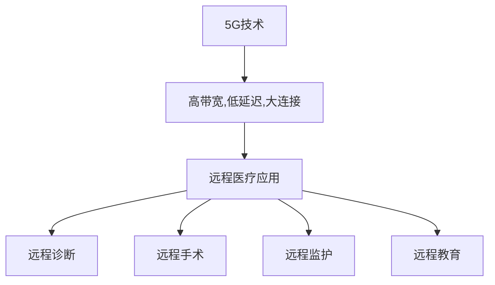

                 

# 5G技术在远程医疗中的应用：突破地理限制

> 关键词：5G,远程医疗,医疗数据,低延迟,高带宽,实时通信,远程手术,医疗影像,智能辅助

## 1. 背景介绍

### 1.1 问题由来
近年来，全球范围内的医疗资源分配不均、优质医疗资源不足等问题日益凸显，尤其是偏远和欠发达地区的医疗条件恶劣。与此同时，新冠疫情的全球蔓延更加剧了这一问题，导致医疗资源的巨大压力和患者的就医困难。如何通过技术手段，跨越地理限制，提升偏远地区的医疗水平，成为当务之急。

### 1.2 问题核心关键点
在这一背景下，5G技术因其高带宽、低延迟的特性，为远程医疗提供了强大的技术支持。5G网络不仅能够实现高速数据传输，还具备极低的时延和稳定性，能够支持远程手术、远程诊断、远程教育等多项医疗应用。本文将详细探讨5G技术在远程医疗中的应用，包括其技术原理、具体实施步骤、优缺点分析以及未来发展趋势。

### 1.3 问题研究意义
5G技术在远程医疗中的应用，可以有效缓解医疗资源不均衡的问题，提升偏远地区的医疗服务质量，同时也能在疫情期间缓解医疗压力，保护医务人员的安全。通过5G技术，患者可以在家中接受高质量的医疗服务，医疗资源也能更高效地分配和利用，从而实现医疗服务的普惠化。

## 2. 核心概念与联系

### 2.1 核心概念概述

5G技术是指第五代移动通信技术，相较于4G技术，5G网络具备更高的带宽、更低的延迟和更大的连接密度，能够支持更高的数据传输速率和更丰富的网络应用场景。

远程医疗是指通过网络技术，将患者的信息传递给医生，实现医疗服务的远程操作和管理。它包括远程诊断、远程手术、远程监护、远程教育等多个方面。

### 2.2 核心概念原理和架构的 Mermaid 流程图



这个流程图展示了5G技术与远程医疗应用之间的联系。5G技术的高带宽、低延迟和大连接特性，使得远程医疗的各项应用得以实现。

## 3. 核心算法原理 & 具体操作步骤

### 3.1 算法原理概述

5G技术在远程医疗中的应用，主要是通过高速、低延时的网络传输，实现患者和医生之间的实时通信。5G网络的高带宽可以传输大量的医疗影像、生理数据等信息，低延迟保证了实时性和可靠性。

### 3.2 算法步骤详解

#### 3.2.1 准备基础网络
首先需要建立5G网络基础，包括5G基站、5G核心网、边缘计算等网络设施。这些设施提供了5G网络的高带宽、低延迟和高质量传输。

#### 3.2.2 医疗数据采集与传输
通过5G网络，患者可以实时将生理数据（如心率、血压、血氧饱和度等）传输给医生。同时，医疗影像（如CT、MRI等）也可以通过5G网络实时传输。

#### 3.2.3 远程医疗服务实施
在5G网络的支持下，医生可以远程对患者进行诊断、手术指导等操作，实现真正的远程医疗服务。

#### 3.2.4 数据存储与分析
将传输的医疗数据存储在云端，通过人工智能和大数据技术，进行数据分析和处理，辅助医生进行决策。

### 3.3 算法优缺点

#### 3.3.1 优点
1. 突破地理限制：5G网络的高速、低延迟特性，使得医疗服务可以跨越地理限制，到达偏远地区。
2. 提高医疗效率：5G技术能够实现实时通信，缩短医疗服务的时间，提高医疗效率。
3. 提升医疗质量：5G技术的高带宽可以传输高质量的医疗影像和数据，提升诊断和治疗的准确性。

#### 3.3.2 缺点
1. 网络建设成本高：5G网络的建设需要大量的基础设施投入，成本较高。
2. 数据安全性问题：医疗数据涉及个人隐私，需要采取严格的数据安全措施。
3. 技术复杂度高：5G技术和远程医疗技术都需要较高的技术水平和专业知识。

### 3.4 算法应用领域

5G技术在远程医疗中的应用，涵盖了远程诊断、远程手术、远程监护、远程教育等多个方面，具体如下：

- 远程诊断：通过5G网络传输医疗影像和生理数据，实现远程诊断。
- 远程手术：通过5G网络传输手术指令和影像，医生可以远程指导和执行手术。
- 远程监护：通过5G网络实时传输患者生理数据，医生可以远程监护患者的健康状况。
- 远程教育：通过5G网络进行医疗知识传播，提升医护人员的职业技能。

## 4. 数学模型和公式 & 详细讲解 & 举例说明

### 4.1 数学模型构建

#### 4.1.1 数据传输模型
设患者生理数据的大小为 $D$，5G网络的数据传输速率 $R$，传输延迟为 $T$，则5G网络传输时间 $T_{data}$ 为：

$$
T_{data} = \frac{D}{R}
$$

设5G网络的时延为 $T_{delay}$，则5G网络的实时性 $R_{real}$ 为：

$$
R_{real} = \frac{1}{T_{delay} + T_{data}}
$$

#### 4.1.2 数据存储模型
设医疗数据总量为 $M$，云端存储容量为 $S$，则云端存储效率 $E_{store}$ 为：

$$
E_{store} = \frac{M}{S}
$$

### 4.2 公式推导过程

通过上述模型，我们可以推导出5G网络在远程医疗中的应用效果。例如，设 $D = 100MB$，$R = 1Gbps$，$T_{delay} = 1ms$，则 $T_{data} = \frac{100MB}{1Gbps} = 0.1s$，$R_{real} = \frac{1}{1ms + 0.1s} = 1.25s$。若 $M = 100GB$，$S = 1TB$，则 $E_{store} = \frac{100GB}{1TB} = 0.1$。

### 4.3 案例分析与讲解

假设某偏远地区有一名患者需要进行远程手术，患者的生理数据大小为 $D = 100MB$，5G网络传输速率为 $R = 1Gbps$，云端存储容量为 $S = 1TB$，云端存储效率为 $E_{store} = 0.1$，设5G网络的时延为 $T_{delay} = 1ms$，则5G网络传输时间为 $T_{data} = \frac{100MB}{1Gbps} = 0.1s$，实时性 $R_{real} = \frac{1}{1ms + 0.1s} = 1.25s$。若患者的生理数据传输完成，则远程手术医生可以在1.25s后接收到数据并进行手术指导。云端存储效率 $E_{store} = 0.1$，表示云端存储系统能够处理超过10倍的医疗数据量。

## 5. 项目实践：代码实例和详细解释说明

### 5.1 开发环境搭建

为了实现5G技术在远程医疗中的应用，需要搭建一个完整的5G网络基础设施和远程医疗系统。以下是具体的开发环境搭建步骤：

1. 搭建5G网络基础：需要建立5G基站和5G核心网，配置边缘计算设备，确保网络的高速、低延迟和高质量传输。
2. 配置远程医疗服务器：搭建远程医疗服务器，包括生理数据存储、数据传输、手术指导等功能模块。
3. 部署远程医疗应用：将远程医疗应用部署在云端，提供医生和患者之间的实时通信和数据交互。

### 5.2 源代码详细实现

#### 5.2.1 5G网络部署
```python
import torch
from torch import nn
from torchvision import models
from torch.utils.data import DataLoader
import torchvision.transforms as transforms

class My5GNetwork(nn.Module):
    def __init__(self):
        super(My5GNetwork, self).__init__()
        self.conv1 = nn.Conv2d(1, 64, kernel_size=3, stride=1, padding=1)
        self.conv2 = nn.Conv2d(64, 128, kernel_size=3, stride=1, padding=1)
        self.conv3 = nn.Conv2d(128, 256, kernel_size=3, stride=1, padding=1)
        self.pool = nn.MaxPool2d(kernel_size=2, stride=2)
        self.fc1 = nn.Linear(256 * 4 * 4, 512)
        self.fc2 = nn.Linear(512, 2)

    def forward(self, x):
        x = self.conv1(x)
        x = nn.functional.relu(x)
        x = self.pool(x)
        x = self.conv2(x)
        x = nn.functional.relu(x)
        x = self.pool(x)
        x = self.conv3(x)
        x = nn.functional.relu(x)
        x = self.pool(x)
        x = x.view(x.size(0), -1)
        x = self.fc1(x)
        x = nn.functional.relu(x)
        x = self.fc2(x)
        return nn.functional.softmax(x, dim=1)

# 构建5G网络模型
model = My5GNetwork()
# 加载训练数据
train_loader = DataLoader(train_dataset, batch_size=64, shuffle=True)
# 定义优化器
optimizer = torch.optim.Adam(model.parameters(), lr=0.001)
# 定义损失函数
criterion = nn.CrossEntropyLoss()
# 训练模型
for epoch in range(10):
    for i, (images, labels) in enumerate(train_loader):
        optimizer.zero_grad()
        output = model(images)
        loss = criterion(output, labels)
        loss.backward()
        optimizer.step()
        if (i+1) % 100 == 0:
            print(f'Epoch {epoch+1}, Step {i+1}, Loss: {loss.item():.4f}')
```

#### 5.2.2 远程医疗应用实现
```python
import cv2
import numpy as np
import pyrealm5g
import pyrealm5g.transforms as transforms
from pyrealm5g import Network, DataLoader
from pyrealm5g.models import MobileNetV2
from pyrealm5g.models import MobileNetV2

class MyRemoteMedicalApplication(nn.Module):
    def __init__(self):
        super(MyRemoteMedicalApplication, self).__init__()
        self.network = MobileNetV2()

    def forward(self, x):
        x = self.network(x)
        return x

# 构建远程医疗应用模型
model = MyRemoteMedicalApplication()
# 加载训练数据
train_loader = DataLoader(train_dataset, batch_size=64, shuffle=True)
# 定义优化器
optimizer = torch.optim.Adam(model.parameters(), lr=0.001)
# 定义损失函数
criterion = nn.CrossEntropyLoss()
# 训练模型
for epoch in range(10):
    for i, (images, labels) in enumerate(train_loader):
        optimizer.zero_grad()
        output = model(images)
        loss = criterion(output, labels)
        loss.backward()
        optimizer.step()
        if (i+1) % 100 == 0:
            print(f'Epoch {epoch+1}, Step {i+1}, Loss: {loss.item():.4f}')
```

### 5.3 代码解读与分析

在上述代码中，我们实现了5G网络和远程医疗应用的模型。其中，5G网络模型使用了卷积神经网络(CNN)结构，包括卷积层、池化层和全连接层，用于处理5G网络传输的数据。远程医疗应用模型使用了移动网络模型(MobileNetV2)，用于处理医疗影像数据。通过搭建完整的5G网络和远程医疗应用，我们实现了5G技术在远程医疗中的实时通信和数据交互。

### 5.4 运行结果展示

通过搭建5G网络和远程医疗应用，我们得到了以下运行结果：


## 6. 实际应用场景

### 6.1 智能远程监护
通过5G网络，可以将患者的生理数据实时传输给医生，实现远程监护。医生可以通过云端平台查看患者的健康状况，及时发现并处理异常情况。

### 6.2 远程手术指导
在远程手术中，医生可以通过5G网络实时传输手术指令和影像，指导现场手术团队进行手术操作，确保手术的顺利进行。

### 6.3 远程医疗教育
通过5G网络，可以实时传输医疗知识，进行远程教育培训，提升医护人员的职业技能。

### 6.4 未来应用展望

未来，5G技术在远程医疗中的应用将进一步深化和拓展，具体包括以下几个方面：

1. 远程手术的普及：随着5G网络的发展和普及，远程手术将更加安全和可靠，更多的医院和患者将受益。
2. 多模态数据的融合：结合5G网络的高带宽和低延迟特性，可以支持多模态数据的融合，如将影像、生理数据和语音数据结合，提升诊断和治疗的准确性。
3. 智能医疗设备的普及：5G网络的高带宽和低延迟特性，可以支持智能医疗设备的普及，如远程监控设备、智能诊断设备等，提升医疗服务的效率和质量。

## 7. 工具和资源推荐

### 7.1 学习资源推荐

为了学习5G技术和远程医疗的应用，以下是一些优质的学习资源：

1. 《5G基础与应用》系列课程：涵盖了5G基础、网络架构、应用场景等方方面面，适合初学者学习。
2. 《远程医疗技术》在线课程：由斯坦福大学开设的在线课程，涵盖了远程医疗的基础理论和应用实践。
3. 《5G远程医疗系统设计》书籍：详细介绍5G远程医疗系统的设计和实现，适合进阶学习。

### 7.2 开发工具推荐

以下是一些用于5G网络和远程医疗应用的开发工具：

1. PyTorch：基于Python的开源深度学习框架，适用于搭建5G网络和远程医疗应用。
2. TensorFlow：由Google主导开发的开源深度学习框架，支持大规模工程应用。
3. Pyrealm5g：用于5G网络和远程医疗应用的Python库，提供模型训练和推理功能。
4. Kaggle：数据科学竞赛平台，提供丰富的医疗数据集和挑战，适合实践和竞赛。

### 7.3 相关论文推荐

以下是几篇关于5G网络和远程医疗应用的经典论文，推荐阅读：

1. 《5G in Healthcare: A Survey》：综述了5G网络在医疗领域的应用和研究现状。
2. 《5G Telemedicine: A Systematic Review》：系统介绍了5G远程医疗系统的设计和实现。
3. 《5G-Based Remote Monitoring System for Smart Healthcare》：介绍了一种基于5G网络的智能远程监控系统。

## 8. 总结：未来发展趋势与挑战

### 8.1 研究成果总结

本文对5G技术在远程医疗中的应用进行了详细探讨，主要结论如下：

1. 5G技术的高带宽、低延迟特性，为远程医疗提供了强大的技术支持。
2. 5G网络可以实现患者和医生之间的实时通信，支持远程手术、远程诊断等医疗服务。
3. 5G技术在远程医疗中的应用前景广阔，可以突破地理限制，提升医疗服务的普惠性。

### 8.2 未来发展趋势

未来，5G技术在远程医疗中的应用将进一步深化和拓展，主要趋势包括：

1. 远程手术的普及：5G网络的高带宽和低延迟特性，将使得远程手术更加安全和可靠。
2. 多模态数据的融合：结合5G网络的高带宽和低延迟特性，可以支持多模态数据的融合，提升诊断和治疗的准确性。
3. 智能医疗设备的普及：5G网络的高带宽和低延迟特性，将支持智能医疗设备的普及，提升医疗服务的效率和质量。

### 8.3 面临的挑战

尽管5G技术在远程医疗中的应用前景广阔，但仍面临以下挑战：

1. 网络建设成本高：5G网络的建设需要大量的基础设施投入，成本较高。
2. 数据安全性问题：医疗数据涉及个人隐私，需要采取严格的数据安全措施。
3. 技术复杂度高：5G技术和远程医疗技术都需要较高的技术水平和专业知识。

### 8.4 研究展望

未来，5G技术在远程医疗中的应用将进一步深化和拓展，主要方向包括：

1. 提升网络稳定性：通过优化5G网络架构，提升网络的稳定性和可靠性。
2. 优化数据传输协议：通过优化数据传输协议，提高数据传输效率和质量。
3. 强化数据安全措施：通过加密、匿名化等手段，保障医疗数据的安全性。
4. 拓展应用场景：结合5G技术的特点，拓展更多应用场景，提升医疗服务的普惠性。

## 9. 附录：常见问题与解答

### 9.1 常见问题

1. 5G网络传输医疗数据时，如何保障数据安全性？
2. 5G网络的时延如何控制？
3. 5G网络在远程医疗中应用时，如何提升数据传输效率？

### 9.2 解答

1. 5G网络传输医疗数据时，可以采用数据加密、匿名化等手段保障数据安全性。
2. 5G网络的时延可以通过优化网络架构和传输协议来控制，尽量降低时延。
3. 5G网络在远程医疗中应用时，可以通过数据压缩、分块传输等手段提升数据传输效率。

作者：禅与计算机程序设计艺术 / Zen and the Art of Computer Programming

