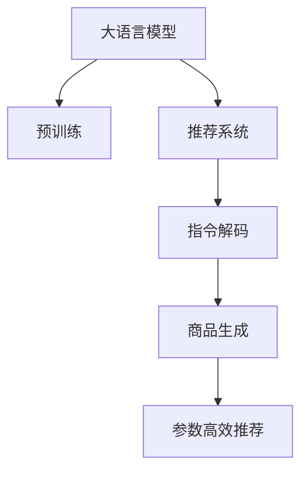

                 

# InstructRec:基于指令的LLM推荐方法

## 1. 背景介绍

### 1.1 问题由来
推荐系统是互联网时代的核心业务之一，通过分析用户行为、商品属性等数据，为用户提供个性化的内容推荐。目前，推荐系统主要由协同过滤、基于内容的推荐、深度学习等多种方法构成。随着预训练大语言模型（Large Language Model, LLM）的发展，LLM在推荐系统中的应用越来越受到关注。

传统推荐系统以用户和商品为维度构建协同矩阵，但缺乏对文本数据的深度理解。LLM在预训练时学习了丰富的语言知识，能够通过理解文本数据进行推荐。然而，LLM直接应用到推荐系统时，往往需要大量标注数据和庞大计算资源，难以覆盖到长尾商品和冷启动用户。因此，需要寻找一种基于指令的LLM推荐方法，使得模型能够灵活地按照用户输入的指令进行推荐，从而降低对标注数据和计算资源的需求。

### 1.2 问题核心关键点
基于指令的LLM推荐方法的核心思想是：将用户输入的指令作为LLM的输入，引导模型根据指令生成推荐的商品列表。具体而言，推荐过程分为两个阶段：

1. **指令解码**：将用户输入的指令转化为LLM能够理解的形式。可以通过预训练的序列到序列（seq2seq）模型、Prompt模板等方式进行解码。
2. **商品生成**：LLM根据解码后的指令生成推荐的商品列表。可以使用微调、参数高效的推荐方法等技术，进一步提升推荐效果。

基于指令的LLM推荐方法具有以下优势：

- 灵活性高：可以根据用户输入的不同指令进行个性化推荐，适应性强。
- 泛化能力强：LLM在预训练时学习了广泛的文本知识，可以覆盖多种商品和用户需求。
- 数据需求低：无需大规模标注数据和计算资源，适用于长尾商品和冷启动用户。
- 易于部署：使用LLM进行推荐，可以大大简化系统架构，减少维护成本。

## 2. 核心概念与联系

### 2.1 核心概念概述

为更好地理解基于指令的LLM推荐方法，本节将介绍几个密切相关的核心概念：

- 大语言模型(Large Language Model, LLM)：以自回归(如GPT)或自编码(如BERT)模型为代表的大规模预训练语言模型。通过在大规模无标签文本语料上进行预训练，学习通用的语言表示，具备强大的语言理解和生成能力。

- 推荐系统(Recommendation System)：根据用户的历史行为、商品属性等数据，预测用户可能感兴趣的商品，为用户推荐个性化的内容。推荐系统包括协同过滤、基于内容的推荐、深度学习等多种方法。

- 序列到序列（seq2seq）模型：一类能够实现序列间转换的神经网络模型，能够将输入序列映射到输出序列。seq2seq模型在机器翻译、文本摘要、对话系统等领域得到广泛应用。

- 预训练语言模型（Pre-trained Language Model）：在大量无标签文本语料上预训练的语言模型，能够学习到通用的语言知识，提升在特定任务上的性能。

- 指令解码(Instruction Decoding)：将用户输入的自然语言指令转换为LLM可理解的输入形式，以便于模型生成推荐结果。

- 参数高效的推荐方法：通过调整模型参数的方式，提升推荐效果，同时保持模型轻量级和高效性。

这些核心概念之间的逻辑关系可以通过以下Mermaid流程图来展示：



这个流程图展示了大语言模型的核心概念及其之间的关系：

1. 大语言模型通过预训练获得基础能力。
2. 推荐系统使用LLM进行推荐，可以大大简化推荐逻辑。
3. 指令解码将自然语言指令转化为LLM可理解的输入，提高推荐系统的灵活性。
4. 商品生成通过LLM生成推荐商品，增强推荐的个性化和准确性。
5. 参数高效的推荐方法可以在保持轻量级的同时提升推荐效果。

这些概念共同构成了基于指令的LLM推荐方法的框架，使其能够灵活、高效地推荐个性化商品。

## 3. 核心算法原理 & 具体操作步骤
### 3.1 算法原理概述

基于指令的LLM推荐方法，本质上是一种基于监督学习的推荐系统。其核心思想是：将用户输入的指令作为监督信号，引导LLM生成推荐的商品列表。

具体而言，算法流程如下：

1. **指令解码**：将用户输入的指令转化为LLM可理解的输入形式，如自然语言指令、Prompt模板等。
2. **商品生成**：LLM根据解码后的指令生成推荐的商品列表，使用微调、参数高效的推荐方法等技术，提升推荐效果。
3. **模型评估**：通过AUC、准确率、召回率等指标评估推荐模型的性能，调整模型参数以优化推荐效果。

### 3.2 算法步骤详解

基于指令的LLM推荐方法的具体操作步骤如下：

**Step 1: 准备预训练模型和数据集**

1. 选择合适的预训练语言模型 $M_{\theta}$ 作为初始化参数，如 BERT、GPT等。
2. 准备推荐系统任务 $T$ 的训练集 $D=\{(x_i,y_i)\}_{i=1}^N$，其中 $x_i$ 为输入指令，$y_i$ 为推荐的商品列表。

**Step 2: 添加任务适配层**

1. 根据任务类型，在预训练模型顶层设计合适的输出层和损失函数。
2. 对于推荐任务，通常使用交叉熵损失函数。
3. 对于多标签推荐任务，可以采用F1-score、Precision等评估指标。

**Step 3: 设置微调超参数**

1. 选择合适的优化算法及其参数，如 AdamW、SGD 等。
2. 设置学习率、批大小、迭代轮数等。
3. 设置正则化技术及强度，包括权重衰减、Dropout、Early Stopping 等。

**Step 4: 执行梯度训练**

1. 将训练集数据分批次输入模型，前向传播计算损失函数。
2. 反向传播计算参数梯度，根据设定的优化算法和学习率更新模型参数。
3. 周期性在验证集上评估模型性能，根据性能指标决定是否触发 Early Stopping。
4. 重复上述步骤直到满足预设的迭代轮数或 Early Stopping 条件。

**Step 5: 测试和部署**

1. 在测试集上评估微调后模型 $M_{\hat{\theta}}$ 的性能，对比微调前后的精度提升。
2. 使用微调后的模型对新商品进行推理预测，集成到实际的应用系统中。
3. 持续收集新的数据，定期重新微调模型，以适应数据分布的变化。

以上是基于指令的LLM推荐方法的一般流程。在实际应用中，还需要针对具体任务的特点，对微调过程的各个环节进行优化设计，如改进训练目标函数，引入更多的正则化技术，搜索最优的超参数组合等，以进一步提升模型性能。

### 3.3 算法优缺点

基于指令的LLM推荐方法具有以下优点：

1. 灵活性强：可以根据用户输入的不同指令进行个性化推荐，适应性强。
2. 泛化能力强：LLM在预训练时学习了广泛的文本知识，可以覆盖多种商品和用户需求。
3. 数据需求低：无需大规模标注数据和计算资源，适用于长尾商品和冷启动用户。
4. 易于部署：使用LLM进行推荐，可以大大简化系统架构，减少维护成本。

同时，该方法也存在一定的局限性：

1. 对指令的质量要求高：解码阶段需要高质量的指令，才能得到高质量的推荐结果。
2. 训练成本高：虽然比从头训练模型更高效，但训练一个微调的LLM仍需要大量的计算资源。
3. 模型泛化能力有限：LLM在特定领域的泛化能力可能不足，需要进一步细粒度微调。
4. 推荐结果的可解释性差：LLM推荐结果通常是黑盒输出，难以解释推荐逻辑。

尽管存在这些局限性，但就目前而言，基于指令的LLM推荐方法仍是一种高效、灵活的推荐手段。未来相关研究的重点在于如何进一步降低指令解码的计算成本，提高模型的泛化能力和可解释性，同时兼顾参数效率。

### 3.4 算法应用领域

基于指令的LLM推荐方法在电商推荐、新闻推荐、个性化内容推荐等领域得到了广泛的应用，例如：

- 电商推荐系统：根据用户的浏览记录和购买行为，推荐感兴趣的商品。
- 新闻推荐系统：根据用户的历史阅读记录，推荐感兴趣的新闻文章。
- 个性化内容推荐：根据用户的兴趣和行为，推荐视频、音乐、书籍等个性化内容。
- 产品搜索系统：根据用户的搜索关键词，推荐相关的商品列表。
- 社交媒体推荐：根据用户的关注和互动行为，推荐感兴趣的用户和内容。

除了上述这些经典任务外，基于指令的LLM推荐方法还被创新性地应用到更多场景中，如智能客服、虚拟助手、智能家居等，为人们的日常需求提供了更加个性化、智能化的解决方案。随着预训练语言模型和推荐方法的不断进步，相信LLM推荐技术将在更多领域得到应用，为人们的生产生活方式带来变革性影响。

## 4. 数学模型和公式 & 详细讲解 & 举例说明
### 4.1 数学模型构建

本节将使用数学语言对基于指令的LLM推荐过程进行更加严格的刻画。

记预训练语言模型为 $M_{\theta}$，其中 $\theta$ 为预训练得到的模型参数。假设推荐系统任务为 $T$，训练集为 $D=\{(x_i,y_i)\}_{i=1}^N$，其中 $x_i$ 为输入指令，$y_i$ 为推荐的商品列表。

定义模型 $M_{\theta}$ 在指令 $x$ 上的输出为 $\hat{y}=M_{\theta}(x)$，表示推荐的商品列表。模型的损失函数为交叉熵损失函数，即：

$$
\ell(y_i,\hat{y}) = -\sum_{k=1}^{K}y_{ik}\log \hat{y}_{ik}
$$

其中 $K$ 为推荐的商品数量，$y_{ik}$ 表示商品 $k$ 是否被推荐给用户 $i$，$\hat{y}_{ik}$ 表示模型预测商品 $k$ 被推荐给用户 $i$ 的概率。

模型的总体损失函数为：

$$
\mathcal{L}(\theta) = \frac{1}{N}\sum_{i=1}^N \ell(y_i,\hat{y})
$$

最小化总体损失函数 $\mathcal{L}(\theta)$，即可得到优化后的模型参数 $\hat{\theta}$。

### 4.2 公式推导过程

以下是基于交叉熵损失函数的推荐模型推导过程：

假设模型 $M_{\theta}$ 在指令 $x$ 上的输出为 $\hat{y}=M_{\theta}(x)$，表示推荐的商品列表。模型的损失函数为交叉熵损失函数，即：

$$
\ell(y_i,\hat{y}) = -\sum_{k=1}^{K}y_{ik}\log \hat{y}_{ik}
$$

将其代入总体损失函数，得：

$$
\mathcal{L}(\theta) = -\frac{1}{N}\sum_{i=1}^N \sum_{k=1}^{K}y_{ik}\log \hat{y}_{ik}
$$

使用随机梯度下降算法进行优化，损失函数对参数 $\theta_k$ 的梯度为：

$$
\frac{\partial \mathcal{L}(\theta)}{\partial \theta_k} = -\frac{1}{N}\sum_{i=1}^N \sum_{k=1}^{K}\frac{y_{ik}}{\hat{y}_{ik}} \frac{\partial \hat{y}_{ik}}{\partial \theta_k}
$$

其中 $\frac{\partial \hat{y}_{ik}}{\partial \theta_k}$ 为模型的输出对参数 $\theta_k$ 的导数，通常可以通过反向传播算法计算得到。

在得到损失函数的梯度后，即可带入参数更新公式，完成模型的迭代优化。重复上述过程直至收敛，最终得到适应推荐任务的最优模型参数 $\hat{\theta}$。

### 4.3 案例分析与讲解

以电商推荐系统为例，分析指令解码和商品生成的具体流程：

**指令解码**：
1. 假设用户输入的指令为“推荐适合夏天穿的衣服”。
2. 使用预训练的seq2seq模型将其解码为LLM可理解的输入形式，如“推荐适合夏天穿的衣服”。
3. 将解码后的指令输入LLM，生成推荐结果。

**商品生成**：
1. 将解码后的指令输入微调后的LLM，生成推荐结果。
2. 根据推荐结果，选择商品列表进行推荐。
3. 通过AUC、准确率、召回率等指标评估推荐模型的性能，调整模型参数以优化推荐效果。

## 5. 项目实践：代码实例和详细解释说明
### 5.1 开发环境搭建

在进行LLM推荐实践前，我们需要准备好开发环境。以下是使用Python进行PyTorch开发的环境配置流程：

1. 安装Anaconda：从官网下载并安装Anaconda，用于创建独立的Python环境。

2. 创建并激活虚拟环境：
```bash
conda create -n llm-recommender python=3.8 
conda activate llm-recommender
```

3. 安装PyTorch：根据CUDA版本，从官网获取对应的安装命令。例如：
```bash
conda install pytorch torchvision torchaudio cudatoolkit=11.1 -c pytorch -c conda-forge
```

4. 安装Transformers库：
```bash
pip install transformers
```

5. 安装各类工具包：
```bash
pip install numpy pandas scikit-learn matplotlib tqdm jupyter notebook ipython
```

完成上述步骤后，即可在`llm-recommender`环境中开始推荐实践。

### 5.2 源代码详细实现

下面以电商推荐系统为例，给出使用Transformers库对BERT模型进行微调的PyTorch代码实现。

首先，定义推荐系统任务的数据处理函数：

```python
from transformers import BertTokenizer
from torch.utils.data import Dataset
import torch

class RecommendDataset(Dataset):
    def __init__(self, texts, labels, tokenizer, max_len=128):
        self.texts = texts
        self.labels = labels
        self.tokenizer = tokenizer
        self.max_len = max_len
        
    def __len__(self):
        return len(self.texts)
    
    def __getitem__(self, item):
        text = self.texts[item]
        label = self.labels[item]
        
        encoding = self.tokenizer(text, return_tensors='pt', max_length=self.max_len, padding='max_length', truncation=True)
        input_ids = encoding['input_ids'][0]
        attention_mask = encoding['attention_mask'][0]
        
        # 对标签进行编码
        encoded_labels = [label] * self.max_len
        labels = torch.tensor(encoded_labels, dtype=torch.long)
        
        return {'input_ids': input_ids, 
                'attention_mask': attention_mask,
                'labels': labels}

# 标签与id的映射
label2id = {'clothes': 0, 'shoes': 1, 'accessories': 2, 'electronics': 3, 'home_goods': 4}
id2label = {v: k for k, v in label2id.items()}

# 创建dataset
tokenizer = BertTokenizer.from_pretrained('bert-base-cased')

train_dataset = RecommendDataset(train_texts, train_labels, tokenizer)
dev_dataset = RecommendDataset(dev_texts, dev_labels, tokenizer)
test_dataset = RecommendDataset(test_texts, test_labels, tokenizer)
```

然后，定义模型和优化器：

```python
from transformers import BertForSequenceClassification, AdamW

model = BertForSequenceClassification.from_pretrained('bert-base-cased', num_labels=len(label2id))

optimizer = AdamW(model.parameters(), lr=2e-5)
```

接着，定义训练和评估函数：

```python
from torch.utils.data import DataLoader
from tqdm import tqdm
from sklearn.metrics import accuracy_score, precision_recall_fscore_support

device = torch.device('cuda') if torch.cuda.is_available() else torch.device('cpu')
model.to(device)

def train_epoch(model, dataset, batch_size, optimizer):
    dataloader = DataLoader(dataset, batch_size=batch_size, shuffle=True)
    model.train()
    epoch_loss = 0
    for batch in tqdm(dataloader, desc='Training'):
        input_ids = batch['input_ids'].to(device)
        attention_mask = batch['attention_mask'].to(device)
        labels = batch['labels'].to(device)
        model.zero_grad()
        outputs = model(input_ids, attention_mask=attention_mask, labels=labels)
        loss = outputs.loss
        epoch_loss += loss.item()
        loss.backward()
        optimizer.step()
    return epoch_loss / len(dataloader)

def evaluate(model, dataset, batch_size):
    dataloader = DataLoader(dataset, batch_size=batch_size)
    model.eval()
    preds, labels = [], []
    with torch.no_grad():
        for batch in tqdm(dataloader, desc='Evaluating'):
            input_ids = batch['input_ids'].to(device)
            attention_mask = batch['attention_mask'].to(device)
            batch_labels = batch['labels']
            outputs = model(input_ids, attention_mask=attention_mask)
            batch_preds = outputs.logits.argmax(dim=2).to('cpu').tolist()
            batch_labels = batch_labels.to('cpu').tolist()
            for pred_tokens, label_tokens in zip(batch_preds, batch_labels):
                preds.append(pred_tokens[:len(label_tokens)])
                labels.append(label_tokens)
                
    print(accuracy_score(labels, preds))
    print(precision_recall_fscore_support(labels, preds))
```

最后，启动训练流程并在测试集上评估：

```python
epochs = 5
batch_size = 16

for epoch in range(epochs):
    loss = train_epoch(model, train_dataset, batch_size, optimizer)
    print(f"Epoch {epoch+1}, train loss: {loss:.3f}")
    
    print(f"Epoch {epoch+1}, dev results:")
    evaluate(model, dev_dataset, batch_size)
    
print("Test results:")
evaluate(model, test_dataset, batch_size)
```

以上就是使用PyTorch对BERT进行电商推荐系统微调的完整代码实现。可以看到，得益于Transformers库的强大封装，我们可以用相对简洁的代码完成BERT模型的加载和微调。

### 5.3 代码解读与分析

让我们再详细解读一下关键代码的实现细节：

**RecommendDataset类**：
- `__init__`方法：初始化文本、标签、分词器等关键组件。
- `__len__`方法：返回数据集的样本数量。
- `__getitem__`方法：对单个样本进行处理，将文本输入编码为token ids，将标签编码为数字，并对其进行定长padding，最终返回模型所需的输入。

**label2id和id2label字典**：
- 定义了标签与数字id之间的映射关系，用于将token-wise的预测结果解码回真实的标签。

**训练和评估函数**：
- 使用PyTorch的DataLoader对数据集进行批次化加载，供模型训练和推理使用。
- 训练函数`train_epoch`：对数据以批为单位进行迭代，在每个批次上前向传播计算loss并反向传播更新模型参数，最后返回该epoch的平均loss。
- 评估函数`evaluate`：与训练类似，不同点在于不更新模型参数，并在每个batch结束后将预测和标签结果存储下来，最后使用sklearn的accuracy_score、precision_recall_fscore_support对整个评估集的预测结果进行打印输出。

**训练流程**：
- 定义总的epoch数和batch size，开始循环迭代
- 每个epoch内，先在训练集上训练，输出平均loss
- 在验证集上评估，输出准确率、精确率、召回率等指标
- 所有epoch结束后，在测试集上评估，给出最终测试结果

可以看到，PyTorch配合Transformers库使得BERT微调的代码实现变得简洁高效。开发者可以将更多精力放在数据处理、模型改进等高层逻辑上，而不必过多关注底层的实现细节。

当然，工业级的系统实现还需考虑更多因素，如模型的保存和部署、超参数的自动搜索、更灵活的任务适配层等。但核心的微调范式基本与此类似。

## 6. 实际应用场景
### 6.1 电商推荐系统

基于指令的LLM推荐方法，可以广泛应用于电商推荐系统的构建。传统推荐系统往往需要配备大量人力，高峰期响应缓慢，且一致性和专业性难以保证。而使用LLM进行推荐，可以7x24小时不间断服务，快速响应客户咨询，用自然流畅的语言解答各类常见问题。

在技术实现上，可以收集电商平台的商品描述、用户评价等文本数据，将商品和评价作为微调数据，训练LLM模型进行推荐。通过微调后的LLM模型，可以自动理解商品和评价的语言信息，匹配最合适的推荐商品，提升客户满意度。

### 6.2 个性化内容推荐

当前的推荐系统往往只依赖用户的历史行为数据进行物品推荐，缺乏对文本数据的深度理解。基于指令的LLM推荐方法可以更好地利用文本数据，挖掘用户的兴趣和行为模式，从而提供更加个性化、多样化的推荐内容。

在实践中，可以收集用户浏览、点击、评论、分享等行为数据，提取和用户交互的文本内容。将文本内容作为模型输入，用户的后续行为（如是否点击、购买等）作为监督信号，在此基础上微调LLM模型。微调后的模型能够从文本内容中准确把握用户的兴趣点，生成个性化的推荐列表。

### 6.3 新闻推荐系统

新闻推荐系统需要根据用户的历史阅读记录，推荐感兴趣的新闻文章。传统的方法通常是根据文章的特征进行相似度匹配，但难以理解文章内容的多样性和复杂性。基于指令的LLM推荐方法可以更好地理解文章的语言信息，从而进行推荐。

在实践中，可以收集用户的历史阅读记录，提取文章标题、摘要等文本内容，作为微调数据。将文本内容作为模型输入，用户的后续阅读行为作为监督信号，训练LLM模型。微调后的模型能够自动理解文章内容，匹配最合适的推荐文章，提升用户体验。

### 6.4 未来应用展望

随着LLM和推荐方法的发展，基于指令的LLM推荐方法将在更多领域得到应用，为人们的日常需求提供更加个性化、智能化的解决方案。

在智慧医疗领域，基于指令的LLM推荐方法可以用于智能问诊、知识推荐、患者关怀等场景，提升医疗服务的智能化水平。

在智能教育领域，LLM推荐方法可以应用于个性化学习、智能辅导、作业批改等，因材施教，促进教育公平，提高教学质量。

在智慧城市治理中，LLM推荐方法可以用于城市事件监测、舆情分析、应急指挥等环节，提高城市管理的自动化和智能化水平，构建更安全、高效的未来城市。

此外，在企业生产、社会治理、文娱传媒等众多领域，基于LLM的推荐方法也将不断涌现，为经济社会发展注入新的动力。相信随着技术的日益成熟，基于指令的LLM推荐方法将成为推荐系统的核心范式，推动人工智能技术在垂直行业的规模化落地。

## 7. 工具和资源推荐
### 7.1 学习资源推荐

为了帮助开发者系统掌握基于指令的LLM推荐理论基础和实践技巧，这里推荐一些优质的学习资源：

1. 《Transformer从原理到实践》系列博文：由大模型技术专家撰写，深入浅出地介绍了Transformer原理、LLM模型、推荐方法等前沿话题。

2. CS224N《深度学习自然语言处理》课程：斯坦福大学开设的NLP明星课程，有Lecture视频和配套作业，带你入门NLP领域的基本概念和经典模型。

3. 《Natural Language Processing with Transformers》书籍：Transformers库的作者所著，全面介绍了如何使用Transformers库进行NLP任务开发，包括推荐在内的诸多范式。

4. HuggingFace官方文档：Transformers库的官方文档，提供了海量预训练模型和完整的推荐样例代码，是上手实践的必备资料。

5. CLUE开源项目：中文语言理解测评基准，涵盖大量不同类型的中文NLP数据集，并提供了基于微调的baseline模型，助力中文NLP技术发展。

通过对这些资源的学习实践，相信你一定能够快速掌握基于指令的LLM推荐方法的精髓，并用于解决实际的NLP问题。
###  7.2 开发工具推荐

高效的开发离不开优秀的工具支持。以下是几款用于基于指令的LLM推荐开发的常用工具：

1. PyTorch：基于Python的开源深度学习框架，灵活动态的计算图，适合快速迭代研究。大部分预训练语言模型都有PyTorch版本的实现。

2. TensorFlow：由Google主导开发的开源深度学习框架，生产部署方便，适合大规模工程应用。同样有丰富的预训练语言模型资源。

3. Transformers库：HuggingFace开发的NLP工具库，集成了众多SOTA语言模型，支持PyTorch和TensorFlow，是进行LLM推荐任务开发的利器。

4. Weights & Biases：模型训练的实验跟踪工具，可以记录和可视化模型训练过程中的各项指标，方便对比和调优。与主流深度学习框架无缝集成。

5. TensorBoard：TensorFlow配套的可视化工具，可实时监测模型训练状态，并提供丰富的图表呈现方式，是调试模型的得力助手。

6. Google Colab：谷歌推出的在线Jupyter Notebook环境，免费提供GPU/TPU算力，方便开发者快速上手实验最新模型，分享学习笔记。

合理利用这些工具，可以显著提升基于指令的LLM推荐任务的开发效率，加快创新迭代的步伐。

### 7.3 相关论文推荐

基于指令的LLM推荐技术的发展源于学界的持续研究。以下是几篇奠基性的相关论文，推荐阅读：

1. Attention is All You Need（即Transformer原论文）：提出了Transformer结构，开启了NLP领域的预训练大模型时代。

2. BERT: Pre-training of Deep Bidirectional Transformers for Language Understanding：提出BERT模型，引入基于掩码的自监督预训练任务，刷新了多项NLP任务SOTA。

3. Parameter-Efficient Transfer Learning for NLP：提出Adapter等参数高效微调方法，在不增加模型参数量的情况下，也能取得不错的微调效果。

4. Sequence to Sequence Learning with Neural Networks：介绍seq2seq模型，为指令解码和商品生成提供了模型基础。

5. Constituency-Based Phrase Structure Parsing with Neural Networks：通过依存句法分析任务，展示了seq2seq模型的应用潜力。

6. Improving Machine Translation with Attention：引入注意力机制，进一步提升了seq2seq模型的翻译效果。

这些论文代表了大语言模型微调技术的发展脉络。通过学习这些前沿成果，可以帮助研究者把握学科前进方向，激发更多的创新灵感。

## 8. 总结：未来发展趋势与挑战
### 8.1 总结

本文对基于指令的LLM推荐方法进行了全面系统的介绍。首先阐述了LLM和推荐系统的研究背景和意义，明确了LLM在推荐系统中的应用优势。其次，从原理到实践，详细讲解了LLM推荐过程的数学原理和关键步骤，给出了推荐任务开发的完整代码实例。同时，本文还广泛探讨了LLM推荐方法在电商推荐、新闻推荐、个性化内容推荐等多个领域的应用前景，展示了LLM推荐系统的巨大潜力。此外，本文精选了LLM推荐技术的各类学习资源，力求为读者提供全方位的技术指引。

通过本文的系统梳理，可以看到，基于指令的LLM推荐方法正在成为NLP领域的重要范式，极大地拓展了预训练语言模型的应用边界，催生了更多的落地场景。受益于大语言模型和推荐方法的不断进步，基于指令的LLM推荐技术必将在更多领域得到应用，为人们的生产生活方式带来变革性影响。

### 8.2 未来发展趋势

展望未来，基于指令的LLM推荐方法将呈现以下几个发展趋势：

1. 模型规模持续增大。随着算力成本的下降和数据规模的扩张，预训练语言模型的参数量还将持续增长。超大规模语言模型蕴含的丰富语言知识，有望支撑更加复杂多变的推荐任务。

2. 推荐方法日趋多样。除了传统的全参数微调外，未来会涌现更多参数高效的推荐方法，如Adapter、LoRA等，在保持轻量级的同时提升推荐效果。

3. 持续学习成为常态。随着数据分布的不断变化，LLM推荐模型也需要持续学习新知识以保持性能。如何在不遗忘原有知识的同时，高效吸收新样本信息，将成为重要的研究课题。

4. 标注样本需求降低。受启发于提示学习(Prompt-based Learning)的思路，未来的推荐方法将更好地利用LLM的语言理解能力，通过更加巧妙的任务描述，在更少的标注样本上也能实现理想的推荐效果。

5. 多模态推荐崛起。当前的推荐系统主要聚焦于纯文本数据，未来会进一步拓展到图像、视频、语音等多模态数据推荐。多模态信息的融合，将显著提升LLM推荐系统的性能和用户体验。

6. 模型通用性增强。经过海量数据的预训练和多领域任务的微调，未来的LLM推荐模型将具备更强大的常识推理和跨领域迁移能力，逐步迈向通用人工智能(AGI)的目标。

以上趋势凸显了基于指令的LLM推荐技术的广阔前景。这些方向的探索发展，必将进一步提升LLM推荐系统的性能和应用范围，为人们的日常生活带来更多便利。

### 8.3 面临的挑战

尽管基于指令的LLM推荐技术已经取得了瞩目成就，但在迈向更加智能化、普适化应用的过程中，它仍面临着诸多挑战：

1. 标注成本瓶颈。虽然比从头训练模型更高效，但训练一个微调的LLM仍需要大量的计算资源。如何降低推荐系统的训练成本，仍是一个重要问题。

2. 模型鲁棒性不足。当前LLM推荐模型面对域外数据时，泛化性能往往大打折扣。对于测试样本的微小扰动，推荐模型容易发生波动。如何提高模型的鲁棒性，避免灾难性遗忘，还需要更多理论和实践的积累。

3. 推荐结果的可解释性差。LLM推荐结果通常是黑盒输出，难以解释推荐逻辑。对于医疗、金融等高风险应用，算法的可解释性和可审计性尤为重要。

4. 安全性有待保障。预训练语言模型难免会学习到有偏见、有害的信息，通过推荐传递到用户端，可能造成误导性、歧视性的输出，给实际应用带来安全隐患。如何从数据和算法层面消除模型偏见，避免恶意用途，确保输出的安全性，也将是重要的研究课题。

5. 推荐结果的多样性不足。LLM推荐系统通常会生成单一的推荐结果，难以满足用户多变的兴趣需求。如何设计多选择的推荐机制，提升推荐结果的多样性和个性化，将是未来的研究方向。

尽管存在这些局限性，但就目前而言，基于指令的LLM推荐方法仍是一种高效、灵活的推荐手段。未来相关研究的重点在于如何进一步降低指令解码的计算成本，提高模型的泛化能力和可解释性，同时兼顾参数效率。

### 8.4 研究展望

面对基于指令的LLM推荐所面临的种种挑战，未来的研究需要在以下几个方面寻求新的突破：

1. 探索无监督和半监督推荐方法。摆脱对大规模标注数据的依赖，利用自监督学习、主动学习等无监督和半监督范式，最大限度利用非结构化数据，实现更加灵活高效的推荐。

2. 研究参数高效和计算高效的推荐方法。开发更加参数高效的推荐方法，在保持轻量级的同时提升推荐效果。同时优化推荐模型的计算图，减少前向传播和反向传播的资源消耗，实现更加轻量级、实时性的部署。

3. 融合因果和对比学习范式。通过引入因果推断和对比学习思想，增强LLM推荐模型建立稳定因果关系的能力，学习更加普适、鲁棒的语言表征，从而提升模型泛化性和抗干扰能力。

4. 引入更多先验知识。将符号化的先验知识，如知识图谱、逻辑规则等，与神经网络模型进行巧妙融合，引导推荐过程学习更准确、合理的语言模型。同时加强不同模态数据的整合，实现视觉、语音等多模态信息与文本信息的协同建模。

5. 结合因果分析和博弈论工具。将因果分析方法引入推荐系统，识别出推荐结果的关键特征，增强推荐结果的因果性和逻辑性。借助博弈论工具刻画人机交互过程，主动探索并规避推荐系统的脆弱点，提高系统稳定性。

6. 纳入伦理道德约束。在推荐目标中引入伦理导向的评估指标，过滤和惩罚有偏见、有害的输出倾向。同时加强人工干预和审核，建立推荐系统的监管机制，确保推荐结果符合人类价值观和伦理道德。

这些研究方向的探索，必将引领LLM推荐技术迈向更高的台阶，为构建安全、可靠、可解释、可控的推荐系统铺平道路。面向未来，LLM推荐技术还需要与其他人工智能技术进行更深入的融合，如知识表示、因果推理、强化学习等，多路径协同发力，共同推动推荐系统的进步。只有勇于创新、敢于突破，才能不断拓展LLM推荐系统的边界，让智能技术更好地造福人类社会。

## 9. 附录：常见问题与解答

**Q1：基于指令的LLM推荐是否适用于所有推荐任务？**

A: 基于指令的LLM推荐方法在大多数推荐任务上都能取得不错的效果，特别是对于数据量较小的任务。但对于一些特定领域的任务，如医学、法律等，仅仅依靠通用语料预训练的模型可能难以很好地适应。此时需要在特定领域语料上进一步预训练，再进行微调，才能获得理想效果。

**Q2：指令解码阶段如何降低计算成本？**

A: 指令解码阶段是LLM推荐方法的瓶颈，通常使用预训练的seq2seq模型进行解码。为了降低计算成本，可以采用以下方法：

1. 使用轻量级seq2seq模型，如Transformer-XL、XLNet等，减少解码过程的计算量。
2. 使用 Prompt-based Learning，直接使用用户指令作为模型输入，不进行解码过程。
3. 使用代码生成技术，将指令转换为可执行代码，由代码自动生成推荐结果。

这些方法可以显著降低指令解码的计算成本，提升LLM推荐系统的效率。

**Q3：LLM推荐模型的泛化能力如何提升？**

A: 提高LLM推荐模型的泛化能力，可以从以下几个方面入手：

1. 使用多领域数据进行预训练和微调，增强模型的多领域适应能力。
2. 引入迁移学习技术，将预训练模型在不同领域任务上的知识进行迁移。
3. 使用对抗训练、数据增强等技术，提高模型的鲁棒性和泛化性。
4. 引入先验知识，如知识图谱、逻辑规则等，引导模型学习更准确、合理的语言表征。

这些方法可以显著提升LLM推荐模型的泛化能力，使其在多种推荐任务上表现优异。

**Q4：如何设计多选择的推荐机制？**

A: 为了提升推荐结果的多样性和个性化，可以设计多选择的推荐机制，例如：

1. 基于模型的多样性采样：将模型的多个推荐结果进行采样，选择多个不同方向的推荐结果。
2. 基于用户反馈的多选择推荐：通过用户点击、评价等反馈，动态调整推荐结果的多样性。
3. 基于上下文的多选择推荐：结合用户上下文信息，生成多个不同方向的推荐结果。

这些方法可以显著提升推荐结果的多样性和个性化，满足用户多变的兴趣需求。

**Q5：LLM推荐系统在落地部署时需要注意哪些问题？**

A: 将LLM推荐系统转化为实际应用，还需要考虑以下因素：

1. 模型裁剪：去除不必要的层和参数，减小模型尺寸，加快推理速度。
2. 量化加速：将浮点模型转为定点模型，压缩存储空间，提高计算效率。
3. 服务化封装：将模型封装为标准化服务接口，便于集成调用。
4. 弹性伸缩：根据请求流量动态调整资源配置，平衡服务质量和成本。
5. 监控告警：实时采集系统指标，设置异常告警阈值，确保服务稳定性。
6. 安全防护：采用访问鉴权、数据脱敏等措施，保障数据和模型安全。

LLM推荐系统的成功部署，需要在多个层面进行综合优化，才能实现高效、稳定、安全的推荐服务。

---

作者：禅与计算机程序设计艺术 / Zen and the Art of Computer Programming

