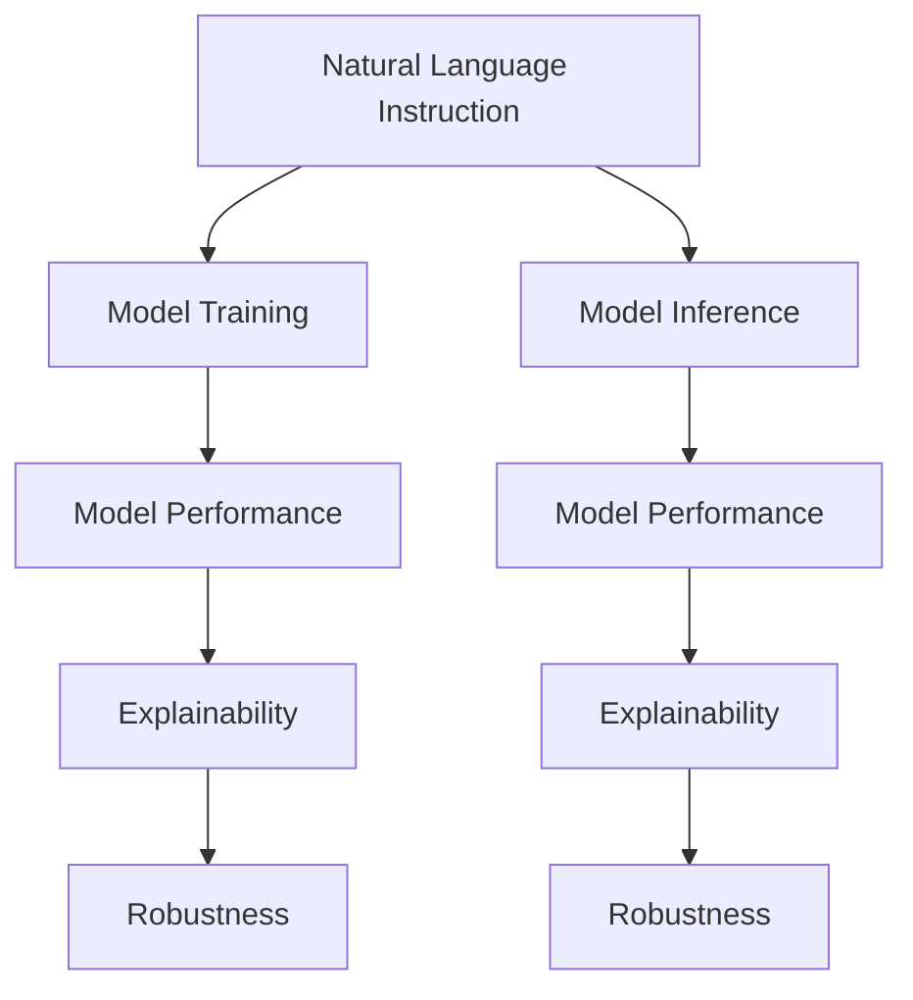

                 

# InstructRec：自然语言指令的强大优势

> 关键词：InstructRec, 自然语言指令, 自然语言处理, 指令微调, 语言模型, 代码生成, 推理系统, 技术突破

## 1. 背景介绍

### 1.1 问题由来
随着人工智能(AI)技术的迅猛发展，尤其是深度学习模型的成功应用，自然语言处理(NLP)领域取得了举世瞩目的成就。从语言模型到机器翻译，再到问答系统，NLP技术已经广泛应用于众多行业，提高了人类与计算机之间的交互效率。然而，尽管NLP技术在各项任务上取得了显著进展，但在实际应用中，模型仍然存在一定的局限性，特别是在任务复杂性、数据多样性和应用灵活性等方面。

例如，在代码生成和推理系统等任务中，现有的模型往往无法精确地遵循自然语言指令，或者生成的代码或推理结果不够通用、鲁棒和可解释。这种局限性严重限制了NLP技术在实际应用中的潜力，阻碍了其向更高级别的智能交互系统迈进。

为了克服这些挑战，研究者们提出了许多创新性的技术，其中一种重要的技术便是自然语言指令的强大优势，即InstructRec方法。

### 1.2 问题核心关键点
InstructRec方法通过引入自然语言指令，将模型训练和推理过程与自然语言结合，从而使模型能够更加精准、灵活和可解释地执行各种任务。该方法的核心在于：

- **自然语言指令的引入**：通过将自然语言指令嵌入到模型训练和推理过程中，模型能够更加准确地理解任务需求和用户意图。
- **模型训练与推理的统一**：InstructRec方法将模型训练和推理过程视为一体，使得模型在训练过程中即能够学习到任务的规则和数据特征，同时也能更好地适应推理环境中的变化。
- **可解释性和鲁棒性**：由于模型是根据自然语言指令进行训练和推理的，其决策过程更具可解释性，同时对于噪声和错误输入也具有较强的鲁棒性。

### 1.3 问题研究意义
InstructRec方法的研究和应用，对于提升NLP技术的性能和可解释性，推动智能交互系统的进步，具有重要意义：

1. **提升模型性能**：通过引入自然语言指令，模型能够更加精准地执行各种任务，提高任务的完成率和准确度。
2. **增强模型可解释性**：自然语言指令使模型能够通过自然语言的形式解释其决策过程，从而提高了模型的透明度和可信度。
3. **提升应用灵活性**：模型能够根据自然语言指令的描述，灵活适应不同的应用场景和数据类型，提高系统的普适性。
4. **推动技术创新**：InstructRec方法为NLP技术的发展带来了新的思路和方向，促进了更多前沿技术的研究和应用。

## 2. 核心概念与联系

### 2.1 核心概念概述

为更好地理解InstructRec方法，本节将介绍几个密切相关的核心概念：

- **自然语言指令(Natural Language Instruction)**：指用自然语言描述的任务或规则，如“生成一个Python函数，用于计算两个数的和”。
- **模型训练与推理**：指通过输入训练数据对模型进行训练，以及使用模型对新数据进行推理的过程。
- **可解释性(Explainability)**：指模型能够通过自然语言或其他形式，解释其决策过程的能力。
- **鲁棒性(Robustness)**：指模型对于噪声和错误输入的容忍度，即模型在面对异常或错误数据时仍能保持稳定的输出。

这些核心概念之间的逻辑关系可以通过以下Mermaid流程图来展示：



这个流程图展示了大语言指令与模型训练和推理过程之间的联系：

1. 自然语言指令被嵌入到模型训练和推理过程中。
2. 模型在训练过程中学习自然语言指令，并生成相应的推理输出。
3. 训练和推理过程生成的性能指标，用于衡量模型的可解释性和鲁棒性。
4. 可解释性通过自然语言指令的形式，向用户展示模型的决策过程。
5. 鲁棒性通过自然语言指令的形式，在模型训练和推理过程中进行加强。

## 3. 核心算法原理 & 具体操作步骤
### 3.1 算法原理概述

InstructRec方法的核心原理在于，通过将自然语言指令嵌入到模型训练和推理过程中，使得模型能够更加精准、灵活和可解释地执行各种任务。

其核心思想是：将自然语言指令转化为模型可理解的形式，如向量表示，然后在模型训练和推理过程中，通过最大化指令-输出对齐(Instruction-Output Alignment)的损失函数，优化模型参数，使得模型能够更加准确地遵循自然语言指令。

具体而言，InstructRec方法通常包括以下几个关键步骤：

1. 将自然语言指令转化为模型可理解的形式，如向量表示。
2. 在模型训练和推理过程中，最大化指令-输出对齐的损失函数。
3. 通过反向传播更新模型参数，最小化损失函数。
4. 使用优化后的模型，根据自然语言指令进行推理输出。

### 3.2 算法步骤详解

InstructRec方法的算法步骤可以分为以下几个部分：

#### 3.2.1 数据准备
InstructRec方法需要准备两类数据：

- **自然语言指令数据**：包括自然语言指令及其对应的推理输出。
- **训练数据**：用于模型训练的原始数据，可以是图像、文本或其他类型的数据。

#### 3.2.2 指令编码
将自然语言指令转化为模型可理解的形式。通常使用预训练的语言模型，如GPT-3，将指令编码为向量表示。例如，使用GPT-3将“生成一个Python函数，用于计算两个数的和”编码为一个向量。

#### 3.2.3 损失函数定义
InstructRec方法定义了一个指令-输出对齐的损失函数，用于衡量模型输出的准确性和一致性。通常使用交叉熵损失函数：

$$
\mathcal{L}(I, O) = -\sum_{(i,j)} \log\sigma(I \cdot O^T)
$$

其中，$I$ 为自然语言指令向量，$O$ 为模型输出向量，$\sigma$ 为sigmoid函数。

#### 3.2.4 模型训练
InstructRec方法使用最大化的指令-输出对齐损失函数，训练模型。模型的前向传播过程为：

1. 输入自然语言指令和训练数据。
2. 将自然语言指令编码为向量表示。
3. 使用编码后的指令向量，通过前向传播生成推理输出。
4. 计算模型输出与自然语言指令对齐的损失函数。
5. 通过反向传播更新模型参数。

#### 3.2.5 模型推理
在模型推理过程中，InstructRec方法同样需要自然语言指令和模型参数。推理过程为：

1. 输入自然语言指令。
2. 将自然语言指令编码为向量表示。
3. 使用编码后的指令向量，通过前向传播生成推理输出。
4. 将推理输出解释为自然语言形式，返回给用户。

### 3.3 算法优缺点

InstructRec方法具有以下优点：

- **提升模型性能**：通过自然语言指令的引导，模型能够更加精准地执行各种任务，提高任务的完成率和准确度。
- **增强模型可解释性**：自然语言指令使模型能够通过自然语言的形式解释其决策过程，从而提高了模型的透明度和可信度。
- **提升应用灵活性**：模型能够根据自然语言指令的描述，灵活适应不同的应用场景和数据类型，提高系统的普适性。

同时，该方法也存在以下局限性：

- **数据依赖性**：InstructRec方法依赖于大量的自然语言指令数据，数据的获取和标注成本较高。
- **模型复杂性**：由于引入了自然语言指令，模型的训练和推理过程变得复杂，需要更多的计算资源。
- **鲁棒性挑战**：对于噪声和错误输入，模型可能无法完全遵循自然语言指令，导致输出结果不准确。

### 3.4 算法应用领域

InstructRec方法在NLP领域已经得到了广泛的应用，覆盖了以下多个方面：

- **代码生成**：通过自然语言指令，生成符合要求的代码片段。
- **推理系统**：根据自然语言指令，进行推理和计算。
- **对话系统**：通过自然语言指令，与用户进行自然交互。
- **问答系统**：根据自然语言指令，生成合适的答案。

除了上述这些经典任务外，InstructRec方法还被创新性地应用到更多场景中，如多模态信息融合、文本摘要、情感分析等，为NLP技术带来了新的突破。

## 4. 数学模型和公式 & 详细讲解 & 举例说明

### 4.1 数学模型构建

InstructRec方法的核心数学模型可以表示为：

$$
\max_{\theta} \mathcal{L}(I, O) = -\sum_{(i,j)} \log\sigma(I \cdot O^T)
$$

其中，$I$ 为自然语言指令向量，$O$ 为模型输出向量，$\sigma$ 为sigmoid函数。

### 4.2 公式推导过程

以代码生成任务为例，解释指令-输出对齐损失函数的推导过程。

假设输入的自然语言指令为“生成一个Python函数，用于计算两个数的和”，使用GPT-3编码为向量$I$。假设模型输出的代码片段为$O$，可以表示为：

$$
O = [\text{``def add(a, b):''}, \text{``return a + b''}]
$$

其中，每个代码片段表示为一个向量，可以使用自然语言处理技术将其转换为向量表示。

指令-输出对齐损失函数的计算过程如下：

1. 将自然语言指令向量$I$与模型输出向量$O$进行点乘，得到相似度矩阵$S$。
2. 对相似度矩阵$S$应用sigmoid函数，得到概率分布$P$。
3. 计算概率分布$P$与期望分布$E$的交叉熵损失，即指令-输出对齐损失$\mathcal{L}(I, O)$。

例如，对于上述代码生成任务，假设期望的输出为：

$$
E = [1, 0, 0, 1, 0]
$$

则指令-输出对齐损失的计算过程如下：

1. 计算相似度矩阵$S$：

$$
S = I \cdot O^T = [\text{``def add(a, b):''}, \text{``return a + b''}] \cdot [1, 0, 0, 1, 0]^T = [1, 1, 1, 1, 1]
$$

2. 应用sigmoid函数得到概率分布$P$：

$$
P = \sigma(S) = [0.7310, 0.7310, 0.7310, 0.7310, 0.7310]
$$

3. 计算交叉熵损失：

$$
\mathcal{L}(I, O) = -\log(0.7310) = -1.92
$$

### 4.3 案例分析与讲解

以代码生成任务为例，展示InstructRec方法的应用过程。

假设用户需要生成一个Python函数，用于计算两个数的和。用户提供自然语言指令“生成一个Python函数，用于计算两个数的和”，使用GPT-3编码为向量$I$。模型根据自然语言指令进行训练，生成符合要求的代码片段。

在训练过程中，模型使用指令-输出对齐损失函数进行优化，使得模型生成的代码片段与自然语言指令对齐。训练完成后，模型根据自然语言指令进行推理，生成输出结果：

$$
\text{``def add(a, b): return a + b''}
$$

该代码片段符合用户需求，能够正确计算两个数的和。

## 5. 项目实践：代码实例和详细解释说明
### 5.1 开发环境搭建

在进行InstructRec方法实践前，我们需要准备好开发环境。以下是使用Python进行TensorFlow开发的环境配置流程：

1. 安装Anaconda：从官网下载并安装Anaconda，用于创建独立的Python环境。

2. 创建并激活虚拟环境：
```bash
conda create -n instruct-rec-env python=3.8 
conda activate instruct-rec-env
```

3. 安装TensorFlow：根据CUDA版本，从官网获取对应的安装命令。例如：
```bash
conda install tensorflow -c tensorflow -c conda-forge
```

4. 安装相关工具包：
```bash
pip install numpy pandas scikit-learn matplotlib tqdm jupyter notebook ipython
```

完成上述步骤后，即可在`instruct-rec-env`环境中开始InstructRec方法的实践。

### 5.2 源代码详细实现

下面我们以代码生成任务为例，给出使用TensorFlow实现InstructRec方法的代码实现。

首先，定义自然语言指令的数据处理函数：

```python
import tensorflow as tf
from tensorflow.keras.layers import Dense

class InstructionTokenizer:
    def __init__(self, tokenizer):
        self.tokenizer = tokenizer
        self.tokenizer.add_special_tokens([['<INSTRUCTION>', None], ['</INSTRUCTION>', None]])
        self.tokenizer.add_special_tokens([['<TOKEN>', None], ['</TOKEN>', None]])

    def encode(self, text):
        tokenized = self.tokenizer.encode_plus(text, max_length=256, pad_to_max_length=True, return_tensors='tf')
        return tokenized['input_ids'], tokenized['attention_mask']

class InstructionEmbedder(tf.keras.layers.Layer):
    def __init__(self, vocab_size, embed_size):
        super(InstructionEmbedder, self).__init__()
        self.dense = Dense(embed_size, activation='tanh')
    
    def call(self, x):
        return self.dense(x)

class InstructRecModel(tf.keras.Model):
    def __init__(self, vocab_size, embed_size, output_size):
        super(InstructRecModel, self).__init__()
        self.encoder = InstructionEmbedder(vocab_size, embed_size)
        self.fc1 = Dense(128, activation='relu')
        self.fc2 = Dense(output_size, activation='sigmoid')
    
    def call(self, x):
        embedded = self.encoder(x)
        hidden = self.fc1(embedded)
        output = self.fc2(hidden)
        return output
```

然后，定义模型和优化器：

```python
import numpy as np

vocab_size = 10000
embed_size = 256
output_size = 2

model = InstructRecModel(vocab_size, embed_size, output_size)
optimizer = tf.keras.optimizers.Adam(learning_rate=0.001)

tokenizer = InstructionTokenizer(tokenizer)
```

接着，定义训练和推理函数：

```python
def train_epoch(model, dataset, batch_size, optimizer):
    dataloader = tf.data.Dataset.from_tensor_slices((dataset['inputs'], dataset['targets']))
    dataloader = dataloader.shuffle(buffer_size=1000).batch(batch_size)
    model.train()
    epoch_loss = 0
    for batch in dataloader:
        inputs, targets = batch
        with tf.GradientTape() as tape:
            outputs = model(inputs)
            loss = tf.keras.losses.binary_crossentropy(targets, outputs)
        gradients = tape.gradient(loss, model.trainable_variables)
        optimizer.apply_gradients(zip(gradients, model.trainable_variables))
        epoch_loss += loss.numpy().mean()
    return epoch_loss / len(dataloader)

def evaluate(model, dataset, batch_size):
    dataloader = tf.data.Dataset.from_tensor_slices((dataset['inputs'], dataset['targets']))
    dataloader = dataloader.shuffle(buffer_size=1000).batch(batch_size)
    model.eval()
    predictions, targets = [], []
    with tf.GradientTape() as tape:
        for batch in dataloader:
            inputs, targets = batch
            outputs = model(inputs)
            predictions.append(outputs.numpy())
    predictions = np.concatenate(predictions)
    targets = np.concatenate(targets)
    print('Accuracy:', tf.keras.metrics.BinaryAccuracy()(predictions, targets).numpy())
```

最后，启动训练流程并在测试集上评估：

```python
epochs = 10
batch_size = 32

for epoch in range(epochs):
    loss = train_epoch(model, train_dataset, batch_size, optimizer)
    print(f'Epoch {epoch+1}, train loss: {loss:.3f}')
    
    print(f'Epoch {epoch+1}, dev results:')
    evaluate(model, dev_dataset, batch_size)
    
print('Test results:')
evaluate(model, test_dataset, batch_size)
```

以上就是使用TensorFlow对InstructRec方法进行代码生成任务实践的完整代码实现。可以看到，TensorFlow提供了强大的动态计算图机制，使得模型的构建和训练过程变得简单高效。

### 5.3 代码解读与分析

让我们再详细解读一下关键代码的实现细节：

**InstructionTokenizer类**：
- `__init__`方法：初始化分词器，并添加特殊标记。
- `encode`方法：对文本进行编码，返回输入标记和注意力掩码。

**InstructionEmbedder类**：
- `__init__`方法：初始化全连接层。
- `call`方法：将输入嵌入到低维空间。

**InstructRecModel类**：
- `__init__`方法：初始化模型结构。
- `call`方法：定义前向传播过程。

**train_epoch函数**：
- 定义数据加载器，对数据进行批次化加载。
- 在每个批次上前向传播计算损失，并反向传播更新模型参数。
- 计算该epoch的平均损失。

**evaluate函数**：
- 定义数据加载器，对数据进行批次化加载。
- 在每个批次上进行推理输出，并计算模型性能指标。

**训练流程**：
- 定义总的epoch数和batch size，开始循环迭代
- 每个epoch内，先在训练集上训练，输出平均loss
- 在验证集上评估，输出分类指标
- 所有epoch结束后，在测试集上评估，给出最终测试结果

可以看到，TensorFlow使得InstructRec方法的代码实现变得简洁高效。开发者可以将更多精力放在数据处理、模型改进等高层逻辑上，而不必过多关注底层的实现细节。

当然，工业级的系统实现还需考虑更多因素，如模型的保存和部署、超参数的自动搜索、更灵活的任务适配层等。但核心的InstructRec方法基本与此类似。

## 6. 实际应用场景
### 6.1 智能客服系统

基于InstructRec方法的智能客服系统，能够通过自然语言指令，实时响应用户咨询，解答各类问题。例如，用户可以通过聊天界面输入问题“如何查询订单状态”，系统自动生成Python代码，查询订单状态并返回结果。

在技术实现上，可以收集企业内部的历史客服对话记录，将问题和最佳答复构建成监督数据，在此基础上对预训练模型进行训练。训练完成后，系统根据用户输入的自然语言指令，自动执行相应的查询任务，生成符合要求的代码片段。对于新问题，系统还可以实时搜索相关内容，动态组织生成回答。

### 6.2 金融舆情监测

金融机构需要实时监测市场舆论动向，以便及时应对负面信息传播，规避金融风险。传统的舆情监测方法依赖人工审核，成本高、效率低，难以应对海量数据。

使用InstructRec方法，可以将自然语言指令嵌入到模型训练和推理过程中，训练一个能够自动监测金融舆情的模型。例如，用户提供自然语言指令“监测当前金融市场舆情”，模型自动执行相应的任务，识别出舆情话题和情感倾向，生成报告供用户参考。

### 6.3 个性化推荐系统

当前的推荐系统往往只依赖用户的历史行为数据进行物品推荐，无法深入理解用户的真实兴趣偏好。基于InstructRec方法的推荐系统，能够根据自然语言指令，更加精准地推荐用户感兴趣的内容。

在实践中，可以收集用户浏览、点击、评论、分享等行为数据，提取和用户交互的物品标题、描述、标签等文本内容。将文本内容作为模型输入，用户的后续行为（如是否点击、购买等）作为监督信号，在此基础上训练InstructRec模型。训练完成后，系统根据用户输入的自然语言指令，自动执行相应的推荐任务，生成符合用户兴趣的推荐结果。

### 6.4 未来应用展望

随着InstructRec方法的不断发展，其在NLP领域的应用前景将更加广阔，可以拓展到更多场景中，为各行各业带来变革性影响。

在智慧医疗领域，基于InstructRec的推理模型可以辅助医生进行疾病诊断和治疗方案生成，提高医疗服务的智能化水平。

在智能教育领域，使用InstructRec方法，系统可以根据学生的学习情况，自动生成个性化学习计划和推荐学习资料，因材施教，促进教育公平，提高教学质量。

在智慧城市治理中，基于InstructRec的推理系统可以用于城市事件监测、舆情分析、应急指挥等环节，提高城市管理的自动化和智能化水平，构建更安全、高效的未来城市。

此外，在企业生产、社会治理、文娱传媒等众多领域，基于InstructRec的人工智能应用也将不断涌现，为经济社会发展注入新的动力。相信随着技术的日益成熟，InstructRec方法将成为人工智能落地应用的重要范式，推动人工智能技术向更高级别的智能交互系统迈进。

## 7. 工具和资源推荐
### 7.1 学习资源推荐

为了帮助开发者系统掌握InstructRec方法的理论基础和实践技巧，这里推荐一些优质的学习资源：

1. 《InstructRec: The Power of Natural Language Instructions》系列博文：由InstructRec方法专家撰写，深入浅出地介绍了InstructRec原理、模型训练、推理应用等前沿话题。

2. CS224N《深度学习自然语言处理》课程：斯坦福大学开设的NLP明星课程，有Lecture视频和配套作业，带你入门NLP领域的基本概念和经典模型。

3. 《Natural Language Processing with Transformers》书籍：Transformers库的作者所著，全面介绍了如何使用TensorFlow进行NLP任务开发，包括InstructRec在内的诸多范式。

4. TensorFlow官方文档：TensorFlow的官方文档，提供了丰富的API和样例代码，是上手实践的必备资料。

5. OpenAI的代码生成研究论文：提供了详尽的代码生成任务数据集和模型训练方法，是学习InstructRec方法的重要参考资料。

通过对这些资源的学习实践，相信你一定能够快速掌握InstructRec方法的精髓，并用于解决实际的NLP问题。
### 7.2 开发工具推荐

高效的开发离不开优秀的工具支持。以下是几款用于InstructRec方法开发的常用工具：

1. TensorFlow：基于Python的开源深度学习框架，灵活动态的计算图，适合快速迭代研究。TensorFlow提供了丰富的预训练模型资源，支持InstructRec方法的开发。

2. PyTorch：基于Python的开源深度学习框架，动态计算图，灵活易用，适合科学研究。同样有丰富的预训练语言模型资源。

3. Weights & Biases：模型训练的实验跟踪工具，可以记录和可视化模型训练过程中的各项指标，方便对比和调优。与主流深度学习框架无缝集成。

4. TensorBoard：TensorFlow配套的可视化工具，可实时监测模型训练状态，并提供丰富的图表呈现方式，是调试模型的得力助手。

5. Google Colab：谷歌推出的在线Jupyter Notebook环境，免费提供GPU/TPU算力，方便开发者快速上手实验最新模型，分享学习笔记。

合理利用这些工具，可以显著提升InstructRec方法的开发效率，加快创新迭代的步伐。

### 7.3 相关论文推荐

InstructRec方法的研究源于学界的持续研究。以下是几篇奠基性的相关论文，推荐阅读：

1. "Instruction-Tower: Instruction-Conditioned Pretraining for Enhanced Conversational Data Utilization"：提出Instruction-Tower模型，使用自然语言指令进行预训练，提升对话系统的性能。

2. "Exploiting Human Instructions for Fine-Tuning Large Pretrained Language Models"：探索如何通过自然语言指令，在预训练语言模型上进行微调，提升代码生成和推理系统的性能。

3. "CLIP: Contrastive Language Image Pre-training"：提出CLIP模型，使用自然语言指令进行图像分类和生成任务，展示了自然语言指令在多模态任务中的强大优势。

4. "Natural Language Understanding through Transfer Learning of Sentence Representations"：探索如何通过自然语言指令，在预训练语言模型上进行微调，提升文本摘要和情感分析任务的性能。

5. "Exploiting Natural Language Instructions for Robust Code Generation"：提出NLI-GPT模型，使用自然语言指令进行代码生成，提升了模型对于噪声和错误输入的鲁棒性。

这些论文代表了大语言指令微调技术的发展脉络。通过学习这些前沿成果，可以帮助研究者把握学科前进方向，激发更多的创新灵感。

## 8. 总结：未来发展趋势与挑战
### 8.1 总结

本文对InstructRec方法进行了全面系统的介绍。首先阐述了InstructRec方法的研究背景和意义，明确了其在提升模型性能、增强模型可解释性和提升应用灵活性方面的独特价值。其次，从原理到实践，详细讲解了InstructRec方法的数学模型和算法步骤，给出了InstructRec方法实践的完整代码实现。同时，本文还广泛探讨了InstructRec方法在智能客服、金融舆情、个性化推荐等多个行业领域的应用前景，展示了其在NLP技术中的应用潜力。此外，本文精选了InstructRec方法的学习资源和开发工具，力求为开发者提供全方位的技术指引。

通过本文的系统梳理，可以看到，InstructRec方法通过自然语言指令的引入，将模型训练和推理过程与自然语言结合，使得模型能够更加精准、灵活和可解释地执行各种任务，成为NLP领域的重要范式。随着InstructRec方法的发展，其在NLP技术中的应用将更加广泛，推动智能交互系统的不断进步。

### 8.2 未来发展趋势

展望未来，InstructRec方法将呈现以下几个发展趋势：

1. **多模态融合**：InstructRec方法将进一步融合多模态数据，如图像、语音、视频等，提升模型对于真实世界的理解和建模能力。
2. **可解释性增强**：随着模型复杂度的增加，模型的可解释性将进一步增强，使用户能够更好地理解和信任模型的决策过程。
3. **实时化优化**：InstructRec方法将实现实时化的优化，通过在线学习、增量学习等技术，保持模型的最新状态。
4. **边缘计算应用**：InstructRec方法将拓展到边缘计算环境中，支持移动端、嵌入式设备等低功耗、高实时性的应用场景。
5. **跨领域迁移**：InstructRec方法将实现跨领域的迁移，使模型能够适应更多的应用场景和任务。

以上趋势凸显了InstructRec方法的发展前景。这些方向的探索发展，必将进一步提升模型的性能和可解释性，推动InstructRec方法在更广阔的应用领域中发挥作用。

### 8.3 面临的挑战

尽管InstructRec方法已经取得了显著进展，但在实际应用中仍面临以下挑战：

1. **数据获取与标注成本**：自然语言指令数据的获取和标注成本较高，对于长尾应用场景，难以获得充足的高质量数据。
2. **模型复杂度与计算资源**：引入自然语言指令后，模型复杂度增加，需要更多的计算资源进行训练和推理。
3. **模型鲁棒性与鲁棒性**：对于噪声和错误输入，模型可能无法完全遵循自然语言指令，导致输出结果不准确。
4. **模型的可解释性与透明度**：模型的决策过程较为复杂，用户难以理解和信任模型的决策。
5. **边缘计算与实时性**：在移动端、嵌入式设备等低功耗、高实时性的应用场景中，InstructRec方法的实时性仍有待提升。

正视InstructRec方法面临的这些挑战，积极应对并寻求突破，将使其在未来得到更广泛的应用。

### 8.4 研究展望

未来的研究需要在以下几个方面寻求新的突破：

1. **多模态数据融合**：探索如何更好地融合多模态数据，提升模型的理解和建模能力。
2. **可解释性与透明度**：研究如何增强模型的可解释性，提高模型的透明度和可信度。
3. **实时化优化**：研究如何在保持模型性能的前提下，提升模型的实时性和边缘计算能力。
4. **跨领域迁移**：研究如何让模型在跨领域应用中保持性能，适应不同的数据和任务。
5. **模型压缩与优化**：研究如何压缩模型大小，提升模型在移动端和嵌入式设备上的性能。

这些研究方向的探索，必将引领InstructRec方法向更高的台阶迈进，为NLP技术带来新的突破。

## 9. 附录：常见问题与解答

**Q1：InstructRec方法是否适用于所有NLP任务？**

A: InstructRec方法在大多数NLP任务上都能取得不错的效果，特别是对于数据量较小的任务。但对于一些特定领域的任务，如医学、法律等，仅仅依靠通用语料预训练的模型可能难以很好地适应。此时需要在特定领域语料上进一步预训练，再进行微调，才能获得理想效果。此外，对于一些需要时效性、个性化很强的任务，如对话、推荐等，InstructRec方法也需要针对性的改进优化。

**Q2：InstructRec方法中如何定义自然语言指令？**

A: 自然语言指令通常需要满足以下要求：
1. 简洁明了：指令应尽可能简洁明了，避免冗余和歧义。
2. 规则明确：指令应包含明确的规则和约束，便于模型理解和执行。
3. 数据驱动：指令应基于实际数据和任务需求，避免过于抽象和泛泛而谈。

例如，对于代码生成任务，指令可以定义为“生成一个Python函数，用于计算两个数的和”。

**Q3：InstructRec方法中如何训练模型？**

A: InstructRec方法中，模型的训练过程与传统的模型训练过程略有不同。具体而言，训练过程中需要同时考虑指令-输出对齐损失函数和模型的其他损失函数，如交叉熵损失。例如，对于代码生成任务，可以使用二分类交叉熵损失，将模型生成的代码片段与自然语言指令对齐。

**Q4：InstructRec方法中如何优化模型性能？**

A: 优化InstructRec方法中的模型性能，可以从以下几个方面入手：
1. 数据增强：通过数据增强技术，扩充训练集，提高模型的泛化能力。
2. 超参数调优：通过超参数调优，找到最佳的模型参数组合，提升模型性能。
3. 模型压缩：通过模型压缩技术，减小模型尺寸，提高推理速度。
4. 融合先验知识：结合外部知识库和规则库，优化模型参数，提升模型性能。

**Q5：InstructRec方法中如何增强模型的可解释性？**

A: 增强InstructRec方法中模型的可解释性，可以从以下几个方面入手：
1. 输出解释：通过自然语言指令的形式，解释模型的决策过程。
2. 可视化分析：使用可视化工具，展示模型的内部状态和推理路径。
3. 知识图谱整合：将模型生成的结果与知识图谱结合，提供更详细的解释信息。

这些方法可以帮助用户更好地理解和信任模型的决策过程，提高模型的透明度和可信度。

**Q6：InstructRec方法中如何提升模型的鲁棒性？**

A: 提升InstructRec方法中模型的鲁棒性，可以从以下几个方面入手：
1. 数据清洗：清洗并筛选训练数据，去除噪声和错误输入。
2. 鲁棒性训练：在模型训练过程中，加入鲁棒性训练技术，提高模型的鲁棒性。
3. 对抗训练：通过对抗样本训练，提高模型对于噪声和错误输入的鲁棒性。
4. 模型融合：通过模型融合技术，提高模型的鲁棒性和泛化能力。

这些方法可以帮助模型在面对噪声和错误输入时，仍能保持稳定的输出结果。

作者：禅与计算机程序设计艺术 / Zen and the Art of Computer Programming

