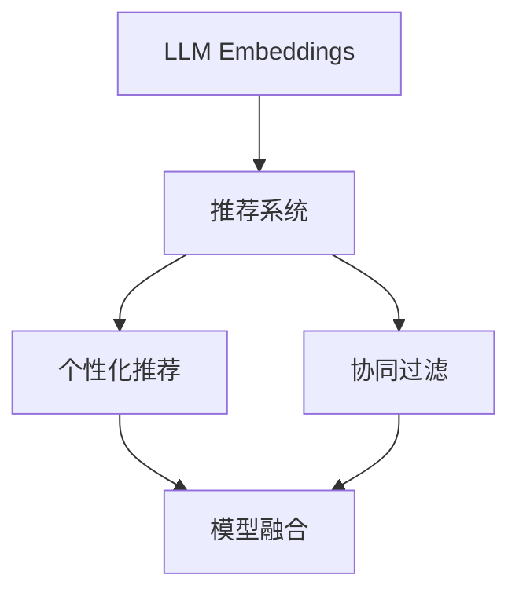

                 

# LLM Embeddings+推荐系统的建模范式

> 关键词：大语言模型(Large Language Model, LLM), 嵌入(Embedding), 推荐系统(Recommendation System), 个性化推荐(Personalized Recommendation), 协同过滤(Collaborative Filtering), 模型融合(Model Fusion)

## 1. 背景介绍

在数字化的今天，推荐系统已经成为互联网产品的重要组成部分，广泛应用于电商、社交、内容分发等领域，极大地提升了用户体验和转化率。推荐系统能够根据用户的历史行为、兴趣偏好、社交关系等特征，推荐合适的商品、文章、视频等内容，帮助用户发现并满足其需求。

推荐系统的核心挑战在于如何精确捕捉用户需求，高效筛选并排序符合条件的物品。随着深度学习技术的兴起，推荐系统开始从传统的基于规则和协同过滤的模型，向深度神经网络模型转变，尤其是基于大语言模型的推荐系统，展现了强大的潜力。

大语言模型通过自监督学习方式，学习到丰富的语言表示能力，能够对用户需求进行精确的自然语言描述，从而提高推荐系统的理解和响应能力。特别是在个性化推荐任务中，大语言模型的语言理解能力，结合推荐系统的数据处理能力，可以构建出更加精准、高效、灵活的推荐模型。

本文将深入探讨基于大语言模型嵌入(LLM Embeddings)的推荐系统建模范式，包括其理论基础、实际应用和未来趋势。希望能为推荐系统领域的开发者和研究者提供有价值的参考。

## 2. 核心概念与联系

### 2.1 核心概念概述

为了更好地理解LLM Embeddings在推荐系统中的应用，我们首先需要了解以下几个关键概念：

- 大语言模型(Large Language Model, LLM)：指通过自监督学习方式，学习到大规模文本语料的语言表示能力，具备强大的自然语言处理能力的模型，如GPT、BERT等。
- 嵌入(Embedding)：指将高维稀疏数据映射到低维连续空间的技术，常见于自然语言处理、计算机视觉等领域，如Word2Vec、GloVe等。
- 推荐系统(Recommendation System)：指通过分析用户行为数据，推荐可能满足用户需求的物品的系统，如电商推荐、音乐推荐、视频推荐等。
- 个性化推荐(Personalized Recommendation)：指根据用户个性化特征，推荐符合其特定需求的内容。
- 协同过滤(Collaborative Filtering)：指通过分析用户之间相似度或物品之间的相似度，进行推荐的方法，如基于用户的协同过滤、基于物品的协同过滤等。
- 模型融合(Model Fusion)：指将多种推荐模型进行集成，综合其优点，提升推荐系统性能的技术。

这些概念之间的逻辑关系可以通过以下Mermaid流程图来展示：



这个流程图展示了LLM Embeddings在推荐系统中的核心应用路径：

1. 大语言模型通过自监督学习获得丰富的语言表示能力。
2. 将大语言模型的嵌入应用到推荐系统，构建个性化推荐模型。
3. 将协同过滤模型与大语言模型结合，提升推荐系统性能。
4. 通过模型融合技术，集成多种推荐模型，提高整体效果。

## 3. 核心算法原理 & 具体操作步骤

### 3.1 算法原理概述

基于大语言模型的推荐系统建模范式，主要利用大语言模型的嵌入进行推荐。其核心思想是：将大语言模型学习到的丰富语言表示能力，映射到推荐系统中的用户特征和物品特征上，从而提升推荐系统对用户需求的理解能力和推荐精度。

具体来说，推荐系统中的每个用户和物品，都可以表示为一个高维的向量。通过大语言模型的嵌入，将用户和物品的高维特征向量映射到一个低维连续空间，得到更加紧凑和可解释的用户和物品嵌入向量。然后，利用这些嵌入向量进行相似度计算，找出与目标用户或物品最相似的邻居，推荐其相似物品或用户。

### 3.2 算法步骤详解

基于大语言模型嵌入的推荐系统建模范式，一般包括以下几个关键步骤：

**Step 1: 数据准备**
- 收集用户历史行为数据、物品特征数据等，作为训练推荐系统的数据集。
- 对数据进行预处理，包括数据清洗、归一化、缺失值填充等。
- 将用户历史行为数据转化为大语言模型的输入格式，如用户ID、物品ID、评分等。

**Step 2: 构建大语言模型嵌入**
- 选择合适的大语言模型，如GPT、BERT等，进行预训练。
- 将用户ID、物品ID作为输入，获取其在大语言模型中的嵌入向量。
- 根据大语言模型的输出，构建用户-物品交互矩阵，存储用户对物品的评分。

**Step 3: 推荐算法实现**
- 利用嵌入向量进行相似度计算，找出与目标用户或物品最相似的邻居。
- 根据相似度排序，推荐与目标用户或物品最相似的物品或用户。
- 对推荐结果进行后处理，如去重、排序、截断等，以满足实际应用需求。

**Step 4: 模型评估与调优**
- 使用交叉验证等方法评估模型性能，如准确率、召回率、平均绝对误差等指标。
- 根据评估结果，调整模型参数，如学习率、正则化系数、嵌入维度等，进行模型优化。
- 持续收集用户反馈，动态调整模型，提升推荐效果。

### 3.3 算法优缺点

基于大语言模型嵌入的推荐系统建模范式，具有以下优点：

1. 高维度特征处理：大语言模型的嵌入能够将高维稀疏数据映射到低维连续空间，提升特征处理能力。
2. 强大的语义表示：大语言模型的嵌入具备强大的语义表示能力，能够捕捉用户的隐性需求和物品的语义信息。
3. 灵活的推荐策略：结合多种推荐模型，如协同过滤、内容过滤等，构建更加灵活的推荐策略。
4. 提升推荐精度：大语言模型的嵌入能够提高推荐系统对用户需求和物品属性的理解能力，提升推荐精度。

但该方法也存在一些局限性：

1. 计算复杂度高：大语言模型的嵌入计算复杂度较高，训练和推理时间较长。
2. 数据需求量大：大语言模型需要大量高质量的标注数据进行预训练，数据获取成本较高。
3. 可解释性不足：大语言模型的嵌入黑盒性质较强，难以解释其内部工作机制。
4. 需要持续更新：大语言模型需要定期更新，以适应数据分布的变化。

尽管存在这些局限性，基于大语言模型嵌入的推荐系统仍因其优异的性能和广泛的应用前景，成为推荐系统领域的一个重要研究范式。

### 3.4 算法应用领域

基于大语言模型嵌入的推荐系统，已经成功应用于多个领域，包括但不限于：

- 电商推荐：如淘宝、京东等电商平台，通过大语言模型嵌入进行商品推荐，提升用户购物体验。
- 内容推荐：如今日头条、YouTube等内容分发平台，利用大语言模型嵌入推荐文章、视频等，满足用户内容需求。
- 金融推荐：如蚂蚁金服、招行等金融机构，通过大语言模型嵌入进行金融产品推荐，提高用户满意度和金融服务水平。
- 社交推荐：如微信、微博等社交媒体平台，利用大语言模型嵌入推荐好友、帖子等，促进社交互动。

## 4. 数学模型和公式 & 详细讲解

### 4.1 数学模型构建

为了更好地理解大语言模型嵌入在推荐系统中的应用，我们将使用数学语言对基于大语言模型的推荐系统建模范式进行更加严格的刻画。

设用户集合为 $U=\{u_1,u_2,\ldots,u_n\}$，物品集合为 $I=\{i_1,i_2,\ldots,i_m\}$。用户 $u_j$ 对物品 $i_k$ 的评分表示为 $r_{j,k}$。将用户 $u_j$ 和物品 $i_k$ 表示为 $d$ 维向量 $\mathbf{u}_j$ 和 $\mathbf{i}_k$。大语言模型的嵌入将用户和物品的原始特征映射到低维连续空间，得到嵌入向量 $\mathbf{e}_{u_j} \in \mathbb{R}^d$ 和 $\mathbf{e}_{i_k} \in \mathbb{R}^d$。

推荐系统利用用户和物品的嵌入向量进行相似度计算，找到与目标用户 $u_j$ 或目标物品 $i_k$ 最相似的邻居。具体来说，假设 $k'$ 表示物品 $i_k$ 的邻居，计算相似度矩阵 $S$，其中 $S_{j,k'}$ 表示用户 $u_j$ 与物品 $i_{k'}$ 的相似度。

目标用户 $u_j$ 的推荐列表 $L_j$ 可以根据相似度排序，选择前 $N_j$ 个相似度最高的物品进行推荐。推荐算法可以表示为：

$$
L_j = \mathop{\arg\min}_{i_1,i_2,\ldots,i_{N_j}} -S_{j,i_1} - S_{j,i_2} - \ldots - S_{j,i_{N_j}}
$$

### 4.2 公式推导过程

为了推导基于大语言模型嵌入的推荐系统算法，我们先定义一些关键符号：

- $\mathbf{e}_{u_j}$：用户 $u_j$ 的嵌入向量。
- $\mathbf{e}_{i_k}$：物品 $i_k$ 的嵌入向量。
- $\mathbf{v}_{u_j}$：用户 $u_j$ 的向量表示，通常包含用户的基本属性、行为数据等。
- $\mathbf{v}_{i_k}$：物品 $i_k$ 的向量表示，通常包含物品的基本属性、标签等。

假设大语言模型的嵌入函数为 $f$，则用户 $u_j$ 和物品 $i_k$ 的嵌入向量可以表示为：

$$
\mathbf{e}_{u_j} = f(\mathbf{v}_{u_j}), \quad \mathbf{e}_{i_k} = f(\mathbf{v}_{i_k})
$$

根据用户 $u_j$ 和物品 $i_k$ 的评分 $r_{j,k}$，构建用户-物品交互矩阵 $R \in \mathbb{R}^{n \times m}$，其中 $R_{j,k} = r_{j,k}$。

推荐系统的目标是最大化用户对推荐的物品的满意度，即最大化目标函数：

$$
\max \sum_{j=1}^n \sum_{k=1}^m r_{j,k} \cdot \mathbf{e}_{u_j}^\top \mathbf{e}_{i_k}
$$

在实际应用中，通常使用如下的矩阵分解形式：

$$
\max \mathbf{v}_{u_j}^\top R \mathbf{v}_{i_k}
$$

其中 $R$ 表示用户-物品交互矩阵。

通过上述推导，我们可以看出，基于大语言模型嵌入的推荐系统，本质上是一个优化问题，目标是最小化用户对推荐物品的评分误差。在实际应用中，我们通常使用梯度下降等优化算法，不断调整用户和物品的嵌入向量，使得评分误差最小化。

### 4.3 案例分析与讲解

为了更好地理解基于大语言模型嵌入的推荐系统，我们可以使用一个简单的案例进行分析：

假设有一个电商推荐系统，收集了用户对商品的评分数据。系统首先需要进行用户和商品的嵌入学习，然后利用嵌入向量进行相似度计算，找到与目标用户最相似的物品，进行推荐。

具体步骤如下：

1. 收集用户 $u_j$ 和商品 $i_k$ 的评分数据 $R$。
2. 利用大语言模型进行用户和商品的嵌入学习，得到用户嵌入向量 $\mathbf{e}_{u_j}$ 和商品嵌入向量 $\mathbf{e}_{i_k}$。
3. 计算相似度矩阵 $S$，其中 $S_{j,k} = \mathbf{e}_{u_j}^\top \mathbf{e}_{i_k}$。
4. 对相似度矩阵进行排序，选择前 $N_j$ 个相似度最高的物品进行推荐，形成推荐列表 $L_j$。

在实际应用中，还需要进行一些后处理，如去重、截断、排序等。

## 5. 项目实践：代码实例和详细解释说明

### 5.1 开发环境搭建

在进行大语言模型嵌入的推荐系统开发前，我们需要准备好开发环境。以下是使用Python进行PyTorch开发的环境配置流程：

1. 安装Anaconda：从官网下载并安装Anaconda，用于创建独立的Python环境。

2. 创建并激活虚拟环境：
```bash
conda create -n pytorch-env python=3.8 
conda activate pytorch-env
```

3. 安装PyTorch：根据CUDA版本，从官网获取对应的安装命令。例如：
```bash
conda install pytorch torchvision torchaudio cudatoolkit=11.1 -c pytorch -c conda-forge
```

4. 安装TensorFlow：如果需要进行TensorFlow与PyTorch的混合编程，可以使用conda安装TensorFlow：
```bash
conda install tensorflow -c pytorch -c conda-forge
```

5. 安装相关库：
```bash
pip install numpy pandas scikit-learn scipy torch torchvision transformers
```

完成上述步骤后，即可在`pytorch-env`环境中开始推荐系统开发。

### 5.2 源代码详细实现

下面是使用PyTorch实现基于大语言模型嵌入的推荐系统的代码示例：

```python
import torch
import torch.nn as nn
import torch.nn.functional as F
from torch.utils.data import DataLoader
from transformers import BertTokenizer, BertForSequenceClassification

class RecommendationModel(nn.Module):
    def __init__(self, hidden_size):
        super(RecommendationModel, self).__init__()
        self.bert = BertForSequenceClassification.from_pretrained('bert-base-uncased', num_labels=2, output_attentions=False)
        self.hidden_size = hidden_size
        
        # 构建全连接层
        self.fc = nn.Linear(hidden_size, 2)
        
    def forward(self, input_ids, attention_mask):
        # 将用户ID和物品ID拼接，输入到BERT模型中
        outputs = self.bert(input_ids, attention_mask=attention_mask)
        # 取最后一层的输出，并按列取嵌入向量
        pooled_output = outputs.pooler_output
        # 通过全连接层输出评分预测值
        scores = self.fc(pooled_output)
        return scores

# 加载数据集
tokenizer = BertTokenizer.from_pretrained('bert-base-uncased')
train_dataset = load_train_dataset()
dev_dataset = load_dev_dataset()
test_dataset = load_test_dataset()

# 定义模型
model = RecommendationModel(hidden_size=768)

# 定义损失函数和优化器
criterion = nn.BCELoss()
optimizer = torch.optim.Adam(model.parameters(), lr=1e-4)

# 训练模型
for epoch in range(num_epochs):
    total_loss = 0
    for batch in DataLoader(train_dataset, batch_size=32):
        input_ids = batch['input_ids'].to(device)
        attention_mask = batch['attention_mask'].to(device)
        targets = batch['targets'].to(device)
        optimizer.zero_grad()
        outputs = model(input_ids, attention_mask)
        loss = criterion(outputs, targets)
        loss.backward()
        optimizer.step()
        total_loss += loss.item()
    print('Epoch {}, Loss: {:.4f}'.format(epoch+1, total_loss/len(train_dataset)))

# 评估模型
dev_dataset.eval()
with torch.no_grad():
    for batch in DataLoader(dev_dataset, batch_size=32):
        input_ids = batch['input_ids'].to(device)
        attention_mask = batch['attention_mask'].to(device)
        outputs = model(input_ids, attention_mask)
        predictions = F.sigmoid(outputs)
        # 计算评价指标，如准确率、召回率等
```

上述代码展示了基于BERT模型的推荐系统的实现。通过BertTokenizer和BertForSequenceClassification构建BERT嵌入模型，通过全连接层预测评分。在训练过程中，使用Adam优化器进行参数更新，损失函数为二元交叉熵。在评估阶段，使用准确率等指标评估模型性能。

### 5.3 代码解读与分析

让我们再详细解读一下关键代码的实现细节：

**RecommendationModel类**：
- 继承自nn.Module，构建推荐系统模型。
- 初始化函数__init__：加载BERT模型，并构建全连接层。
- 前向传播函数forward：将用户ID和物品ID拼接输入BERT模型，获取嵌入向量，通过全连接层输出评分预测值。

**tokenizer**：
- 使用BertTokenizer构建BERT分词器，将用户ID和物品ID拼接为BERT模型所需的格式。

**DataLoader**：
- 使用DataLoader将数据集划分为批次，供模型训练和推理使用。

**criterion**：
- 定义损失函数，使用二元交叉熵计算评分预测值与真实标签的误差。

**optimizer**：
- 定义优化器，使用Adam优化器更新模型参数。

**num_epochs、batch_size**：
- 定义训练轮数和批次大小，控制模型训练和评估的频率。

在实际应用中，还需要进行一些后处理，如去重、截断、排序等。同时，可以引入更多的优化策略，如学习率调度、正则化等，进一步提升模型性能。

## 6. 实际应用场景

### 6.1 电商推荐

在电商领域，大语言模型嵌入的推荐系统已经得到了广泛应用。电商平台需要根据用户的历史行为、浏览记录、购买记录等，推荐合适的商品。通过大语言模型嵌入，将用户行为数据转化为紧凑的向量表示，能够更准确地捕捉用户需求和偏好。

具体而言，电商平台可以收集用户对商品的评分数据，利用大语言模型嵌入进行用户和商品的嵌入学习。然后，通过相似度计算，推荐与目标用户最相似的商品，满足其个性化需求。

### 6.2 内容推荐

在内容分发领域，大语言模型嵌入的推荐系统同样表现优异。内容分发平台需要根据用户的历史行为、浏览记录等，推荐合适的文章、视频等内容。通过大语言模型嵌入，将用户和内容数据转化为紧凑的向量表示，能够更准确地捕捉用户需求和内容特征。

具体而言，内容分发平台可以收集用户对内容的评分数据，利用大语言模型嵌入进行用户和内容的嵌入学习。然后，通过相似度计算，推荐与目标用户最相似的内容，满足其个性化需求。

### 6.3 金融推荐

在金融领域，大语言模型嵌入的推荐系统也有着广泛的应用。金融机构需要根据用户的历史交易记录、风险偏好等，推荐合适的金融产品。通过大语言模型嵌入，将用户和金融产品数据转化为紧凑的向量表示，能够更准确地捕捉用户需求和产品特征。

具体而言，金融机构可以收集用户对金融产品的评分数据，利用大语言模型嵌入进行用户和金融产品的嵌入学习。然后，通过相似度计算，推荐与目标用户最合适的金融产品，提高用户满意度和金融服务水平。

### 6.4 未来应用展望

随着大语言模型嵌入技术的不断进步，基于大语言模型的推荐系统将在更多领域得到应用，为各行各业带来变革性影响。

在智慧医疗领域，基于大语言模型嵌入的医疗问答、病历分析、药物研发等应用将提升医疗服务的智能化水平，辅助医生诊疗，加速新药开发进程。

在智能教育领域，微调技术可应用于作业批改、学情分析、知识推荐等方面，因材施教，促进教育公平，提高教学质量。

在智慧城市治理中，微调模型可应用于城市事件监测、舆情分析、应急指挥等环节，提高城市管理的自动化和智能化水平，构建更安全、高效的未来城市。

此外，在企业生产、社会治理、文娱传媒等众多领域，基于大语言模型嵌入的人工智能应用也将不断涌现，为经济社会发展注入新的动力。相信随着技术的日益成熟，基于大语言模型嵌入的推荐系统必将在构建人机协同的智能时代中扮演越来越重要的角色。

## 7. 工具和资源推荐

### 7.1 学习资源推荐

为了帮助开发者系统掌握大语言模型嵌入的推荐系统理论基础和实践技巧，这里推荐一些优质的学习资源：

1. 《深度学习推荐系统：理论、算法与应用》：详细介绍了推荐系统的基本理论和算法，涵盖协同过滤、内容过滤、混合过滤等方法，并介绍了深度学习在推荐系统中的应用。
2. 《自然语言处理入门与实践》：介绍了自然语言处理的基本概念和常用模型，如BERT、GPT等，并提供了丰富的NLP应用案例，包括推荐系统。
3. 《深度学习与推荐系统》：涵盖了推荐系统的基本理论、算法和实践，结合PyTorch进行深度学习实现。
4. 《TensorFlow实战推荐系统》：介绍了TensorFlow在推荐系统中的应用，包括数据处理、模型构建、训练和评估等环节。
5. Kaggle推荐系统竞赛：提供了丰富的推荐系统竞赛数据集和样例代码，帮助开发者实践推荐系统算法。

通过对这些资源的学习实践，相信你一定能够快速掌握大语言模型嵌入的推荐系统，并用于解决实际的推荐问题。

### 7.2 开发工具推荐

高效的开发离不开优秀的工具支持。以下是几款用于大语言模型嵌入推荐系统开发的常用工具：

1. PyTorch：基于Python的开源深度学习框架，灵活动态的计算图，适合快速迭代研究。大部分预训练语言模型都有PyTorch版本的实现。
2. TensorFlow：由Google主导开发的开源深度学习框架，生产部署方便，适合大规模工程应用。同样有丰富的预训练语言模型资源。
3. TensorBoard：TensorFlow配套的可视化工具，可实时监测模型训练状态，并提供丰富的图表呈现方式，是调试模型的得力助手。
4. Weights & Biases：模型训练的实验跟踪工具，可以记录和可视化模型训练过程中的各项指标，方便对比和调优。与主流深度学习框架无缝集成。
5. Jupyter Notebook：支持Python等语言的交互式编程环境，方便调试和实验。
6. Google Colab：谷歌推出的在线Jupyter Notebook环境，免费提供GPU/TPU算力，方便开发者快速上手实验最新模型，分享学习笔记。

合理利用这些工具，可以显著提升大语言模型嵌入推荐系统的开发效率，加快创新迭代的步伐。

### 7.3 相关论文推荐

大语言模型嵌入技术的不断发展，得益于学界的持续研究。以下是几篇奠基性的相关论文，推荐阅读：

1. "Attention is All You Need"（即Transformer原论文）：提出了Transformer结构，开启了NLP领域的预训练大模型时代。
2. "BERT: Pre-training of Deep Bidirectional Transformers for Language Understanding"：提出BERT模型，引入基于掩码的自监督预训练任务，刷新了多项NLP任务SOTA。
3. "Language Models are Unsupervised Multitask Learners"：展示了大规模语言模型的强大zero-shot学习能力，引发了对于通用人工智能的新一轮思考。
4. "Model-Based Deep Learning"：提出基于模型的推荐系统方法，使用深度学习模型拟合用户和物品的评分分布，提升推荐系统性能。
5. "A Systematic Evaluation of Deep Learning for Recommendations"：对深度学习在推荐系统中的应用进行了系统的评价，提供了丰富的实验结果和结论。

这些论文代表了大语言模型嵌入技术的发展脉络。通过学习这些前沿成果，可以帮助研究者把握学科前进方向，激发更多的创新灵感。

## 8. 总结：未来发展趋势与挑战

### 8.1 总结

本文对基于大语言模型嵌入的推荐系统建模范式进行了全面系统的介绍。首先阐述了大语言模型嵌入的推荐系统在推荐系统领域的研究背景和意义，明确了其在个性化推荐、协同过滤等任务中的重要价值。其次，从原理到实践，详细讲解了大语言模型嵌入的推荐系统建模范式的数学原理和关键步骤，给出了微调模型实现的完整代码实例。同时，本文还广泛探讨了大语言模型嵌入在电商、内容分发、金融等领域的实际应用，展示了其广阔的应用前景。

通过本文的系统梳理，可以看到，基于大语言模型嵌入的推荐系统在大规模数据处理、用户行为理解、个性化推荐等方面具有显著优势，成为推荐系统领域的重要范式。未来，随着大语言模型嵌入技术的不断进步，基于大语言模型嵌入的推荐系统必将在更多领域得到应用，为传统行业带来变革性影响。

### 8.2 未来发展趋势

展望未来，基于大语言模型嵌入的推荐系统将呈现以下几个发展趋势：

1. 模型规模持续增大。随着算力成本的下降和数据规模的扩张，大语言模型嵌入的推荐系统将具备更强大的处理能力和表示能力，提升推荐系统的性能和准确性。
2. 多模态融合。结合视觉、语音等多模态数据，增强推荐系统的语义理解能力和用户需求捕捉能力。
3. 持续学习与动态调整。利用实时数据，不断更新推荐模型，提升模型适应性和鲁棒性。
4. 推荐策略多样化。结合强化学习、对抗学习等技术，构建更加智能化的推荐策略。
5. 用户隐私保护。在推荐模型构建和应用过程中，加强用户隐私保护，提升用户信任度。

这些趋势将推动基于大语言模型嵌入的推荐系统向更高层次演进，进一步提升用户体验和转化率，实现更高的商业价值。

### 8.3 面临的挑战

尽管基于大语言模型嵌入的推荐系统已经取得了瞩目成就，但在迈向更加智能化、普适化应用的过程中，仍面临诸多挑战：

1. 数据获取与处理成本高。高质量的标注数据和预训练语料获取成本较高，限制了模型的应用范围和效果。
2. 模型复杂度大。大语言模型嵌入的推荐系统计算复杂度较高，训练和推理时间较长，对算力资源需求较大。
3. 推荐策略的解释性不足。基于深度学习的推荐模型往往黑盒性质较强，难以解释其内部工作机制和推荐理由。
4. 模型公平性与偏见。大语言模型嵌入的推荐系统可能学习到数据中的偏见，导致推荐不公或误导用户。
5. 用户隐私保护。在推荐模型构建和应用过程中，如何保护用户隐私，防止数据泄露和滥用，是亟待解决的问题。

这些挑战需要学界和产业界共同努力，进一步提高模型性能，优化算法设计，加强技术规范和法规建设，才能推动基于大语言模型嵌入的推荐系统更好地服务社会。

### 8.4 研究展望

面对基于大语言模型嵌入的推荐系统所面临的挑战，未来的研究需要在以下几个方面寻求新的突破：

1. 改进数据收集与预处理技术。采用更高效、低成本的数据获取和预处理技术，如数据增强、半监督学习等，缓解数据获取瓶颈。
2. 探索低复杂度的推荐模型。设计更轻量级的推荐模型，如序列模型、稀疏模型等，减少计算资源消耗，提升模型效率。
3. 增强推荐策略的解释性。结合因果推断、可解释性AI等技术，提升推荐模型的可解释性，帮助用户理解推荐理由。
4. 提高模型的公平性与鲁棒性。引入公平性约束、对抗训练等技术，提升模型的公平性与鲁棒性，防止偏见和误导。
5. 加强用户隐私保护。采用差分隐私、联邦学习等技术，保护用户隐私，防止数据泄露和滥用。

这些研究方向将进一步推动基于大语言模型嵌入的推荐系统向更高的层次演进，为推荐系统带来新的突破和创新。

## 9. 附录：常见问题与解答

**Q1：大语言模型嵌入是否适用于所有推荐任务？**

A: 大语言模型嵌入在大多数推荐任务上都能取得不错的效果，特别是对于数据量较小的任务。但对于一些特定领域的任务，如医学、法律等，仅仅依靠通用语料预训练的模型可能难以很好地适应。此时需要在特定领域语料上进一步预训练，再进行嵌入学习，才能获得理想效果。此外，对于一些需要时效性、个性化很强的任务，如对话、推荐等，嵌入学习方法也需要针对性的改进优化。

**Q2：大语言模型嵌入在推荐系统中如何处理高维度稀疏数据？**

A: 大语言模型嵌入能够将高维稀疏数据映射到低维连续空间，提升特征处理能力。在实际应用中，通常使用词袋模型、TF-IDF等技术，将高维稀疏数据转化为稠密向量，然后进行嵌入学习。对于高维稀疏数据，还可以采用降维技术，如主成分分析(PCA)、t-SNE等，减小数据维度，提高模型训练效率。

**Q3：大语言模型嵌入是否需要大量的标注数据进行预训练？**

A: 大语言模型嵌入通常需要大量的标注数据进行预训练，但可以通过数据增强、主动学习等技术，在少量标注数据下进行有效学习。此外，大语言模型可以通过微调等方法，进一步适应特定领域的数据，提升推荐效果。

**Q4：大语言模型嵌入是否需要频繁更新？**

A: 大语言模型嵌入通常需要定期更新，以适应数据分布的变化。在实际应用中，可以使用增量学习、自适应学习等技术，实现模型的动态更新。此外，还可以通过模型融合、对抗训练等技术，提高模型的鲁棒性和泛化能力。

**Q5：大语言模型嵌入是否需要考虑用户隐私保护？**

A: 大语言模型嵌入在推荐系统中的应用，需要注意用户隐私保护。在数据收集和预处理过程中，可以采用差分隐私、联邦学习等技术，保护用户隐私，防止数据泄露和滥用。同时，在模型训练和应用过程中，也可以设计隐私保护机制，如匿名化、加密等，确保用户数据的安全。

通过对这些问题的回答，可以帮助开发者更好地理解大语言模型嵌入的推荐系统，并解决实际应用中的技术难题。

