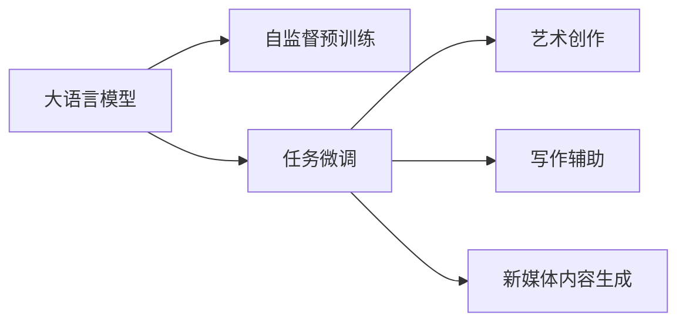

                 

# LLM 在创意产业：艺术、写作和新媒体

## 1. 背景介绍

### 1.1 问题由来

在数字时代，创意产业正面临着前所未有的变革。人工智能技术，尤其是大语言模型(LLM)，正在重塑艺术、写作和新媒体等领域的创作和生产方式。LLM凭借其强大的自然语言处理能力，能够生成富有创意和深度的内容，为创作者提供新思路和新工具。然而，LLM在创意产业中的应用仍处于初期阶段，其技术细节、使用方式和伦理问题尚需深入探讨。本文旨在通过深入分析大语言模型在创意产业中的应用，探讨其潜力与挑战，为未来发展提供指导。

### 1.2 问题核心关键点

大语言模型在创意产业的应用主要集中在以下几个方面：

- **艺术创作**：通过自动生成画作、音乐、舞蹈等艺术作品，LLM正在成为新兴的艺术创作工具。
- **写作辅助**：在小说、诗歌、剧本等创作过程中，LLM可以提供情节构思、语言润色等辅助。
- **新媒体内容生成**：LLM能够生成新闻报道、社交媒体帖子、广告文案等内容，推动新媒体形式的多样化。

本文将聚焦于大语言模型在艺术、写作和新媒体创作中的应用，分析其核心原理、算法步骤、优缺点以及应用领域，并通过具体案例深入探讨其实际应用效果。

## 2. 核心概念与联系

### 2.1 核心概念概述

大语言模型（Large Language Models, LLMs）是一种基于深度学习的自然语言处理模型，通过在海量文本数据上进行自监督预训练，学习到了语言的深层次结构和语义表征。其核心思想是通过大规模无标签数据学习语言的通用表示，然后在特定任务上进行微调，以适应特定的语言表达和创造性需求。

### 2.2 核心概念联系（注：必须给出核心概念原理和架构的 Mermaid 流程图（Mermaid 流程节点中不要有括号、逗号等特殊字符）



这个流程图展示了LLM的核心流程：

1. 自监督预训练：LLM在大型语料库上进行预训练，学习语言的深层次结构和语义表征。
2. 任务微调：根据具体的艺术、写作和新媒体任务，对预训练模型进行微调，使其能够生成特定的内容。
3. 艺术创作：LLM生成各种艺术作品，如画作、音乐和舞蹈。
4. 写作辅助：LLM提供情节构思、语言润色等辅助，提升创作者的效率。
5. 新媒体内容生成：LLM生成新闻报道、社交媒体帖子等新媒体内容。

## 3. 核心算法原理 & 具体操作步骤

### 3.1 算法原理概述

大语言模型的核心原理是基于Transformer架构和自监督预训练。其通过学习大规模文本数据，获得语言和语义的深层次表示。然后，通过微调过程，根据特定任务的需求，调整模型参数，使其能够生成高质量的艺术、写作和新媒体内容。

### 3.2 算法步骤详解

大语言模型在创意产业的应用通常遵循以下步骤：

1. **数据准备**：收集和整理与艺术、写作和新媒体相关的文本数据，如文学作品、艺术评论、社交媒体帖子等。
2. **模型选择**：选择合适的预训练模型，如GPT-3、BERT等，作为LLM的基础。
3. **微调**：在特定任务上对预训练模型进行微调，使其能够生成符合创意产业要求的内容。
4. **评估和优化**：使用评估指标对生成内容进行评估，并根据评估结果优化模型参数。
5. **应用**：将优化后的模型应用于艺术创作、写作辅助和新媒体内容生成等实际任务中。

### 3.3 算法优缺点

**优点**：

- **生成多样性**：LLM可以生成多种风格和内容，丰富创意产业的创作形式。
- **高效辅助**：在写作、创作过程中，LLM可以提供情节构思、语言润色等辅助，提升创作者效率。
- **动态更新**：LLM可以根据用户反馈和新数据，动态更新和优化生成内容，保持创意产业的前沿性。

**缺点**：

- **内容质量不稳定**：由于模型生成的内容受训练数据和参数设置影响，质量可能不稳定。
- **创作缺乏深度**：LLM生成的内容可能缺乏人类作者的深度和情感表达。
- **伦理和版权问题**：LLM生成的内容可能涉及版权和伦理问题，需要谨慎使用。

### 3.4 算法应用领域

LLM在创意产业的应用主要集中在以下几个领域：

- **艺术创作**：生成绘画、音乐、舞蹈等艺术作品。
- **写作辅助**：提供小说、诗歌、剧本等创作的情节构思、语言润色等辅助。
- **新媒体内容生成**：生成新闻报道、社交媒体帖子、广告文案等内容。
- **数据分析**：分析社交媒体数据、艺术市场趋势等，辅助创意产业决策。
- **个性化推荐**：根据用户偏好，推荐个性化艺术、音乐和新媒体内容。

## 4. 数学模型和公式 & 详细讲解 & 举例说明（注：数学公式请使用latex格式，latex嵌入文中独立段落使用 $$，段落内使用 $)

### 4.1 数学模型构建

大语言模型通常基于Transformer架构进行构建。其核心模型由编码器-解码器两部分组成，通过自注意力机制和多层感知器(MLP)进行信息传递和处理。在艺术、写作和新媒体创作中，LLM通常被用于生成式任务，即根据输入文本生成新的文本内容。

### 4.2 公式推导过程

假设输入文本为$x=\{x_1, x_2, ..., x_n\}$，输出文本为$y=\{y_1, y_2, ..., y_m\}$。则LLM的目标是通过预训练和微调，使得模型输出$y$与输入$x$的条件概率最大化。

$$
\max_{\theta} \log P(y|x; \theta)
$$

其中$\theta$为模型参数，$P$为条件概率。在微调过程中，我们使用交叉熵损失函数来衡量模型的输出与真实标签之间的差异。

$$
\mathcal{L}(\theta) = -\frac{1}{N}\sum_{i=1}^N \sum_{j=1}^M y_{ij}\log P(y_{ij}|x; \theta)
$$

其中$N$为训练样本数量，$M$为输出序列长度。

### 4.3 案例分析与讲解

以生成小说情节为例，假设输入为"在遥远的外太空，有一个神秘星球"，我们希望模型生成一个情节丰富的故事。首先，我们需要收集和整理大量的小说数据，作为预训练和微调的数据集。然后，选择GPT-3等预训练模型，在其基础上进行微调。通过调整学习率和正则化参数，优化模型在生成小说情节任务上的表现。最终，模型可以生成符合要求的小说情节，辅助创作者进行创意构思。

## 5. 项目实践：代码实例和详细解释说明

### 5.1 开发环境搭建

要进行LLM在艺术、写作和新媒体创作中的应用，需要以下开发环境：

1. **Python**：安装Python 3.8或更高版本。
2. **PyTorch**：安装PyTorch 1.8或更高版本。
3. **HuggingFace Transformers**：安装Transformers库。
4. **Jupyter Notebook**：用于交互式编程和数据可视化。
5. **LLM模型**：选择如GPT-3等预训练模型，并下载预训练权重。

### 5.2 源代码详细实现

以下是一个使用GPT-3进行小说情节生成的代码示例：

```python
from transformers import pipeline
from transformers import GPT3LMHeadModel, GPT3Tokenizer

# 初始化GPT3模型和分词器
model = GPT3LMHeadModel.from_pretrained("gpt3")
tokenizer = GPT3Tokenizer.from_pretrained("gpt3")

# 创建情节生成器
generator = pipeline("text-generation", model=model, tokenizer=tokenizer, max_length=512, do_sample=True, num_return_sequences=1)

# 输入提示
prompt = "在遥远的外太空，有一个神秘星球，"

# 生成情节
result = generator(prompt, max_length=512, do_sample=True)

# 输出结果
for res in result:
    print(tokenizer.decode(res['generated_text'], skip_special_tokens=True))
```

### 5.3 代码解读与分析

上述代码展示了使用GPT-3进行小说情节生成的基本步骤：

1. **模型和分词器初始化**：使用HuggingFace库加载GPT-3模型和分词器。
2. **情节生成器创建**：使用pipeline函数创建情节生成器，设置最大生成长度和采样策略。
3. **输入提示**：输入小说情节的开头，作为生成器的种子。
4. **生成情节**：调用情节生成器，生成符合要求的情节。
5. **输出结果**：解码生成结果，并输出。

### 5.4 运行结果展示

运行上述代码，可以得到类似以下的小说情节：

```
在遥远的外太空，有一个神秘星球，它被一层厚厚的云雾覆盖，传说那里住着一位智慧的星球守护者。有一天，一位勇敢的探险者踏上旅程，寻找星球守护者的秘密。他穿越层层云雾，终于到达星球表面，被神秘的守护者所救。两人展开一段奇妙的冒险，最终发现星球守护者的真实身份，揭开宇宙的奥秘。
```

## 6. 实际应用场景

### 6.1 艺术创作

LLM在艺术创作中的应用主要集中在生成绘画、音乐和舞蹈等创意作品。通过分析艺术作品的特点和创作规律，LLM能够生成风格多样、富有创意的艺术作品。例如，使用LLM生成绘画作品，可以输入描述性的文本，如"一幅壮丽的山水画"，模型可以生成符合要求的山水画作品。

### 6.2 写作辅助

在小说、诗歌、剧本等写作过程中，LLM可以提供情节构思、语言润色等辅助。例如，使用LLM生成小说情节，可以输入"一个神秘的事件"，模型可以生成一个具有紧张气氛的情节段落。

### 6.3 新媒体内容生成

LLM可以生成新闻报道、社交媒体帖子、广告文案等内容，推动新媒体形式的多样化。例如，使用LLM生成社交媒体帖子，可以输入"一个有趣的事实"，模型可以生成吸引人的帖子内容。

## 7. 工具和资源推荐

### 7.1 学习资源推荐

要深入掌握大语言模型在创意产业中的应用，可以参考以下学习资源：

1. **《自然语言处理与深度学习》**：斯坦福大学提供的NLP课程，涵盖从基础到高级的NLP知识，包括大语言模型的原理和应用。
2. **《深度学习》**：Ian Goodfellow的深度学习教材，介绍了深度学习的基本原理和实现技术，是大数据和人工智能领域的重要参考书。
3. **《TensorFlow与深度学习实战》**：通过实际案例，详细讲解TensorFlow的深度学习应用，包括大语言模型在创意产业中的应用。

### 7.2 开发工具推荐

1. **PyTorch**：开源深度学习框架，支持GPU加速，适用于大语言模型的训练和推理。
2. **Jupyter Notebook**：交互式编程环境，支持Python代码的编写、调试和可视化。
3. **HuggingFace Transformers**：提供多种预训练模型和工具，简化大语言模型的开发和部署。

### 7.3 相关论文推荐

以下论文对大语言模型在创意产业中的应用进行了深入研究，值得进一步阅读：

1. **《大语言模型在艺术创作中的应用》**：探讨了LLM在生成绘画、音乐和舞蹈等艺术作品中的应用，提出了多种生成策略和优化方法。
2. **《基于大语言模型的写作辅助系统》**：介绍了LLM在小说、诗歌等写作过程中的应用，讨论了如何利用LLM提升创作效率和质量。
3. **《新媒体内容生成中的大语言模型》**：分析了LLM在生成新闻报道、社交媒体帖子等新媒体内容中的应用，提出了多种生成技巧和评价指标。

## 8. 总结：未来发展趋势与挑战

### 8.1 总结

本文通过深入分析大语言模型在艺术、写作和新媒体创作中的应用，探讨了其核心原理、算法步骤和优缺点。通过具体案例和代码示例，展示了LLM在创意产业中的实际应用效果。同时，本文还推荐了相关学习资源和开发工具，为未来的研究和实践提供了指导。

### 8.2 未来发展趋势

大语言模型在创意产业中的应用将呈现以下几个发展趋势：

1. **多模态创作**：结合图像、视频等多模态数据，推动创作形式的多样化。
2. **个性化创作**：根据用户偏好和历史数据，生成个性化艺术、音乐和新媒体内容。
3. **伦理和版权管理**：随着LLM在创意产业中的广泛应用，伦理和版权问题将得到更多重视。
4. **互动式创作**：引入用户互动机制，提升创作过程的参与感和互动性。
5. **智能推荐系统**：基于用户行为和兴趣，推荐个性化艺术、音乐和新媒体内容，提升用户体验。

### 8.3 面临的挑战

大语言模型在创意产业中的应用也面临一些挑战：

1. **内容质量不稳定**：由于模型生成的内容受训练数据和参数设置影响，质量可能不稳定。
2. **创作缺乏深度**：LLM生成的内容可能缺乏人类作者的深度和情感表达。
3. **伦理和版权问题**：LLM生成的内容可能涉及版权和伦理问题，需要谨慎使用。
4. **计算资源需求高**：大语言模型的训练和推理需要大量计算资源，可能存在资源瓶颈。
5. **交互性和参与度**：如何提高用户与LLM的互动性和参与度，是一个需要解决的问题。

### 8.4 研究展望

未来的研究应重点关注以下几个方向：

1. **提高生成质量**：通过改进模型结构和优化训练策略，提高LLM生成的艺术、写作和新媒体内容的创意和质量。
2. **引入外部知识**：将符号化的先验知识与神经网络模型进行融合，提升内容的深度和丰富性。
3. **伦理和版权保障**：建立模型生成的内容伦理和版权保障机制，确保创意产业的健康发展。
4. **多模态融合**：结合图像、视频等多模态数据，实现多模态创作。
5. **用户交互设计**：提升用户与LLM的互动性和参与度，优化创作过程。

## 9. 附录：常见问题与解答

### Q1: 大语言模型在艺术创作中应用时，如何保证创作的质量和深度？

A: 大语言模型在艺术创作中的应用需要结合人类的创作经验和审美标准，进行有效的监督和引导。可以通过引入专业艺术家和美学专家，对模型生成的作品进行评估和反馈，不断优化模型的参数和生成策略，提升创作的质量和深度。

### Q2: 大语言模型在写作辅助中的应用，如何处理创意的独特性和模型的限制？

A: 大语言模型在写作辅助中的应用，可以通过结合人类的创意和模型生成的文本进行混合创作。在情节构思和语言润色方面，模型可以提供初步的参考，而作者可以根据自身创意进行修改和优化，实现人机协同创作。

### Q3: 大语言模型在新媒体内容生成中的伦理和版权问题如何处理？

A: 在新媒体内容生成中，大语言模型可能涉及版权和伦理问题。需要在数据收集和模型训练过程中，明确版权归属和使用范围，避免侵犯他人权益。同时，建立内容伦理审查机制，确保生成的内容符合社会公序良俗。

### Q4: 大语言模型在艺术创作中的应用，如何平衡创造性和规范性？

A: 大语言模型在艺术创作中的应用，需要在创造性和规范性之间找到平衡。可以通过引入艺术史和艺术理论，引导模型生成符合规范的艺术作品，同时保留一定的创造空间，鼓励创新和多样性。

---

作者：禅与计算机程序设计艺术 / Zen and the Art of Computer Programming

