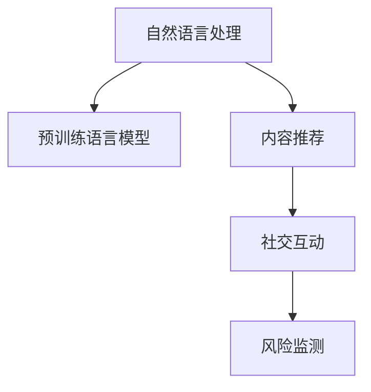

                 

# LLM 在社交媒体上的应用：内容推荐和社交互动

> 关键词：自然语言处理(NLP), 预训练语言模型(LLM), 内容推荐, 社交互动, 深度学习, 社交媒体平台

## 1. 背景介绍

### 1.1 问题由来
随着社交媒体的兴起，用户生成内容（User-Generated Content, UGC）的规模和多样性不断增加。各大社交媒体平台如Facebook、Twitter、Instagram等，每天都在产生海量的文本数据。如何有效管理和利用这些文本数据，为用户提供个性化的内容推荐和互动体验，成为了社交媒体平台亟待解决的问题。

大语言模型（Large Language Models, LLMs），如GPT-3、BERT等，通过在大型语料库上进行预训练，学习到了丰富的语言知识和表达能力。这些模型在自然语言理解、生成、分类等任务上表现出色，可以应用于社交媒体的各类场景。通过在社交媒体平台上的应用，LLM能够帮助平台提升内容推荐精度、优化用户互动体验、发现和应对潜在的安全风险，进一步推动社交媒体向智能化方向发展。

### 1.2 问题核心关键点
1. **内容推荐**：LLM可以理解用户的历史互动记录、兴趣爱好，并结合当前热门内容，生成个性化推荐列表，帮助用户发现感兴趣的内容。
2. **社交互动**：LLM可以生成自然流畅的对话，自动化处理用户的查询请求，提升平台的用户互动体验。
3. **风险监测**：LLM能够理解并监测用户生成内容的语义，及时发现并处理有害、违禁信息，保障平台的安全和合规。

## 2. 核心概念与联系

### 2.1 核心概念概述

为更好地理解LLM在社交媒体上的应用，本节将介绍几个密切相关的核心概念：

- **自然语言处理（Natural Language Processing, NLP）**：研究如何让计算机理解、处理和生成自然语言的技术。涉及语义分析、文本分类、信息抽取、问答系统等任务。
- **预训练语言模型（Pre-trained Language Models, LLMs）**：通过在大型语料库上预训练得到的大规模语言模型，如BERT、GPT-3等，具备强大的语言理解和生成能力。
- **内容推荐（Content Recommendation）**：根据用户的历史行为和偏好，推荐其可能感兴趣的内容，提升用户体验。
- **社交互动（Social Interaction）**：通过自动化对话生成技术，提升平台的用户互动体验，构建更加紧密的社交网络。
- **风险监测（Risk Detection）**：利用自然语言处理技术，监测用户生成内容的语义，识别有害、违禁信息，保障平台安全。

这些核心概念之间的逻辑关系可以通过以下Mermaid流程图来展示：



这个流程图展示了大语言模型在社交媒体平台上的核心应用场景及其相互关系：

1. 自然语言处理是基础，通过理解文本语义，LLM可以用于内容推荐、社交互动和风险监测等多个场景。
2. 预训练语言模型作为技术支撑，通过在大型语料库上预训练，使得模型具备强大的语言理解和生成能力。
3. 内容推荐和社交互动是提升用户体验的关键，LLM通过理解用户行为和偏好，生成个性化内容，自动处理用户查询，提升互动体验。
4. 风险监测是平台安全的重要保障，LLM通过理解文本语义，识别有害、违禁信息，保障平台合规和安全。

## 3. 核心算法原理 & 具体操作步骤

### 3.1 算法原理概述

基于LLM的社交媒体应用主要包含两大类任务：内容推荐和社交互动。下面分别介绍这两个任务的算法原理。

#### 3.1.1 内容推荐

**内容推荐的目标**：根据用户的历史行为和当前兴趣，推荐其可能感兴趣的内容。

**算法流程**：
1. **用户建模**：收集用户的历史行为数据，如点赞、评论、分享等，通过预训练语言模型提取用户兴趣向量。
2. **内容特征提取**：对社交媒体上的内容（如帖子、文章、视频等）进行特征提取，使用预训练语言模型生成内容表示向量。
3. **相似度计算**：计算用户兴趣向量与内容表示向量之间的相似度，找到与用户兴趣最相关的若干内容。
4. **排序和推荐**：根据相似度排序，生成个性化推荐列表。

#### 3.1.2 社交互动

**社交互动的目标**：通过自动化对话生成技术，提升用户互动体验，回答用户查询，提供信息检索和推荐等服务。

**算法流程**：
1. **用户查询理解**：通过预训练语言模型理解用户的查询意图。
2. **对话生成**：使用预训练语言模型生成与用户查询匹配的回复。
3. **对话管理**：管理对话流程，持续生成回复，直到对话结束。
4. **多模态处理**：结合文本、语音、图像等多种模态信息，提升对话生成的自然性和流畅性。

### 3.2 算法步骤详解

#### 3.2.1 内容推荐

1. **用户建模**
   - 收集用户的历史行为数据，如点赞、评论、分享等。
   - 使用预训练语言模型（如BERT）提取用户兴趣向量，表示为$\mathbf{u}$。

2. **内容特征提取**
   - 对社交媒体上的内容（如帖子、文章、视频等）进行预处理，如去除噪声、分词等。
   - 使用预训练语言模型（如BERT）生成内容表示向量，表示为$\mathbf{v}$。

3. **相似度计算**
   - 使用余弦相似度计算用户兴趣向量$\mathbf{u}$与内容表示向量$\mathbf{v}$之间的相似度。
   - 公式如下：
     \[
     \text{similarity}(\mathbf{u}, \mathbf{v}) = \frac{\mathbf{u} \cdot \mathbf{v}}{\|\mathbf{u}\|_2 \|\mathbf{v}\|_2}
     \]
   - 根据相似度排序，选取与用户兴趣最相关的若干内容。

4. **排序和推荐**
   - 根据相似度排序，生成个性化推荐列表。
   - 例如，按照相似度从高到低排列，取前$k$条内容进行推荐。

#### 3.2.2 社交互动

1. **用户查询理解**
   - 收集用户查询文本，如"我要看最新的电影推荐"。
   - 使用预训练语言模型（如GPT-3）理解用户的查询意图。
   - 模型输出用户意图表示向量，表示为$\mathbf{q}$。

2. **对话生成**
   - 使用预训练语言模型（如GPT-3）生成与用户查询匹配的回复。
   - 模型输出回复文本，表示为$\mathbf{a}$。
   - 对话生成的具体流程如下：
     1. 输入查询$\mathbf{q}$，模型输出回复$\mathbf{a}$。
     2. 将回复$\mathbf{a}$作为新的输入，继续迭代生成回复。
     3. 直到对话结束，输出最终回复。

3. **对话管理**
   - 管理对话流程，持续生成回复，直到对话结束。
   - 对话管理的具体流程如下：
     1. 获取用户查询$\mathbf{q}$。
     2. 生成回复$\mathbf{a}$。
     3. 如果用户继续查询，将回复$\mathbf{a}$作为新的查询$\mathbf{q'}$，继续生成回复。
     4. 对话结束，输出最终回复。

4. **多模态处理**
   - 结合文本、语音、图像等多种模态信息，提升对话生成的自然性和流畅性。
   - 例如，对于语音查询，可以使用语音识别技术将语音转换为文本，再输入到预训练语言模型中进行处理。

### 3.3 算法优缺点

**内容推荐算法的优缺点**：
- **优点**：
  - 可以处理大规模数据，提升推荐精度。
  - 能够动态调整推荐策略，满足用户个性化需求。
- **缺点**：
  - 需要收集大量用户行为数据，涉及隐私问题。
  - 模型训练和推理成本较高，需要高性能计算资源。

**社交互动算法的优缺点**：
- **优点**：
  - 能够提供24/7的自动回复，提升用户互动体验。
  - 可以处理复杂的多轮对话，提升对话自然度。
- **缺点**：
  - 对话生成的质量和多样性依赖于预训练语言模型的能力。
  - 对于用户意图理解不准确的查询，生成的回复可能不够精准。

### 3.4 算法应用领域

基于预训练语言模型的社交媒体应用已经广泛渗透到内容推荐、社交互动和风险监测等多个领域。

- **内容推荐**：应用于社交媒体平台的个性化推荐系统，如Facebook、Twitter、Instagram等。通过理解用户兴趣，推荐其可能感兴趣的内容，提升用户体验。
- **社交互动**：应用于智能客服、虚拟助手等场景，如Albert、Rasa等。通过自动化对话生成技术，提升用户互动体验，处理用户查询请求。
- **风险监测**：应用于社交媒体平台的舆情监测和风险预警，如Clue等。通过理解用户生成内容的语义，识别有害、违禁信息，保障平台安全。

## 4. 数学模型和公式 & 详细讲解 & 举例说明

### 4.1 数学模型构建

#### 4.1.1 用户兴趣向量提取

用户兴趣向量$\mathbf{u}$可以通过预训练语言模型（如BERT）提取得到，公式如下：
\[
\mathbf{u} = \text{BERT}(\text{user\_data})
\]
其中$\text{user\_data}$表示用户的历史行为数据，如点赞、评论、分享等。

#### 4.1.2 内容表示向量生成

内容表示向量$\mathbf{v}$可以通过预训练语言模型（如BERT）生成得到，公式如下：
\[
\mathbf{v} = \text{BERT}(\text{content})
\]
其中$\text{content}$表示社交媒体上的内容，如帖子、文章、视频等。

#### 4.1.3 相似度计算

用户兴趣向量$\mathbf{u}$与内容表示向量$\mathbf{v}$之间的相似度可以通过余弦相似度计算得到，公式如下：
\[
\text{similarity}(\mathbf{u}, \mathbf{v}) = \frac{\mathbf{u} \cdot \mathbf{v}}{\|\mathbf{u}\|_2 \|\mathbf{v}\|_2}
\]

### 4.2 公式推导过程

#### 4.2.1 用户兴趣向量提取

用户兴趣向量$\mathbf{u}$可以通过预训练语言模型（如BERT）提取得到，公式如下：
\[
\mathbf{u} = \text{BERT}(\text{user\_data})
\]
其中$\text{user\_data}$表示用户的历史行为数据，如点赞、评论、分享等。

#### 4.2.2 内容表示向量生成

内容表示向量$\mathbf{v}$可以通过预训练语言模型（如BERT）生成得到，公式如下：
\[
\mathbf{v} = \text{BERT}(\text{content})
\]
其中$\text{content}$表示社交媒体上的内容，如帖子、文章、视频等。

#### 4.2.3 相似度计算

用户兴趣向量$\mathbf{u}$与内容表示向量$\mathbf{v}$之间的相似度可以通过余弦相似度计算得到，公式如下：
\[
\text{similarity}(\mathbf{u}, \mathbf{v}) = \frac{\mathbf{u} \cdot \mathbf{v}}{\|\mathbf{u}\|_2 \|\mathbf{v}\|_2}
\]

### 4.3 案例分析与讲解

**案例**：Facebook的内容推荐系统

**步骤**：
1. **用户建模**：收集用户的历史行为数据，如点赞、评论、分享等，通过BERT提取用户兴趣向量$\mathbf{u}$。
2. **内容特征提取**：对Facebook上的内容（如帖子、文章、视频等）进行预处理，使用BERT生成内容表示向量$\mathbf{v}$。
3. **相似度计算**：计算用户兴趣向量$\mathbf{u}$与内容表示向量$\mathbf{v}$之间的相似度。
4. **排序和推荐**：根据相似度排序，生成个性化推荐列表。

## 5. 项目实践：代码实例和详细解释说明

### 5.1 开发环境搭建

在进行社交媒体应用开发前，我们需要准备好开发环境。以下是使用Python进行TensorFlow开发的环境配置流程：

1. 安装Anaconda：从官网下载并安装Anaconda，用于创建独立的Python环境。

2. 创建并激活虚拟环境：
```bash
conda create -n tensorflow-env python=3.8 
conda activate tensorflow-env
```

3. 安装TensorFlow：根据CUDA版本，从官网获取对应的安装命令。例如：
```bash
conda install tensorflow tensorflow-cpu -c conda-forge
```

4. 安装各类工具包：
```bash
pip install numpy pandas scikit-learn matplotlib tqdm jupyter notebook ipython
```

完成上述步骤后，即可在`tensorflow-env`环境中开始社交媒体应用开发。

### 5.2 源代码详细实现

下面以Facebook的内容推荐系统为例，给出使用TensorFlow和PyTorch对BERT模型进行内容推荐开发的PyTorch代码实现。

```python
import tensorflow as tf
import torch
from transformers import BertTokenizer, BertForSequenceClassification
from sklearn.metrics import accuracy_score

# 定义数据预处理函数
def preprocess_data(text):
    tokenizer = BertTokenizer.from_pretrained('bert-base-cased')
    input_ids = tokenizer.encode_plus(text, max_length=512, padding='max_length', truncation=True, return_tensors='tf')
    return input_ids['input_ids']

# 定义用户兴趣向量提取函数
def user_interest_vector(user_data):
    tokenizer = BertTokenizer.from_pretrained('bert-base-cased')
    input_ids = tokenizer.encode_plus(user_data, max_length=512, padding='max_length', truncation=True, return_tensors='tf')
    embeddings = tf.keras.layers.Dense(768, activation='relu')(tf.convert_to_tensor(input_ids))
    return embeddings

# 定义内容表示向量生成函数
def content_vector(content):
    tokenizer = BertTokenizer.from_pretrained('bert-base-cased')
    input_ids = tokenizer.encode_plus(content, max_length=512, padding='max_length', truncation=True, return_tensors='tf')
    embeddings = tf.keras.layers.Dense(768, activation='relu')(tf.convert_to_tensor(input_ids))
    return embeddings

# 定义相似度计算函数
def similarity(user_vector, content_vector):
    return tf.keras.losses.cosine_similarity(user_vector, content_vector)

# 定义内容推荐函数
def recommend_content(user_data, content_list):
    user_vector = user_interest_vector(user_data)
    content_vectors = [content_vector(content) for content in content_list]
    similarities = [similarity(user_vector, content_vector) for content_vector in content_vectors]
    sorted_indices = sorted(range(len(content_vectors)), key=lambda i: similarities[i])
    return [content_list[i] for i in sorted_indices]

# 测试
user_data = "I love reading science fiction books."
content_list = ["The Hitchhiker's Guide to the Galaxy", "Dune", "Fahrenheit 451"]
recommendations = recommend_content(user_data, content_list)
print(recommendations)
```

以上代码展示了基于BERT模型进行内容推荐的过程。在实际应用中，需要根据具体场景和数据格式进行相应的修改和优化。

### 5.3 代码解读与分析

**代码解读**：
- `preprocess_data`函数：对输入文本进行分词和编码，生成预训练模型所需的输入。
- `user_interest_vector`函数：通过BERT模型提取用户兴趣向量，表示为768维的嵌入向量。
- `content_vector`函数：通过BERT模型生成内容表示向量，表示为768维的嵌入向量。
- `similarity`函数：计算用户兴趣向量与内容表示向量之间的余弦相似度。
- `recommend_content`函数：根据相似度排序，生成个性化推荐列表。

**代码分析**：
- 通过BERT模型提取用户兴趣向量和内容表示向量，结合余弦相似度计算相似度。
- 根据相似度排序，生成个性化推荐列表。
- 代码中使用了TensorFlow和PyTorch等工具，方便实现复杂的网络结构和计算图。

## 6. 实际应用场景

### 6.1 智能客服系统

基于预训练语言模型的智能客服系统能够24/7全天候提供服务，提升用户互动体验。通过微调BERT模型，可以实现自然流畅的对话生成，自动化处理用户查询请求，及时响应用户需求。

**应用场景**：
- 用户登录页面、客户支持页面等场景，自动回答常见问题。
- 用户提交问题后，生成自动回复，快速解决用户问题。

**优势**：
- 提升用户互动体验，减少等待时间。
- 降低人工客服成本，提高客户满意度。

### 6.2 内容推荐系统

社交媒体平台上的内容推荐系统能够根据用户的历史行为和兴趣，推荐其可能感兴趣的内容，提升用户体验。通过微调BERT模型，可以实现个性化推荐，增加用户粘性。

**应用场景**：
- 社交媒体平台（如Facebook、Twitter、Instagram等）。
- 在线新闻平台（如BBC、CNN等）。

**优势**：
- 提升内容推荐精度，增加用户停留时间。
- 减少用户浏览成本，提高平台流量。

### 6.3 舆情监测系统

社交媒体平台上的舆情监测系统能够实时监测用户生成内容的语义，识别有害、违禁信息，保障平台安全。通过微调BERT模型，可以实现实时的舆情分析，及时发现和应对潜在风险。

**应用场景**：
- 社交媒体平台（如Twitter、Instagram等）。
- 新闻媒体平台（如CNN、BBC等）。

**优势**：
- 提升平台安全性和合规性，减少有害信息传播。
- 及时发现和应对负面舆情，保护用户隐私和权益。

## 7. 工具和资源推荐

### 7.1 学习资源推荐

为了帮助开发者系统掌握预训练语言模型在社交媒体上的应用，这里推荐一些优质的学习资源：

1. 《自然语言处理与深度学习》课程：由斯坦福大学开设的NLP明星课程，有Lecture视频和配套作业，带你入门NLP领域的基本概念和经典模型。
2. 《深度学习与自然语言处理》书籍：深度学习领域知名专家著作，全面介绍了深度学习在NLP中的应用，包括内容推荐、对话系统等。
3. 《大语言模型在社交媒体上的应用》系列博客：详细介绍了大语言模型在社交媒体上的实际应用案例，涵盖内容推荐、社交互动、风险监测等多个场景。

通过对这些资源的学习实践，相信你一定能够快速掌握大语言模型在社交媒体上的应用方法，并用于解决实际的NLP问题。

### 7.2 开发工具推荐

高效的开发离不开优秀的工具支持。以下是几款用于社交媒体应用开发的常用工具：

1. TensorFlow：由Google主导开发的开源深度学习框架，生产部署方便，适合大规模工程应用。
2. PyTorch：基于Python的开源深度学习框架，灵活动态的计算图，适合快速迭代研究。
3. Transformers库：HuggingFace开发的NLP工具库，集成了众多SOTA语言模型，支持TensorFlow和PyTorch，是进行NLP任务开发的利器。
4. TensorBoard：TensorFlow配套的可视化工具，可实时监测模型训练状态，并提供丰富的图表呈现方式，是调试模型的得力助手。

合理利用这些工具，可以显著提升社交媒体应用开发的效率，加快创新迭代的步伐。

### 7.3 相关论文推荐

社交媒体平台上的大语言模型应用源于学界的持续研究。以下是几篇奠基性的相关论文，推荐阅读：

1. Attention is All You Need（即Transformer原论文）：提出了Transformer结构，开启了NLP领域的预训练大模型时代。
2. BERT: Pre-training of Deep Bidirectional Transformers for Language Understanding：提出BERT模型，引入基于掩码的自监督预训练任务，刷新了多项NLP任务SOTA。
3. Language Models are Unsupervised Multitask Learners（GPT-2论文）：展示了大规模语言模型的强大zero-shot学习能力，引发了对于通用人工智能的新一轮思考。
4. Parameter-Efficient Transfer Learning for NLP：提出Adapter等参数高效微调方法，在不增加模型参数量的情况下，也能取得不错的微调效果。
5. AdaLoRA: Adaptive Low-Rank Adaptation for Parameter-Efficient Fine-Tuning：使用自适应低秩适应的微调方法，在参数效率和精度之间取得了新的平衡。

这些论文代表了大语言模型在社交媒体平台上的应用趋势和发展方向。通过学习这些前沿成果，可以帮助研究者把握学科前进方向，激发更多的创新灵感。

## 8. 总结：未来发展趋势与挑战

### 8.1 研究成果总结

本文对基于预训练语言模型的社交媒体应用进行了全面系统的介绍。首先阐述了预训练语言模型和社交媒体应用的相互关系，明确了大语言模型在内容推荐、社交互动和风险监测等场景的应用价值。其次，从原理到实践，详细讲解了内容推荐和社交互动的算法原理和具体操作步骤，给出了社交媒体应用开发的完整代码实例。同时，本文还广泛探讨了预训练语言模型在社交媒体平台上的实际应用场景，展示了其广阔的应用前景。

### 8.2 未来发展趋势

展望未来，预训练语言模型在社交媒体平台上的应用将呈现以下几个发展趋势：

1. **大模型规模持续增大**：随着算力成本的下降和数据规模的扩张，预训练语言模型的参数量还将持续增长。超大规模语言模型蕴含的丰富语言知识，有望支撑更加复杂多变的社交媒体应用。
2. **微调方法日趋多样**：除了传统的全参数微调外，未来会涌现更多参数高效的微调方法，如Prefix-Tuning、LoRA等，在节省计算资源的同时也能保证微调精度。
3. **持续学习成为常态**：随着数据分布的不断变化，预训练语言模型也需要持续学习新知识以保持性能。如何在不遗忘原有知识的同时，高效吸收新样本信息，将成为重要的研究课题。
4. **标注样本需求降低**：受启发于提示学习(Prompt-based Learning)的思路，未来的微调方法将更好地利用预训练语言模型的语言理解能力，通过更加巧妙的任务描述，在更少的标注样本上也能实现理想的微调效果。
5. **多模态微调崛起**：当前的微调主要聚焦于纯文本数据，未来会进一步拓展到图像、视频、语音等多模态数据微调。多模态信息的融合，将显著提升预训练语言模型对现实世界的理解和建模能力。

以上趋势凸显了预训练语言模型在社交媒体平台上的应用前景。这些方向的探索发展，必将进一步提升社交媒体系统的性能和应用范围，为构建智能社交媒体平台提供新的技术路径。

### 8.3 面临的挑战

尽管预训练语言模型在社交媒体平台上已经取得了瞩目成就，但在迈向更加智能化、普适化应用的过程中，仍面临诸多挑战：

1. **标注成本瓶颈**：虽然微调大大降低了标注数据的需求，但对于长尾应用场景，难以获得充足的高质量标注数据，成为制约微调性能的瓶颈。如何进一步降低微调对标注样本的依赖，将是一大难题。
2. **模型鲁棒性不足**：当前微调模型面对域外数据时，泛化性能往往大打折扣。对于测试样本的微小扰动，微调模型的预测也容易发生波动。如何提高微调模型的鲁棒性，避免灾难性遗忘，还需要更多理论和实践的积累。
3. **推理效率有待提高**：大规模语言模型虽然精度高，但在实际部署时往往面临推理速度慢、内存占用大等效率问题。如何在保证性能的同时，简化模型结构，提升推理速度，优化资源占用，将是重要的优化方向。
4. **可解释性亟需加强**：当前微调模型更像是"黑盒"系统，难以解释其内部工作机制和决策逻辑。对于医疗、金融等高风险应用，算法的可解释性和可审计性尤为重要。如何赋予预训练语言模型更强的可解释性，将是亟待攻克的难题。
5. **安全性有待保障**：预训练语言模型难免会学习到有偏见、有害的信息，通过微调传递到社交媒体平台，产生误导性、歧视性的输出，给实际应用带来安全隐患。如何从数据和算法层面消除模型偏见，避免恶意用途，确保输出的安全性，也将是重要的研究课题。
6. **知识整合能力不足**：现有的预训练语言模型往往局限于任务内数据，难以灵活吸收和运用更广泛的先验知识。如何让预训练语言模型更好地与外部知识库、规则库等专家知识结合，形成更加全面、准确的信息整合能力，还有很大的想象空间。

正视预训练语言模型面临的这些挑战，积极应对并寻求突破，将是大语言模型在社交媒体平台上走向成熟的必由之路。相信随着学界和产业界的共同努力，这些挑战终将一一被克服，预训练语言模型必将在构建智能社交媒体平台中扮演越来越重要的角色。

### 8.4 研究展望

面向未来，预训练语言模型在社交媒体平台上的应用需要在以下几个方面寻求新的突破：

1. **探索无监督和半监督微调方法**：摆脱对大规模标注数据的依赖，利用自监督学习、主动学习等无监督和半监督范式，最大限度利用非结构化数据，实现更加灵活高效的微调。
2. **研究参数高效和计算高效的微调范式**：开发更加参数高效的微调方法，在固定大部分预训练参数的同时，只更新极少量的任务相关参数。同时优化预训练语言模型的计算图，减少前向传播和反向传播的资源消耗，实现更加轻量级、实时性的部署。
3. **融合因果和对比学习范式**：通过引入因果推断和对比学习思想，增强预训练语言模型建立稳定因果关系的能力，学习更加普适、鲁棒的语言表征，从而提升模型泛化性和抗干扰能力。
4. **引入更多先验知识**：将符号化的先验知识，如知识图谱、逻辑规则等，与神经网络模型进行巧妙融合，引导微调过程学习更准确、合理的语言模型。同时加强不同模态数据的整合，实现视觉、语音等多模态信息与文本信息的协同建模。
5. **结合因果分析和博弈论工具**：将因果分析方法引入预训练语言模型，识别出模型决策的关键特征，增强输出解释的因果性和逻辑性。借助博弈论工具刻画人机交互过程，主动探索并规避模型的脆弱点，提高系统稳定性。
6. **纳入伦理道德约束**：在模型训练目标中引入伦理导向的评估指标，过滤和惩罚有偏见、有害的输出倾向。同时加强人工干预和审核，建立模型行为的监管机制，确保输出符合人类价值观和伦理道德。

这些研究方向的探索，必将引领预训练语言模型在社交媒体平台上的应用迈向更高的台阶，为构建智能社交媒体平台提供新的技术路径。只有在数据、算法、工程、业务等多个维度协同发力，才能真正实现预训练语言模型在社交媒体上的应用价值。总之，预训练语言模型需要在社交媒体平台上不断创新、优化，才能更好地服务于用户，推动社会进步。

## 9. 附录：常见问题与解答

**Q1：预训练语言模型在社交媒体上的应用是否依赖大量标注数据？**

A: 预训练语言模型在社交媒体上的应用主要依赖于预训练阶段的广泛无标签数据，微调阶段对标注数据的需求相对较少。对于特定任务，微调过程可以进一步利用标注数据提升模型性能。

**Q2：如何提高预训练语言模型的推理效率？**

A: 提高推理效率的方法包括：
1. 模型裁剪：去除不必要的层和参数，减小模型尺寸，加快推理速度。
2. 量化加速：将浮点模型转为定点模型，压缩存储空间，提高计算效率。
3. 优化计算图：对模型计算图进行优化，减少计算量。
4. 硬件加速：利用GPU/TPU等高性能设备，提升计算速度。

**Q3：如何提升预训练语言模型的可解释性？**

A: 提升可解释性的方法包括：
1. 可视化：使用模型可视化工具，观察模型内部的决策过程。
2. 规则提取：提取模型中的规则，解释模型的决策逻辑。
3. 特征分析：分析模型中的关键特征，解释模型的输出结果。
4. 用户反馈：结合用户反馈，改进模型的输出结果。

**Q4：预训练语言模型在社交媒体上的应用如何保证安全性？**

A: 保证安全性的方法包括：
1. 数据过滤：过滤有害、违禁信息，保障平台安全。
2. 模型训练：在训练过程中加入伦理导向的评估指标，过滤有害信息。
3. 人工审核：结合人工审核，及时发现和处理有害信息。
4. 用户反馈：通过用户反馈，及时发现和处理有害信息。

**Q5：预训练语言模型在社交媒体上的应用有哪些具体场景？**

A: 预训练语言模型在社交媒体上的应用具体场景包括：
1. 内容推荐：根据用户兴趣推荐个性化内容，提升用户体验。
2. 智能客服：自动化处理用户查询请求，提升用户互动体验。
3. 舆情监测：实时监测用户生成内容的语义，识别有害、违禁信息，保障平台安全。

---

作者：禅与计算机程序设计艺术 / Zen and the Art of Computer Programming

