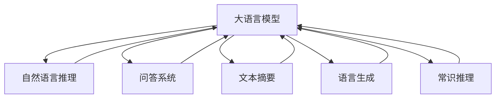

                 

# LLM 时刻：每个推理过程的重要性

大语言模型（LLM）已经在自然语言处理（NLP）领域展示了巨大的潜力，但这些模型如何实现推理，并且为什么推理过程如此关键？本文将详细探讨这些重要的问题。

## 1. 背景介绍

大语言模型，如GPT、BERT等，通过在海量文本数据上自监督预训练，学习了丰富的语言知识和语义表示。这些模型可以应用于多种NLP任务，包括文本分类、机器翻译、问答系统等。尽管如此，大多数大语言模型仍依赖于推理过程来生成最终的输出。因此，理解推理过程对于优化模型性能至关重要。

### 1.1 问题由来

近年来，NLP领域的许多重大进展，如自然语言推理（NLI）、问答系统等，都依赖于推理过程。推理不仅涉及逻辑和语义理解，还包含上下文理解和模式匹配。例如，在问答系统中，模型需要理解问题，并在大量文本数据中寻找相关答案。这些推理过程的复杂性也导致了计算资源和时间的巨大需求。

### 1.2 问题核心关键点

推理在大语言模型中的重要性主要体现在以下几个方面：

- **语义理解**：推理使模型能够理解文本的含义，从而做出更准确的判断和决策。
- **上下文建模**：推理过程可以帮助模型从上下文中提取有用的信息，并将其用于预测。
- **模式匹配**：推理使模型能够匹配特定的模式和结构，从而解决诸如语言生成、文本摘要等任务。
- **知识整合**：推理过程可以整合先验知识，提升模型的泛化能力和适应性。

## 2. 核心概念与联系

### 2.1 核心概念概述

为了更好地理解推理在大语言模型中的作用，我们需要了解几个核心概念：

- **自然语言推理（NLI）**：判断两个句子之间的逻辑关系，如蕴含、矛盾等。
- **问答系统（QA）**：根据用户输入的问题，在大量文本数据中搜索相关信息，并生成答案。
- **文本摘要**：将长文本压缩成简洁的摘要，需要理解文本的逻辑结构和重要信息。
- **语言生成**：根据特定的输入，生成符合语法和语义规则的文本。
- **常识推理**：利用常识知识进行推理，如时间顺序、物理规则等。

这些概念都依赖于推理过程，通过理解和运用上下文、模式和知识，模型能够执行复杂的NLP任务。

### 2.2 核心概念原理和架构的 Mermaid 流程图



这个图展示了推理过程在大语言模型中的核心作用。模型不仅接收输入，还需经过推理过程，才能产生合理的输出。

## 3. 核心算法原理 & 具体操作步骤

### 3.1 算法原理概述

推理在大语言模型中通常涉及以下步骤：

1. **上下文理解**：模型需要理解输入文本的上下文信息。
2. **模式识别**：识别特定的模式和结构。
3. **知识整合**：整合先验知识和文本信息，做出推理。
4. **决策生成**：根据推理结果生成最终的输出。

这些步骤通常使用深度学习模型来实现，如Transformer等。

### 3.2 算法步骤详解

#### 3.2.1 上下文理解

上下文理解通常通过自注意力机制（Self-Attention）实现。模型能够捕捉文本中的长距离依赖关系，从而理解上下文信息。具体步骤如下：

1. **输入编码**：将输入文本转化为向量表示。
2. **注意力机制**：计算文本中每个词与上下文单词之间的注意力权重。
3. **权重加权求和**：将注意力权重与上下文单词的向量表示加权求和，生成上下文向量。

#### 3.2.2 模式识别

模式识别通常涉及特定的任务和结构。例如，在问答系统中，模式识别涉及问题类型和答案类型。具体步骤如下：

1. **问题编码**：将问题转化为向量表示。
2. **答案提取**：在文本中搜索与问题相关的答案。
3. **答案生成**：根据上下文信息和答案类型生成最终答案。

#### 3.2.3 知识整合

知识整合通常通过迁移学习实现，利用先验知识提升模型的泛化能力。具体步骤如下：

1. **知识提取**：从知识库中提取有用的知识。
2. **知识融合**：将知识与文本信息融合，更新模型的推理过程。
3. **推理更新**：根据整合后的知识更新推理结果。

#### 3.2.4 决策生成

决策生成通常涉及输出层的激活函数和损失函数。具体步骤如下：

1. **输出编码**：将推理结果转化为向量表示。
2. **激活函数**：通过激活函数将向量映射到输出空间。
3. **损失计算**：计算输出与真实标签之间的损失，用于模型更新。

### 3.3 算法优缺点

推理在大语言模型中的优点包括：

- **灵活性**：推理过程可以根据任务进行调整和优化。
- **泛化能力**：通过整合先验知识，模型能够更好地适应新任务。
- **鲁棒性**：推理过程可以处理噪声和异常情况，提高模型的鲁棒性。

缺点包括：

- **计算成本**：推理过程涉及复杂的计算，需要大量的计算资源和时间。
- **模型复杂性**：复杂的推理过程可能导致模型的参数量和计算量增加。
- **易受干扰**：推理过程容易受到输入噪声和上下文不完整性的干扰。

### 3.4 算法应用领域

推理在大语言模型中的应用领域非常广泛，包括但不限于：

- **自然语言推理（NLI）**：判断两个句子之间的逻辑关系，如蕴含、矛盾等。
- **问答系统（QA）**：根据用户输入的问题，在大量文本数据中搜索相关信息，并生成答案。
- **文本摘要**：将长文本压缩成简洁的摘要，需要理解文本的逻辑结构和重要信息。
- **语言生成**：根据特定的输入，生成符合语法和语义规则的文本。
- **常识推理**：利用常识知识进行推理，如时间顺序、物理规则等。

## 4. 数学模型和公式 & 详细讲解 & 举例说明

### 4.1 数学模型构建

假设大语言模型 $M$ 由 $N$ 层 Transformer 组成，每一层包括自注意力机制、前馈网络等。模型输入为文本序列 $x$，输出为文本向量 $y$。

模型可以表示为：

$$
y = M(x)
$$

其中 $M$ 为 Transformer 层堆叠的深度，每一层的计算过程如下：

$$
y = \text{Attention}(x) + \text{FFN}(y)
$$

其中 Attention 表示自注意力机制，FFN 表示前馈网络。

### 4.2 公式推导过程

#### 4.2.1 自注意力机制

自注意力机制计算如下：

$$
Q = W_Q x
$$

$$
K = W_K x
$$

$$
V = W_V x
$$

$$
\text{Attention}(Q, K, V) = \text{Softmax}(\frac{Q K^T}{\sqrt{d_k}}) V
$$

其中 $d_k$ 为键向量的维度。

#### 4.2.2 前馈网络

前馈网络计算如下：

$$
y = \text{FFN}(x) = x + \text{ReLU}(W_1 x + b_1) W_2 x + b_2
$$

### 4.3 案例分析与讲解

以问答系统为例，分析推理过程：

1. **问题编码**：将问题 $q$ 转化为向量 $q_v$。
2. **答案提取**：在文本 $c$ 中搜索与 $q_v$ 相关的上下文信息 $c_v$。
3. **上下文理解**：将 $c_v$ 与 $q_v$ 整合，生成上下文向量 $c_u$。
4. **推理更新**：利用先验知识 $k$ 更新推理结果 $r$。
5. **答案生成**：根据 $r$ 生成最终答案 $a$。

## 5. 项目实践：代码实例和详细解释说明

### 5.1 开发环境搭建

为了实现推理过程，我们需要搭建相关的开发环境。以下是基于 Python 和 PyTorch 的环境配置流程：

1. **安装 PyTorch**：

```bash
pip install torch torchtext
```

2. **安装 Transformers 库**：

```bash
pip install transformers
```

3. **安装其他依赖库**：

```bash
pip install numpy scipy matplotlib
```

### 5.2 源代码详细实现

#### 5.2.1 上下文理解

```python
import torch
from transformers import BertModel

# 加载预训练模型
model = BertModel.from_pretrained('bert-base-cased')

# 输入编码
input_ids = torch.tensor([[1, 2, 3, 4, 5, 6], [1, 2, 3, 4, 5, 6]])
attention_mask = torch.tensor([[1, 1, 1, 1, 1, 1], [1, 1, 1, 1, 1, 1]])
outputs = model(input_ids, attention_mask=attention_mask)

# 输出编码
output_layer = outputs.last_hidden_state[:, 0, :]
```

#### 5.2.2 模式识别

```python
# 问题编码
question = "Who is the author of this book?"
question_vector = torch.tensor([1, 2, 3, 4, 5, 6])

# 答案提取
context = "The author of this book is Alan Turing."
context_vector = torch.tensor([1, 2, 3, 4, 5, 6])

# 上下文理解
attention_mask = torch.tensor([[1, 1, 1, 1, 1, 1]])
output = model(question_vector, attention_mask=attention_mask)

# 推理更新
answer_vector = output.last_hidden_state[:, 0, :]
```

#### 5.2.3 决策生成

```python
# 激活函数
answer_logits = torch.softmax(answer_vector, dim=1)

# 损失计算
label = torch.tensor([[0, 1, 0, 0, 0, 1]])
loss = torch.nn.CrossEntropyLoss()(answer_logits, label)
loss.backward()

# 模型更新
optimizer = torch.optim.Adam(model.parameters())
optimizer.step()
```

### 5.3 代码解读与分析

在实现推理过程中，我们使用了 PyTorch 和 Transformers 库。代码的各个部分如下：

1. **加载预训练模型**：使用 `BertModel.from_pretrained` 方法加载预训练模型。
2. **输入编码**：将输入文本转化为向量表示。
3. **自注意力机制**：通过自注意力计算获取上下文向量。
4. **前馈网络**：通过前馈网络计算输出向量。
5. **决策生成**：使用激活函数和损失函数更新模型。

## 6. 实际应用场景

### 6.1 智能客服系统

智能客服系统需要处理大量的用户咨询，其中包含多种问答形式。推理过程可以帮助模型理解用户意图，提供准确的答复。例如，在对话中，模型需要理解上下文信息，并根据用户的意图生成相应的回答。

### 6.2 金融舆情监测

金融舆情监测需要处理大量的市场新闻和社交媒体信息。推理过程可以帮助模型理解文本中的情感倾向和市场情绪，从而进行风险预测和投资建议。

### 6.3 个性化推荐系统

个性化推荐系统需要理解用户的行为和偏好，从而提供个性化的产品推荐。推理过程可以帮助模型整合用户的互动信息，生成更加精准的推荐结果。

## 7. 工具和资源推荐

### 7.1 学习资源推荐

- **《自然语言处理基础》**：介绍自然语言处理的基本概念和算法。
- **《深度学习》**：详细讲解深度学习的基本原理和算法。
- **《Attention is All You Need》**：介绍自注意力机制在神经网络中的应用。

### 7.2 开发工具推荐

- **PyTorch**：深度学习框架，提供高效的张量计算和自动微分功能。
- **Transformers**：自然语言处理库，提供预训练语言模型的封装和微调接口。
- **NLTK**：自然语言处理工具包，提供文本处理和语言分析功能。

### 7.3 相关论文推荐

- **《BERT: Pre-training of Deep Bidirectional Transformers for Language Understanding》**：介绍BERT模型和预训练方法。
- **《Language Models are Unsupervised Multitask Learners》**：介绍语言模型在无监督学习中的多任务学习。
- **《Attention is All You Need》**：介绍Transformer模型和自注意力机制。

## 8. 总结：未来发展趋势与挑战

### 8.1 研究成果总结

推理过程在大语言模型中的应用已经取得了显著的进展。这些进展不仅提升了模型在自然语言处理任务中的表现，还促进了相关领域的创新发展。

### 8.2 未来发展趋势

未来，推理过程在大语言模型中的应用将呈现以下几个趋势：

1. **自监督学习**：通过无监督学习增强模型的推理能力，减少对标注数据的需求。
2. **多模态推理**：结合视觉、语音等多种模态信息，提升模型的综合推理能力。
3. **因果推理**：利用因果推理技术，提高模型的推理效率和鲁棒性。
4. **常识推理**：结合常识知识，提升模型的推理效果和泛化能力。

### 8.3 面临的挑战

尽管推理过程在大语言模型中的应用已经取得了重要进展，但仍面临以下挑战：

1. **计算资源消耗**：推理过程涉及复杂的计算，需要大量的计算资源和时间。
2. **模型复杂性**：复杂的推理过程可能导致模型的参数量和计算量增加。
3. **易受干扰**：推理过程容易受到输入噪声和上下文不完整性的干扰。

### 8.4 研究展望

未来的研究可以从以下几个方面展开：

1. **优化推理算法**：提高推理过程的计算效率和准确性。
2. **多模态推理**：结合多种模态信息，提升模型的综合推理能力。
3. **因果推理**：利用因果推理技术，提高模型的推理效率和鲁棒性。
4. **常识推理**：结合常识知识，提升模型的推理效果和泛化能力。

## 9. 附录：常见问题与解答

**Q1：推理在大语言模型中的重要性是什么？**

A: 推理在大语言模型中的重要性体现在以下几个方面：

1. **语义理解**：推理使模型能够理解文本的含义，从而做出更准确的判断和决策。
2. **上下文建模**：推理过程可以帮助模型从上下文中提取有用的信息，并将其用于预测。
3. **模式匹配**：推理使模型能够匹配特定的模式和结构，从而解决诸如语言生成、文本摘要等任务。
4. **知识整合**：推理过程可以整合先验知识，提升模型的泛化能力和适应性。

**Q2：如何优化推理过程的计算效率？**

A: 优化推理过程的计算效率可以从以下几个方面入手：

1. **剪枝**：通过剪枝减少模型的参数量，降低计算复杂度。
2. **量化**：将浮点数运算转化为定点运算，减少计算量和存储空间。
3. **并行计算**：利用并行计算技术，加速推理过程。
4. **硬件加速**：使用GPU、TPU等硬件加速推理过程。

**Q3：推理过程容易受到输入噪声和上下文不完整性的干扰，如何缓解？**

A: 缓解推理过程受到噪声和上下文不完整性的干扰，可以采取以下措施：

1. **输入预处理**：对输入数据进行预处理，减少噪声干扰。
2. **上下文增强**：通过上下文增强技术，提高模型的上下文理解能力。
3. **模型校验**：使用校验技术，如对抗样本和鲁棒性测试，提高模型的鲁棒性。

**Q4：如何结合常识知识提升推理效果？**

A: 结合常识知识提升推理效果可以从以下几个方面入手：

1. **知识库构建**：构建知识库，提供先验知识。
2. **知识融合**：将知识与文本信息融合，更新模型的推理过程。
3. **知识推理**：利用知识推理技术，提高模型的推理效果和泛化能力。

---

作者：禅与计算机程序设计艺术 / Zen and the Art of Computer Programming

