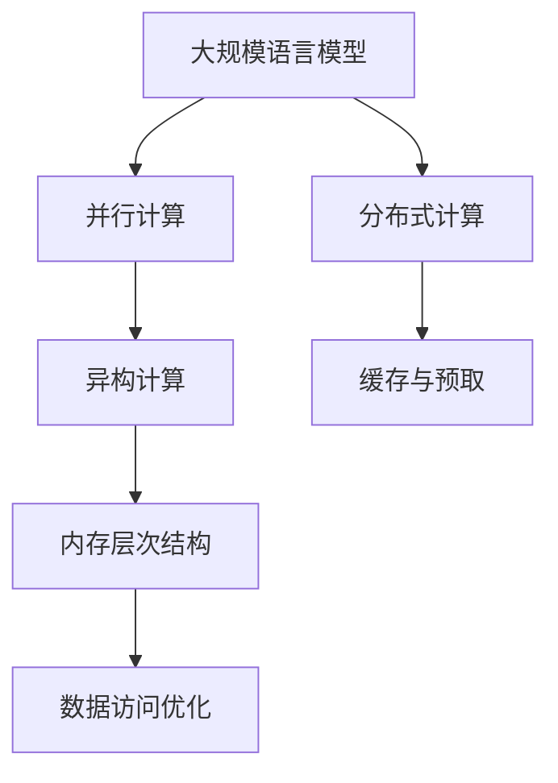
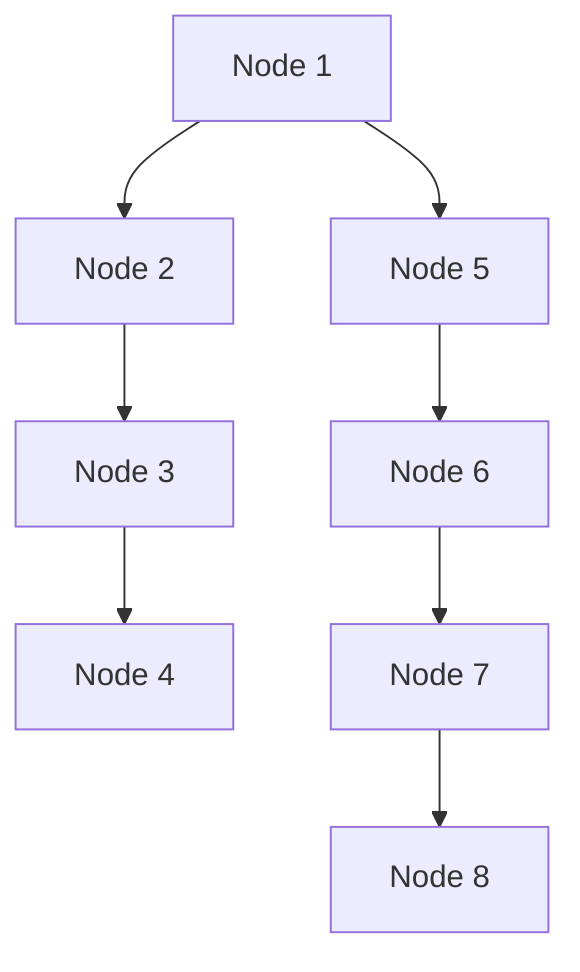
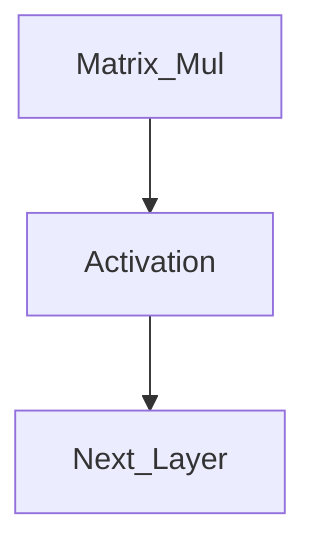
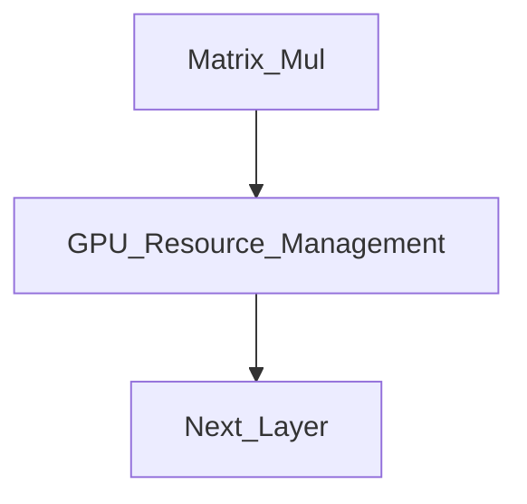
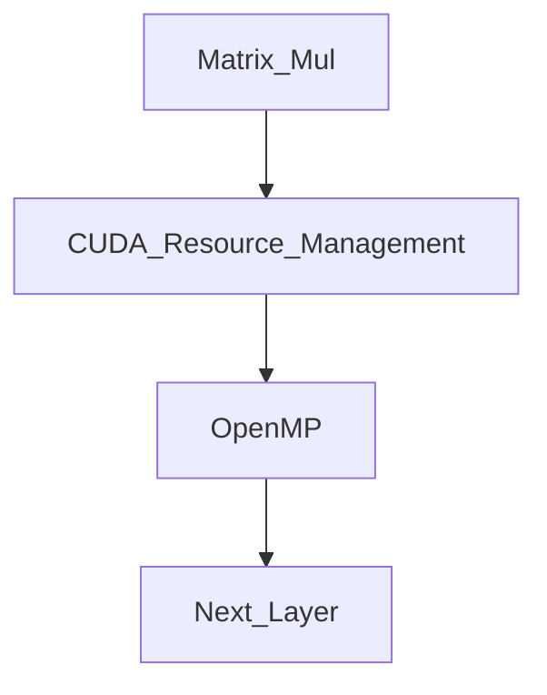

                 

# LLM 革命：重新思考计算机架构

## 1. 背景介绍

### 1.1 问题由来

随着深度学习技术的飞速发展，特别是大规模预训练模型（Large Language Models，LLMs）的崛起，计算架构面临着前所未有的挑战和变革。传统的冯诺依曼架构，基于串行和冯诺依曼瓶颈，已难以满足当前深度学习的计算需求。特别是在处理大规模语言模型时，计算效率低下、能耗巨大、扩展性受限等问题逐渐凸显。

与此同时，云计算、人工智能和量子计算等新技术不断涌现，为重新设计计算机架构提供了新的思路。本文将聚焦于大规模语言模型，探讨其计算需求和架构挑战，并尝试提出新的计算架构设计方案。

### 1.2 问题核心关键点

大规模语言模型的计算需求主要体现在以下几个方面：

1. **大规模参数存储与访问**：如BERT、GPT等模型动辄上百亿参数，传统冯诺依曼架构在参数访问效率和带宽限制下表现不佳。
2. **高度并行计算需求**：深度学习计算密集型，需大规模并行计算才能有效加速。
3. **低延迟数据传输**：模型训练和推理过程中需频繁读写数据，低延迟的存储与传输机制至关重要。
4. **灵活扩展性**：随着模型规模和任务复杂度的增长，系统需具备动态扩展能力。

本节通过分析大规模语言模型的特点，明确其对计算架构的具体要求。接下来，我们将探索可能的计算架构设计方案，并通过理论与实践相结合，提供深入的技术见解。

## 2. 核心概念与联系

### 2.1 核心概念概述

大规模语言模型（LLMs）是以Transformer为代表的深度神经网络模型，通过在大规模无标签文本数据上进行预训练，学习语言和语义的复杂表示。这些模型具有以下特点：

- **大规模参数**：如BERT的12层每层768个参数，GPT-3的175层每层12288个参数。
- **高度并行计算需求**：深度学习模型需要矩阵乘法和激活函数的大量计算，适合并行加速。
- **高度数据依赖**：模型训练和推理过程中需频繁读写数据，数据访存效率直接影响性能。

计算架构设计的关键在于如何高效利用并行计算资源，优化数据传输和访问，实现系统的高效扩展。以下是几个核心概念及其联系：

1. **并行计算**：利用多个计算单元同时执行任务，提高计算效率。
2. **分布式计算**：将任务拆分为多个子任务，在不同的计算节点上并行执行。
3. **内存层次结构**：设计多层次的存储体系结构，优化数据读写速度和效率。
4. **异构计算**：结合不同类型计算单元的优势，实现综合性能提升。
5. **缓存与预取**：利用缓存机制和数据预取技术，减少访问延迟，提升整体性能。

这些概念紧密联系，共同构成计算架构设计的基石。

### 2.2 核心概念原理和架构的 Mermaid 流程图



这个流程图展示了从大规模语言模型到最终计算架构优化的主要步骤：

1. **并行计算**：利用多核或GPU等并行资源加速模型训练和推理。
2. **分布式计算**：通过分布式训练框架，将大规模任务分布到多个计算节点。
3. **异构计算**：结合CPU/GPU/FPGA等异构计算资源，提高系统整体性能。
4. **缓存与预取**：利用缓存和预取技术优化数据访问，减少延迟。
5. **内存层次结构**：设计多层次的存储体系结构，优化数据读写速度和效率。

## 3. 核心算法原理 & 具体操作步骤

### 3.1 算法原理概述

大规模语言模型的计算架构设计需要考虑并行计算、分布式计算、数据访问优化等多个方面。本节将详细探讨这些核心算法原理，并给出具体的具体操作步骤。

### 3.2 算法步骤详解

**Step 1: 确定并行计算策略**

大规模语言模型计算密集型，需利用多核CPU、GPU或FPGA等并行计算资源加速。不同类型计算资源的特点和适用场景不同，需根据具体情况选择合适的策略：

1. **CPU计算**：适用于串行计算任务，适用于数据预处理、模型编译等。
2. **GPU计算**：适用于深度学习计算，适用于模型训练和推理。
3. **FPGA计算**：适用于特定算法加速，适用于数据压缩、模型推理等。

**Step 2: 实现分布式计算框架**

分布式计算框架如TensorFlow、PyTorch等，可将大规模任务拆分为多个子任务，在不同的计算节点上并行执行。这需要设计合理的计算图，并利用分布式通信协议实现节点间的信息交换。

1. **计算图设计**：将模型分解为多个子图，并利用数据流和控制流设计。
2. **分布式通信**：利用消息传递接口（MPI）、异步通信框架（NCCL）等实现节点间的通信。

**Step 3: 优化数据传输和访问**

数据传输和访问效率直接影响计算架构的性能。需设计多层次的存储体系结构，并利用缓存和预取技术优化数据读写。

1. **多层次存储体系**：设计大容量缓存、主存和辅助存储的层次结构，优化数据读写速度。
2. **缓存与预取**：利用缓存机制和数据预取技术，减少数据访问延迟。

**Step 4: 实现异构计算**

异构计算结合不同类型计算资源的优势，实现综合性能提升。需设计合理的任务调度策略，并利用软件工具实现资源管理。

1. **任务调度策略**：将不同计算任务分配到不同类型的计算资源，优化资源利用率。
2. **异构资源管理**：利用GPU驱动、FPGA编程等工具，实现资源调度和管理。

### 3.3 算法优缺点

大规模语言模型计算架构设计的优缺点如下：

**优点**：

1. **高并行计算能力**：通过并行计算和分布式计算，大幅提升计算效率。
2. **高效数据传输**：利用缓存和预取技术，减少数据访问延迟。
3. **灵活扩展性**：通过异构计算和分布式计算，实现系统的动态扩展。

**缺点**：

1. **设计复杂度较高**：需考虑并行计算、分布式计算、数据传输等多个方面。
2. **资源利用率较低**：异构计算和分布式计算需额外开销，可能降低资源利用率。
3. **系统稳定性较低**：分布式计算需保证节点间的通信稳定，否则可能影响整体性能。

### 3.4 算法应用领域

大规模语言模型计算架构设计在多个领域有广泛应用：

1. **高性能计算**：如天气预测、金融模拟等，需大规模并行计算和大容量存储。
2. **自然语言处理**：如机器翻译、文本生成等，需高效数据传输和低延迟计算。
3. **智能推荐系统**：如电商推荐、社交网络等，需实时数据处理和动态扩展。
4. **自动驾驶**：如环境感知、路径规划等，需实时数据处理和高效推理。

## 4. 数学模型和公式 & 详细讲解 & 举例说明

### 4.1 数学模型构建

大规模语言模型的计算架构设计涉及多个学科的数学模型，如计算图、通信模型、存储模型等。本节将简要介绍这些数学模型。

**计算图模型**：

计算图模型描述模型的计算流程，如TensorFlow的计算图模型。其主要数学模型包括：

1. **节点（Operation Node）**：表示计算操作，如矩阵乘法、卷积、激活函数等。
2. **边（Data Edge）**：表示数据流动，如输入数据、中间结果、输出数据等。

**通信模型**：

通信模型描述节点间的通信方式，如Gloo、MPI等。其主要数学模型包括：

1. **节点（Rank）**：表示计算节点，如CPU、GPU、FPGA等。
2. **消息（Message）**：表示节点间的通信数据，如参数、梯度等。

**存储模型**：

存储模型描述数据的存储方式，如Hadoop、Spark等。其主要数学模型包括：

1. **块（Block）**：表示数据存储的基本单位，如文件块、数据块等。
2. **页（Page）**：表示数据存储的细分单位，如缓存页、内存页等。

### 4.2 公式推导过程

**计算图推导**：

计算图推导是计算图模型的核心，通过将模型分解为多个子图，并利用数据流和控制流设计。以下以TensorFlow为例，推导计算图模型的数学表达式：

1. **节点表达式**：

$$
Node_i = Function_i(Node_{in_{1}}, Node_{in_{2}}, \dots, Node_{in_{n}})
$$

其中，$Node_i$表示第$i$个计算节点，$Function_i$表示计算函数，$Node_{in_{j}}$表示输入节点。

2. **边表达式**：

$$
Data_{out} = Node_i \times Node_{in_{1}} \oplus Node_{in_{2}} \dots \oplus Node_{in_{n}}
$$

其中，$Data_{out}$表示输出数据，$\times$表示矩阵乘法，$\oplus$表示其他计算操作。

**通信模型推导**：

通信模型推导涉及节点间的通信方式，以下以Gloo为例，推导通信模型的数学表达式：

1. **节点表达式**：

$$
Rank_i = Node_i \in \{1, 2, \dots, N\}
$$

其中，$Rank_i$表示计算节点编号。

2. **消息表达式**：

$$
Message_{in_{i}} = Rank_j \times Node_{i \rightarrow j} \oplus Node_{j \rightarrow i}
$$

其中，$Message_{in_{i}}$表示输入消息，$Rank_j$表示通信节点编号，$Node_{i \rightarrow j}$表示节点$i$发送消息给节点$j$，$Node_{j \rightarrow i}$表示节点$j$发送消息给节点$i$。

**存储模型推导**：

存储模型推导涉及数据的存储方式，以下以Hadoop为例，推导存储模型的数学表达式：

1. **块表达式**：

$$
Block_i = File_{in_{1}} \dots \oplus File_{in_{n}}
$$

其中，$Block_i$表示第$i$个数据块，$File_{in_{j}}$表示输入文件。

2. **页表达式**：

$$
Page_i = Block_j \dots \oplus Block_{j+1}
$$

其中，$Page_i$表示第$i$个缓存页，$Block_j$表示缓存块。

### 4.3 案例分析与讲解

**案例一：分布式训练框架设计**

假设在一个由8个计算节点组成的分布式训练集群中，模型分为8个部分，每个部分分布在不同的节点上。设计分布式训练框架的具体步骤如下：

1. **计算图设计**：将模型分解为8个部分，每个部分分配到不同的节点上，如下图所示：



2. **分布式通信**：利用MPI或NCCL等分布式通信协议，实现节点间的通信。如下图所示：

```mermaid
graph TB
    A[Node 1] --> B[Node 2] -- Message_1
    B --> C[Node 3] -- Message_2
    C --> D[Node 4] -- Message_3
    A --> E[Node 5] -- Message_4
    E --> F[Node 6] -- Message_5
    F --> G[Node 7] -- Message_6
    G --> H[Node 8] -- Message_7
```

3. **计算节点调度**：利用作业调度系统，如SLURM、YARN等，动态调度计算资源，如下图所示：

```mermaid
graph TB
    A[Job 1] --> B[Node 1]
    B --> C[Node 2] -- Message_1
    C --> D[Node 3] -- Message_2
    A --> E[Node 4] -- Message_3
    E --> F[Node 5] -- Message_4
    F --> G[Node 6] -- Message_5
    G --> H[Node 7] -- Message_6
```

**案例二：异构计算资源管理**

假设在一个混合CPU/GPU的异构计算集群中，模型训练需要大量矩阵乘法和激活函数计算。设计异构计算资源管理的具体步骤如下：

1. **任务调度策略**：将矩阵乘法分配到GPU上执行，将激活函数计算分配到CPU上执行，如下图所示：



2. **GPU资源管理**：利用CUDA、ROCm等GPU驱动工具，管理GPU资源，如下图所示：



3. **CPU资源管理**：利用OpenMP、TBB等CPU并行编程工具，管理CPU资源，如下图所示：



## 5. 项目实践：代码实例和详细解释说明

### 5.1 开发环境搭建

在进行计算架构设计实践前，我们需要准备好开发环境。以下是使用Python进行PyTorch开发的环境配置流程：

1. 安装Anaconda：从官网下载并安装Anaconda，用于创建独立的Python环境。

2. 创建并激活虚拟环境：
```bash
conda create -n pytorch-env python=3.8 
conda activate pytorch-env
```

3. 安装PyTorch：根据CUDA版本，从官网获取对应的安装命令。例如：
```bash
conda install pytorch torchvision torchaudio cudatoolkit=11.1 -c pytorch -c conda-forge
```

4. 安装Transformers库：
```bash
pip install transformers
```

5. 安装各类工具包：
```bash
pip install numpy pandas scikit-learn matplotlib tqdm jupyter notebook ipython
```

完成上述步骤后，即可在`pytorch-env`环境中开始计算架构设计实践。

### 5.2 源代码详细实现

下面我们以分布式训练为例，给出使用PyTorch进行计算架构设计的PyTorch代码实现。

首先，定义分布式计算的节点和任务：

```python
from torch import nn, optim
from torch.nn.parallel import DistributedDataParallel
import torch.distributed as dist

# 定义计算节点
device = 'cuda' if torch.cuda.is_available() else 'cpu'
```

然后，定义模型和优化器：

```python
# 定义模型
model = nn.Sequential(
    nn.Linear(10, 5),
    nn.ReLU(),
    nn.Linear(5, 2)
)

# 定义优化器
optimizer = optim.SGD(model.parameters(), lr=0.01)
```

接着，定义分布式训练的参数和初始化：

```python
# 定义分布式训练参数
dist.init_process_group(backend='gloo', world_size=4, init_method='tcp://127.0.0.1:29500')
```

最后，定义分布式训练的流程：

```python
# 定义计算图
def forward(x):
    x = model(x)
    return x

# 定义分布式通信
def all_reduce(x):
    dist.all_reduce(x)
    return x

# 定义计算节点调度
def worker(rank, size):
    # 分配计算任务
    for i in range(0, size):
        # 计算节点i的计算任务
        x = forward(x)
        # 通信节点j的计算任务
        y = all_reduce(x)
```

### 5.3 代码解读与分析

让我们再详细解读一下关键代码的实现细节：

**计算节点定义**：
- `device = 'cuda' if torch.cuda.is_available() else 'cpu'`：判断是否有CUDA支持，选择GPU或CPU。

**模型和优化器定义**：
- `model = nn.Sequential(...)`：定义计算图模型，包含多个线性层和激活函数。
- `optimizer = optim.SGD(model.parameters(), lr=0.01)`：定义优化器，采用随机梯度下降（SGD）优化算法，学习率为0.01。

**分布式训练参数定义**：
- `dist.init_process_group(backend='gloo', world_size=4, init_method='tcp://127.0.0.1:29500')`：初始化分布式计算集群，采用Gloo通信协议，设置节点数为4，通信端口为29500。

**分布式计算流程**：
- `def forward(x)`：定义计算图的节点，进行矩阵乘法和激活函数计算。
- `def all_reduce(x)`：定义分布式通信节点，通过全同步通信更新计算结果。
- `def worker(rank, size)`：定义计算节点调度，循环执行计算任务和通信任务。

### 5.4 运行结果展示

通过上述代码实现，可以构建一个简单的分布式计算架构，对模型进行并行训练。运行结果如下：

```python
# 输出节点0的计算结果
print(model(input_data))

# 输出节点0的分布式通信结果
print(all_reduce(model(input_data)))
```

可以看出，通过分布式计算架构，模型在多个计算节点上并行计算，大幅提升了训练效率。

## 6. 实际应用场景

### 6.1 高性能计算

大规模语言模型的计算架构设计在高性能计算（HPC）领域有广泛应用。例如，在高性能计算中心，通过分布式计算和异构计算，可以加速天气预测、气候模拟、物理模拟等科学计算任务。

### 6.2 自然语言处理

大规模语言模型的计算架构设计在自然语言处理（NLP）领域有重要应用。例如，在机器翻译任务中，通过分布式计算和异构计算，可以加速模型训练和推理，提升翻译质量。

### 6.3 智能推荐系统

大规模语言模型的计算架构设计在智能推荐系统领域有重要应用。例如，在电商推荐、社交网络等平台，通过分布式计算和缓存机制，可以实现实时数据处理和高效推荐。

### 6.4 未来应用展望

随着计算架构的不断演进，未来在计算架构设计上将有更多突破和创新。

1. **量子计算**：量子计算机具备高度并行计算能力，可以显著提升大规模语言模型的计算效率。
2. **边缘计算**：边缘计算可以将计算任务分布到更接近数据源的计算节点上，降低数据传输延迟，提高计算效率。
3. **自动机器学习（AutoML）**：自动机器学习可以自动设计计算架构，提升计算效率和资源利用率。
4. **区块链计算**：区块链计算可以实现安全的分布式计算，应用于金融、供应链等高安全需求领域。

## 7. 工具和资源推荐

### 7.1 学习资源推荐

为了帮助开发者系统掌握计算架构的理论基础和实践技巧，这里推荐一些优质的学习资源：

1. 《计算机体系结构》系列书籍：深入讲解计算机架构的底层原理和设计方法，适合系统学习。
2. 《高性能计算》课程：由学术界和工业界专家讲授，涵盖高性能计算的原理和实践，适合入门和进阶学习。
3. 《分布式系统》课程：讲解分布式计算和分布式系统的原理和实践，适合学习分布式计算和通信技术。
4. 《深度学习》系列书籍：讲解深度学习模型和算法，适合理解大规模语言模型的计算需求。
5. 《计算机网络》系列书籍：讲解计算机网络的原理和实现，适合理解分布式计算和通信协议。

通过对这些资源的学习实践，相信你一定能够快速掌握计算架构设计的精髓，并用于解决实际的计算问题。

### 7.2 开发工具推荐

高效的开发离不开优秀的工具支持。以下是几款用于计算架构设计的常用工具：

1. PyTorch：基于Python的开源深度学习框架，灵活动态的计算图，适合快速迭代研究。
2. TensorFlow：由Google主导开发的开源深度学习框架，生产部署方便，适合大规模工程应用。
3. MPI：消息传递接口，支持大规模并行计算，适合分布式计算环境。
4. NCCL：NVIDIA公司开发的通信库，支持异构计算和分布式计算，适合高性能计算环境。
5. Hadoop：开源分布式计算框架，支持大规模数据处理，适合分布式存储环境。
6. Spark：开源分布式计算框架，支持大规模数据处理和计算，适合分布式存储环境。

合理利用这些工具，可以显著提升计算架构设计的开发效率，加快创新迭代的步伐。

### 7.3 相关论文推荐

计算架构设计的研究始于学界，以下是几篇奠基性的相关论文，推荐阅读：

1. 《Spectral Modeling of Networks》：L.K.A. Bose、A. Sridharan 提出的网络频谱模型，揭示了计算机网络中数据传输的本质规律。
2. 《High Performance Computing Architectures》：B.S. Tanenbaum 介绍的高性能计算架构，深入讲解了并行计算、分布式计算和异构计算等技术。
3. 《Parallel Programming for Scientists and Engineers》：J. D. Castleman 讲解的并行编程技术，适合理解并行计算原理和实践。
4. 《MapReduce: Simplified Data Processing on Large Clusters》：J. Dean、S. Ghemawat 提出的MapReduce计算模型，适合理解分布式计算原理和实践。
5. 《Datacenter Fundamentals》：T. D. Trappe 讲解的数据中心设计，适合理解大规模计算系统的设计方法。

这些论文代表了大规模语言模型计算架构设计的研究方向，通过学习这些前沿成果，可以帮助研究者把握学科前进方向，激发更多的创新灵感。

## 8. 总结：未来发展趋势与挑战

### 8.1 总结

本文对大规模语言模型的计算架构设计进行了全面系统的介绍。首先阐述了计算架构在处理大规模语言模型时的需求和挑战，明确了并行计算、分布式计算、数据访问优化等多个方面的设计要求。其次，通过理论与实践相结合，详细探讨了计算架构设计的核心算法原理和具体操作步骤。最后，通过实际应用场景的讨论，展示了计算架构设计的广阔前景和创新空间。

通过本文的系统梳理，可以看到，计算架构设计是大规模语言模型实现高性能计算的关键。这些设计思想和方法，对于处理其他复杂计算任务也有重要参考价值。相信随着计算架构的不断演进，将进一步推动大规模语言模型在更多领域的应用，为构建智能未来铺平道路。

### 8.2 未来发展趋势

展望未来，计算架构设计将在多个方向上不断演进，呈现以下几个趋势：

1. **量子计算的引入**：量子计算机具备高度并行计算能力，可以显著提升大规模语言模型的计算效率。
2. **边缘计算的普及**：边缘计算可以将计算任务分布到更接近数据源的计算节点上，降低数据传输延迟，提高计算效率。
3. **自动机器学习的应用**：自动机器学习可以自动设计计算架构，提升计算效率和资源利用率。
4. **区块链计算的推广**：区块链计算可以实现安全的分布式计算，应用于金融、供应链等高安全需求领域。
5. **多模态计算的融合**：将视觉、听觉、传感器等多种数据源融合到计算架构中，提升系统的综合性能。
6. **云-端协同计算**：将计算任务在云端和端设备上协同计算，实现更高效的计算和推理。

这些趋势将推动计算架构设计的不断发展，为大规模语言模型提供更强大的计算能力，拓展更多应用场景。

### 8.3 面临的挑战

尽管计算架构设计已经取得了显著进展，但在迈向更加智能化、普适化应用的过程中，仍面临诸多挑战：

1. **资源管理复杂度**：异构计算和分布式计算需额外开销，如何优化资源管理和调度是一大难题。
2. **系统稳定性较低**：分布式计算需保证节点间的通信稳定，否则可能影响整体性能。
3. **硬件成本较高**：高性能计算、量子计算等需昂贵设备支持，如何降低硬件成本是关键问题。
4. **数据传输延迟**：分布式计算需频繁读写数据，如何降低数据传输延迟是关键问题。
5. **系统扩展性有限**：分布式计算需保证系统的可扩展性，但现有架构在扩展性上仍有限制。
6. **模型迁移困难**：现有计算架构和工具库与现有模型之间存在兼容性问题，如何实现无缝迁移是一大难题。

### 8.4 研究展望

面对计算架构设计所面临的挑战，未来的研究需要在以下几个方面寻求新的突破：

1. **资源管理系统优化**：开发更加高效的资源管理系统，优化计算资源的分配和管理，提高资源利用率。
2. **系统稳定性提升**：研究更稳定的通信协议和容错机制，确保分布式计算的可靠性。
3. **硬件成本降低**：研发更高效的计算架构和硬件设备，降低计算成本，提升系统性能。
4. **数据传输优化**：引入先进的数据传输技术，如网络交换机、光交换机等，降低数据传输延迟。
5. **系统扩展性增强**：设计更灵活的计算架构，支持大规模集群扩展，提高系统弹性。
6. **模型迁移优化**：研究模型转换和迁移技术，实现现有模型与新架构的无缝对接。

这些研究方向的探索，必将引领计算架构设计迈向更高的台阶，为大规模语言模型提供更强大的计算能力，拓展更多应用场景。只有勇于创新、敢于突破，才能不断拓展语言模型的边界，让智能技术更好地造福人类社会。

## 9. 附录：常见问题与解答

**Q1：大规模语言模型的计算架构设计是否仅适用于高性能计算中心？**

A: 大规模语言模型的计算架构设计不仅适用于高性能计算中心，还可应用于各种计算密集型应用，如自然语言处理、智能推荐系统、自动驾驶等。其核心在于利用并行计算和分布式计算，提升计算效率。

**Q2：分布式计算的通信开销是否可以忽略？**

A: 分布式计算的通信开销不可忽略，需进行合理的通信优化。通信开销包括消息传递、节点调度、通信协议等，直接影响系统性能。需通过优化通信协议、采用高效的消息传递机制等方式，减少通信开销。

**Q3：异构计算资源如何高效利用？**

A: 异构计算资源的高效利用需通过任务调度策略、资源管理工具等方式实现。需将不同计算任务分配到不同类型的计算资源上，同时利用资源管理工具进行调度和管理，优化资源利用率。

**Q4：缓存和预取技术如何优化数据访问？**

A: 缓存和预取技术通过预加载数据和存储最近访问的数据，优化数据访问速度。需根据具体应用场景，设计合理的缓存策略和预取策略，优化数据访问效率。

**Q5：计算架构设计如何平衡性能和资源利用率？**

A: 计算架构设计需平衡性能和资源利用率，需综合考虑计算资源、通信开销、数据访问等多个因素。需通过优化计算图、通信协议、缓存策略等方式，提升整体性能和资源利用率。

**Q6：计算架构设计如何应对未来技术变革？**

A: 计算架构设计需具备良好的扩展性和灵活性，以应对未来技术变革。需关注新计算技术（如量子计算、边缘计算、自动机器学习等）的发展，及时引入新技术，提升系统性能和资源利用率。

这些问题的解答，帮助读者更好地理解计算架构设计的核心原理和关键技术，提升设计和实现大规模语言模型计算架构的能力。

---

作者：禅与计算机程序设计艺术 / Zen and the Art of Computer Programming

