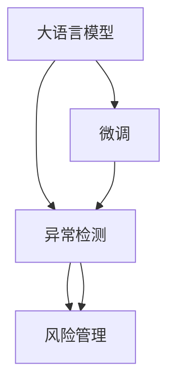

                 

# LLM与危机预警：提前识别潜在风险

> 关键词：大语言模型,危机预警,自然语言处理,异常检测,风险管理,人工智能

## 1. 背景介绍

### 1.1 问题由来
随着人工智能和大数据技术的迅速发展，大语言模型（Large Language Models, LLMs）在自然语言处理（Natural Language Processing, NLP）领域取得了显著的突破。这些模型能够通过预训练学习到语言中的复杂结构和语义信息，并通过微调（Fine-Tuning）在特定任务上实现高度的准确性和泛化能力。然而，LLMs在实际应用中仍面临一些挑战，尤其是在需要快速、准确地识别和预测潜在风险的场景中，传统的基于规则的策略往往无法满足需求。

### 1.2 问题核心关键点
本文聚焦于利用LLMs进行危机预警，探讨了LLMs在金融、安全、公共卫生等领域的应用潜力。LLMs能够通过分析大量文本数据，识别出文本中的异常模式和潜在风险信号，从而提前预测危机事件的发生，帮助相关部门及时采取应对措施，降低损失。

### 1.3 问题研究意义
研究LLM在危机预警中的应用，对于提升公共安全、金融风险管理、公共卫生应急响应等领域的效率和准确性具有重要意义：

1. **提高预测准确性**：LLMs可以学习到大量历史数据中的模式和规律，从而提高危机预警的准确性。
2. **快速响应**：LLMs能在短时间内处理和分析大量文本数据，实现快速预测。
3. **覆盖广泛场景**：LLMs可以应用于金融市场波动、恐怖袭击、自然灾害等不同领域，提升危机预警的通用性。
4. **降低人力成本**：LLMs可以自动分析大量数据，减少人工参与的需求，降低人力成本。

## 2. 核心概念与联系

### 2.1 核心概念概述

为了更好地理解LLM在危机预警中的应用，本文将介绍几个关键概念：

- **大语言模型（LLM）**：基于Transformer等架构的深度学习模型，能够通过预训练和微调学习复杂的语言表示。
- **微调（Fine-Tuning）**：在预训练的基础上，通过特定任务的数据对模型进行有监督训练，以提高模型在该任务上的性能。
- **异常检测（Anomaly Detection）**：识别出文本数据中的异常模式，从而预测潜在的危机事件。
- **风险管理（Risk Management）**：通过识别和评估潜在风险，制定相应的应对策略，以最小化风险带来的损失。

这些概念之间存在紧密的联系，LLM通过微调学习特定领域的知识，识别出异常模式，从而在危机预警中发挥重要作用。

### 2.2 核心概念原理和架构的 Mermaid 流程图



这个流程图展示了LLM、微调、异常检测和风险管理之间的逻辑关系：

1. LLM通过预训练学习通用的语言表示。
2. 微调使模型学习特定领域知识，识别出异常模式。
3. 异常检测从文本数据中识别出潜在风险信号。
4. 风险管理根据识别出的风险信号，制定相应的应对策略。

## 3. 核心算法原理 & 具体操作步骤
### 3.1 算法原理概述

LLM在危机预警中的应用，本质上是通过文本分析进行异常检测和风险评估。其核心思想是：利用预训练模型学习到语言中的复杂结构和语义信息，通过微调获得特定领域的知识，从而识别出文本中的异常模式，预测潜在风险。

形式化地，假设预训练模型为 $M_{\theta}$，其中 $\theta$ 为预训练得到的模型参数。给定历史危机事件文本数据集 $D=\{(x_i, y_i)\}_{i=1}^N$，其中 $x_i$ 为历史事件描述，$y_i$ 为事件类别（如金融危机、恐怖袭击等），微调的目标是找到新的模型参数 $\hat{\theta}$，使得模型在新的危机事件文本数据上预测准确率最高。

微调的优化目标为：

$$
\hat{\theta}=\mathop{\arg\min}_{\theta} \mathcal{L}(M_{\theta},D)
$$

其中 $\mathcal{L}$ 为预测准确率损失函数，即分类错误率：

$$
\mathcal{L}(M_{\theta},D) = \frac{1}{N}\sum_{i=1}^N \mathbb{1}(y_i \neq M_{\theta}(x_i))
$$

在得到最优模型参数 $\hat{\theta}$ 后，模型用于新的文本数据 $D_{new}$ 进行预测，从而识别出潜在风险。

### 3.2 算法步骤详解

基于LLM的危机预警，一般包括以下关键步骤：

**Step 1: 准备预训练模型和数据集**
- 选择合适的预训练语言模型 $M_{\theta}$ 作为初始化参数，如 BERT、GPT 等。
- 准备历史危机事件文本数据集 $D$，划分为训练集、验证集和测试集。

**Step 2: 添加任务适配层**
- 根据危机预警任务的特征，设计合适的输出层和损失函数。
- 对于二分类任务，通常在顶层添加线性分类器和交叉熵损失函数。

**Step 3: 设置微调超参数**
- 选择合适的优化算法及其参数，如 AdamW、SGD 等，设置学习率、批大小、迭代轮数等。
- 设置正则化技术及强度，包括权重衰减、Dropout、Early Stopping 等。
- 确定冻结预训练参数的策略，如仅微调顶层，或全部参数都参与微调。

**Step 4: 执行梯度训练**
- 将训练集数据分批次输入模型，前向传播计算损失函数。
- 反向传播计算参数梯度，根据设定的优化算法和学习率更新模型参数。
- 周期性在验证集上评估模型性能，根据性能指标决定是否触发 Early Stopping。
- 重复上述步骤直到满足预设的迭代轮数或 Early Stopping 条件。

**Step 5: 测试和部署**
- 在测试集上评估微调后模型 $M_{\hat{\theta}}$ 的性能，对比微调前后的准确率提升。
- 使用微调后的模型对新文本数据进行推理预测，集成到实际的应用系统中。
- 持续收集新的数据，定期重新微调模型，以适应数据分布的变化。

### 3.3 算法优缺点

利用LLM进行危机预警的方法具有以下优点：

- **高效性**：LLM能够快速处理大量文本数据，实现实时预测。
- **准确性**：通过微调学习特定领域知识，LLM能够在准确预测上取得显著效果。
- **泛化能力**：LLM能够应对不同类型的危机事件，提高预警的通用性。

同时，该方法也存在一些局限性：

- **依赖数据质量**：LLM的性能很大程度上取决于历史危机事件数据的质量和数量。
- **模型复杂性**：预训练模型和微调过程较为复杂，需要较强的技术支持和资源投入。
- **解释性不足**：LLM的决策过程缺乏可解释性，难以对其推理逻辑进行分析和调试。

尽管存在这些局限性，但LLM在危机预警中的应用仍展现出巨大的潜力。未来相关研究的重点在于如何进一步降低对数据的依赖，提高模型的泛化能力，同时兼顾可解释性和伦理安全性等因素。

### 3.4 算法应用领域

利用LLM进行危机预警的方法已经在金融、安全、公共卫生等诸多领域得到了应用，展示了其在实际场景中的强大能力：

- **金融领域**：利用LLM对金融市场数据进行监测，预测市场波动和金融危机。
- **安全领域**：通过分析恐怖袭击和网络安全事件描述，预测潜在的威胁。
- **公共卫生**：对疫情报告和医疗事件进行文本分析，预测疫情发展和公共卫生风险。

除了上述这些经典应用外，LLM还在犯罪预测、环境监测、社会事件预警等方面展现出广泛的应用前景，为各领域的安全和风险管理提供了新的工具和方法。

## 4. 数学模型和公式 & 详细讲解  
### 4.1 数学模型构建

假设预训练模型为 $M_{\theta}$，其中 $\theta$ 为预训练得到的模型参数。给定历史危机事件文本数据集 $D=\{(x_i, y_i)\}_{i=1}^N$，其中 $x_i$ 为历史事件描述，$y_i$ 为事件类别（如金融危机、恐怖袭击等）。

定义模型 $M_{\theta}$ 在输入 $x$ 上的输出为 $\hat{y}=M_{\theta}(x)$，表示模型对事件类别的预测概率。定义预测准确率为 $P(\hat{y}=y)$，即模型正确预测事件类别的概率。

### 4.2 公式推导过程

假设模型在输入 $x$ 上的输出为 $\hat{y}=M_{\theta}(x) \in [0,1]$，表示样本属于事件类别的概率。真实标签 $y \in \{0,1\}$。则二分类交叉熵损失函数定义为：

$$
\ell(M_{\theta}(x),y) = -[y\log \hat{y} + (1-y)\log (1-\hat{y})]
$$

将其代入经验风险公式，得：

$$
\mathcal{L}(\theta) = -\frac{1}{N}\sum_{i=1}^N [y_i\log M_{\theta}(x_i)+(1-y_i)\log(1-M_{\theta}(x_i))]
$$

在得到损失函数的梯度后，即可带入参数更新公式，完成模型的迭代优化。重复上述过程直至收敛，最终得到适应危机预警任务的最优模型参数 $\theta^*$。

## 5. 项目实践：代码实例和详细解释说明
### 5.1 开发环境搭建

在进行危机预警实践前，我们需要准备好开发环境。以下是使用Python进行PyTorch开发的环境配置流程：

1. 安装Anaconda：从官网下载并安装Anaconda，用于创建独立的Python环境。

2. 创建并激活虚拟环境：
```bash
conda create -n pytorch-env python=3.8 
conda activate pytorch-env
```

3. 安装PyTorch：根据CUDA版本，从官网获取对应的安装命令。例如：
```bash
conda install pytorch torchvision torchaudio cudatoolkit=11.1 -c pytorch -c conda-forge
```

4. 安装Transformers库：
```bash
pip install transformers
```

5. 安装各类工具包：
```bash
pip install numpy pandas scikit-learn matplotlib tqdm jupyter notebook ipython
```

完成上述步骤后，即可在`pytorch-env`环境中开始危机预警任务的开发。

### 5.2 源代码详细实现

下面以金融危机预测为例，给出使用Transformers库对BERT模型进行微调的PyTorch代码实现。

首先，定义金融危机预测任务的数据处理函数：

```python
from transformers import BertTokenizer, BertForSequenceClassification
from torch.utils.data import Dataset
import torch

class FinanceCrisisDataset(Dataset):
    def __init__(self, texts, labels, tokenizer, max_len=128):
        self.texts = texts
        self.labels = labels
        self.tokenizer = tokenizer
        self.max_len = max_len
        
    def __len__(self):
        return len(self.texts)
    
    def __getitem__(self, item):
        text = self.texts[item]
        label = self.labels[item]
        
        encoding = self.tokenizer(text, return_tensors='pt', max_length=self.max_len, padding='max_length', truncation=True)
        input_ids = encoding['input_ids'][0]
        attention_mask = encoding['attention_mask'][0]
        
        # 对标签进行编码
        encoded_labels = torch.tensor(label, dtype=torch.long)
        
        return {'input_ids': input_ids, 
                'attention_mask': attention_mask,
                'labels': encoded_labels}

# 标签与id的映射
label2id = {'good': 0, 'bad': 1}
id2label = {v: k for k, v in label2id.items()}

# 创建dataset
tokenizer = BertTokenizer.from_pretrained('bert-base-uncased')

train_dataset = FinanceCrisisDataset(train_texts, train_labels, tokenizer)
dev_dataset = FinanceCrisisDataset(dev_texts, dev_labels, tokenizer)
test_dataset = FinanceCrisisDataset(test_texts, test_labels, tokenizer)
```

然后，定义模型和优化器：

```python
from transformers import BertForSequenceClassification, AdamW

model = BertForSequenceClassification.from_pretrained('bert-base-uncased', num_labels=len(label2id))

optimizer = AdamW(model.parameters(), lr=2e-5)
```

接着，定义训练和评估函数：

```python
from torch.utils.data import DataLoader
from tqdm import tqdm
from sklearn.metrics import classification_report

device = torch.device('cuda') if torch.cuda.is_available() else torch.device('cpu')
model.to(device)

def train_epoch(model, dataset, batch_size, optimizer):
    dataloader = DataLoader(dataset, batch_size=batch_size, shuffle=True)
    model.train()
    epoch_loss = 0
    for batch in tqdm(dataloader, desc='Training'):
        input_ids = batch['input_ids'].to(device)
        attention_mask = batch['attention_mask'].to(device)
        labels = batch['labels'].to(device)
        model.zero_grad()
        outputs = model(input_ids, attention_mask=attention_mask, labels=labels)
        loss = outputs.loss
        epoch_loss += loss.item()
        loss.backward()
        optimizer.step()
    return epoch_loss / len(dataloader)

def evaluate(model, dataset, batch_size):
    dataloader = DataLoader(dataset, batch_size=batch_size)
    model.eval()
    preds, labels = [], []
    with torch.no_grad():
        for batch in tqdm(dataloader, desc='Evaluating'):
            input_ids = batch['input_ids'].to(device)
            attention_mask = batch['attention_mask'].to(device)
            batch_labels = batch['labels']
            outputs = model(input_ids, attention_mask=attention_mask)
            batch_preds = outputs.logits.argmax(dim=1).to('cpu').tolist()
            batch_labels = batch_labels.to('cpu').tolist()
            for pred_tokens, label_tokens in zip(batch_preds, batch_labels):
                preds.append(pred_tokens)
                labels.append(label_tokens)
                
    print(classification_report(labels, preds))
```

最后，启动训练流程并在测试集上评估：

```python
epochs = 5
batch_size = 16

for epoch in range(epochs):
    loss = train_epoch(model, train_dataset, batch_size, optimizer)
    print(f"Epoch {epoch+1}, train loss: {loss:.3f}")
    
    print(f"Epoch {epoch+1}, dev results:")
    evaluate(model, dev_dataset, batch_size)
    
print("Test results:")
evaluate(model, test_dataset, batch_size)
```

以上就是使用PyTorch对BERT进行金融危机预测任务的微调的完整代码实现。可以看到，得益于Transformers库的强大封装，我们可以用相对简洁的代码完成BERT模型的加载和微调。

### 5.3 代码解读与分析

让我们再详细解读一下关键代码的实现细节：

**FinanceCrisisDataset类**：
- `__init__`方法：初始化文本、标签、分词器等关键组件。
- `__len__`方法：返回数据集的样本数量。
- `__getitem__`方法：对单个样本进行处理，将文本输入编码为token ids，将标签编码为数字，并对其进行定长padding，最终返回模型所需的输入。

**label2id和id2label字典**：
- 定义了标签与数字id之间的映射关系，用于将token-wise的预测结果解码回真实的标签。

**训练和评估函数**：
- 使用PyTorch的DataLoader对数据集进行批次化加载，供模型训练和推理使用。
- 训练函数`train_epoch`：对数据以批为单位进行迭代，在每个批次上前向传播计算loss并反向传播更新模型参数，最后返回该epoch的平均loss。
- 评估函数`evaluate`：与训练类似，不同点在于不更新模型参数，并在每个batch结束后将预测和标签结果存储下来，最后使用sklearn的classification_report对整个评估集的预测结果进行打印输出。

**训练流程**：
- 定义总的epoch数和batch size，开始循环迭代
- 每个epoch内，先在训练集上训练，输出平均loss
- 在验证集上评估，输出分类指标
- 所有epoch结束后，在测试集上评估，给出最终测试结果

可以看到，PyTorch配合Transformers库使得BERT微调的代码实现变得简洁高效。开发者可以将更多精力放在数据处理、模型改进等高层逻辑上，而不必过多关注底层的实现细节。

当然，工业级的系统实现还需考虑更多因素，如模型的保存和部署、超参数的自动搜索、更灵活的任务适配层等。但核心的微调范式基本与此类似。

## 6. 实际应用场景
### 6.1 智能安全预警

基于大语言模型微调的危机预警技术，可以广泛应用于智能安全监控领域。传统安全监控系统依赖于规则库和人工审核，对于新型威胁难以快速响应。而利用微调后的安全模型，可以实时分析各类网络日志、事件报告，识别出潜在的安全威胁，实现快速预警。

在技术实现上，可以收集各类安全事件的历史记录，将事件描述和事件类型作为微调数据，训练模型学习预测新型威胁。微调后的模型能够自动分析实时数据，检测异常行为，并在第一时间发出预警，帮助安全人员及时应对潜在威胁。

### 6.2 金融市场波动预测

利用大语言模型微调的金融危机预警技术，可以应用于金融市场的监测和波动预测。传统金融分析往往依赖于历史数据和分析师的经验，难以适应快速变化的市场环境。而利用微调后的金融模型，可以自动分析各类财经新闻、社交媒体信息，识别出市场情绪和潜在的风险信号，从而预测市场波动，帮助投资者及时规避风险。

在技术实现上，可以收集历史财经新闻、市场评论、社交媒体动态等文本数据，构建金融危机标签数据集。在此基础上对预训练语言模型进行微调，使其能够学习到市场情绪和风险信号。微调后的模型能够自动分析实时数据，预测市场波动，提供精准的投资建议。

### 6.3 公共卫生应急响应

基于大语言模型微调的公共卫生预警技术，可以应用于疾病监测和应急响应。传统公共卫生监测依赖于人工调查和统计，对于新型疫情难以快速响应。而利用微调后的公共卫生模型，可以自动分析各类医疗报告、新闻报道，识别出疫情扩散趋势和潜在风险，实现快速预警和应急响应。

在技术实现上，可以收集历史疫情报告、新闻报道等文本数据，构建公共卫生危机标签数据集。在此基础上对预训练语言模型进行微调，使其能够学习到疫情特征和风险信号。微调后的模型能够自动分析实时数据，预测疫情扩散趋势，提供精准的疫情防控建议。

### 6.4 未来应用展望

随着大语言模型微调技术的发展，其在危机预警中的应用前景将更加广阔：

1. **多模态预警**：未来预警系统将融合视觉、听觉等多种模态信息，提高系统的感知能力和预警精度。
2. **实时动态预警**：利用在线微调技术，实时更新模型，提高预警的及时性和准确性。
3. **跨领域预警**：模型将涵盖更广泛的安全、金融、公共卫生等领域，提升预警的通用性和灵活性。
4. **集成智能决策**：结合机器学习、深度学习等技术，实现智能决策和预警，进一步提升预警系统的智能化水平。

## 7. 工具和资源推荐
### 7.1 学习资源推荐

为了帮助开发者系统掌握大语言模型微调的理论基础和实践技巧，这里推荐一些优质的学习资源：

1. 《Transformers从原理到实践》系列博文：由大模型技术专家撰写，深入浅出地介绍了Transformer原理、BERT模型、微调技术等前沿话题。

2. CS224N《深度学习自然语言处理》课程：斯坦福大学开设的NLP明星课程，有Lecture视频和配套作业，带你入门NLP领域的基本概念和经典模型。

3. 《Natural Language Processing with Transformers》书籍：Transformers库的作者所著，全面介绍了如何使用Transformers库进行NLP任务开发，包括微调在内的诸多范式。

4. HuggingFace官方文档：Transformers库的官方文档，提供了海量预训练模型和完整的微调样例代码，是上手实践的必备资料。

5. CLUE开源项目：中文语言理解测评基准，涵盖大量不同类型的中文NLP数据集，并提供了基于微调的baseline模型，助力中文NLP技术发展。

通过对这些资源的学习实践，相信你一定能够快速掌握大语言模型微调的精髓，并用于解决实际的NLP问题。

### 7.2 开发工具推荐

高效的开发离不开优秀的工具支持。以下是几款用于大语言模型微调开发的常用工具：

1. PyTorch：基于Python的开源深度学习框架，灵活动态的计算图，适合快速迭代研究。大部分预训练语言模型都有PyTorch版本的实现。

2. TensorFlow：由Google主导开发的开源深度学习框架，生产部署方便，适合大规模工程应用。同样有丰富的预训练语言模型资源。

3. Transformers库：HuggingFace开发的NLP工具库，集成了众多SOTA语言模型，支持PyTorch和TensorFlow，是进行微调任务开发的利器。

4. Weights & Biases：模型训练的实验跟踪工具，可以记录和可视化模型训练过程中的各项指标，方便对比和调优。与主流深度学习框架无缝集成。

5. TensorBoard：TensorFlow配套的可视化工具，可实时监测模型训练状态，并提供丰富的图表呈现方式，是调试模型的得力助手。

6. Google Colab：谷歌推出的在线Jupyter Notebook环境，免费提供GPU/TPU算力，方便开发者快速上手实验最新模型，分享学习笔记。

合理利用这些工具，可以显著提升大语言模型微调任务的开发效率，加快创新迭代的步伐。

### 7.3 相关论文推荐

大语言模型和微调技术的发展源于学界的持续研究。以下是几篇奠基性的相关论文，推荐阅读：

1. Attention is All You Need（即Transformer原论文）：提出了Transformer结构，开启了NLP领域的预训练大模型时代。

2. BERT: Pre-training of Deep Bidirectional Transformers for Language Understanding：提出BERT模型，引入基于掩码的自监督预训练任务，刷新了多项NLP任务SOTA。

3. Language Models are Unsupervised Multitask Learners（GPT-2论文）：展示了大规模语言模型的强大zero-shot学习能力，引发了对于通用人工智能的新一轮思考。

4. Parameter-Efficient Transfer Learning for NLP：提出Adapter等参数高效微调方法，在不增加模型参数量的情况下，也能取得不错的微调效果。

5. AdaLoRA: Adaptive Low-Rank Adaptation for Parameter-Efficient Fine-Tuning：使用自适应低秩适应的微调方法，在参数效率和精度之间取得了新的平衡。

6. Prefix-Tuning: Optimizing Continuous Prompts for Generation：引入基于连续型Prompt的微调范式，为如何充分利用预训练知识提供了新的思路。

这些论文代表了大语言模型微调技术的发展脉络。通过学习这些前沿成果，可以帮助研究者把握学科前进方向，激发更多的创新灵感。

## 8. 总结：未来发展趋势与挑战

### 8.1 总结

本文对利用大语言模型进行危机预警的方法进行了全面系统的介绍。首先阐述了大语言模型和微调技术的研究背景和意义，明确了微调在拓展预训练模型应用、提升下游任务性能方面的独特价值。其次，从原理到实践，详细讲解了微调的具体操作步骤，并给出了微调任务开发的完整代码实例。同时，本文还广泛探讨了微调方法在智能安全、金融、公共卫生等领域的实际应用，展示了微调范式的巨大潜力。

通过本文的系统梳理，可以看到，利用大语言模型进行危机预警的方法在NLP领域中的应用前景广阔，值得深入研究和应用。

### 8.2 未来发展趋势

展望未来，大语言模型微调技术将呈现以下几个发展趋势：

1. **模型规模持续增大**：随着算力成本的下降和数据规模的扩张，预训练语言模型的参数量还将持续增长。超大模型能够学习到更复杂、更全面的语言表示，提高危机预警的准确性和泛化性。

2. **微调方法日趋多样**：除了传统的全参数微调外，未来会涌现更多参数高效的微调方法，如Prefix-Tuning、LoRA等，在减小模型规模的同时，保持微调精度。

3. **实时动态微调**：利用在线微调技术，实时更新模型，提高预警的及时性和准确性。在线微调能够快速响应用户需求，提升系统的动态适应能力。

4. **多模态融合**：未来预警系统将融合视觉、听觉等多种模态信息，提高系统的感知能力和预警精度。多模态融合能够综合利用多种信息源，提升系统的全面性和鲁棒性。

5. **跨领域预警**：模型将涵盖更广泛的安全、金融、公共卫生等领域，提升预警的通用性和灵活性。跨领域预警能够拓展模型的应用场景，提升系统的实用性和价值。

6. **智能决策支持**：结合机器学习、深度学习等技术，实现智能决策和预警，进一步提升预警系统的智能化水平。智能决策能够利用更高级的算法和模型，提升决策的精准性和可靠性。

这些趋势凸显了大语言模型微调技术的广阔前景。这些方向的探索发展，必将进一步提升危机预警系统的性能和应用范围，为社会的安全、稳定和发展提供重要保障。

### 8.3 面临的挑战

尽管大语言模型微调技术已经取得了瞩目成就，但在迈向更加智能化、普适化应用的过程中，它仍面临着诸多挑战：

1. **标注成本瓶颈**：微调的效果很大程度上取决于标注数据的质量和数量，标注数据获取成本较高。如何进一步降低微调对标注样本的依赖，将是一大难题。

2. **模型鲁棒性不足**：当前微调模型面对域外数据时，泛化性能往往大打折扣。对于测试样本的微小扰动，微调模型的预测也容易发生波动。如何提高微调模型的鲁棒性，避免灾难性遗忘，还需要更多理论和实践的积累。

3. **推理效率有待提高**：大规模语言模型虽然精度高，但在实际部署时往往面临推理速度慢、内存占用大等效率问题。如何在保证性能的同时，简化模型结构，提升推理速度，优化资源占用，将是重要的优化方向。

4. **可解释性亟需加强**：当前微调模型更像是"黑盒"系统，难以解释其内部工作机制和决策逻辑。对于医疗、金融等高风险应用，算法的可解释性和可审计性尤为重要。如何赋予微调模型更强的可解释性，将是亟待攻克的难题。

5. **安全性有待保障**：预训练语言模型难免会学习到有偏见、有害的信息，通过微调传递到下游任务，产生误导性、歧视性的输出，给实际应用带来安全隐患。如何从数据和算法层面消除模型偏见，避免恶意用途，确保输出的安全性，也将是重要的研究课题。

6. **知识整合能力不足**：现有的微调模型往往局限于任务内数据，难以灵活吸收和运用更广泛的先验知识。如何让微调过程更好地与外部知识库、规则库等专家知识结合，形成更加全面、准确的信息整合能力，还有很大的想象空间。

正视微调面临的这些挑战，积极应对并寻求突破，将是大语言模型微调走向成熟的必由之路。相信随着学界和产业界的共同努力，这些挑战终将一一被克服，大语言模型微调必将在构建安全、可靠、可解释、可控的智能系统铺平道路。

### 8.4 研究展望

面向未来，大语言模型微调技术还需要在其他领域进行深入研究和应用：

1. **智慧医疗**：基于大语言模型的微调技术，可以应用于医疗问答、病历分析、药物研发等任务，提升医疗服务的智能化水平。

2. **智能教育**：微调技术可应用于作业批改、学情分析、知识推荐等方面，因材施教，促进教育公平，提高教学质量。

3. **智慧城市治理**：微调模型可应用于城市事件监测、舆情分析、应急指挥等环节，提高城市管理的自动化和智能化水平。

4. **企业生产管理**：微调技术可应用于生产调度、质量控制、设备维护等方面，提升企业的生产效率和管理水平。

5. **社会治理**：微调模型可应用于社会事件监测、舆情分析、公共政策评估等方面，提升社会治理的智能化水平。

这些领域的应用将进一步拓展大语言模型微调技术的应用范围，为社会各行业的智能化升级提供新的动力。相信随着技术的不断进步，微调方法将在更多的领域落地应用，推动人工智能技术的普及和深化。

## 9. 附录：常见问题与解答

**Q1：大语言模型微调是否适用于所有NLP任务？**

A: 大语言模型微调在大多数NLP任务上都能取得不错的效果，特别是对于数据量较小的任务。但对于一些特定领域的任务，如医学、法律等，仅仅依靠通用语料预训练的模型可能难以很好地适应。此时需要在特定领域语料上进一步预训练，再进行微调，才能获得理想效果。此外，对于一些需要时效性、个性化很强的任务，如对话、推荐等，微调方法也需要针对性的改进优化。

**Q2：微调过程中如何选择合适的学习率？**

A: 微调的学习率一般要比预训练时小1-2个数量级，如果使用过大的学习率，容易破坏预训练权重，导致过拟合。一般建议从1e-5开始调参，逐步减小学习率，直至收敛。也可以使用warmup策略，在开始阶段使用较小的学习率，再逐渐过渡到预设值。需要注意的是，不同的优化器(如AdamW、Adafactor等)以及不同的学习率调度策略，可能需要设置不同的学习率阈值。

**Q3：采用大语言模型微调时会面临哪些资源瓶颈？**

A: 目前主流的预训练大模型动辄以亿计的参数规模，对算力、内存、存储都提出了很高的要求。GPU/TPU等高性能设备是必不可少的，但即便如此，超大批次的训练和推理也可能遇到显存不足的问题。因此需要采用一些资源优化技术，如梯度积累、混合精度训练、模型并行等，来突破硬件瓶颈。同时，模型的存储和读取也可能占用大量时间和空间，需要采用模型压缩、稀疏化存储等方法进行优化。

**Q4：如何缓解微调过程中的过拟合问题？**

A: 过拟合是微调面临的主要挑战，尤其是在标注数据不足的情况下。常见的缓解策略包括：
1. 数据增强：通过回译、近义替换等方式扩充训练集
2. 正则化：使用L2正则、Dropout、Early Stopping等避免过拟合
3. 对抗训练：引入对抗样本，提高模型鲁棒性
4. 参数高效微调：只调整少量参数(如Adapter、Prefix等)，减小过拟合风险
5. 多模型集成：训练多个微调模型，取平均输出，抑制过拟合

这些策略往往需要根据具体任务和数据特点进行灵活组合。只有在数据、模型、训练、推理等各环节进行全面优化，才能最大限度地发挥大模型微调的威力。

**Q5：微调模型在落地部署时需要注意哪些问题？**

A: 将微调模型转化为实际应用，还需要考虑以下因素：
1. 模型裁剪：去除不必要的层和参数，减小模型尺寸，加快推理速度
2. 量化加速：将浮点模型转为定点模型，压缩存储空间，提高计算效率
3. 服务化封装：将模型封装为标准化服务接口，便于集成调用
4. 弹性伸缩：根据请求流量动态调整资源配置，平衡服务质量和成本
5. 监控告警：实时采集系统指标，设置异常告警阈值，确保服务稳定性
6. 安全防护：采用访问鉴权、数据脱敏等措施，保障数据和模型安全

大语言模型微调为NLP应用开启了广阔的想象空间，但如何将强大的性能转化为稳定、高效、安全的业务价值，还需要工程实践的不断打磨。唯有从数据、算法、工程、业务等多个维度协同发力，才能真正实现人工智能技术在垂直行业的规模化落地。总之，微调需要开发者根据具体任务，不断迭代和优化模型、数据和算法，方能得到理想的效果。

---

作者：禅与计算机程序设计艺术 / Zen and the Art of Computer Programming

