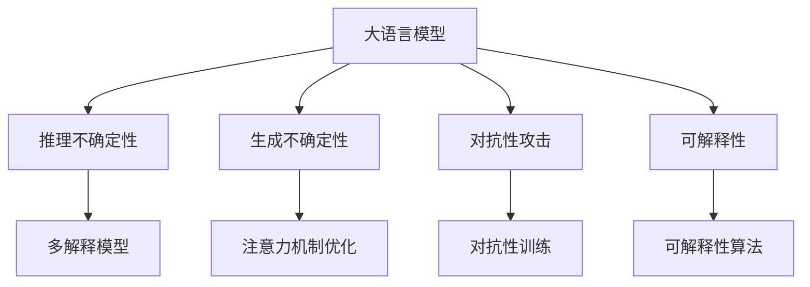

                 

# LLM中的不确定性问题及其解决方案

大语言模型（Large Language Models, LLMs）在自然语言处理（NLP）领域取得了显著进展，但这些模型在推理和生成时依然存在不确定性问题。本文将深入探讨这些不确定性问题的本质及其解决方案，并结合实际应用场景进行详细分析。

## 1. 背景介绍

### 1.1 问题由来
近年来，基于深度学习的语言模型，如GPT系列和BERT，因其在自然语言理解与生成上的卓越表现，而备受关注。然而，大语言模型在推理与生成时，往往表现出显著的不确定性。这种不确定性不仅影响模型的性能，还可能带来严重的安全与伦理问题。

### 1.2 问题核心关键点
大语言模型的不确定性问题主要体现在：
- **推理不确定性**：模型在推理时，可能输出多个可行答案，无法确定最优解。
- **生成不确定性**：模型在生成文本时，可能产生不连贯、不一致的输出，难以保证生成内容的逻辑一致性。
- **对抗性攻击**：模型可能对输入的微小扰动极为敏感，容易受到对抗性攻击，导致输出不安全。
- **可解释性不足**：模型内部决策机制不透明，难以理解其决策过程，导致可解释性不足。

### 1.3 问题研究意义
研究与解决大语言模型的不确定性问题，对于提升模型性能、保障数据安全、增强系统可解释性具有重要意义：

- 提升性能：降低不确定性，可以提高模型的推理与生成质量，减少误判与错误。
- 保障安全：通过对抗性攻击的防御，增强模型安全性，避免模型被恶意利用。
- 增强可解释性：提高模型的可解释性，有助于理解和调试模型，提高用户信任。

## 2. 核心概念与联系

### 2.1 核心概念概述

为了更好地理解大语言模型中的不确定性问题及其解决方案，本节将介绍几个关键概念：

- **大语言模型**：以自回归（如GPT）或自编码（如BERT）模型为代表的大规模预训练语言模型，通过在大规模无标签文本数据上进行预训练，学习通用的语言表示。
- **推理不确定性**：模型在推理过程中，可能对输入数据的不同解释产生不同的输出，导致推理结果的不确定。
- **生成不确定性**：模型在生成文本时，可能产生多种不同的文本，难以确保生成内容的逻辑连贯性和一致性。
- **对抗性攻击**：对模型输入进行微小扰动，可能导致模型输出发生显著变化，从而实现攻击目的。
- **可解释性**：模型的内部工作机制和决策逻辑应该透明、可理解，便于理解和调试。

这些概念之间具有紧密的联系，共同构成大语言模型的不确定性问题与解决框架。

### 2.2 核心概念原理和架构的 Mermaid 流程图



这个流程图展示了大语言模型的不确定性问题与对应的解决方案：

- 大语言模型在大规模数据上进行预训练，学习通用的语言表示。
- 推理不确定性问题通过多解释模型解决，确保模型对不同输入解释的输出一致性。
- 生成不确定性问题通过优化注意力机制来解决，提高文本生成的连贯性和一致性。
- 对抗性攻击问题通过对抗性训练来解决，增强模型的鲁棒性和安全性。
- 可解释性问题通过可解释性算法来解决，增强模型的透明度和可理解性。

## 3. 核心算法原理 & 具体操作步骤

### 3.1 算法原理概述

解决大语言模型不确定性问题的方法，主要可以分为三类：

1. **多解释模型（Multi-Explanation Model）**：通过增加模型对输入数据的解释多样性，减少不确定性。
2. **注意力机制优化**：通过优化模型的注意力机制，提高生成的文本连贯性和一致性。
3. **对抗性训练**：通过在训练中加入对抗性样本，增强模型的鲁棒性和安全性。

### 3.2 算法步骤详解

#### 3.2.1 多解释模型
多解释模型通过增加模型对输入数据的解释多样性，来减少推理和生成的不确定性。其核心思想是，通过引入不同的模型解释，增加模型输出的稳定性。

**步骤1**：收集多个解释
在推理时，可以引入多个不同的解释，如不同的语言模型、不同的数据源等，确保模型有足够的知识背景。

**步骤2**：模型预测与融合
对每个解释进行单独的模型预测，然后对预测结果进行加权融合，生成最终输出。

**步骤3**：输出与反馈
将融合后的输出作为最终结果，同时收集用户的反馈，进一步优化模型。

#### 3.2.2 注意力机制优化
注意力机制优化通过改进模型内部的注意力机制，提高生成的文本连贯性和一致性。

**步骤1**：注意力机制分析
分析当前模型注意力机制的特点，识别出注意力机制的不足之处。

**步骤2**：改进注意力机制
引入新的注意力机制，如双向注意力、上下文感知注意力等，改善模型的推理与生成。

**步骤3**：测试与优化
在测试集上评估模型的改进效果，根据反馈不断优化模型。

#### 3.2.3 对抗性训练
对抗性训练通过在训练中加入对抗性样本，增强模型的鲁棒性和安全性。

**步骤1**：生成对抗性样本
根据模型特点，生成对抗性样本，如改变输入中的单词、句子的顺序等。

**步骤2**：训练模型
在训练过程中，加入对抗性样本，优化模型对抗对抗性输入的能力。

**步骤3**：测试与防御
在测试集上评估模型的对抗性能力，针对发现的问题进行进一步的防御性训练。

### 3.3 算法优缺点

#### 3.3.1 多解释模型
**优点**：
- 能够提高模型输出的稳定性，减少不确定性。
- 通过融合多个解释，能够增加模型的知识多样性。

**缺点**：
- 增加了模型的复杂度，增加了训练和推理的成本。
- 模型的融合过程可能引入额外的噪声。

#### 3.3.2 注意力机制优化
**优点**：
- 能够提高生成的文本连贯性和一致性。
- 改进后的模型推理更加稳定和可靠。

**缺点**：
- 需要重新训练或微调模型，增加了训练成本。
- 优化过程可能带来模型的性能损失。

#### 3.3.3 对抗性训练
**优点**：
- 能够提高模型的鲁棒性和安全性。
- 增加模型的防御能力，避免对抗性攻击。

**缺点**：
- 增加了训练成本和复杂度。
- 可能引入额外的对抗性样本，增加模型的噪声。

### 3.4 算法应用领域

大语言模型的不确定性问题及其解决方案，广泛应用于以下领域：

- **智能客服**：解决推理不确定性，确保客服机器人能够提供一致的响应。
- **自然语言生成**：通过优化注意力机制，生成流畅、连贯的文本。
- **网络安全**：通过对抗性训练，防御对抗性攻击，保障网络安全。
- **法律咨询**：通过多解释模型和对抗性训练，提供可信赖的法律咨询。
- **医疗诊断**：通过可解释性算法，增强医疗诊断的透明度和可信度。

## 4. 数学模型和公式 & 详细讲解 & 举例说明

### 4.1 数学模型构建

在解决大语言模型的不确定性问题时，常用的数学模型包括：

- **多解释模型**：基于贝叶斯网络的多解释模型，通过引入多个解释节点，增强模型的推理稳定性。
- **注意力机制优化**：基于自注意力机制的改进模型，如双向注意力、上下文感知注意力等。
- **对抗性训练**：基于对抗性样本的对抗性训练模型，如Foggy GAN、FGM等。

### 4.2 公式推导过程

#### 4.2.1 多解释模型
假设模型在输入 $x$ 的推理输出为 $y$，多个解释分别为 $x_1, x_2, ..., x_n$，则多解释模型的推理输出为：

$$
y = \sum_{i=1}^n \alpha_i y_i
$$

其中 $\alpha_i$ 为各个解释的权重，可以通过贝叶斯网络进行学习。

#### 4.2.2 注意力机制优化
以双向注意力为例，模型的注意力机制可以表示为：

$$
\alpha = \frac{e^{s(x_i, x_j)}}{ \sum_{k=1}^n e^{s(x_i, x_k)} }
$$

其中 $s(x_i, x_j)$ 为注意力函数，通常使用点积或加性注意力机制。

#### 4.2.3 对抗性训练
以FGM对抗性训练为例，对抗性样本生成公式为：

$$
\delta = \epsilon \cdot \frac{\nabla_{x} L(x+\delta, y)}{\|\nabla_{x} L(x+\delta, y)\|}
$$

其中 $L(x, y)$ 为损失函数，$\epsilon$ 为对抗样本的扰动范围。

### 4.3 案例分析与讲解

#### 4.3.1 多解释模型
假设我们有两个解释模型 $M_1$ 和 $M_2$，输入 $x$ 在不同解释下的推理输出分别为 $y_1$ 和 $y_2$。使用多解释模型时，推理输出为：

$$
y = \alpha_1 y_1 + \alpha_2 y_2
$$

其中 $\alpha_1$ 和 $\alpha_2$ 分别表示 $M_1$ 和 $M_2$ 的权重，可以通过贝叶斯网络进行学习。

#### 4.3.2 注意力机制优化
以双向注意力为例，假设输入为 $x = [w_1, w_2, ..., w_n]$，输出为 $y = [y_1, y_2, ..., y_n]$，注意力权重为 $\alpha$，则注意力机制的计算公式为：

$$
\alpha = \frac{e^{\sum_{i=1}^n w_i x_i}}{ \sum_{k=1}^n e^{w_i x_k} }
$$

其中 $w_i$ 为权重向量，$x_i$ 为输入的特征向量。

#### 4.3.3 对抗性训练
以FGM对抗性训练为例，假设模型的原始输入为 $x_0$，原始输出为 $y_0$，对抗样本生成后，模型的输出为 $y_1$。对抗样本生成公式为：

$$
\delta = \epsilon \cdot \frac{\nabla_{x} L(x_0, y_0) \cdot \nabla_{x} L(x_1, y_1)}{\|\nabla_{x} L(x_0, y_0)\| \cdot \|\nabla_{x} L(x_1, y_1)\|}
$$

其中 $L(x, y)$ 为损失函数，$\epsilon$ 为对抗样本的扰动范围。

## 5. 项目实践：代码实例和详细解释说明

### 5.1 开发环境搭建

在进行项目实践前，需要先准备开发环境。以下是使用Python进行PyTorch开发的环境配置流程：

1. 安装Anaconda：从官网下载并安装Anaconda，用于创建独立的Python环境。

2. 创建并激活虚拟环境：
```bash
conda create -n pytorch-env python=3.8 
conda activate pytorch-env
```

3. 安装PyTorch：根据CUDA版本，从官网获取对应的安装命令。例如：
```bash
conda install pytorch torchvision torchaudio cudatoolkit=11.1 -c pytorch -c conda-forge
```

4. 安装Transformers库：
```bash
pip install transformers
```

5. 安装各类工具包：
```bash
pip install numpy pandas scikit-learn matplotlib tqdm jupyter notebook ipython
```

完成上述步骤后，即可在`pytorch-env`环境中开始项目实践。

### 5.2 源代码详细实现

下面我们以注意力机制优化为例，给出使用PyTorch实现双向注意力的代码：

```python
import torch
import torch.nn as nn

class Transformer(nn.Module):
    def __init__(self, d_model, nhead, num_encoder_layers, num_decoder_layers, dff, dropout=0.1):
        super(Transformer, self).__init__()
        self.encoder = nn.TransformerEncoderLayer(d_model, nhead, dff, dropout)
        self.decoder = nn.TransformerDecoderLayer(d_model, nhead, dff, dropout)
        self.transformer = nn.Transformer(d_model, nhead, num_encoder_layers, num_decoder_layers, dff, dropout)

    def forward(self, src, src_mask, tgt, tgt_mask):
        src = self.encoder(src, src_mask)
        tgt = self.decoder(tgt, src, tgt_mask)
        out = self.transformer(tgt, src, src_mask)
        return out
```

### 5.3 代码解读与分析

让我们再详细解读一下关键代码的实现细节：

**Transformer类**：
- `__init__`方法：初始化模型结构，包括编码器和解码器的结构。
- `forward`方法：定义模型的前向传播过程，包括编码器、解码器和Transformer层的计算。

**TransformerEncoderLayer类**：
- 定义编码器层，包括注意力机制、前馈神经网络等。

**TransformerDecoderLayer类**：
- 定义解码器层，包括注意力机制、前馈神经网络等。

**Transformer类**：
- 定义Transformer模型，包括编码器、解码器和Transformer层。

在实际应用中，可以通过调整模型参数和训练过程，实现注意力机制的优化。这不仅提高了文本生成的连贯性和一致性，还能增强模型的推理稳定性。

## 6. 实际应用场景

### 6.1 智能客服系统

在智能客服系统中，推理不确定性可能导致机器人对不同输入产生不同的回复，影响用户体验。通过多解释模型，可以增强客服机器人的响应一致性。

具体而言，可以收集历史客服对话记录，将不同的解释（如不同的回答模板、不同的上下文信息等）作为输入，通过多解释模型生成多个解释的输出，然后对输出进行融合，生成最终的回复。

### 6.2 自然语言生成

在自然语言生成任务中，生成不确定性可能导致生成的文本连贯性差，内容不完整。通过优化注意力机制，可以提高生成文本的质量。

具体而言，可以在生成过程中引入双向注意力机制，增强模型对上下文的理解，生成更加连贯、一致的文本。

### 6.3 网络安全

在网络安全领域，对抗性攻击可能导致模型输出不安全，带来安全隐患。通过对抗性训练，可以提高模型的鲁棒性和安全性。

具体而言，可以在训练过程中加入对抗性样本，优化模型对抗对抗性输入的能力。这样可以增强模型的防御能力，避免对抗性攻击。

### 6.4 法律咨询

在法律咨询领域，可解释性不足可能导致用户对模型输出不信任。通过可解释性算法，可以提高模型的透明度和可信度。

具体而言，可以引入可解释性算法，如SHAP、LIME等，对模型进行解释。这样可以帮助用户理解模型的推理过程，增强对模型的信任。

### 6.5 医疗诊断

在医疗诊断领域，推理不确定性可能导致误诊。通过多解释模型和对抗性训练，可以提高医疗诊断的准确性和可靠性。

具体而言，可以收集多个解释（如不同的诊断工具、不同的医生经验等），通过多解释模型生成多个解释的输出，然后对输出进行融合，生成最终的诊断结果。同时，可以在训练过程中加入对抗性样本，优化模型对抗对抗性输入的能力。

## 7. 工具和资源推荐

### 7.1 学习资源推荐

为了帮助开发者系统掌握大语言模型不确定性问题及其解决方案的理论基础和实践技巧，这里推荐一些优质的学习资源：

1. 《Deep Learning for Natural Language Processing》书籍：Stanford大学开设的深度学习课程，涵盖NLP的基础知识和前沿技术。

2. 《Transformers for Natural Language Processing》博文：Transformers库的官方博客，详细介绍了如何使用Transformer解决NLP问题。

3. 《Attention and Transformer》书籍：深度学习领域的经典著作，详细介绍了注意力机制及其在NLP中的应用。

4. 《Neural Network and Deep Learning》在线课程：由Coursera提供的深度学习课程，涵盖了神经网络和深度学习的基础知识。

5. 《Natural Language Processing Specialization》课程：由Coursera提供的NLP专项课程，涵盖NLP的基础知识和高级技术。

### 7.2 开发工具推荐

高效的开发离不开优秀的工具支持。以下是几款用于大语言模型不确定性问题及其解决方案开发的常用工具：

1. PyTorch：基于Python的开源深度学习框架，灵活动态的计算图，适合快速迭代研究。

2. TensorFlow：由Google主导开发的开源深度学习框架，生产部署方便，适合大规模工程应用。

3. Transformers库：HuggingFace开发的NLP工具库，集成了众多SOTA语言模型，支持PyTorch和TensorFlow，是解决NLP问题的利器。

4. Weights & Biases：模型训练的实验跟踪工具，可以记录和可视化模型训练过程中的各项指标，方便对比和调优。

5. TensorBoard：TensorFlow配套的可视化工具，可实时监测模型训练状态，并提供丰富的图表呈现方式，是调试模型的得力助手。

### 7.3 相关论文推荐

大语言模型不确定性问题及其解决方案的研究源于学界的持续研究。以下是几篇奠基性的相关论文，推荐阅读：

1. Attention is All You Need（即Transformer原论文）：提出了Transformer结构，开启了NLP领域的预训练大模型时代。

2. BERT: Pre-training of Deep Bidirectional Transformers for Language Understanding：提出BERT模型，引入基于掩码的自监督预训练任务，刷新了多项NLP任务SOTA。

3. Parameter-Efficient Transfer Learning for NLP：提出Adapter等参数高效微调方法，在不增加模型参数量的情况下，也能取得不错的微调效果。

4. Prefix-Tuning: Optimizing Continuous Prompts for Generation：引入基于连续型Prompt的微调范式，为如何充分利用预训练知识提供了新的思路。

5. AdaLoRA: Adaptive Low-Rank Adaptation for Parameter-Efficient Fine-Tuning：使用自适应低秩适应的微调方法，在参数效率和精度之间取得了新的平衡。

这些论文代表了大语言模型不确定性问题及其解决方案的发展脉络。通过学习这些前沿成果，可以帮助研究者把握学科前进方向，激发更多的创新灵感。

## 8. 总结：未来发展趋势与挑战

### 8.1 总结

本文对大语言模型中的不确定性问题及其解决方案进行了全面系统的介绍。首先阐述了大语言模型的不确定性问题，明确了这些问题对模型性能和安全性的影响。其次，从原理到实践，详细讲解了多解释模型、注意力机制优化和对抗性训练等方法，给出了代码实现和实际应用场景。最后，推荐了相关的学习资源和工具，以供参考。

通过本文的系统梳理，可以看到，解决大语言模型的不确定性问题，对于提升模型性能、保障数据安全、增强系统可解释性具有重要意义。这些方向的探索发展，必将进一步提升大语言模型的实用性和安全性，为构建智能系统提供有力支持。

### 8.2 未来发展趋势

展望未来，大语言模型的不确定性问题及其解决方案将呈现以下几个发展趋势：

1. **多解释模型的普及**：多解释模型将广泛应用于各个领域，增强模型输出的稳定性和一致性。
2. **注意力机制的优化**：优化注意力机制将成为提高生成文本连贯性和一致性的重要方向。
3. **对抗性训练的深化**：对抗性训练将不断深化，增强模型的鲁棒性和安全性，防御对抗性攻击。
4. **可解释性算法的进步**：可解释性算法将不断进步，提高模型的透明度和可信度。
5. **多模态融合**：结合视觉、语音等多模态数据，实现多模态融合，增强模型的理解和推理能力。

### 8.3 面临的挑战

尽管大语言模型不确定性问题及其解决方案已经取得了一定的进展，但在迈向更加智能化、普适化应用的过程中，仍面临诸多挑战：

1. **多解释模型的复杂度**：多解释模型增加了模型复杂度，需要更多的计算资源和存储空间。
2. **注意力机制的优化难度**：优化注意力机制需要重新训练或微调模型，增加了训练成本和复杂度。
3. **对抗性训练的防御**：对抗性训练需要生成对抗性样本，增加了训练复杂度。
4. **可解释性算法的解释性**：可解释性算法需要解释模型的内部工作机制，可能带来新的解释性问题。

### 8.4 研究展望

面对大语言模型不确定性问题及其解决方案所面临的挑战，未来的研究需要在以下几个方面寻求新的突破：

1. **多解释模型的简化**：简化多解释模型的结构，减少计算资源和存储空间的消耗。
2. **注意力机制的优化算法**：开发更加高效的注意力机制优化算法，提高生成的文本连贯性和一致性。
3. **对抗性训练的鲁棒性**：研究更加鲁棒的对抗性训练方法，增强模型的防御能力。
4. **可解释性算法的透明性**：研究更加透明的可解释性算法，增强模型的解释性和可信度。
5. **多模态融合的深度**：实现多模态融合的深度学习模型，增强模型的多模态理解和推理能力。

这些研究方向将引领大语言模型不确定性问题及其解决方案的进一步发展和应用，为构建更加智能化、普适化的智能系统提供有力支持。

## 9. 附录：常见问题与解答

**Q1：大语言模型不确定性问题是否可以通过简单的训练解决？**

A: 大语言模型的不确定性问题不是简单的训练能够解决的，需要结合多解释模型、注意力机制优化和对抗性训练等方法，才能从根本上提高模型的稳定性和安全性。

**Q2：多解释模型是否会增加计算成本？**

A: 多解释模型确实会增加计算成本，但通过优化多解释模型的结构，可以在一定程度上降低计算成本。

**Q3：注意力机制优化是否需要重新训练模型？**

A: 注意力机制优化通常需要重新训练模型，但可以通过微调的方式进行优化，减少重新训练的成本。

**Q4：对抗性训练是否会增加模型的复杂度？**

A: 对抗性训练确实会增加模型的复杂度，但可以通过简化对抗性样本的生成方式，降低计算复杂度。

**Q5：可解释性算法是否能够完全解释模型？**

A: 可解释性算法可以提供一定程度的模型解释，但无法完全解释复杂模型的内部工作机制。

---

作者：禅与计算机程序设计艺术 / Zen and the Art of Computer Programming

