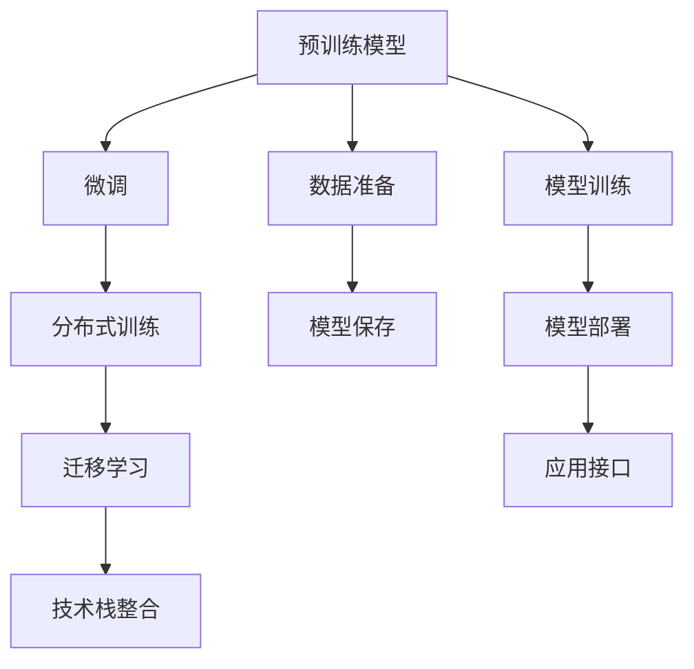

                 

# LLM产业链生态:从无到有的演进

> 关键词：语言模型,大模型,预训练,微调,分布式训练,迁移学习,自然语言处理(NLP),深度学习,计算机视觉(CV),语音识别,技术栈

## 1. 背景介绍

### 1.1 问题由来

近年，随着深度学习技术的快速发展，自然语言处理(NLP)领域取得了显著突破，尤其以大规模语言模型（LLMs）的崛起最为瞩目。从最早的LSTM模型到现今GPT、BERT等主流大模型，语言模型经历了从简单到复杂、从集中式到分布式、从单模态到多模态的快速演进。

但相较于理论研究，实际应用中LLM产业链的构建面临不少挑战。从预训练到微调、从数据集到算力，从技术到业务，每个环节都需要精心设计和迭代优化。本文将深入剖析LLM产业链生态的构建过程，从预训练到微调、从模型训练到应用部署，全面介绍其从无到有的演进历程。

### 1.2 问题核心关键点

构建LLM产业链生态的核心在于：
- **预训练模型构建**：如何利用大规模无标签数据构建基础语言模型。
- **微调技术优化**：如何在大模型上应用微调技术提升特定任务性能。
- **分布式训练**：如何高效地训练大规模语言模型，降低单设备训练成本。
- **迁移学习**：如何实现不同模型之间的知识迁移。
- **技术栈整合**：如何将预训练、微调、分布式训练等技术高效整合。

## 2. 核心概念与联系

### 2.1 核心概念概述

构建LLM产业链生态涉及众多关键概念，包括：

- **预训练模型**：如BERT、GPT、T5等，通过大规模无标签文本数据预训练，学习通用语言表示。
- **微调技术**：基于监督学习或迁移学习，在大模型基础上微调特定任务性能。
- **分布式训练**：通过多台设备并行训练，加速模型训练速度，降低单设备资源需求。
- **迁移学习**：将预训练模型应用于下游任务，提升模型泛化能力。
- **技术栈整合**：涉及深度学习框架、分布式系统、存储系统、计算系统等多方面的技术。

这些概念相互关联，共同构成了LLM产业链生态的核心框架。本文将从预训练到微调、从分布式训练到迁移学习，逐一展开介绍。

### 2.2 核心概念原理和架构的 Mermaid 流程图



这个流程图展示了预训练、微调、分布式训练、迁移学习和技术栈整合之间的关联关系。

## 3. 核心算法原理 & 具体操作步骤

### 3.1 算法原理概述

构建LLM产业链生态涉及多个核心算法原理，主要包括：

- **自监督预训练**：如BERT的Masked Language Model (MLM)，通过预测被屏蔽的词还原句子意义。
- **微调算法**：如Fine-Tuning，在大模型基础上针对特定任务优化模型性能。
- **分布式训练算法**：如TensorFlow的分布式训练框架，通过多台设备并行加速模型训练。
- **迁移学习算法**：如知识蒸馏，将预训练模型的知识迁移到下游模型中。
- **技术栈整合算法**：如模型压缩和优化，将预训练和微调模型转化为轻量级应用。

### 3.2 算法步骤详解

1. **数据准备**：
   - 收集大规模无标签数据，如Common Crawl、Wikipedia等，用于预训练。
   - 准备下游任务标注数据，如IMDB电影评论、Yelp商家评论等，用于微调。

2. **预训练模型构建**：
   - 设计模型结构，如Transformer。
   - 选择合适的损失函数，如交叉熵、负对数似然等。
   - 利用自监督预训练任务训练模型，如MLM、Next Sentence Prediction (NSP)。
   - 保存预训练模型权重，便于后续微调使用。

3. **微调技术优化**：
   - 设计任务适配层，如BERT的线性分类层。
   - 选择合适的优化器，如AdamW。
   - 设置学习率和批量大小。
   - 加入正则化技术，如Dropout、L2正则。
   - 应用对抗训练，提升模型鲁棒性。
   - 应用参数高效微调，减少训练时间和资源消耗。

4. **分布式训练算法**：
   - 设计分布式训练框架，如TensorFlow、PyTorch。
   - 划分数据集，确保各设备训练数据均衡。
   - 设计分布式优化器，如SGD、AdamW。
   - 利用多台设备并行训练，加速模型训练。
   - 监控模型训练状态，防止过拟合和欠拟合。

5. **迁移学习算法**：
   - 设计知识蒸馏任务，将预训练模型输出与下游模型输出对齐。
   - 选择合适的蒸馏策略，如soft label、hard label。
   - 应用动态蒸馏，实时调整蒸馏强度。
   - 将蒸馏后的模型权重应用于下游模型。

6. **技术栈整合算法**：
   - 设计模型压缩方法，如剪枝、量化。
   - 设计优化存储方案，如分布式文件系统、内存数据库。
   - 设计高效计算方案，如TensorCores、TPUs。
   - 整合系统框架，如TensorFlow Serving、TorchServe。

### 3.3 算法优缺点

构建LLM产业链生态涉及的算法各有优缺点：

- **自监督预训练算法**：优点在于能够在大规模数据上高效预训练通用语言模型；缺点在于需要大量计算资源和长预训练时间。
- **微调算法**：优点在于能够快速提升特定任务性能；缺点在于可能过拟合小规模训练数据。
- **分布式训练算法**：优点在于能够高效利用多台设备，降低单设备训练成本；缺点在于需要设计复杂的分布式算法和监控机制。
- **迁移学习算法**：优点在于能够将预训练模型知识迁移到下游任务中；缺点在于需要设计合适的知识蒸馏策略和任务适配层。
- **技术栈整合算法**：优点在于能够构建高效、可扩展的系统；缺点在于需要多方面的技术储备和实践经验。

### 3.4 算法应用领域

构建LLM产业链生态涉及的算法在多个领域都有广泛应用，包括：

- **自然语言处理(NLP)**：如文本分类、情感分析、命名实体识别、问答系统、机器翻译等。
- **计算机视觉(CV)**：如图像分类、物体检测、图像生成、图像标注等。
- **语音识别**：如语音转文本、说话人识别、情感识别等。
- **推荐系统**：如商品推荐、新闻推荐、广告推荐等。
- **金融领域**：如舆情分析、交易分析、信用评估等。
- **医疗领域**：如病历分析、症状诊断、疾病预测等。
- **智能客服**：如自然语言理解、对话生成、情感分析等。

## 4. 数学模型和公式 & 详细讲解 & 举例说明

### 4.1 数学模型构建

构建LLM产业链生态涉及的数学模型包括：

- **预训练模型**：如BERT的MLM任务，设计损失函数 $L_{MLM}$。
- **微调模型**：如二分类任务，设计损失函数 $L_{binary}$。
- **分布式训练模型**：如TensorFlow的分布式优化器，设计计算图。
- **迁移学习模型**：如知识蒸馏，设计蒸馏损失函数 $L_{distill}$。

### 4.2 公式推导过程

1. **预训练模型构建**：
   - BERT的MLM任务：$L_{MLM} = \frac{1}{N}\sum_{i=1}^N \log(\frac{\exp(\hat{y}_i)}{\sum_{k=1}^K \exp(\hat{y}_{ik})})$
   - 其中，$y$ 为真实标签，$\hat{y}$ 为模型预测概率，$K$ 为词汇表大小。

2. **微调模型构建**：
   - 二分类任务：$L_{binary} = -\frac{1}{N}\sum_{i=1}^N (y_i\log(\hat{y}_i) + (1-y_i)\log(1-\hat{y}_i))$
   - 其中，$y$ 为真实标签，$\hat{y}$ 为模型预测概率。

3. **分布式训练模型构建**：
   - TensorFlow的分布式优化器：$L_{dist} = \sum_{i=1}^N \log(p_i) + \sum_{i=1}^N \log(1-p_i)$
   - 其中，$p$ 为模型在每个设备的预测概率。

4. **迁移学习模型构建**：
   - 知识蒸馏：$L_{distill} = \sum_{i=1}^N \log(p_{src}_i) - \log(p_{dst}_i)$
   - 其中，$p_{src}$ 为源模型预测概率，$p_{dst}$ 为目标模型预测概率。

### 4.3 案例分析与讲解

以BERT模型为例，分析其预训练和微调过程：

1. **预训练模型构建**：
   - 选择Transformer结构，设计自监督任务MLM和NSP。
   - 训练时，使用交叉熵损失函数，计算并更新模型参数。
   - 保存预训练模型权重，便于后续微调使用。

2. **微调模型构建**：
   - 设计任务适配层，添加线性分类器和交叉熵损失函数。
   - 使用AdamW优化器，设置较小的学习率。
   - 应用正则化技术，如L2正则、Dropout。
   - 应用对抗训练，提升模型鲁棒性。

3. **分布式训练模型构建**：
   - 划分数据集，确保各设备训练数据均衡。
   - 设计分布式优化器，如TensorFlow的MirroredStrategy。
   - 利用多台设备并行训练，加速模型训练。
   - 监控模型训练状态，防止过拟合和欠拟合。

4. **迁移学习模型构建**：
   - 设计知识蒸馏任务，将预训练模型输出与下游模型输出对齐。
   - 选择合适的蒸馏策略，如soft label、hard label。
   - 应用动态蒸馏，实时调整蒸馏强度。
   - 将蒸馏后的模型权重应用于下游模型。

## 5. 项目实践：代码实例和详细解释说明

### 5.1 开发环境搭建

构建LLM产业链生态涉及的开发环境搭建，主要包含以下步骤：

1. **安装相关软件**：
   - 安装Python、PyTorch、TensorFlow等深度学习框架。
   - 安装TensorBoard、Weights & Biases等监控工具。
   - 安装分布式训练相关库，如Horovod、Ray等。

2. **配置分布式训练环境**：
   - 配置多台设备的网络和存储环境。
   - 配置分布式训练脚本，确保各设备协同训练。
   - 配置日志和监控系统，记录训练过程和结果。

### 5.2 源代码详细实现

以下以BERT微调为例，给出完整的代码实现：

1. **数据准备**：
   - 定义数据集，如IMDB电影评论数据集。
   - 预处理数据，如分词、标记化、编码等。
   - 划分训练集、验证集、测试集。

```python
import torch
from torch.utils.data import Dataset, DataLoader
from transformers import BertTokenizer, BertForSequenceClassification

class IMDBDataset(Dataset):
    def __init__(self, texts, labels, tokenizer):
        self.texts = texts
        self.labels = labels
        self.tokenizer = tokenizer
        
    def __len__(self):
        return len(self.texts)
    
    def __getitem__(self, item):
        text = self.texts[item]
        label = self.labels[item]
        encoding = self.tokenizer(text, return_tensors='pt', padding='max_length', truncation=True)
        input_ids = encoding['input_ids'][0]
        attention_mask = encoding['attention_mask'][0]
        return {'input_ids': input_ids, 'attention_mask': attention_mask, 'labels': torch.tensor(label, dtype=torch.long)}

# 数据加载
train_dataset = IMDBDataset(train_texts, train_labels, tokenizer)
train_loader = DataLoader(train_dataset, batch_size=32, shuffle=True)
```

2. **模型构建**：
   - 加载预训练模型，如BERT。
   - 设计任务适配层，如线性分类层。
   - 选择合适的优化器，如AdamW。
   - 设置学习率和批量大小。

```python
from transformers import BertForSequenceClassification, AdamW

model = BertForSequenceClassification.from_pretrained('bert-base-uncased', num_labels=2)
optimizer = AdamW(model.parameters(), lr=2e-5)
```

3. **训练和评估**：
   - 训练模型，通过迭代更新模型参数。
   - 在验证集上评估模型性能，调整学习率等超参数。
   - 在测试集上评估最终模型性能，记录并分析结果。

```python
epochs = 5
batch_size = 32

for epoch in range(epochs):
    model.train()
    for batch in train_loader:
        input_ids = batch['input_ids'].to(device)
        attention_mask = batch['attention_mask'].to(device)
        labels = batch['labels'].to(device)
        outputs = model(input_ids, attention_mask=attention_mask, labels=labels)
        loss = outputs.loss
        loss.backward()
        optimizer.step()
        
    model.eval()
    with torch.no_grad():
        test_loader = DataLoader(test_dataset, batch_size=32)
        correct = 0
        total = 0
        for batch in test_loader:
            input_ids = batch['input_ids'].to(device)
            attention_mask = batch['attention_mask'].to(device)
            batch_labels = batch['labels']
            outputs = model(input_ids, attention_mask=attention_mask)
            _, preds = torch.max(outputs, dim=1)
            total += batch_labels.size(0)
            correct += (preds == batch_labels).sum().item()
        print(f"Epoch {epoch+1}, accuracy: {correct/total:.4f}")
```

### 5.3 代码解读与分析

代码中主要涉及以下几个步骤：

1. **数据准备**：
   - 定义数据集类，用于处理和加载数据。
   - 加载和预处理数据，确保数据格式一致。
   - 划分数据集，用于训练和评估。

2. **模型构建**：
   - 加载预训练模型，如BERT。
   - 设计任务适配层，如线性分类层。
   - 选择合适的优化器，如AdamW。
   - 设置学习率和批量大小，确保模型训练稳定。

3. **训练和评估**：
   - 训练模型，通过迭代更新模型参数。
   - 在验证集上评估模型性能，调整学习率等超参数。
   - 在测试集上评估最终模型性能，记录并分析结果。

## 6. 实际应用场景

### 6.1 智能客服系统

智能客服系统通过微调BERT模型，可以实现自然语言理解、对话生成、情感分析等功能。

1. **数据准备**：
   - 收集历史客服对话记录，标记问题和最佳答复。
   - 将问题和答复构建成监督数据，用于微调BERT模型。

2. **模型微调**：
   - 设计对话生成任务适配层。
   - 使用AdamW优化器，设置较小的学习率。
   - 应用正则化技术，如L2正则、Dropout。
   - 应用对抗训练，提升模型鲁棒性。

3. **部署与应用**：
   - 将微调后的模型部署到生产环境中。
   - 实时接收用户咨询，生成自然语言回复。
   - 集成到CRM系统中，提升客户满意度。

### 6.2 金融舆情监测

金融舆情监测通过微调BERT模型，可以实时监测市场舆论动向，规避金融风险。

1. **数据准备**：
   - 收集金融领域相关的新闻、报道、评论等文本数据。
   - 将文本数据标记情感，如正面、中性、负面。
   - 将标注数据划分为训练集、验证集、测试集。

2. **模型微调**：
   - 设计情感分类任务适配层。
   - 使用AdamW优化器，设置较小的学习率。
   - 应用正则化技术，如L2正则、Dropout。
   - 应用对抗训练，提升模型鲁棒性。

3. **部署与应用**：
   - 将微调后的模型部署到生产环境中。
   - 实时抓取网络文本数据，进行情感分析。
   - 监测负面舆情，及时预警金融风险。

### 6.3 个性化推荐系统

个性化推荐系统通过微调BERT模型，可以提供更精准、多样的推荐内容。

1. **数据准备**：
   - 收集用户浏览、点击、评论、分享等行为数据。
   - 提取和用户交互的物品标题、描述、标签等文本内容。
   - 将文本内容作为模型输入，用户的后续行为作为监督信号。

2. **模型微调**：
   - 设计推荐任务适配层。
   - 使用AdamW优化器，设置较小的学习率。
   - 应用正则化技术，如L2正则、Dropout。
   - 应用对抗训练，提升模型鲁棒性。

3. **部署与应用**：
   - 将微调后的模型部署到推荐引擎中。
   - 实时获取用户行为数据，进行推荐计算。
   - 动态调整推荐列表，提升用户体验。

## 7. 工具和资源推荐

### 7.1 学习资源推荐

为了帮助开发者系统掌握LLM产业链生态的构建过程，这里推荐一些优质的学习资源：

1. **深度学习入门书籍**：《深度学习》（Ian Goodfellow等）、《动手学深度学习》（李沐等）。
2. **自然语言处理课程**：Stanford大学NLP课程、Coursera的NLP专项课程。
3. **在线平台**：Kaggle、Google Colab、AWS Deep Learning AMI。

### 7.2 开发工具推荐

高效的开发离不开优秀的工具支持。以下是几款用于构建LLM产业链生态的常用工具：

1. **深度学习框架**：PyTorch、TensorFlow、MXNet。
2. **分布式训练框架**：Horovod、Ray、TensorFlow分布式训练。
3. **监控工具**：TensorBoard、Weights & Biases、Grafana。
4. **分布式系统**：Kubernetes、Docker、Hadoop。
5. **存储系统**：S3、HDFS、Ceph。

### 7.3 相关论文推荐

构建LLM产业链生态涉及的研究论文众多，以下是几篇经典论文：

1. **BERT论文**：Devlin等。介绍BERT模型及其在大规模语言预训练中的应用。
2. **GPT论文**：Radford等。介绍GPT模型及其在大规模语言生成中的应用。
3. **分布式训练论文**：Abadi等。介绍TensorFlow的分布式训练框架。
4. **迁移学习论文**：Hinton等。介绍知识蒸馏方法及其在深度学习中的应用。

## 8. 总结：未来发展趋势与挑战

### 8.1 研究成果总结

构建LLM产业链生态涉及的研究已取得显著进展，主要集中在以下几个方面：

1. **预训练模型构建**：如BERT、GPT、T5等大模型，通过大规模无标签数据预训练，学习通用语言表示。
2. **微调技术优化**：如Fine-Tuning、知识蒸馏等方法，提升模型特定任务性能。
3. **分布式训练算法**：如TensorFlow、PyTorch等框架，高效利用多台设备，降低单设备训练成本。
4. **迁移学习算法**：如知识蒸馏、数据增强等方法，实现不同模型之间的知识迁移。
5. **技术栈整合算法**：如模型压缩、优化存储、高效计算等技术，构建高效、可扩展的系统。

### 8.2 未来发展趋势

展望未来，LLM产业链生态将呈现以下几个发展趋势：

1. **模型规模持续增大**：随着算力成本的下降和数据规模的扩张，预训练语言模型的参数量还将持续增长，超大规模语言模型将发挥更大作用。
2. **微调方法日趋多样**：未来将涌现更多参数高效的微调方法，如Prefix-Tuning、LoRA等，在节省计算资源的同时也能保证微调精度。
3. **分布式训练普及化**：分布式训练技术将进一步普及，多台设备并行训练将逐渐成为标准配置。
4. **迁移学习多样化**：未来的迁移学习将更加灵活，更多跨领域知识迁移技术将被探索。
5. **技术栈持续优化**：未来的技术栈将更加高效、可扩展，能够更好地适应大规模、高复杂度的任务。

### 8.3 面临的挑战

尽管LLM产业链生态已经取得了显著进展，但在迈向更加智能化、普适化应用的过程中，仍面临诸多挑战：

1. **数据成本高昂**：获取高质量大规模标注数据成本高昂，对一些长尾应用场景尤为明显。
2. **模型鲁棒性不足**：面对域外数据时，模型的泛化性能往往大打折扣。
3. **推理效率低下**：大规模语言模型推理速度慢、内存占用大，需要优化推理效率。
4. **可解释性不足**：当前微调模型更像“黑盒”系统，难以解释其内部工作机制和决策逻辑。
5. **安全性有待提高**：模型可能学习到有害信息，传递到下游任务，带来安全隐患。
6. **知识整合能力不足**：模型难以灵活吸收和运用更广泛的先验知识。

### 8.4 研究展望

面对LLM产业链生态面临的挑战，未来的研究需要在以下几个方面寻求新的突破：

1. **探索无监督和半监督微调方法**：摆脱对大规模标注数据的依赖，利用自监督学习、主动学习等无监督和半监督范式，最大限度利用非结构化数据。
2. **研究参数高效和计算高效的微调范式**：开发更加参数高效的微调方法，如Prefix-Tuning、LoRA等。
3. **融合因果和对比学习范式**：通过引入因果推断和对比学习思想，增强模型建立稳定因果关系的能力。
4. **引入更多先验知识**：将符号化的先验知识，如知识图谱、逻辑规则等，与神经网络模型进行巧妙融合。
5. **结合因果分析和博弈论工具**：将因果分析方法引入微调模型，增强输出解释的因果性和逻辑性。
6. **纳入伦理道德约束**：在模型训练目标中引入伦理导向的评估指标，过滤和惩罚有偏见、有害的输出倾向。

这些研究方向的探索，必将引领LLM产业链生态迈向更高的台阶，为构建安全、可靠、可解释、可控的智能系统铺平道路。面向未来，LLM产业链生态还需要与其他人工智能技术进行更深入的融合，如知识表示、因果推理、强化学习等，多路径协同发力，共同推动自然语言理解和智能交互系统的进步。只有勇于创新、敢于突破，才能不断拓展语言模型的边界，让智能技术更好地造福人类社会。

## 9. 附录：常见问题与解答

**Q1: 预训练和微调的区别是什么？**

A: 预训练是使用大规模无标签数据训练模型，学习通用的语言表示；微调是在预训练模型基础上，使用下游任务的少量标注数据进行有监督优化，提升模型在特定任务上的性能。

**Q2: 分布式训练的优缺点是什么？**

A: 优点在于能够高效利用多台设备，降低单设备训练成本；缺点在于需要设计复杂的分布式算法和监控机制。

**Q3: 如何处理模型过拟合？**

A: 可以通过增加正则化技术、数据增强、对抗训练等方式处理过拟合问题。

**Q4: 如何优化模型推理效率？**

A: 可以通过模型压缩、优化存储方案、设计高效计算方案等方式优化模型推理效率。

**Q5: 如何提高模型的可解释性？**

A: 可以通过模型剪枝、可视化技术等方式提高模型的可解释性。

综上所述，构建LLM产业链生态涉及的预训练、微调、分布式训练、迁移学习等技术，都在不断演进和优化。未来的研究需要在这些关键技术上寻求新的突破，推动LLM产业链生态的持续发展和应用落地。

