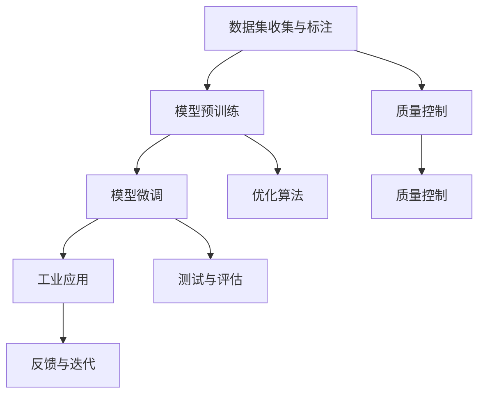

                 

# LLM产业链：AI领域新兴经济体系的形成

> 关键词：语言模型,产业链,人工智能,经济体系,工业应用,科研创新

## 1. 背景介绍

### 1.1 问题由来
人工智能（AI）正处于一个快速发展的时期，其中语言模型（Language Model, LM）是近年来取得重大突破的领域之一。大型语言模型（Large Language Model, LLM），如OpenAI的GPT系列、Google的BERT等，通过在大规模无标签文本数据上进行预训练，学习到丰富的语言知识，并具备强大的语言理解和生成能力。这些模型已经在自然语言处理（Natural Language Processing, NLP）、语音识别、翻译、对话系统等多个领域展现了卓越的表现。

然而，LM的产业链不仅限于模型的研发和训练，还包括数据收集、标注、模型微调、工业应用等多个环节。本文旨在探讨LM产业链的形成及其对AI领域新兴经济体系的影响。

### 1.2 问题核心关键点
LM产业链的形成是一个复杂的过程，涉及多个主体和环节。从数据收集和标注，到模型的预训练和微调，再到在特定工业场景的应用，每个环节都需精细管理和协同运作。这些环节相互依存，共同构成了LM产业链的关键架构。

本论文的核心问题在于：
- LM产业链各个环节如何协同运作？
- 产业链各主体在经济体系中的角色和影响？
- 产业链的形成和演进对AI领域经济体系带来的挑战和机遇？

## 2. 核心概念与联系

### 2.1 核心概念概述

为理解LM产业链的形成，我们需要明确几个关键概念：

- **语言模型（LM）**：通过统计语言数据中单词、短语和句子出现的概率，预测新的输入序列的概率分布。语言模型广泛应用于文本生成、语音识别、机器翻译等领域。
- **大型语言模型（LLM）**：具有超过十亿个参数的深度学习模型，如GPT-3、BERT等。通过在大规模无标签文本数据上进行自监督学习，学习到通用的语言表示。
- **数据集收集与标注**：从互联网、图书馆、社交媒体等渠道获取大量文本数据，并通过人工或半自动方式进行标注，为模型训练提供高质量的数据集。
- **模型预训练与微调**：在大规模无标签数据上进行预训练，以学习到语言表示，并在下游任务数据上进行微调，以适应特定任务需求。
- **工业应用**：将预训练或微调后的模型部署到实际应用场景中，解决具体问题，如智能客服、金融舆情监测、个性化推荐等。

这些概念之间的联系可以通过以下Mermaid流程图来展示：



这个流程图展示了大语言模型从数据收集到工业应用的完整流程，以及每个环节中的关键操作。

## 3. 核心算法原理 & 具体操作步骤

### 3.1 算法原理概述

LM产业链的算法原理主要包括数据收集与标注、模型预训练、微调和工业应用四个环节。

- **数据收集与标注**：基于爬虫技术，从互联网等渠道获取文本数据。使用人工或半自动方式进行标注，如命名实体识别、情感分析等。标注数据用于训练模型的监督信号。

- **模型预训练**：在无标签数据上，使用自监督任务（如语言建模、掩码语言模型）进行预训练，学习通用的语言表示。模型预训练的目的是让模型能够捕捉语言的基本规律，从而更好地适应下游任务。

- **模型微调**：在预训练模型的基础上，使用下游任务的标注数据进行有监督学习。微调的目标是优化模型在下游任务上的性能，使其在特定场景中表现出色。

- **工业应用**：将微调后的模型应用于实际问题，如图像处理、语音识别、自然语言理解等，解决具体的业务需求。

### 3.2 算法步骤详解

#### 数据收集与标注

1. **数据来源**：通过网络爬虫从互联网、社交媒体、新闻网站等渠道获取文本数据。确保数据来源的多样性，覆盖不同的领域和语言。
2. **数据清洗**：去除无用的噪声数据，如重复、低质量的文本，确保数据集的质量。
3. **数据标注**：对数据进行人工标注，如命名实体识别、情感分析等。标注数据应具有代表性，涵盖多种情境。

#### 模型预训练

1. **模型选择**：选择合适的预训练模型架构，如Transformer、BERT等。
2. **自监督学习**：在无标签数据上进行自监督学习，如语言建模、掩码语言模型等。
3. **模型训练**：使用GPU或TPU等高性能设备，在分布式环境中训练模型。调整超参数，如学习率、批大小等。

#### 模型微调

1. **下游任务选择**：根据实际需求选择下游任务，如问答系统、情感分析、机器翻译等。
2. **数据准备**：准备下游任务的标注数据集，确保数据集的规模和质量。
3. **模型微调**：在预训练模型的基础上，使用下游任务的标注数据进行微调。调整模型的参数，使其在特定任务上表现出色。
4. **模型评估**：使用测试集评估微调后的模型性能，调整参数以提高模型效果。

#### 工业应用

1. **模型部署**：将微调后的模型部署到实际应用中，如图像处理、语音识别、自然语言理解等。
2. **应用优化**：根据实际应用场景，优化模型性能。如调整输入格式、优化推理速度等。
3. **反馈与迭代**：收集应用中的反馈，不断优化模型，提升应用效果。

### 3.3 算法优缺点

LM产业链的算法具有以下优点：

1. **高效性**：通过预训练和微调，可以显著提高模型的性能，特别是在小样本条件下。
2. **泛化性强**：预训练和微调后的模型具有较强的泛化能力，可以适应多种下游任务。
3. **可扩展性**：可以通过分布式训练和部署，扩展模型的规模和应用范围。

但同时，也存在一些缺点：

1. **资源消耗大**：大规模的预训练和微调需要大量的计算资源，成本较高。
2. **数据依赖性强**：模型的性能很大程度上依赖于数据集的质量和规模，数据获取和标注成本高。
3. **可解释性差**：预训练和微调后的模型通常难以解释其决策过程，缺乏透明性。

### 3.4 算法应用领域

LM产业链的算法在多个领域都有广泛的应用：

1. **自然语言处理**：如文本分类、情感分析、机器翻译等。
2. **语音识别**：语音转文本、语音指令识别等。
3. **图像处理**：图像分类、物体检测、图像生成等。
4. **智能推荐**：推荐系统、广告投放等。
5. **金融科技**：风险评估、市场预测等。

这些应用场景展示了LM产业链的广泛性和实用性，为各行业提供了高效、智能的解决方案。

## 4. 数学模型和公式 & 详细讲解 & 举例说明

### 4.1 数学模型构建

在LM产业链中，数学模型构建主要用于模型预训练和微调。以下是一个典型的自监督语言模型训练过程：

1. **自监督任务**：如掩码语言模型（Masked Language Model, MLM）。给定一个句子，随机遮盖一些单词，预测被遮盖的单词。目标函数为：
   $$
   \mathcal{L} = -\sum_{i=1}^n \log P(x_i | x_1, x_2, \ldots, x_{i-1})
   $$

2. **优化目标**：最小化损失函数，使用梯度下降等优化算法更新模型参数。目标函数为：
   $$
   \theta = \mathop{\arg\min}_{\theta} \mathcal{L}(\theta)
   $$

### 4.2 公式推导过程

以BERT为例，其训练过程主要分为预训练和微调两个阶段：

1. **预训练阶段**：在无标签数据上进行预训练，学习通用语言表示。预训练目标函数为：
   $$
   \mathcal{L}_{MLM} = -\sum_{i=1}^n \log P(x_i | x_1, x_2, \ldots, x_{i-1})
   $$
   其中 $P(x_i | x_1, x_2, \ldots, x_{i-1})$ 表示在给定上下文的情况下，单词 $x_i$ 出现的概率。

2. **微调阶段**：在标注数据上微调模型，使其适应下游任务。微调目标函数为：
   $$
   \mathcal{L}_{fine} = -\sum_{i=1}^N \log P(y_i | x_i)
   $$
   其中 $y_i$ 表示任务标签，$x_i$ 表示输入数据，$P(y_i | x_i)$ 表示在给定输入数据 $x_i$ 的情况下，任务标签 $y_i$ 的概率。

### 4.3 案例分析与讲解

以情感分析为例，其训练过程可以分为以下几个步骤：

1. **数据准备**：收集带有情感标签的句子作为训练数据，分为训练集、验证集和测试集。
2. **模型微调**：在BERT模型基础上进行微调，调整模型参数以适应情感分析任务。
3. **模型评估**：使用测试集评估模型性能，调整超参数以提升效果。

## 5. 项目实践：代码实例和详细解释说明

### 5.1 开发环境搭建

1. **环境配置**：安装Python、PyTorch、TensorFlow等深度学习框架，以及相关的库和工具。
2. **数据准备**：收集并清洗标注数据集，确保数据集的质量和规模。
3. **模型选择**：选择合适的预训练模型，如BERT、GPT等。
4. **环境部署**：部署模型到服务器或云平台，确保稳定运行。

### 5.2 源代码详细实现

以下是一个简单的BERT情感分析模型微调的代码实现：

```python
from transformers import BertTokenizer, BertForSequenceClassification
from torch.utils.data import DataLoader, Dataset
from sklearn.model_selection import train_test_split
import torch.nn as nn
import torch.optim as optim

# 加载数据集和模型
tokenizer = BertTokenizer.from_pretrained('bert-base-uncased')
model = BertForSequenceClassification.from_pretrained('bert-base-uncased', num_labels=2)

# 准备数据集
texts, labels = read_data('data.csv')
train_texts, test_texts, train_labels, test_labels = train_test_split(texts, labels, test_size=0.2)

# 构建数据集
class TextDataset(Dataset):
    def __init__(self, texts, labels):
        self.texts = texts
        self.labels = labels

    def __len__(self):
        return len(self.texts)

    def __getitem__(self, item):
        text = self.texts[item]
        label = self.labels[item]
        encoding = tokenizer.encode_plus(text, max_length=128, truncation=True, padding='max_length', return_tensors='pt')
        input_ids = encoding['input_ids'][0]
        attention_mask = encoding['attention_mask'][0]
        return {'input_ids': input_ids, 'attention_mask': attention_mask, 'labels': torch.tensor(label)}

# 准备数据加载器
train_dataset = TextDataset(train_texts, train_labels)
test_dataset = TextDataset(test_texts, test_labels)
train_loader = DataLoader(train_dataset, batch_size=16)
test_loader = DataLoader(test_dataset, batch_size=16)

# 设置优化器和超参数
optimizer = AdamW(model.parameters(), lr=2e-5)
device = torch.device('cuda' if torch.cuda.is_available() else 'cpu')
model.to(device)

# 定义损失函数
criterion = nn.CrossEntropyLoss()

# 训练模型
for epoch in range(5):
    model.train()
    for batch in train_loader:
        input_ids = batch['input_ids'].to(device)
        attention_mask = batch['attention_mask'].to(device)
        labels = batch['labels'].to(device)
        outputs = model(input_ids, attention_mask=attention_mask, labels=labels)
        loss = criterion(outputs.logits, labels)
        optimizer.zero_grad()
        loss.backward()
        optimizer.step()

    model.eval()
    with torch.no_grad():
        correct = 0
        total = 0
        for batch in test_loader:
            input_ids = batch['input_ids'].to(device)
            attention_mask = batch['attention_mask'].to(device)
            labels = batch['labels'].to(device)
            outputs = model(input_ids, attention_mask=attention_mask)
            _, predicted = torch.max(outputs.logits, 1)
            total += labels.size(0)
            correct += (predicted == labels).sum().item()

    print(f'Epoch {epoch+1}, accuracy: {100 * correct / total:.2f}%')
```

### 5.3 代码解读与分析

- **数据集构建**：使用 `transformers` 库的 `BertTokenizer` 和 `BertForSequenceClassification` 构建数据集和模型。
- **数据预处理**：使用 `transformers` 库的 `encode_plus` 方法将文本转换为模型接受的格式。
- **训练过程**：定义优化器、损失函数和训练循环，使用 `AdamW` 优化器进行参数更新。
- **评估过程**：在测试集上评估模型性能，使用 `torch.no_grad()` 方法关闭梯度计算，提升评估效率。

## 6. 实际应用场景

### 6.1 智能客服系统

智能客服系统可以处理大量的用户咨询，提高响应速度和服务质量。通过收集历史对话数据，训练微调后的语言模型，智能客服系统能够快速理解用户意图，并提供准确的答案。

### 6.2 金融舆情监测

金融行业需要实时监测市场舆情，避免负面信息影响投资决策。通过微调BERT模型进行情感分析，可以实时监测社交媒体、新闻报道等渠道，预警潜在风险。

### 6.3 个性化推荐系统

推荐系统通过用户行为数据推荐商品、文章等。使用微调后的BERT模型进行文本分类和情感分析，可以更好地理解用户兴趣和需求，提供个性化的推荐结果。

### 6.4 未来应用展望

未来，LM产业链将涵盖更多应用场景，推动AI领域向更深层次发展：

1. **医疗健康**：微调BERT模型进行医学知识图谱构建，辅助诊断和治疗决策。
2. **自动驾驶**：使用BERT模型进行自然语言理解，提高人机交互的准确性。
3. **智慧城市**：微调BERT模型进行城市事件监测和舆情分析，提升城市治理效率。
4. **教育培训**：使用BERT模型进行教学评估和个性化推荐，提高教学质量和学习效果。

## 7. 工具和资源推荐

### 7.1 学习资源推荐

1. **《深度学习入门》**：入门深度学习的基础知识和实践技能。
2. **《Transformer模型与应用》**：介绍Transformer架构和相关应用。
3. **Coursera《深度学习专项课程》**：由斯坦福大学提供，涵盖深度学习的基础理论和实践技能。
4. **HuggingFace官方文档**：提供大量预训练模型和微调范式的详细介绍。
5. **Kaggle数据集**：提供丰富的NLP数据集，支持数据预处理和模型训练。

### 7.2 开发工具推荐

1. **Jupyter Notebook**：交互式编程环境，支持代码执行和结果展示。
2. **TensorBoard**：可视化工具，监控模型训练状态和性能。
3. **PyTorch**：深度学习框架，支持分布式训练和模型部署。
4. **Weights & Biases**：实验跟踪工具，记录和可视化模型训练过程。
5. **AWS SageMaker**：云服务平台，支持大规模模型训练和部署。

### 7.3 相关论文推荐

1. **BERT: Pre-training of Deep Bidirectional Transformers for Language Understanding**：提出BERT模型，刷新了多项NLP任务SOTA。
2. **Towards a General Method for Adaptation in Neural Language Models**：提出通用的微调方法，提高模型的泛化能力。
3. **GPT-3: Language Models are Unsupervised Multitask Learners**：展示GPT-3的强大零样本学习能力，推动通用人工智能的发展。
4. **Parameter-Efficient Transfer Learning for NLP**：提出参数高效微调方法，减少微调过程中不必要的参数更新。
5. **Optimization of Large-Scale Sequence Models with Self-Attention**：提出自注意力机制，提升大规模语言模型的训练效率和性能。

## 8. 总结：未来发展趋势与挑战

### 8.1 研究成果总结

LM产业链的形成推动了AI技术在各行业的广泛应用，提升了生产效率和用户体验。然而，产业链的发展也面临一些挑战：

- **数据获取和标注成本高**：大规模数据集的获取和标注需要耗费大量时间和人力。
- **模型资源消耗大**：大规模模型的训练和推理需要高性能设备和大规模计算资源。
- **模型鲁棒性和可解释性差**：微调后的模型通常难以解释其决策过程，缺乏透明性。
- **隐私和安全问题**：用户数据的隐私保护和模型使用的安全性需要严格监管。

### 8.2 未来发展趋势

未来，LM产业链将继续演进，推动AI技术在各行业的深度应用：

1. **数据获取和标注技术的进步**：通过半监督学习、主动学习等技术，减少对标注数据的依赖。
2. **模型压缩和优化**：通过模型裁剪、量化加速等技术，降低计算资源消耗，提升模型效率。
3. **模型解释性和鲁棒性**：引入因果分析和博弈论工具，提高模型的可解释性和鲁棒性。
4. **跨模态学习**：融合视觉、语音、文本等多种模态信息，提升模型的理解和生成能力。
5. **跨领域迁移学习**：通过迁移学习，提升模型在不同领域之间的适应能力。

### 8.3 面临的挑战

LM产业链的发展仍面临一些挑战：

1. **数据隐私和安全**：大规模数据集的获取和使用，涉及用户隐私和数据安全问题，需要严格监管和保护。
2. **计算资源限制**：大规模模型的训练和推理需要高性能设备和大规模计算资源，对计算资源有较高要求。
3. **模型的公平性和透明性**：微调后的模型可能会引入偏见，需要设计公平透明的目标函数和评估指标。
4. **模型的泛化能力**：现有模型往往在特定领域表现出色，但在其他领域泛化能力不足，需要提升模型的跨领域适应能力。

### 8.4 研究展望

未来的研究需要在以下几个方面进行深入探索：

1. **跨领域迁移学习**：研究跨领域迁移学习方法，提升模型在不同领域之间的适应能力。
2. **模型的公平性和透明性**：设计公平透明的目标函数和评估指标，避免模型的偏见和歧视。
3. **模型的解释性和鲁棒性**：引入因果分析和博弈论工具，提高模型的可解释性和鲁棒性。
4. **多模态学习**：融合视觉、语音、文本等多种模态信息，提升模型的理解和生成能力。
5. **模型的压缩和优化**：通过模型裁剪、量化加速等技术，降低计算资源消耗，提升模型效率。

## 9. 附录：常见问题与解答

### Q1: 大语言模型微调是否适用于所有NLP任务？

A: 大语言模型微调在大多数NLP任务上都能取得不错的效果，特别是对于数据量较小的任务。但对于一些特定领域的任务，如医学、法律等，仅仅依靠通用语料预训练的模型可能难以很好地适应。此时需要在特定领域语料上进一步预训练，再进行微调，才能获得理想效果。

### Q2: 微调过程中如何选择合适的学习率？

A: 微调的学习率一般要比预训练时小1-2个数量级，如果使用过大的学习率，容易破坏预训练权重，导致过拟合。一般建议从1e-5开始调参，逐步减小学习率，直至收敛。也可以使用warmup策略，在开始阶段使用较小的学习率，再逐渐过渡到预设值。需要注意的是，不同的优化器(如AdamW、Adafactor等)以及不同的学习率调度策略，可能需要设置不同的学习率阈值。

### Q3: 采用大模型微调时会面临哪些资源瓶颈？

A: 目前主流的预训练大模型动辄以亿计的参数规模，对算力、内存、存储都提出了很高的要求。GPU/TPU等高性能设备是必不可少的，但即便如此，超大批次的训练和推理也可能遇到显存不足的问题。因此需要采用一些资源优化技术，如梯度积累、混合精度训练、模型并行等，来突破硬件瓶颈。同时，模型的存储和读取也可能占用大量时间和空间，需要采用模型压缩、稀疏化存储等方法进行优化。

### Q4: 如何缓解微调过程中的过拟合问题？

A: 过拟合是微调面临的主要挑战，尤其是在标注数据不足的情况下。常见的缓解策略包括：
1. 数据增强：通过回译、近义替换等方式扩充训练集
2. 正则化：使用L2正则、Dropout、Early Stopping等避免过拟合
3. 对抗训练：引入对抗样本，提高模型鲁棒性
4. 参数高效微调：只调整少量参数(如Adapter、Prefix等)，减小过拟合风险
5. 多模型集成：训练多个微调模型，取平均输出，抑制过拟合

这些策略往往需要根据具体任务和数据特点进行灵活组合。只有在数据、模型、训练、推理等各环节进行全面优化，才能最大限度地发挥大模型微调的威力。

### Q5: 微调模型在落地部署时需要注意哪些问题？

A: 将微调模型转化为实际应用，还需要考虑以下因素：
1. 模型裁剪：去除不必要的层和参数，减小模型尺寸，加快推理速度
2. 量化加速：将浮点模型转为定点模型，压缩存储空间，提高计算效率
3. 服务化封装：将模型封装为标准化服务接口，便于集成调用
4. 弹性伸缩：根据请求流量动态调整资源配置，平衡服务质量和成本
5. 监控告警：实时采集系统指标，设置异常告警阈值，确保服务稳定性
6. 安全防护：采用访问鉴权、数据脱敏等措施，保障数据和模型安全

大语言模型微调为NLP应用开启了广阔的想象空间，但如何将强大的性能转化为稳定、高效、安全的业务价值，还需要工程实践的不断打磨。唯有从数据、算法、工程、业务等多个维度协同发力，才能真正实现人工智能技术在垂直行业的规模化落地。

总之，微调需要开发者根据具体任务，不断迭代和优化模型、数据和算法，方能得到理想的效果。

