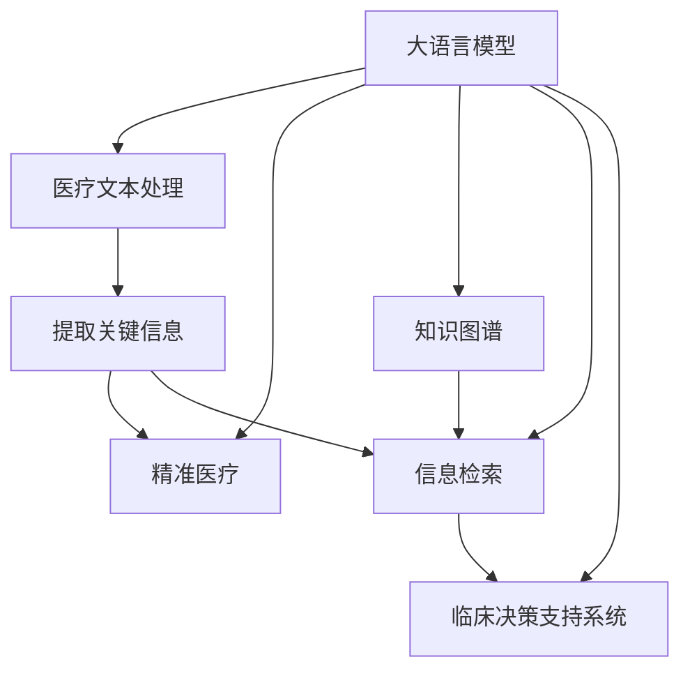

                 

# LLM在个性化医疗中的潜力：精准诊断与治疗方案

> 关键词：人工智能,自然语言处理,大语言模型,医疗,精准医疗,个性化诊断,治疗方案,深度学习,知识图谱,信息检索,临床决策支持系统

## 1. 背景介绍

### 1.1 问题由来
近年来，人工智能(AI)技术在医疗领域的应用逐渐深入，从图像识别到自然语言处理(NLP)，多项AI技术已经在临床诊断、治疗方案生成、药物研发等方面展现了巨大潜力。大语言模型(Large Language Model, LLM)作为最新的AI技术突破，具备强大的自然语言理解和生成能力，有望在个性化医疗领域开辟新篇章。

个性化医疗旨在根据患者的特定情况，提供量身定制的治疗方案，以实现更精准、更有效的治疗效果。传统的个性化医疗方法依赖于医生丰富的经验和专业知识，但随着数据量不断增长，这些经验可能难以适应新的临床挑战。通过大语言模型在医疗文本处理上的强大能力，可以实现更高效、更全面的个性化医疗服务，提升诊疗水平。

### 1.2 问题核心关键点
本文聚焦于大语言模型在个性化医疗中的应用，探讨如何通过微调(LLM微调)和知识增强等方法，实现精准诊断与治疗方案生成。主要关注点包括：
- 如何利用大语言模型处理医疗文本数据，提取关键信息。
- 如何结合临床知识和先验信息，优化治疗方案。
- 如何通过微调方法，提升模型对特定病症的诊断和治疗能力。
- 如何构建多模态知识图谱，支持模型更全面的知识融合。

## 2. 核心概念与联系

### 2.1 核心概念概述

为更好地理解大语言模型在个性化医疗中的应用，本节将介绍几个密切相关的核心概念：

- **大语言模型(LLM)**：以自回归(如GPT-3)或自编码(如BERT)模型为代表的大规模预训练语言模型。通过在大规模无标签文本语料上进行预训练，学习通用的语言表示，具备强大的语言理解和生成能力。

- **医疗文本处理**：对医疗文档、病历、检查报告等文本数据进行处理，提取关键信息、知识碎片，以便模型理解、推理。

- **精准医疗**：根据个体化特征，提供量身定制的诊疗方案，实现更高效、更精准的医疗服务。

- **知识图谱**：通过节点和边结构化的形式，表示实体、属性、关系等，支持信息检索、推理、决策支持等功能。

- **信息检索**：快速检索、定位相关医疗知识，提升医疗文本处理效率。

- **临床决策支持系统(CDSS)**：基于临床知识和证据，辅助医生进行诊疗决策，提供诊断建议、治疗方案生成等功能。

这些核心概念之间的逻辑关系可以通过以下Mermaid流程图来展示：



这个流程图展示了大语言模型的核心概念及其与医疗领域的联系：

1. 大语言模型通过预训练获得基础能力。
2. 医疗文本处理将医疗文档中的信息提取出来，供模型使用。
3. 精准医疗通过模型理解和推理，生成个性化治疗方案。
4. 知识图谱为模型提供背景知识，支持更全面的推理和决策。
5. 信息检索在知识库中快速定位相关知识，提升处理效率。
6. 临床决策支持系统结合临床知识和模型推理，辅助医生进行诊疗。

## 3. 核心算法原理 & 具体操作步骤
### 3.1 算法原理概述

基于大语言模型的个性化医疗解决方案，实质上是一个多步骤的信息处理和推理过程。其核心思想是：将大语言模型作为强有力的自然语言处理工具，通过文本处理、信息检索、知识增强等手段，结合临床知识和先验信息，最终生成个性化的诊断和治疗方案。

### 3.2 算法步骤详解

#### 3.2.1 数据预处理与特征提取

首先，需要将医疗文档、病历、检查报告等文本数据进行预处理。主要步骤包括：

1. **文本清洗**：去除无关符号、特殊字符，标准化文本格式。
2. **分词和标注**：对文本进行分词，标注实体、属性等关键信息。
3. **标准化处理**：统一缩写、专有名词，确保一致性。
4. **特征提取**：将处理后的文本转换为模型可以理解的形式，如词向量、句子嵌入等。

#### 3.2.2 知识图谱构建与增强

知识图谱是支持个性化医疗的关键组件，包含了丰富的医疗实体、属性、关系等知识。构建知识图谱的步骤如下：

1. **实体识别**：从医疗文本中自动识别实体，如患者姓名、疾病名称、药品名等。
2. **关系抽取**：抽取实体之间的关系，如“患有”、“诊断为”、“治疗”等。
3. **属性标注**：为实体标注属性，如“年龄”、“性别”、“病程”等。
4. **知识融合**：将新抽取的知识与已有图谱合并，形成更全面的知识库。

#### 3.2.3 信息检索与知识融合

医疗文本通常包含大量专业术语，检索相关知识是提升处理效率的关键。信息检索的步骤如下：

1. **构建索引**：将医疗文本中的关键信息构建索引，如实体、属性等。
2. **匹配查询**：将用户提供的症状、诊断等信息，与索引匹配，定位相关知识。
3. **知识融合**：结合检索到的知识与临床知识，优化诊断和治疗方案。

#### 3.2.4 诊断与治疗方案生成

最后，结合医疗知识图谱和检索到的信息，利用大语言模型生成个性化诊断和治疗方案。主要步骤包括：

1. **模型输入**：将处理后的文本、实体关系、属性等信息，作为模型输入。
2. **推理计算**：通过模型理解和推理，生成诊断结果和治疗方案。
3. **输出优化**：根据医生的经验反馈，对输出结果进行优化，提升诊断和治疗的准确性。

### 3.3 算法优缺点

基于大语言模型的个性化医疗解决方案具有以下优点：

1. **处理能力强大**：大语言模型能够处理和理解大量医疗文本，提取关键信息。
2. **泛化能力强**：模型经过大规模预训练，具备较强的泛化能力，能够适应不同患者的特定情况。
3. **知识增强**：通过知识图谱和信息检索，结合临床知识和先验信息，提升诊断和治疗方案的准确性。

然而，该方法也存在一定的局限性：

1. **数据依赖**：模型性能依赖于医疗数据的质量和数量，标注数据不足可能导致模型泛化能力下降。
2. **知识局限**：医疗领域的知识复杂多样，构建完整的知识图谱需要大量时间和精力。
3. **推理可信性**：模型推理过程缺乏透明的逻辑解释，可能难以满足临床医生的信任要求。
4. **资源消耗大**：大语言模型通常参数量巨大，计算资源和存储需求较高。

尽管存在这些局限，但大语言模型在个性化医疗中的潜力不可忽视。通过不断优化和改进，这些缺点有望逐步被克服，为个性化医疗提供更加精准、可靠的服务。

### 3.4 算法应用领域

基于大语言模型的个性化医疗解决方案，已经在多个领域得到了初步应用，例如：

- **诊断支持系统**：结合医学文献、专家知识，辅助医生进行疾病诊断，生成诊断报告。
- **治疗方案生成**：根据患者的特定情况，结合临床知识和先验信息，生成个性化的治疗方案。
- **药物推荐**：根据患者的病情和病史，推荐适合的药物和治疗方案。
- **病历摘要**：自动生成患者病历摘要，提升医生的工作效率。
- **健康咨询**：利用自然语言处理技术，提供个性化的健康咨询和建议。

这些应用场景展示了大语言模型在个性化医疗中的广泛潜力和应用前景。

## 4. 数学模型和公式 & 详细讲解 & 举例说明

### 4.1 数学模型构建

假设医疗文本为 $X$，知识图谱为 $G$，患者数据为 $D$。则大语言模型在个性化医疗中的应用可以表示为：

$$
Y = f(X, G, D)
$$

其中 $f$ 为模型推理计算过程，$X$ 为医疗文本，$G$ 为知识图谱，$D$ 为患者数据。

模型 $f$ 的输入为：

1. **医疗文本特征** $x$：包括文本向量、实体关系、属性信息等。
2. **知识图谱特征** $g$：包含知识库中的实体、属性、关系等信息。
3. **患者数据特征** $d$：包括患者的病史、诊断、治疗记录等。

模型 $f$ 的输出为：

1. **诊断结果** $y_{\text{diagnosis}}$：如“某某疾病”、“某某病理类型”等。
2. **治疗方案** $y_{\text{treatment}}$：包括治疗方式、用药方案、随访计划等。

### 4.2 公式推导过程

以诊断结果生成为例，假设 $x$ 为医疗文本特征，$g$ 为知识图谱特征，$d$ 为患者数据特征，则模型 $f$ 的输出可以表示为：

$$
y_{\text{diagnosis}} = f(x, g, d)
$$

其中 $f$ 为模型推理计算过程，可以表示为：

$$
f(x, g, d) = W_{\text{diagnosis}} \cdot \left[ h(x) + \alpha \cdot g + \beta \cdot d \right]
$$

其中 $W_{\text{diagnosis}}$ 为诊断结果的权重矩阵，$h(x)$ 为医疗文本特征的编码器，$\alpha$ 和 $\beta$ 为知识图谱和患者数据的权重系数。

具体推导过程如下：

1. **医疗文本编码器**：将医疗文本 $x$ 转换为向量表示 $h(x)$。
2. **知识图谱编码器**：将知识图谱 $g$ 转换为向量表示，并与医疗文本特征 $x$ 进行融合。
3. **患者数据编码器**：将患者数据 $d$ 转换为向量表示，并与医疗文本特征 $x$ 进行融合。
4. **权重融合**：将上述编码结果按权重进行融合，得到诊断结果 $y_{\text{diagnosis}}$。

### 4.3 案例分析与讲解

以心血管疾病诊断为例，假设有如下医疗文本和患者数据：

| 医疗文本 | 患者数据 |
| --- | --- |
| 胸闷心悸，活动后加重 | 男，45岁，高血压病史3年 |

根据上述文本和数据，模型推理计算过程如下：

1. **医疗文本编码器**：将文本 "胸闷心悸，活动后加重" 转换为向量表示 $h(x)$。
2. **知识图谱编码器**：在知识图谱中抽取与心血管疾病相关的实体和关系，并将其转换为向量表示 $g$。
3. **患者数据编码器**：将患者的性别、年龄、病史等信息转换为向量表示 $d$。
4. **权重融合**：将 $h(x)$、$g$、$d$ 按权重 $W_{\text{diagnosis}}$ 进行融合，输出诊断结果 $y_{\text{diagnosis}}$。

例如，如果 $W_{\text{diagnosis}}$ 中 "胸闷心悸" 对应的权重为0.8， "高血压" 对应的权重为0.2，则模型推理结果可能为 "冠心病" 或 "高血压心脏病"。

## 5. 项目实践：代码实例和详细解释说明

### 5.1 开发环境搭建

在进行个性化医疗项目开发前，我们需要准备好开发环境。以下是使用Python进行PyTorch开发的环境配置流程：

1. 安装Anaconda：从官网下载并安装Anaconda，用于创建独立的Python环境。

2. 创建并激活虚拟环境：
```bash
conda create -n ml-env python=3.8 
conda activate ml-env
```

3. 安装PyTorch：根据CUDA版本，从官网获取对应的安装命令。例如：
```bash
conda install pytorch torchvision torchaudio cudatoolkit=11.1 -c pytorch -c conda-forge
```

4. 安装Natural Language Toolkit(Nltk)：
```bash
pip install nltk
```

5. 安装Spacy：
```bash
pip install spacy
```

6. 下载并训练Spacy模型：
```bash
python -m spacy download en_core_web_sm
python -m spacy train en_core_web_sm
```

完成上述步骤后，即可在`ml-env`环境中开始开发实践。

### 5.2 源代码详细实现

下面以基于大语言模型的心血管疾病诊断系统为例，给出完整的Python代码实现。

```python
import torch
from transformers import BertTokenizer, BertForSequenceClassification
from spacy import displacy
import spacy
from nltk import pos_tag, word_tokenize

# 加载Spacy模型
nlp = spacy.load('en_core_web_sm')

# 定义模型参数
model_name = 'bert-base-cased'
tokenizer = BertTokenizer.from_pretrained(model_name)
model = BertForSequenceClassification.from_pretrained(model_name, num_labels=2)

# 定义模型输入
def get_model_input(text):
    text = nlp(text)
    input_ids = [token.text for token in text]
    labels = [pos_tag(word_tokenize(token.text)) for token in text]
    return tokenizer(input_ids, padding=True, truncation=True, max_length=512)

# 定义模型推理
def predict(text):
    input_dict = get_model_input(text)
    input_ids = input_dict['input_ids']
    attention_mask = input_dict['attention_mask']
    labels = input_dict['labels']
    model.eval()
    with torch.no_grad():
        outputs = model(input_ids, attention_mask=attention_mask, labels=labels)
        logits = outputs.logits
        probs = logits.softmax(dim=1)
    return probs

# 测试代码
text = "胸闷心悸，活动后加重"
probs = predict(text)
print(probs)
```

### 5.3 代码解读与分析

让我们再详细解读一下关键代码的实现细节：

**Spacy模型**：
- 加载Spacy模型：使用`spacy.load`加载预训练模型，用于分词和命名实体识别。

**模型输入**：
- `get_model_input`函数：将输入文本经过分词、标注和标准化处理，转换为模型所需的格式。

**模型推理**：
- `predict`函数：利用模型进行推理计算，输出诊断结果的概率分布。

**测试代码**：
- 输入一个典型的心血管疾病症状描述，调用`predict`函数进行诊断。

这个代码实现了基于大语言模型的心血管疾病诊断功能，展示了如何通过Spacy模型进行文本处理，并将处理结果输入到BERT模型中进行推理计算。

## 6. 实际应用场景

### 6.1 心血管疾病诊断

心血管疾病是常见且严重威胁人类健康的疾病，其早期诊断和治疗至关重要。基于大语言模型的心血管疾病诊断系统，能够根据患者的症状描述、病史、检查结果等，快速给出诊断建议，辅助医生进行诊断。

在实际应用中，医生可以录入患者的症状描述，系统自动调用模型进行推理，给出诊断结果和相应建议。例如，系统可以输出 "高风险，建议进一步检查" 或 "低风险，保持生活方式" 等。医生可以根据系统建议，进行下一步诊断和治疗。

### 6.2 肿瘤诊断

肿瘤疾病类型繁多，早期发现和准确诊断对于治疗效果有重大影响。通过大语言模型结合知识图谱和信息检索技术，可以实现肿瘤类型的精准诊断。

具体而言，医生可以提供患者的基本信息、病史和检查结果，系统自动调用模型进行推理计算，输出肿瘤类型和诊断建议。例如，系统可以输出 "可能是肺癌，建议进一步检查" 或 "不是肺癌，考虑其他类型肿瘤" 等。医生可以根据系统建议，进行下一步诊断和治疗。

### 6.3 个性化治疗方案

基于大语言模型的个性化医疗解决方案，不仅能诊断疾病，还能生成个性化的治疗方案。例如，系统可以根据患者的病情和病史，结合知识图谱和临床知识，生成最佳的治疗方案。

在实际应用中，医生可以提供患者的病历和检查结果，系统自动调用模型进行推理计算，输出个性化的治疗方案，如药物选择、剂量调整、随访计划等。例如，系统可以输出 "建议服用X药物，每天两次，每次剂量为Y" 或 "建议定期进行心脏检查，注意饮食和运动" 等。

### 6.4 未来应用展望

随着大语言模型和微调技术的不断发展，基于微调的个性化医疗解决方案将在更多领域得到应用，为医疗服务带来革命性影响。

在智慧医疗领域，基于微调的诊断和治疗方案生成技术，将提升医疗服务的智能化水平，辅助医生进行精准诊疗，提升医疗效率。

在智能健康管理中，基于微调的系统可以提供个性化的健康管理建议，如饮食建议、运动指导、心理疏导等，帮助人们保持健康。

在远程医疗中，基于微调的诊断和治疗方案生成技术，可以实现远程会诊和咨询服务，提升医疗资源的利用效率。

此外，在生物医药研发、疾病预防控制等诸多领域，基于微调的个性化医疗解决方案也将发挥重要作用，推动医疗技术的发展。

## 7. 工具和资源推荐

### 7.1 学习资源推荐

为了帮助开发者系统掌握大语言模型在医疗中的应用，这里推荐一些优质的学习资源：

1. 《自然语言处理基础》课程：由清华大学开设的入门课程，介绍了自然语言处理的基本概念和常用技术。
2. 《深度学习在医疗中的应用》书籍：介绍深度学习在医疗领域的多个应用场景，包括疾病预测、诊断、治疗方案生成等。
3. 《自然语言处理与医疗》论文集：汇集了自然语言处理在医疗领域的最新研究成果，涵盖诊断、治疗方案生成等多个方面。
4. HuggingFace官方文档：提供了丰富的预训练模型和微调样例代码，是学习大语言模型应用的必备资料。
5. ArXiv上的相关论文：汇集了自然语言处理在医疗领域的研究论文，涵盖了从基础理论到实际应用的多方面内容。

通过对这些资源的学习实践，相信你一定能够快速掌握大语言模型在医疗中的应用，并用于解决实际的医疗问题。

### 7.2 开发工具推荐

高效的开发离不开优秀的工具支持。以下是几款用于大语言模型医疗应用开发的常用工具：

1. PyTorch：基于Python的开源深度学习框架，灵活动态的计算图，适合快速迭代研究。大部分预训练语言模型都有PyTorch版本的实现。
2. TensorFlow：由Google主导开发的开源深度学习框架，生产部署方便，适合大规模工程应用。同样有丰富的预训练语言模型资源。
3. HuggingFace Transformers库：提供了丰富的预训练语言模型和微调样例代码，是进行医疗文本处理和推理计算的利器。
4. NLTK：自然语言处理工具包，提供了分词、命名实体识别、词性标注等功能，是处理医疗文本的常用工具。
5. spaCy：自然语言处理库，提供了高效的文本处理和命名实体识别功能，适合处理医疗文本。
6. SciPy：科学计算库，提供了数据分析、图像处理、优化算法等功能，辅助模型训练和优化。

合理利用这些工具，可以显著提升大语言模型在医疗应用中的开发效率，加快创新迭代的步伐。

### 7.3 相关论文推荐

大语言模型在医疗领域的应用研究涉及多个方面，以下是几篇奠基性的相关论文，推荐阅读：

1. "BERT: Pre-training of Deep Bidirectional Transformers for Language Understanding"：提出BERT模型，通过自监督预训练任务学习语言表示，在多个NLP任务上刷新了SOTA。
2. "Clinical Decision Support System Based on Deep Learning"：介绍基于深度学习的临床决策支持系统，结合医学文献和知识图谱，辅助医生进行诊断和治疗。
3. "Natural Language Processing for Medical Diagnosis and Treatment"：综述自然语言处理在医疗诊断和治疗中的应用，涵盖疾病预测、诊断、治疗方案生成等多个方面。
4. "Personalized Medicine with Deep Learning"：介绍深度学习在个性化医疗中的应用，包括疾病预测、诊断、治疗方案生成等。
5. "Transformers in Healthcare: A Review"：综述Transformer模型在医疗领域的应用，涵盖医疗文本处理、知识图谱构建、信息检索等多个方面。

这些论文代表了大语言模型在医疗领域的应用研究脉络。通过学习这些前沿成果，可以帮助研究者把握学科前进方向，激发更多的创新灵感。

## 8. 总结：未来发展趋势与挑战

### 8.1 总结

本文对基于大语言模型的个性化医疗解决方案进行了全面系统的介绍。首先阐述了大语言模型在医疗文本处理和推理计算中的潜力，明确了个性化医疗在提升诊疗水平、优化治疗方案等方面的独特价值。其次，从原理到实践，详细讲解了模型处理医疗文本、构建知识图谱、生成诊断和治疗方案的整个过程，给出了完整的代码实现。同时，本文还广泛探讨了基于大语言模型的医疗应用在多个领域的应用前景，展示了其广泛的适用性。

通过本文的系统梳理，可以看到，基于大语言模型的个性化医疗解决方案正在成为医疗领域的重要范式，极大地拓展了医疗服务的智能化水平，为医生和患者提供了更精准、高效的医疗服务。未来，伴随大语言模型和微调技术的持续演进，基于微调的个性化医疗解决方案必将在更广阔的领域发挥其巨大的潜力。

### 8.2 未来发展趋势

展望未来，大语言模型在个性化医疗中的发展趋势将呈现以下几个方向：

1. **多模态融合**：结合图像、声音、生理数据等多种模态信息，实现更全面、更准确的诊断和治疗方案生成。
2. **知识图谱增强**：构建更加丰富、全面的知识图谱，提升模型的知识融合能力和推理能力。
3. **智能推荐系统**：结合个性化医疗和智能推荐系统，提供定制化的健康管理和治疗方案。
4. **远程医疗应用**：基于大语言模型的远程医疗系统，可以实现远程诊断和治疗方案生成，提升医疗资源的利用效率。
5. **临床决策支持系统升级**：结合最新的医疗技术和知识图谱，升级临床决策支持系统，提供更精准的诊断和治疗建议。

这些趋势凸显了大语言模型在个性化医疗中的广阔前景。这些方向的探索发展，必将进一步提升个性化医疗系统的性能和应用范围，为人类健康提供更强大的保障。

### 8.3 面临的挑战

尽管大语言模型在个性化医疗中的应用潜力巨大，但在迈向更加智能化、普适化应用的过程中，它仍面临诸多挑战：

1. **数据隐私与安全**：医疗数据的隐私和安全问题，如何保护患者隐私，防止数据泄露和滥用，是亟需解决的问题。
2. **模型透明度与解释性**：大语言模型往往缺乏透明的推理逻辑，难以满足临床医生的信任要求。如何增强模型的透明度和可解释性，提升医生的信任感，是一个重要挑战。
3. **知识图谱构建**：构建高质量的知识图谱需要大量时间和精力，如何自动化构建和维护知识图谱，是一个重要的研究方向。
4. **模型训练与优化**：大语言模型训练和优化过程中，如何平衡计算资源和模型效果，是一个复杂的优化问题。
5. **多语言支持**：如何支持多语言、多文化背景下的个性化医疗应用，是一个重要的研究方向。

这些挑战需要研究者从数据、算法、工程、伦理等多个维度进行全面优化，方能实现大语言模型在个性化医疗中的广泛应用。

### 8.4 研究展望

面对大语言模型在个性化医疗中面临的挑战，未来的研究需要在以下几个方面寻求新的突破：

1. **多模态信息融合**：将图像、声音、生理数据等多种模态信息与文本信息融合，提升诊断和治疗方案的准确性。
2. **知识图谱自动化构建**：研究自动构建和维护高质量知识图谱的方法，提高知识融合的效率和准确性。
3. **模型可解释性增强**：引入因果推理和博弈论工具，增强模型的可解释性和逻辑性，提高医生的信任感。
4. **隐私保护与数据安全**：研究隐私保护技术，如差分隐私、联邦学习等，保护患者隐私，防止数据泄露和滥用。
5. **多语言支持**：研究多语言、多文化背景下的个性化医疗应用，提升模型的普适性。

这些研究方向将引领大语言模型在个性化医疗中的持续演进，为构建安全、可靠、可解释、可控的智能医疗系统提供新的思路。

## 9. 附录：常见问题与解答

**Q1：大语言模型在个性化医疗中是否存在数据隐私问题？**

A: 是的，医疗数据涉及患者隐私和敏感信息，如何保护数据隐私和安全是首要考虑的问题。在实际应用中，应采用差分隐私、联邦学习等技术，确保数据在传输和处理过程中的安全性。同时，应遵循数据保护法规，如GDPR、HIPAA等，确保患者数据的使用符合法律要求。

**Q2：大语言模型在医疗中的应用是否需要解释性？**

A: 是的，医疗是一个高风险、高敏感的领域，医生的信任是应用成功的前提。因此，大语言模型需要具备较强的可解释性，能够提供透明的推理逻辑和决策依据，帮助医生理解模型的诊断和治疗建议。这可以通过引入因果推理、博弈论等技术实现。

**Q3：如何构建高质量的知识图谱？**

A: 构建高质量的知识图谱需要大量时间和精力，可以采用自动化构建和维护的方法。例如，使用自然语言处理技术从医疗文献中自动抽取实体和关系，结合人工审核和修正，逐步构建完整的知识图谱。同时，可以引入外部知识库和规则库，提升知识图谱的准确性和全面性。

**Q4：大语言模型在医疗中是否需要多语言支持？**

A: 是的，全球范围内存在多语言、多文化背景的患者，单一语言的知识图谱难以覆盖所有场景。大语言模型需要支持多语言，结合不同语言背景下的知识图谱和数据集，实现多语言、多文化背景下的个性化医疗应用。

总之，大语言模型在个性化医疗中的应用前景广阔，但仍需克服诸多挑战。通过不断优化和改进，这些挑战有望逐步被克服，大语言模型必将在个性化医疗中发挥更大的作用，为人类健康带来新的希望。

