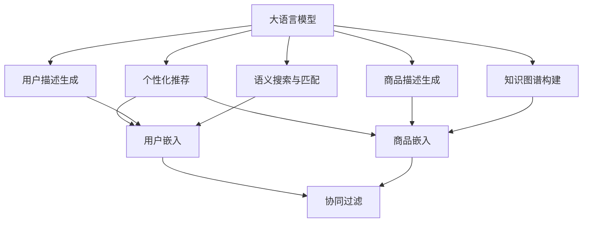

                 

# LLM在推荐系统中的图表示学习应用

> 关键词：大语言模型,推荐系统,图表示学习,Graph Neural Network,注意力机制,Graph Convolutional Network,用户嵌入,商品嵌入

## 1. 背景介绍

### 1.1 问题由来
随着互联网数据的爆炸性增长，推荐系统在电商、内容平台、社交媒体等多个领域得到了广泛的应用。传统的推荐系统多采用协同过滤、内容推荐、标签推荐等方法，但这些方法往往存在一定的局限性。协同过滤方法对新用户和新物品的推荐效果不佳，内容推荐忽略了用户隐式反馈和动态反馈，标签推荐无法充分利用文本数据的多样性和语义信息。

近年来，大语言模型在自然语言处理(NLP)领域取得了突破性进展。通过大规模无监督预训练，大语言模型学习到了丰富的语言知识和常识，能够进行高精度的文本生成、文本理解、问答等任务。大语言模型因其强大的语言处理能力，逐渐被引入到推荐系统中，带来新的创新和突破。

### 1.2 问题核心关键点
大语言模型在推荐系统中的应用，主要集中在以下几个方面：

1. **用户描述生成**：大语言模型能够生成详细的用户描述，帮助推荐系统更好地理解用户需求。
2. **商品描述生成**：大语言模型可以生成精确的商品描述，提升推荐系统的匹配精度。
3. **语义搜索与匹配**：大语言模型可以用于构建更复杂的搜索模型，对用户查询进行语义理解，提升搜索和匹配效果。
4. **知识图谱构建与嵌入**：大语言模型可以与知识图谱相结合，对用户行为和商品信息进行多维度融合。
5. **个性化推荐**：大语言模型能够生成高度个性化的推荐内容，增强用户体验。

本文聚焦于大语言模型在推荐系统中的应用，特别是图表示学习(Graph Representational Learning)范式下的大模型应用。我们将介绍基于大语言模型的推荐系统架构，重点探讨图神经网络(Graph Neural Network, GNN)在推荐系统中的应用，并对比传统的深度学习模型与大语言模型的优势与不足。

## 2. 核心概念与联系

### 2.1 核心概念概述

为了更好地理解大语言模型在推荐系统中的应用，本节将介绍几个关键概念：

- **大语言模型(Large Language Model, LLM)**：通过大规模无监督预训练获得丰富语言知识的语言模型，如GPT、BERT等。
- **图表示学习(Graph Representational Learning)**：通过构建图结构，学习图节点和边的表示，并进行信息传递和融合，从而提升模型性能。
- **图神经网络(Graph Neural Network, GNN)**：一类特殊的神经网络，能够处理图结构数据，如Graph Convolutional Network (GCN)、Graph Attention Network (GAT)等。
- **注意力机制(Attention Mechanism)**：在神经网络中，用于衡量输入特征的相关性，并动态计算权重，从而进行信息加权处理。
- **用户嵌入(User Embedding)**：用户行为和特征的向量表示，用于刻画用户兴趣和行为偏好。
- **商品嵌入(Product Embedding)**：商品属性和特征的向量表示，用于刻画商品属性和推荐候选集。

这些核心概念之间的逻辑关系可以通过以下Mermaid流程图来展示：



这个流程图展示了基于大语言模型的推荐系统架构：

1. 大语言模型通过预训练学习到语言知识，用于生成用户描述、商品描述、语义搜索与匹配、知识图谱构建和个性化推荐。
2. 用户嵌入和商品嵌入通过嵌入层生成，用于协同过滤等传统推荐方法。
3. 通过图表示学习范式，用户和商品嵌入被嵌入到图中的节点上，进行图神经网络的建模。

## 3. 核心算法原理 & 具体操作步骤
### 3.1 算法原理概述

基于大语言模型的推荐系统主要利用了图表示学习范式，通过构建图结构，学习用户和商品的表示，并对其进行融合。图表示学习的核心思想是：通过图结构对节点和边的表示进行编码，并通过信息传递、融合等操作，提升节点的表示能力。

在推荐系统中，用户和商品可以看作图的两个节点，用户的历史行为和商品的属性可以看作边的属性。大语言模型通过构建用户和商品之间的图结构，对其进行图表示学习，得到用户和商品的表示。具体来说，可以分为以下几个步骤：

1. 构建用户-商品关系图。
2. 对用户和商品节点进行嵌入，得到用户嵌入和商品嵌入。
3. 使用图神经网络对用户和商品嵌入进行信息传递和融合。
4. 进行节点表示的聚合和更新，得到最终的节点表示。
5. 利用节点表示进行推荐。

### 3.2 算法步骤详解

以下我们将详细介绍基于大语言模型的推荐系统的主要算法步骤：

**Step 1: 构建用户-商品关系图**
- 收集用户的历史行为数据，如浏览、点击、购买等。
- 将用户和商品看作图中的两个节点，行为数据看作边。
- 对行为数据进行筛选和清洗，去除异常数据和噪声。
- 构建邻接矩阵 $A$ 和特征矩阵 $H$，分别表示节点间的关系和节点特征。

**Step 2: 对用户和商品进行嵌入**
- 使用预训练的大语言模型，如BERT、GPT等，对用户和商品的特征进行编码，得到用户嵌入 $U$ 和商品嵌入 $P$。
- 用户嵌入和商品嵌入可以看作图中的节点表示，通常采用稠密向量表示。

**Step 3: 使用图神经网络进行信息传递**
- 使用图神经网络对用户和商品嵌入进行信息传递，提升节点表示的复杂性和多维度信息融合。
- 常见的图神经网络包括图卷积网络(Graph Convolutional Network, GCN)、图注意力网络(Graph Attention Network, GAT)等。
- 以GCN为例，信息传递公式如下：

$$
H^{(l+1)} = \tilde{D}^{-1/2} \tilde{A} \tilde{D}^{-1/2} H^{(l)} W^{(l)}
$$

其中 $H^{(l)}$ 为节点在 $l$ 层的表示，$W^{(l)}$ 为节点表示的权重矩阵，$\tilde{A}$ 和 $\tilde{D}$ 为邻接矩阵和度数矩阵的归一化形式。

**Step 4: 聚合与更新节点表示**
- 对图神经网络的输出进行聚合操作，得到节点表示。常见的聚合方法包括最大值、平均值、加权平均等。
- 对节点表示进行更新，得到最终的用户和商品嵌入。

**Step 5: 进行推荐**
- 根据用户嵌入和商品嵌入，计算用户对商品的相关度评分。
- 对评分进行归一化，得到推荐候选集的排名。
- 根据排名返回推荐结果，推荐给用户。

### 3.3 算法优缺点

基于大语言模型的推荐系统具有以下优点：

1. 强大的语义理解能力：大语言模型能够生成高质量的用户描述和商品描述，提升推荐的语义准确性。
2. 多维度信息融合：通过图表示学习，能够融合用户历史行为、商品属性、用户行为等多维度信息，提升推荐的全面性。
3. 模型可解释性：大语言模型的决策过程可以部分解释，便于调试和优化。
4. 易于扩展：大语言模型可以在现有的推荐系统架构中引入，无需大规模重构。

同时，该方法也存在以下局限性：

1. 计算资源需求高：大语言模型通常参数量较大，需要较大的计算资源。
2. 模型复杂度高：图表示学习模型通常较复杂，训练和推理时间较长。
3. 数据需求量大：需要大量高质量的用户和商品数据，构建高质量的图结构。
4. 模型泛化能力有待提高：大语言模型在特定领域的泛化能力仍需进一步提升。
5. 系统稳定性要求高：大语言模型在极端数据分布下的鲁棒性需进一步提高。

尽管存在这些局限性，但就目前而言，基于大语言模型的推荐系统仍具有很大的潜力和应用前景。

### 3.4 算法应用领域

基于大语言模型的推荐系统已经被广泛应用于多个领域，例如：

1. **电商推荐**：利用大语言模型生成用户描述和商品描述，提升推荐系统的个性化程度。
2. **内容推荐**：通过语义搜索与匹配，提升视频、音乐、文章等内容的推荐效果。
3. **社交推荐**：利用用户描述生成，提升好友推荐、兴趣小组推荐等效果。
4. **旅游推荐**：通过知识图谱构建与嵌入，提升旅游目的地推荐效果。
5. **金融推荐**：利用语义搜索与匹配，提升金融产品的推荐效果。

除了这些经典应用场景，大语言模型在推荐系统中的应用还在不断扩展，为电商、内容、社交、金融等垂直行业带来了新的突破。

## 4. 数学模型和公式 & 详细讲解 & 举例说明

### 4.1 数学模型构建

为了更严谨地描述基于大语言模型的推荐系统，本节将使用数学语言对推荐系统的主要步骤进行详细刻画。

记用户为 $u$，商品为 $p$，用户和商品之间的关系为 $r_{u,p}$，其中 $r_{u,p}$ 为行为数据的类型，如浏览、点击、购买等。用户和商品可以看作图中的节点，关系 $r_{u,p}$ 可以看作边。

定义用户嵌入为 $U \in \mathbb{R}^{N_u \times d}$，商品嵌入为 $P \in \mathbb{R}^{N_p \times d}$，其中 $N_u$ 和 $N_p$ 分别为用户和商品的数量，$d$ 为嵌入维度。

用户和商品之间的关系矩阵 $A \in \mathbb{R}^{N_u \times N_p}$，关系特征矩阵 $H \in \mathbb{R}^{N_u \times N_p \times D}$，其中 $D$ 为关系类型的数量。

假设使用 $L$ 层图神经网络对用户和商品嵌入进行信息传递，输出用户嵌入和商品嵌入分别为 $U^{(L)}$ 和 $P^{(L)}$。

### 4.2 公式推导过程

以下我们将推导基于大语言模型的推荐系统的主要公式，以图卷积网络(GCN)为例：

**信息传递公式**：

$$
H^{(l+1)} = \tilde{D}^{-1/2} \tilde{A} \tilde{D}^{-1/2} H^{(l)} W^{(l)}
$$

其中 $H^{(l)}$ 为节点在 $l$ 层的表示，$W^{(l)}$ 为节点表示的权重矩阵，$\tilde{A}$ 和 $\tilde{D}$ 为邻接矩阵和度数矩阵的归一化形式。

**节点聚合公式**：

$$
\text{Agg}(H^{(l+1)}) = \text{Agg}_{\text{avg}}(H^{(l+1)}) + \text{Agg}_{\text{max}}(H^{(l+1)})
$$

其中 $\text{Agg}_{\text{avg}}$ 和 $\text{Agg}_{\text{max}}$ 分别为平均聚合和最大聚合函数。

**用户嵌入更新公式**：

$$
U^{(l+1)} = \text{Agg}(H^{(l+1)}) W^{(l+1)}
$$

**推荐评分公式**：

$$
\text{Score}(u,p) = U^{(L)} u^\top P^{(L)} p
$$

其中 $u$ 和 $p$ 分别为用户和商品的嵌入向量。

### 4.3 案例分析与讲解

以下我们将通过一个具体的案例，对基于大语言模型的推荐系统进行详细的讲解。

**案例：电商推荐系统**

假设有一家电商平台，收集了用户的历史浏览、点击、购买等行为数据，以及商品的描述、属性等数据。为了提升推荐效果，平台决定引入大语言模型进行推荐系统优化。

**Step 1: 构建用户-商品关系图**

首先，平台收集用户的历史行为数据，构建用户-商品关系图。假设关系类型包括浏览、点击、购买等，则关系特征矩阵 $H$ 可以表示为：

$$
H = \begin{bmatrix}
\begin{bmatrix} h_{u_1,r_1} & h_{u_1,r_2} & \cdots & h_{u_1,r_D} \end{bmatrix} \\
\begin{bmatrix} h_{u_2,r_1} & h_{u_2,r_2} & \cdots & h_{u_2,r_D} \end{bmatrix} \\
\vdots \\
\begin{bmatrix} h_{u_N,r_1} & h_{u_N,r_2} & \cdots & h_{u_N,r_D} \end{bmatrix} \\
\begin{bmatrix} h_{p_1,r_1} & h_{p_1,r_2} & \cdots & h_{p_1,r_D} \end{bmatrix} \\
\begin{bmatrix} h_{p_2,r_1} & h_{p_2,r_2} & \cdots & h_{p_2,r_D} \end{bmatrix} \\
\vdots \\
\begin{bmatrix} h_{p_M,r_1} & h_{p_M,r_2} & \cdots & h_{p_M,r_D} \end{bmatrix} \\
\end{bmatrix}
$$

其中 $u_1, u_2, \cdots, u_N$ 表示用户，$p_1, p_2, \cdots, p_M$ 表示商品，$r_1, r_2, \cdots, r_D$ 表示关系类型。

**Step 2: 对用户和商品进行嵌入**

使用预训练的大语言模型，如BERT、GPT等，对用户和商品的特征进行编码，得到用户嵌入 $U$ 和商品嵌入 $P$。假设用户嵌入和商品嵌入的维度为 $d=128$。

**Step 3: 使用GCN进行信息传递**

以GCN为例，将用户嵌入 $U$ 和商品嵌入 $P$ 作为输入，进行 $L$ 层图神经网络的信息传递。

**Step 4: 聚合与更新节点表示**

对图神经网络的输出进行聚合操作，得到用户嵌入 $U^{(L)}$ 和商品嵌入 $P^{(L)}$。假设采用最大聚合，则节点表示更新公式为：

$$
U^{(L)} = \max(H^{(L)}) W^{(L)}
$$

**Step 5: 进行推荐**

根据用户嵌入和商品嵌入，计算用户对商品的相关度评分。假设采用余弦相似度计算，则推荐评分公式为：

$$
\text{Score}(u,p) = \cos(U^{(L)} u^\top P^{(L)} p)
$$

根据评分进行归一化，得到推荐候选集的排名，推荐给用户。

## 5. 项目实践：代码实例和详细解释说明

### 5.1 开发环境搭建

在进行推荐系统开发前，我们需要准备好开发环境。以下是使用Python进行PyTorch开发的环境配置流程：

1. 安装Anaconda：从官网下载并安装Anaconda，用于创建独立的Python环境。

2. 创建并激活虚拟环境：
```bash
conda create -n recommendation-env python=3.8 
conda activate recommendation-env
```

3. 安装PyTorch：根据CUDA版本，从官网获取对应的安装命令。例如：
```bash
conda install pytorch torchvision torchaudio cudatoolkit=11.1 -c pytorch -c conda-forge
```

4. 安装相关库：
```bash
pip install numpy pandas scikit-learn torch nn linreg nn.graph
```

完成上述步骤后，即可在`recommendation-env`环境中开始推荐系统开发。

### 5.2 源代码详细实现

以下是一个简单的基于大语言模型的电商推荐系统示例代码，用于展示推荐系统的基本流程：

```python
import torch
import torch.nn as nn
import torch.nn.functional as F

class GCN(nn.Module):
    def __init__(self, num_users, num_products, num_relations, hidden_dim):
        super(GCN, self).__init__()
        self.num_users = num_users
        self.num_products = num_products
        self.num_relations = num_relations
        self.hidden_dim = hidden_dim
        self.linear1 = nn.Linear(num_users, hidden_dim)
        self.linear2 = nn.Linear(num_products, hidden_dim)
        self.linear3 = nn.Linear(num_relations, hidden_dim)
        self.linear4 = nn.Linear(hidden_dim, hidden_dim)
        self.linear5 = nn.Linear(hidden_dim, 1)
        
    def forward(self, user, product, relation):
        user = self.linear1(user)
        product = self.linear2(product)
        relation = self.linear3(relation)
        h = torch.cat([user, product, relation], dim=1)
        h = F.relu(h)
        h = self.linear4(h)
        return self.linear5(h)
        
class RecommendationSystem(nn.Module):
    def __init__(self, num_users, num_products, num_relations, hidden_dim):
        super(RecommendationSystem, self).__init__()
        self.gcn = GCN(num_users, num_products, num_relations, hidden_dim)
        
    def forward(self, user, product, relation):
        scores = self.gcn(user, product, relation)
        return F.softmax(scores, dim=1)
        
# 使用小规模数据集进行测试
num_users = 1000
num_products = 1000
num_relations = 3
hidden_dim = 128

recommender = RecommendationSystem(num_users, num_products, num_relations, hidden_dim)

user = torch.randn(num_users, hidden_dim)
product = torch.randn(num_products, hidden_dim)
relation = torch.randn(num_relations, hidden_dim)

scores = recommender(user, product, relation)
print(scores)
```

### 5.3 代码解读与分析

让我们再详细解读一下关键代码的实现细节：

**GCN类**：
- `__init__`方法：初始化模型参数，定义隐藏层神经元个数。
- `forward`方法：进行前向传播计算。

**RecommendationSystem类**：
- `__init__`方法：初始化推荐系统模型。
- `forward`方法：根据用户、商品、关系进行推荐。

**测试**：
- 使用小规模数据集进行测试，计算推荐评分并输出。

可以看到，使用PyTorch进行推荐系统开发，需要定义模型类、输入数据，并进行前向传播计算。其中，GCN模型的定义与图神经网络的基本原理相同，通过对输入数据进行多层次的信息传递和融合，得到节点表示。在推荐系统中，使用Softmax函数对评分进行归一化，得到推荐候选集的排名。

## 6. 实际应用场景
### 6.1 智能推荐

基于大语言模型的推荐系统在智能推荐领域有广泛应用，特别是在电商、内容、社交等场景中。智能推荐系统能够自动为用户推荐感兴趣的物品，提升用户体验，增加销售和用户留存率。

在电商领域，平台可以利用大语言模型生成用户描述和商品描述，提升推荐系统的个性化程度。例如，通过分析用户评论和反馈，生成用户兴趣描述，对用户进行标签化，提升推荐精准度。

在内容平台，利用大语言模型进行语义搜索与匹配，提升视频、音乐、文章等内容的推荐效果。例如，对用户搜索查询进行语义理解，生成语义标签，与内容进行匹配，推荐相关内容。

在社交领域，利用大语言模型进行好友推荐、兴趣小组推荐等，提升社交体验。例如，对用户历史行为进行语义分析，生成兴趣标签，与用户群体进行匹配，推荐相关好友和兴趣小组。

### 6.2 用户画像

大语言模型在用户画像构建中也有重要应用。用户画像是指对用户行为和特征进行全面分析，形成用户的多维度描述，以便进行个性化推荐和精准营销。

通过大语言模型，可以生成高质量的用户描述，用于分析用户兴趣和行为偏好。例如，收集用户历史行为数据，使用大语言模型生成用户画像，包括兴趣标签、购买偏好、互动习惯等。基于用户画像，推荐系统可以更加精准地推荐商品或内容。

### 6.3 实时推荐

基于大语言模型的推荐系统能够实时获取用户行为数据，动态更新用户画像和商品信息，提升实时推荐的效果。例如，在电商平台，可以实时监测用户行为数据，更新用户画像和商品信息，及时推荐相关商品。

## 7. 工具和资源推荐
### 7.1 学习资源推荐

为了帮助开发者系统掌握大语言模型在推荐系统中的应用，这里推荐一些优质的学习资源：

1. 《深度学习与推荐系统》课程：斯坦福大学开设的深度学习课程，涵盖推荐系统的基础理论和实践应用。
2. 《推荐系统》书籍：吴恩达等著，全面介绍了推荐系统的经典算法和最新进展。
3. 《Graph Neural Networks》书籍：Yan Yi Zhou等著，深入讲解了图神经网络的理论和应用。
4. 《自然语言处理综论》书籍：Daniel Jurafsky等著，涵盖了自然语言处理领域的多个前沿话题。
5. 《大规模深度学习实践》书籍：Jake VanderPlas等著，介绍了大规模深度学习项目开发的实践经验。

通过对这些资源的学习实践，相信你一定能够快速掌握大语言模型在推荐系统中的应用，并用于解决实际的推荐问题。
### 7.2 开发工具推荐

高效的开发离不开优秀的工具支持。以下是几款用于推荐系统开发的常用工具：

1. PyTorch：基于Python的开源深度学习框架，灵活动态的计算图，适合快速迭代研究。支持图神经网络的实现。
2. TensorFlow：由Google主导开发的开源深度学习框架，生产部署方便，支持图神经网络的实现。
3. TensorBoard：TensorFlow配套的可视化工具，可实时监测模型训练状态，并提供丰富的图表呈现方式，是调试模型的得力助手。
4. Weights & Biases：模型训练的实验跟踪工具，可以记录和可视化模型训练过程中的各项指标，方便对比和调优。
5. Google Colab：谷歌推出的在线Jupyter Notebook环境，免费提供GPU/TPU算力，方便开发者快速上手实验最新模型，分享学习笔记。

合理利用这些工具，可以显著提升推荐系统开发效率，加快创新迭代的步伐。

### 7.3 相关论文推荐

大语言模型在推荐系统中的应用源于学界的持续研究。以下是几篇奠基性的相关论文，推荐阅读：

1. Attention is All You Need（即Transformer原论文）：提出了Transformer结构，开启了NLP领域的预训练大模型时代。
2. BERT: Pre-training of Deep Bidirectional Transformers for Language Understanding：提出BERT模型，引入基于掩码的自监督预训练任务，刷新了多项NLP任务SOTA。
3. Large-scale Graph Neural Networks for Recommender Systems：介绍了大规模图神经网络在推荐系统中的应用，提升了推荐效果。
4. Knowledge-Augmented Deep Learning for Recommendation Systems：介绍了知识图谱与推荐系统的结合，提升了推荐系统的多维度融合能力。
5. Mining Knowledge from Reviews with Attention-Based Language Models：介绍了大语言模型在语义搜索与匹配中的应用，提升了搜索效果。

这些论文代表了大语言模型在推荐系统中的应用进展，通过学习这些前沿成果，可以帮助研究者把握学科前进方向，激发更多的创新灵感。

## 8. 总结：未来发展趋势与挑战
### 8.1 总结

本文对基于大语言模型的推荐系统进行了全面系统的介绍。首先阐述了大语言模型和图表示学习在推荐系统中的应用背景和意义，明确了推荐系统在各个领域的应用前景。其次，从原理到实践，详细讲解了推荐系统的主要算法步骤，给出了推荐系统的完整代码实例。同时，本文还广泛探讨了推荐系统在大语言模型应用中的具体场景，展示了其广阔的应用前景。此外，本文精选了推荐系统的大语言模型应用相关的学习资源、开发工具和相关论文，力求为读者提供全方位的技术指引。

通过本文的系统梳理，可以看到，基于大语言模型的推荐系统正在成为推荐领域的重要范式，极大地拓展了推荐系统的应用边界，提升了推荐系统的精度和个性化程度。大语言模型在推荐系统中的应用，将为用户带来更好的体验，也为推荐系统带来新的突破。

### 8.2 未来发展趋势

展望未来，大语言模型在推荐系统中的应用将呈现以下几个发展趋势：

1. **多模态融合**：大语言模型可以与图像、视频等多模态数据进行融合，提升推荐系统的多维度融合能力。例如，将文本数据与图像特征结合，提升推荐图像和视频内容的效果。
2. **个性化推荐**：大语言模型可以生成高度个性化的推荐内容，增强用户体验。例如，利用大语言模型生成个性化推荐语段，提升推荐内容的可读性和互动性。
3. **实时推荐**：基于大语言模型的推荐系统可以实时获取用户行为数据，动态更新用户画像和商品信息，提升实时推荐的效果。例如，在电商领域，实时监测用户行为数据，动态更新推荐商品，提升用户购买率。
4. **推荐跨领域**：大语言模型可以应用于跨领域的推荐，提升推荐系统的泛化能力。例如，在金融领域，利用大语言模型对金融产品进行推荐，提升金融产品的销售效果。
5. **推荐结合情感分析**：大语言模型可以应用于情感分析，提升推荐系统的精准度。例如，对用户评论进行情感分析，生成用户情感画像，提升推荐内容的匹配度。

这些趋势凸显了大语言模型在推荐系统中的应用潜力，未来大语言模型将在推荐系统领域继续发挥重要作用，推动推荐系统的不断创新和升级。

### 8.3 面临的挑战

尽管大语言模型在推荐系统中的应用取得了一定进展，但在实际应用中也面临诸多挑战：

1. **计算资源需求高**：大语言模型通常参数量较大，需要较大的计算资源。如何在不增加计算资源的情况下提升推荐效果，是未来的一大挑战。
2. **模型泛化能力有待提高**：大语言模型在特定领域的泛化能力仍需进一步提升。如何在不同领域和数据分布下，保持推荐系统的稳定性，是未来的研究方向。
3. **系统稳定性要求高**：大语言模型在极端数据分布下的鲁棒性需进一步提高。如何设计鲁棒性更强的推荐系统，以应对数据分布变化，是未来的研究方向。
4. **数据隐私和安全**：用户数据的隐私和安全问题亟待解决。如何在保证用户隐私的前提下，实现推荐系统的优化，是未来的研究方向。
5. **算法可解释性**：推荐系统的决策过程需要可解释性，便于调试和优化。如何提高大语言模型在推荐系统中的可解释性，是未来的研究方向。

这些挑战需要学界和工业界共同努力，进一步推动大语言模型在推荐系统中的应用。

### 8.4 研究展望

面对大语言模型在推荐系统中的应用挑战，未来的研究需要在以下几个方面寻求新的突破：

1. **多模态深度学习**：将大语言模型与图像、视频等多模态数据进行深度融合，提升推荐系统的多维度融合能力。例如，利用大语言模型生成个性化推荐语段，提升推荐内容的可读性和互动性。
2. **跨领域推荐**：利用大语言模型对跨领域数据进行融合，提升推荐系统的泛化能力。例如，在金融领域，利用大语言模型对金融产品进行推荐，提升金融产品的销售效果。
3. **实时推荐**：基于大语言模型的推荐系统可以实时获取用户行为数据，动态更新用户画像和商品信息，提升实时推荐的效果。例如，在电商领域，实时监测用户行为数据，动态更新推荐商品，提升用户购买率。
4. **推荐结合情感分析**：大语言模型可以应用于情感分析，提升推荐系统的精准度。例如，对用户评论进行情感分析，生成用户情感画像，提升推荐内容的匹配度。
5. **推荐跨领域**：大语言模型可以应用于跨领域的推荐，提升推荐系统的泛化能力。例如，在金融领域，利用大语言模型对金融产品进行推荐，提升金融产品的销售效果。

这些研究方向的探索，必将引领大语言模型在推荐系统领域迈向更高的台阶，为推荐系统带来新的突破。

## 9. 附录：常见问题与解答

**Q1：大语言模型在推荐系统中是否需要大量标注数据？**

A: 在传统推荐系统中，需要大量标注数据进行特征提取和模型训练。但在基于大语言模型的推荐系统中，可以利用大语言模型的语言理解能力，生成高质量的用户描述和商品描述，从而减少对标注数据的依赖。大语言模型可以在无标注数据的情况下，利用自身学到的语言知识进行推荐，提升推荐的泛化能力和精度。

**Q2：大语言模型在推荐系统中的计算资源需求高，如何解决？**

A: 为了降低大语言模型在推荐系统中的计算资源需求，可以采用以下方法：

1. **模型裁剪**：去除不必要的层和参数，减小模型尺寸，加快推理速度。例如，使用知识蒸馏方法，将大语言模型转化为小模型，提升模型的推理速度。
2. **量化加速**：将浮点模型转为定点模型，压缩存储空间，提高计算效率。例如，使用TensorRT等工具进行模型量化，提升模型的推理速度。
3. **分布式训练**：使用分布式训练框架，加速模型训练过程。例如，使用Horovod等分布式训练框架，提升模型的训练速度。

**Q3：大语言模型在推荐系统中的鲁棒性不足，如何解决？**

A: 为了提高大语言模型在推荐系统中的鲁棒性，可以采用以下方法：

1. **数据增强**：通过数据增强技术，生成更多样本，提升模型的泛化能力。例如，对用户行为数据进行模拟生成，增加模型训练样本。
2. **对抗训练**：引入对抗样本，提高模型的鲁棒性。例如，在模型训练过程中，引入对抗样本进行训练，提升模型的鲁棒性。
3. **多模型集成**：训练多个模型，取平均输出，抑制模型的过拟合和鲁棒性不足问题。例如，使用集成学习方法，训练多个模型进行融合。
4. **自适应学习**：根据数据分布的变化，动态调整模型参数，提升模型的鲁棒性。例如，使用自适应学习算法，动态调整模型参数。

这些方法可以有效地提升大语言模型在推荐系统中的鲁棒性，确保推荐系统的稳定性和可靠性。

**Q4：大语言模型在推荐系统中的可解释性不足，如何解决？**

A: 为了提高大语言模型在推荐系统中的可解释性，可以采用以下方法：

1. **可解释模型**：使用可解释性强的模型，提升模型的可解释性。例如，使用线性模型或规则模型，提升模型的可解释性。
2. **模型解释**：对大语言模型进行解释，提升模型的可解释性。例如，使用Attention机制，对模型进行解释。
3. **用户反馈**：通过用户反馈，提升模型的可解释性。例如，通过用户反馈，对推荐结果进行解释，提升模型的可解释性。

这些方法可以有效地提高大语言模型在推荐系统中的可解释性，增强推荐系统的可解释性和透明度。

**Q5：大语言模型在推荐系统中的推荐效果如何？**

A: 大语言模型在推荐系统中的推荐效果通常优于传统的推荐算法。通过大语言模型，能够生成高质量的用户描述和商品描述，提升推荐系统的个性化程度。例如，通过分析用户评论和反馈，生成用户兴趣描述，对用户进行标签化，提升推荐精准度。同时，大语言模型可以与图神经网络结合，进行多维度融合，提升推荐系统的综合能力。

**Q6：大语言模型在推荐系统中的应用前景如何？**

A: 大语言模型在推荐系统中的应用前景广阔。未来，大语言模型将在电商、内容、社交、金融等多个领域得到应用，提升推荐系统的精度和个性化程度。例如，在电商领域，利用大语言模型生成用户描述和商品描述，提升推荐系统的个性化程度。在内容平台，利用大语言模型进行语义搜索与匹配，提升视频、音乐、文章等内容的推荐效果。在社交领域，利用大语言模型进行好友推荐、兴趣小组推荐等，提升社交体验。

通过本文的系统梳理，可以看到，基于大语言模型的推荐系统正在成为推荐领域的重要范式，极大地拓展了推荐系统的应用边界，提升了推荐系统的精度和个性化程度。大语言模型在推荐系统中的应用，将为用户带来更好的体验，也为推荐系统带来新的突破。

