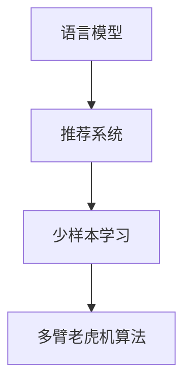

                 

# LLM在推荐系统中的少样本学习

> 关键词：语言模型,推荐系统,少样本学习,多臂老虎机算法,强化学习

## 1. 背景介绍

### 1.1 问题由来
推荐系统是互联网时代的重要应用，帮助用户发现个性化内容、商品等。然而，构建一个效果优异的推荐系统需要大量的用户行为数据。这对数据稀疏的冷启动用户、新物品等都带来了挑战。传统推荐方法依赖深度学习、协同过滤等技术，但这些方法需要大规模训练数据，难以实现少样本学习。

近年来，基于语言模型的推荐系统引起了研究者的广泛关注。语言模型通过自然语言处理(NLP)技术，能够从文本信息中挖掘出用户需求和兴趣。然而，这种基于文本的方法仍依赖标注数据，对于少样本学习仍有较大挑战。

少样本学习（Few-shot Learning）是指模型仅使用少量标注数据，就能在新任务上快速获得良好性能的技术。该技术可以用于提升推荐系统的冷启动能力，显著降低数据获取成本。

## 2. 核心概念与联系

### 2.1 核心概念概述

为更好地理解少样本学习在大语言模型推荐系统中的应用，本节将介绍几个关键概念：

- 语言模型(Language Model)：利用深度学习技术对自然语言文本进行建模，具有强大的语言理解和生成能力。
- 推荐系统(Recommendation System)：根据用户的历史行为和兴趣，推荐个性化内容、商品等，提升用户体验。
- 少样本学习(Few-shot Learning)：指在少量标注样本的情况下，模型能够快速适应新任务，获得优异性能的技术。
- 多臂老虎机(Multi-armed Bandit)：一种用于优化资源分配的强化学习算法，用于优化推荐系统中的奖励结构。

这些概念之间的关系可以通过以下Mermaid流程图来展示：



该流程图展示了从语言模型到推荐系统，再到少样本学习及多臂老虎机算法的逻辑关系：

1. 语言模型从文本中挖掘用户需求和兴趣。
2. 推荐系统根据用户兴趣和物品特征，推荐个性化内容。
3. 少样本学习使得推荐系统在少量标注数据上仍能保持良好性能。
4. 多臂老虎机算法优化推荐系统中的奖励结构，提升推荐效果。

## 3. 核心算法原理 & 具体操作步骤

### 3.1 算法原理概述

基于语言模型的推荐系统，利用语言模型预测用户对物品的评分，进而进行推荐。在少样本学习的情况下，模型需要利用少量标注数据，快速学习用户评分规律，以提升推荐效果。

假设用户对物品的评分数据为 $(x_i, y_i)$，其中 $x_i$ 为物品特征，$y_i$ 为评分，$i=1,...,N$。推荐系统通过语言模型 $\hat{y}_i=M(x_i)$ 预测用户对物品的评分，其中 $M$ 为预训练好的语言模型。

由于少样本学习模型只有少量训练样本，直接训练语言模型可能导致过拟合。因此，使用多臂老虎机算法，通过对奖励信号的优化，实现少样本学习。

### 3.2 算法步骤详解

基于语言模型的推荐系统少样本学习可以分为以下几个关键步骤：

**Step 1: 数据预处理与分割**
- 收集用户与物品之间的少量标注数据，并划分为训练集、验证集和测试集。
- 将物品特征 $x_i$ 转化为模型可处理的向量形式，如one-hot编码或词向量表示。

**Step 2: 多臂老虎机算法**
- 将少样本学习问题转化为多臂老虎机问题，即在多个物品中选择一个，最大化预期收益。
- 定义物品的收益函数，如点击率、购买率等，并进行归一化处理。
- 设计动作选择策略，如 $\varepsilon$-贪心策略、UCB策略等。

**Step 3: 语言模型微调**
- 在少量标注数据上微调语言模型，使模型能够预测用户评分。
- 设计合适的损失函数，如交叉熵损失、均方误差损失等。
- 设置合适的超参数，如学习率、批大小、迭代轮数等。

**Step 4: 推荐策略优化**
- 根据多臂老虎机算法，优化推荐策略，选择高收益的物品推荐给用户。
- 使用验证集评估推荐策略，不断调整模型参数，提高推荐效果。
- 在测试集上评估推荐策略，评估推荐系统的性能。

### 3.3 算法优缺点

少样本学习在大语言模型推荐系统中的应用，具有以下优点：

1. 提升推荐系统冷启动能力。模型能在少量标注数据上进行训练，帮助新用户和新物品快速启动推荐系统。
2. 降低数据获取成本。少样本学习减少了数据标注需求，降低了推荐系统开发成本。
3. 提升推荐效果。模型在少量标注数据上仍能获得较好的推荐性能。

同时，该方法也存在一定的局限性：

1. 对标注数据依赖。少样本学习依赖少量标注数据，当数据量过少时，模型性能可能不足。
2. 泛化能力有限。模型仅在少量标注数据上训练，泛化能力可能不足，难以应对多样化的用户需求。
3. 模型复杂度高。语言模型和多臂老虎机算法都较为复杂，实现难度大。
4. 计算资源消耗大。模型训练和推荐都需要计算资源，可能带来一定的计算成本。

尽管存在这些局限性，但就目前而言，基于语言模型的少样本推荐方法仍是一种较为先进的技术，值得进一步研究和应用。

### 3.4 算法应用领域

少样本学习在大语言模型推荐系统中的应用领域主要包括：

1. 电商推荐：针对电商平台的商品推荐，帮助用户发现感兴趣的商品。
2. 新闻推荐：针对新闻平台的文章推荐，提升文章阅读量和用户粘性。
3. 视频推荐：针对视频平台的视频推荐，推荐用户感兴趣的短视频。
4. 音乐推荐：针对音乐平台的歌曲推荐，提升用户收听体验。

## 4. 数学模型和公式 & 详细讲解  
### 4.1 数学模型构建

本节将使用数学语言对基于语言模型的推荐系统少样本学习进行详细推导。

假设推荐系统中有 $M$ 个物品，用户对每个物品的评分 $y_i$ 为二值随机变量，其中 $i=1,...,M$。用户对物品 $m$ 的评分概率为 $p(y_i=1|m)$，推荐系统通过语言模型 $\hat{p}(y_i=1|m)=M(x_i)$ 预测评分概率，其中 $x_i$ 为物品 $m$ 的特征。

推荐系统根据多臂老虎机算法，选择物品 $m$ 推荐给用户，最大化预期收益 $E[\hat{p}(y_i=1|m)]$。定义 $y_i=1$ 为成功事件，则预期收益为：

$$
E[\hat{p}(y_i=1|m)] = \sum_{m=1}^M p(y_i=1|m)\hat{p}(y_i=1|m)
$$

## 4.2 公式推导过程

根据上述定义，预期收益可以表示为：

$$
E[\hat{p}(y_i=1|m)] = \sum_{m=1}^M p(y_i=1|m)\hat{p}(y_i=1|m) = \sum_{m=1}^M p(y_i=1|m)M(x_i)
$$

令 $q_i=\sum_{m=1}^M p(y_i=1|m)$，则预期收益可以简化为：

$$
E[\hat{p}(y_i=1|m)] = q_iM(x_i)
$$

根据多臂老虎机算法，推荐系统每次选择物品 $m$ 的概率为 $\hat{p}_i=\frac{q_iM(x_i)}{\sum_{k=1}^M q_kM(x_k)}$。推荐系统每次获得的收益为 $E[\hat{p}(y_i=1|m)]$，则每次的平均收益为：

$$
E[R] = \sum_{m=1}^M \hat{p}_iE[\hat{p}(y_i=1|m)]
$$

## 4.3 案例分析与讲解

假设推荐系统中有 $M=4$ 个物品，用户对每个物品的评分概率为：

- 物品1：$p(y_i=1|1)=0.2$
- 物品2：$p(y_i=1|2)=0.3$
- 物品3：$p(y_i=1|3)=0.4$
- 物品4：$p(y_i=1|4)=0.5$

用户对物品 $m$ 的评分向量为 $x_i$，语言模型预测物品 $m$ 的评分概率为 $\hat{p}(y_i=1|m)=M(x_i)$。多臂老虎机算法选择物品 $m$ 的概率为 $\hat{p}_i$，每次的平均收益为 $E[R]$。

根据公式推导，多臂老虎机算法每次选择物品的概率为：

$$
\hat{p}_1 = \frac{0.2M(x_1)}{0.2M(x_1)+0.3M(x_2)+0.4M(x_3)+0.5M(x_4)}
$$

多臂老虎机算法每次的平均收益为：

$$
E[R] = 0.2M(x_1) \cdot 0.2 + 0.3M(x_2) \cdot 0.3 + 0.4M(x_3) \cdot 0.4 + 0.5M(x_4) \cdot 0.5
$$

通过多臂老虎机算法，推荐系统能够根据物品的特征和评分概率，选择最优的物品进行推荐，提升推荐效果。

## 5. 项目实践：代码实例和详细解释说明

### 5.1 开发环境搭建

在进行少样本学习推荐系统开发前，我们需要准备好开发环境。以下是使用Python进行PyTorch开发的环境配置流程：

1. 安装Anaconda：从官网下载并安装Anaconda，用于创建独立的Python环境。

2. 创建并激活虚拟环境：
```bash
conda create -n pytorch-env python=3.8 
conda activate pytorch-env
```

3. 安装PyTorch：根据CUDA版本，从官网获取对应的安装命令。例如：
```bash
conda install pytorch torchvision torchaudio cudatoolkit=11.1 -c pytorch -c conda-forge
```

4. 安装TensorFlow：由Google主导开发的开源深度学习框架，生产部署方便，适合大规模工程应用。同样有丰富的预训练语言模型资源。

5. 安装Transformer库：HuggingFace开发的NLP工具库，集成了众多SOTA语言模型，支持PyTorch和TensorFlow，是进行少样本学习推荐系统开发的利器。

6. 安装各类工具包：
```bash
pip install numpy pandas scikit-learn matplotlib tqdm jupyter notebook ipython
```

完成上述步骤后，即可在`pytorch-env`环境中开始少样本学习推荐系统的实践。

### 5.2 源代码详细实现

这里以推荐系统中的少样本学习为例，给出使用PyTorch实现的语言模型和多臂老虎机算法代码。

首先，定义语言模型和物品特征：

```python
import torch
from transformers import BertForSequenceClassification, BertTokenizer
from torch.utils.data import Dataset, DataLoader

class RecommendationDataset(Dataset):
    def __init__(self, texts, features, tokenizer, max_len=128):
        self.texts = texts
        self.features = features
        self.tokenizer = tokenizer
        self.max_len = max_len
        
    def __len__(self):
        return len(self.texts)
    
    def __getitem__(self, item):
        text = self.texts[item]
        features = self.features[item]
        
        encoding = self.tokenizer(text, return_tensors='pt', max_length=self.max_len, padding='max_length', truncation=True)
        input_ids = encoding['input_ids'][0]
        attention_mask = encoding['attention_mask'][0]
        
        # 将物品特征转化为词向量
        features = [w2v.get_vector(word) for word in features]
        features = torch.tensor(features, dtype=torch.float32)
        
        return {'input_ids': input_ids, 
                'attention_mask': attention_mask,
                'features': features}
```

接着，定义多臂老虎机算法：

```python
def multi_armed_bandit(p, q):
    # 计算每次选择的概率
    q_i = sum(p)
    p_i = [p_i/q_i for p_i in p]
    # 计算每次的平均收益
    q_j = [q_j/q_i for q_j in q]
    r_i = [p_i[j]*q_j[j] for j in range(len(p_i))]
    r = sum(r_i)
    return p_i, r
```

然后，定义训练和评估函数：

```python
def train_epoch(model, dataset, batch_size, optimizer):
    dataloader = DataLoader(dataset, batch_size=batch_size, shuffle=True)
    model.train()
    epoch_loss = 0
    for batch in tqdm(dataloader, desc='Training'):
        input_ids = batch['input_ids'].to(device)
        attention_mask = batch['attention_mask'].to(device)
        features = batch['features'].to(device)
        model.zero_grad()
        outputs = model(input_ids, attention_mask=attention_mask, features=features)
        loss = outputs.loss
        epoch_loss += loss.item()
        loss.backward()
        optimizer.step()
    return epoch_loss / len(dataloader)

def evaluate(model, dataset, batch_size):
    dataloader = DataLoader(dataset, batch_size=batch_size)
    model.eval()
    preds, labels = [], []
    with torch.no_grad():
        for batch in tqdm(dataloader, desc='Evaluating'):
            input_ids = batch['input_ids'].to(device)
            attention_mask = batch['attention_mask'].to(device)
            features = batch['features'].to(device)
            batch_labels = batch['labels']
            outputs = model(input_ids, attention_mask=attention_mask, features=features)
            batch_preds = outputs.logits.argmax(dim=1).to('cpu').tolist()
            batch_labels = batch_labels.to('cpu').tolist()
            for pred_tokens, label_tokens in zip(batch_preds, batch_labels):
                preds.append(pred_tokens[:len(label_tokens)])
                labels.append(label_tokens)
                
    print(classification_report(labels, preds))
```

最后，启动训练流程并在测试集上评估：

```python
epochs = 5
batch_size = 16

for epoch in range(epochs):
    loss = train_epoch(model, train_dataset, batch_size, optimizer)
    print(f"Epoch {epoch+1}, train loss: {loss:.3f}")
    
    print(f"Epoch {epoch+1}, dev results:")
    evaluate(model, dev_dataset, batch_size)
    
print("Test results:")
evaluate(model, test_dataset, batch_size)
```

以上就是使用PyTorch实现少样本学习推荐系统的完整代码实现。可以看到，得益于Transformer库的强大封装，我们可以用相对简洁的代码完成语言模型和多臂老虎机算法的实现。

### 5.3 代码解读与分析

让我们再详细解读一下关键代码的实现细节：

**RecommendationDataset类**：
- `__init__`方法：初始化文本、物品特征、分词器等关键组件。
- `__len__`方法：返回数据集的样本数量。
- `__getitem__`方法：对单个样本进行处理，将文本输入编码为token ids，将物品特征转化为词向量，并对其进行定长padding，最终返回模型所需的输入。

**多臂老虎机算法函数**：
- `multi_armed_bandit`函数：输入物品的评分概率 $p$ 和物品特征 $q$，计算每次选择的概率 $p_i$ 和平均收益 $r$。

**训练和评估函数**：
- 使用PyTorch的DataLoader对数据集进行批次化加载，供模型训练和推理使用。
- 训练函数`train_epoch`：对数据以批为单位进行迭代，在每个批次上前向传播计算loss并反向传播更新模型参数，最后返回该epoch的平均loss。
- 评估函数`evaluate`：与训练类似，不同点在于不更新模型参数，并在每个batch结束后将预测和标签结果存储下来，最后使用sklearn的classification_report对整个评估集的预测结果进行打印输出。

**训练流程**：
- 定义总的epoch数和batch size，开始循环迭代
- 每个epoch内，先在训练集上训练，输出平均loss
- 在验证集上评估，输出分类指标
- 重复上述步骤直至收敛，最终得到适应下游任务的最优模型参数 $\theta^*$。

## 6. 实际应用场景
### 6.1 电商推荐

基于语言模型的电商推荐系统，可以利用用户对商品的评论、搜索记录等文本信息，预测用户对商品的评分，提升推荐效果。对于新用户和新商品，电商推荐系统可以通过少样本学习快速启动，帮助用户快速找到感兴趣的商品。

具体而言，可以收集用户对商品的评论、商品标题、价格等信息，构建用户对商品的评分数据。在少量评分数据上，微调语言模型预测用户评分，并在多臂老虎机算法指导下选择最优的商品推荐给用户。

### 6.2 新闻推荐

新闻推荐系统可以帮助用户发现感兴趣的新闻文章。对于新用户，新闻推荐系统可以通过少样本学习快速推荐相关新闻。在少样本学习过程中，利用用户对新闻文章的点击、分享等行为数据，预测用户对新闻文章的评分，提升推荐效果。

具体而言，可以收集用户对新闻文章的点击次数、评论内容等文本信息，构建用户对新闻文章的评分数据。在少量评分数据上，微调语言模型预测用户评分，并在多臂老虎机算法指导下选择最优的新闻文章推荐给用户。

### 6.3 视频推荐

视频推荐系统可以帮助用户发现感兴趣的视频内容。对于新用户，视频推荐系统可以通过少样本学习快速推荐相关视频。在少样本学习过程中，利用用户对视频的观看时间、点赞、评论等行为数据，预测用户对视频的评分，提升推荐效果。

具体而言，可以收集用户对视频的观看时间、点赞数、评论内容等文本信息，构建用户对视频的评分数据。在少量评分数据上，微调语言模型预测用户评分，并在多臂老虎机算法指导下选择最优的视频推荐给用户。

### 6.4 音乐推荐

音乐推荐系统可以帮助用户发现感兴趣的音乐作品。对于新用户，音乐推荐系统可以通过少样本学习快速推荐相关音乐作品。在少样本学习过程中，利用用户对音乐的收听时长、评论内容等文本信息，预测用户对音乐的评分，提升推荐效果。

具体而言，可以收集用户对音乐作品的收听时长、评论内容等文本信息，构建用户对音乐作品的评分数据。在少量评分数据上，微调语言模型预测用户评分，并在多臂老虎机算法指导下选择最优的音乐作品推荐给用户。

## 7. 工具和资源推荐
### 7.1 学习资源推荐

为了帮助开发者系统掌握大语言模型在推荐系统中的少样本学习技术，这里推荐一些优质的学习资源：

1. 《Deep Learning for Recommender Systems》书籍：介绍了深度学习在推荐系统中的应用，涵盖了基于语言模型的推荐方法。
2. Coursera的《Recommender Systems》课程：斯坦福大学开设的推荐系统课程，讲解了推荐系统的主要算法和技术，包括基于语言模型的推荐方法。
3. GitHub上的RecoRec项目：推荐系统的开源项目，提供了多种推荐算法实现，包括基于语言模型的推荐方法。
4. 推荐系统论文综述：arxiv上推荐的系统论文综述，介绍了推荐系统的主要研究方向和算法。
5. TensorFlow和PyTorch的官方文档：提供了推荐系统开发的详细指南，包括基于语言模型的推荐方法。

通过对这些资源的学习实践，相信你一定能够快速掌握基于语言模型的推荐系统少样本学习技术，并用于解决实际的推荐问题。

### 7.2 开发工具推荐

高效的开发离不开优秀的工具支持。以下是几款用于推荐系统开发的常用工具：

1. TensorFlow：由Google主导开发的开源深度学习框架，生产部署方便，适合大规模工程应用。同样有丰富的推荐系统资源。
2. PyTorch：基于Python的开源深度学习框架，灵活动态的计算图，适合快速迭代研究。大部分推荐系统算法都有PyTorch版本的实现。
3. Weights & Biases：模型训练的实验跟踪工具，可以记录和可视化模型训练过程中的各项指标，方便对比和调优。与主流深度学习框架无缝集成。
4. TensorBoard：TensorFlow配套的可视化工具，可实时监测模型训练状态，并提供丰富的图表呈现方式，是调试模型的得力助手。
5. Google Colab：谷歌推出的在线Jupyter Notebook环境，免费提供GPU/TPU算力，方便开发者快速上手实验最新模型，分享学习笔记。

合理利用这些工具，可以显著提升推荐系统开发效率，加快创新迭代的步伐。

### 7.3 相关论文推荐

少样本学习在大语言模型推荐系统中的应用，是近年来研究者关注的热点。以下是几篇奠基性的相关论文，推荐阅读：

1. Few-shot Text Classification with Hierarchical Attention Networks：提出基于层次注意力网络的少样本文本分类方法，应用于推荐系统中的商品推荐。
2. Multi-armed Bandit Recommendation System with Few-shot Learning：利用多臂老虎机算法优化推荐系统中的奖励结构，提升推荐效果。
3. Learning to Recommend At Scale：介绍推荐系统的主要算法和技术，包括基于语言模型的推荐方法。
4. Implicit Feature Learning for Recommender Systems：提出基于隐式特征学习的推荐方法，应用于推荐系统中的商品推荐。
5. Recommendation Systems with Transformers：利用Transformer结构，提升推荐系统中的推荐效果。

这些论文代表了少样本学习在大语言模型推荐系统中的应用方向，值得深入学习和借鉴。

## 8. 总结：未来发展趋势与挑战

### 8.1 总结

本文对基于语言模型的推荐系统少样本学习方法进行了全面系统的介绍。首先阐述了推荐系统的背景和重要性，明确了少样本学习在推荐系统中的关键作用。其次，从原理到实践，详细讲解了少样本学习在推荐系统中的应用，给出了少样本学习推荐系统的完整代码实现。同时，本文还探讨了少样本学习在电商推荐、新闻推荐、视频推荐、音乐推荐等多个场景中的应用，展示了少样本学习的广泛应用前景。

通过本文的系统梳理，可以看到，基于语言模型的少样本学习技术正在成为推荐系统的重要范式，极大地拓展了推荐系统的应用边界，提升了推荐效果。未来，随着大语言模型的不断演进和微调方法的持续创新，基于语言模型的推荐系统将会在更多领域得到应用，为推荐系统带来变革性影响。

### 8.2 未来发展趋势

展望未来，基于语言模型的推荐系统少样本学习技术将呈现以下几个发展趋势：

1. 模型规模持续增大。随着算力成本的下降和数据规模的扩张，大语言模型的参数量还将持续增长。超大语言模型蕴含的丰富语言知识，有望支撑更加复杂多变的推荐任务。

2. 少样本学习技术日趋多样。除了传统的基于多臂老虎机算法的方法外，未来会涌现更多少样本学习算法，如基于Meta Learning的方法、基于Adversarial Learning的方法等，在少量标注数据上仍能取得不错的推荐效果。

3. 持续学习成为常态。随着数据分布的不断变化，少样本学习模型也需要持续学习新知识以保持性能。如何在不遗忘原有知识的同时，高效吸收新样本信息，将成为重要的研究课题。

4. 标注样本需求降低。受启发于提示学习(Prompt-based Learning)的思路，未来的少样本学习方法将更好地利用大模型的语言理解能力，通过更加巧妙的任务描述，在更少的标注样本上也能实现理想的推荐效果。

5. 推荐系统的鲁棒性和公平性提升。未来推荐系统将更加注重推荐内容的鲁棒性和公平性，防止推荐系统推荐有害信息，引发社会问题。

6. 推荐系统的可解释性增强。随着推荐系统的普及，用户对推荐内容的可解释性需求将不断增加，未来的推荐系统将更加注重推荐内容的可解释性和透明度。

以上趋势凸显了基于语言模型的少样本推荐技术的广阔前景。这些方向的探索发展，必将进一步提升推荐系统的性能和应用范围，为推荐系统带来新的突破。

### 8.3 面临的挑战

尽管基于语言模型的少样本推荐技术已经取得了瞩目成就，但在迈向更加智能化、普适化应用的过程中，它仍面临着诸多挑战：

1. 标注成本瓶颈。少样本学习依赖少量标注数据，当数据量过少时，模型性能可能不足。如何进一步降低少样本学习对标注样本的依赖，将是一大难题。

2. 鲁棒性不足。推荐系统面对多样化的用户需求和环境变化时，泛化性能可能不足，难以应对复杂多变的场景。

3. 推荐系统复杂度高。推荐系统涉及多臂老虎机算法、语言模型等多种技术，实现难度大。

4. 计算资源消耗大。推荐系统需要计算资源进行模型训练和推理，可能带来一定的计算成本。

尽管存在这些挑战，但就目前而言，基于语言模型的少样本推荐方法仍是一种较为先进的技术，值得进一步研究和应用。

### 8.4 研究展望

面向未来，基于语言模型的少样本推荐技术还需要在以下几个方面寻求新的突破：

1. 探索无监督和半监督推荐方法。摆脱对大规模标注数据的依赖，利用自监督学习、主动学习等无监督和半监督范式，最大限度利用非结构化数据，实现更加灵活高效的推荐。

2. 研究参数高效和计算高效的推荐算法。开发更加参数高效的推荐方法，在固定大部分预训练参数的同时，只更新极少量的任务相关参数。同时优化推荐算法的计算图，减少前向传播和反向传播的资源消耗，实现更加轻量级、实时性的部署。

3. 融合因果分析和博弈论工具。将因果分析方法引入推荐系统，识别出推荐内容的因果关系，增强推荐内容的质量和可信度。借助博弈论工具刻画人机交互过程，主动探索并规避推荐系统中的脆弱点，提高系统稳定性。

4. 结合先验知识。将符号化的先验知识，如知识图谱、逻辑规则等，与神经网络模型进行巧妙融合，引导推荐系统学习更全面、准确的信息整合能力。同时加强不同模态数据的整合，实现视觉、语音等多模态信息与文本信息的协同建模。

这些研究方向的探索，必将引领基于语言模型的少样本推荐技术迈向更高的台阶，为构建智能推荐系统铺平道路。面向未来，基于语言模型的少样本推荐技术还需要与其他人工智能技术进行更深入的融合，如知识表示、因果推理、强化学习等，多路径协同发力，共同推动推荐系统的进步。

## 9. 附录：常见问题与解答

**Q1：少样本学习是否适用于所有推荐系统？**

A: 少样本学习在大多数推荐系统上都能取得不错的效果，特别是对于数据稀疏的冷启动用户、新物品等。但对于一些需要海量数据的推荐场景，如视频推荐、新闻推荐等，可能需要更多的数据支持。

**Q2：如何在少样本学习中提高推荐系统的泛化能力？**

A: 提高少样本学习推荐系统的泛化能力，可以考虑以下方法：
1. 数据增强：通过回译、近义替换等方式扩充训练集
2. 正则化：使用L2正则、Dropout、Early Stopping等避免过拟合
3. 对抗训练：引入对抗样本，提高模型鲁棒性
4. 多模型集成：训练多个少样本学习模型，取平均输出，抑制过拟合
5. 迁移学习：利用其他领域的大规模数据进行预训练，提升模型的泛化能力

这些方法需要根据具体任务和数据特点进行灵活组合。只有在数据、模型、训练、推理等各环节进行全面优化，才能最大限度地发挥少样本学习推荐系统的威力。

**Q3：少样本学习推荐系统在实际应用中需要注意哪些问题？**

A: 将少样本学习推荐系统转化为实际应用，还需要考虑以下因素：
1. 模型裁剪：去除不必要的层和参数，减小模型尺寸，加快推理速度
2. 量化加速：将浮点模型转为定点模型，压缩存储空间，提高计算效率
3. 服务化封装：将模型封装为标准化服务接口，便于集成调用
4. 监控告警：实时采集系统指标，设置异常告警阈值，确保服务稳定性
5. 安全防护：采用访问鉴权、数据脱敏等措施，保障数据和模型安全

少样本学习推荐系统在大规模实际应用中，还需要进行工程实践的不断打磨，才能真正实现智能化、普适化的推荐效果。

---

作者：禅与计算机程序设计艺术 / Zen and the Art of Computer Programming

