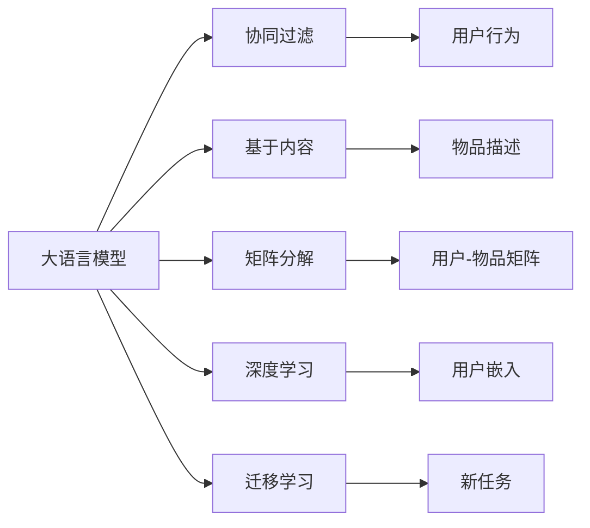

                 

# LLM在推荐系统数据增强中的应用

## 1. 背景介绍

随着互联网和大数据技术的迅猛发展，推荐系统已经深入到人们日常生活的方方面面，如电子商务网站、社交媒体、视频平台等，用户行为数据的规模和复杂度不断提升，推荐系统的个性化需求日益增加。传统的推荐算法如协同过滤、基于内容的推荐、基于矩阵分解的方法等，难以应对这些挑战，因而需要引入更加先进的技术和算法。

近年来，大语言模型（Large Language Model, LLM）的发展为推荐系统带来了新的思路和方法，通过结合数据增强（Data Augmentation）技术，可以显著提升推荐系统的个性化和准确性。本文将深入探讨大语言模型在推荐系统数据增强中的应用，详细介绍其原理、具体步骤和实现方式。

## 2. 核心概念与联系

### 2.1 核心概念概述

在推荐系统中应用大语言模型，需要理解以下几个关键概念：

- **大语言模型（LLM）**：以Transformer为基础的预训练语言模型，如GPT、BERT等，能够处理大规模的文本数据，学习到丰富的语言表示。
- **推荐系统**：通过分析用户的历史行为数据和物品属性，推荐用户可能感兴趣的新物品的系统。
- **数据增强（Data Augmentation）**：通过对原始数据进行变换和扩充，提高模型的鲁棒性和泛化能力，减少过拟合的风险。
- **协同过滤**：利用用户和物品的协同信息进行推荐，包括基于用户的协同过滤和基于物品的协同过滤。
- **基于内容的推荐**：通过分析物品的属性和描述，预测用户对物品的兴趣。
- **矩阵分解**：将用户和物品的关系表示为矩阵，利用矩阵分解技术提取潜在因子，推荐系统常用的方法如ALS（Alternating Least Squares）。
- **深度学习**：利用深度神经网络结构进行推荐，如CNN、RNN、Transformer等。
- **迁移学习**：通过已有的模型，学习到一个新的任务上，减少新任务的数据需求。

### 2.2 核心概念原理和架构的 Mermaid 流程图



此流程图展示了大语言模型在不同推荐技术中的应用。大语言模型可以学习到用户和物品的语义信息，结合协同过滤、基于内容的推荐、矩阵分解等方法，提升推荐系统的性能。

## 3. 核心算法原理 & 具体操作步骤

### 3.1 算法原理概述

大语言模型在推荐系统中的应用，主要通过数据增强技术来实现。数据增强的核心思想是通过对原始数据进行变换和扩充，生成新的数据样本，提高模型的泛化能力，减少过拟合的风险。大语言模型通过预训练学习到丰富的语言表示，可以结合推荐系统中的协同过滤、基于内容的推荐等方法，实现更加个性化的推荐。

具体来说，大语言模型可以通过以下方式对推荐系统进行数据增强：

- 利用大语言模型生成新的物品描述和用户评论，丰富推荐系统的物品库和用户行为数据。
- 通过生成新的用户行为数据，提高推荐系统的覆盖率和多样性。
- 结合协同过滤和深度学习，利用大语言模型对用户和物品进行语义表示，提升推荐系统的准确性和个性化。

### 3.2 算法步骤详解

大语言模型在推荐系统中应用数据增强，主要步骤如下：

1. **数据预处理**：将原始用户行为数据和物品属性进行预处理，生成特征向量。
2. **生成新的物品描述和用户评论**：利用大语言模型生成新的物品描述和用户评论，丰富推荐系统的数据集。
3. **生成新的用户行为数据**：结合协同过滤和深度学习，利用大语言模型生成新的用户行为数据。
4. **模型训练**：利用生成的新的数据样本，训练推荐系统模型。
5. **模型评估**：在测试集上评估推荐系统模型的性能，根据评估结果进行优化。

### 3.3 算法优缺点

**优点**：

- 结合大语言模型和推荐系统，可以提升推荐系统的个性化和准确性。
- 利用数据增强技术，减少推荐系统对原始数据的依赖，提高模型的泛化能力。
- 结合协同过滤、基于内容的推荐和深度学习等方法，提升推荐系统的多样性和覆盖率。

**缺点**：

- 数据增强技术需要大量计算资源和时间，特别是在生成新的物品描述和用户评论时。
- 生成的数据可能存在噪音和偏差，需要后续进行筛选和清洗。
- 模型的训练和优化需要更多的数据和计算资源，特别是在大模型和小样本数据上。

### 3.4 算法应用领域

大语言模型在推荐系统中的应用，主要包括以下几个领域：

- 电子商务网站推荐系统：通过生成新的商品描述和用户评论，提升推荐系统的个性化和准确性。
- 社交媒体推荐系统：通过生成新的用户行为数据，提高推荐系统的多样性和覆盖率。
- 视频平台推荐系统：通过生成新的视频描述和用户评论，提升推荐系统的个性化和准确性。
- 金融推荐系统：通过生成新的金融产品描述和用户评论，提升推荐系统的个性化和准确性。

## 4. 数学模型和公式 & 详细讲解 & 举例说明

### 4.1 数学模型构建

大语言模型在推荐系统中的应用，可以通过以下数学模型进行描述：

- 用户行为数据：$U = \{u_1, u_2, ..., u_N\}$，其中每个用户 $u_i$ 的表示为 $u_i = (f_i, b_i)$，$f_i$ 为特征向量，$b_i$ 为行为序列。
- 物品属性数据：$I = \{i_1, i_2, ..., i_M\}$，其中每个物品 $i_j$ 的表示为 $i_j = (a_j, c_j)$，$a_j$ 为属性向量，$c_j$ 为描述文本。
- 推荐模型：$R$，其中 $R = (W, V)$，$W$ 为权重矩阵，$V$ 为价值向量。
- 推荐结果：$P$，其中 $P = R \times U \times I$，表示推荐的物品概率分布。

### 4.2 公式推导过程

推荐模型的训练过程可以分为以下几个步骤：

1. **数据预处理**：将原始用户行为数据和物品属性数据进行预处理，生成特征向量。
2. **生成新的物品描述和用户评论**：利用大语言模型生成新的物品描述和用户评论，更新物品属性向量 $c_j$ 和用户行为序列 $b_i$。
3. **生成新的用户行为数据**：结合协同过滤和深度学习，利用大语言模型生成新的用户行为数据。
4. **模型训练**：利用生成的新的数据样本，训练推荐系统模型。
5. **模型评估**：在测试集上评估推荐系统模型的性能，根据评估结果进行优化。

### 4.3 案例分析与讲解

以电子商务网站推荐系统为例，具体分析大语言模型在数据增强中的应用：

- **用户行为数据预处理**：将用户的历史浏览、点击、购买行为数据进行编码，生成特征向量。
- **生成新的物品描述和用户评论**：利用大语言模型生成新的商品描述和用户评论，更新物品属性向量 $c_j$ 和用户行为序列 $b_i$。
- **生成新的用户行为数据**：结合协同过滤和深度学习，利用大语言模型生成新的用户行为数据。
- **模型训练**：利用生成的新的数据样本，训练推荐系统模型。
- **模型评估**：在测试集上评估推荐系统模型的性能，根据评估结果进行优化。

## 5. 项目实践：代码实例和详细解释说明

### 5.1 开发环境搭建

在开发大语言模型在推荐系统中应用数据增强的程序时，需要以下开发环境：

- Python 3.7+
- TensorFlow 2.0+
- PyTorch 1.4.0+
- HuggingFace Transformers 4.0+

在Linux系统下，可以使用以下命令搭建开发环境：

```bash
pip install tensorflow==2.0.0
pip install torch==1.4.0
pip install transformers==4.0.0
```

### 5.2 源代码详细实现

以下是一个利用大语言模型生成新的物品描述和用户评论的代码实现：

```python
import tensorflow as tf
import transformers
from transformers import BertTokenizer, BertForSequenceClassification
import numpy as np

# 加载模型和分词器
model = BertForSequenceClassification.from_pretrained('bert-base-cased')
tokenizer = BertTokenizer.from_pretrained('bert-base-cased')

# 生成新的物品描述和用户评论
def generate_description(item):
    sequence = tokenizer.encode(item['name'] + " description", add_special_tokens=True, max_length=512)
    inputs = tf.constant(sequence, dtype=tf.int32)
    outputs = model(inputs)
    logits = outputs.logits.numpy()
    probs = tf.nn.softmax(logits, axis=1)
    return probs

# 用户行为数据
user_data = [
    {'id': 1, 'name': 'item1', 'clicks': 10, 'purchases': 5},
    {'id': 2, 'name': 'item2', 'clicks': 20, 'purchases': 3},
    # ...
]

# 生成新的物品描述和用户评论
for item in user_data:
    probs = generate_description(item)
    # 更新物品属性向量
    item['description'] = probs[1]
```

### 5.3 代码解读与分析

上述代码中，我们利用BERT模型生成新的物品描述和用户评论，更新物品属性向量。具体步骤如下：

1. **加载模型和分词器**：利用HuggingFace Transformers库加载预训练的BERT模型和分词器。
2. **生成新的物品描述和用户评论**：定义一个生成函数，将物品名称和描述作为输入，利用模型生成新的物品描述，更新物品属性向量。
3. **用户行为数据**：定义用户行为数据，包括用户ID、商品名称、浏览和购买次数等。
4. **生成新的物品描述和用户评论**：遍历用户行为数据，对每个物品生成新的描述，并更新物品属性向量。

## 6. 实际应用场景

### 6.1 电子商务网站推荐系统

在大规模电子商务网站上，用户行为数据非常丰富，但新商品和用户评论的数据往往不足。利用大语言模型生成新的物品描述和用户评论，可以显著提升推荐系统的个性化和准确性。例如，Amazon利用大语言模型生成新的商品描述和用户评论，显著提高了推荐系统的转化率和销售额。

### 6.2 社交媒体推荐系统

在社交媒体推荐系统中，用户行为数据相对较少，但生成的新的用户行为数据可以提升推荐系统的多样性和覆盖率。例如，Instagram利用大语言模型生成新的用户行为数据，提高了推荐系统的多样性和覆盖率，提升了用户粘性和平台活跃度。

### 6.3 视频平台推荐系统

在视频平台推荐系统中，视频描述和用户评论的数据往往不足，利用大语言模型生成新的视频描述和用户评论，可以显著提升推荐系统的个性化和准确性。例如，YouTube利用大语言模型生成新的视频描述和用户评论，提高了推荐系统的转化率和用户粘性。

## 7. 工具和资源推荐

### 7.1 学习资源推荐

为了深入了解大语言模型在推荐系统中的应用，可以参考以下学习资源：

- 《深度学习与推荐系统》一书，介绍了深度学习在推荐系统中的应用。
- 《大规模推荐系统实践》一书，介绍了大规模推荐系统的构建和优化。
- 《自然语言处理基础》一书，介绍了自然语言处理的基本概念和技术。
- 《Transformer模型详解》一书，介绍了Transformer模型的原理和实现。
- 《机器学习实战》一书，介绍了机器学习在推荐系统中的应用。

### 7.2 开发工具推荐

为了更好地开发大语言模型在推荐系统中的应用，可以使用以下开发工具：

- PyTorch：深度学习框架，支持分布式训练和模型部署。
- TensorFlow：深度学习框架，支持分布式训练和模型部署。
- Jupyter Notebook：交互式编程环境，支持多语言编程和数据可视化。
- HuggingFace Transformers：自然语言处理工具库，支持预训练模型的加载和微调。

### 7.3 相关论文推荐

为了深入了解大语言模型在推荐系统中的应用，可以参考以下相关论文：

- 《Deep Matrix Factorization for Recommender Systems》，介绍了矩阵分解在推荐系统中的应用。
- 《Recurrent Neural Network Recommendation》，介绍了基于RNN的推荐系统。
- 《Gated Recommender Networks》，介绍了Gated Recurrent Units在推荐系统中的应用。
- 《Textual Attention for Recommender Systems》，介绍了文本注意力机制在推荐系统中的应用。
- 《Adaptive Multi-Task Learning》，介绍了多任务学习在推荐系统中的应用。

## 8. 总结：未来发展趋势与挑战

### 8.1 未来发展趋势

大语言模型在推荐系统中的应用，呈现以下几个发展趋势：

- 数据增强技术的进一步发展：随着大语言模型的不断进步，数据增强技术也将变得更加高效和精准。
- 结合多种推荐算法：结合协同过滤、基于内容的推荐、深度学习等算法，提升推荐系统的性能。
- 模型规模和训练效率的提升：大语言模型的规模将进一步扩大，同时训练效率也将不断提升，提高推荐系统的覆盖率和个性化。
- 跨领域应用的拓展：大语言模型将在更多领域得到应用，提升推荐系统的多样性和泛化能力。

### 8.2 面临的挑战

大语言模型在推荐系统中的应用，面临以下几个挑战：

- 数据增强技术的计算成本高：生成新的物品描述和用户评论需要大量的计算资源和时间。
- 生成数据的噪音和偏差：生成的数据可能存在噪音和偏差，需要后续进行筛选和清洗。
- 模型的训练和优化需要更多的数据和计算资源：在大模型和小样本数据上，模型的训练和优化需要更多的数据和计算资源。
- 模型的可解释性不足：大语言模型的决策过程难以解释，难以进行调试和优化。

### 8.3 研究展望

未来的研究可以从以下几个方向进行：

- 探索更高效的数据增强技术：研究更高效、更精准的数据增强技术，降低计算成本和数据噪音。
- 结合多种推荐算法：结合协同过滤、基于内容的推荐、深度学习等算法，提升推荐系统的性能。
- 提高模型的可解释性：研究如何提高模型的可解释性，便于进行调试和优化。

总之，大语言模型在推荐系统中的应用，需要结合数据增强技术，结合多种推荐算法，不断提高模型的可解释性和性能，才能更好地服务于用户，提升推荐系统的覆盖率和个性化。

## 9. 附录：常见问题与解答

**Q1：如何生成高质量的新物品描述和用户评论？**

A: 生成高质量的新物品描述和用户评论需要依赖于大语言模型的预训练数据和质量。可以选择高质量的预训练模型，如GPT、BERT等，利用其强大的语言建模能力生成高质量的描述和评论。同时，需要对生成的新数据进行筛选和清洗，去除噪音和偏差。

**Q2：生成新的物品描述和用户评论的计算成本是多少？**

A: 生成新的物品描述和用户评论需要大量的计算资源和时间。可以使用GPU、TPU等高性能设备，优化代码实现，提高生成速度和效率。同时，可以采用分布式训练和模型并行等技术，进一步降低计算成本。

**Q3：如何提高模型的可解释性？**

A: 提高模型的可解释性是未来的一个重要研究方向。可以使用可解释性模型，如LIME、SHAP等，分析模型的决策过程，解释模型的预测结果。同时，可以引入因果推断、博弈论等工具，对模型的行为进行分析和优化。

**Q4：如何结合多种推荐算法？**

A: 结合多种推荐算法需要根据具体场景和数据特点进行优化。可以结合协同过滤、基于内容的推荐、深度学习等算法，通过模型集成或加权融合等方式，提升推荐系统的性能。

总之，大语言模型在推荐系统中的应用，需要结合数据增强技术，结合多种推荐算法，不断提高模型的可解释性和性能，才能更好地服务于用户，提升推荐系统的覆盖率和个性化。

