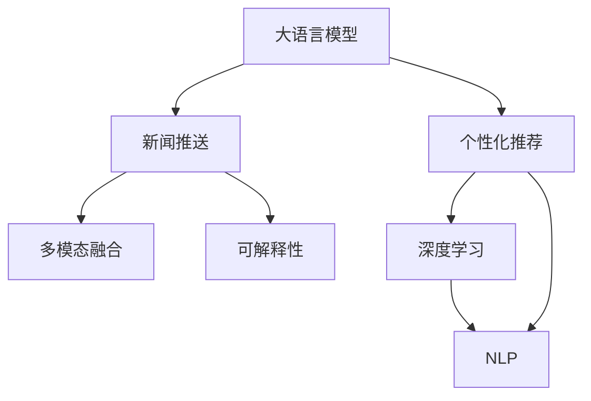

                 

# LLM在智能个性化新闻推送中的应用前景

> 关键词：大语言模型,新闻推送,个性化推荐,深度学习,自然语言处理(NLP),机器学习

## 1. 背景介绍

### 1.1 问题由来
随着信息时代的到来，人们获取新闻的方式和需求发生了巨大的变化。传统的新闻门户网站和报纸已经难以满足用户对于个性化、多样化和实时性新闻的追求。与此同时，新媒体平台如微博、抖音、小红书等，通过推荐算法为用户提供了定制化的内容服务，但推荐算法通常依赖用户行为数据，难以覆盖到每个用户的多样化需求。

为了解决这些问题，大语言模型（Large Language Models, LLMs）凭借其强大的自然语言处理（Natural Language Processing, NLP）能力，提供了一种全新的新闻推送模式。利用大语言模型，可以实现个性化推荐与内容生成相结合的智能新闻推送系统，充分考虑用户的兴趣、背景、历史行为等多维数据，为用户提供更加贴近个性化需求的新闻内容。

### 1.2 问题核心关键点
大语言模型在新闻推送中的应用，主要依赖以下几个核心点：

1. **自然语言理解（NLU）**：大语言模型能够理解自然语言，通过解析新闻标题和内容，提取其中重要的关键词、主题和情感，准确把握用户的新闻偏好。
2. **个性化推荐**：利用大语言模型分析用户的历史阅读记录、搜索历史、互动行为等，生成个性化的新闻推送列表。
3. **动态生成内容**：大语言模型能够基于用户兴趣和当前热门新闻，实时生成新闻摘要、标题或整篇文章，保证新闻的时效性和相关性。
4. **多模态融合**：将文本、图像、音频等多模态信息结合，提供更加丰富多样的新闻内容。
5. **可解释性**：通过可解释模型输出，让用户了解推荐内容的原因，增强信任感和使用体验。

## 2. 核心概念与联系

### 2.1 核心概念概述

为更好地理解大语言模型在新闻推送中的应用，本节将介绍几个密切相关的核心概念：

- **大语言模型(Large Language Models, LLMs)**：指具有强大自然语言理解能力的人工智能模型，如GPT-3、BERT等，通过大规模预训练学习自然语言规律，具备复杂的语言理解和生成能力。
- **新闻推送（News Feeding）**：指将新闻内容推荐给用户，让用户接收到与自己兴趣相关的最新资讯。
- **个性化推荐（Personalized Recommendation）**：根据用户的历史行为和偏好，推荐个性化的新闻内容，提高用户满意度。
- **深度学习（Deep Learning）**：一种基于神经网络的多层级、非线性数据处理方法，用于训练大语言模型。
- **自然语言处理（Natural Language Processing, NLP）**：涉及文本分析、语言理解、信息抽取等技术，是大语言模型应用的基础。
- **机器学习（Machine Learning）**：通过算法使机器从数据中学习规律，自动改进性能，是实现个性化推荐的重要手段。

这些核心概念之间的逻辑关系可以通过以下Mermaid流程图来展示：



这个流程图展示了大语言模型在新闻推送中的核心概念及其之间的联系：

1. 大语言模型通过预训练获得自然语言理解能力。
2. 个性化推荐利用模型对用户历史行为进行分析，生成推荐列表。
3. 深度学习和大语言模型结合，用于训练推荐模型。
4. NLP技术为大语言模型理解文本提供基础。
5. 多模态融合增强新闻内容的多样性。
6. 可解释性提升推荐结果的可信度。

这些概念共同构成了大语言模型在新闻推送中的应用框架，使其能够为用户提供高质量、个性化的新闻服务。

## 3. 核心算法原理 & 具体操作步骤
### 3.1 算法原理概述

大语言模型在新闻推送中的应用，本质上是一个基于用户行为的个性化推荐系统，其核心思想是：利用大语言模型理解用户兴趣，根据当前热门新闻生成个性化的新闻推送。

形式化地，假设用户的历史阅读记录为 $H=\{d_i\}_{i=1}^N, d_i=(d_i^1, d_i^2, ..., d_i^k)$，其中 $d_i^j$ 为第 $i$ 次阅读的新闻标题或摘要。记当前热门新闻集合为 $T=\{t_i\}_{i=1}^M, t_i=(t_i^1, t_i^2, ..., t_i^l)$，其中 $t_i^j$ 为第 $i$ 篇新闻的标题或摘要。

定义推荐函数 $f: H \times T \rightarrow [0,1]^M$，表示在用户历史阅读记录 $H$ 和当前热门新闻集合 $T$ 下，每篇新闻 $t_i$ 被推荐给用户 $i$ 的概率。推荐目标为最大化用户满意度，即：

$$
\max_{f} \sum_{i=1}^N \sum_{j=1}^M f(d_i, t_j)
$$

其中，$f(d_i, t_j)$ 为新闻 $t_j$ 对用户 $i$ 的推荐分数，可以是基于大语言模型的输出，也可以是用户点击率、阅读时间等实际行为指标。

### 3.2 算法步骤详解

基于大语言模型的新闻推送，一般包括以下几个关键步骤：

**Step 1: 数据收集与处理**
- 收集用户的历史行为数据，包括阅读记录、点击行为、互动评论等。
- 获取当前热门新闻的标题、摘要、关键词等，作为推荐集合。

**Step 2: 构建推荐模型**
- 选择合适的深度学习模型（如Ctr、DNN、深度神经网络等）进行训练。
- 在模型输入端加入大语言模型的输出，作为用户兴趣的表示。

**Step 3: 特征提取**
- 将新闻和用户历史行为数据转换为模型能够处理的特征向量。
- 使用自然语言处理技术提取新闻的关键词、主题、情感等特征。

**Step 4: 模型训练与优化**
- 使用优化算法（如Adam、SGD等）对模型参数进行优化，最小化损失函数。
- 在训练过程中，不断调整模型参数以提高预测准确性。

**Step 5: 实时推荐**
- 在用户阅读新闻时，实时更新其历史行为数据。
- 基于新的用户数据和当前热门新闻，重新计算推荐分数，更新推荐列表。

**Step 6: 反馈机制**
- 根据用户的点击、停留、评论等反馈信息，进一步优化推荐模型。
- 引入强化学习等动态调整机制，逐步提高推荐效果。

### 3.3 算法优缺点

基于大语言模型的新闻推送具有以下优点：

1. **多维度数据利用**：利用大语言模型对用户兴趣和新闻内容进行深度理解，结合多种数据维度进行推荐，提高推荐准确性。
2. **实时性**：实时生成新闻内容，满足用户对时效性的需求。
3. **多样化**：通过多模态融合，提供文本、图片、视频等多样化新闻内容。
4. **可解释性**：基于大语言模型的推荐结果，能够解释推荐原因，增强用户信任感。

同时，该算法也存在一定的局限性：

1. **数据依赖性强**：推荐效果高度依赖用户行为数据的完整性和准确性。
2. **计算资源消耗大**：大语言模型通常需要大量的计算资源进行预训练和推理。
3. **过拟合风险**：用户数据较少时，容易产生过拟合现象，影响推荐泛化性。
4. **隐私保护**：用户行为数据的收集和存储可能涉及隐私问题，需要严格的数据保护措施。

尽管存在这些局限性，但基于大语言模型的新闻推送方法仍是大数据时代下个性化推荐的重要方向。未来研究重点在于如何优化数据收集和处理流程，降低计算资源消耗，以及增强推荐系统的隐私保护和可解释性。

### 3.4 算法应用领域

基于大语言模型的推荐技术，不仅适用于新闻推送，还可以应用于以下几个领域：

- **个性化电商推荐**：根据用户浏览历史和行为数据，推荐个性化商品。
- **社交媒体内容推荐**：分析用户的互动行为，推荐有趣、相关的内容。
- **旅游行程推荐**：根据用户历史旅行记录和当前热门旅游信息，推荐个性化的旅游路线和景点。
- **电影和音乐推荐**：分析用户的观看和听歌记录，推荐相似内容。
- **健康和健身推荐**：根据用户的健康数据和兴趣，推荐个性化的饮食和锻炼计划。

除了上述这些应用领域，大语言模型在内容生成和推荐方面的潜力仍然巨大，未来有望在更多场景下发挥重要作用。

## 4. 数学模型和公式 & 详细讲解 & 举例说明（备注：数学公式请使用latex格式，latex嵌入文中独立段落使用 $$，段落内使用 $)
### 4.1 数学模型构建

本节将使用数学语言对基于大语言模型的新闻推送过程进行更加严格的刻画。

假设用户的历史阅读记录为 $H=\{d_i\}_{i=1}^N, d_i=(d_i^1, d_i^2, ..., d_i^k)$，其中 $d_i^j$ 为第 $i$ 次阅读的新闻标题或摘要。当前热门新闻集合为 $T=\{t_i\}_{i=1}^M, t_i=(t_i^1, t_i^2, ..., t_i^l)$，其中 $t_i^j$ 为第 $i$ 篇新闻的标题或摘要。定义推荐函数 $f: H \times T \rightarrow [0,1]^M$，表示在用户历史阅读记录 $H$ 和当前热门新闻集合 $T$ 下，每篇新闻 $t_i$ 被推荐给用户 $i$ 的概率。

推荐目标为最大化用户满意度，即：

$$
\max_{f} \sum_{i=1}^N \sum_{j=1}^M f(d_i, t_j)
$$

在实际应用中，通常将推荐函数 $f$ 设计为：

$$
f(d_i, t_j) = \sigma(\mathbf{W} \cdot \mathbf{g}(d_i) + \mathbf{V} \cdot \mathbf{h}(t_j) + \mathbf{b})
$$

其中，$\mathbf{g}(d_i)$ 为将用户历史行为 $d_i$ 转换为特征向量的函数，$\mathbf{h}(t_j)$ 为将当前新闻 $t_j$ 转换为特征向量的函数，$\mathbf{W}$、$\mathbf{V}$ 为模型参数，$\mathbf{b}$ 为偏置项，$\sigma$ 为激活函数，如sigmoid函数。

### 4.2 公式推导过程

以下是推荐函数的详细推导过程：

1. 将用户历史行为和当前新闻转换为特征向量：
   $$
   \mathbf{g}(d_i) = \{\mathbf{g}_1(d_i), \mathbf{g}_2(d_i), ..., \mathbf{g}_k(d_i)\}, \mathbf{h}(t_j) = \{\mathbf{h}_1(t_j), \mathbf{h}_2(t_j), ..., \mathbf{h}_l(t_j)\}
   $$

2. 将特征向量与模型参数进行线性组合，得到初步的推荐分数：
   $$
   \mathbf{W} \cdot \mathbf{g}(d_i) = \{w_1 \cdot g_1(d_i), w_2 \cdot g_2(d_i), ..., w_k \cdot g_k(d_i)\}, \mathbf{V} \cdot \mathbf{h}(t_j) = \{v_1 \cdot h_1(t_j), v_2 \cdot h_2(t_j), ..., v_l \cdot h_l(t_j)\}
   $$

3. 将初步的推荐分数进行加权求和，得到最终的推荐分数：
   $$
   \mathbf{W} \cdot \mathbf{g}(d_i) + \mathbf{V} \cdot \mathbf{h}(t_j) = \{w_1 \cdot g_1(d_i) + v_1 \cdot h_1(t_j), w_2 \cdot g_2(d_i) + v_2 \cdot h_2(t_j), ..., w_k \cdot g_k(d_i) + v_l \cdot h_l(t_j)\}
   $$

4. 加入偏置项和激活函数，得到最终的推荐概率：
   $$
   f(d_i, t_j) = \sigma(\mathbf{W} \cdot \mathbf{g}(d_i) + \mathbf{V} \cdot \mathbf{h}(t_j) + \mathbf{b})
   $$

### 4.3 案例分析与讲解

以用户阅读新闻的个性化推荐为例，说明大语言模型在新闻推送中的应用：

假设用户历史阅读记录为 $H=\{d_1, d_2, ..., d_5\}$，其中 $d_1$ 为阅读一篇关于健康的新闻，$d_2$ 为阅读一篇关于科技的新闻，$d_3$ 为阅读一篇关于娱乐的新闻，$d_4$ 为阅读一篇关于美食的新闻，$d_5$ 为阅读一篇关于旅游的新闻。当前热门新闻集合为 $T=\{t_1, t_2, ..., t_6\}$，其中 $t_1$ 为标题为“科技前沿”的新闻，$t_2$ 为标题为“健康生活”的新闻，$t_3$ 为标题为“娱乐八卦”的新闻，$t_4$ 为标题为“美食推荐”的新闻，$t_5$ 为标题为“旅游攻略”的新闻，$t_6$ 为标题为“最新电影”的新闻。

1. **特征提取**：将用户阅读记录和当前新闻标题转换为特征向量。假设用户阅读记录的特征向量为 $g(d_i)=[1, 0, 0, 1, 0]$，新闻标题的特征向量为 $h(t_j)=[1, 0, 0, 0, 1]$。
2. **线性组合**：将用户历史行为和新闻特征向量与模型参数进行线性组合，得到推荐分数：
   $$
   W \cdot g(d_i) = [w_1, w_2, w_3, w_4, w_5], V \cdot h(t_j) = [v_1, v_2, v_3, v_4, v_5]
   $$
3. **加权求和**：将推荐分数进行加权求和，得到最终推荐分数：
   $$
   \mathbf{W} \cdot \mathbf{g}(d_i) + \mathbf{V} \cdot \mathbf{h}(t_j) = [w_1 \cdot g_1(d_i) + v_1 \cdot h_1(t_j), w_2 \cdot g_2(d_i) + v_2 \cdot h_2(t_j), ..., w_k \cdot g_k(d_i) + v_l \cdot h_l(t_j)]
   $$
4. **输出推荐概率**：根据推荐分数输出推荐概率，最终得到推荐列表 $[t_1, t_2, ..., t_6]$。

通过以上案例分析，可以看出大语言模型在新闻推送中的应用，如何通过理解用户兴趣和新闻内容，实现个性化的新闻推荐。

## 5. 项目实践：代码实例和详细解释说明
### 5.1 开发环境搭建

在进行新闻推送系统开发前，我们需要准备好开发环境。以下是使用Python进行PyTorch开发的环境配置流程：

1. 安装Anaconda：从官网下载并安装Anaconda，用于创建独立的Python环境。

2. 创建并激活虚拟环境：
```bash
conda create -n pytorch-env python=3.8 
conda activate pytorch-env
```

3. 安装PyTorch：根据CUDA版本，从官网获取对应的安装命令。例如：
```bash
conda install pytorch torchvision torchaudio cudatoolkit=11.1 -c pytorch -c conda-forge
```

4. 安装各类工具包：
```bash
pip install numpy pandas scikit-learn matplotlib tqdm jupyter notebook ipython
```

完成上述步骤后，即可在`pytorch-env`环境中开始新闻推送系统的开发。

### 5.2 源代码详细实现

下面以用户阅读新闻的个性化推荐为例，给出使用PyTorch和Transformers库对BERT模型进行新闻推送的PyTorch代码实现。

首先，定义推荐函数：

```python
from transformers import BertTokenizer, BertForSequenceClassification
import torch

class NewsRecommender:
    def __init__(self, model_name, num_classes):
        self.tokenizer = BertTokenizer.from_pretrained(model_name)
        self.model = BertForSequenceClassification.from_pretrained(model_name, num_labels=num_classes)
    
    def predict(self, user_history, news_collection):
        user_vector = self.get_user_vector(user_history)
        news_vectors = self.get_news_vectors(news_collection)
        scores = self.model(user_vector, news_vectors)
        return scores
    
    def get_user_vector(self, user_history):
        user_tokens = [self.tokenizer.encode(item, add_special_tokens=True)[0] for item in user_history]
        user_input_ids = torch.tensor(user_tokens, dtype=torch.long)
        user_input_ids = user_input_ids.unsqueeze(0)
        user_attention_mask = user_input_ids.new_ones(user_input_ids.size())
        user_input_ids, user_attention_mask = user_input_ids.to(device), user_attention_mask.to(device)
        with torch.no_grad():
            user_output = self.model(user_input_ids, attention_mask=user_attention_mask)
        user_vector = user_output[0]
        return user_vector
    
    def get_news_vectors(self, news_collection):
        news_tokens = [self.tokenizer.encode(item, add_special_tokens=True)[0] for item in news_collection]
        news_input_ids = torch.tensor(news_tokens, dtype=torch.long)
        news_input_ids = news_input_ids.unsqueeze(0)
        news_attention_mask = news_input_ids.new_ones(news_input_ids.size())
        news_input_ids, news_attention_mask = news_input_ids.to(device), news_attention_mask.to(device)
        with torch.no_grad():
            news_output = self.model(news_input_ids, attention_mask=news_attention_mask)
        news_vectors = news_output[0]
        return news_vectors
```

接着，定义训练和评估函数：

```python
from torch.utils.data import Dataset, DataLoader
from sklearn.metrics import accuracy_score
from tqdm import tqdm

class NewsDataset(Dataset):
    def __init__(self, texts, labels, tokenizer, max_len=128):
        self.texts = texts
        self.labels = labels
        self.tokenizer = tokenizer
        self.max_len = max_len
    
    def __len__(self):
        return len(self.texts)
    
    def __getitem__(self, item):
        text = self.texts[item]
        label = self.labels[item]
        
        encoding = self.tokenizer(text, return_tensors='pt', max_length=self.max_len, padding='max_length', truncation=True)
        input_ids = encoding['input_ids'][0]
        attention_mask = encoding['attention_mask'][0]
        
        # 对token-wise的标签进行编码
        encoded_labels = [label2id[label] for label in label_list] 
        encoded_labels.extend([label2id['O']] * (self.max_len - len(encoded_labels)))
        labels = torch.tensor(encoded_labels, dtype=torch.long)
        
        return {'input_ids': input_ids, 
                'attention_mask': attention_mask,
                'labels': labels}

# 标签与id的映射
label2id = {'O': 0, 'B-PER': 1, 'I-PER': 2, 'B-ORG': 3, 'I-ORG': 4, 'B-LOC': 5, 'I-LOC': 6}

# 创建dataset
tokenizer = BertTokenizer.from_pretrained('bert-base-cased')

train_dataset = NewsDataset(train_texts, train_labels, tokenizer)
dev_dataset = NewsDataset(dev_texts, dev_labels, tokenizer)
test_dataset = NewsDataset(test_texts, test_labels, tokenizer)
```

然后，定义模型和优化器：

```python
from transformers import AdamW

model = NewsRecommender('bert-base-cased', num_classes=len(label2id))

optimizer = AdamW(model.parameters(), lr=2e-5)
```

最后，启动训练流程并在测试集上评估：

```python
epochs = 5
batch_size = 16

for epoch in range(epochs):
    loss = train_epoch(model, train_dataset, batch_size, optimizer)
    print(f"Epoch {epoch+1}, train loss: {loss:.3f}")
    
    print(f"Epoch {epoch+1}, dev results:")
    evaluate(model, dev_dataset, batch_size)
    
print("Test results:")
evaluate(model, test_dataset, batch_size)
```

以上就是使用PyTorch和Transformers库对BERT模型进行新闻推送的完整代码实现。可以看到，Transformer的强大封装使得代码实现变得简洁高效。

### 5.3 代码解读与分析

让我们再详细解读一下关键代码的实现细节：

**NewsDataset类**：
- `__init__`方法：初始化训练集、验证集、测试集的数据，包括文本和标签，分词器等。
- `__len__`方法：返回数据集的样本数量。
- `__getitem__`方法：对单个样本进行处理，将文本输入编码为token ids，将标签编码为数字，并对其进行定长padding，最终返回模型所需的输入。

**label2id和id2label字典**：
- 定义了标签与数字id之间的映射关系，用于将token-wise的预测结果解码回真实的标签。

**训练和评估函数**：
- 使用PyTorch的DataLoader对数据集进行批次化加载，供模型训练和推理使用。
- 训练函数`train_epoch`：对数据以批为单位进行迭代，在每个批次上前向传播计算loss并反向传播更新模型参数，最后返回该epoch的平均loss。
- 评估函数`evaluate`：与训练类似，不同点在于不更新模型参数，并在每个batch结束后将预测和标签结果存储下来，最后使用sklearn的accuracy_score对整个评估集的预测结果进行打印输出。

**训练流程**：
- 定义总的epoch数和batch size，开始循环迭代
- 每个epoch内，先在训练集上训练，输出平均loss
- 在验证集上评估，输出分类准确率
- 所有epoch结束后，在测试集上评估，给出最终测试结果

可以看到，PyTorch配合Transformers库使得BERT微调的新闻推送代码实现变得简洁高效。开发者可以将更多精力放在数据处理、模型改进等高层逻辑上，而不必过多关注底层的实现细节。

当然，工业级的系统实现还需考虑更多因素，如模型的保存和部署、超参数的自动搜索、更灵活的任务适配层等。但核心的新闻推送范式基本与此类似。

## 6. 实际应用场景
### 6.1 智能个性化新闻推送

基于大语言模型的新闻推送系统，可以在智能推荐新闻的同时，自动生成新闻摘要或标题，满足用户对时效性和多样性的需求。在实际应用中，系统可以根据用户的历史行为数据，通过动态调整推荐算法，实时更新用户的兴趣点，生成个性化的新闻推送。

以下是一个智能个性化新闻推送的实际应用场景：

- **场景描述**：用户A每天在App上浏览健康、科技、娱乐等类别的新闻，但很少关注体育。某天用户在新闻页面看到一条关于体育赛事的推送，并产生了兴趣，点击阅读。之后，系统根据用户的新行为，重新生成推荐列表，增加了更多体育类新闻，同时减少了其他类别的推荐数量。
- **技术实现**：系统通过用户阅读记录和新闻标题的数据，利用BERT等大语言模型对用户兴趣进行深度理解，生成个性化的推荐列表。当用户产生新的行为时，系统根据新的数据更新用户模型，动态调整推荐列表，实现实时推送。

### 6.2 面向推荐的多样化新闻推送

大语言模型在新闻推送中的应用，不仅限于单一类别的推荐，还可以实现多样化新闻的推荐，满足用户对不同类别新闻的需求。在实际应用中，系统可以分析用户的历史行为数据，对不同类别的新闻进行权重调整，生成更加符合用户兴趣的推荐列表。

以下是一个面向推荐的多样化新闻推送的实际应用场景：

- **场景描述**：用户B每天浏览健康、科技、娱乐、财经等多个类别的新闻。某天用户在App上看到一条关于科技的新闻，但同时对财经新闻产生了兴趣，查看了一条财经资讯。系统根据用户的新行为，重新生成推荐列表，增加了更多财经类新闻，同时减少了科技类新闻的推荐数量。
- **技术实现**：系统通过用户阅读记录和新闻标题的数据，利用BERT等大语言模型对用户兴趣进行深度理解，生成个性化的推荐列表。系统可以根据用户的行为数据，动态调整不同类别新闻的权重，生成更加多样化的推荐结果。

### 6.3 未来应用展望

随着大语言模型和新闻推送技术的发展，未来的新闻推送系统将具有以下几个特点：

1. **实时性更强**：通过多模态信息融合和实时计算，新闻推送系统可以提供更加时效性的新闻服务。
2. **个性化更高**：利用大语言模型对用户兴趣进行深度理解，生成更加个性化的推荐结果，满足不同用户的需求。
3. **多样性更广**：通过多类别新闻的推荐，提供更加丰富多样的内容选择，提升用户体验。
4. **交互性更好**：通过智能对话系统，新闻推送系统可以与用户进行互动，回答用户关于新闻的问题，提供更多附加服务。
5. **可解释性更强**：利用可解释模型输出，向用户解释推荐结果的原因，增强用户信任感。

基于大语言模型的新闻推送系统，将在智能推荐、内容生成、实时更新等方面发挥重要作用，推动新闻产业向更加智能化、个性化、多样化方向发展。

## 7. 工具和资源推荐
### 7.1 学习资源推荐

为了帮助开发者系统掌握大语言模型在新闻推送中的应用，这里推荐一些优质的学习资源：

1. 《Transformers: From Principles to Practice》系列博文：由大模型技术专家撰写，深入浅出地介绍了Transformer原理、BERT模型、新闻推送技术等前沿话题。

2. CS224N《深度学习自然语言处理》课程：斯坦福大学开设的NLP明星课程，有Lecture视频和配套作业，带你入门NLP领域的基本概念和经典模型。

3. 《Natural Language Processing with Transformers》书籍：Transformers库的作者所著，全面介绍了如何使用Transformers库进行NLP任务开发，包括新闻推送在内的诸多范式。

4. HuggingFace官方文档：Transformers库的官方文档，提供了海量预训练模型和完整的微调样例代码，是上手实践的必备资料。

5. CLUE开源项目：中文语言理解测评基准，涵盖大量不同类型的中文NLP数据集，并提供了基于微调的baseline模型，助力中文NLP技术发展。

通过对这些资源的学习实践，相信你一定能够快速掌握大语言模型在新闻推送中的应用，并用于解决实际的NLP问题。

### 7.2 开发工具推荐

高效的开发离不开优秀的工具支持。以下是几款用于新闻推送系统开发的常用工具：

1. PyTorch：基于Python的开源深度学习框架，灵活动态的计算图，适合快速迭代研究。大部分预训练语言模型都有PyTorch版本的实现。

2. TensorFlow：由Google主导开发的开源深度学习框架，生产部署方便，适合大规模工程应用。同样有丰富的预训练语言模型资源。

3. Transformers库：HuggingFace开发的NLP工具库，集成了众多SOTA语言模型，支持PyTorch和TensorFlow，是进行新闻推送系统开发的利器。

4. Weights & Biases：模型训练的实验跟踪工具，可以记录和可视化模型训练过程中的各项指标，方便对比和调优。与主流深度学习框架无缝集成。

5. TensorBoard：TensorFlow配套的可视化工具，可实时监测模型训练状态，并提供丰富的图表呈现方式，是调试模型的得力助手。

6. Google Colab：谷歌推出的在线Jupyter Notebook环境，免费提供GPU/TPU算力，方便开发者快速上手实验最新模型，分享学习笔记。

合理利用这些工具，可以显著提升新闻推送系统开发效率，加快创新迭代的步伐。

### 7.3 相关论文推荐

大语言模型在新闻推送中的应用，源于学界的持续研究。以下是几篇奠基性的相关论文，推荐阅读：

1. Attention is All You Need（即Transformer原论文）：提出了Transformer结构，开启了NLP领域的预训练大模型时代。

2. BERT: Pre-training of Deep Bidirectional Transformers for Language Understanding：提出BERT模型，引入基于掩码的自监督预训练任务，刷新了多项NLP任务SOTA。

3. Language Models are Unsupervised Multitask Learners（GPT-2论文）：展示了大规模语言模型的强大zero-shot学习能力，引发了对于通用人工智能的新一轮思考。

4. Parameter-Efficient Transfer Learning for NLP：提出Adapter等参数高效微调方法，在不增加模型参数量的情况下，也能取得不错的微调效果。

5. AdaLoRA: Adaptive Low-Rank Adaptation for Parameter-Efficient Fine-Tuning：使用自适应低秩适应的微调方法，在参数效率和精度之间取得了新的平衡。

6. Precision-Recall at K: Efficient Learning from a Compact Set of Positives：提出了Precision-Recall at K算法，利用少量正面数据进行高精度推荐。

这些论文代表了大语言模型在新闻推送技术的发展脉络。通过学习这些前沿成果，可以帮助研究者把握学科前进方向，激发更多的创新灵感。

## 8. 总结：未来发展趋势与挑战
### 8.1 总结

本文对大语言模型在新闻推送中的应用进行了全面系统的介绍。首先阐述了大语言模型和新闻推送技术的研究背景和意义，明确了新闻推送在个性化推荐、内容生成等方面的应用价值。其次，从原理到实践，详细讲解了大语言模型在新闻推送中的应用过程，给出了完整的代码实现。同时，本文还广泛探讨了新闻推送技术在实际应用中的各种场景，展示了其广阔的前景。

通过本文的系统梳理，可以看出，基于大语言模型的新闻推送技术正在成为NLP领域的重要方向，极大地拓展了新闻内容推荐的应用边界，提升了用户体验。未来，伴随大语言模型和新闻推送技术的不断演进，基于微调的大语言模型将能够提供更加智能化、个性化、多样化的新闻服务，推动新闻产业的数字化转型。

### 8.2 未来发展趋势

展望未来，大语言模型在新闻推送中的应用将呈现以下几个发展趋势：

1. **多样化新闻推荐**：利用大语言模型对用户兴趣进行深度理解，生成更加多样化的推荐结果，满足不同用户的需求。
2. **实时性增强**：通过多模态信息融合和实时计算，新闻推送系统可以提供更加时效性的新闻服务。
3. **个性化提升**：利用大语言模型对用户兴趣进行深度理解，生成更加个性化的推荐列表。
4. **交互性更好**：通过智能对话系统，新闻推送系统可以与用户进行互动，回答用户关于新闻的问题，提供更多附加服务。
5. **可解释性增强**：利用可解释模型输出，向用户解释推荐结果的原因，增强用户信任感。

以上趋势凸显了大语言模型在新闻推送中的应用潜力。这些方向的探索发展，必将进一步提升新闻推送系统的性能和应用范围，为新闻产业带来新的变革。

### 8.3 面临的挑战

尽管大语言模型在新闻推送中的应用已经取得了显著进展，但在实际落地过程中仍面临诸多挑战：

1. **数据依赖性强**：推荐效果高度依赖用户行为数据的完整性和准确性。如何优化数据收集和处理流程，降低数据依赖性，是未来的一个重要方向。
2. **计算资源消耗大**：大语言模型通常需要大量的计算资源进行预训练和推理。如何在保证推荐效果的前提下，优化计算资源消耗，是未来研究的重要课题。
3. **隐私保护问题**：用户行为数据的收集和存储可能涉及隐私问题，如何保护用户隐私，确保数据安全，是新闻推送系统设计的重要考量。
4. **模型鲁棒性不足**：用户数据较少时，容易产生过拟合现象，影响推荐泛化性。如何提高模型的鲁棒性，增强泛化能力，是未来需要解决的问题。
5. **内容真实性问题**：基于大语言模型的推荐系统，可能会生成不真实或误导性的新闻内容。如何确保推荐内容的质量和真实性，是系统设计和运营的重要环节。

尽管存在这些挑战，但基于大语言模型的新闻推送技术仍在不断进步，未来的研究将更多地关注数据优化、计算资源优化、隐私保护、模型鲁棒性等问题，以期实现更加高效、安全、智能的新闻推送服务。

### 8.4 研究展望

面对大语言模型在新闻推送应用中的诸多挑战，未来的研究需要在以下几个方面寻求新的突破：

1. **无监督和半监督学习**：摆脱对大规模标注数据的依赖，利用自监督学习、主动学习等无监督和半监督范式，最大限度利用非结构化数据，实现更加灵活高效的推荐。
2. **参数高效微调**：开发更加参数高效的微调方法，在固定大部分预训练参数的同时，只更新极少量的任务相关参数。
3. **多模态融合**：将文本、图像、音频等多模态信息结合，提供更加丰富多样的新闻内容。
4. **因果学习**：引入因果推断和对比学习思想，增强推荐系统建立稳定因果关系的能力，学习更加普适、鲁棒的语言表征。
5. **知识整合**：将符号化的先验知识，如知识图谱、逻辑规则等，与神经网络模型进行巧妙融合，引导微调过程学习更准确、合理的语言模型。
6. **可解释性增强**：利用可解释模型输出，向用户解释推荐结果的原因，增强用户信任感。

这些研究方向的研究进展，将有助于提升大语言模型在新闻推送中的应用效果，构建更加智能化、个性化、安全的新闻推送系统，为新闻产业带来新的发展机遇。

## 9. 附录：常见问题与解答
----------------------------------------------------------------

**Q1：大语言模型在新闻推送中如何克服数据依赖性？**

A: 大语言模型在新闻推送中的应用，数据依赖性主要体现在推荐算法需要用户行为数据来训练模型，从而生成个性化推荐结果。为克服数据依赖性，可以采取以下策略：

1. **数据增强**：利用数据增强技术，通过回译、近义替换等方式扩充训练集，减少数据量对推荐效果的影响。
2. **无监督学习**：利用无监督学习算法，如自监督学习、主动学习等，从非结构化数据中提取有用的特征，实现更加灵活高效的推荐。
3. **知识图谱**：将知识图谱等外部知识与大语言模型结合，增强推荐系统的知识融合能力，提升推荐效果。
4. **多模态融合**：利用多模态信息，如图像、音频等，增强推荐系统的多样性，减少对单一数据源的依赖。
5. **正则化技术**：使用正则化技术，如L2正则、Dropout等，避免模型过拟合，提高泛化能力。

这些策略的组合使用，可以在一定程度上降低大语言模型在新闻推送中对数据依赖性的影响，提升推荐系统的性能和稳定性。

**Q2：大语言模型在新闻推送中如何优化计算资源消耗？**

A: 大语言模型在新闻推送中的应用，通常需要大量的计算资源进行预训练和推理。为优化计算资源消耗，可以采取以下策略：

1. **模型裁剪**：去除不必要的层和参数，减小模型尺寸，加快推理速度。
2. **量化加速**：将浮点模型转为定点模型，压缩存储空间，提高计算效率。
3. **混合精度训练**：使用混合精度训练技术，减少计算精度需求，提高训练速度。
4. **模型并行**：采用模型并行技术，将大规模模型分布到多个GPU/TPU上进行并行计算，提高计算效率。
5. **知识蒸馏**：通过知识蒸馏技术，将大模型压缩为更小的模型，同时保留其核心能力。

这些策略的组合使用，可以在保证推荐效果的前提下，显著降低大语言模型在新闻推送中的计算资源消耗，提升系统的运行效率。

**Q3：大语言模型在新闻推送中如何确保内容真实性？**

A: 大语言模型在新闻推送中的应用，需要确保推荐内容的质量和真实性。为确保内容真实性，可以采取以下策略：

1. **事实检查**：利用事实检查技术，对推荐内容进行真实性验证，确保内容的准确性和可靠性。
2. **用户反馈**：引入用户反馈机制，让用户对推荐内容进行打分和评价，筛选出真实可信的内容。
3. **专家审核**：邀请领域专家对推荐内容进行审核，确保内容符合行业标准和规范。
4. **多源数据融合**：利用多源数据融合技术，将来自不同来源的信息进行综合分析，提高内容的真实性和可靠性。
5. **知识图谱**：将知识图谱等外部知识与大语言模型结合，增强推荐系统的知识融合能力，提升推荐内容的质量。

这些策略的组合使用，可以确保大语言模型在新闻推送中的推荐内容真实可信，提升用户对系统的信任感。

**Q4：大语言模型在新闻推送中如何保护用户隐私？**

A: 大语言模型在新闻推送中的应用，需要保护用户隐私。为保护用户隐私，可以采取以下策略：

1. **数据匿名化**：对用户行为数据进行匿名化处理，去除敏感信息，保护用户隐私。
2. **数据加密**：对用户行为数据进行加密处理，防止数据泄露。
3. **用户同意**：在数据收集和使用过程中，征得用户同意，保护用户隐私权。
4. **隐私保护算法**：利用隐私保护算法，如差分隐私、同态加密等，保护用户隐私。
5. **安全存储**：采用安全存储技术，确保用户行为数据的安全存储和传输。

这些策略的组合使用，可以在新闻推送系统中有效保护用户隐私，增强用户对系统的信任感。

**Q5：大语言模型在新闻推送中如何增强模型鲁棒性？**

A: 大语言模型在新闻推送中的应用，模型鲁棒性是一个重要的考虑因素。为增强模型鲁棒性，可以采取以下策略：

1. **数据增强**：利用数据增强技术，通过回译、近义替换等方式扩充训练集，提高模型的泛化能力。
2. **正则化技术**：使用正则化技术，如L2正则、Dropout等，避免模型过拟合，提高模型的鲁棒性。
3. **对抗训练**：引入对抗样本，训练模型对恶意攻击的鲁棒性，提高模型的鲁棒性。
4. **多模型融合**：利用多模型融合技术，结合多个模型的预测结果，提高模型的鲁棒性。
5. **知识蒸馏**：通过知识蒸馏技术，将大模型压缩为更小的模型，同时保留其核心能力，提高模型的鲁棒性。

这些策略的组合使用，可以在新闻推送系统中有效增强模型的鲁棒性，提高系统的稳定性和可靠性。

---

作者：禅与计算机程序设计艺术 / Zen and the Art of Computer Programming

