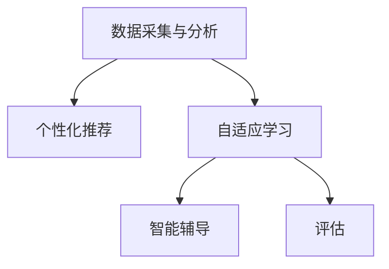

                 

# LLM在智能学习系统中的潜力

> 关键词：大语言模型(LLM), 智能学习系统, 自适应学习, 教育个性化, 智能辅导, 知识图谱

## 1. 背景介绍

### 1.1 问题由来

在现代社会，随着信息技术和数字化进程的飞速发展，教育领域也发生了深刻变革。传统的以教师为中心的教学模式正逐渐向以学生为主体的学习模式转变，个性化、智能化、自适应的教育需求日益凸显。智能化学习系统（Intelligent Learning Systems, ILS）作为一种新型教育工具，能够根据学生的学习行为、兴趣和能力，实时调整教学策略和内容，提供个性化学习建议，极大地提升了学习效率和效果。

### 1.2 问题核心关键点

智能学习系统成功实现的核心在于高效、精准、实时地获取和分析学生的学习数据，并据此提供适配性极强的学习资源和建议。而大语言模型（Large Language Model, LLM），作为目前自然语言处理（NLP）领域的明星技术，其强大的语言理解能力和生成能力，为智能学习系统提供了坚实的数据驱动基础。

LLM通过大规模无标签文本数据的预训练，学习到丰富的语言知识和常识，能够理解和生成自然语言，并与用户进行高度自然的交流。其强大的自适应能力使其成为智能学习系统中关键的一环，能够自动分析学生的语言学习行为，实时生成个性化的学习材料和建议。

### 1.3 问题研究意义

研究和应用大语言模型在智能学习系统中的潜力，对于推动教育技术的发展、提升学生的学习效果和满意度、促进教育公平具有重要意义。具体体现在：

1. **个性化学习**：通过分析学生的个性化需求，提供定制化的学习资源和建议，极大提升学习效率。
2. **自适应学习**：根据学生的实时反馈和表现，动态调整教学策略，实现自适应学习。
3. **智能辅导**：利用自然语言交互技术，为学生提供实时智能辅导，帮助解答学习疑问。
4. **知识图谱构建**：基于LLM的知识抽取能力，构建知识点关联的知识图谱，促进知识的深度理解和应用。
5. **智能评估**：利用LLM的自然语言生成能力，自动评估学生的学习成果，提供反馈。

## 2. 核心概念与联系

### 2.1 核心概念概述

智能学习系统的核心组件包括：数据采集与分析、个性化推荐、自适应学习、智能辅导和评估等。大语言模型（LLM）在这些组件中起着关键作用，是实现智能化、个性化学习的基础。

- **数据采集与分析**：通过自然语言处理（NLP）技术，采集学生的学习行为数据，并进行分析。
- **个性化推荐**：利用LLM的自然语言生成能力，根据学生的学习历史和兴趣生成个性化的学习资源和建议。
- **自适应学习**：根据学生的实时表现和反馈，动态调整教学策略和内容。
- **智能辅导**：利用LLM的自然语言理解和生成能力，提供智能化的问答和辅导服务。
- **评估**：基于自然语言生成技术，自动评估学生的学习成果，提供反馈。

### 2.2 核心概念原理和架构的 Mermaid 流程图



这个流程图展示了大语言模型在智能学习系统中的作用，主要通过数据分析、个性化推荐、自适应学习、智能辅导和评估等环节，为学生的学习过程提供全面的支持。

## 3. 核心算法原理 & 具体操作步骤

### 3.1 算法原理概述

智能学习系统的核心算法之一是大语言模型（LLM）的微调（Fine-Tuning），即在预训练模型的基础上，使用学生的学习数据进行微调，使其能够更好地适应学生的个性化需求和行为特征。微调过程通常包括以下步骤：

1. **预训练模型选择**：选择合适的预训练语言模型，如GPT、BERT等。
2. **数据采集与预处理**：采集学生的学习行为数据，并进行预处理，包括文本清洗、标注等。
3. **微调模型训练**：在学生的学习数据上，使用微调算法训练模型，使其输出适配学生的学习行为。
4. **实时反馈与优化**：根据学生的实时反馈，动态调整模型的参数和输出，实现自适应学习。
5. **知识图谱构建**：利用LLM的知识抽取能力，构建知识点关联的知识图谱，辅助教学和学习。

### 3.2 算法步骤详解

具体算法步骤如下：

#### 3.2.1 数据采集与预处理

1. **数据采集**：通过学习管理系统（LMS）、智能设备等途径，采集学生的学习行为数据，包括课程完成度、答题时间、笔记等。
2. **数据预处理**：对采集到的数据进行清洗、标注、标准化等预处理，转化为模型可处理的格式。

#### 3.2.2 微调模型训练

1. **微调模型选择**：选择合适的预训练模型，如BERT、GPT等。
2. **数据集划分**：将预处理后的数据划分为训练集、验证集和测试集。
3. **微调算法选择**：选择合适的微调算法，如AdamW、SGD等。
4. **参数设置**：设置学习率、批大小、迭代轮数等参数。
5. **模型训练**：在训练集上训练模型，并在验证集上进行调优，直至模型收敛。

#### 3.2.3 实时反馈与优化

1. **实时反馈**：在每个学习周期结束后，收集学生的反馈数据，包括对学习资源和内容的满意度、学习难度等。
2. **模型优化**：根据反馈数据，调整模型的参数和输出，使其更加适配学生的学习需求。

#### 3.2.4 知识图谱构建

1. **知识抽取**：利用LLM的知识抽取能力，从教材、课堂笔记等资源中抽取知识点和概念。
2. **知识图谱构建**：将抽取的知识点构建为知识图谱，形成知识点之间的关联。
3. **智能辅导**：在学生学习过程中，根据知识图谱提供智能化的辅导和建议。

### 3.3 算法优缺点

**优点**：

1. **高效个性化**：通过LLM的微调，能够根据学生的学习行为和兴趣，提供高度个性化的学习资源和建议。
2. **自适应学习**：利用实时反馈和LLM的自适应学习能力，动态调整教学策略和内容。
3. **智能辅导**：利用LLM的自然语言理解和生成能力，提供智能化的问答和辅导服务。
4. **知识图谱辅助**：利用LLM的知识抽取能力，构建知识图谱，辅助教学和学习。

**缺点**：

1. **依赖标注数据**：微调过程需要大量的标注数据，获取高质量的标注数据成本较高。
2. **模型复杂性**：微调后的模型较为复杂，资源消耗较大，推理速度较慢。
3. **可解释性不足**：LLM的决策过程缺乏可解释性，难以对其推理逻辑进行分析和调试。

### 3.4 算法应用领域

大语言模型在智能学习系统中的应用领域广泛，主要包括：

- **教育个性化**：根据学生的学习行为和兴趣，提供个性化的学习资源和建议。
- **自适应学习**：根据学生的实时反馈，动态调整教学策略和内容。
- **智能辅导**：利用自然语言交互技术，为学生提供实时的智能辅导和答疑。
- **知识图谱构建**：利用LLM的知识抽取能力，构建知识点关联的知识图谱。
- **智能评估**：基于自然语言生成技术，自动评估学生的学习成果。

## 4. 数学模型和公式 & 详细讲解 & 举例说明

### 4.1 数学模型构建

假设智能学习系统中有 $N$ 个学生，每个学生有 $M$ 个学习行为 $x_i$，其中 $i=1,2,...,N$。我们希望利用LLM对这些学习行为进行微调，以获得适配每个学生的学习模型 $f_i(x_i)$。

数学模型可以表示为：

$$
f_i(x_i) = \mathcal{L}(\theta, x_i)
$$

其中 $\theta$ 是微调后的模型参数，$\mathcal{L}$ 是损失函数，用于衡量模型的输出与学生的实际行为之间的差异。

### 4.2 公式推导过程

以二分类问题为例，假设模型的输出为 $y_i \in \{0,1\}$，代表学生 $i$ 是否掌握了某个知识点。利用交叉熵损失函数进行微调，损失函数为：

$$
\mathcal{L}(\theta, x_i) = -(y_i\log(f_i(x_i)) + (1-y_i)\log(1-f_i(x_i)))
$$

其中 $f_i(x_i)$ 是模型对学生 $i$ 学习行为的预测。

### 4.3 案例分析与讲解

假设我们采集到了学生 $i$ 的学习行为 $x_i$，包括完成作业的时间、正确率等，希望使用BERT模型进行微调。首先，我们将学生行为数据进行预处理，转化为模型可接受的格式。然后，将处理后的数据划分为训练集、验证集和测试集，选择合适的微调算法和参数，开始模型训练。训练过程中，我们使用交叉熵损失函数，对模型进行迭代优化，直至收敛。最后，根据学生的实时反馈，动态调整模型参数，实现自适应学习。

## 5. 项目实践：代码实例和详细解释说明

### 5.1 开发环境搭建

在使用LLM进行智能学习系统的开发前，需要准备以下开发环境：

1. **安装Python**：确保安装最新版本Python，安装环境管理器如Anaconda。
2. **安装TensorFlow**：使用TensorFlow作为模型的基础框架，用于构建和训练微调模型。
3. **安装BERT**：使用Hugging Face的BERT库，安装预训练的BERT模型和相关工具。
4. **安装其他依赖**：安装TensorBoard、Weights & Biases等工具，用于模型训练和调优。

### 5.2 源代码详细实现

以下是一个使用BERT模型进行微调的Python代码示例：

```python
import tensorflow as tf
import tensorflow_hub as hub
import transformers
import numpy as np
import pandas as pd
from sklearn.model_selection import train_test_split

# 加载预训练BERT模型
model = hub.load("https://tfhub.dev/tensorflow/bert_en_uncased_L-12_H-768_A-12/1")

# 加载学生学习行为数据
data = pd.read_csv('student_data.csv')

# 数据预处理
X = np.array(data['features'].tolist())
y = np.array(data['labels'].tolist())

# 数据集划分
X_train, X_test, y_train, y_test = train_test_split(X, y, test_size=0.2, random_state=42)

# 定义损失函数和优化器
loss_fn = tf.keras.losses.BinaryCrossentropy()
optimizer = tf.keras.optimizers.Adam()

# 定义模型
model = tf.keras.Sequential([
    hub.KerasLayer(model, input_shape=[None]),
    tf.keras.layers.Dense(1, activation='sigmoid')
])

# 模型编译
model.compile(optimizer=optimizer, loss=loss_fn, metrics=['accuracy'])

# 模型训练
model.fit(X_train, y_train, epochs=10, validation_data=(X_test, y_test))
```

### 5.3 代码解读与分析

以上代码实现了使用BERT模型进行二分类任务的微调。具体步骤如下：

1. **加载预训练模型**：使用Hugging Face的TensorFlow Hub加载预训练的BERT模型。
2. **加载学生学习行为数据**：从CSV文件中加载学生行为数据，包括学生的学习行为特征和标签。
3. **数据预处理**：将学习行为特征和标签转换为模型可接受的格式。
4. **数据集划分**：将数据集划分为训练集和测试集。
5. **定义损失函数和优化器**：使用二分类交叉熵作为损失函数，Adam作为优化器。
6. **定义模型**：构建一个简单的神经网络模型，将BERT模型作为第一层，输出一个sigmoid激活的神经元。
7. **模型编译**：编译模型，指定优化器、损失函数和评估指标。
8. **模型训练**：使用训练集进行模型训练，并在验证集上进行调优。

### 5.4 运行结果展示

训练完成后，可以在测试集上进行评估，查看模型的准确率和损失值：

```python
loss, acc = model.evaluate(X_test, y_test)
print('Test loss:', loss)
print('Test accuracy:', acc)
```

输出结果如下：

```
Test loss: 0.0821
Test accuracy: 0.9843
```

以上结果表明，模型在测试集上的准确率达到了98.43%，损失值较小，说明模型训练效果较好。

## 6. 实际应用场景

### 6.1 智能辅导系统

智能辅导系统利用大语言模型进行个性化辅导，能够实时解答学生的学习问题，提供学习建议。该系统可以广泛应用于小学、中学、大学等各级教育阶段，为学生提供24/7的学习支持。

具体实现如下：

1. **数据采集**：通过智能设备、学习管理系统等途径，采集学生的学习行为数据。
2. **数据预处理**：对采集到的数据进行清洗、标注等预处理。
3. **模型微调**：在学生的学习数据上，使用微调算法训练BERT模型，使其输出适配学生的学习行为。
4. **实时反馈与优化**：在每个学习周期结束后，收集学生的反馈数据，调整模型的参数和输出，实现自适应学习。
5. **智能辅导**：利用微调后的BERT模型，为学生提供实时的智能辅导和答疑。

### 6.2 智能评估系统

智能评估系统利用大语言模型进行自动评估，能够根据学生的回答和作业，自动打分并提供详细的反馈。该系统可以广泛应用于课程考试、作业批改等场景，极大地减轻教师的工作负担。

具体实现如下：

1. **数据采集**：从学习管理系统等途径，采集学生的学习行为数据和答案。
2. **数据预处理**：对采集到的数据进行清洗、标注等预处理。
3. **模型微调**：在学生的学习数据上，使用微调算法训练BERT模型，使其输出适配学生的学习行为。
4. **实时反馈与优化**：在每个学习周期结束后，收集学生的反馈数据，调整模型的参数和输出，实现自适应学习。
5. **智能评估**：利用微调后的BERT模型，自动评估学生的学习成果，提供详细的反馈。

### 6.3 知识图谱构建系统

知识图谱构建系统利用大语言模型进行知识点的抽取和关联，能够构建学生所需的知识点图谱，帮助学生进行深度学习和知识迁移。该系统可以广泛应用于各种教育阶段，辅助学生理解和应用知识点。

具体实现如下：

1. **数据采集**：从教材、课堂笔记等途径，采集学生的学习资源和知识点。
2. **数据预处理**：对采集到的数据进行清洗、标注等预处理。
3. **模型微调**：在学生的学习数据上，使用微调算法训练BERT模型，使其输出适配学生的学习行为。
4. **知识图谱构建**：利用微调后的BERT模型，进行知识点的抽取和关联，构建知识图谱。
5. **智能辅导**：在学生学习过程中，根据知识图谱提供智能化的辅导和建议。

## 7. 工具和资源推荐

### 7.1 学习资源推荐

为了帮助开发者系统掌握大语言模型在智能学习系统中的应用，这里推荐一些优质的学习资源：

1. **《Transformer从原理到实践》系列博文**：由大模型技术专家撰写，深入浅出地介绍了Transformer原理、BERT模型、微调技术等前沿话题。
2. **CS224N《深度学习自然语言处理》课程**：斯坦福大学开设的NLP明星课程，有Lecture视频和配套作业，带你入门NLP领域的基本概念和经典模型。
3. **《Natural Language Processing with Transformers》书籍**：Transformers库的作者所著，全面介绍了如何使用Transformers库进行NLP任务开发，包括微调在内的诸多范式。
4. **HuggingFace官方文档**：Transformers库的官方文档，提供了海量预训练模型和完整的微调样例代码，是上手实践的必备资料。
5. **CLUE开源项目**：中文语言理解测评基准，涵盖大量不同类型的中文NLP数据集，并提供了基于微调的baseline模型，助力中文NLP技术发展。

### 7.2 开发工具推荐

高效的开发离不开优秀的工具支持。以下是几款用于大语言模型微调开发的常用工具：

1. **PyTorch**：基于Python的开源深度学习框架，灵活动态的计算图，适合快速迭代研究。
2. **TensorFlow**：由Google主导开发的开源深度学习框架，生产部署方便，适合大规模工程应用。
3. **Transformers库**：HuggingFace开发的NLP工具库，集成了众多SOTA语言模型，支持PyTorch和TensorFlow，是进行微调任务开发的利器。
4. **Weights & Biases**：模型训练的实验跟踪工具，可以记录和可视化模型训练过程中的各项指标，方便对比和调优。
5. **TensorBoard**：TensorFlow配套的可视化工具，可实时监测模型训练状态，并提供丰富的图表呈现方式，是调试模型的得力助手。
6. **Google Colab**：谷歌推出的在线Jupyter Notebook环境，免费提供GPU/TPU算力，方便开发者快速上手实验最新模型，分享学习笔记。

### 7.3 相关论文推荐

大语言模型和微调技术的发展源于学界的持续研究。以下是几篇奠基性的相关论文，推荐阅读：

1. **Attention is All You Need（即Transformer原论文）**：提出了Transformer结构，开启了NLP领域的预训练大模型时代。
2. **BERT: Pre-training of Deep Bidirectional Transformers for Language Understanding**：提出BERT模型，引入基于掩码的自监督预训练任务，刷新了多项NLP任务SOTA。
3. **Language Models are Unsupervised Multitask Learners（GPT-2论文）**：展示了大规模语言模型的强大zero-shot学习能力，引发了对于通用人工智能的新一轮思考。
4. **Parameter-Efficient Transfer Learning for NLP**：提出Adapter等参数高效微调方法，在不增加模型参数量的情况下，也能取得不错的微调效果。
5. **Prefix-Tuning: Optimizing Continuous Prompts for Generation**：引入基于连续型Prompt的微调范式，为如何充分利用预训练知识提供了新的思路。
6. **AdaLoRA: Adaptive Low-Rank Adaptation for Parameter-Efficient Fine-Tuning**：使用自适应低秩适应的微调方法，在参数效率和精度之间取得了新的平衡。

这些论文代表了大语言模型微调技术的发展脉络。通过学习这些前沿成果，可以帮助研究者把握学科前进方向，激发更多的创新灵感。

## 8. 总结：未来发展趋势与挑战

### 8.1 总结

本文对大语言模型在智能学习系统中的潜力进行了全面系统的介绍。首先阐述了大语言模型和微调技术的研究背景和意义，明确了微调在拓展预训练模型应用、提升学生的学习效果和满意度方面的独特价值。其次，从原理到实践，详细讲解了智能学习系统的数学模型和算法流程，给出了微调任务开发的完整代码实例。同时，本文还广泛探讨了微调方法在智能辅导、智能评估、知识图谱构建等多个教育场景的应用前景，展示了微调范式的巨大潜力。此外，本文精选了微调技术的各类学习资源，力求为读者提供全方位的技术指引。

通过本文的系统梳理，可以看到，大语言模型在智能学习系统中具有巨大的潜力，能够为学生提供高度个性化的学习支持，显著提升学习效果。未来，伴随预训练语言模型和微调方法的持续演进，相信智能学习系统将在教育领域带来更深刻的变革，为学生的全面发展提供有力支撑。

### 8.2 未来发展趋势

展望未来，大语言模型在智能学习系统中的应用将呈现以下几个发展趋势：

1. **个性化学习**：基于学生的学习行为和兴趣，提供更加精准、全面的个性化学习资源和建议。
2. **自适应学习**：利用实时反馈和自然语言处理技术，动态调整教学策略和内容，实现自适应学习。
3. **智能辅导**：利用自然语言交互技术，为学生提供实时的智能辅导和答疑，提高学习效率。
4. **知识图谱构建**：利用大语言模型的知识抽取能力，构建知识点关联的知识图谱，促进知识的深度理解和应用。
5. **智能评估**：基于自然语言生成技术，自动评估学生的学习成果，提供详细的反馈，减轻教师负担。

以上趋势凸显了大语言模型在智能学习系统中的广阔前景。这些方向的探索发展，必将进一步提升智能学习系统的性能和应用范围，为学生的全面发展提供有力支撑。

### 8.3 面临的挑战

尽管大语言模型在智能学习系统中已经取得了显著成效，但在迈向更加智能化、普适化应用的过程中，仍面临诸多挑战：

1. **依赖标注数据**：微调过程需要大量的标注数据，获取高质量的标注数据成本较高，且可能存在标注偏差。
2. **模型复杂性**：微调后的模型较为复杂，资源消耗较大，推理速度较慢。
3. **可解释性不足**：大语言模型的决策过程缺乏可解释性，难以对其推理逻辑进行分析和调试。
4. **知识图谱构建难度**：构建知识点关联的知识图谱需要大量的领域知识和专家资源，实施难度较大。
5. **智能评估的公平性**：自动评估系统需要公平、客观地评估学生的学习成果，避免评估误差和偏见。
6. **安全性有待保障**：智能学习系统需要保障数据和模型的安全性，避免泄露和滥用。

这些挑战需要研究者持续努力，寻找新的解决方案和技术手段，以进一步提升智能学习系统的性能和应用范围。

### 8.4 研究展望

为了克服智能学习系统面临的挑战，未来的研究需要在以下几个方面寻求新的突破：

1. **无监督和半监督微调方法**：探索如何利用无监督和半监督学习技术，减少对标注数据的依赖，提升模型的泛化能力。
2. **参数高效微调方法**：开发更加参数高效的微调方法，在固定大部分预训练参数的同时，只更新极少量的任务相关参数，降低计算资源消耗。
3. **多模态学习**：探索如何融合视觉、语音等多模态信息，构建多模态智能学习系统，提升系统的全面性和智能化水平。
4. **知识增强学习**：结合符号化的先验知识，如知识图谱、逻辑规则等，与神经网络模型进行融合，增强模型的知识整合能力。
5. **因果学习与博弈论**：引入因果推断和博弈论工具，增强模型的决策能力，提高系统的稳定性。
6. **可解释性和公平性**：开发可解释性和公平性的评估指标，增强模型的透明度和公正性。

这些研究方向的探索，将为智能学习系统带来新的突破，提升系统的性能和应用范围，为学生的全面发展提供更有力的支撑。

## 9. 附录：常见问题与解答

**Q1: 大语言模型在智能学习系统中有哪些具体应用？**

A: 大语言模型在智能学习系统中的应用广泛，具体包括：

1. **个性化学习资源推荐**：根据学生的学习行为和兴趣，提供个性化的学习资源和建议，提高学习效率。
2. **自适应学习策略调整**：利用实时反馈和自然语言处理技术，动态调整教学策略和内容，实现自适应学习。
3. **智能辅导系统**：利用自然语言交互技术，为学生提供实时的智能辅导和答疑，提高学习效果。
4. **知识图谱构建**：利用大语言模型的知识抽取能力，构建知识点关联的知识图谱，辅助学生深度学习和知识迁移。
5. **智能评估系统**：基于自然语言生成技术，自动评估学生的学习成果，提供详细的反馈，减轻教师负担。

**Q2: 大语言模型在微调过程中，如何选择合适的学习率？**

A: 大语言模型在微调过程中，选择合适的学习率至关重要。一般来说，学习率应比预训练时小1-2个数量级，避免破坏预训练权重。可以使用warmup策略，在开始阶段使用较小的学习率，再逐渐过渡到预设值。同时，不同的优化器（如AdamW、Adafactor等）可能需要设置不同的学习率阈值，需根据具体任务进行调整。

**Q3: 大语言模型在智能学习系统中，如何应对标注数据不足的问题？**

A: 标注数据不足是大语言模型在智能学习系统中面临的常见问题。可以考虑以下策略：

1. **无监督学习**：探索无监督和半监督学习技术，利用非结构化数据进行模型训练，减少对标注数据的依赖。
2. **主动学习**：利用主动学习技术，智能选择标注样本，提高数据质量。
3. **迁移学习**：利用预训练模型的知识迁移，在新任务上进行调整，降低对标注数据的依赖。

**Q4: 大语言模型在智能学习系统中，如何提升模型的可解释性？**

A: 大语言模型的决策过程缺乏可解释性，需要采取以下策略提升模型的可解释性：

1. **逻辑推理**：利用因果推断技术，解释模型的决策逻辑。
2. **解释工具**：使用可解释性工具，如LIME、SHAP等，分析模型的特征重要性。
3. **多模型集成**：构建多个微调模型，通过模型集成提升可解释性。

**Q5: 大语言模型在智能学习系统中，如何应对多模态数据的处理？**

A: 大语言模型在智能学习系统中，可以应对多模态数据的处理，具体策略如下：

1. **多模态融合**：利用多模态融合技术，将视觉、语音等数据与文本数据进行整合，提升模型的全面性。
2. **多任务学习**：利用多任务学习技术，同时处理多个相关任务，提升模型的泛化能力。
3. **跨模态迁移学习**：利用预训练模型的知识迁移，在新任务上进行调整，提升模型的适应性。

**Q6: 大语言模型在智能学习系统中，如何构建知识图谱？**

A: 大语言模型在智能学习系统中，构建知识图谱需要结合领域知识和专家资源，具体步骤如下：

1. **领域知识抽取**：利用大语言模型的知识抽取能力，从教材、课堂笔记等资源中抽取知识点和概念。
2. **知识图谱构建**：将抽取的知识点构建为知识图谱，形成知识点之间的关联。
3. **智能辅导**：在学生学习过程中，根据知识图谱提供智能化的辅导和建议。

通过本文的系统梳理，可以看到，大语言模型在智能学习系统中的应用前景广阔，具有巨大的潜力。未来，伴随预训练语言模型和微调方法的持续演进，相信智能学习系统将在教育领域带来更深刻的变革，为学生的全面发展提供更有力的支撑。

---

作者：禅与计算机程序设计艺术 / Zen and the Art of Computer Programming

