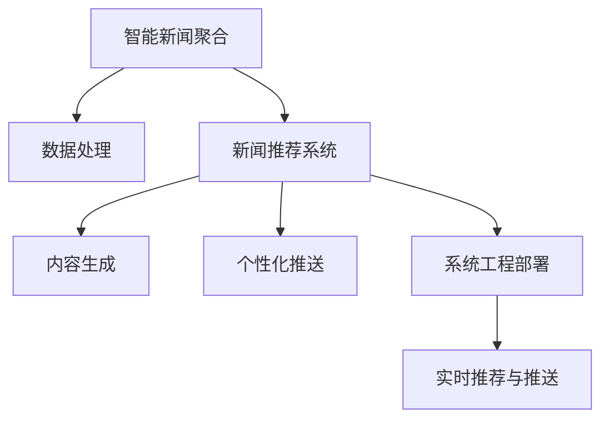

                 

# LLM在智能新闻聚合与推送中的应用前景

> 关键词：大规模语言模型(LLM),智能新闻聚合,新闻推荐系统,内容生成,个性化推送

## 1. 背景介绍

### 1.1 问题由来

在信息爆炸的时代，用户面对着海量的新闻信息，如何高效地获取感兴趣的内容，成为一件颇具挑战性的任务。传统的搜索引擎、新闻聚合网站已经无法满足用户对个性化、精准化的新闻推荐需求。智能新闻聚合与推送技术，通过利用大规模语言模型(LLM)等先进技术手段，分析用户兴趣，自动生成推荐内容，为用户量身定制个性化阅读体验，有效提升新闻消费效率和满意度。

近年来，LLM技术在NLP领域取得了飞速发展，特别是以GPT、BERT为代表的大模型，通过在海量数据上的自监督预训练，具备了强大的文本理解与生成能力。这些技术优势为智能新闻聚合与推送系统的开发提供了强有力的技术支撑，使得构建精准、高效的推荐系统成为可能。

### 1.2 问题核心关键点

智能新闻聚合与推送系统，利用LLM模型进行新闻推荐、内容生成、热点分析等核心功能，其中关键点包括：

- 数据准备与预处理：收集新闻数据，清洗文本，构建训练集。
- 模型选择与微调：选择合适的预训练模型，进行个性化微调。
- 推荐算法设计：设计推荐算法，确保推荐内容的相关性、多样性和时效性。
- 个性化推送：利用用户行为数据，实现个性化新闻推送。
- 系统工程部署：构建可扩展、高可用的推荐系统，进行实时运营。

以下我们将对LLM在智能新闻聚合与推送中的应用前景进行深入探讨。

## 2. 核心概念与联系

### 2.1 核心概念概述

为更好地理解LLM在智能新闻聚合与推送中的应用，本节将介绍几个关键概念：

- 大规模语言模型(LLM)：以自回归或自编码模型为代表的大规模预训练语言模型。通过在海量数据上预训练，LLM模型具备强大的文本理解与生成能力。

- 智能新闻聚合：通过算法自动抓取、筛选、汇总新闻内容，生成个性化的新闻摘要。

- 新闻推荐系统：利用用户行为数据和LLM技术，推荐相关的新闻内容，提升用户阅读体验。

- 内容生成：LLM模型可以通过条件生成任务，自动生成高质量的新闻报道、评论等文本。

- 个性化推送：根据用户历史行为和当前兴趣，推送定制化的新闻内容。

- 系统工程部署：将LLM模型部署到生产环境，实现高效的实时推荐与推送。

这些概念之间的逻辑关系可以通过以下Mermaid流程图来展示：



这个流程图展示了大语言模型在智能新闻聚合与推送中的应用框架：

1. 智能新闻聚合通过数据处理对原始新闻文本进行分析，自动生成摘要。
2. 新闻推荐系统利用用户行为数据和LLM模型，推荐相关新闻。
3. 内容生成使用LLM模型自动生成高质量文本内容。
4. 个性化推送根据用户历史行为，推送定制化新闻。
5. 系统工程部署将模型部署到生产环境，进行实时推荐和推送。

## 3. 核心算法原理 & 具体操作步骤
### 3.1 算法原理概述

基于LLM的智能新闻聚合与推送系统，核心思想是利用预训练模型对海量新闻数据进行理解与生成，通过算法优化，为用户推荐个性化的新闻内容。具体算法流程如下：

1. 数据预处理：将新闻数据清洗、标注，构建训练集和测试集。
2. 模型选择：选择合适的预训练模型（如GPT、BERT等）进行微调。
3. 特征提取：提取新闻文本的关键特征，包括标题、摘要、来源等。
4. 推荐算法设计：设计推荐算法，综合考虑新闻的相关性、多样性和时效性。
5. 个性化推送：根据用户行为数据，推送个性化新闻。

### 3.2 算法步骤详解

#### 3.2.1 数据预处理

数据预处理是智能新闻聚合与推送系统的第一步。具体步骤如下：

1. 数据采集：收集新闻网站、API等渠道的新闻数据，确保数据来源多样、质量可靠。

2. 数据清洗：去除无意义、重复、错误的新闻内容，确保数据质量。

3. 数据标注：对新闻数据进行人工标注，如分类、情感标注等，为模型训练提供监督信号。

4. 数据划分：将新闻数据划分为训练集、验证集和测试集，一般按时间先后顺序划分。

5. 特征构建：提取新闻的标题、摘要、关键词、作者等特征，用于后续的模型训练和推荐算法设计。

#### 3.2.2 模型选择与微调

选择合适的预训练模型并进行微调，是智能新闻聚合与推送系统的关键步骤。具体步骤如下：

1. 预训练模型选择：根据任务需求选择合适的预训练模型，如BERT、GPT等。

2. 微调超参数设置：设置微调的学习率、优化器、批大小等超参数。

3. 微调训练：使用训练集对模型进行有监督的微调，更新模型参数。

4. 模型评估：在验证集上评估模型性能，确保模型在测试集上也能保持良好表现。

5. 模型保存：保存微调后的模型，用于后续的推荐算法设计和个性化推送。

#### 3.2.3 特征提取

特征提取是智能新闻聚合与推送系统的重要步骤。具体步骤如下：

1. 文本表示：使用预训练模型将新闻文本转换为向量表示，用于后续的特征计算。

2. 特征选择：选择与新闻内容相关的关键特征，如标题、摘要、关键词、作者等。

3. 特征编码：将特征转换为向量表示，便于模型处理和计算。

4. 特征融合：将多个特征进行融合，形成最终的特征向量，用于推荐算法设计。

#### 3.2.4 推荐算法设计

推荐算法设计是智能新闻聚合与推送系统的核心。具体步骤如下：

1. 相似度计算：计算新闻向量之间的相似度，推荐与用户历史兴趣相似的新闻。

2. 多样性控制：引入多样性惩罚，确保推荐内容的多样性，避免信息茧房。

3. 实时性调整：考虑新闻的时效性，优先推荐最新发布的新闻内容。

4. 交互反馈：收集用户的反馈数据，不断调整推荐算法，提升推荐效果。

#### 3.2.5 个性化推送

个性化推送是智能新闻聚合与推送系统的最终目标。具体步骤如下：

1. 用户画像构建：根据用户历史行为数据，构建用户画像，了解用户兴趣。

2. 个性化推荐：利用用户画像，推送定制化新闻内容，提升用户满意度。

3. 推荐排序：使用推荐算法对推荐内容进行排序，确保优先推荐高质量内容。

4. 反馈处理：收集用户的反馈数据，不断调整推荐策略，提升个性化推送效果。

### 3.3 算法优缺点

基于LLM的智能新闻聚合与推送系统，具有以下优点：

1. 精准推荐：利用预训练模型和推荐算法，能够为用户推荐高度相关的新闻内容。

2. 个性化推送：根据用户兴趣和行为数据，实现定制化的新闻推送，提升用户体验。

3. 高效自动化：通过自动化处理和智能推荐，大幅提升新闻聚合与推送的效率。

4. 用户互动：能够动态收集用户反馈，不断优化推荐系统，提升推荐效果。

同时，该方法也存在一些缺点：

1. 数据依赖：微调效果依赖于新闻数据的质量和数量，数据获取和处理成本较高。

2. 模型泛化：预训练模型在特定领域泛化能力有限，需要不断调整和优化。

3. 冷启动问题：新用户缺乏足够的行为数据，难以构建准确的推荐画像。

4. 隐私保护：需要收集用户行为数据，可能涉及隐私保护问题。

5. 计算资源：需要较强的计算资源支持，预训练和微调过程消耗资源较多。

尽管存在这些缺点，但就目前而言，基于LLM的智能新闻聚合与推送系统仍是大规模推荐系统的主流范式。未来相关研究的重点在于如何进一步降低数据依赖，提高模型的泛化能力，同时兼顾隐私保护和计算资源优化。

### 3.4 算法应用领域

基于LLM的智能新闻聚合与推送技术，已经在新闻、社交、电商等多个领域得到了广泛应用，取得了显著的效果：

- 新闻推荐：利用预训练模型和推荐算法，为用户推荐相关的新闻内容，提升阅读体验。

- 内容生成：通过LLM模型自动生成新闻报道、评论等文本，节省人力成本。

- 热点分析：利用预训练模型分析新闻数据，发现热点话题，辅助内容创作。

- 个性化推送：根据用户行为数据，推送定制化的新闻内容，提升用户满意度。

- 广告推荐：结合广告数据和用户行为数据，推荐相关广告内容，提高广告转化率。

## 4. 数学模型和公式 & 详细讲解 & 举例说明

### 4.1 数学模型构建

本节将使用数学语言对基于LLM的智能新闻聚合与推送过程进行更加严格的刻画。

记预训练模型为 $M_{\theta}:\mathcal{X} \rightarrow \mathcal{Y}$，其中 $\mathcal{X}$ 为新闻文本空间，$\mathcal{Y}$ 为新闻向量空间，$\theta$ 为模型参数。假设微调任务的训练集为 $D=\{(x_i,y_i)\}_{i=1}^N, x_i \in \mathcal{X}, y_i \in \mathcal{Y}$。

定义模型 $M_{\theta}$ 在输入 $x$ 上的输出为 $z=M_{\theta}(x)$，则微调的目标是最小化经验风险，即找到最优参数：

$$
\theta^* = \mathop{\arg\min}_{\theta} \mathcal{L}(\theta)
$$

其中 $\mathcal{L}$ 为针对任务设计的损失函数，用于衡量模型预测输出与真实标签之间的差异。常见的损失函数包括交叉熵损失、均方误差损失等。

### 4.2 公式推导过程

以下我们以新闻推荐系统为例，推导交叉熵损失函数及其梯度的计算公式。

假设模型 $M_{\theta}$ 在输入 $x$ 上的输出为 $\hat{y}=M_{\theta}(x) \in [0,1]$，表示新闻与用户兴趣的匹配程度。真实标签 $y \in \{0,1\}$。则二分类交叉熵损失函数定义为：

$$
\ell(M_{\theta}(x),y) = -[y\log \hat{y} + (1-y)\log (1-\hat{y})]
$$

将其代入经验风险公式，得：

$$
\mathcal{L}(\theta) = -\frac{1}{N}\sum_{i=1}^N [y_i\log M_{\theta}(x_i)+(1-y_i)\log(1-M_{\theta}(x_i))]
$$

根据链式法则，损失函数对参数 $\theta_k$ 的梯度为：

$$
\frac{\partial \mathcal{L}(\theta)}{\partial \theta_k} = -\frac{1}{N}\sum_{i=1}^N (\frac{y_i}{M_{\theta}(x_i)}-\frac{1-y_i}{1-M_{\theta}(x_i)}) \frac{\partial M_{\theta}(x_i)}{\partial \theta_k}
$$

其中 $\frac{\partial M_{\theta}(x_i)}{\partial \theta_k}$ 可进一步递归展开，利用自动微分技术完成计算。

在得到损失函数的梯度后，即可带入参数更新公式，完成模型的迭代优化。重复上述过程直至收敛，最终得到适应下游任务的最优模型参数 $\theta^*$。

### 4.3 案例分析与讲解

考虑一个简单的新闻推荐系统，用户浏览过新闻 $a$，系统需要推荐与 $a$ 相关的新闻 $b$。

设新闻 $a$ 的向量表示为 $z_a$，用户兴趣的向量表示为 $z_u$，模型预测 $b$ 与用户兴趣匹配度的向量表示为 $z_b$。

根据二分类交叉熵损失函数，推荐系统的目标是最小化损失：

$$
\mathcal{L} = \frac{1}{N}\sum_{i=1}^N [-(y_i\log \hat{y}_i + (1-y_i)\log(1-\hat{y}_i)]
$$

其中 $y_i$ 为标签，$\hat{y}_i$ 为模型预测，$i$ 为用户历史浏览新闻。

在模型训练阶段，通过反向传播计算梯度，更新模型参数 $\theta$。在推荐阶段，使用微调后的模型 $M_{\theta}$ 预测用户兴趣与新闻 $b$ 的匹配度 $z_b$，选择 $z_b$ 大于某个阈值的 $b$ 作为推荐结果。

## 5. 项目实践：代码实例和详细解释说明
### 5.1 开发环境搭建

在进行LLM微调实践前，我们需要准备好开发环境。以下是使用Python进行PyTorch开发的环境配置流程：

1. 安装Anaconda：从官网下载并安装Anaconda，用于创建独立的Python环境。

2. 创建并激活虚拟环境：
```bash
conda create -n pytorch-env python=3.8 
conda activate pytorch-env
```

3. 安装PyTorch：根据CUDA版本，从官网获取对应的安装命令。例如：
```bash
conda install pytorch torchvision torchaudio cudatoolkit=11.1 -c pytorch -c conda-forge
```

4. 安装Transformers库：
```bash
pip install transformers
```

5. 安装各类工具包：
```bash
pip install numpy pandas scikit-learn matplotlib tqdm jupyter notebook ipython
```

完成上述步骤后，即可在`pytorch-env`环境中开始微调实践。

### 5.2 源代码详细实现

下面我们以新闻推荐系统为例，给出使用Transformers库对BERT模型进行微调的PyTorch代码实现。

首先，定义推荐系统的训练函数：

```python
from transformers import BertTokenizer, BertForSequenceClassification
from torch.utils.data import Dataset
import torch

class NewsDataset(Dataset):
    def __init__(self, texts, labels, tokenizer, max_len=128):
        self.texts = texts
        self.labels = labels
        self.tokenizer = tokenizer
        self.max_len = max_len
        
    def __len__(self):
        return len(self.texts)
    
    def __getitem__(self, item):
        text = self.texts[item]
        label = self.labels[item]
        
        encoding = self.tokenizer(text, return_tensors='pt', max_length=self.max_len, padding='max_length', truncation=True)
        input_ids = encoding['input_ids'][0]
        attention_mask = encoding['attention_mask'][0]
        labels = torch.tensor(label, dtype=torch.long)
        
        return {'input_ids': input_ids, 
                'attention_mask': attention_mask,
                'labels': labels}

# 标签与id的映射
label2id = {'positive': 1, 'negative': 0}
id2label = {v: k for k, v in label2id.items()}

# 创建dataset
tokenizer = BertTokenizer.from_pretrained('bert-base-uncased')

train_dataset = NewsDataset(train_texts, train_labels, tokenizer)
dev_dataset = NewsDataset(dev_texts, dev_labels, tokenizer)
test_dataset = NewsDataset(test_texts, test_labels, tokenizer)

# 模型选择与微调
model = BertForSequenceClassification.from_pretrained('bert-base-uncased', num_labels=2)
optimizer = AdamW(model.parameters(), lr=2e-5)
```

然后，定义训练和评估函数：

```python
from torch.utils.data import DataLoader
from tqdm import tqdm
from sklearn.metrics import classification_report

device = torch.device('cuda') if torch.cuda.is_available() else torch.device('cpu')
model.to(device)

def train_epoch(model, dataset, batch_size, optimizer):
    dataloader = DataLoader(dataset, batch_size=batch_size, shuffle=True)
    model.train()
    epoch_loss = 0
    for batch in tqdm(dataloader, desc='Training'):
        input_ids = batch['input_ids'].to(device)
        attention_mask = batch['attention_mask'].to(device)
        labels = batch['labels'].to(device)
        model.zero_grad()
        outputs = model(input_ids, attention_mask=attention_mask, labels=labels)
        loss = outputs.loss
        epoch_loss += loss.item()
        loss.backward()
        optimizer.step()
    return epoch_loss / len(dataloader)

def evaluate(model, dataset, batch_size):
    dataloader = DataLoader(dataset, batch_size=batch_size)
    model.eval()
    preds, labels = [], []
    with torch.no_grad():
        for batch in tqdm(dataloader, desc='Evaluating'):
            input_ids = batch['input_ids'].to(device)
            attention_mask = batch['attention_mask'].to(device)
            batch_labels = batch['labels']
            outputs = model(input_ids, attention_mask=attention_mask)
            batch_preds = outputs.logits.argmax(dim=2).to('cpu').tolist()
            batch_labels = batch_labels.to('cpu').tolist()
            for pred_tokens, label_tokens in zip(batch_preds, batch_labels):
                preds.append(pred_tokens[:len(label_tokens)])
                labels.append(label_tokens)
                
    print(classification_report(labels, preds))
```

最后，启动训练流程并在测试集上评估：

```python
epochs = 5
batch_size = 16

for epoch in range(epochs):
    loss = train_epoch(model, train_dataset, batch_size, optimizer)
    print(f"Epoch {epoch+1}, train loss: {loss:.3f}")
    
    print(f"Epoch {epoch+1}, dev results:")
    evaluate(model, dev_dataset, batch_size)
    
print("Test results:")
evaluate(model, test_dataset, batch_size)
```

以上就是使用PyTorch对BERT进行新闻推荐系统微调的完整代码实现。可以看到，得益于Transformers库的强大封装，我们可以用相对简洁的代码完成BERT模型的加载和微调。

### 5.3 代码解读与分析

让我们再详细解读一下关键代码的实现细节：

**NewsDataset类**：
- `__init__`方法：初始化文本、标签、分词器等关键组件。
- `__len__`方法：返回数据集的样本数量。
- `__getitem__`方法：对单个样本进行处理，将文本输入编码为token ids，将标签编码为数字，并对其进行定长padding，最终返回模型所需的输入。

**label2id和id2label字典**：
- 定义了标签与数字id之间的映射关系，用于将预测结果解码回真实的标签。

**训练和评估函数**：
- 使用PyTorch的DataLoader对数据集进行批次化加载，供模型训练和推理使用。
- 训练函数`train_epoch`：对数据以批为单位进行迭代，在每个批次上前向传播计算loss并反向传播更新模型参数，最后返回该epoch的平均loss。
- 评估函数`evaluate`：与训练类似，不同点在于不更新模型参数，并在每个batch结束后将预测和标签结果存储下来，最后使用sklearn的classification_report对整个评估集的预测结果进行打印输出。

**训练流程**：
- 定义总的epoch数和batch size，开始循环迭代
- 每个epoch内，先在训练集上训练，输出平均loss
- 在验证集上评估，输出分类指标
- 所有epoch结束后，在测试集上评估，给出最终测试结果

可以看到，PyTorch配合Transformers库使得BERT微调的代码实现变得简洁高效。开发者可以将更多精力放在数据处理、模型改进等高层逻辑上，而不必过多关注底层的实现细节。

当然，工业级的系统实现还需考虑更多因素，如模型的保存和部署、超参数的自动搜索、更灵活的任务适配层等。但核心的微调范式基本与此类似。

## 6. 实际应用场景
### 6.1 智能新闻聚合

智能新闻聚合利用LLM模型对海量新闻进行自动抓取、筛选和汇总，生成个性化的新闻摘要，提供精准、高效的新闻阅读体验。

具体而言，系统通过爬虫抓取各新闻网站的最新新闻，使用预训练模型对新闻文本进行理解，抽取关键信息，自动生成新闻摘要。同时，系统还可以根据用户的历史行为数据，推荐与用户兴趣相关的新闻，提高新闻阅读效率。

### 6.2 内容生成与个性化推送

内容生成利用LLM模型自动生成高质量的新闻报道、评论等文本内容，节省人工写作成本。个性化推送则根据用户行为数据，推送定制化的新闻内容，提升用户体验。

例如，用户经常阅读体育新闻，系统可以自动生成关于体育赛事的报道，推送给用户，同时还可根据用户点赞、评论等行为数据，推荐类似的新闻内容，丰富用户阅读体验。

### 6.3 热点分析与用户引导

热点分析利用预训练模型分析新闻数据，发现当前热门话题，帮助用户了解最新的社会动态和热点事件。同时，系统还可以根据用户兴趣和行为数据，推送相关热点话题，引导用户关注更多相关内容。

例如，系统检测到当前最热门的新闻是某政治事件，可以推送相关新闻和评论，引导用户深入了解事件背景和各方观点。

## 7. 工具和资源推荐
### 7.1 学习资源推荐

为了帮助开发者系统掌握LLM在智能新闻聚合与推送中的应用，这里推荐一些优质的学习资源：

1. 《自然语言处理入门与实践》系列博文：由大模型技术专家撰写，深入浅出地介绍了自然语言处理的基本概念和经典模型。

2. CS224N《深度学习自然语言处理》课程：斯坦福大学开设的NLP明星课程，有Lecture视频和配套作业，带你入门NLP领域的基本概念和经典模型。

3. 《Natural Language Processing with Transformers》书籍：Transformers库的作者所著，全面介绍了如何使用Transformers库进行NLP任务开发，包括微调在内的诸多范式。

4. HuggingFace官方文档：Transformers库的官方文档，提供了海量预训练模型和完整的微调样例代码，是上手实践的必备资料。

5. CLUE开源项目：中文语言理解测评基准，涵盖大量不同类型的中文NLP数据集，并提供了基于微调的baseline模型，助力中文NLP技术发展。

通过对这些资源的学习实践，相信你一定能够快速掌握LLM在智能新闻聚合与推送中的应用，并用于解决实际的NLP问题。
###  7.2 开发工具推荐

高效的开发离不开优秀的工具支持。以下是几款用于LLM微调开发的常用工具：

1. PyTorch：基于Python的开源深度学习框架，灵活动态的计算图，适合快速迭代研究。大部分预训练语言模型都有PyTorch版本的实现。

2. TensorFlow：由Google主导开发的开源深度学习框架，生产部署方便，适合大规模工程应用。同样有丰富的预训练语言模型资源。

3. Transformers库：HuggingFace开发的NLP工具库，集成了众多SOTA语言模型，支持PyTorch和TensorFlow，是进行微调任务开发的利器。

4. Weights & Biases：模型训练的实验跟踪工具，可以记录和可视化模型训练过程中的各项指标，方便对比和调优。与主流深度学习框架无缝集成。

5. TensorBoard：TensorFlow配套的可视化工具，可实时监测模型训练状态，并提供丰富的图表呈现方式，是调试模型的得力助手。

6. Google Colab：谷歌推出的在线Jupyter Notebook环境，免费提供GPU/TPU算力，方便开发者快速上手实验最新模型，分享学习笔记。

合理利用这些工具，可以显著提升LLM微调任务的开发效率，加快创新迭代的步伐。

### 7.3 相关论文推荐

LLM在智能新闻聚合与推送领域的研究近年来取得了长足进步，以下是几篇奠基性的相关论文，推荐阅读：

1. Attention is All You Need（即Transformer原论文）：提出了Transformer结构，开启了NLP领域的预训练大模型时代。

2. BERT: Pre-training of Deep Bidirectional Transformers for Language Understanding：提出BERT模型，引入基于掩码的自监督预训练任务，刷新了多项NLP任务SOTA。

3. Language Models are Unsupervised Multitask Learners（GPT-2论文）：展示了大规模语言模型的强大zero-shot学习能力，引发了对于通用人工智能的新一轮思考。

4. Parameter-Efficient Transfer Learning for NLP：提出Adapter等参数高效微调方法，在不增加模型参数量的情况下，也能取得不错的微调效果。

5. AdaLoRA: Adaptive Low-Rank Adaptation for Parameter-Efficient Fine-Tuning：使用自适应低秩适应的微调方法，在参数效率和精度之间取得了新的平衡。

6. How to Train Your BERT for Token Classification：介绍了如何使用BERT模型进行文本分类任务，提供了详细的训练流程和参数设置。

这些论文代表了大模型在智能新闻聚合与推送领域的发展脉络。通过学习这些前沿成果，可以帮助研究者把握学科前进方向，激发更多的创新灵感。

## 8. 总结：未来发展趋势与挑战

### 8.1 总结

本文对基于LLM的智能新闻聚合与推送系统进行了全面系统的介绍。首先阐述了LLM在NLP领域的应用背景和意义，明确了智能新闻聚合与推送系统在提升用户阅读体验、提高信息获取效率方面的独特价值。其次，从原理到实践，详细讲解了LLM在推荐系统设计、内容生成和个性化推送中的应用流程，给出了微调任务开发的完整代码实例。同时，本文还广泛探讨了LLM在智能新闻聚合与推送系统的实际应用场景，展示了其广泛的应用前景。

通过本文的系统梳理，可以看到，基于LLM的智能新闻聚合与推送系统已经成为大规模推荐系统的主流范式，极大提升了新闻聚合与推送的效率和效果。未来，伴随LLM模型的不断发展，智能新闻聚合与推送系统必将在更多领域得到应用，为信息获取与传播带来新的革命。

### 8.2 未来发展趋势

展望未来，基于LLM的智能新闻聚合与推送系统将呈现以下几个发展趋势：

1. 模型规模持续增大。随着算力成本的下降和数据规模的扩张，预训练语言模型的参数量还将持续增长。超大规模语言模型蕴含的丰富语言知识，有望支撑更加复杂多变的推荐系统设计。

2. 多模态融合。未来的推荐系统将不再局限于文本数据，会拓展到视觉、语音等多模态数据的融合，实现视觉、文本、语音等信息的协同建模。

3. 个性化推送增强。未来的推荐系统将更加注重用户行为的动态分析，利用机器学习和深度学习技术，不断优化推荐算法，实现更精准、更个性化的推送。

4. 实时代码生成。利用预训练语言模型，实现实时代码生成，提高编程效率，降低开发成本。

5. 深度协同推荐。未来的推荐系统将更加注重人与人之间的协同，利用社交网络、知识图谱等信息，实现深度协同推荐。

6. 系统工程部署优化。未来的推荐系统将更加注重系统工程部署，利用云平台、分布式技术，实现高效的实时推荐与推送。

以上趋势凸显了大语言模型在智能新闻聚合与推送系统的广阔前景。这些方向的探索发展，必将进一步提升推荐系统的性能和应用范围，为信息获取与传播带来新的革命。

### 8.3 面临的挑战

尽管基于LLM的智能新闻聚合与推送系统已经取得了瞩目成就，但在迈向更加智能化、普适化应用的过程中，它仍面临着诸多挑战：

1. 数据依赖。微调效果依赖于新闻数据的质量和数量，数据获取和处理成本较高。

2. 模型泛化。预训练模型在特定领域泛化能力有限，需要不断调整和优化。

3. 冷启动问题。新用户缺乏足够的行为数据，难以构建准确的推荐画像。

4. 隐私保护。需要收集用户行为数据，可能涉及隐私保护问题。

5. 计算资源。需要较强的计算资源支持，预训练和微调过程消耗资源较多。

尽管存在这些挑战，但就目前而言，基于LLM的智能新闻聚合与推送系统仍是大规模推荐系统的主流范式。未来相关研究的重点在于如何进一步降低数据依赖，提高模型的泛化能力，同时兼顾隐私保护和计算资源优化。

### 8.4 研究展望

面向未来，基于LLM的智能新闻聚合与推送系统的研究需要在以下几个方面寻求新的突破：

1. 探索无监督和半监督推荐方法。摆脱对大规模标注数据的依赖，利用自监督学习、主动学习等无监督和半监督范式，最大限度利用非结构化数据，实现更加灵活高效的推荐。

2. 研究参数高效和计算高效的推荐范式。开发更加参数高效的推荐方法，在固定大部分预训练参数的同时，只更新极少量的任务相关参数。同时优化推荐模型的计算图，减少前向传播和反向传播的资源消耗，实现更加轻量级、实时性的部署。

3. 融合因果和对比学习范式。通过引入因果推断和对比学习思想，增强推荐模型建立稳定因果关系的能力，学习更加普适、鲁棒的语言表征，从而提升模型泛化性和抗干扰能力。

4. 引入更多先验知识。将符号化的先验知识，如知识图谱、逻辑规则等，与神经网络模型进行巧妙融合，引导推荐过程学习更准确、合理的语言模型。同时加强不同模态数据的整合，实现视觉、文本、语音等信息的协同建模。

5. 结合因果分析和博弈论工具。将因果分析方法引入推荐模型，识别出模型决策的关键特征，增强推荐输出的因果性和逻辑性。借助博弈论工具刻画人机交互过程，主动探索并规避推荐系统的脆弱点，提高系统稳定性。

6. 纳入伦理道德约束。在推荐目标中引入伦理导向的评估指标，过滤和惩罚有偏见、有害的输出倾向。同时加强人工干预和审核，建立推荐系统的监管机制，确保推荐内容的合法合规。

这些研究方向的探索，必将引领智能新闻聚合与推送系统迈向更高的台阶，为信息获取与传播带来新的革命。相信随着学界和产业界的共同努力，这些挑战终将一一被克服，智能新闻聚合与推送系统必将在构建智慧互联网中扮演越来越重要的角色。

## 9. 附录：常见问题与解答

**Q1：大语言模型微调是否适用于所有NLP任务？**

A: 大语言模型微调在大多数NLP任务上都能取得不错的效果，特别是对于数据量较小的任务。但对于一些特定领域的任务，如医学、法律等，仅仅依靠通用语料预训练的模型可能难以很好地适应。此时需要在特定领域语料上进一步预训练，再进行微调，才能获得理想效果。此外，对于一些需要时效性、个性化很强的任务，如对话、推荐等，微调方法也需要针对性的改进优化。

**Q2：微调过程中如何选择合适的学习率？**

A: 微调的学习率一般要比预训练时小1-2个数量级，如果使用过大的学习率，容易破坏预训练权重，导致过拟合。一般建议从1e-5开始调参，逐步减小学习率，直至收敛。也可以使用warmup策略，在开始阶段使用较小的学习率，再逐渐过渡到预设值。需要注意的是，不同的优化器(如AdamW、Adafactor等)以及不同的学习率调度策略，可能需要设置不同的学习率阈值。

**Q3：采用大语言模型微调时会面临哪些资源瓶颈？**

A: 目前主流的预训练大模型动辄以亿计的参数规模，对算力、内存、存储都提出了很高的要求。GPU/TPU等高性能设备是必不可少的，但即便如此，超大批次的训练和推理也可能遇到显存不足的问题。因此需要采用一些资源优化技术，如梯度积累、混合精度训练、模型并行等，来突破硬件瓶颈。同时，模型的存储和读取也可能占用大量时间和空间，需要采用模型压缩、稀疏化存储等方法进行优化。

**Q4：如何缓解微调过程中的过拟合问题？**

A: 过拟合是微调面临的主要挑战，尤其是在标注数据不足的情况下。常见的缓解策略包括：
1. 数据增强：通过回译、近义替换等方式扩充训练集
2. 正则化：使用L2正则、Dropout、Early Stopping等避免过拟合
3. 对抗训练：引入对抗样本，提高模型鲁棒性
4. 参数高效微调：只调整少量参数(如Adapter、Prefix等)，减小过拟合风险
5. 多模型集成：训练多个微调模型，取平均输出，抑制过拟合

这些策略往往需要根据具体任务和数据特点进行灵活组合。只有在数据、模型、训练、推理等各环节进行全面优化，才能最大限度地发挥大语言模型的微调潜力。

**Q5：微调模型在落地部署时需要注意哪些问题？**

A: 将微调模型转化为实际应用，还需要考虑以下因素：
1. 模型裁剪：去除不必要的层和参数，减小模型尺寸，加快推理速度
2. 量化加速：将浮点模型转为定点模型，压缩存储空间，提高计算效率
3. 服务化封装：将模型封装为标准化服务接口，便于集成调用
4. 弹性伸缩：根据请求流量动态调整资源配置，平衡服务质量和成本
5. 监控告警：实时采集系统指标，设置异常告警阈值，确保服务稳定性
6. 安全防护：采用访问鉴权、数据脱敏等措施，保障数据和模型安全

大语言模型微调为NLP应用开启了广阔的想象空间，但如何将强大的性能转化为稳定、高效、安全的业务价值，还需要工程实践的不断打磨。唯有从数据、算法、工程、业务等多个维度协同发力，才能真正实现人工智能技术在垂直行业的规模化落地。总之，微调需要开发者根据具体任务，不断迭代和优化模型、数据和算法，方能得到理想的效果。

---

作者：禅与计算机程序设计艺术 / Zen and the Art of Computer Programming

