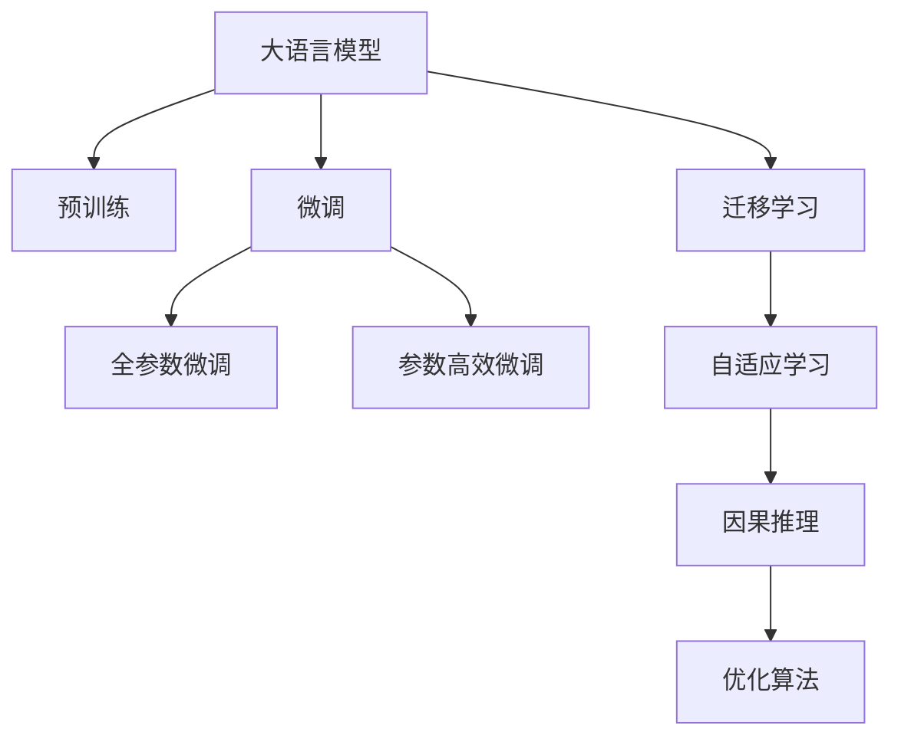
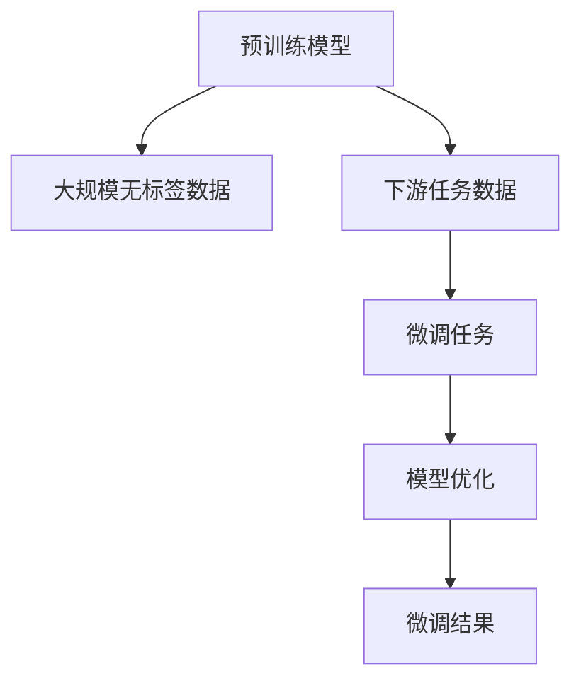

                 

# LLM在智能水资源管理中的潜在贡献

## 1. 背景介绍

### 1.1 问题由来

水资源是人类赖以生存和发展的基础，同时也是社会经济可持续发展的重要保障。然而，随着全球气候变化的加剧和工业化、城市化的推进，水资源的短缺问题愈发凸显。传统的基于规则的水资源管理方法已难以满足日益复杂的环境需求。近年来，随着人工智能技术的快速发展，大语言模型（Large Language Model, LLM）在自然语言处理（Natural Language Processing, NLP）领域的出色表现，让人们看到了智能水资源管理的全新可能。

### 1.2 问题核心关键点

智能水资源管理的关键在于构建一个能够全面理解和管理水资源的智能系统。这不仅需要该系统具备强大的数据处理能力，还需具备对水文、水资源、政策法规等多维度信息的理解能力，并能将这些信息转换为有效的决策支持。大语言模型，作为目前最先进的自然语言处理工具，正逐步展现出其在智能水资源管理中的巨大潜力。

1. **数据处理能力**：大语言模型能够快速处理和分析海量文本数据，包括气象数据、水文资料、法律法规、公众咨询等，提取有价值的信息。
2. **信息理解能力**：通过预训练，大语言模型能够掌握大量自然语言知识和上下文推理能力，从而对水资源相关的多维信息进行深度理解。
3. **决策支持**：大语言模型能够将处理后的信息转化为决策建议，为水资源管理提供科学依据。

## 2. 核心概念与联系

### 2.1 核心概念概述

为更好地理解LLM在智能水资源管理中的应用，本节将介绍几个关键概念：

- **大语言模型（LLM）**：基于深度学习技术，通过预训练学习到丰富语言知识的模型，能够理解和生成自然语言，常用于文本分类、情感分析、对话系统等任务。
- **预训练**：在大规模无标签文本数据上，通过自监督学习任务训练模型，学习语言的通用表示。
- **微调（Fine-Tuning）**：在大规模预训练模型的基础上，使用下游任务的少量标注数据，通过有监督学习优化模型在该任务上的性能。
- **迁移学习**：将一个领域学习到的知识，迁移应用到另一个不同但相关的领域的学习范式。
- **自适应学习（Adaptive Learning）**：通过学习历史数据和实时数据，动态调整模型参数，提高模型的泛化能力。
- **因果推理（Causal Reasoning）**：在处理和推理过程中考虑因果关系，提高模型的决策可靠性。
- **优化算法（Optimization Algorithms）**：如AdamW、SGD等，用于最小化损失函数，优化模型参数。

这些概念之间的逻辑关系可以通过以下Mermaid流程图来展示：



### 2.2 核心概念原理和架构的 Mermaid 流程图



这个流程图展示了预训练模型通过预训练获取语言知识，进而通过微调获得下游任务性能的过程。

## 3. 核心算法原理 & 具体操作步骤

### 3.1 算法原理概述

基于大语言模型的水资源智能管理，本质上是将语言模型应用于水资源相关的数据分析和决策支持。其核心思想是利用大语言模型的强大文本处理能力，对水资源管理中的各类文本数据进行深度分析，提取有价值的信息，并转化为决策建议。

形式化地，假设大语言模型为 $M_{\theta}$，其中 $\theta$ 为预训练得到的模型参数。给定水资源管理的下游任务 $T$ 的标注数据集 $D=\{(x_i, y_i)\}_{i=1}^N$，微调的目标是找到新的模型参数 $\hat{\theta}$，使得：

$$
\hat{\theta}=\mathop{\arg\min}_{\theta} \mathcal{L}(M_{\theta},D)
$$

其中 $\mathcal{L}$ 为针对任务 $T$ 设计的损失函数，用于衡量模型预测输出与真实标签之间的差异。常见的损失函数包括交叉熵损失、均方误差损失等。

### 3.2 算法步骤详解

基于监督学习的大语言模型微调在水资源管理中的应用一般包括以下几个关键步骤：

**Step 1: 准备预训练模型和数据集**
- 选择合适的预训练语言模型 $M_{\theta}$ 作为初始化参数，如 BERT、GPT 等。
- 准备水资源管理的标注数据集 $D$，划分为训练集、验证集和测试集。一般要求标注数据与预训练数据的分布不要差异过大。

**Step 2: 添加任务适配层**
- 根据任务类型，在预训练模型顶层设计合适的输出层和损失函数。
- 对于分类任务，通常在顶层添加线性分类器和交叉熵损失函数。
- 对于生成任务，通常使用语言模型的解码器输出概率分布，并以负对数似然为损失函数。

**Step 3: 设置微调超参数**
- 选择合适的优化算法及其参数，如 AdamW、SGD 等，设置学习率、批大小、迭代轮数等。
- 设置正则化技术及强度，包括权重衰减、Dropout、Early Stopping等。
- 确定冻结预训练参数的策略，如仅微调顶层，或全部参数都参与微调。

**Step 4: 执行梯度训练**
- 将训练集数据分批次输入模型，前向传播计算损失函数。
- 反向传播计算参数梯度，根据设定的优化算法和学习率更新模型参数。
- 周期性在验证集上评估模型性能，根据性能指标决定是否触发 Early Stopping。
- 重复上述步骤直到满足预设的迭代轮数或 Early Stopping 条件。

**Step 5: 测试和部署**
- 在测试集上评估微调后模型 $M_{\hat{\theta}}$ 的性能，对比微调前后的精度提升。
- 使用微调后的模型对新样本进行推理预测，集成到实际的水资源管理系统中。
- 持续收集新的数据，定期重新微调模型，以适应数据分布的变化。

以上是基于监督学习微调大语言模型的一般流程。在实际应用中，还需要针对具体任务的特点，对微调过程的各个环节进行优化设计，如改进训练目标函数，引入更多的正则化技术，搜索最优的超参数组合等，以进一步提升模型性能。

### 3.3 算法优缺点

基于大语言模型的水资源智能管理方法具有以下优点：
1. 高效处理海量数据。大语言模型能够在较短的时间内处理和分析大量文本数据，提高水资源管理的效率。
2. 丰富水资源知识。预训练过程中，模型学习到了大量的语言知识，能够更好地理解和处理与水资源相关的多维度信息。
3. 快速响应变化。通过微调，模型能够快速适应新的数据分布，适应水资源管理中的快速变化。
4. 辅助决策支持。通过分析历史数据和实时数据，大语言模型能够为水资源管理提供科学决策依据。

同时，该方法也存在一定的局限性：
1. 数据依赖性。微调的效果很大程度上取决于标注数据的质量和数量，获取高质量标注数据的成本较高。
2. 迁移能力有限。当目标任务与预训练数据的分布差异较大时，微调的性能提升有限。
3. 知识更新。随着水资源管理需求的变化，模型需要不断更新以保持其有效性，存在知识更新成本。
4. 可解释性不足。大语言模型的决策过程通常缺乏可解释性，难以对其推理逻辑进行分析和调试。
5. 模型鲁棒性。模型可能受到噪声数据和异常情况的影响，需要进行鲁棒性测试和优化。

尽管存在这些局限性，但就目前而言，基于大语言模型的微调方法在水资源管理中的应用前景广阔，能够显著提升水资源管理的智能化水平，助力水资源管理的科学决策。

### 3.4 算法应用领域

基于大语言模型微调的方法在水资源管理中的应用涉及多个领域，包括但不限于：

1. **水资源监测与预警**：通过收集和分析水文气象数据、公众咨询等文本信息，预测水资源短缺和污染风险，提前进行预警。
2. **水资源调度与分配**：基于历史数据和实时数据，优化水资源的调度和分配，保障供水安全。
3. **水质监测与评估**：通过分析水质监测报告和公众反馈，评估水体质量，提供科学的水质管理建议。
4. **水资源规划与评估**：通过综合考虑水资源需求、供给和分配等多维度信息，提供科学的水资源规划和评估方案。
5. **水资源法规与政策支持**：帮助制定和评估水资源相关的法律法规，提供政策建议。

## 4. 数学模型和公式 & 详细讲解  
### 4.1 数学模型构建

本节将使用数学语言对基于大语言模型的水资源管理微调过程进行更加严格的刻画。

记预训练语言模型为 $M_{\theta}$，其中 $\theta$ 为预训练得到的模型参数。假设水资源管理的下游任务为 $T$ 的标注数据集为 $D=\{(x_i,y_i)\}_{i=1}^N, x_i \in \mathcal{X}, y_i \in \mathcal{Y}$。

定义模型 $M_{\theta}$ 在数据样本 $(x,y)$ 上的损失函数为 $\ell(M_{\theta}(x),y)$，则在数据集 $D$ 上的经验风险为：

$$
\mathcal{L}(\theta) = \frac{1}{N} \sum_{i=1}^N \ell(M_{\theta}(x_i),y_i)
$$

微调的优化目标是最小化经验风险，即找到最优参数：

$$
\theta^* = \mathop{\arg\min}_{\theta} \mathcal{L}(\theta)
$$

在实践中，我们通常使用基于梯度的优化算法（如SGD、Adam等）来近似求解上述最优化问题。设 $\eta$ 为学习率，$\lambda$ 为正则化系数，则参数的更新公式为：

$$
\theta \leftarrow \theta - \eta \nabla_{\theta}\mathcal{L}(\theta) - \eta\lambda\theta
$$

其中 $\nabla_{\theta}\mathcal{L}(\theta)$ 为损失函数对参数 $\theta$ 的梯度，可通过反向传播算法高效计算。

### 4.2 公式推导过程

以下我们以二分类任务为例，推导交叉熵损失函数及其梯度的计算公式。

假设模型 $M_{\theta}$ 在输入 $x$ 上的输出为 $\hat{y}=M_{\theta}(x) \in [0,1]$，表示样本属于正类的概率。真实标签 $y \in \{0,1\}$。则二分类交叉熵损失函数定义为：

$$
\ell(M_{\theta}(x),y) = -[y\log \hat{y} + (1-y)\log (1-\hat{y})]
$$

将其代入经验风险公式，得：

$$
\mathcal{L}(\theta) = -\frac{1}{N}\sum_{i=1}^N [y_i\log M_{\theta}(x_i)+(1-y_i)\log(1-M_{\theta}(x_i))]
$$

根据链式法则，损失函数对参数 $\theta_k$ 的梯度为：

$$
\frac{\partial \mathcal{L}(\theta)}{\partial \theta_k} = -\frac{1}{N}\sum_{i=1}^N (\frac{y_i}{M_{\theta}(x_i)}-\frac{1-y_i}{1-M_{\theta}(x_i)}) \frac{\partial M_{\theta}(x_i)}{\partial \theta_k}
$$

其中 $\frac{\partial M_{\theta}(x_i)}{\partial \theta_k}$ 可进一步递归展开，利用自动微分技术完成计算。

在得到损失函数的梯度后，即可带入参数更新公式，完成模型的迭代优化。重复上述过程直至收敛，最终得到适应下游任务的最优模型参数 $\theta^*$。

## 5. 项目实践：代码实例和详细解释说明
### 5.1 开发环境搭建

在进行水资源智能管理微调实践前，我们需要准备好开发环境。以下是使用Python进行PyTorch开发的环境配置流程：

1. 安装Anaconda：从官网下载并安装Anaconda，用于创建独立的Python环境。

2. 创建并激活虚拟环境：
```bash
conda create -n pytorch-env python=3.8 
conda activate pytorch-env
```

3. 安装PyTorch：根据CUDA版本，从官网获取对应的安装命令。例如：
```bash
conda install pytorch torchvision torchaudio cudatoolkit=11.1 -c pytorch -c conda-forge
```

4. 安装Transformers库：
```bash
pip install transformers
```

5. 安装各类工具包：
```bash
pip install numpy pandas scikit-learn matplotlib tqdm jupyter notebook ipython
```

完成上述步骤后，即可在`pytorch-env`环境中开始微调实践。

### 5.2 源代码详细实现

这里我们以水资源监测与预警任务为例，给出使用Transformers库对BERT模型进行微调的PyTorch代码实现。

首先，定义水资源监测与预警任务的数据处理函数：

```python
from transformers import BertTokenizer
from torch.utils.data import Dataset
import torch

class WaterResourceDataset(Dataset):
    def __init__(self, texts, tags, tokenizer, max_len=128):
        self.texts = texts
        self.tags = tags
        self.tokenizer = tokenizer
        self.max_len = max_len
        
    def __len__(self):
        return len(self.texts)
    
    def __getitem__(self, item):
        text = self.texts[item]
        tags = self.tags[item]
        
        encoding = self.tokenizer(text, return_tensors='pt', max_length=self.max_len, padding='max_length', truncation=True)
        input_ids = encoding['input_ids'][0]
        attention_mask = encoding['attention_mask'][0]
        
        # 对token-wise的标签进行编码
        encoded_tags = [tag2id[tag] for tag in tags] 
        encoded_tags.extend([tag2id['O']] * (self.max_len - len(encoded_tags)))
        labels = torch.tensor(encoded_tags, dtype=torch.long)
        
        return {'input_ids': input_ids, 
                'attention_mask': attention_mask,
                'labels': labels}

# 标签与id的映射
tag2id = {'O': 0, 'shortage': 1, 'pollution': 2, 'disaster': 3}
id2tag = {v: k for k, v in tag2id.items()}

# 创建dataset
tokenizer = BertTokenizer.from_pretrained('bert-base-cased')

train_dataset = WaterResourceDataset(train_texts, train_tags, tokenizer)
dev_dataset = WaterResourceDataset(dev_texts, dev_tags, tokenizer)
test_dataset = WaterResourceDataset(test_texts, test_tags, tokenizer)
```

然后，定义模型和优化器：

```python
from transformers import BertForTokenClassification, AdamW

model = BertForTokenClassification.from_pretrained('bert-base-cased', num_labels=len(tag2id))

optimizer = AdamW(model.parameters(), lr=2e-5)
```

接着，定义训练和评估函数：

```python
from torch.utils.data import DataLoader
from tqdm import tqdm
from sklearn.metrics import classification_report

device = torch.device('cuda') if torch.cuda.is_available() else torch.device('cpu')
model.to(device)

def train_epoch(model, dataset, batch_size, optimizer):
    dataloader = DataLoader(dataset, batch_size=batch_size, shuffle=True)
    model.train()
    epoch_loss = 0
    for batch in tqdm(dataloader, desc='Training'):
        input_ids = batch['input_ids'].to(device)
        attention_mask = batch['attention_mask'].to(device)
        labels = batch['labels'].to(device)
        model.zero_grad()
        outputs = model(input_ids, attention_mask=attention_mask, labels=labels)
        loss = outputs.loss
        epoch_loss += loss.item()
        loss.backward()
        optimizer.step()
    return epoch_loss / len(dataloader)

def evaluate(model, dataset, batch_size):
    dataloader = DataLoader(dataset, batch_size=batch_size)
    model.eval()
    preds, labels = [], []
    with torch.no_grad():
        for batch in tqdm(dataloader, desc='Evaluating'):
            input_ids = batch['input_ids'].to(device)
            attention_mask = batch['attention_mask'].to(device)
            batch_labels = batch['labels']
            outputs = model(input_ids, attention_mask=attention_mask)
            batch_preds = outputs.logits.argmax(dim=2).to('cpu').tolist()
            batch_labels = batch_labels.to('cpu').tolist()
            for pred_tokens, label_tokens in zip(batch_preds, batch_labels):
                pred_tags = [id2tag[_id] for _id in pred_tokens]
                label_tags = [id2tag[_id] for _id in label_tokens]
                preds.append(pred_tags[:len(label_tags)])
                labels.append(label_tags)
                
    print(classification_report(labels, preds))
```

最后，启动训练流程并在测试集上评估：

```python
epochs = 5
batch_size = 16

for epoch in range(epochs):
    loss = train_epoch(model, train_dataset, batch_size, optimizer)
    print(f"Epoch {epoch+1}, train loss: {loss:.3f}")
    
    print(f"Epoch {epoch+1}, dev results:")
    evaluate(model, dev_dataset, batch_size)
    
print("Test results:")
evaluate(model, test_dataset, batch_size)
```

以上就是使用PyTorch对BERT进行水资源监测与预警任务微调的完整代码实现。可以看到，得益于Transformers库的强大封装，我们可以用相对简洁的代码完成BERT模型的加载和微调。

### 5.3 代码解读与分析

让我们再详细解读一下关键代码的实现细节：

**WaterResourceDataset类**：
- `__init__`方法：初始化文本、标签、分词器等关键组件。
- `__len__`方法：返回数据集的样本数量。
- `__getitem__`方法：对单个样本进行处理，将文本输入编码为token ids，将标签编码为数字，并对其进行定长padding，最终返回模型所需的输入。

**tag2id和id2tag字典**：
- 定义了标签与数字id之间的映射关系，用于将token-wise的预测结果解码回真实的标签。

**训练和评估函数**：
- 使用PyTorch的DataLoader对数据集进行批次化加载，供模型训练和推理使用。
- 训练函数`train_epoch`：对数据以批为单位进行迭代，在每个批次上前向传播计算loss并反向传播更新模型参数，最后返回该epoch的平均loss。
- 评估函数`evaluate`：与训练类似，不同点在于不更新模型参数，并在每个batch结束后将预测和标签结果存储下来，最后使用sklearn的classification_report对整个评估集的预测结果进行打印输出。

**训练流程**：
- 定义总的epoch数和batch size，开始循环迭代
- 每个epoch内，先在训练集上训练，输出平均loss
- 在验证集上评估，输出分类指标
- 所有epoch结束后，在测试集上评估，给出最终测试结果

可以看到，PyTorch配合Transformers库使得BERT微调的代码实现变得简洁高效。开发者可以将更多精力放在数据处理、模型改进等高层逻辑上，而不必过多关注底层的实现细节。

当然，工业级的系统实现还需考虑更多因素，如模型的保存和部署、超参数的自动搜索、更灵活的任务适配层等。但核心的微调范式基本与此类似。

## 6. 实际应用场景

### 6.1 智能水资源监测系统

智能水资源监测系统利用大语言模型进行实时的水资源监测和预警，能够有效提升水资源管理的效率和准确性。

在技术实现上，可以收集水文气象数据、公众咨询、媒体报道等文本信息，通过预训练模型进行初步分析，再利用微调模型进行深层次理解和推理。微调后的模型能够自动提取关键信息，识别出异常情况，如干旱、洪水、水污染等，并进行预警和应对措施的推荐。

### 6.2 水资源调度与分配

水资源调度与分配涉及复杂的水资源动态变化，传统方法难以实时准确地做出决策。基于大语言模型微调的智能调度系统，能够通过分析历史数据和实时数据，优化水资源的调度方案。

例如，利用微调模型分析历史用水量数据，预测未来的用水需求，同时结合实时水文信息，自动调整供水方案。模型还可以进行水资源的优化分配，确保水资源的有效利用和合理配置。

### 6.3 水质监测与评估

水质监测与评估需要对大量的水质监测数据进行分析和解释。大语言模型通过微调，能够自动识别和理解水质监测报告中的关键信息，生成科学的水质评估报告。

例如，微调模型能够从监测报告中提取水质指标和异常情况，自动生成水质分析报告，并提供改进建议。这不仅提高了评估的效率，也提升了评估的准确性和科学性。

### 6.4 未来应用展望

随着大语言模型微调技术的发展，基于微调的水资源智能管理应用将更加广泛和深入。以下是几个未来发展的方向：

1. **跨模态融合**：利用图像、视频等多模态数据与文本数据的融合，增强模型的信息理解和推理能力，提升水资源管理的全面性。
2. **因果推理**：通过引入因果推理技术，提高模型的决策可靠性和鲁棒性，解决复杂多变的水资源问题。
3. **实时预测**：利用模型对实时数据进行预测和评估，快速响应水资源管理的突发事件，实现高效的水资源预警和调度。
4. **多任务学习**：将多个水资源管理任务进行联合训练，提高模型的泛化能力和迁移能力，实现多功能的水资源管理。
5. **联邦学习**：通过分布式训练和模型联邦学习，实现跨区域的水资源管理，提升资源共享和协同管理水平。

## 7. 工具和资源推荐
### 7.1 学习资源推荐

为了帮助开发者系统掌握大语言模型微调的理论基础和实践技巧，这里推荐一些优质的学习资源：

1. 《Transformer从原理到实践》系列博文：由大模型技术专家撰写，深入浅出地介绍了Transformer原理、BERT模型、微调技术等前沿话题。

2. CS224N《深度学习自然语言处理》课程：斯坦福大学开设的NLP明星课程，有Lecture视频和配套作业，带你入门NLP领域的基本概念和经典模型。

3. 《Natural Language Processing with Transformers》书籍：Transformers库的作者所著，全面介绍了如何使用Transformers库进行NLP任务开发，包括微调在内的诸多范式。

4. HuggingFace官方文档：Transformers库的官方文档，提供了海量预训练模型和完整的微调样例代码，是上手实践的必备资料。

5. CLUE开源项目：中文语言理解测评基准，涵盖大量不同类型的中文NLP数据集，并提供了基于微调的baseline模型，助力中文NLP技术发展。

通过对这些资源的学习实践，相信你一定能够快速掌握大语言模型微调的精髓，并用于解决实际的水资源管理问题。
### 7.2 开发工具推荐

高效的开发离不开优秀的工具支持。以下是几款用于大语言模型微调开发的常用工具：

1. PyTorch：基于Python的开源深度学习框架，灵活动态的计算图，适合快速迭代研究。大部分预训练语言模型都有PyTorch版本的实现。

2. TensorFlow：由Google主导开发的开源深度学习框架，生产部署方便，适合大规模工程应用。同样有丰富的预训练语言模型资源。

3. Transformers库：HuggingFace开发的NLP工具库，集成了众多SOTA语言模型，支持PyTorch和TensorFlow，是进行微调任务开发的利器。

4. Weights & Biases：模型训练的实验跟踪工具，可以记录和可视化模型训练过程中的各项指标，方便对比和调优。与主流深度学习框架无缝集成。

5. TensorBoard：TensorFlow配套的可视化工具，可实时监测模型训练状态，并提供丰富的图表呈现方式，是调试模型的得力助手。

6. Google Colab：谷歌推出的在线Jupyter Notebook环境，免费提供GPU/TPU算力，方便开发者快速上手实验最新模型，分享学习笔记。

合理利用这些工具，可以显著提升大语言模型微调任务的开发效率，加快创新迭代的步伐。

### 7.3 相关论文推荐

大语言模型和微调技术的发展源于学界的持续研究。以下是几篇奠基性的相关论文，推荐阅读：

1. Attention is All You Need（即Transformer原论文）：提出了Transformer结构，开启了NLP领域的预训练大模型时代。

2. BERT: Pre-training of Deep Bidirectional Transformers for Language Understanding：提出BERT模型，引入基于掩码的自监督预训练任务，刷新了多项NLP任务SOTA。

3. Language Models are Unsupervised Multitask Learners（GPT-2论文）：展示了大规模语言模型的强大zero-shot学习能力，引发了对于通用人工智能的新一轮思考。

4. Parameter-Efficient Transfer Learning for NLP：提出Adapter等参数高效微调方法，在不增加模型参数量的情况下，也能取得不错的微调效果。

5. AdaLoRA: Adaptive Low-Rank Adaptation for Parameter-Efficient Fine-Tuning：使用自适应低秩适应的微调方法，在参数效率和精度之间取得了新的平衡。

这些论文代表了大语言模型微调技术的发展脉络。通过学习这些前沿成果，可以帮助研究者把握学科前进方向，激发更多的创新灵感。

## 8. 总结：未来发展趋势与挑战

### 8.1 总结

本文对基于大语言模型的水资源智能管理进行了全面系统的介绍。首先阐述了大语言模型和微调技术的研究背景和意义，明确了微调在提升水资源管理智能化水平、科学决策等方面的独特价值。其次，从原理到实践，详细讲解了监督微调的数学原理和关键步骤，给出了水资源监测与预警任务的完整代码实现。同时，本文还广泛探讨了微调方法在水资源管理中的实际应用场景，展示了微调范式的巨大潜力。此外，本文精选了微调技术的各类学习资源，力求为读者提供全方位的技术指引。

通过本文的系统梳理，可以看到，基于大语言模型的微调方法在水资源管理中具有广阔的应用前景，能够显著提升水资源管理的智能化水平，为水资源管理提供科学的决策支持。未来，伴随预训练语言模型和微调方法的持续演进，相信NLP技术将进一步拓展水资源管理的应用范围，助力水资源管理的科学化和智能化。

### 8.2 未来发展趋势

展望未来，大语言模型微调技术在水资源管理中的应用将呈现以下几个发展趋势：

1. **多模态融合**：利用图像、视频等多模态数据与文本数据的融合，增强模型的信息理解和推理能力，提升水资源管理的全面性。
2. **因果推理**：通过引入因果推理技术，提高模型的决策可靠性和鲁棒性，解决复杂多变的水资源问题。
3. **实时预测**：利用模型对实时数据进行预测和评估，快速响应水资源管理的突发事件，实现高效的水资源预警和调度。
4. **跨模态融合**：将多源异构数据进行融合，利用跨模态表示学习提升模型的泛化能力和迁移能力，实现多功能的水资源管理。
5. **联邦学习**：通过分布式训练和模型联邦学习，实现跨区域的水资源管理，提升资源共享和协同管理水平。

这些趋势凸显了大语言模型微调技术的广阔前景。这些方向的探索发展，必将进一步提升水资源管理的智能化水平，为水资源管理的科学决策提供更强大的技术支持。

### 8.3 面临的挑战

尽管大语言模型微调技术在水资源管理中的应用前景广阔，但在迈向更加智能化、普适化应用的过程中，它仍面临着诸多挑战：

1. **数据依赖性**：微调的效果很大程度上取决于标注数据的质量和数量，获取高质量标注数据的成本较高。如何进一步降低微调对标注样本的依赖，将是一大难题。
2. **模型鲁棒性**：模型可能受到噪声数据和异常情况的影响，需要进行鲁棒性测试和优化。如何提高模型的鲁棒性，避免灾难性遗忘，还需要更多理论和实践的积累。
3. **知识更新**：随着水资源管理需求的变化，模型需要不断更新以保持其有效性，存在知识更新成本。
4. **可解释性**：大语言模型的决策过程通常缺乏可解释性，难以对其推理逻辑进行分析和调试。对于高风险应用，算法的可解释性和可审计性尤为重要。
5. **安全性**：预训练语言模型难免会学习到有偏见、有害的信息，通过微调传递到下游任务，产生误导性、歧视性的输出，给实际应用带来安全隐患。如何从数据和算法层面消除模型偏见，避免恶意用途，确保输出的安全性，也将是重要的研究课题。

尽管存在这些挑战，但就目前而言，基于大语言模型的微调方法在水资源管理中的应用前景广阔，能够显著提升水资源管理的智能化水平，为水资源管理的科学决策提供强有力的技术支撑。未来，伴随预训练语言模型和微调方法的持续演进，相信NLP技术将进一步拓展水资源管理的应用范围，助力水资源管理的科学化和智能化。

### 8.4 研究展望

面对大语言模型微调技术在水资源管理中所面临的挑战，未来的研究需要在以下几个方面寻求新的突破：

1. **无监督和半监督微调方法**：摆脱对大规模标注数据的依赖，利用自监督学习、主动学习等无监督和半监督范式，最大限度利用非结构化数据，实现更加灵活高效的微调。
2. **参数高效和计算高效的微调范式**：开发更加参数高效的微调方法，在固定大部分预训练参数的同时，只更新极少量的任务相关参数。同时优化微调模型的计算图，减少前向传播和反向传播的资源消耗，实现更加轻量级、实时性的部署。
3. **因果推理和对比学习**：引入因果推理和对比学习思想，增强微调模型建立稳定因果关系的能力，学习更加普适、鲁棒的语言表征，从而提升模型泛化性和抗干扰能力。
4. **跨模态信息整合**：将符号化的先验知识，如知识图谱、逻辑规则等，与神经网络模型进行巧妙融合，引导微调过程学习更准确、合理的语言模型。同时加强不同模态数据的整合，实现视觉、语音等多模态信息与文本信息的协同建模。
5. **模型伦理和安全**：在模型训练目标中引入伦理导向的评估指标，过滤和惩罚有偏见、有害的输出倾向。同时加强人工干预和审核，建立模型行为的监管机制，确保输出符合人类价值观和伦理道德。

这些研究方向的探索，必将引领大语言模型微调技术迈向更高的台阶，为构建安全、可靠、可解释、可控的智能系统铺平道路。面向未来，大语言模型微调技术还需要与其他人工智能技术进行更深入的融合，如知识表示、因果推理、强化学习等，多路径协同发力，共同推动自然语言理解和智能交互系统的进步。只有勇于创新、敢于突破，才能不断拓展语言模型的边界，让智能技术更好地造福人类社会。

## 9. 附录：常见问题与解答

**Q1：大语言模型微调是否适用于所有水资源管理任务？**

A: 大语言模型微调在水资源管理中的适用性取决于任务的特点。对于数据量较小、文本信息丰富的任务，如水资源监测与预警，微调方法能够显著提升模型性能。但对于数据复杂、处理复杂的任务，如水资源调度与分配，微调方法的适用性有限，需要结合其他技术手段。

**Q2：微调过程中如何选择合适的学习率？**

A: 微调的学习率一般要比预训练时小1-2个数量级，如果使用过大的学习率，容易破坏预训练权重，导致过拟合。一般建议从1e-5开始调参，逐步减小学习率，直至收敛。也可以使用warmup策略，在开始阶段使用较小的学习率，再逐渐过渡到预设值。需要注意的是，不同的优化器(如AdamW、Adafactor等)以及不同的学习率调度策略，可能需要设置不同的学习率阈值。

**Q3：采用大模型微调时会面临哪些资源瓶颈？**

A: 目前主流的预训练大模型动辄以亿计的参数规模，对算力、内存、存储都提出了很高的要求。GPU/TPU等高性能设备是必不可少的，但即便如此，超大批次的训练和推理也可能遇到显存不足的问题。因此需要采用一些资源优化技术，如梯度积累、混合精度训练、模型并行等，来突破硬件瓶颈。同时，模型的存储和读取也可能占用大量时间和空间，需要采用模型压缩、稀疏化存储等方法进行优化。

**Q4：如何缓解微调过程中的过拟合问题？**

A: 过拟合是微调面临的主要挑战，尤其是在标注数据不足的情况下。常见的缓解策略包括：
1. 数据增强：通过回译、近义替换等方式扩充训练集
2. 正则化：使用L2正则、Dropout、Early Stopping等避免过拟合
3. 对抗训练：引入对抗样本，提高模型鲁棒性
4. 参数高效微调：只调整少量参数(如Adapter、Prefix等)，减小过拟合风险
5. 多模型集成：训练多个微调模型，取平均输出，抑制过拟合

这些策略往往需要根据具体任务和数据特点进行灵活组合。只有在数据、模型、训练、推理等各环节进行全面优化，才能最大限度地发挥大模型微调的威力。

**Q5：大语言模型在水资源管理中存在哪些局限性？**

A: 大语言模型在水资源管理中存在以下局限性：
1. 数据依赖性：微调的效果很大程度上取决于标注数据的质量和数量，获取高质量标注数据的成本较高。
2. 模型鲁棒性：模型可能受到噪声数据和异常情况的影响，需要进行鲁棒性测试和优化。
3. 知识更新：随着水资源管理需求的变化，模型需要不断更新以保持其有效性，存在知识更新成本。
4. 可解释性：大语言模型的决策过程通常缺乏可解释性，难以对其推理逻辑进行分析和调试。
5. 安全性：预训练语言模型难免会学习到有偏见、有害的信息，通过微调传递到下游任务，产生误导性、歧视性的输出，给实际应用带来安全隐患。

尽管存在这些局限性，但就目前而言，基于大语言模型的微调方法在水资源管理中的应用前景广阔，能够显著提升水资源管理的智能化水平，为水资源管理的科学决策提供强有力的技术支撑。未来，伴随预训练语言模型和微调方法的持续演进，相信NLP技术将进一步拓展水资源管理的应用范围，助力水资源管理的科学化和智能化。

---

作者：禅与计算机程序设计艺术 / Zen and the Art of Computer Programming

