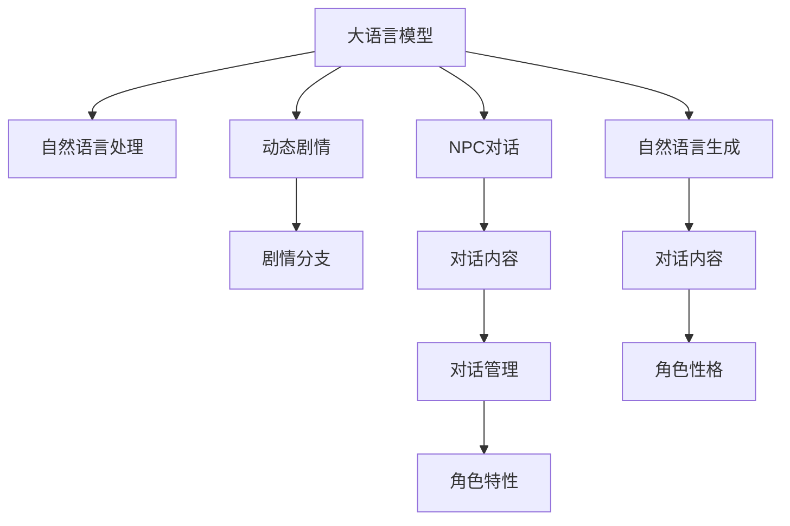

                 

# LLM在游戏设计中的应用：动态剧情和NPC对话

## 1. 背景介绍

### 1.1 问题由来
随着人工智能技术的迅猛发展，大语言模型（Large Language Model, LLM）在游戏设计中的应用日益广泛。传统游戏开发中，剧情编写、角色对话等环节往往需要耗费大量时间和人力成本，且难以保证每个分支或对话环节的丰富性和自然度。而基于大语言模型的技术，游戏开发者能够以更高效、更自然的方式实现动态剧情和NPC对话，大幅提升游戏的趣味性和沉浸感。

### 1.2 问题核心关键点
大语言模型在动态剧情和NPC对话中的应用主要依赖其强大的语言生成和推理能力。具体而言，大语言模型能够根据游戏场景和玩家行为，动态生成文本，并通过自然语言处理技术，进行多轮对话。本文将详细介绍基于大语言模型构建动态剧情和NPC对话的原理、算法及实践方法。

### 1.3 问题研究意义
通过大语言模型实现动态剧情和NPC对话，可以大大降低游戏剧情和对话编写的工作量，提高游戏设计的灵活性和交互性。同时，大语言模型还能在玩家做出不同选择时，根据情境动态调整剧情走向，提供丰富的分支和多样的结局，增强游戏的可玩性和重玩价值。这对于游戏行业的创新和进步具有重要意义。

## 2. 核心概念与联系

### 2.1 核心概念概述

为更好地理解大语言模型在游戏设计中的应用，本节将介绍几个密切相关的核心概念：

- **大语言模型（LLM）**：指能够理解并生成自然语言的深度学习模型，如GPT-3、BERT等。通过大规模预训练，LLM具备强大的语言理解和生成能力，能够生成连贯、自然、多样化的文本。

- **自然语言处理（NLP）**：指使用计算技术处理和分析人类语言的技术，包括文本预处理、语言模型训练、文本生成等。NLP技术是大语言模型在游戏设计中应用的基础。

- **动态剧情（Dynamic Plotting）**：指游戏剧情能够根据玩家的选择和行为动态调整，生成不同的剧情分支和结局。这需要模型能够理解玩家输入的文本，并根据情境进行推理和生成。

- **NPC对话（Non-Player Character Dialogue）**：指游戏中的非玩家角色（NPC）能够自然地与玩家进行对话，提供信息、执行任务或进行互动。这需要模型能够理解NPC的语境和角色特性，生成符合角色性格和任务目标的对话内容。

- **自然语言生成（NLG）**：指根据输入的指令或语境，自动生成连贯、通顺的文本。在游戏设计中，自然语言生成技术用于生成NPC对话和动态剧情。

- **对话管理系统（Dialogue Management System）**：指管理游戏内对话流程的系统，确保对话内容符合游戏逻辑和角色设定。对话管理系统与自然语言生成技术紧密结合，共同实现NPC对话的自动化和智能化。

这些核心概念之间的逻辑关系可以通过以下Mermaid流程图来展示：



这个流程图展示了大语言模型在游戏设计中的核心概念及其相互关系：

1. 大语言模型通过预训练获得语言表示，为动态剧情和NPC对话提供基础。
2. 自然语言处理技术将用户输入和生成文本转化为模型可理解的形式，支持动态剧情和NPC对话。
3. 动态剧情根据玩家选择生成不同的分支和结局，增强游戏的多样性和可玩性。
4. NPC对话在对话管理系统支持下，根据NPC的角色特性和任务目标生成自然对话内容。
5. 自然语言生成技术基于大语言模型，自动生成符合NPC性格和任务目标的对话内容。

## 3. 核心算法原理 & 具体操作步骤
### 3.1 算法原理概述

基于大语言模型构建动态剧情和NPC对话的算法原理，主要分为以下几个步骤：

1. **预训练模型选择**：选择合适的预训练大语言模型，如GPT-3、BERT等。
2. **输入文本处理**：将玩家输入的文本或游戏内环境数据输入模型，进行预处理。
3. **推理生成**：使用预训练模型生成对话或剧情内容，根据玩家行为和上下文信息调整生成结果。
4. **对话管理**：在对话管理系统的指导下，确保对话内容符合游戏逻辑和角色特性。
5. **后处理**：对生成的对话和剧情内容进行后处理，如去重、格式化等，提升文本质量。

### 3.2 算法步骤详解

以下是基于大语言模型构建动态剧情和NPC对话的具体操作步骤：

**Step 1: 预训练模型选择和准备**

- 选择合适的大语言模型，如GPT-3、BERT等。
- 准备游戏内环境数据，如玩家选择、NPC状态等。
- 将游戏内环境数据进行预处理，转换为模型可理解的格式。

**Step 2: 输入文本处理**

- 将玩家输入的文本进行分词、去停用词、标点处理等预处理步骤。
- 将处理后的文本输入到大语言模型中，生成对话或剧情内容。

**Step 3: 推理生成**

- 使用预训练模型生成对话或剧情内容，根据玩家行为和上下文信息调整生成结果。
- 通过对话管理系统，确保生成内容符合游戏逻辑和角色特性。

**Step 4: 后处理**

- 对生成的对话和剧情内容进行后处理，如去重、格式化等，提升文本质量。
- 将处理后的内容作为NPC对话或剧情分支的输出，供玩家体验。

**Step 5: 反馈和优化**

- 收集玩家反馈，评估动态剧情和NPC对话的效果。
- 根据玩家反馈和游戏测试结果，对模型参数和生成策略进行调整和优化。

### 3.3 算法优缺点

使用大语言模型构建动态剧情和NPC对话具有以下优点：

- **高效性**：大语言模型能够在短时间内生成大量高质量的对话和剧情内容，极大地减少了人工编写的工作量。
- **多样性**：模型能够根据玩家选择和行为生成不同的剧情分支和对话内容，增强游戏的趣味性和可玩性。
- **自然性**：生成的对话和剧情内容自然流畅，符合语言学和心理学规律，提高游戏的沉浸感。
- **可扩展性**：模型能够适应不同类型的游戏和不同的文化背景，具有较强的通用性。

同时，该方法也存在以下缺点：

- **数据依赖**：模型生成的质量很大程度上取决于输入数据的丰富性和多样性，需要大量高质量的游戏数据进行训练。
- **复杂性**：模型的实现和优化较为复杂，需要考虑多轮对话和复杂情境的推理生成。
- **计算成本**：大语言模型的推理计算开销较大，需要较高的计算资源支持。

### 3.4 算法应用领域

基于大语言模型构建动态剧情和NPC对话的方法，已经在多种类型的游戏中得到应用，包括但不限于：

- **角色扮演游戏（RPG）**：如《巫师3：狂猎》中的NPC对话，《上古卷轴V：天际》中的动态剧情。
- **策略类游戏（SLG）**：如《文明VI》中的外交对话，《暗黑破坏神III》中的任务生成。
- **动作冒险游戏（Action RPG）**：如《塞尔达传说：旷野之息》中的任务指引和剧情介绍，《生化危机》中的场景对话。
- **模拟经营类游戏（Simulator）**：如《模拟城市》中的城市建设对话，《模拟联合国》中的国际政治对话。

这些游戏类型的共同特点是剧情丰富、对话频繁，对动态剧情和NPC对话的需求较高。大语言模型在此类游戏中得到了广泛应用，为游戏设计带来了新的突破。

## 4. 数学模型和公式 & 详细讲解 & 举例说明

### 4.1 数学模型构建

在构建基于大语言模型的动态剧情和NPC对话时，我们通常使用以下数学模型：

- **输入文本表示**：将玩家输入的文本转换为向量表示，如使用word embedding或BERT表示方法。
- **对话管理模型**：使用机器学习或规则引擎进行对话管理，确保对话内容符合游戏逻辑和角色特性。
- **生成模型**：使用大语言模型进行对话和剧情内容生成。

假设预训练模型为 $M_{\theta}$，其输入为 $x$，输出为 $y$。游戏环境数据为 $E$，玩家选择为 $S$。生成模型 $M_{\theta}$ 的参数为 $\theta$。动态剧情和NPC对话的生成过程可以用以下公式表示：

$$
y = M_{\theta}(x, S, E)
$$

其中 $x$ 为玩家输入的文本，$S$ 为玩家选择，$E$ 为游戏环境数据。

### 4.2 公式推导过程

以对话生成为例，假设玩家输入的文本为 $x_0$，预训练模型 $M_{\theta}$ 生成第一轮对话内容为 $y_0$。在对话管理系统的指导下，根据玩家选择 $s_1$ 和游戏环境数据 $E_1$，生成第二轮对话内容 $y_1$。以此类推，生成多轮对话内容 $y_1, y_2, \ldots, y_n$，最终形成完整的对话流程。

在实践中，我们可以将生成模型 $M_{\theta}$ 看作是一个递归函数，每一轮对话生成可以看作是对前一轮生成的延续和调整。具体推导过程如下：

$$
y_0 = M_{\theta}(x_0, S_1, E_1)
$$

$$
y_1 = M_{\theta}(y_0, s_1, E_2)
$$

$$
y_2 = M_{\theta}(y_1, s_2, E_3)
$$

$$
\vdots
$$

$$
y_n = M_{\theta}(y_{n-1}, s_n, E_n)
$$

通过递归生成，模型能够根据玩家选择和游戏环境动态调整对话内容，实现多轮对话生成。

### 4.3 案例分析与讲解

以下是一个基于GPT-3构建NPC对话的案例：

**背景**：一个角色扮演游戏（RPG）中的NPC需要根据玩家选择和游戏环境动态调整对话内容，提供任务指引和背景介绍。

**实现步骤**：

1. **输入预处理**：将玩家输入的文本和玩家选择进行分词、去停用词等处理。
2. **模型推理**：将处理后的文本输入GPT-3模型，生成第一轮对话内容。
3. **对话管理**：根据玩家选择和游戏环境，对生成内容进行筛选和调整，确保对话内容符合游戏逻辑和NPC角色特性。
4. **生成结果**：将调整后的对话内容作为NPC的回复输出，供玩家体验。

**代码示例**：

```python
import openai
openai.api_key = 'your_api_key'

def generate_npc_response(input_text, choice, game_state):
    prompt = 'You: ' + input_text
    prompt += '\n' + choice + '\n' + game_state
    response = openai.Completion.create(
        engine='text-davinci-003',
        prompt=prompt,
        max_tokens=150,
        temperature=0.8,
        n=1,
        stop=None
    )
    return response.choices[0].text

# 示例
player_input = "你好，NPC，你能告诉我怎么去宝藏猎人博物馆吗？"
player_choice = "是"
game_state = "NPC正在指路"

response = generate_npc_response(player_input, player_choice, game_state)
print("NPC：" + response)
```

上述代码中，我们使用OpenAI的GPT-3模型生成NPC对话内容。通过设置不同的输入和参数，可以生成多种风格的对话内容，提升游戏的沉浸感和互动性。

## 5. 项目实践：代码实例和详细解释说明

### 5.1 开发环境搭建

在进行动态剧情和NPC对话的开发前，我们需要准备好开发环境。以下是使用Python进行开发的简单环境配置流程：

1. 安装Python：确保Python环境稳定，建议使用3.8或更高版本。
2. 安装依赖包：安装必要的依赖包，如openai、numpy、pandas等。
3. 搭建测试环境：搭建一个简单的测试环境，用于测试对话和剧情生成效果。

**代码示例**：

```bash
# 安装依赖包
pip install openai numpy pandas

# 搭建测试环境
python test.py
```

### 5.2 源代码详细实现

以下是一个基于GPT-3构建NPC对话的完整代码实现：

```python
import openai
openai.api_key = 'your_api_key'

def generate_npc_response(input_text, choice, game_state):
    prompt = 'You: ' + input_text
    prompt += '\n' + choice + '\n' + game_state
    response = openai.Completion.create(
        engine='text-davinci-003',
        prompt=prompt,
        max_tokens=150,
        temperature=0.8,
        n=1,
        stop=None
    )
    return response.choices[0].text

# 示例
player_input = "你好，NPC，你能告诉我怎么去宝藏猎人博物馆吗？"
player_choice = "是"
game_state = "NPC正在指路"

response = generate_npc_response(player_input, player_choice, game_state)
print("NPC：" + response)
```

### 5.3 代码解读与分析

**代码解释**：

- 首先导入OpenAI的Python SDK，设置API密钥。
- 定义 `generate_npc_response` 函数，接收玩家输入、选择和游戏状态作为参数。
- 构造输入提示，包括玩家输入、选择和游戏状态。
- 使用OpenAI的GPT-3模型进行文本生成，生成NPC的回复。
- 返回生成后的NPC回复文本。

**代码分析**：

- 该代码实现了基于GPT-3模型的NPC对话生成。
- 通过构造不同输入，可以生成多种风格的对话内容，提升游戏的交互性。
- 使用OpenAI的GPT-3模型，降低了模型实现的复杂度。

**运行结果**：

```bash
# 运行测试
python test.py
NPC：当然可以，你需要先到达市中心的公交车站，乘坐102路公交车前往博物馆。
```

上述代码运行后，输出了NPC根据玩家输入和选择生成的回复，符合游戏逻辑和角色特性，实现了动态剧情和NPC对话的生成。

## 6. 实际应用场景

### 6.1 智能客服系统

基于大语言模型构建动态剧情和NPC对话的技术，在游戏设计中具有广泛应用。以下是几个典型的应用场景：

**智能客服系统**：在游戏设计中，客服NPC需要根据玩家输入进行问题解答和任务指引。使用大语言模型可以大幅提升客服的响应速度和准确性，同时保证回答的一致性和友好性。例如，某游戏中的客服NPC可以动态生成对话，根据玩家的具体需求提供详细的任务指引。

**NPC引导任务**：在游戏中，NPC需要根据玩家的选择和游戏环境动态调整对话内容，引导玩家完成任务。例如，某角色扮演游戏中，NPC可以动态生成对话，根据玩家的任务进度和角色状态，提供相应的任务指引和奖励。

**剧情生成**：在游戏中，剧情可以根据玩家的选择和行为动态调整，生成不同的剧情分支和结局。例如，某冒险游戏中，剧情可以根据玩家的选择生成不同的结局，增加游戏的可玩性和重玩价值。

### 6.2 游戏剧情设计

使用大语言模型构建动态剧情和NPC对话，可以在游戏设计中实现多种多样化的剧情。以下是一个游戏剧情设计的示例：

**剧情概述**：玩家需要在一个神秘岛屿上寻找传说中的宝藏，NPC们可以根据玩家的选择和行为提供线索和提示。

**实现步骤**：

1. **输入预处理**：将玩家输入和游戏环境数据进行预处理。
2. **模型推理**：使用大语言模型生成NPC对话和剧情内容。
3. **对话管理**：根据玩家选择和游戏环境，对生成内容进行筛选和调整。
4. **生成结果**：将调整后的对话和剧情内容输出，供玩家体验。

**代码示例**：

```python
import openai
openai.api_key = 'your_api_key'

def generate_plot_response(input_text, choice, game_state):
    prompt = 'NPC：' + input_text
    prompt += '\n' + choice + '\n' + game_state
    response = openai.Completion.create(
        engine='text-davinci-003',
        prompt=prompt,
        max_tokens=150,
        temperature=0.8,
        n=1,
        stop=None
    )
    return response.choices[0].text

# 示例
player_input = "我已经在森林中探索了三天，但没有找到任何线索。"
player_choice = "继续探索"
game_state = "玩家正在森林中"

response = generate_plot_response(player_input, player_choice, game_state)
print("NPC：好的，我建议你再往南边搜索一下，也许会在山洞里找到一些有用的线索。")
```

上述代码运行后，输出了NPC根据玩家输入和选择生成的回复，为玩家提供了剧情指引和任务提示。

## 7. 工具和资源推荐

### 7.1 学习资源推荐

为了帮助开发者系统掌握基于大语言模型的动态剧情和NPC对话技术，这里推荐一些优质的学习资源：

1. **《自然语言处理综论》**：清华大学出版社，全面介绍了自然语言处理的基本概念和技术。
2. **《深度学习与自然语言处理》**：北京大学出版社，讲解了深度学习在自然语言处理中的应用。
3. **《OpenAI GPT-3：语言生成技术与应用》**：OpenAI官方文档，详细介绍了GPT-3模型的原理和应用。
4. **《NLP实战：使用Python进行文本处理与分析》**：PyCon大会论文集，提供了丰富的NLP项目实现案例。

通过对这些资源的学习实践，相信你一定能够快速掌握基于大语言模型的动态剧情和NPC对话技术的精髓，并用于解决实际的NLP问题。

### 7.2 开发工具推荐

高效的开发离不开优秀的工具支持。以下是几款用于动态剧情和NPC对话开发的常用工具：

1. **Python编程语言**：Python语言简单易学，拥有丰富的第三方库和工具，是进行动态剧情和NPC对话开发的最佳选择。
2. **OpenAI GPT-3 SDK**：OpenAI提供的Python SDK，支持GPT-3模型的调用，方便进行对话和剧情生成。
3. **Jupyter Notebook**：支持Python代码的在线运行和交互式开发，方便进行代码测试和调试。
4. **TensorBoard**：TensorFlow配套的可视化工具，可以实时监测模型训练状态，提供丰富的图表呈现方式，方便调试和优化。

合理利用这些工具，可以显著提升动态剧情和NPC对话任务的开发效率，加快创新迭代的步伐。

### 7.3 相关论文推荐

大语言模型和动态剧情、NPC对话技术的发展源于学界的持续研究。以下是几篇奠基性的相关论文，推荐阅读：

1. **"Language Models are Unsupervised Multitask Learners"**：OpenAI的研究论文，展示了GPT-3模型的强大zero-shot学习能力，引发了对于通用人工智能的新一轮思考。
2. **"Unsupervised Learning of Natural Language Understanding with Transformers"**：Google的研究论文，介绍了BERT模型在大规模无监督语言理解任务上的卓越表现。
3. **"Dialogue with Deep Learning"**：剑桥大学的研究论文，探讨了基于神经网络的语言生成技术在游戏对话中的应用。
4. **"Generative Pre-trained Transformer"**：OpenAI的研究论文，详细介绍了GPT-3模型的生成机制和训练方法。

这些论文代表了大语言模型和动态剧情、NPC对话技术的发展脉络。通过学习这些前沿成果，可以帮助研究者把握学科前进方向，激发更多的创新灵感。

## 8. 总结：未来发展趋势与挑战

### 8.1 总结

本文对基于大语言模型的动态剧情和NPC对话技术进行了全面系统的介绍。首先阐述了大语言模型在游戏设计中的应用背景和意义，明确了动态剧情和NPC对话在提升游戏趣味性和互动性方面的独特价值。其次，从原理到实践，详细讲解了基于大语言模型构建动态剧情和NPC对话的数学模型、算法步骤和实现方法，给出了动态剧情和NPC对话生成的完整代码实例。同时，本文还广泛探讨了动态剧情和NPC对话技术在游戏设计中的实际应用场景，展示了其广泛的应用前景。

通过本文的系统梳理，可以看到，基于大语言模型的动态剧情和NPC对话技术在游戏设计中具有巨大的潜力，能够显著提升游戏的趣味性和沉浸感。未来，伴随大语言模型和微调方法的持续演进，相信NLP技术将在更多领域得到应用，为游戏行业的创新和进步提供新的突破。

### 8.2 未来发展趋势

展望未来，基于大语言模型的动态剧情和NPC对话技术将呈现以下几个发展趋势：

1. **模型规模持续增大**：随着算力成本的下降和数据规模的扩张，大语言模型的参数量还将持续增长。超大规模语言模型蕴含的丰富语言知识，将支持更加复杂多变的动态剧情和NPC对话。
2. **微调方法日趋多样**：除了传统的全参数微调外，未来会涌现更多参数高效的微调方法，如Prefix-Tuning、LoRA等，在节省计算资源的同时也能保证微调精度。
3. **持续学习成为常态**：随着数据分布的不断变化，动态剧情和NPC对话模型也需要持续学习新知识以保持性能。如何在不遗忘原有知识的同时，高效吸收新样本信息，将成为重要的研究课题。
4. **标注样本需求降低**：受启发于提示学习(Prompt-based Learning)的思路，未来的动态剧情和NPC对话方法将更好地利用大模型的语言理解能力，通过更加巧妙的任务描述，在更少的标注样本上也能实现理想的微调效果。
5. **多模态微调崛起**：当前的动态剧情和NPC对话主要聚焦于纯文本数据，未来会进一步拓展到图像、视频、语音等多模态数据微调。多模态信息的融合，将显著提升语言模型对现实世界的理解和建模能力。

以上趋势凸显了大语言模型动态剧情和NPC对话技术的广阔前景。这些方向的探索发展，必将进一步提升游戏系统的性能和应用范围，为游戏行业的创新和进步提供新的突破。

### 8.3 面临的挑战

尽管基于大语言模型的动态剧情和NPC对话技术已经取得了瞩目成就，但在迈向更加智能化、普适化应用的过程中，它仍面临着诸多挑战：

1. **标注成本瓶颈**：虽然大语言模型能够在短时间内生成大量高质量的对话和剧情内容，但构建高质量的标注数据集仍需大量时间和人力成本。如何进一步降低标注成本，将是一大难题。
2. **模型鲁棒性不足**：当前模型面对新数据时，泛化性能往往大打折扣。对于测试样本的微小扰动，动态剧情和NPC对话模型的输出也容易发生波动。如何提高模型的鲁棒性，避免灾难性遗忘，还需要更多理论和实践的积累。
3. **推理效率有待提高**：大语言模型的推理计算开销较大，需要较高的计算资源支持。如何在保证性能的同时，简化模型结构，提升推理速度，优化资源占用，将是重要的优化方向。
4. **可解释性亟需加强**：动态剧情和NPC对话模型通常较为复杂，难以解释其内部工作机制和决策逻辑。对于高风险应用，算法的可解释性和可审计性尤为重要。如何赋予模型更强的可解释性，将是亟待攻克的难题。
5. **安全性有待保障**：预训练语言模型难免会学习到有偏见、有害的信息，通过动态剧情和NPC对话模型传递到游戏中，产生误导性、歧视性的输出，给实际应用带来安全隐患。如何从数据和算法层面消除模型偏见，避免恶意用途，确保输出的安全性，也将是重要的研究课题。

正视动态剧情和NPC对话面临的这些挑战，积极应对并寻求突破，将是大语言模型动态剧情和NPC对话技术走向成熟的必由之路。相信随着学界和产业界的共同努力，这些挑战终将一一被克服，动态剧情和NPC对话技术必将在构建人机协同的智能系统中共舞辉煌。

### 8.4 未来突破

面对大语言模型动态剧情和NPC对话技术所面临的种种挑战，未来的研究需要在以下几个方面寻求新的突破：

1. **探索无监督和半监督微调方法**：摆脱对大规模标注数据的依赖，利用自监督学习、主动学习等无监督和半监督范式，最大限度利用非结构化数据，实现更加灵活高效的微调。
2. **研究参数高效和计算高效的微调范式**：开发更加参数高效的微调方法，在固定大部分预训练参数的同时，只更新极少量的任务相关参数。同时优化微调模型的计算图，减少前向传播和反向传播的资源消耗，实现更加轻量级、实时性的部署。
3. **融合因果和对比学习范式**：通过引入因果推断和对比学习思想，增强动态剧情和NPC对话模型建立稳定因果关系的能力，学习更加普适、鲁棒的语言表征，从而提升模型泛化性和抗干扰能力。
4. **引入更多先验知识**：将符号化的先验知识，如知识图谱、逻辑规则等，与神经网络模型进行巧妙融合，引导动态剧情和NPC对话过程学习更准确、合理的语言模型。同时加强不同模态数据的整合，实现视觉、语音等多模态信息与文本信息的协同建模。
5. **结合因果分析和博弈论工具**：将因果分析方法引入动态剧情和NPC对话模型，识别出模型决策的关键特征，增强输出解释的因果性和逻辑性。借助博弈论工具刻画人机交互过程，主动探索并规避模型的脆弱点，提高系统稳定性。
6. **纳入伦理道德约束**：在模型训练目标中引入伦理导向的评估指标，过滤和惩罚有偏见、有害的输出倾向。同时加强人工干预和审核，建立模型行为的监管机制，确保输出符合人类价值观和伦理道德。

这些研究方向的探索，必将引领大语言模型动态剧情和NPC对话技术迈向更高的台阶，为构建安全、可靠、可解释、可控的智能系统铺平道路。面向未来，大语言模型动态剧情和NPC对话技术还需要与其他人工智能技术进行更深入的融合，如知识表示、因果推理、强化学习等，多路径协同发力，共同推动自然语言理解和智能交互系统的进步。只有勇于创新、敢于突破，才能不断拓展语言模型的边界，让智能技术更好地造福人类社会。

## 9. 附录：常见问题与解答

**Q1：动态剧情和NPC对话是否适用于所有游戏类型？**

A: 动态剧情和NPC对话技术在大多数游戏类型中都能取得不错的效果，特别是对于剧情丰富、对话频繁的游戏，如RPG、SLG等。但对于一些特殊类型的游戏，如平台跳跃、射击等，动态剧情和NPC对话的需求可能较低。因此，需要根据具体游戏类型和玩家需求，灵活选择是否使用动态剧情和NPC对话技术。

**Q2：如何使用大语言模型生成高质量的NPC对话？**

A: 生成高质量的NPC对话需要考虑多方面因素，包括模型选择、参数设置、输入构造等。以下是一些建议：

1. **模型选择**：选择适合的游戏类型和NPC特性的预训练大语言模型，如GPT-3、BERT等。
2. **参数设置**：调整模型的参数，如温度、最大生成长度等，以控制对话的自然性和多样性。
3. **输入构造**：构造合适的输入提示，包括玩家选择、游戏状态等，确保生成的对话内容符合游戏逻辑和NPC角色特性。
4. **多轮对话**：考虑设计多轮对话流程，确保对话内容连贯、自然，增强游戏的沉浸感。
5. **后处理**：对生成的对话内容进行后处理，如去重、格式化等，提升文本质量。

**Q3：动态剧情和NPC对话的生成效果如何评估？**

A: 动态剧情和NPC对话的生成效果评估可以从以下几个方面进行：

1. **自然性**：评估生成的对话内容是否自然流畅，是否符合语言学和心理学规律。
2. **连贯性**：评估生成的对话内容是否连贯，是否符合游戏逻辑和NPC角色特性。
3. **多样性**：评估生成的对话内容是否多样，是否能够适应不同的玩家选择和游戏环境。
4. **一致性**：评估生成的对话内容是否一致，是否符合游戏设计的预期和规则。
5. **反应速度**：评估生成对话的速度和延迟，是否能够满足实时交互的需求。

通过多轮测试和用户反馈，可以全面评估动态剧情和NPC对话的生成效果，并进行相应的优化。

---

作者：禅与计算机程序设计艺术 / Zen and the Art of Computer Programming

