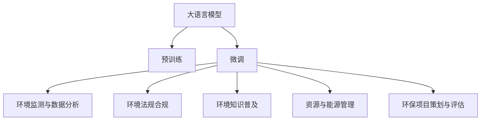

                 

# 大语言模型在环境保护中的潜在贡献

## 1. 背景介绍

### 1.1 问题由来
近年来，随着人工智能技术的飞速发展，大语言模型（Large Language Models, LLMs）在自然语言处理（Natural Language Processing, NLP）领域取得了突破性进展。这些模型基于大规模语料进行预训练，能够理解并生成自然语言，具有强大的文本处理能力。与此同时，环境问题已成为全球共同关注的焦点。如何利用AI技术，特别是大语言模型，为环境保护提供支持，成为研究人员和从业者探讨的热点话题。

### 1.2 问题核心关键点
大语言模型在环境保护中的应用主要集中在以下几个方面：
- 环境监测与数据分析：通过文本、图像等数据，模型可以辅助进行环境状况的监测与分析，如空气质量、水质监测等。
- 环境法规合规：帮助企业和个人理解并遵守相关环境法规，减少违法行为。
- 环境知识普及：通过生成易于理解的内容，向公众传递环境保护知识，提升环保意识。
- 资源与能源管理：辅助优化资源配置，降低能源消耗，提升资源利用效率。
- 环保项目策划与评估：协助设计、评估和优化环保项目，提升其执行效果。

### 1.3 问题研究意义
探讨大语言模型在环境保护中的应用，对于推动环境治理现代化、提高环保工作效率、增强公众环保意识具有重要意义：

1. **提高环境监测精度**：大模型能够处理海量文本数据，从海量文献、报告中提取环境相关信息，提高监测精度和效率。
2. **支持法规合规**：通过自然语言理解，模型可以帮助企业和个人更准确地理解环境法规要求，减少违规行为。
3. **增强公众参与度**：通过生成易于理解的环保知识内容，提升公众对环境保护的理解和参与度。
4. **优化资源配置**：模型可辅助分析资源和能源利用情况，提供优化建议，推动可持续发展。
5. **提升环保项目效果**：通过数据分析和知识检索，模型为环保项目设计提供支持，提高项目执行效果。

## 2. 核心概念与联系

### 2.1 核心概念概述

为更好地理解大语言模型在环境保护中的应用，本节将介绍几个关键概念及其相互关系：

- 大语言模型（Large Language Model, LLM）：基于深度学习技术，通过在大规模无标签文本数据上进行预训练，学习通用的语言表示，具备强大的语言理解和生成能力。

- 预训练（Pre-training）：指在大规模无标签文本语料上，通过自监督学习任务训练通用语言模型的过程。常见的预训练任务包括语言模型预测、掩码语言模型等。

- 微调（Fine-tuning）：指在预训练模型的基础上，使用特定领域的数据进行有监督学习，优化模型在该领域的表现。

- 环境监测与数据分析：利用文本、图像等数据，分析环境状况，监测环境变化，提供决策支持。

- 环境法规合规：通过自然语言理解，帮助企业和个人理解并遵守环境法规，减少违规行为。

- 环境知识普及：通过生成易于理解的内容，向公众传递环境保护知识，提升环保意识。

- 资源与能源管理：通过数据分析和优化，辅助优化资源配置，降低能源消耗，提升资源利用效率。

- 环保项目策划与评估：利用模型进行数据分析和知识检索，协助设计、评估和优化环保项目。

这些核心概念之间的逻辑关系可以通过以下Mermaid流程图来展示：



这个流程图展示了大语言模型的核心概念及其与环境保护相关任务的关系：

1. 大语言模型通过预训练获得基础能力。
2. 微调过程针对特定环境监测、法规合规等任务进行优化，提升模型性能。
3. 微调后的模型应用于环境监测、法规合规、知识普及、资源管理、项目评估等多个领域。

## 3. 核心算法原理 & 具体操作步骤

### 3.1 算法原理概述

大语言模型在环境保护中的应用，主要基于其在文本处理上的强大能力，通过微调技术，针对特定领域数据进行优化。其核心思想是：将预训练的大语言模型视作一个强大的“文本处理器”，通过在特定领域的数据集上进行有监督学习，使得模型能够在该领域内高效地进行文本分析、法规合规、知识生成等任务。

### 3.2 算法步骤详解

基于大语言模型在环境保护中的应用，通常包括以下几个关键步骤：

**Step 1: 数据收集与预处理**
- 收集相关领域的数据，如环境监测数据、环境法规文本、环保科普文章等。
- 清洗和标注数据，确保数据质量和一致性。

**Step 2: 选择模型与任务适配**
- 选择合适的预训练模型，如BERT、GPT等。
- 根据任务需求，设计合适的输出层和损失函数。

**Step 3: 微调参数设置**
- 确定微调的学习率、批大小、迭代次数等超参数。
- 选择合适的优化算法，如AdamW、SGD等。

**Step 4: 执行微调训练**
- 将处理好的数据划分为训练集、验证集和测试集。
- 使用微调算法进行训练，最小化损失函数，更新模型参数。
- 在验证集上定期评估模型性能，防止过拟合。

**Step 5: 测试与部署**
- 在测试集上评估微调后模型的性能，对比微调前后的效果。
- 使用微调后的模型进行实际应用，如环境监测、法规合规、知识生成等。

### 3.3 算法优缺点

大语言模型在环境保护中的应用具有以下优点：
1. **数据处理能力**：能够处理海量文本数据，从中提取环境相关信息，提高监测精度。
2. **法规合规支持**：通过自然语言理解，帮助企业和个人理解并遵守环境法规，减少违规行为。
3. **知识普及**：通过生成易于理解的内容，向公众传递环保知识，提升环保意识。
4. **资源配置优化**：辅助分析资源和能源利用情况，提供优化建议，推动可持续发展。
5. **项目评估优化**：利用模型进行数据分析和知识检索，协助设计、评估和优化环保项目。

同时，该方法也存在一些局限性：
1. **数据依赖**：微调的效果很大程度上取决于数据质量和数量，获取高质量标注数据的成本较高。
2. **泛化能力**：当环境监测、法规合规等领域与预训练数据的分布差异较大时，微调的性能提升有限。
3. **知识更新**：模型需要定期更新，以适应环境变化和新法规的要求，增加维护成本。
4. **解释性不足**：微调模型的决策过程通常缺乏可解释性，难以对其推理逻辑进行分析和调试。

尽管存在这些局限性，但就目前而言，大语言模型在环境保护中的应用已展现出巨大的潜力，有望成为环境保护领域的重要技术工具。

### 3.4 算法应用领域

大语言模型在环境保护中的应用涵盖了多个领域，包括但不限于：

- **环境监测**：通过文本、图像等数据，监测空气质量、水质等环境状况，提供决策支持。
- **环境法规合规**：帮助企业和个人理解并遵守相关环境法规，减少违规行为。
- **环境知识普及**：通过生成易于理解的内容，向公众传递环境保护知识，提升环保意识。
- **资源与能源管理**：辅助分析资源和能源利用情况，提供优化建议，推动可持续发展。
- **环保项目策划与评估**：利用模型进行数据分析和知识检索，协助设计、评估和优化环保项目。

除了上述这些主要领域，大语言模型还可以应用于环保教育、绿色金融、生态保护等多个方面，为环境保护工作提供有力支持。

## 4. 数学模型和公式 & 详细讲解 & 举例说明

### 4.1 数学模型构建

本节将使用数学语言对大语言模型在环境保护中的应用进行更加严格的刻画。

记大语言模型为 $M_{\theta}$，其中 $\theta$ 为模型参数。假设环境保护任务的数据集为 $D=\{(x_i,y_i)\}_{i=1}^N, x_i \in \mathcal{X}, y_i \in \mathcal{Y}$。

定义模型 $M_{\theta}$ 在输入 $x$ 上的损失函数为 $\ell(M_{\theta}(x),y)$，则在数据集 $D$ 上的经验风险为：

$$
\mathcal{L}(\theta) = \frac{1}{N} \sum_{i=1}^N \ell(M_{\theta}(x_i),y_i)
$$

微调的优化目标是最小化经验风险，即找到最优参数：

$$
\theta^* = \mathop{\arg\min}_{\theta} \mathcal{L}(\theta)
$$

在实践中，我们通常使用基于梯度的优化算法（如SGD、Adam等）来近似求解上述最优化问题。设 $\eta$ 为学习率，$\lambda$ 为正则化系数，则参数的更新公式为：

$$
\theta \leftarrow \theta - \eta \nabla_{\theta}\mathcal{L}(\theta) - \eta\lambda\theta
$$

其中 $\nabla_{\theta}\mathcal{L}(\theta)$ 为损失函数对参数 $\theta$ 的梯度，可通过反向传播算法高效计算。

### 4.2 公式推导过程

以环境监测任务为例，假设模型 $M_{\theta}$ 在输入 $x$ 上的输出为 $\hat{y}=M_{\theta}(x)$，表示模型对环境指标 $y$ 的预测值。真实标签 $y \in \mathcal{Y}$。则环境监测任务的交叉熵损失函数定义为：

$$
\ell(M_{\theta}(x),y) = -y\log \hat{y} - (1-y)\log (1-\hat{y})
$$

将其代入经验风险公式，得：

$$
\mathcal{L}(\theta) = -\frac{1}{N}\sum_{i=1}^N [y_i\log M_{\theta}(x_i)+(1-y_i)\log(1-M_{\theta}(x_i))]
$$

根据链式法则，损失函数对参数 $\theta_k$ 的梯度为：

$$
\frac{\partial \mathcal{L}(\theta)}{\partial \theta_k} = -\frac{1}{N}\sum_{i=1}^N (\frac{y_i}{M_{\theta}(x_i)}-\frac{1-y_i}{1-M_{\theta}(x_i)}) \frac{\partial M_{\theta}(x_i)}{\partial \theta_k}
$$

其中 $\frac{\partial M_{\theta}(x_i)}{\partial \theta_k}$ 可进一步递归展开，利用自动微分技术完成计算。

在得到损失函数的梯度后，即可带入参数更新公式，完成模型的迭代优化。重复上述过程直至收敛，最终得到适应环境保护任务的最优模型参数 $\theta^*$。

## 5. 项目实践：代码实例和详细解释说明

### 5.1 开发环境搭建

在进行环境保护任务微调实践前，我们需要准备好开发环境。以下是使用Python进行PyTorch开发的环境配置流程：

1. 安装Anaconda：从官网下载并安装Anaconda，用于创建独立的Python环境。

2. 创建并激活虚拟环境：
```bash
conda create -n pytorch-env python=3.8 
conda activate pytorch-env
```

3. 安装PyTorch：根据CUDA版本，从官网获取对应的安装命令。例如：
```bash
conda install pytorch torchvision torchaudio cudatoolkit=11.1 -c pytorch -c conda-forge
```

4. 安装Transformers库：
```bash
pip install transformers
```

5. 安装各类工具包：
```bash
pip install numpy pandas scikit-learn matplotlib tqdm jupyter notebook ipython
```

完成上述步骤后，即可在`pytorch-env`环境中开始微调实践。

### 5.2 源代码详细实现

这里我们以空气质量监测任务为例，给出使用Transformers库对BERT模型进行微调的PyTorch代码实现。

首先，定义空气质量监测任务的训练集和测试集：

```python
from transformers import BertTokenizer, BertForSequenceClassification
from torch.utils.data import Dataset, DataLoader
import torch

class AirQualityDataset(Dataset):
    def __init__(self, texts, labels, tokenizer, max_len=128):
        self.texts = texts
        self.labels = labels
        self.tokenizer = tokenizer
        self.max_len = max_len
        
    def __len__(self):
        return len(self.texts)
    
    def __getitem__(self, item):
        text = self.texts[item]
        label = self.labels[item]
        
        encoding = self.tokenizer(text, return_tensors='pt', max_length=self.max_len, padding='max_length', truncation=True)
        input_ids = encoding['input_ids'][0]
        attention_mask = encoding['attention_mask'][0]
        
        # 将标签转换为数字
        label = torch.tensor(label, dtype=torch.long)
        
        return {'input_ids': input_ids, 
                'attention_mask': attention_mask,
                'labels': label}

# 定义训练集和测试集
tokenizer = BertTokenizer.from_pretrained('bert-base-cased')
train_dataset = AirQualityDataset(train_texts, train_labels, tokenizer)
test_dataset = AirQualityDataset(test_texts, test_labels, tokenizer)
```

然后，定义模型和优化器：

```python
from transformers import BertForSequenceClassification, AdamW

model = BertForSequenceClassification.from_pretrained('bert-base-cased', num_labels=2)

optimizer = AdamW(model.parameters(), lr=2e-5)
```

接着，定义训练和评估函数：

```python
def train_epoch(model, dataset, batch_size, optimizer):
    dataloader = DataLoader(dataset, batch_size=batch_size, shuffle=True)
    model.train()
    epoch_loss = 0
    for batch in dataloader:
        input_ids = batch['input_ids'].to(device)
        attention_mask = batch['attention_mask'].to(device)
        labels = batch['labels'].to(device)
        model.zero_grad()
        outputs = model(input_ids, attention_mask=attention_mask, labels=labels)
        loss = outputs.loss
        epoch_loss += loss.item()
        loss.backward()
        optimizer.step()
    return epoch_loss / len(dataloader)

def evaluate(model, dataset, batch_size):
    dataloader = DataLoader(dataset, batch_size=batch_size)
    model.eval()
    preds, labels = [], []
    with torch.no_grad():
        for batch in dataloader:
            input_ids = batch['input_ids'].to(device)
            attention_mask = batch['attention_mask'].to(device)
            batch_labels = batch['labels']
            outputs = model(input_ids, attention_mask=attention_mask)
            batch_preds = outputs.logits.argmax(dim=1).to('cpu').tolist()
            batch_labels = batch_labels.to('cpu').tolist()
            for pred, label in zip(batch_preds, batch_labels):
                preds.append(pred)
                labels.append(label)
                
    print(classification_report(labels, preds))
```

最后，启动训练流程并在测试集上评估：

```python
epochs = 5
batch_size = 16

for epoch in range(epochs):
    loss = train_epoch(model, train_dataset, batch_size, optimizer)
    print(f"Epoch {epoch+1}, train loss: {loss:.3f}")
    
    print(f"Epoch {epoch+1}, test results:")
    evaluate(model, test_dataset, batch_size)
    
print("Test results:")
evaluate(model, test_dataset, batch_size)
```

以上就是使用PyTorch对BERT进行空气质量监测任务微调的完整代码实现。可以看到，得益于Transformers库的强大封装，我们可以用相对简洁的代码完成BERT模型的加载和微调。

### 5.3 代码解读与分析

让我们再详细解读一下关键代码的实现细节：

**AirQualityDataset类**：
- `__init__`方法：初始化文本、标签、分词器等关键组件。
- `__len__`方法：返回数据集的样本数量。
- `__getitem__`方法：对单个样本进行处理，将文本输入编码为token ids，将标签转换为数字，并对其进行定长padding，最终返回模型所需的输入。

**模型和优化器**：
- 定义了模型为二分类任务，即空气质量是否超标。
- 优化器使用AdamW算法，学习率为2e-5。

**训练和评估函数**：
- 使用PyTorch的DataLoader对数据集进行批次化加载，供模型训练和推理使用。
- 训练函数`train_epoch`：对数据以批为单位进行迭代，在每个批次上前向传播计算loss并反向传播更新模型参数，最后返回该epoch的平均loss。
- 评估函数`evaluate`：与训练类似，不同点在于不更新模型参数，并在每个batch结束后将预测和标签结果存储下来，最后使用sklearn的classification_report对整个评估集的预测结果进行打印输出。

**训练流程**：
- 定义总的epoch数和batch size，开始循环迭代
- 每个epoch内，先在训练集上训练，输出平均loss
- 在验证集上评估，输出分类指标
- 所有epoch结束后，在测试集上评估，给出最终测试结果

可以看到，PyTorch配合Transformers库使得BERT微调的代码实现变得简洁高效。开发者可以将更多精力放在数据处理、模型改进等高层逻辑上，而不必过多关注底层的实现细节。

当然，工业级的系统实现还需考虑更多因素，如模型的保存和部署、超参数的自动搜索、更灵活的任务适配层等。但核心的微调范式基本与此类似。

## 6. 实际应用场景

### 6.1 智能环保监测

基于大语言模型微调的环境监测系统，可以实时监测空气质量、水质、噪音等环境指标，及时发现环境污染问题，提供预警信息。

具体而言，可以收集各类环境监测站点和传感器数据，利用大语言模型对其进行分析和预测，输出环境指标的变化趋势和潜在风险。在检测到异常情况时，系统可以自动发送警报通知相关人员，启动应急处理措施。

### 6.2 法规合规检查

利用大语言模型，可以对企业和个人提交的环境合规报告进行审核，检测是否存在违规行为。模型可以通过自然语言理解，分析报告内容，判断是否符合相关法规要求。

系统可以自动接收并审核各类环境合规报告，对于不符合要求的报告，自动提出整改建议，并将报告发送给相关部门进行进一步审查。这不仅提高了合规审核的效率，还减少了人工审查的误差。

### 6.3 知识普及与教育

大语言模型可以生成易于理解的环境保护知识内容，向公众传递环保知识，提升公众的环保意识和参与度。

例如，系统可以接收用户输入的问题，自动生成相关的环保知识回答，或者生成针对特定主题的科普文章，发布到社交媒体平台上，吸引更多人关注环保问题。这不仅有助于环保知识的普及，还能促进公众环保意识的提升。

### 6.4 资源管理与优化

通过大语言模型，可以对环境资源和能源利用情况进行分析，提出优化建议，推动可持续发展。

例如，系统可以接收环境监测数据和能源使用数据，分析不同区域的资源利用效率，提出改进方案，如调整能源消耗方式、优化资源分配等。这不仅有助于提升资源利用效率，还能减少能源浪费，推动环保事业的发展。

### 6.5 环保项目评估

利用大语言模型，可以对环保项目的设计、实施和效果进行评估，确保项目达到预期目标。

系统可以接收项目相关的报告和数据，分析项目设计方案、实施过程和效果，提出优化建议，确保项目顺利推进，取得预期效果。这不仅有助于提高项目执行效率，还能确保项目符合环保要求，推动环保事业的进步。

## 7. 工具和资源推荐

### 7.1 学习资源推荐

为了帮助开发者系统掌握大语言模型在环境保护中的应用，这里推荐一些优质的学习资源：

1. 《Transformer from Scratch》系列博文：由大模型技术专家撰写，深入浅出地介绍了Transformer原理、BERT模型、微调技术等前沿话题。

2. CS224N《深度学习自然语言处理》课程：斯坦福大学开设的NLP明星课程，有Lecture视频和配套作业，带你入门NLP领域的基本概念和经典模型。

3. 《Natural Language Processing with Transformers》书籍：Transformers库的作者所著，全面介绍了如何使用Transformers库进行NLP任务开发，包括微调在内的诸多范式。

4. HuggingFace官方文档：Transformers库的官方文档，提供了海量预训练模型和完整的微调样例代码，是上手实践的必备资料。

5. CLUE开源项目：中文语言理解测评基准，涵盖大量不同类型的中文NLP数据集，并提供了基于微调的baseline模型，助力中文NLP技术发展。

通过对这些资源的学习实践，相信你一定能够快速掌握大语言模型在环境保护中的应用，并用于解决实际的NLP问题。

### 7.2 开发工具推荐

高效的开发离不开优秀的工具支持。以下是几款用于大语言模型微调开发的常用工具：

1. PyTorch：基于Python的开源深度学习框架，灵活动态的计算图，适合快速迭代研究。大部分预训练语言模型都有PyTorch版本的实现。

2. TensorFlow：由Google主导开发的开源深度学习框架，生产部署方便，适合大规模工程应用。同样有丰富的预训练语言模型资源。

3. Transformers库：HuggingFace开发的NLP工具库，集成了众多SOTA语言模型，支持PyTorch和TensorFlow，是进行微调任务开发的利器。

4. Weights & Biases：模型训练的实验跟踪工具，可以记录和可视化模型训练过程中的各项指标，方便对比和调优。与主流深度学习框架无缝集成。

5. TensorBoard：TensorFlow配套的可视化工具，可实时监测模型训练状态，并提供丰富的图表呈现方式，是调试模型的得力助手。

6. Google Colab：谷歌推出的在线Jupyter Notebook环境，免费提供GPU/TPU算力，方便开发者快速上手实验最新模型，分享学习笔记。

合理利用这些工具，可以显著提升大语言模型微调任务的开发效率，加快创新迭代的步伐。

### 7.3 相关论文推荐

大语言模型和微调技术的发展源于学界的持续研究。以下是几篇奠基性的相关论文，推荐阅读：

1. Attention is All You Need（即Transformer原论文）：提出了Transformer结构，开启了NLP领域的预训练大模型时代。

2. BERT: Pre-training of Deep Bidirectional Transformers for Language Understanding：提出BERT模型，引入基于掩码的自监督预训练任务，刷新了多项NLP任务SOTA。

3. Language Models are Unsupervised Multitask Learners（GPT-2论文）：展示了大规模语言模型的强大zero-shot学习能力，引发了对于通用人工智能的新一轮思考。

4. Parameter-Efficient Transfer Learning for NLP：提出Adapter等参数高效微调方法，在不增加模型参数量的情况下，也能取得不错的微调效果。

5. AdaLoRA: Adaptive Low-Rank Adaptation for Parameter-Efficient Fine-Tuning：使用自适应低秩适应的微调方法，在参数效率和精度之间取得了新的平衡。

这些论文代表了大语言模型微调技术的发展脉络。通过学习这些前沿成果，可以帮助研究者把握学科前进方向，激发更多的创新灵感。

## 8. 总结：未来发展趋势与挑战

### 8.1 总结

本文对大语言模型在环境保护中的应用进行了全面系统的介绍。首先阐述了环境保护与大语言模型相结合的背景和意义，明确了微调技术在环境监测、法规合规、知识普及等领域的独特价值。其次，从原理到实践，详细讲解了大语言模型在环境保护中的微调过程，给出了微调任务开发的完整代码实例。同时，本文还探讨了微调方法在智能环保监测、法规合规检查、知识普及与教育、资源管理与优化、环保项目评估等多个领域的应用前景，展示了微调技术的广泛潜力。此外，本文精选了微调技术的各类学习资源，力求为读者提供全方位的技术指引。

通过本文的系统梳理，可以看到，大语言模型在环境保护中的应用前景广阔，极大地拓展了环境监测和管理的智能化水平，提升了环保工作的效率和效果。未来，随着大语言模型和微调方法的不断进步，基于微调范式将成为环境保护领域的重要技术工具，为环境保护工作提供有力支持。

### 8.2 未来发展趋势

展望未来，大语言模型在环境保护中的应用将呈现以下几个发展趋势：

1. **模型规模持续增大**：随着算力成本的下降和数据规模的扩张，预训练语言模型的参数量还将持续增长。超大规模语言模型蕴含的丰富环境知识，有望支撑更加复杂多变的环境保护任务。

2. **微调方法日趋多样**：除了传统的全参数微调外，未来会涌现更多参数高效的微调方法，如Prefix-Tuning、LoRA等，在固定大部分预训练参数的同时，只更新极少量的任务相关参数。

3. **持续学习成为常态**：随着环境数据分布的变化，微调模型也需要持续学习新知识以保持性能。如何在不遗忘原有知识的同时，高效吸收新样本信息，将成为重要的研究课题。

4. **知识更新机制**：模型需要定期更新，以适应环境变化和新法规的要求，增加维护成本。如何建立高效的知识更新机制，降低维护成本，提高知识更新的实时性，将成为关键研究方向。

5. **多模态融合**：将视觉、声音等多模态信息与文本信息进行融合，提升环境监测和管理的全面性。多模态信息的整合，将显著提升模型的感知和理解能力。

6. **跨领域迁移**：大语言模型在环境保护领域的应用将逐渐向其他领域拓展，如智慧城市、智能交通等，推动环境治理的全面升级。

以上趋势凸显了大语言模型在环境保护中的广泛应用前景。这些方向的探索发展，必将进一步提升环境保护工作的智能化水平，为构建绿色、可持续的未来提供技术保障。

### 8.3 面临的挑战

尽管大语言模型在环境保护中的应用已展现出巨大的潜力，但在实际落地过程中，仍面临诸多挑战：

1. **数据获取与标注**：高质量的环境数据获取和标注成本较高，特别是对于一些长尾应用场景，数据获取和标注难度更大。如何降低数据依赖，提高数据获取和标注效率，将是重要研究方向。

2. **模型鲁棒性不足**：大语言模型在处理环境监测数据时，面对噪声和异常值等干扰，鲁棒性不足。如何提高模型的泛化能力和抗干扰能力，确保模型在不同环境下的稳定性和可靠性，将成为研究重点。

3. **模型复杂度**：大语言模型参数量庞大，对算力和内存资源要求较高。如何在保证性能的前提下，降低模型复杂度，提升推理效率，将是未来研究的关键方向。

4. **知识整合能力**：大语言模型在环境保护领域的应用需要整合大量环境知识，如环境法规、监测指标等。如何高效整合和利用这些知识，提升模型的决策能力和表现，将成为重要的研究方向。

5. **可解释性不足**：大语言模型的决策过程缺乏可解释性，难以对其推理逻辑进行分析和调试。如何提高模型的可解释性，增强其透明度和可信度，将是未来的重要课题。

6. **伦理与隐私**：环境保护数据涉及个人隐私和敏感信息，如何确保数据隐私和模型使用的合规性，避免数据滥用，将是重要的研究方向。

这些挑战需要从数据、算法、模型、隐私等多个维度协同发力，才能真正实现大语言模型在环境保护中的广泛应用。唯有在技术不断进步的同时，关注伦理和隐私问题，才能确保大语言模型在环境保护中的良性发展。

### 8.4 研究展望

面对大语言模型在环境保护中面临的挑战，未来的研究需要在以下几个方面寻求新的突破：

1. **无监督和半监督学习**：探索无监督和半监督学习技术，摆脱对大规模标注数据的依赖，利用自监督学习、主动学习等无监督和半监督范式，最大化利用非结构化数据，实现更加灵活高效的微调。

2. **参数高效微调**：开发更多参数高效的微调方法，如Prefix-Tuning、LoRA等，在固定大部分预训练参数的同时，只更新极少量的任务相关参数。

3. **多模态融合**：将视觉、声音等多模态信息与文本信息进行融合，提升环境监测和管理的全面性。

4. **跨领域迁移**：大语言模型在环境保护领域的应用将逐渐向其他领域拓展，如智慧城市、智能交通等，推动环境治理的全面升级。

5. **知识整合与更新**：建立高效的知识整合与更新机制，提升模型的决策能力和表现。

6. **模型可解释性**：通过因果分析方法、对抗训练等技术，提高模型的可解释性，增强其透明度和可信度。

7. **伦理与隐私保护**：在数据收集和处理过程中，加强隐私保护和伦理监管，确保数据使用的合规性和安全性。

这些研究方向的探索，必将引领大语言模型在环境保护中的进一步发展，为构建绿色、可持续的未来提供技术保障。面向未来，大语言模型在环境保护中的研究需要更加注重技术进步与伦理安全的平衡，才能真正实现其在环境保护中的广泛应用。

## 9. 附录：常见问题与解答

**Q1：大语言模型在环境保护中的应用是否只限于数据标注和微调？**

A: 大语言模型在环境保护中的应用不仅限于数据标注和微调，还可以扩展到知识检索、文本生成等多个领域。例如，系统可以自动回答用户关于环境法规、污染源、治理措施等问题，无需进行数据标注。同时，大语言模型还可以生成关于环境保护的科普文章、政策建议等文本内容，提升公众的环保意识。

**Q2：如何选择适合的环境监测数据集？**

A: 选择适合的环境监测数据集需要考虑数据的时效性、多样性、代表性等因素。一般建议选择权威机构发布的数据集，如国家环保局、世界气象组织等发布的数据。同时，数据集需要覆盖不同环境指标，如空气质量、水质、噪音等，确保模型能够全面地理解环境状况。

**Q3：微调过程中如何避免过拟合？**

A: 避免过拟合的常用策略包括数据增强、正则化、对抗训练等。例如，通过数据增强，对原始数据进行扩充，如添加噪声、旋转、缩放等，增加模型的泛化能力。使用正则化技术，如L2正则、Dropout等，防止模型过度适应训练数据。采用对抗训练，引入对抗样本，提高模型的鲁棒性。

**Q4：大语言模型在环境保护中的应用是否需要专业知识？**

A: 大语言模型在环境保护中的应用通常需要一定的专业知识，以确保模型的准确性和实用性。例如，在空气质量监测任务中，需要了解空气污染物的类型、来源、影响因素等专业知识。因此，在构建系统时，需要邀请环境科学、气象学等领域的专家进行指导和审核。

**Q5：大语言模型在环境保护中的决策是否透明可解释？**

A: 大语言模型的决策过程通常缺乏可解释性，难以对其推理逻辑进行分析和调试。但可以通过引入因果分析方法、对抗训练等技术，提高模型的可解释性，增强其透明度和可信度。此外，建立模型使用的规则和机制，定期对模型进行审核和更新，也是提升决策透明度的重要手段。

**Q6：大语言模型在环境保护中的应用是否需要高成本？**

A: 大语言模型在环境保护中的应用通常需要一定的硬件资源，如GPU/TPU等高性能设备，算力成本较高。但相比传统的环境监测方法，如人工监测、实验室分析等，大语言模型在数据处理、信息分析等方面具有优势，能够提高监测效率，降低成本。

这些问题的解答，为环保领域的开发者和研究人员提供了详细的指导和参考，有助于更好地理解和应用大语言模型技术，推动环境保护事业的发展。

---

作者：禅与计算机程序设计艺术 / Zen and the Art of Computer Programming

