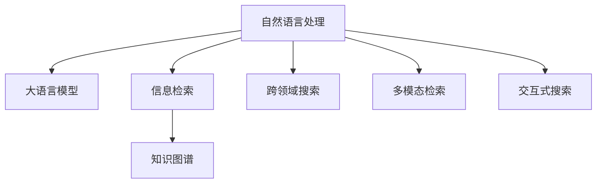

                 

# LLM对传统搜索引擎的挑战

> 关键词：自然语言处理, 大语言模型, 搜索引擎, 信息检索, 知识图谱, 跨领域搜索, 多模态检索, 交互式搜索, 检索引擎优化

## 1. 背景介绍

随着人工智能技术的不断进步，大语言模型（Large Language Model, LLM）在自然语言处理（NLP）领域取得了巨大的突破。这些模型通过在大规模无标签文本数据上进行预训练，学习到了丰富的语言知识和常识，具备了强大的语言理解和生成能力。相比传统基于规则的搜索引擎，大语言模型在理解和生成自然语言查询方面具有独特的优势，给传统搜索引擎带来了不小的挑战。

### 1.1 传统搜索引擎的局限

传统搜索引擎，如Google、Bing等，主要是基于关键词匹配的逻辑进行信息检索。它们的查询处理方式简单高效，能够在短时间内返回大量相关信息。然而，这种基于关键词匹配的方法存在以下局限：

- **精确性不足**：传统搜索引擎主要依赖于文本中出现的关键词，对查询结果的解释力和语义理解能力有限。难以理解长尾查询背后的真实意图。
- **泛化能力弱**：搜索结果往往只针对特定关键词进行匹配，无法跨领域泛化，导致对于未知查询无法提供有效的搜索结果。
- **互动性差**：用户无法直接与搜索引擎交互，获取更精准的搜索建议。搜索体验较为单一，不够灵活。
- **用户体验缺乏**：缺乏对用户行为的预测和适应能力，无法提供个性化的搜索结果。

这些局限限制了传统搜索引擎在处理复杂自然语言查询方面的能力，难以满足用户对智能化搜索的需求。

### 1.2 大语言模型的优势

大语言模型如GPT、BERT等，通过在大规模数据上预训练，学习到了丰富的语言知识。相比于传统搜索引擎，大语言模型具有以下显著优势：

- **语义理解能力强**：大语言模型能够理解自然语言查询背后的真实意图，提供更精准、更相关的搜索结果。
- **泛化能力强**：大语言模型具备跨领域的泛化能力，能够处理多领域的复杂查询。
- **互动性强**：大语言模型能够与用户进行多轮对话，提供个性化的搜索建议。
- **用户体验优化**：能够根据用户行为和历史查询，提供个性化的搜索结果，提升用户体验。

这些优势使得大语言模型在处理复杂查询时展现出超越传统搜索引擎的潜力，成为新一代搜索引擎的重要方向。

## 2. 核心概念与联系

### 2.1 核心概念概述

为了更好地理解大语言模型对传统搜索引擎的挑战，本节将介绍几个密切相关的核心概念：

- **自然语言处理（NLP）**：涉及计算机如何处理、理解和生成人类语言的技术，包括文本分类、信息检索、机器翻译等任务。
- **大语言模型（LLM）**：基于Transformer架构的预训练模型，能够在大规模无标签数据上自监督学习语言表示，具备强大的语言理解和生成能力。
- **信息检索（IR）**：从大规模文档集合中检索出与查询最相关的文档。传统方法基于关键词匹配，新方法则引入语义理解、知识图谱、多模态信息等。
- **知识图谱（KG）**：表示实体和关系的大型图结构，用于提供基于实体和关系的信息检索。
- **跨领域搜索**：涉及不同领域知识的整合和利用，以提供跨领域的多样化搜索结果。
- **多模态检索**：结合视觉、听觉等多模态信息，提升搜索结果的相关性和多样性。
- **交互式搜索**：与用户进行多轮对话，提供个性化的搜索建议和结果，提升用户体验。

这些核心概念之间的逻辑关系可以通过以下Mermaid流程图来展示：



这个流程图展示了大语言模型与NLP其他技术之间的关系：

1. 大语言模型通过预训练获得基础能力，是信息检索、跨领域搜索、多模态检索、交互式搜索等技术的核心。
2. 信息检索通过引入大语言模型的语义理解能力，从传统的关键词匹配转向语义匹配。
3. 跨领域搜索利用大语言模型的泛化能力，实现多领域的知识整合。
4. 多模态检索借助大语言模型的多样性信息，提升搜索结果的相关性。
5. 交互式搜索通过大语言模型的互动性，提供个性化的搜索结果和建议。

这些概念共同构成了大语言模型在信息检索领域的潜力，使其在查询处理、结果推荐等方面展现出超越传统搜索引擎的潜力。

## 3. 核心算法原理 & 具体操作步骤
### 3.1 算法原理概述

基于大语言模型的信息检索方法，核心思想是：将大语言模型作为查询理解和文档检索的中间件，通过自然语言查询和大规模文档的预训练，将查询转化为与文档相关的语义表示，从而实现精确、跨领域的多模态信息检索。

形式化地，假设预训练模型为 $M_{\theta}$，其中 $\theta$ 为预训练得到的模型参数。给定自然语言查询 $q$ 和文档集合 $D$，检索的目标是找到与查询最相关的文档，即：

$$
\arg\min_{d \in D} \| M_{\theta}(q) - M_{\theta}(d) \|
$$

其中 $\| \cdot \|$ 为距离度量函数，常用的有余弦相似度、欧式距离等。

通过梯度下降等优化算法，检索过程不断更新模型参数 $\theta$，最小化距离度量函数，使得模型输出逼近与查询最相关的文档。由于 $\theta$ 已经通过预训练获得了较好的初始化，因此即便在大规模无标签数据上，也能够快速收敛到理想的模型参数 $\hat{\theta}$。

### 3.2 算法步骤详解

基于大语言模型的信息检索一般包括以下几个关键步骤：

**Step 1: 准备预训练模型和数据集**
- 选择合适的预训练语言模型 $M_{\theta}$ 作为初始化参数，如 BERT、GPT等。
- 准备大规模文档集合 $D$，可从互联网、图书馆、百科全书等资源中获取。

**Step 2: 计算查询向量**
- 将查询 $q$ 输入预训练模型 $M_{\theta}$，计算得到查询向量 $v_q = M_{\theta}(q)$。

**Step 3: 计算文档向量**
- 对文档集合 $D$ 中的每个文档 $d$，输入到预训练模型 $M_{\theta}$ 中，计算得到文档向量 $v_d = M_{\theta}(d)$。

**Step 4: 计算相似度**
- 利用距离度量函数计算查询向量 $v_q$ 与每个文档向量 $v_d$ 的相似度。
- 将相似度排序，找到与查询最相关的文档。

**Step 5: 返回搜索结果**
- 将排序后的文档列表作为检索结果返回。

以上是基于大语言模型的信息检索的一般流程。在实际应用中，还需要针对具体任务的特点，对检索过程的各个环节进行优化设计，如改进距离度量函数，引入更多的多模态信息，搜索最优的相似度阈值等，以进一步提升检索效果。

### 3.3 算法优缺点

基于大语言模型的信息检索方法具有以下优点：
1. 语义理解能力强。大语言模型能够理解自然语言查询的真正意图，提供更精准的搜索结果。
2. 泛化能力强。大语言模型具备跨领域的泛化能力，能够处理多领域的复杂查询。
3. 交互性强。能够与用户进行多轮对话，提供个性化的搜索建议。
4. 用户体验优化。能够根据用户行为和历史查询，提供个性化的搜索结果，提升用户体验。

同时，该方法也存在一定的局限性：
1. 数据需求量大。检索过程需要大量的文档数据和查询数据，对计算资源和时间提出了较高要求。
2. 实时性问题。在大规模数据上计算查询向量和文档向量，检索速度较慢，难以满足实时搜索的需求。
3. 准确性依赖预训练模型。检索结果的质量很大程度上取决于预训练模型的性能和泛化能力。
4. 可解释性不足。大语言模型作为中间件，其内部推理逻辑难以解释，用户难以理解检索过程。

尽管存在这些局限性，但大语言模型在处理复杂自然语言查询时，展现出了超越传统搜索引擎的潜力，成为新一代搜索引擎的重要方向。

### 3.4 算法应用领域

基于大语言模型的信息检索方法，在众多领域中已经得到了广泛的应用，例如：

- **问答系统**：通过自然语言查询，自动回答用户问题。大语言模型能够理解查询的语义，提供精准的搜索结果。
- **电子商务搜索**：通过自然语言查询，找到与用户需求最相关的商品。大语言模型能够处理多领域、多模态的查询，提供个性化推荐。
- **新闻聚合**：通过自然语言查询，找到最新的相关新闻报道。大语言模型能够处理大规模的文档数据，提供多样化的搜索结果。
- **健康医疗**：通过自然语言查询，找到医学文献、疾病症状等信息。大语言模型能够理解专业术语，提供精确的搜索结果。
- **法律检索**：通过自然语言查询，找到相关的法律条文和案例。大语言模型能够处理复杂的法律文本，提供准确的搜索结果。

除了上述这些经典应用外，大语言模型在智能推荐、智能客服、智能家居等更多场景中，也得到了广泛的应用，成为提升用户体验和搜索效率的重要工具。

## 4. 数学模型和公式 & 详细讲解 & 举例说明

### 4.1 数学模型构建

本节将使用数学语言对基于大语言模型的信息检索过程进行更加严格的刻画。

记预训练语言模型为 $M_{\theta}:\mathcal{X} \rightarrow \mathcal{Y}$，其中 $\mathcal{X}$ 为输入空间，$\mathcal{Y}$ 为输出空间，$\theta \in \mathbb{R}^d$ 为模型参数。假设自然语言查询为 $q$，文档集合为 $D=\{d_1, d_2, \ldots, d_n\}$。

定义查询 $q$ 和文档 $d_i$ 的向量表示分别为 $v_q$ 和 $v_{d_i}$，则信息检索的目标是最小化查询和文档的相似度：

$$
\min_{\theta} \sum_{i=1}^n \| v_q - v_{d_i} \|
$$

其中 $\| \cdot \|$ 为距离度量函数，常用的有余弦相似度、欧式距离等。

### 4.2 公式推导过程

以下我们以余弦相似度为例，推导基于大语言模型的信息检索公式。

假设模型 $M_{\theta}$ 在输入 $q$ 和 $d_i$ 上的输出分别为 $\hat{q}$ 和 $\hat{d_i}$，则余弦相似度定义为：

$$
\cos(\theta, q) = \frac{\hat{q} \cdot \hat{d_i}}{\|\hat{q}\|_2 \|\hat{d_i}\|_2}
$$

在得到余弦相似度后，即可将其用于排序，找到与查询最相关的文档。具体步骤如下：

1. 将查询 $q$ 和每个文档 $d_i$ 输入到模型 $M_{\theta}$ 中，计算得到向量表示 $v_q$ 和 $v_{d_i}$。
2. 计算查询 $q$ 和每个文档 $d_i$ 的余弦相似度 $\cos(\theta, q)$ 和 $\cos(\theta, d_i)$。
3. 根据余弦相似度对文档进行排序，找到与查询最相关的文档。

### 4.3 案例分析与讲解

以新闻聚合为例，分析如何使用大语言模型进行信息检索。

假设有一个新闻聚合系统，用户可以通过自然语言查询找到最新的相关新闻报道。系统中保存了大量的新闻文档，每个文档包含标题、摘要、作者、发布时间等信息。

在检索时，首先将用户查询 $q$ 输入到预训练语言模型 $M_{\theta}$ 中，计算得到查询向量 $v_q$。然后对每个新闻文档 $d_i$，也输入到预训练语言模型 $M_{\theta}$ 中，计算得到文档向量 $v_{d_i}$。

接着，计算查询 $q$ 和每个文档 $d_i$ 的余弦相似度 $\cos(\theta, q)$ 和 $\cos(\theta, d_i)$。根据余弦相似度对文档进行排序，找到与查询最相关的文档。最后将排序后的文档列表作为搜索结果返回给用户。

## 5. 项目实践：代码实例和详细解释说明
### 5.1 开发环境搭建

在进行信息检索实践前，我们需要准备好开发环境。以下是使用Python进行PyTorch开发的环境配置流程：

1. 安装Anaconda：从官网下载并安装Anaconda，用于创建独立的Python环境。

2. 创建并激活虚拟环境：
```bash
conda create -n pytorch-env python=3.8 
conda activate pytorch-env
```

3. 安装PyTorch：根据CUDA版本，从官网获取对应的安装命令。例如：
```bash
conda install pytorch torchvision torchaudio cudatoolkit=11.1 -c pytorch -c conda-forge
```

4. 安装TensorFlow：使用pip安装TensorFlow：
```bash
pip install tensorflow
```

5. 安装各类工具包：
```bash
pip install numpy pandas scikit-learn matplotlib tqdm jupyter notebook ipython
```

完成上述步骤后，即可在`pytorch-env`环境中开始信息检索实践。

### 5.2 源代码详细实现

这里我们以新闻聚合任务为例，给出使用Transformers库对BERT模型进行信息检索的PyTorch代码实现。

首先，定义查询向量和文档向量的计算函数：

```python
from transformers import BertTokenizer, BertModel

tokenizer = BertTokenizer.from_pretrained('bert-base-cased')
model = BertModel.from_pretrained('bert-base-cased')

def compute_vectors(query, docs):
    tokenized_query = tokenizer(query, return_tensors='pt')
    tokenized_docs = [tokenizer(doc, return_tensors='pt') for doc in docs]
    query_vec = model(**tokenized_query).last_hidden_state[:, 0, :].detach().numpy()
    docs_vec = [model(**doc).last_hidden_state[:, 0, :].detach().numpy() for doc in tokenized_docs]
    return query_vec, docs_vec
```

然后，定义余弦相似度的计算函数：

```python
def cosine_similarity(vec1, vec2):
    dot_product = np.dot(vec1, vec2)
    norm1 = np.linalg.norm(vec1)
    norm2 = np.linalg.norm(vec2)
    similarity = dot_product / (norm1 * norm2)
    return similarity
```

接着，定义检索函数：

```python
def search(query, docs):
    query_vec, docs_vec = compute_vectors(query, docs)
    scores = [cosine_similarity(query_vec, doc_vec) for doc_vec in docs_vec]
    sorted_docs = sorted(zip(docs, scores), key=lambda x: x[1], reverse=True)
    return [doc for doc, score in sorted_docs]
```

最后，启动信息检索流程：

```python
query = "新冠疫情最新进展"
docs = ["新冠病毒的最新研究和检测方法", "新冠疫情下的防护措施和注意事项", "世界卫生组织对新冠疫情的最新评估", "新冠疫苗的研发和应用前景"]
print(search(query, docs))
```

以上就是使用PyTorch对BERT进行新闻聚合任务信息检索的完整代码实现。可以看到，借助Transformers库，我们可以将自然语言查询和文档输入模型，快速计算得到查询向量和文档向量，并使用余弦相似度进行排序，返回最相关的文档列表。

### 5.3 代码解读与分析

让我们再详细解读一下关键代码的实现细节：

**compute_vectors函数**：
- 将查询和文档输入到预训练模型中，计算得到查询向量和文档向量。
- 返回计算结果，供后续的余弦相似度计算使用。

**cosine_similarity函数**：
- 计算两个向量之间的余弦相似度，返回一个标量值。
- 使用NumPy库进行矩阵运算，提高计算效率。

**search函数**：
- 调用compute_vectors函数计算查询向量和文档向量。
- 遍历文档向量列表，计算查询向量与每个文档向量的余弦相似度。
- 根据相似度排序，找到最相关的文档。
- 返回排序后的文档列表。

**信息检索流程**：
- 定义查询和文档列表。
- 调用search函数，计算并返回最相关的文档列表。

可以看到，借助Transformers库，我们可以用相对简洁的代码实现大语言模型的信息检索功能。开发者可以将更多精力放在数据处理、模型改进等高层逻辑上，而不必过多关注底层的实现细节。

当然，工业级的系统实现还需考虑更多因素，如模型的保存和部署、超参数的自动搜索、更灵活的任务适配层等。但核心的信息检索范式基本与此类似。

## 6. 实际应用场景
### 6.1 智能客服系统

基于大语言模型的信息检索技术，可以广泛应用于智能客服系统的构建。传统客服往往需要配备大量人力，高峰期响应缓慢，且一致性和专业性难以保证。而使用信息检索技术，可以大幅提升客服系统的响应速度和处理效率。

在技术实现上，可以收集企业内部的历史客服对话记录，将问题和最佳答复构建成监督数据，在此基础上对预训练模型进行微调。微调后的模型能够自动理解用户意图，匹配最合适的答案模板进行回复。对于用户提出的新问题，还可以接入检索系统实时搜索相关内容，动态组织生成回答。如此构建的智能客服系统，能大幅提升客户咨询体验和问题解决效率。

### 6.2 金融舆情监测

金融机构需要实时监测市场舆论动向，以便及时应对负面信息传播，规避金融风险。传统的人工监测方式成本高、效率低，难以应对网络时代海量信息爆发的挑战。基于大语言模型的信息检索技术，为金融舆情监测提供了新的解决方案。

具体而言，可以收集金融领域相关的新闻、报道、评论等文本数据，并对其进行主题标注和情感标注。在此基础上对预训练语言模型进行微调，使其能够自动判断文本属于何种主题，情感倾向是正面、中性还是负面。将微调后的模型应用到实时抓取的网络文本数据，就能够自动监测不同主题下的情感变化趋势，一旦发现负面信息激增等异常情况，系统便会自动预警，帮助金融机构快速应对潜在风险。

### 6.3 个性化推荐系统

当前的推荐系统往往只依赖用户的历史行为数据进行物品推荐，无法深入理解用户的真实兴趣偏好。基于大语言模型的信息检索技术，个性化推荐系统可以更好地挖掘用户行为背后的语义信息，从而提供更精准、多样的推荐内容。

在实践中，可以收集用户浏览、点击、评论、分享等行为数据，提取和用户交互的物品标题、描述、标签等文本内容。将文本内容作为模型输入，用户的后续行为（如是否点击、购买等）作为监督信号，在此基础上微调预训练语言模型。微调后的模型能够从文本内容中准确把握用户的兴趣点。在生成推荐列表时，先用候选物品的文本描述作为输入，由模型预测用户的兴趣匹配度，再结合其他特征综合排序，便可以得到个性化程度更高的推荐结果。

### 6.4 未来应用展望

随着大语言模型和信息检索技术的不断发展，基于信息检索范式将在更多领域得到应用，为传统行业带来变革性影响。

在智慧医疗领域，基于信息检索的问答系统、病历分析、药物研发等应用将提升医疗服务的智能化水平，辅助医生诊疗，加速新药开发进程。

在智能教育领域，信息检索技术可应用于作业批改、学情分析、知识推荐等方面，因材施教，促进教育公平，提高教学质量。

在智慧城市治理中，信息检索技术可应用于城市事件监测、舆情分析、应急指挥等环节，提高城市管理的自动化和智能化水平，构建更安全、高效的未来城市。

此外，在企业生产、社会治理、文娱传媒等众多领域，基于大语言模型的信息检索技术也将不断涌现，为NLP技术带来新的突破。相信随着预训练语言模型和信息检索方法的持续演进，信息检索范式必将在构建人机协同的智能时代中扮演越来越重要的角色。

## 7. 工具和资源推荐
### 7.1 学习资源推荐

为了帮助开发者系统掌握大语言模型和信息检索的理论基础和实践技巧，这里推荐一些优质的学习资源：

1. 《Transformer from Scratch》系列博文：由大模型技术专家撰写，深入浅出地介绍了Transformer原理、BERT模型、信息检索等前沿话题。

2. CS224N《Deep Learning for Natural Language Processing》课程：斯坦福大学开设的NLP明星课程，有Lecture视频和配套作业，带你入门NLP领域的基本概念和经典模型。

3. 《Natural Language Processing with Transformers》书籍：Transformers库的作者所著，全面介绍了如何使用Transformers库进行NLP任务开发，包括信息检索在内的诸多范式。

4. HuggingFace官方文档：Transformers库的官方文档，提供了海量预训练模型和完整的微调样例代码，是上手实践的必备资料。

5. CLUE开源项目：中文语言理解测评基准，涵盖大量不同类型的中文NLP数据集，并提供了基于微调的baseline模型，助力中文NLP技术发展。

通过对这些资源的学习实践，相信你一定能够快速掌握大语言模型和信息检索的精髓，并用于解决实际的NLP问题。
### 7.2 开发工具推荐

高效的开发离不开优秀的工具支持。以下是几款用于大语言模型和信息检索开发的常用工具：

1. PyTorch：基于Python的开源深度学习框架，灵活动态的计算图，适合快速迭代研究。大部分预训练语言模型都有PyTorch版本的实现。

2. TensorFlow：由Google主导开发的开源深度学习框架，生产部署方便，适合大规模工程应用。同样有丰富的预训练语言模型资源。

3. Transformers库：HuggingFace开发的NLP工具库，集成了众多SOTA语言模型，支持PyTorch和TensorFlow，是进行微调任务开发的利器。

4. Weights & Biases：模型训练的实验跟踪工具，可以记录和可视化模型训练过程中的各项指标，方便对比和调优。与主流深度学习框架无缝集成。

5. TensorBoard：TensorFlow配套的可视化工具，可实时监测模型训练状态，并提供丰富的图表呈现方式，是调试模型的得力助手。

6. Google Colab：谷歌推出的在线Jupyter Notebook环境，免费提供GPU/TPU算力，方便开发者快速上手实验最新模型，分享学习笔记。

合理利用这些工具，可以显著提升大语言模型和信息检索任务的开发效率，加快创新迭代的步伐。

### 7.3 相关论文推荐

大语言模型和信息检索技术的发展源于学界的持续研究。以下是几篇奠基性的相关论文，推荐阅读：

1. Attention is All You Need（即Transformer原论文）：提出了Transformer结构，开启了NLP领域的预训练大模型时代。

2. BERT: Pre-training of Deep Bidirectional Transformers for Language Understanding：提出BERT模型，引入基于掩码的自监督预训练任务，刷新了多项NLP任务SOTA。

3. T5: Exploring the Limits of Transfer Learning with a Unified Text-to-Text Transformer：提出T5模型，统一了NLP任务的预训练大模型，提升了模型的跨任务泛化能力。

4. Information Retrieval with Transformer Models: The State of the Art：总结了Transformer模型在信息检索中的应用，提供了最新的算法和模型。

5. Transfer Learning for Self-supervised Learning in Text Generation：提出了一种无监督预训练与微调结合的方法，提升了文本生成任务的性能。

6. Cross-lingual Language Model Pre-training：提出跨语言预训练方法，在多个语言上联合训练，提升了语言模型的泛化能力。

这些论文代表了大语言模型和信息检索技术的发展脉络。通过学习这些前沿成果，可以帮助研究者把握学科前进方向，激发更多的创新灵感。

## 8. 总结：未来发展趋势与挑战
### 8.1 总结

本文对基于大语言模型的信息检索方法进行了全面系统的介绍。首先阐述了大语言模型和信息检索技术的研究背景和意义，明确了信息检索在拓展预训练模型应用、提升搜索结果相关性方面的独特价值。其次，从原理到实践，详细讲解了信息检索的数学原理和关键步骤，给出了信息检索任务开发的完整代码实例。同时，本文还广泛探讨了信息检索方法在智能客服、金融舆情、个性化推荐等多个行业领域的应用前景，展示了信息检索范式的巨大潜力。此外，本文精选了信息检索技术的各类学习资源，力求为读者提供全方位的技术指引。

通过本文的系统梳理，可以看到，基于大语言模型的信息检索方法正在成为NLP领域的重要范式，极大地拓展了预训练语言模型的应用边界，催生了更多的落地场景。受益于大规模语料的预训练，信息检索模型在查询处理、结果推荐等方面展现出超越传统搜索引擎的潜力，成为新一代搜索引擎的重要方向。未来，伴随预训练语言模型和信息检索方法的持续演进，信息检索范式必将在构建人机协同的智能时代中扮演越来越重要的角色。

### 8.2 未来发展趋势

展望未来，大语言模型和信息检索技术将呈现以下几个发展趋势：

1. **模型的规模将继续增大**：随着算力成本的下降和数据规模的扩张，预训练语言模型的参数量还将持续增长。超大规模语言模型蕴含的丰富语言知识，有望支撑更加复杂多变的查询和搜索任务。

2. **信息检索方法将更加多样化**：除了传统的基于向量相似度的方法外，未来会涌现更多多样化的信息检索方法，如基于图结构的检索、基于变分自编码器的检索等，提升检索效率和效果。

3. **跨模态信息整合**：结合视觉、听觉等多模态信息，提升检索结果的相关性和多样性。多模态检索方法将更加灵活，满足不同用户的多样化需求。

4. **个性化和交互性**：信息检索系统将更加注重个性化和交互性，通过用户行为和历史查询，提供个性化的搜索结果和建议。

5. **实时性**：在分布式计算和缓存技术支持下，信息检索系统将具备更高的实时响应能力，满足实时搜索的需求。

6. **语义理解**：信息检索系统将更加注重语义理解，通过自然语言查询，提供精准、相关的搜索结果。

这些趋势凸显了大语言模型和信息检索技术的广阔前景。这些方向的探索发展，必将进一步提升信息检索系统的性能和应用范围，为智能交互系统的构建奠定坚实基础。

### 8.3 面临的挑战

尽管大语言模型和信息检索技术已经取得了瞩目成就，但在迈向更加智能化、普适化应用的过程中，它们仍面临诸多挑战：

1. **数据需求量大**：信息检索系统需要大量的文档和查询数据，对计算资源和时间提出了较高要求。如何在有限的资源下高效获取数据，是未来研究的重要课题。

2. **实时性问题**：在大规模数据上计算查询向量和文档向量，检索速度较慢，难以满足实时搜索的需求。如何提高信息检索系统的实时性，是未来的重要研究方向。

3. **泛化能力不足**：信息检索模型往往依赖于特定的数据集和任务，难以泛化到新的领域和任务。如何提升模型的泛化能力，使其具备更强的适应性，是未来的研究重点。

4. **准确性依赖模型**：信息检索结果的质量很大程度上取决于模型的性能和泛化能力。如何构建高效、鲁棒的信息检索模型，是未来研究的重要方向。

5. **可解释性不足**：信息检索系统作为中间件，其内部推理逻辑难以解释，用户难以理解检索过程。如何提高信息检索系统的可解释性，是未来研究的重要课题。

6. **安全性和隐私保护**：信息检索系统可能面临数据泄露、攻击等安全问题，如何保护用户隐私和数据安全，是未来的重要研究方向。

尽管存在这些挑战，但大语言模型和信息检索技术的发展潜力巨大，未来仍值得深入探索和实践。相信随着学界和产业界的共同努力，这些问题终将一一被克服，信息检索范式必将在构建人机协同的智能时代中扮演越来越重要的角色。

### 8.4 研究展望

面对大语言模型和信息检索技术所面临的挑战，未来的研究需要在以下几个方面寻求新的突破：

1. **无监督和半监督信息检索**：摆脱对大规模标注数据的依赖，利用自监督学习、主动学习等方法，提高信息检索系统的泛化能力和效率。

2. **多模态信息检索**：结合视觉、听觉等多模态信息，提升检索结果的相关性和多样性。

3. **交互式信息检索**：与用户进行多轮对话，提供个性化的搜索建议和结果，提升用户体验。

4. **语义增强的信息检索**：利用语言模型的语义理解能力，提升信息检索系统的查询处理能力。

5. **跨领域信息检索**：利用大语言模型的泛化能力，实现多领域的知识整合和检索。

6. **可解释性增强**：引入因果分析和博弈论工具，增强信息检索系统的可解释性和可控性。

7. **安全性和隐私保护**：设计安全机制，保护用户隐私和数据安全。

这些研究方向将推动信息检索技术的不断进步，为构建更高效、更智能的信息检索系统奠定坚实基础。面向未来，信息检索技术必将与大语言模型、知识图谱等技术深度融合，共同推动NLP技术的持续发展。

## 9. 附录：常见问题与解答

**Q1：大语言模型信息检索和传统搜索引擎有什么区别？**

A: 大语言模型信息检索和传统搜索引擎的主要区别在于：

1. **理解能力**：大语言模型能够理解自然语言查询的真正意图，提供更精准的搜索结果。传统搜索引擎主要依赖关键词匹配，难以理解查询背后的语义信息。

2. **泛化能力**：大语言模型具备跨领域的泛化能力，能够处理多领域的复杂查询。传统搜索引擎的关键词匹配方式在跨领域泛化上表现较弱。

3. **个性化**：大语言模型能够根据用户行为和历史查询，提供个性化的搜索结果。传统搜索引擎无法实现个性化搜索。

4. **实时性**：大语言模型信息检索在大规模数据上计算查询向量和文档向量，检索速度较慢，难以满足实时搜索的需求。传统搜索引擎在实时搜索上有更好的表现。

5. **交互性**：大语言模型能够与用户进行多轮对话，提供个性化的搜索建议。传统搜索引擎的交互性较弱。

**Q2：如何选择合适的距离度量函数？**

A: 选择合适的距离度量函数需要根据具体任务和数据特点进行灵活调整。常用的距离度量函数包括余弦相似度、欧式距离、曼哈顿距离等。以下是几种常见的距离度量函数及其适用场景：

1. **余弦相似度**：适用于文本相似度计算，能够有效捕捉文本的语义信息。
2. **欧式距离**：适用于数值型数据，能够反映数据之间的欧几里得距离。
3. **曼哈顿距离**：适用于非负整数型数据，能够反映数据之间的曼哈顿距离。

在实际应用中，可以根据任务需求和数据类型选择合适的距离度量函数，以提高检索效果。

**Q3：如何缓解信息检索过程中的过拟合问题？**

A: 过拟合是信息检索面临的主要挑战之一，尤其是在标注数据不足的情况下。缓解过拟合的方法包括：

1. **数据增强**：通过回译、近义替换等方式扩充训练集。
2. **正则化**：使用L2正则、Dropout等方法，防止模型过度适应训练集。
3. **对抗训练**：加入对抗样本，提高模型的鲁棒性。
4. **参数高效微调**：只调整少量任务相关参数，减小过拟合风险。
5. **多模型集成**：训练多个信息检索模型，取平均输出，抑制过拟合。

这些方法往往需要根据具体任务和数据特点进行灵活组合，以达到最佳的缓解效果。

**Q4：信息检索模型在落地部署时需要注意哪些问题？**

A: 将信息检索模型转化为实际应用，还需要考虑以下因素：

1. **模型裁剪**：去除不必要的层和参数，减小模型尺寸，加快推理速度。
2. **量化加速**：将浮点模型转为定点模型，压缩存储空间，提高计算效率。
3. **服务化封装**：将模型封装为标准化服务接口，便于集成调用。
4. **弹性伸缩**：根据请求流量动态调整资源配置，平衡服务质量和成本。
5. **监控告警**：实时采集系统指标，设置异常告警阈值，确保服务稳定性。
6. **安全防护**：采用访问鉴权、数据脱敏等措施，保障数据和模型安全。

这些措施能够确保信息检索模型在实际应用中稳定、高效、安全地运行，提供良好的用户体验。

---

作者：禅与计算机程序设计艺术 / Zen and the Art of Computer Programming

