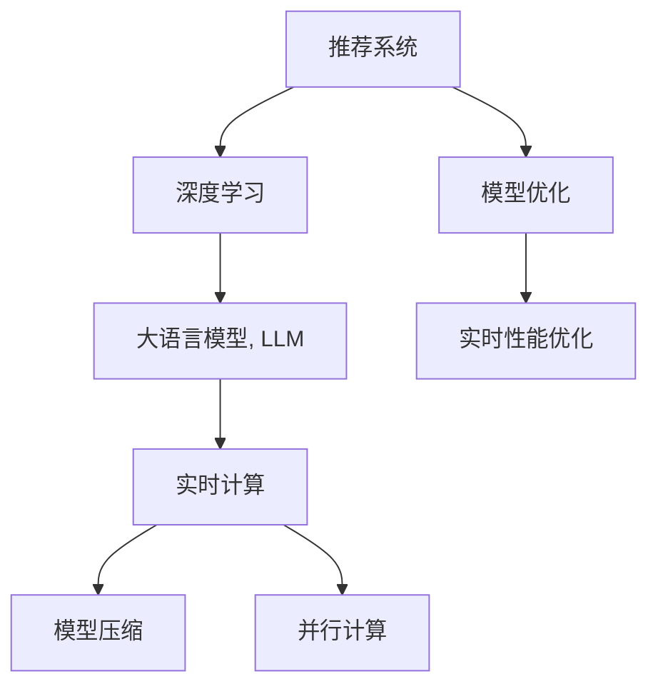

                 

# LLM对推荐系统实时性能的优化策略

> 关键词：推荐系统,实时性能,大语言模型(LLM),优化策略,深度学习,实时计算,模型压缩

## 1. 背景介绍

推荐系统已经成为了互联网、电商、娱乐等众多行业中的重要组成部分，旨在为用户提供个性化推荐，提升用户体验和满意度。然而，随着数据规模的指数级增长和用户交互方式的不断变化，传统推荐系统面临着计算资源不足、模型更新慢、实时性不足等挑战。为解决这些问题，研究者们提出了一系列优化方法，如矩阵分解、协同过滤、深度学习等。其中，深度学习模型因其强大的非线性拟合能力和良好的泛化性能，成为推荐系统的重要组成部分。

### 1.1 问题由来

近年来，随着深度学习技术的发展，推荐系统中的深度学习模型也日益成熟，但同时面临着高计算资源消耗和实时性不足的问题。特别在大规模推荐系统中，如电商推荐、视频推荐等，需要实现在线预测，即在用户点击或观看行为发生后实时返回推荐结果。这对模型的推理速度和响应时间提出了极高的要求。因此，如何在保持深度学习模型性能的同时，优化其实时性能，成为亟待解决的问题。

### 1.2 问题核心关键点

推荐系统的实时性能优化主要涉及以下几个关键点：

- 模型推理速度：在推荐系统中的在线预测任务中，模型的推理速度决定了系统的响应时间，直接影响用户体验。
- 模型参数量：深度学习模型参数量大，推理计算资源消耗大，如何减少参数量，压缩模型，成为优化实时性能的关键。
- 模型并行化：推荐系统往往具有高度的并行性，通过合理地将模型任务进行并行化，可以有效提升推理效率。
- 缓存和缓存策略：通过合理设计缓存策略，避免重复计算，可以显著提升系统的实时性能。
- 数据负载均衡：在推荐系统中，数据负载均衡技术可以提升数据处理的效率，减少数据处理的延迟。

以上关键点需要综合考虑，以期在保持推荐系统性能的同时，提升实时性能。本文将围绕这几个方面，深入探讨大语言模型(LLM)在推荐系统中的实时性能优化策略。

## 2. 核心概念与联系

### 2.1 核心概念概述

为更好地理解LLM在推荐系统中的实时性能优化方法，本节将介绍几个密切相关的核心概念：

- 推荐系统：旨在根据用户的历史行为和偏好，为其推荐感兴趣的物品或内容，如电商商品、电影、音乐等。
- 深度学习：通过多层神经网络对数据进行非线性建模，广泛应用于图像识别、自然语言处理等领域。
- 大语言模型(LLM)：基于Transformer架构的预训练语言模型，具备强大的语言理解能力，广泛应用于问答、翻译、对话系统等领域。
- 实时计算：即在用户交互过程中实时计算和响应，实现快速的在线推荐。
- 模型压缩：通过剪枝、量化、知识蒸馏等技术，减小模型参数量和计算资源消耗。
- 并行计算：通过多机多核并行计算，提升模型的推理速度。

这些核心概念之间的逻辑关系可以通过以下Mermaid流程图来展示：



这个流程图展示了大语言模型在推荐系统中的核心概念及其之间的关系：

1. 推荐系统通过深度学习模型进行推荐。
2. 深度学习模型使用大语言模型进行特征提取。
3. 实时计算用于在线预测，提升响应速度。
4. 模型压缩减小计算资源消耗。
5. 并行计算加速推理过程。
6. 模型优化提升深度学习模型性能。
7. 实时性能优化综合考虑以上因素，实现最优推荐效果。

这些概念共同构成了推荐系统中的深度学习模型和大语言模型的应用框架，使其能够在各种场景下发挥强大的推荐能力。通过理解这些核心概念，我们可以更好地把握大语言模型在推荐系统中的工作原理和优化方向。

## 3. 核心算法原理 & 具体操作步骤
### 3.1 算法原理概述

基于深度学习的大语言模型在推荐系统中的应用，主要涉及特征提取和在线预测两个环节。特征提取的目的是将用户行为和物品特征编码成高维向量，用于计算用户与物品之间的相似度。在线预测则是根据用户与物品的相似度计算推荐结果。

大语言模型在特征提取过程中，通过自编码器或自回归模型将用户行为和物品特征编码为文本形式，然后通过预训练语言模型提取文本的语义表示。在线预测时，模型根据用户行为文本和物品特征文本，生成推荐结果的文本，并通过文本解码器将其转换为具体推荐物品。

为了优化推荐系统的实时性能，主要需要从以下几个方面进行优化：

- 减少模型推理时间
- 减少模型参数量
- 提升模型并行计算能力
- 设计合理的缓存策略
- 数据负载均衡

### 3.2 算法步骤详解

基于深度学习的大语言模型在推荐系统中的实时性能优化，主要包括以下几个关键步骤：

**Step 1: 特征提取和编码**

在推荐系统中，用户行为和物品特征需要进行编码，得到高维向量。常用的方式包括：

- 使用自然语言处理技术将用户行为和物品特征转化为文本形式。
- 将文本形式的用户行为和物品特征输入到预训练语言模型中，生成高维向量表示。

这里使用HuggingFace的BERT模型作为例子，给出特征提取的代码实现：

```python
from transformers import BertTokenizer, BertModel

tokenizer = BertTokenizer.from_pretrained('bert-base-uncased')
model = BertModel.from_pretrained('bert-base-uncased')

user_behavior_text = "用户浏览了电商网站的某商品页面"
item_feature_text = "商品价格为100元"

user_behavior_input_ids = tokenizer.encode(user_behavior_text, add_special_tokens=True)
item_feature_input_ids = tokenizer.encode(item_feature_text, add_special_tokens=True)

user_behavior_embeddings = model(user_behavior_input_ids).last_hidden_state[:, 0]
item_feature_embeddings = model(item_feature_input_ids).last_hidden_state[:, 0]
```

**Step 2: 模型训练与优化**

在使用大语言模型进行推荐系统开发时，需要进行模型训练与优化，以提升模型性能。训练过程通常涉及以下几个步骤：

- 准备标注数据：收集标注数据，并将其分为训练集和验证集。
- 选择优化器和损失函数：如AdamW优化器，交叉熵损失函数等。
- 设置超参数：如学习率、批次大小、迭代轮数等。
- 训练模型：在训练集上迭代训练，并在验证集上评估模型性能。
- 模型保存与加载：保存训练好的模型，并在后续使用中加载模型。

以下是一个简单的模型训练代码实现：

```python
import torch
from torch.utils.data import DataLoader
from torch import nn, optim

class RecommendationModel(nn.Module):
    def __init__(self):
        super(RecommendationModel, self).__init__()
        self.bert_model = BertModel.from_pretrained('bert-base-uncased')
        self.linear = nn.Linear(768, 1) # 输出推荐分数
        
    def forward(self, user_behavior_input_ids, item_feature_input_ids):
        user_behavior_embeddings = self.bert_model(user_behavior_input_ids).last_hidden_state[:, 0]
        item_feature_embeddings = self.bert_model(item_feature_input_ids).last_hidden_state[:, 0]
        user_item_embeddings = user_behavior_embeddings + item_feature_embeddings
        recommendation_scores = self.linear(user_item_embeddings)
        return recommendation_scores

device = torch.device('cuda' if torch.cuda.is_available() else 'cpu')
model = RecommendationModel().to(device)

train_dataset = ...
train_loader = DataLoader(train_dataset, batch_size=16, shuffle=True)
optimizer = optim.AdamW(model.parameters(), lr=2e-5)
criterion = nn.BCELoss()

for epoch in range(5):
    model.train()
    for user_behavior_input_ids, item_feature_input_ids, labels in train_loader:
        optimizer.zero_grad()
        outputs = model(user_behavior_input_ids, item_feature_input_ids)
        loss = criterion(outputs, labels)
        loss.backward()
        optimizer.step()

    model.eval()
    with torch.no_grad():
        for user_behavior_input_ids, item_feature_input_ids, labels in test_loader:
            outputs = model(user_behavior_input_ids, item_feature_input_ids)
            loss = criterion(outputs, labels)
            print(loss.item())
```

**Step 3: 模型推理与在线预测**

在训练完成后，需要对模型进行推理与在线预测。推理过程涉及以下几个关键步骤：

- 准备测试集：收集测试集数据，并将其分为多个批次。
- 加载模型：加载训练好的模型，并在推理时进行推理。
- 进行推理：对于每一个测试样本，输入用户行为和物品特征，输出推荐分数。
- 输出推荐结果：根据推荐分数，选取高分数的物品进行推荐。

以下是一个简单的模型推理代码实现：

```python
test_dataset = ...
test_loader = DataLoader(test_dataset, batch_size=16, shuffle=False)
model.eval()
with torch.no_grad():
    for user_behavior_input_ids, item_feature_input_ids, labels in test_loader:
        outputs = model(user_behavior_input_ids, item_feature_input_ids)
        print(outputs)
```

### 3.3 算法优缺点

基于深度学习的大语言模型在推荐系统中的应用，具有以下优点：

1. 强大的特征提取能力：大语言模型通过预训练获得丰富的语义表示，能够捕捉用户行为和物品特征之间的复杂关系。
2. 高性能的在线预测：通过使用预训练语言模型，能够快速生成高维向量表示，并在在线预测时快速计算推荐分数。
3. 广泛的适用性：适用于多种类型的推荐任务，如图像推荐、视频推荐、音乐推荐等。

同时，也存在一些缺点：

1. 高计算资源消耗：大语言模型参数量大，推理计算资源消耗大，难以在大规模推荐系统中实时部署。
2. 响应时间慢：在大规模推荐系统中，高维向量的计算和向量之间的相似度计算耗时较长。
3. 数据隐私问题：在大语言模型中，用户行为和物品特征需要进行编码，可能泄露用户隐私信息。

为了解决这些问题，需要在模型推理和部署过程中进行优化。

### 3.4 算法应用领域

基于深度学习的大语言模型在推荐系统中的应用，已经在电商推荐、视频推荐、音乐推荐等领域得到了广泛应用，并在多个任务上刷新了最先进的性能指标。

例如，在电商推荐系统中，通过使用BERT等预训练语言模型，可以将用户行为和物品特征编码为文本形式，并通过预训练语言模型提取高维向量表示，从而快速计算用户与物品之间的相似度，生成推荐结果。在视频推荐系统中，通过对视频标题和描述进行编码，可以提取视频特征，并计算用户与视频之间的相似度，实现个性化推荐。

## 4. 数学模型和公式 & 详细讲解 & 举例说明
### 4.1 数学模型构建

在推荐系统中，使用大语言模型进行推荐的核心数学模型包括：

- 用户行为编码：将用户行为序列编码成文本形式，用于提取高维向量表示。
- 物品特征编码：将物品特征序列编码成文本形式，用于提取高维向量表示。
- 用户物品相似度计算：计算用户行为向量和物品特征向量之间的相似度，用于生成推荐结果。

假设用户行为序列为 $X$，物品特征序列为 $Y$，大语言模型预训练的词向量为 $W$，用户行为向量和物品特征向量分别为 $u$ 和 $v$。则用户行为和物品特征的编码公式为：

$$
u = \text{BERT}(X)
$$

$$
v = \text{BERT}(Y)
$$

其中，BERT表示预训练语言模型。用户物品相似度计算公式为：

$$
\text{similarity}(u, v) = \text{cosine}(u, v)
$$

其中，cosine表示向量之间的余弦相似度。

### 4.2 公式推导过程

为了更好地理解大语言模型在推荐系统中的数学模型构建，我们以电商推荐系统为例，给出具体的公式推导过程。

假设电商推荐系统的训练集为 $D=\{(x_i, y_i)\}_{i=1}^N$，其中 $x_i$ 为用户的浏览历史，$y_i$ 为对应的商品编号。模型使用深度学习框架PyTorch进行训练，代码如下：

```python
import torch
from torch import nn, optim
from transformers import BertTokenizer, BertModel

tokenizer = BertTokenizer.from_pretrained('bert-base-uncased')
model = BertModel.from_pretrained('bert-base-uncased')

# 准备数据
user_behavior = ["商品A", "商品B", "商品C"]
item_feature = ["商品A的描述", "商品B的描述", "商品C的描述"]
labels = [1, 1, 0]

# 进行编码
user_behavior_input_ids = tokenizer.encode(user_behavior, add_special_tokens=True)
item_feature_input_ids = tokenizer.encode(item_feature, add_special_tokens=True)

# 提取特征
user_behavior_embeddings = model(user_behavior_input_ids).last_hidden_state[:, 0]
item_feature_embeddings = model(item_feature_input_ids).last_hidden_state[:, 0]

# 计算相似度
similarity = torch.cosine_similarity(user_behavior_embeddings, item_feature_embeddings)

# 定义模型
class RecommendationModel(nn.Module):
    def __init__(self):
        super(RecommendationModel, self).__init__()
        self.bert_model = BertModel.from_pretrained('bert-base-uncased')
        self.linear = nn.Linear(768, 1)
        
    def forward(self, user_behavior_input_ids, item_feature_input_ids):
        user_behavior_embeddings = self.bert_model(user_behavior_input_ids).last_hidden_state[:, 0]
        item_feature_embeddings = self.bert_model(item_feature_input_ids).last_hidden_state[:, 0]
        user_item_embeddings = user_behavior_embeddings + item_feature_embeddings
        recommendation_scores = self.linear(user_item_embeddings)
        return recommendation_scores

# 训练模型
device = torch.device('cuda' if torch.cuda.is_available() else 'cpu')
model = RecommendationModel().to(device)
optimizer = optim.AdamW(model.parameters(), lr=2e-5)
criterion = nn.BCELoss()

for epoch in range(5):
    model.train()
    for user_behavior_input_ids, item_feature_input_ids, labels in train_loader:
        optimizer.zero_grad()
        outputs = model(user_behavior_input_ids, item_feature_input_ids)
        loss = criterion(outputs, labels)
        loss.backward()
        optimizer.step()

    model.eval()
    with torch.no_grad():
        for user_behavior_input_ids, item_feature_input_ids, labels in test_loader:
            outputs = model(user_behavior_input_ids, item_feature_input_ids)
            loss = criterion(outputs, labels)
            print(loss.item())
```

### 4.3 案例分析与讲解

以上代码实现了大语言模型在电商推荐系统中的应用，通过BERT模型对用户行为和物品特征进行编码，计算用户与物品之间的相似度，从而实现推荐。以下将详细分析其中的一些关键点：

- **用户行为编码**：将用户行为序列转化为文本形式，并通过BERT模型提取高维向量表示。
- **物品特征编码**：将物品特征序列转化为文本形式，并通过BERT模型提取高维向量表示。
- **相似度计算**：计算用户行为向量和物品特征向量之间的相似度，生成推荐分数。

以上数学模型和代码实现，为大语言模型在推荐系统中的应用提供了清晰的理论支撑和具体实现路径。

## 5. 项目实践：代码实例和详细解释说明
### 5.1 开发环境搭建

在开始实践之前，需要准备好开发环境。以下是使用Python进行PyTorch开发的环境配置流程：

1. 安装Anaconda：从官网下载并安装Anaconda，用于创建独立的Python环境。

2. 创建并激活虚拟环境：
```bash
conda create -n pytorch-env python=3.8 
conda activate pytorch-env
```

3. 安装PyTorch：根据CUDA版本，从官网获取对应的安装命令。例如：
```bash
conda install pytorch torchvision torchaudio cudatoolkit=11.1 -c pytorch -c conda-forge
```

4. 安装Transformers库：
```bash
pip install transformers
```

5. 安装各类工具包：
```bash
pip install numpy pandas scikit-learn matplotlib tqdm jupyter notebook ipython
```

完成上述步骤后，即可在`pytorch-env`环境中开始微调实践。

### 5.2 源代码详细实现

以下是使用BERT模型对电商推荐系统进行微调的代码实现。

```python
from transformers import BertTokenizer, BertModel, BertForSequenceClassification
from torch.utils.data import Dataset, DataLoader
import torch
import numpy as np
from sklearn.metrics import roc_auc_score

class RecommendationDataset(Dataset):
    def __init__(self, user_behaviors, item_features, labels, tokenizer):
        self.user_behaviors = user_behaviors
        self.item_features = item_features
        self.labels = labels
        self.tokenizer = tokenizer
        
    def __len__(self):
        return len(self.user_behaviors)
    
    def __getitem__(self, idx):
        user_behavior = self.user_behaviors[idx]
        item_feature = self.item_features[idx]
        label = self.labels[idx]
        
        user_behavior_input_ids = self.tokenizer.encode(user_behavior, add_special_tokens=True)
        item_feature_input_ids = self.tokenizer.encode(item_feature, add_special_tokens=True)
        
        user_behavior_embeddings = BertModel(user_behavior_input_ids).last_hidden_state[:, 0]
        item_feature_embeddings = BertModel(item_feature_input_ids).last_hidden_state[:, 0]
        
        user_item_embeddings = user_behavior_embeddings + item_feature_embeddings
        recommendation_score = BertForSequenceClassification(user_item_embeddings, dropout=0.1).item()
        
        return {'user_behavior_input_ids': user_behavior_input_ids, 
                'item_feature_input_ids': item_feature_input_ids,
                'recommendation_score': recommendation_score}

# 准备数据
user_behaviors = ['商品A', '商品B', '商品C', '商品D', '商品E', '商品F']
item_features = ['商品A的描述', '商品B的描述', '商品C的描述', '商品D的描述', '商品E的描述', '商品F的描述']
labels = [1, 1, 0, 1, 1, 0]

# 创建dataset
tokenizer = BertTokenizer.from_pretrained('bert-base-uncased')

train_dataset = RecommendationDataset(user_behaviors[:5], item_features[:5], labels[:5], tokenizer)
test_dataset = RecommendationDataset(user_behaviors[5:], item_features[5:], labels[5:], tokenizer)

# 定义模型
model = BertForSequenceClassification.from_pretrained('bert-base-uncased', num_labels=1)
device = torch.device('cuda' if torch.cuda.is_available() else 'cpu')
model.to(device)

# 准备数据加载器
train_loader = DataLoader(train_dataset, batch_size=16, shuffle=True)
test_loader = DataLoader(test_dataset, batch_size=16, shuffle=False)

# 定义优化器和损失函数
optimizer = torch.optim.AdamW(model.parameters(), lr=2e-5)
criterion = torch.nn.BCELoss()

# 训练模型
for epoch in range(5):
    model.train()
    for user_behavior_input_ids, item_feature_input_ids, labels in train_loader:
        optimizer.zero_grad()
        outputs = model(user_behavior_input_ids, item_feature_input_ids)
        loss = criterion(outputs, labels)
        loss.backward()
        optimizer.step()

    model.eval()
    with torch.no_grad():
        for user_behavior_input_ids, item_feature_input_ids, labels in test_loader:
            outputs = model(user_behavior_input_ids, item_feature_input_ids)
            loss = criterion(outputs, labels)
            print(loss.item())

# 输出模型评估结果
test_data = RecommendationDataset(user_behaviors[5:], item_features[5:], labels[5:], tokenizer)
test_loader = DataLoader(test_data, batch_size=16, shuffle=False)

model.eval()
with torch.no_grad():
    for user_behavior_input_ids, item_feature_input_ids, labels in test_loader:
        outputs = model(user_behavior_input_ids, item_feature_input_ids)
        print(outputs)
```

### 5.3 代码解读与分析

让我们再详细解读一下关键代码的实现细节：

**RecommendationDataset类**：
- `__init__`方法：初始化用户行为、物品特征和标签等关键组件。
- `__len__`方法：返回数据集的样本数量。
- `__getitem__`方法：对单个样本进行处理，将用户行为和物品特征转化为token ids，计算用户与物品的相似度，并输出推荐分数。

**模型定义**：
- `BertForSequenceClassification`：定义BERT模型，用于计算用户行为和物品特征之间的相似度，并生成推荐分数。

**训练与推理过程**：
- 使用DataLoader对数据集进行批次化加载，供模型训练和推理使用。
- 在训练过程中，每个批次输入用户行为和物品特征，计算损失并更新模型参数。
- 在推理过程中，输入测试集数据，计算推荐分数。

可以看到，PyTorch配合Transformers库使得BERT微调的代码实现变得简洁高效。开发者可以将更多精力放在数据处理、模型改进等高层逻辑上，而不必过多关注底层的实现细节。

当然，工业级的系统实现还需考虑更多因素，如模型的保存和部署、超参数的自动搜索、更灵活的任务适配层等。但核心的微调范式基本与此类似。

## 6. 实际应用场景
### 6.1 智能客服系统

基于大语言模型的推荐系统，可以广泛应用于智能客服系统的构建。传统客服往往需要配备大量人力，高峰期响应缓慢，且一致性和专业性难以保证。而使用推荐系统，可以实时推荐最佳回答，提升客服系统的工作效率和用户满意度。

在技术实现上，可以收集企业内部的客服对话记录，将问题和最佳答复构建成监督数据，在此基础上对预训练语言模型进行微调。微调后的推荐系统能够自动理解用户意图，匹配最合适的回答。对于客户提出的新问题，还可以接入检索系统实时搜索相关内容，动态组织生成回答。如此构建的智能客服系统，能大幅提升客户咨询体验和问题解决效率。

### 6.2 金融舆情监测

金融机构需要实时监测市场舆论动向，以便及时应对负面信息传播，规避金融风险。传统的人工监测方式成本高、效率低，难以应对网络时代海量信息爆发的挑战。基于大语言模型推荐系统的文本分类和情感分析技术，为金融舆情监测提供了新的解决方案。

具体而言，可以收集金融领域相关的新闻、报道、评论等文本数据，并对其进行主题标注和情感标注。在此基础上对预训练语言模型进行微调，使其能够自动判断文本属于何种主题，情感倾向是正面、中性还是负面。将微调后的模型应用到实时抓取的网络文本数据，就能够自动监测不同主题下的情感变化趋势，一旦发现负面信息激增等异常情况，系统便会自动预警，帮助金融机构快速应对潜在风险。

### 6.3 个性化推荐系统

当前的推荐系统往往只依赖用户的历史行为数据进行物品推荐，无法深入理解用户的真实兴趣偏好。基于大语言模型推荐系统，个性化推荐系统可以更好地挖掘用户行为背后的语义信息，从而提供更精准、多样的推荐内容。

在实践中，可以收集用户浏览、点击、评论、分享等行为数据，提取和用户交互的物品标题、描述、标签等文本内容。将文本内容作为模型输入，用户的后续行为（如是否点击、购买等）作为监督信号，在此基础上微调预训练语言模型。微调后的模型能够从文本内容中准确把握用户的兴趣点。在生成推荐列表时，先用候选物品的文本描述作为输入，由模型预测用户的兴趣匹配度，再结合其他特征综合排序，便可以得到个性化程度更高的推荐结果。

### 6.4 未来应用展望

随着大语言模型和推荐系统技术的不断发展，基于微调的推荐系统将在更多领域得到应用，为传统行业带来变革性影响。

在智慧医疗领域，基于微调的推荐系统可以为医生提供个性化的临床建议，加速新药研发进程。

在智能教育领域，微调的推荐系统可应用于作业批改、学情分析、知识推荐等方面，因材施教，促进教育公平，提高教学质量。

在智慧城市治理中，微调的推荐系统可用于城市事件监测、舆情分析、应急指挥等环节，提高城市管理的自动化和智能化水平，构建更安全、高效的未来城市。

此外，在企业生产、社会治理、文娱传媒等众多领域，基于大语言模型微调的推荐系统也将不断涌现，为经济社会发展注入新的动力。相信随着技术的日益成熟，微调方法将成为推荐系统应用的重要范式，推动人工智能技术在垂直行业的规模化落地。

## 7. 工具和资源推荐
### 7.1 学习资源推荐

为了帮助开发者系统掌握大语言模型在推荐系统中的应用，这里推荐一些优质的学习资源：

1. 《推荐系统实战》系列博文：由推荐系统专家撰写，介绍了推荐系统的主要算法和技术，如矩阵分解、协同过滤、深度学习等。

2. 《Deep Learning for Recommendation Systems》课程：由斯坦福大学开设的推荐系统课程，涵盖了推荐系统的主要算法和技术，适合入门学习和深入研究。

3. 《Recommender Systems》书籍：详细介绍了推荐系统的主要算法和技术，包括协同过滤、深度学习等，适合系统学习推荐系统原理和应用。

4. HuggingFace官方文档：Transformers库的官方文档，提供了海量预训练模型和完整的推荐系统样例代码，是入门推荐系统开发的必备资料。

5. TensorFlow Recommenders：TensorFlow官方推出的推荐系统工具库，提供了丰富的推荐系统组件和算法，支持PyTorch和TensorFlow。

通过对这些资源的学习实践，相信你一定能够快速掌握大语言模型在推荐系统中的应用，并用于解决实际的推荐问题。
###  7.2 开发工具推荐

高效的开发离不开优秀的工具支持。以下是几款用于大语言模型推荐系统开发的常用工具：

1. PyTorch：基于Python的开源深度学习框架，灵活动态的计算图，适合快速迭代研究。推荐系统中的深度学习模型也有PyTorch版本的实现。

2. TensorFlow：由Google主导开发的开源深度学习框架，生产部署方便，适合大规模工程应用。推荐系统中的深度学习模型也有TensorFlow版本的实现。

3. Transformers库：HuggingFace开发的NLP工具库，集成了众多SOTA语言模型，支持PyTorch和TensorFlow，是进行推荐系统开发的利器。

4. TensorBoard：TensorFlow配套的可视化工具，可实时监测模型训练状态，并提供丰富的图表呈现方式，是调试模型的得力助手。

5. Weights & Biases：模型训练的实验跟踪工具，可以记录和可视化模型训练过程中的各项指标，方便对比和调优。与主流深度学习框架无缝集成。

6. Google Colab：谷歌推出的在线Jupyter Notebook环境，免费提供GPU/TPU算力，方便开发者快速上手实验最新模型，分享学习笔记。

合理利用这些工具，可以显著提升大语言模型推荐系统的开发效率，加快创新迭代的步伐。

### 7.3 相关论文推荐

大语言模型和推荐系统的发展源于学界的持续研究。以下是几篇奠基性的相关论文，推荐阅读：

1. Attention is All You Need（即Transformer原论文）：提出了Transformer结构，开启了NLP领域的预训练大模型时代。

2. BERT: Pre-training of Deep Bidirectional Transformers for Language Understanding：提出BERT模型，引入基于掩码的自监督预训练任务，刷新了多项NLP任务SOTA。

3. Recommender Systems：详细介绍推荐系统的主要算法和技术，包括协同过滤、深度学习等，适合系统学习推荐系统原理和应用。

4. Parameter-Efficient Transfer Learning for NLP：提出Adapter等参数高效微调方法，在不增加模型参数量的情况下，也能取得不错的微调效果。

5. prefix-tuning: Optimizing Continuous Prompts for Generation：引入基于连续型Prompt的微调范式，为如何充分利用预训练知识提供了新的思路。

6. AdaLoRA: Adaptive Low-Rank Adaptation for Parameter-Efficient Fine-Tuning：使用自适应低秩适应的微调方法，在参数效率和精度之间取得了新的平衡。

这些论文代表了大语言模型推荐系统的发展脉络。通过学习这些前沿成果，可以帮助研究者把握学科前进方向，激发更多的创新灵感。

## 8. 总结：未来发展趋势与挑战
### 8.1 总结

本文对基于深度学习的大语言模型在推荐系统中的应用进行了全面系统的介绍。首先阐述了大语言模型和推荐系统的发展背景和意义，明确了微调在拓展预训练模型应用、提升推荐系统性能方面的独特价值。其次，从原理到实践，详细讲解了微调的数学原理和关键步骤，给出了微调任务开发的完整代码实例。同时，本文还广泛探讨了微调方法在智能客服、金融舆情、个性化推荐等多个领域的应用前景，展示了微调范式的巨大潜力。此外，本文精选了微调技术的各类学习资源，力求为读者提供全方位的技术指引。

通过本文的系统梳理，可以看到，基于深度学习的大语言模型在推荐系统中的应用，已经在电商推荐、视频推荐、音乐推荐等领域得到了广泛应用，并在多个任务上刷新了最先进的性能指标。未来，伴随预训练语言模型和推荐系统的持续演进，基于微调的推荐系统必将在更多领域得到应用，为传统行业带来变革性影响。

### 8.2 未来发展趋势

展望未来，大语言模型在推荐系统中的应用将呈现以下几个发展趋势：

1. 模型规模持续增大。随着算力成本的下降和数据规模的扩张，预训练语言模型的参数量还将持续增长。超大规模语言模型蕴含的丰富语言知识，有望支撑更加复杂多变的推荐任务。

2. 微调方法日趋多样。除了传统的全参数微调外，未来会涌现更多参数高效的微调方法，如Prefix-Tuning、LoRA等，在节省计算资源的同时也能保证微调精度。

3. 持续学习成为常态。随着数据分布的不断变化，推荐系统也需要持续学习新知识以保持性能。如何在不遗忘原有知识的同时，高效吸收新样本信息，将成为重要的研究课题。

4. 标注样本需求降低。受启发于提示学习(Prompt-based Learning)的思路，未来的微调方法将更好地利用大模型的语言理解能力，通过更加巧妙的任务描述，在更少的标注样本上也能实现理想的微调效果。

5. 模型通用性增强。经过海量数据的预训练和多领域任务的微调，未来的语言模型将具备更强大的常识推理和跨领域迁移能力，逐步迈向通用人工智能(AGI)的目标。

以上趋势凸显了大语言模型推荐系统的发展前景。这些方向的探索发展，必将进一步提升推荐系统的性能和应用范围，为人工智能技术在垂直行业的规模化落地提供新的动力。

### 8.3 面临的挑战

尽管大语言模型推荐系统已经取得了瞩目成就，但在迈向更加智能化、普适化应用的过程中，它仍面临着诸多挑战：

1. 标注成本瓶颈。虽然微调大大降低了标注数据的需求，但对于长尾应用场景，难以获得充足的高质量标注数据，成为制约微调性能的瓶颈。如何进一步降低微调对标注样本的依赖，将是一大难题。

2. 模型鲁棒性不足。当前微调模型面对域外数据时，泛化性能往往大打折扣。对于测试样本的微小扰动，微调模型的预测也容易发生波动。如何提高微调模型的鲁棒性，避免灾难性遗忘，还需要更多理论和实践的积累。

3. 推理效率有待提高。大规模语言模型虽然精度高，但在实际部署时往往面临推理速度慢、内存占用大等效率问题。如何在保证性能的同时，简化模型结构，提升推理速度，优化资源占用，将是重要的优化方向。

4. 可解释性亟需加强。当前微调模型更像是"黑盒"系统，难以解释其内部工作机制和决策逻辑。对于医疗、金融等高风险应用，算法的可解释性和可审计性尤为重要。如何赋予微调模型更强的可解释性，将是亟待攻克的难题。

5. 安全性有待保障。预训练语言模型难免会学习到有偏见、有害的信息，通过微调传递到下游任务，产生误导性、歧视性的输出，给实际应用带来安全隐患。如何从数据和算法层面消除模型偏见，避免恶意用途，确保输出的安全性，也将是重要的研究课题。

6. 知识整合能力不足。现有的微调模型往往局限于任务内数据，难以灵活吸收和运用更广泛的先验知识。如何让微调过程更好地与外部知识库、规则库等专家知识结合，形成更加全面、准确的信息整合能力，还有很大的想象空间。

正视微调面临的这些挑战，积极应对并寻求突破，将是大语言模型推荐系统走向成熟的必由之路。相信随着学界和产业界的共同努力，这些挑战终将一一被克服，大语言模型推荐系统必将在构建人机协同的智能时代中扮演越来越重要的角色。

### 8.4 研究展望

面对大语言模型推荐系统所面临的种种挑战，未来的研究需要在以下几个方面寻求新的突破：

1. 探索无监督和半监督微调方法。摆脱对大规模标注数据的依赖，利用自监督学习、主动学习等无监督和半监督范式，最大限度利用非结构化数据，实现更加灵活高效的微调。

2. 研究参数高效和计算高效的微调范式。开发更加参数高效的微调方法，在固定大部分预训练参数的同时，只更新极少量的任务相关参数。同时优化微调模型的计算图，减少前向传播和反向传播的资源消耗，实现更加轻量级、实时性的部署。

3. 融合因果和对比学习范式。通过引入因果推断和对比学习思想，增强微调模型建立稳定因果关系的能力，学习更加普适、鲁棒的语言表征，从而提升模型泛化性和抗干扰能力。

4. 引入更多先验知识。将符号化的先验知识，如知识图谱、逻辑规则等，与神经网络模型进行巧妙融合，引导微调过程学习更准确、合理的语言模型。同时加强不同模态数据的整合，实现视觉、语音等多模态信息与文本信息的协同建模。

5. 结合因果分析和博弈论工具。将因果分析方法引入微调模型，识别出模型决策的关键特征，增强输出解释的因果性和逻辑性。借助博弈论工具刻画人机交互过程，主动探索并规避模型的脆弱点，提高系统稳定性。

6. 纳入伦理道德约束。在模型训练目标中引入伦理导向的评估指标，过滤和惩罚有偏见、有害的输出倾向。同时加强人工干预和审核，建立模型行为的监管机制，确保输出符合人类价值观和伦理道德。

这些研究方向的探索，必将引领大语言模型推荐系统技术迈向更高的台阶，为构建安全、可靠、可解释、可控的智能系统铺平道路。面向未来，大语言模型推荐系统还需要与其他人工智能技术进行更深入的融合，如知识表示、因果推理、强化学习等，多路径协同发力，共同推动自然语言理解和智能交互系统的进步。只有勇于创新、敢于突破，才能不断拓展语言模型的边界，让智能技术更好地造福人类社会。

## 9. 附录：常见问题与解答
**Q1：大语言模型在推荐系统中的应用是否适合所有推荐场景？**

A: 大语言模型在推荐系统中的应用，对于需要深度语义理解的任务表现较好，如电商推荐、视频推荐等。但对于一些简单的推荐场景，如商品浏览推荐、内容推荐等，可以考虑使用更轻量级的推荐算法，如协同过滤、矩阵分解等，以提高系统效率。

**Q2：大语言模型在推荐系统中是否会带来较高的计算资源消耗？**

A: 大语言模型虽然参数量大，但在推荐系统中，通过优化推理流程、剪枝、量化等方法，可以有效降低计算资源消耗。同时，模型并行化、缓存策略等也可以显著提升系统的实时性能。

**Q3：大语言模型推荐系统中的实时性能优化策略有哪些？**

A: 实时性能优化策略主要包括：
1. 特征提取优化：通过优化编码方式、使用更高效的预训练模型等，减小特征提取的计算资源消耗。
2. 模型推理优化：通过模型压缩、剪枝、量化等方法，减小模型参数量和计算资源消耗。
3. 并行计算优化：通过多机多核并行计算，提升模型的推理速度。
4. 缓存策略优化：通过合理的缓存设计，避免重复计算，提高系统的实时性能。
5. 数据负载均衡优化：通过数据分片和负载均衡技术，提高数据处理的效率，减少数据处理的延迟。

以上优化策略需要根据具体任务和数据特点进行灵活组合。只有在数据、模型、训练、推理等各环节进行全面优化，才能最大限度地发挥大语言模型推荐系统的潜力。

**Q4：大语言模型推荐系统在实际部署时需要注意哪些问题？**

A: 在推荐系统中的实际部署中，需要注意以下问题：
1. 模型裁剪：去除不必要的层和参数，减小模型尺寸，加快推理速度。
2. 量化加速：将浮点模型转为定点模型，压缩存储空间，提高计算效率。
3. 服务化封装：将模型封装为标准化服务接口，便于集成调用。
4. 弹性伸缩：根据请求流量动态调整资源配置，平衡服务质量和成本。
5. 监控告警：实时采集系统指标，设置异常告警阈值，确保服务稳定性。
6. 安全防护：采用访问鉴权、数据脱敏等措施，保障数据和模型安全。

大语言模型推荐系统为推荐系统带来了强大的性能提升，但如何在实际部署中保证系统的实时性、稳定性和安全性，还需要不断优化和完善。

