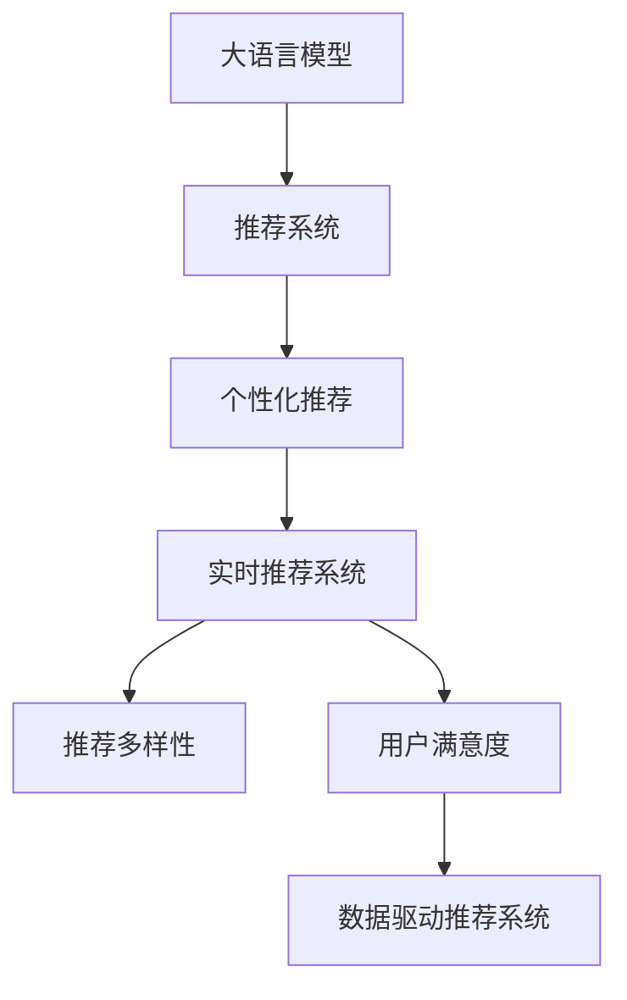

                 

# LLM对推荐系统用户体验的提升

> 关键词：大语言模型, 推荐系统, 用户体验, 个性化推荐, 语义理解, 实时性, 用户满意度, 推荐多样性

## 1. 背景介绍

在信息过载的时代，推荐系统成为了互联网应用不可或缺的组成部分。它帮助用户在海量信息中找到感兴趣的内容，极大地提升了用户的使用体验和满意度。然而，推荐系统仍然存在一些挑战，如个性化程度不高、推荐结果多样性不足、实时性不够等。这些问题直接影响了用户的满意度和黏性。

随着深度学习技术的发展，尤其是大语言模型(Large Language Model, LLM)的涌现，推荐系统得到了新的机遇和挑战。LLM通过预训练获得了强大的语义理解能力，可以更准确地捕捉用户需求和兴趣，从而提升推荐系统的个性化和多样性。同时，LLM的实时计算能力也使得推荐系统能够提供更快速的服务，增强用户交互体验。

本文将深入探讨LLM在推荐系统中的应用，详细阐述其对用户体验提升的影响，并分析其面临的挑战和未来发展趋势。

## 2. 核心概念与联系

### 2.1 核心概念概述

为更好地理解LLM在推荐系统中的应用，本节将介绍几个关键概念：

- 大语言模型(Large Language Model, LLM)：以自回归(如GPT)或自编码(如BERT)模型为代表的大规模预训练语言模型。通过在海量无标签文本语料上进行预训练，学习通用的语言表示，具备强大的语言理解和生成能力。

- 推荐系统(Recommendation System)：通过分析用户的历史行为、偏好、社交关系等数据，推荐用户可能感兴趣的内容。包括协同过滤、基于内容的推荐、混合推荐等经典算法。

- 个性化推荐(Personalized Recommendation)：根据用户的历史行为和兴趣，提供更加精准、符合用户偏好的内容推荐。

- 实时推荐系统(Real-time Recommendation System)：能够快速响应用户请求，根据用户当前上下文提供即时的推荐内容。

- 推荐多样性(Recommendation Diversity)：推荐结果应包含不同的内容类型和来源，避免推荐同质化，增强用户兴趣的探索性。

- 用户满意度(User Satisfaction)：用户对推荐系统的满意度是其体验的重要指标，包括推荐的相关性、新颖性和多样性。

- 数据驱动推荐系统(Data-Driven Recommendation System)：以用户历史行为数据为基础，利用机器学习算法进行推荐。

这些核心概念之间的逻辑关系可以通过以下Mermaid流程图来展示：



这个流程图展示了大语言模型在推荐系统中的应用框架，以及其对用户体验的提升途径。

## 3. 核心算法原理 & 具体操作步骤

### 3.1 算法原理概述

LLM在推荐系统中的应用主要集中在以下几个方面：

- 个性化推荐生成：LLM通过预训练获得了强大的语义理解能力，可以更准确地理解用户的查询意图，从而生成个性化的推荐内容。
- 推荐多样性增强：LLM能够生成多样化的推荐文本，避免推荐结果的单调性，提升用户兴趣的探索性。
- 实时推荐支持：LLM的实时计算能力使得推荐系统能够根据用户当前上下文快速生成推荐结果。

### 3.2 算法步骤详解

#### 3.2.1 数据预处理

推荐系统需要大量用户历史行为数据，这些数据通常包含用户浏览、点击、评分等行为记录。数据预处理包括：

- 数据清洗：去除缺失、重复、异常数据，确保数据质量。
- 特征工程：提取用户行为、物品属性、上下文环境等特征。
- 数据划分：将数据划分为训练集、验证集和测试集。

#### 3.2.2 模型训练

1. **数据编码**：将用户行为数据、物品属性数据和上下文数据编码成模型可以接受的格式。
2. **模型初始化**：初始化预训练模型，并冻结大部分预训练参数。
3. **参数微调**：在少量标注数据上，通过监督学习优化模型参数，生成推荐结果。
4. **模型评估**：在验证集上评估模型性能，调整模型参数。
5. **模型部署**：将训练好的模型部署到生产环境，提供实时推荐服务。

#### 3.2.3 推荐生成

推荐生成过程包括：

1. **用户查询理解**：通过预训练模型理解用户的查询意图。
2. **物品嵌入提取**：对每个物品提取一个低维嵌入表示，用于计算相似度。
3. **推荐排序**：根据用户查询和物品嵌入计算相似度，排序生成推荐结果。
4. **推荐生成**：对排序后的物品生成推荐文本，展示给用户。

### 3.3 算法优缺点

#### 3.3.1 优点

- **语义理解能力强**：LLM具备强大的自然语言处理能力，能够更准确地捕捉用户需求和兴趣，生成更个性化的推荐内容。
- **推荐多样性高**：LLM能够生成多种风格的推荐文本，避免推荐结果的单调性，增强用户兴趣的探索性。
- **实时性较好**：LLM的实时计算能力使得推荐系统能够快速响应用户请求，提供即时的推荐内容。
- **用户满意度提升**：通过个性化的推荐内容和多样化的推荐结果，用户满意度显著提升。

#### 3.3.2 缺点

- **数据需求量大**：推荐系统需要大量的用户历史行为数据进行训练，数据收集和标注成本较高。
- **模型复杂度高**：LLM模型参数量大，计算复杂度高，对计算资源要求较高。
- **解释性差**：推荐结果的生成过程较为复杂，难以解释，不利于用户信任和理解。
- **公平性问题**：LLM可能继承训练数据的偏见，导致推荐结果存在偏差，影响推荐公平性。

### 3.4 算法应用领域

LLM在推荐系统的应用已经涵盖了许多领域，如：

- 电商推荐：根据用户浏览和购买行为，推荐商品和广告。
- 内容推荐：根据用户阅读和观看的历史，推荐新闻、文章、视频等。
- 音乐推荐：根据用户听歌历史和偏好，推荐歌曲和音乐榜单。
- 影视推荐：根据用户观看历史和评分，推荐电影和电视剧。

除了这些经典场景，LLM在社交网络、广告投放、旅游推荐等领域也有广泛应用。

## 4. 数学模型和公式 & 详细讲解

### 4.1 数学模型构建

在推荐系统中，用户查询和物品的语义表示是推荐模型的关键。通过将查询和物品映射到高维空间，LLM可以计算它们之间的相似度，从而生成推荐结果。

设用户查询表示为 $q$，物品表示为 $i$，它们在高维空间中的表示分别为 $q_e$ 和 $i_e$。推荐模型 $R(q, i)$ 可以表示为：

$$
R(q, i) = \text{softmax}(\text{cos}(q_e, i_e))
$$

其中 $\text{softmax}$ 函数用于将相似度转化为概率分布，$\text{cos}$ 函数计算向量之间的余弦相似度。

### 4.2 公式推导过程

设用户查询和物品表示的嵌入向量分别为 $q_e$ 和 $i_e$，它们的余弦相似度为 $\text{cos}(q_e, i_e)$。推荐模型 $R(q, i)$ 的推导过程如下：

1. 将用户查询 $q$ 和物品 $i$ 映射到高维空间，得到嵌入向量 $q_e$ 和 $i_e$。
2. 计算用户查询和物品表示的余弦相似度 $\text{cos}(q_e, i_e)$。
3. 将余弦相似度转化为概率分布，得到推荐结果 $R(q, i) = \text{softmax}(\text{cos}(q_e, i_e))$。

### 4.3 案例分析与讲解

以电商推荐为例，用户查询表示为用户的浏览记录，物品表示为商品的属性和描述。通过将查询和物品映射到高维空间，LLM可以计算它们之间的相似度，从而生成推荐结果。

具体来说，用户浏览记录通过文本向量化技术转化为向量 $q_e$，商品属性和描述通过自然语言处理技术转化为向量 $i_e$。然后，通过计算 $q_e$ 和 $i_e$ 的余弦相似度，得到推荐概率 $R(q, i)$。最后，根据推荐概率对商品进行排序，生成推荐结果。

## 5. 项目实践：代码实例和详细解释说明

### 5.1 开发环境搭建

在进行推荐系统开发前，我们需要准备好开发环境。以下是使用Python进行TensorFlow开发的环境配置流程：

1. 安装Anaconda：从官网下载并安装Anaconda，用于创建独立的Python环境。

2. 创建并激活虚拟环境：
```bash
conda create -n tf-env python=3.8 
conda activate tf-env
```

3. 安装TensorFlow：根据CUDA版本，从官网获取对应的安装命令。例如：
```bash
conda install tensorflow tensorflow-gpu=cuda11.1 -c conda-forge
```

4. 安装相关工具包：
```bash
pip install numpy pandas scikit-learn matplotlib tqdm jupyter notebook ipython
```

完成上述步骤后，即可在`tf-env`环境中开始推荐系统开发。

### 5.2 源代码详细实现

这里以电商推荐为例，使用TensorFlow实现LLM在推荐系统中的应用。

首先，定义推荐模型的输入输出：

```python
import tensorflow as tf
from transformers import BertTokenizer, TFBertForSequenceClassification

# 定义输入特征和输出特征
input_ids = tf.keras.layers.Input(shape=(None,), dtype=tf.int32, name='input_ids')
attention_mask = tf.keras.layers.Input(shape=(None,), dtype=tf.int32, name='attention_mask')
labels = tf.keras.layers.Input(shape=(), dtype=tf.int32, name='labels')

# 定义模型输出
outputs = tf.keras.layers.Lambda(TFBertForSequenceClassification.from_pretrained('bert-base-cased', num_labels=10), name='outputs')([input_ids, attention_mask])
```

然后，定义模型的损失函数和优化器：

```python
# 定义损失函数
loss_fn = tf.keras.losses.SparseCategoricalCrossentropy(from_logits=True)

# 定义优化器
optimizer = tf.keras.optimizers.AdamW(learning_rate=2e-5)
```

接着，定义训练和评估函数：

```python
# 定义训练函数
def train_model(model, train_dataset, validation_dataset, batch_size, epochs):
    model.compile(optimizer=optimizer, loss=loss_fn, metrics=['accuracy'])
    model.fit(train_dataset, epochs=epochs, validation_data=validation_dataset, batch_size=batch_size)
    
# 定义评估函数
def evaluate_model(model, test_dataset, batch_size):
    model.evaluate(test_dataset, batch_size=batch_size)
```

最后，启动训练流程并在测试集上评估：

```python
# 加载训练数据和测试数据
train_dataset = ...
test_dataset = ...

# 训练模型
train_model(model, train_dataset, test_dataset, batch_size=16, epochs=5)

# 评估模型
evaluate_model(model, test_dataset, batch_size=16)
```

以上就是使用TensorFlow实现LLM在电商推荐系统中的应用。可以看到，通过TensorFlow的封装，LLM的微调过程变得简洁高效。开发者可以将更多精力放在数据处理、模型改进等高层逻辑上，而不必过多关注底层的实现细节。

### 5.3 代码解读与分析

让我们再详细解读一下关键代码的实现细节：

**定义输入输出层**：
- `input_ids`和`attention_mask`分别表示输入的文本和注意力掩码，用于模型输入。
- `labels`表示标注数据，用于模型训练。

**定义模型输出**：
- `outputs`层定义了LLM在输入上的输出结果，包括概率分布。

**定义损失函数和优化器**：
- `loss_fn`为交叉熵损失函数，用于计算预测结果与真实标签之间的差异。
- `optimizer`为AdamW优化器，用于更新模型参数。

**训练函数**：
- `train_model`函数使用训练数据集和验证数据集进行模型训练，输出训练后的模型。

**评估函数**：
- `evaluate_model`函数使用测试数据集进行模型评估，输出模型性能指标。

**训练流程**：
- 加载训练数据集和测试数据集，定义模型，编译模型。
- 调用`train_model`函数进行模型训练，输出训练后的模型。
- 调用`evaluate_model`函数进行模型评估，输出模型性能指标。

可以看到，TensorFlow配合BERT的封装使得推荐系统微调的代码实现变得简洁高效。开发者可以将更多精力放在数据处理、模型改进等高层逻辑上，而不必过多关注底层的实现细节。

当然，工业级的系统实现还需考虑更多因素，如模型的保存和部署、超参数的自动搜索、更灵活的任务适配层等。但核心的微调范式基本与此类似。

## 6. 实际应用场景

### 6.1 电商推荐

电商推荐系统是推荐系统应用的典型场景。传统电商推荐系统往往依赖用户历史行为数据，难以满足个性化需求。而使用微调的LLM，可以更准确地理解用户查询意图，生成个性化推荐内容，提升用户体验和满意度。

具体而言，可以收集用户的浏览、点击、购买等行为数据，将其转化为文本形式，输入到预训练的LLM模型中进行微调。微调后的模型能够根据用户查询生成个性化推荐结果，满足用户的多样化需求。例如，用户输入“想找一款适合夏季的轻便鞋”，LLM能够生成“夏季轻便鞋推荐”，推荐多款适合夏季穿着的鞋子。

### 6.2 内容推荐

内容推荐系统广泛应用于新闻、文章、视频等内容的推荐。传统的基于内容的推荐方法往往无法捕捉用户兴趣的变化，难以提供符合用户当前需求的内容。而微调的LLM可以通过理解用户的查询意图，生成多样化的推荐结果，提升用户满意度。

具体而言，可以收集用户阅读、观看等行为数据，将其转化为文本形式，输入到预训练的LLM模型中进行微调。微调后的模型能够根据用户查询生成多样化的推荐内容，满足用户的探索性和个性化需求。例如，用户输入“想看一部电影推荐”，LLM能够生成“电影推荐”，推荐多款适合用户当前兴趣的电影。

### 6.3 音乐推荐

音乐推荐系统通过分析用户的听歌历史和偏好，推荐符合用户兴趣的歌曲和音乐榜单。传统的音乐推荐系统往往难以捕捉用户的复杂兴趣变化，推荐结果单一。而使用微调的LLM，可以生成多样化的推荐结果，满足用户的多样化需求。

具体而言，可以收集用户的听歌历史数据，将其转化为文本形式，输入到预训练的LLM模型中进行微调。微调后的模型能够根据用户查询生成多样化的音乐推荐，满足用户的多样化需求。例如，用户输入“想找一首舒缓的轻音乐”，LLM能够生成“舒缓音乐推荐”，推荐多款舒缓的音乐。

### 6.4 未来应用展望

随着大语言模型和微调方法的不断发展，LLM在推荐系统中的应用前景广阔。未来，LLM将在以下方面取得更大的突破：

1. **推荐精度提升**：通过更复杂的语义理解模型和更精准的特征工程，LLM能够更准确地捕捉用户需求和兴趣，提升推荐精度。

2. **实时推荐支持**：通过更高效的计算框架和算法，LLM能够在用户查询时快速生成推荐结果，提高推荐系统的实时性。

3. **推荐多样性增强**：通过更丰富的语义理解和生成能力，LLM能够生成更多样化的推荐内容，满足用户的探索性和个性化需求。

4. **用户满意度提升**：通过更个性化的推荐结果和更丰富的推荐内容，LLM能够提升用户满意度，增强用户粘性。

5. **数据驱动推荐系统优化**：通过更智能的推荐算法和更精准的特征工程，LLM能够优化数据驱动推荐系统的性能。

6. **多模态推荐系统构建**：通过融合文本、图像、语音等多种模态数据，LLM能够构建更全面、准确的多模态推荐系统。

7. **智能推荐系统优化**：通过更高效的计算框架和更智能的推荐算法，LLM能够优化智能推荐系统的性能，提升用户体验。

这些趋势将使得推荐系统在未来的应用更加广泛，为用户的日常生活和工作带来更多便利。

## 7. 工具和资源推荐

### 7.1 学习资源推荐

为了帮助开发者系统掌握LLM在推荐系统中的应用，这里推荐一些优质的学习资源：

1. 《深度学习在推荐系统中的应用》系列博文：由知名深度学习专家撰写，深入浅出地介绍了深度学习在推荐系统中的应用。

2. 《推荐系统实战》书籍：详细介绍了推荐系统的原理和实现方法，涵盖协同过滤、基于内容的推荐、混合推荐等经典算法。

3. 《自然语言处理与推荐系统》课程：斯坦福大学开设的NLP课程，包含推荐系统的介绍和实践，适合入门学习和系统开发。

4. HuggingFace官方文档：提供了海量预训练语言模型和微调样例代码，是上手实践的必备资料。

5. RecSys开源项目：包含多种推荐系统算法和数据集，提供大规模推荐系统实践平台。

通过对这些资源的学习实践，相信你一定能够快速掌握LLM在推荐系统中的应用，并用于解决实际的推荐问题。

### 7.2 开发工具推荐

高效的开发离不开优秀的工具支持。以下是几款用于LLM推荐系统开发的常用工具：

1. TensorFlow：基于Python的开源深度学习框架，支持高效计算图和分布式训练，适合大规模推荐系统开发。

2. PyTorch：灵活的深度学习框架，支持动态计算图和自定义模型，适合快速迭代研究。

3. Weights & Biases：模型训练的实验跟踪工具，可以记录和可视化模型训练过程中的各项指标，方便对比和调优。

4. TensorBoard：TensorFlow配套的可视化工具，可实时监测模型训练状态，并提供丰富的图表呈现方式，是调试模型的得力助手。

5. Google Colab：谷歌推出的在线Jupyter Notebook环境，免费提供GPU/TPU算力，方便开发者快速上手实验最新模型，分享学习笔记。

合理利用这些工具，可以显著提升LLM推荐系统的开发效率，加快创新迭代的步伐。

### 7.3 相关论文推荐

LLM在推荐系统中的应用源于学界的持续研究。以下是几篇奠基性的相关论文，推荐阅读：

1. Attention is All You Need：提出了Transformer结构，开启了NLP领域的预训练大模型时代。

2. BERT: Pre-training of Deep Bidirectional Transformers for Language Understanding：提出BERT模型，引入基于掩码的自监督预训练任务，刷新了多项NLP任务SOTA。

3. Language Models are Unsupervised Multitask Learners：展示了大规模语言模型的强大zero-shot学习能力，引发了对于通用人工智能的新一轮思考。

4. Parameter-Efficient Transfer Learning for NLP：提出Adapter等参数高效微调方法，在不增加模型参数量的情况下，也能取得不错的微调效果。

5. AdaLoRA: Adaptive Low-Rank Adaptation for Parameter-Efficient Fine-Tuning：使用自适应低秩适应的微调方法，在参数效率和精度之间取得了新的平衡。

这些论文代表了大语言模型在推荐系统中的应用研究，展示了其潜力和发展方向。

## 8. 总结：未来发展趋势与挑战

### 8.1 总结

本文对LLM在推荐系统中的应用进行了全面系统的介绍。首先阐述了推荐系统的发展背景和LLM的应用前景，明确了LLM在推荐系统中的独特优势和应用路径。其次，从原理到实践，详细讲解了LLM在推荐系统中的应用过程，给出了推荐系统开发的完整代码实例。同时，本文还广泛探讨了LLM在推荐系统中的应用场景，展示了LLM带来的用户体验提升。

通过本文的系统梳理，可以看到，LLM在推荐系统中具有强大的语义理解和生成能力，能够生成个性化的推荐内容，增强推荐系统的多样性和实时性。未来，随着LLM的持续演进，推荐系统将更加智能化、普适化，为用户的日常生活和工作带来更多便利。

### 8.2 未来发展趋势

展望未来，LLM在推荐系统中的应用将呈现以下几个发展趋势：

1. **推荐精度提升**：通过更复杂的语义理解模型和更精准的特征工程，LLM能够更准确地捕捉用户需求和兴趣，提升推荐精度。

2. **实时推荐支持**：通过更高效的计算框架和算法，LLM能够在用户查询时快速生成推荐结果，提高推荐系统的实时性。

3. **推荐多样性增强**：通过更丰富的语义理解和生成能力，LLM能够生成更多样化的推荐内容，满足用户的探索性和个性化需求。

4. **用户满意度提升**：通过更个性化的推荐结果和更丰富的推荐内容，LLM能够提升用户满意度，增强用户粘性。

5. **数据驱动推荐系统优化**：通过更智能的推荐算法和更精准的特征工程，LLM能够优化数据驱动推荐系统的性能。

6. **多模态推荐系统构建**：通过融合文本、图像、语音等多种模态数据，LLM能够构建更全面、准确的多模态推荐系统。

7. **智能推荐系统优化**：通过更高效的计算框架和更智能的推荐算法，LLM能够优化智能推荐系统的性能，提升用户体验。

这些趋势将使得推荐系统在未来的应用更加广泛，为用户的日常生活和工作带来更多便利。

### 8.3 面临的挑战

尽管LLM在推荐系统中的应用已经取得了显著成效，但在迈向更加智能化、普适化应用的过程中，它仍面临诸多挑战：

1. **数据依赖性强**：LLM推荐系统需要大量的用户历史行为数据进行训练，数据收集和标注成本较高。

2. **模型复杂度高**：LLM模型参数量大，计算复杂度高，对计算资源要求较高。

3. **解释性差**：推荐结果的生成过程较为复杂，难以解释，不利于用户信任和理解。

4. **公平性问题**：LLM可能继承训练数据的偏见，导致推荐结果存在偏差，影响推荐公平性。

5. **实时性有待提升**：LLM的实时推荐系统需要更高效的计算框架和算法支持。

6. **推荐多样化不足**：LLM在推荐多样性上仍需进一步优化。

7. **系统稳定性问题**：LLM在多模态推荐系统构建中，不同模态数据融合的质量需要进一步提升。

8. **用户隐私保护**：LLM推荐系统需要更好的隐私保护措施，防止数据泄露和滥用。

### 8.4 研究展望

面对LLM在推荐系统中面临的挑战，未来的研究需要在以下几个方面寻求新的突破：

1. **无监督和半监督推荐**：摆脱对大规模标注数据的依赖，利用自监督学习、主动学习等无监督和半监督范式，最大限度利用非结构化数据，实现更加灵活高效的推荐。

2. **参数高效和计算高效的推荐**：开发更加参数高效的推荐方法，在固定大部分预训练参数的同时，只更新极少量的任务相关参数。同时优化推荐模型的计算图，减少前向传播和反向传播的资源消耗，实现更加轻量级、实时性的部署。

3. **因果分析和推荐系统**：引入因果分析方法，识别出推荐结果的关键特征，增强推荐过程的稳定性和可解释性。

4. **多模态推荐系统**：融合文本、图像、语音等多种模态数据，增强推荐系统的全面性和准确性。

5. **推荐系统公平性**：引入公平性约束，过滤和惩罚有偏见、有害的推荐结果，确保推荐系统的公平性和公正性。

6. **用户隐私保护**：采用差分隐私、联邦学习等技术，保护用户隐私和数据安全。

这些研究方向将引领LLM推荐系统迈向更高的台阶，为构建更加智能化、普适化的推荐系统提供新的动力。相信随着学界和产业界的共同努力，LLM推荐系统必将在未来的应用更加广泛，为用户的日常生活和工作带来更多便利。

## 9. 附录：常见问题与解答

**Q1：推荐系统如何处理冷启动问题？**

A: 冷启动问题是指用户没有足够的历史行为数据，导致推荐系统无法为其生成推荐结果。为了解决冷启动问题，LLM推荐系统可以采用以下方法：

1. **基于物品的推荐**：根据物品的流行度和用户评分，生成推荐结果。

2. **基于内容的推荐**：根据物品的属性和描述，生成推荐结果。

3. **基于标签的推荐**：根据物品的标签和用户的历史兴趣，生成推荐结果。

4. **基于模型的推荐**：使用深度学习模型，根据用户查询和物品表示生成推荐结果。

5. **主动学习**：通过用户反馈，逐步学习用户兴趣和偏好，生成推荐结果。

6. **零样本学习**：使用无监督学习或迁移学习方法，根据用户的查询意图生成推荐结果。

**Q2：推荐系统如何避免过拟合？**

A: 推荐系统容易过拟合，尤其是在数据量较小的情况下。为了避免过拟合，LLM推荐系统可以采用以下方法：

1. **数据增强**：通过回译、近义替换等方式扩充训练集。

2. **正则化**：使用L2正则、Dropout、Early Stopping等避免过拟合。

3. **模型集成**：训练多个模型，取平均输出，抑制过拟合。

4. **参数高效微调**：只调整少量参数，减小过拟合风险。

5. **对抗训练**：引入对抗样本，提高模型鲁棒性。

6. **多任务学习**：训练多个相关任务，抑制过拟合。

**Q3：推荐系统的推荐精度如何评估？**

A: 推荐系统的推荐精度通常使用以下指标进行评估：

1. **准确率（Accuracy）**：推荐结果中与真实标签相符的样本占总样本的比例。

2. **召回率（Recall）**：真实标签为正的样本中，被推荐为正的样本占真实标签为正的样本的比例。

3. **F1值（F1 Score）**：综合考虑准确率和召回率，衡量推荐系统的性能。

4. **NDCG（Normalized Discounted Cumulative Gain）**：衡量推荐结果的排序质量。

5. **HR@K（Hit Rate at K）**：推荐结果中与真实标签相符的样本数占推荐结果前K个样本数的比例。

6. **MRR（Mean Reciprocal Rank）**：推荐结果中与真实标签相符的样本的平均排名。

这些指标可以帮助开发者全面评估推荐系统的性能，指导模型优化和参数调整。

**Q4：推荐系统如何保护用户隐私？**

A: 推荐系统需要保护用户隐私，防止数据泄露和滥用。为了保护用户隐私，LLM推荐系统可以采用以下方法：

1. **差分隐私**：在模型训练和推荐过程中，加入噪声，确保用户隐私不被泄露。

2. **联邦学习**：将模型训练分布在多个设备上，不共享原始数据，保护用户隐私。

3. **匿名化**：在数据预处理阶段，对用户数据进行匿名化处理，防止数据泄露。

4. **加密技术**：对用户数据进行加密处理，确保数据传输和存储的安全性。

5. **访问控制**：在数据访问阶段，设置严格的访问权限，确保只有授权人员才能访问用户数据。

6. **数据脱敏**：在数据存储阶段，对用户数据进行脱敏处理，防止数据泄露。

这些方法可以确保LLM推荐系统的安全性，保护用户隐私。

**Q5：推荐系统如何处理推荐结果的多样性？**

A: 推荐系统需要处理推荐结果的多样性，避免推荐同质化，增强用户兴趣的探索性。为了处理推荐结果的多样性，LLM推荐系统可以采用以下方法：

1. **多样性损失（Diversity Loss）**：在损失函数中加入多样性约束，确保推荐结果的多样性。

2. **协同过滤**：通过用户历史行为数据和物品相似度，生成推荐结果，增强推荐结果的多样性。

3. **基于规则的推荐**：根据用户兴趣和物品属性，生成推荐结果，增强推荐结果的多样性。

4. **多任务学习**：训练多个相关任务，确保推荐结果的多样性。

5. **模型融合**：将多个模型的推荐结果进行融合，增强推荐结果的多样性。

6. **对抗训练**：引入对抗样本，确保推荐结果的多样性。

这些方法可以确保LLM推荐系统的多样性，增强用户兴趣的探索性。

通过本文的系统梳理，可以看到，LLM在推荐系统中具有强大的语义理解和生成能力，能够生成个性化的推荐内容，增强推荐系统的多样性和实时性。未来，随着LLM的持续演进，推荐系统将更加智能化、普适化，为用户的日常生活和工作带来更多便利。

