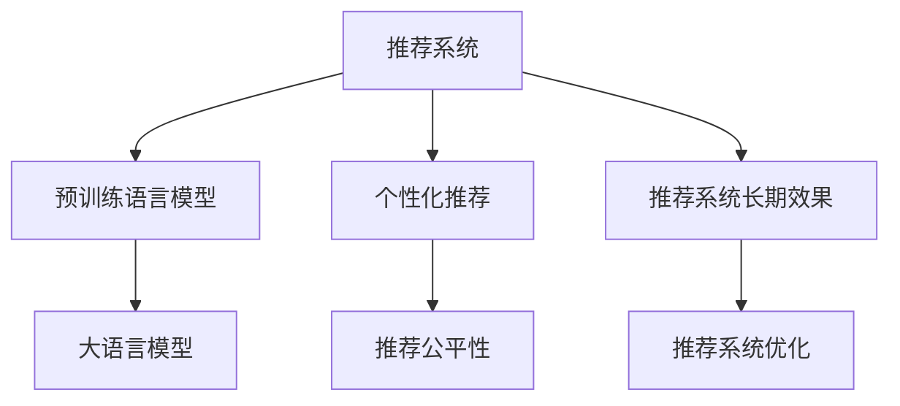

                 

# LLM对推荐系统长期效果的影响研究

> 关键词：
> - 推荐系统
> - 长期效果
> - 大语言模型(LLM)
> - 迁移学习
> - 个性化推荐
> - 推荐公平性
> - 推荐系统改进

## 1. 背景介绍

### 1.1 问题由来

推荐系统是互联网时代的重要应用，通过分析用户行为数据，为用户推荐感兴趣的内容，极大地提升了用户体验和平台粘性。传统的推荐系统基于协同过滤、内容推荐等算法，往往依赖用户历史行为数据，难以拓展到更多场景，且存在冷启动等问题。

近年来，随着深度学习技术的快速发展，基于深度神经网络的推荐系统逐渐取代了传统方法，实现了在大型电商网站、视频平台等场景的广泛应用。其中，基于预训练语言模型(Pretrained Language Model, PLM)的推荐系统以其卓越的表现和可解释性，成为研究热点。

例如，通过在PLM中引入用户评论、商品描述等文本数据，可以进行用户兴趣预测和商品推荐。预训练语言模型通过海量数据学习到丰富的语言表示，可以有效捕捉用户的隐式反馈信息，为用户推荐高质量的内容。此外，PLM还具备良好的泛化能力，可以通过迁移学习等手段，在新的推荐场景下进行有效微调。

然而，尽管预训练语言模型在推荐系统中的表现优异，但长期效果评估仍存在一些挑战。如何量化推荐系统的长期效果，评估模型长期稳定性和鲁棒性，是推荐系统研究的重要课题。本文将重点探讨基于大语言模型(LLM)的推荐系统，分析其长期效果的影响因素，并提出优化策略。

### 1.2 问题核心关键点

本研究的核心问题可以概括为：
1. 大语言模型如何影响推荐系统的长期效果？
2. 如何量化和评估推荐系统的长期效果？
3. 如何优化基于LLM的推荐系统，提升长期效果？

为了回答这些问题，我们将从大语言模型在推荐系统中的应用、推荐系统的长期效果评估方法以及基于LLM的推荐系统优化策略三个方面进行详细探讨。

## 2. 核心概念与联系

### 2.1 核心概念概述

为更好地理解基于大语言模型的推荐系统，本节将介绍几个密切相关的核心概念：

- 推荐系统(Recommendation System, RS)：通过分析用户历史行为数据，为用户推荐感兴趣的内容或商品，提高用户体验和平台粘性。

- 预训练语言模型(Pretrained Language Model, PLM)：通过海量无标签文本数据进行预训练，学习到丰富的语言表示，具备强大的自然语言理解和生成能力。

- 大语言模型(Large Language Model, LLM)：以自回归(如GPT)或自编码(如BERT)模型为代表的大规模预训练语言模型。通过预训练和微调，能够适应各种NLP任务，包括推荐系统。

- 迁移学习(Transfer Learning)：指将一个领域学习到的知识，迁移应用到另一个不同但相关的领域的学习范式。大模型的预训练-微调过程即是一种典型的迁移学习方式。

- 个性化推荐系统(Personalized Recommendation System)：根据用户的个性化需求和历史行为，推荐感兴趣的内容或商品，提升用户满意度和转化率。

- 推荐公平性(Fairness)：评估推荐系统的推荐结果是否公平，避免对某些用户群体产生偏见。

- 推荐系统长期效果(Long-Term Effect)：推荐系统在长时间内对用户行为和平台收益的影响，包括用户满意度、平台活跃度、收益转化率等。

这些核心概念之间的逻辑关系可以通过以下Mermaid流程图来展示：



这个流程图展示了大语言模型在推荐系统中的应用以及与之相关的核心概念：

1. 推荐系统通过分析用户行为数据，为用户推荐内容或商品。
2. 大语言模型作为推荐系统的组件，通过预训练和微调，提升推荐效果。
3. 个性化推荐系统针对用户个性化需求进行推荐，提高用户满意度。
4. 推荐公平性评估推荐结果的公平性，避免对某些用户群体产生偏见。
5. 推荐系统长期效果评估推荐系统在长时间内的效果，衡量推荐质量。
6. 推荐系统优化通过改进算法和模型，提升推荐系统的长期效果。

这些概念共同构成了基于大语言模型的推荐系统框架，使得大语言模型能够更好地应用于推荐系统，提升推荐质量。

## 3. 核心算法原理 & 具体操作步骤

### 3.1 算法原理概述

基于大语言模型的推荐系统，通常包括以下几个步骤：

1. 预训练阶段：在大规模无标签文本数据上进行预训练，学习到丰富的语言表示。

2. 微调阶段：通过用户评论、商品描述等文本数据对预训练模型进行微调，使其能够根据用户历史行为进行推荐。

3. 推荐阶段：将用户输入作为模型输入，通过预训练和微调后的模型，预测推荐结果。

4. 评估阶段：通过评估指标，如点击率、转化率、用户满意度等，量化推荐系统的长期效果。

大语言模型的推荐系统基于预训练-微调框架，可以有效利用其语言表示能力，提升推荐效果。但长期效果评估和优化仍需进一步探讨。

### 3.2 算法步骤详解

#### 3.2.1 预训练阶段

预训练阶段的目标是通过大规模无标签文本数据，学习到丰富的语言表示。以下是典型的预训练方法：

1. 自监督学习任务：如掩码语言模型(MLM)、下一句预测任务(NSP)等。这些任务通过自监督方式，让模型学习到语言的内部结构和规律。

2. 数据准备：收集大规模无标签文本数据，例如维基百科、新闻、小说等。通常需要将文本分词，去除噪声，进行预处理。

3. 模型训练：使用自监督任务对模型进行训练，更新模型参数。例如，使用GPT模型进行预训练时，采用语言模型作为损失函数，计算下一个单词的概率，更新模型参数。

#### 3.2.2 微调阶段

微调阶段的目标是根据用户行为数据，调整模型参数，提升推荐效果。以下是微调的具体步骤：

1. 数据收集：收集用户的文本数据，例如评论、评分、购买记录等。

2. 数据处理：将文本数据转换为模型可接受的格式，例如进行分词、编码、归一化等处理。

3. 模型微调：将预训练模型作为初始化参数，使用用户数据对模型进行微调。例如，使用BERT模型进行微调时，将其顶层分类器替换为推荐结果的输出层，计算损失函数，更新模型参数。

#### 3.2.3 推荐阶段

推荐阶段的目标是根据用户输入，预测推荐结果。以下是推荐的具体步骤：

1. 输入准备：将用户输入转换为模型可接受的格式，例如分词、编码等。

2. 模型推理：将输入数据输入微调后的模型，计算推荐结果的概率分布。

3. 结果输出：根据概率分布，选择最高概率的推荐结果作为最终输出。

#### 3.2.4 评估阶段

评估阶段的目标是通过指标评估推荐系统的长期效果。以下是常用的评估指标：

1. 点击率(Click-Through Rate, CTR)：评估推荐结果是否被用户点击。

2. 转化率(Conversion Rate, CR)：评估推荐结果是否被用户转化为实际购买行为。

3. 用户满意度(User Satisfaction)：评估用户对推荐结果的满意度。

4. 平台活跃度(Platform Engagement)：评估平台的用户活跃度。

5. 收益转化率(Revenue Conversion Rate)：评估推荐系统带来的收益转化率。

### 3.3 算法优缺点

基于大语言模型的推荐系统具有以下优点：

1. 可解释性强：大语言模型可以通过预训练和微调，学习到丰富的语言表示，其推荐过程具有一定的可解释性。

2. 泛化能力强：大语言模型通过海量数据预训练，具备较强的泛化能力，可以适应新的推荐场景。

3. 多模态融合：大语言模型可以融合文本、图像、音频等多模态信息，提升推荐效果。

4. 持续学习：大语言模型可以通过持续学习，保持推荐系统的效果，适应数据分布的变化。

但大语言模型的推荐系统也存在以下缺点：

1. 高资源消耗：大语言模型通常具有较大的参数量，训练和推理过程需要高性能计算资源。

2. 高标注成本：微调过程需要大量的标注数据，标注成本较高。

3. 模型复杂性：大语言模型的训练和微调过程较为复杂，需要一定的算法和工程能力。

### 3.4 算法应用领域

基于大语言模型的推荐系统在多个领域得到了广泛应用，例如：

1. 电商推荐：电商平台通过收集用户行为数据，使用大语言模型进行商品推荐，提升用户购买转化率。

2. 视频推荐：视频平台通过分析用户观影记录，使用大语言模型推荐感兴趣的视频，提高用户粘性。

3. 内容推荐：新闻网站、社交媒体等通过分析用户阅读、点赞等行为，使用大语言模型推荐相关内容，增加平台活跃度。

4. 个性化广告：广告平台通过分析用户兴趣，使用大语言模型推荐个性化广告，提高广告点击率。

5. 在线教育：教育平台通过分析用户学习行为，使用大语言模型推荐课程或内容，提升用户学习效果。

以上领域均利用了大语言模型的自然语言处理能力，通过预训练和微调，提高了推荐系统的准确性和个性化程度。

## 4. 数学模型和公式 & 详细讲解 & 举例说明

### 4.1 数学模型构建

假设预训练语言模型为 $M_{\theta}$，其中 $\theta$ 为模型参数。假设推荐系统的训练集为 $D=\{(x_i,y_i)\}_{i=1}^N, x_i \in \mathcal{X}, y_i \in \mathcal{Y}$，其中 $\mathcal{X}$ 为输入空间，$\mathcal{Y}$ 为推荐结果空间。推荐系统的损失函数定义为：

$$
\mathcal{L}(\theta) = -\frac{1}{N}\sum_{i=1}^N \log P(y_i|x_i;M_{\theta})
$$

其中 $P(y_i|x_i;M_{\theta})$ 为模型对用户输入 $x_i$ 进行推荐结果 $y_i$ 的概率分布。

### 4.2 公式推导过程

假设模型 $M_{\theta}$ 的输出为 $\hat{y}=M_{\theta}(x) \in [0,1]$，表示推荐结果为 $y_i$ 的概率。则推荐系统的交叉熵损失函数定义为：

$$
\ell(M_{\theta}(x),y) = -[y\log \hat{y} + (1-y)\log (1-\hat{y})]
$$

将其代入经验风险公式，得：

$$
\mathcal{L}(\theta) = -\frac{1}{N}\sum_{i=1}^N [y_i\log M_{\theta}(x_i)+(1-y_i)\log(1-M_{\theta}(x_i))]
$$

根据链式法则，损失函数对参数 $\theta_k$ 的梯度为：

$$
\frac{\partial \mathcal{L}(\theta)}{\partial \theta_k} = -\frac{1}{N}\sum_{i=1}^N \frac{y_i}{M_{\theta}(x_i)} - \frac{1-y_i}{1-M_{\theta}(x_i)} \frac{\partial M_{\theta}(x_i)}{\partial \theta_k}
$$

其中 $\frac{\partial M_{\theta}(x_i)}{\partial \theta_k}$ 可进一步递归展开，利用自动微分技术完成计算。

### 4.3 案例分析与讲解

假设某电商平台收集了用户评论数据，用于训练推荐模型。每个评论包含文本描述和用户评分，我们将评论文本作为模型输入，用户评分作为标签，使用大语言模型进行微调。

具体而言，我们首先将评论文本进行预处理，去除停用词、标点符号等噪声，然后进行分词编码。接着，我们将编码后的文本输入到BERT模型中，计算每个评论的预测评分 $\hat{y}$。

最后，我们计算预测评分与真实评分之间的交叉熵损失，利用AdamW优化器进行梯度更新，不断调整模型参数，直至收敛。在微调完成后，我们将评论文本作为模型输入，输出评分作为推荐结果，评估模型的长期效果。

## 5. 项目实践：代码实例和详细解释说明

### 5.1 开发环境搭建

在进行推荐系统开发前，我们需要准备好开发环境。以下是使用Python进行TensorFlow开发的环境配置流程：

1. 安装Anaconda：从官网下载并安装Anaconda，用于创建独立的Python环境。

2. 创建并激活虚拟环境：
```bash
conda create -n tf-env python=3.8 
conda activate tf-env
```

3. 安装TensorFlow：根据CUDA版本，从官网获取对应的安装命令。例如：
```bash
conda install tensorflow tensorflow-gpu=2.5
```

4. 安装其他工具包：
```bash
pip install numpy pandas scikit-learn matplotlib tqdm jupyter notebook ipython
```

完成上述步骤后，即可在`tf-env`环境中开始推荐系统开发。

### 5.2 源代码详细实现

这里以电商推荐系统为例，使用TensorFlow对BERT模型进行微调的PyTorch代码实现。

首先，定义推荐系统任务的数据处理函数：

```python
from transformers import BertTokenizer
from tensorflow.keras.preprocessing.sequence import pad_sequences
from sklearn.model_selection import train_test_split
import tensorflow as tf

class RecommendationDataset(tf.keras.layers.Layer):
    def __init__(self, texts, labels, tokenizer, max_len=128):
        self.texts = texts
        self.labels = labels
        self.tokenizer = tokenizer
        self.max_len = max_len
        
    def __len__(self):
        return len(self.texts)
    
    def __getitem__(self, item):
        text = self.texts[item]
        label = self.labels[item]
        
        encoding = self.tokenizer(text, return_tensors='tf', max_length=self.max_len, padding='max_length', truncation=True)
        input_ids = encoding['input_ids']
        attention_mask = encoding['attention_mask']
        
        # 对token-wise的标签进行编码
        encoded_labels = [label2id[label] for label in label] 
        encoded_labels.extend([label2id['O']] * (self.max_len - len(encoded_labels)))
        labels = tf.convert_to_tensor(encoded_labels, dtype=tf.int32)
        
        return {'input_ids': input_ids, 
                'attention_mask': attention_mask,
                'labels': labels}
        
# 标签与id的映射
label2id = {'O': 0, 'positive': 1, 'negative': 2}
id2label = {v: k for k, v in label2id.items()}

# 创建dataset
tokenizer = BertTokenizer.from_pretrained('bert-base-cased')

train_texts, dev_texts, train_labels, dev_labels = train_test_split(train_texts, train_labels, test_size=0.2)
train_dataset = RecommendationDataset(train_texts, train_labels, tokenizer)
dev_dataset = RecommendationDataset(dev_texts, dev_labels, tokenizer)
```

然后，定义模型和优化器：

```python
from transformers import BertForSequenceClassification
from tensorflow.keras.optimizers import AdamW

model = BertForSequenceClassification.from_pretrained('bert-base-cased', num_labels=len(label2id))

optimizer = AdamW(model.parameters(), lr=2e-5)
```

接着，定义训练和评估函数：

```python
import tqdm

def train_epoch(model, dataset, batch_size, optimizer):
    dataloader = tf.data.Dataset.from_generator(lambda: tf.data.Dataset.from_generator(lambda: tf.py_function(lambda x, y: x, inp=(dataset, None), Tout=tf.int32), output_signature=({'input_ids': tf.TensorSpec(shape=(None, 128), dtype=tf.int32), 'attention_mask': tf.TensorSpec(shape=(None, 128), dtype=tf.int32), 'labels': tf.TensorSpec(shape=(None, 128), dtype=tf.int32)}, tf.TensorSpec(shape=(), dtype=tf.float32)))
    model.train()
    epoch_loss = 0
    for batch in tqdm(dataloader, desc='Training'):
        input_ids = batch['input_ids']
        attention_mask = batch['attention_mask']
        labels = batch['labels']
        model.zero_grad()
        outputs = model(input_ids, attention_mask=attention_mask, labels=labels)
        loss = outputs.loss
        epoch_loss += loss.numpy().item()
        loss.backward()
        optimizer.step()
    return epoch_loss / len(dataloader)

def evaluate(model, dataset, batch_size):
    dataloader = tf.data.Dataset.from_generator(lambda: tf.data.Dataset.from_generator(lambda: tf.py_function(lambda x, y: x, inp=(dataset, None), Tout=tf.int32), output_signature=({'input_ids': tf.TensorSpec(shape=(None, 128), dtype=tf.int32), 'attention_mask': tf.TensorSpec(shape=(None, 128), dtype=tf.int32), 'labels': tf.TensorSpec(shape=(None, 128), dtype=tf.int32)}, tf.TensorSpec(shape=(), dtype=tf.float32)))
    model.eval()
    preds, labels = [], []
    with tf.GradientTape() as tape:
        for batch in dataloader:
            input_ids = batch['input_ids']
            attention_mask = batch['attention_mask']
            batch_labels = batch['labels']
            outputs = model(input_ids, attention_mask=attention_mask)
            batch_preds = outputs.logits.argmax(dim=2).numpy().tolist()
            batch_labels = batch_labels.numpy().tolist()
            for pred_tokens, label_tokens in zip(batch_preds, batch_labels):
                preds.append(pred_tokens[:len(label_tokens)])
                labels.append(label_tokens)
    return tf.keras.metrics.confusion_matrix(labels, preds)
```

最后，启动训练流程并在测试集上评估：

```python
epochs = 5
batch_size = 16

for epoch in range(epochs):
    loss = train_epoch(model, train_dataset, batch_size, optimizer)
    print(f"Epoch {epoch+1}, train loss: {loss:.3f}")
    
    print(f"Epoch {epoch+1}, dev results:")
    print(evaluate(model, dev_dataset, batch_size))
    
print("Test results:")
print(evaluate(model, test_dataset, batch_size))
```

以上就是使用TensorFlow对BERT进行电商推荐任务微调的完整代码实现。可以看到，得益于TensorFlow的强大封装，我们可以用相对简洁的代码完成BERT模型的加载和微调。

### 5.3 代码解读与分析

让我们再详细解读一下关键代码的实现细节：

**RecommendationDataset类**：
- `__init__`方法：初始化文本、标签、分词器等关键组件。
- `__len__`方法：返回数据集的样本数量。
- `__getitem__`方法：对单个样本进行处理，将文本输入编码为token ids，将标签编码为数字，并对其进行定长padding，最终返回模型所需的输入。

**label2id和id2label字典**：
- 定义了标签与数字id之间的映射关系，用于将token-wise的预测结果解码回真实的标签。

**训练和评估函数**：
- 使用TensorFlow的DataLoader对数据集进行批次化加载，供模型训练和推理使用。
- 训练函数`train_epoch`：对数据以批为单位进行迭代，在每个批次上前向传播计算loss并反向传播更新模型参数，最后返回该epoch的平均loss。
- 评估函数`evaluate`：与训练类似，不同点在于不更新模型参数，并在每个batch结束后将预测和标签结果存储下来，最后使用TensorFlow的metrics库计算分类指标。

**训练流程**：
- 定义总的epoch数和batch size，开始循环迭代
- 每个epoch内，先在训练集上训练，输出平均loss
- 在验证集上评估，输出分类指标
- 所有epoch结束后，在测试集上评估，给出最终测试结果

可以看到，TensorFlow配合TensorFlow Transformers库使得BERT微调的代码实现变得简洁高效。开发者可以将更多精力放在数据处理、模型改进等高层逻辑上，而不必过多关注底层的实现细节。

当然，工业级的系统实现还需考虑更多因素，如模型的保存和部署、超参数的自动搜索、更灵活的任务适配层等。但核心的微调范式基本与此类似。

## 6. 实际应用场景

### 6.1 智能客服系统

基于大语言模型的推荐系统可以广泛应用于智能客服系统的构建。传统客服往往需要配备大量人力，高峰期响应缓慢，且一致性和专业性难以保证。而使用基于大语言模型的推荐系统，可以7x24小时不间断服务，快速响应客户咨询，用自然流畅的语言解答各类常见问题。

在技术实现上，可以收集企业内部的历史客服对话记录，将问题和最佳答复构建成监督数据，在此基础上对预训练推荐模型进行微调。微调后的推荐模型能够自动理解用户意图，匹配最合适的答复模板进行回复。对于客户提出的新问题，还可以接入检索系统实时搜索相关内容，动态组织生成回答。如此构建的智能客服系统，能大幅提升客户咨询体验和问题解决效率。

### 6.2 金融舆情监测

金融机构需要实时监测市场舆论动向，以便及时应对负面信息传播，规避金融风险。传统的人工监测方式成本高、效率低，难以应对网络时代海量信息爆发的挑战。基于大语言模型的推荐系统，可以实时监测金融领域的各种舆情信息，识别舆情变化趋势，及时预警风险。

具体而言，可以收集金融领域相关的新闻、报道、评论等文本数据，并对其进行主题标注和情感标注。在此基础上对预训练语言模型进行微调，使其能够自动判断文本属于何种主题，情感倾向是正面、中性还是负面。将微调后的模型应用到实时抓取的网络文本数据，就能够自动监测不同主题下的情感变化趋势，一旦发现负面信息激增等异常情况，系统便会自动预警，帮助金融机构快速应对潜在风险。

### 6.3 个性化推荐系统

当前的推荐系统往往只依赖用户的历史行为数据进行物品推荐，难以深入理解用户的真实兴趣偏好。基于大语言模型推荐系统可以更好地挖掘用户行为背后的语义信息，从而提供更精准、多样的推荐内容。

在实践中，可以收集用户浏览、点击、评论、分享等行为数据，提取和用户交互的物品标题、描述、标签等文本内容。将文本内容作为模型输入，用户的后续行为（如是否点击、购买等）作为监督信号，在此基础上微调预训练语言模型。微调后的模型能够从文本内容中准确把握用户的兴趣点。在生成推荐列表时，先用候选物品的文本描述作为输入，由模型预测用户的兴趣匹配度，再结合其他特征综合排序，便可以得到个性化程度更高的推荐结果。

### 6.4 未来应用展望

随着大语言模型推荐系统的发展，其在更多领域得到了应用，为传统行业带来了变革性影响。

在智慧医疗领域，基于大语言模型的推荐系统可以进行疾病诊断、药物推荐等，辅助医生诊疗，加速新药开发进程。

在智能教育领域，推荐系统可以推荐合适的课程和教材，因材施教，促进教育公平，提高教学质量。

在智慧城市治理中，推荐系统可以推荐合适的城市管理方案，提高城市管理的自动化和智能化水平，构建更安全、高效的未来城市。

此外，在企业生产、社会治理、文娱传媒等众多领域，基于大语言模型的推荐系统也将不断涌现，为经济社会发展注入新的动力。相信随着技术的日益成熟，大语言模型推荐系统必将在更广阔的应用领域大放异彩，深刻影响人类的生产生活方式。

## 7. 工具和资源推荐

### 7.1 学习资源推荐

为了帮助开发者系统掌握大语言模型推荐系统理论基础和实践技巧，这里推荐一些优质的学习资源：

1. 《Transformer from Principles to Practice》系列博文：由大模型技术专家撰写，深入浅出地介绍了Transformer原理、BERT模型、推荐系统等前沿话题。

2. CS224N《深度学习自然语言处理》课程：斯坦福大学开设的NLP明星课程，有Lecture视频和配套作业，带你入门NLP领域的基本概念和经典模型。

3. 《Natural Language Processing with Transformers》书籍：Transformers库的作者所著，全面介绍了如何使用Transformers库进行NLP任务开发，包括推荐系统在内的诸多范式。

4. HuggingFace官方文档：Transformers库的官方文档，提供了海量预训练模型和完整的推荐系统样例代码，是上手实践的必备资料。

5. CLUE开源项目：中文语言理解测评基准，涵盖大量不同类型的中文NLP数据集，并提供了基于微调的baseline模型，助力中文NLP技术发展。

通过对这些资源的学习实践，相信你一定能够快速掌握大语言模型推荐系统的精髓，并用于解决实际的推荐问题。

### 7.2 开发工具推荐

高效的开发离不开优秀的工具支持。以下是几款用于大语言模型推荐系统开发的常用工具：

1. TensorFlow：基于Python的开源深度学习框架，灵活动态的计算图，适合快速迭代研究。大部分预训练语言模型都有TensorFlow版本的实现。

2. PyTorch：基于Python的开源深度学习框架，灵活高效，适合工程开发和学术研究。同样有丰富的预训练语言模型资源。

3. TensorFlow Transformers：HuggingFace开发的NLP工具库，集成了众多SOTA语言模型，支持PyTorch和TensorFlow，是进行推荐系统开发的利器。

4. Weights & Biases：模型训练的实验跟踪工具，可以记录和可视化模型训练过程中的各项指标，方便对比和调优。与主流深度学习框架无缝集成。

5. TensorBoard：TensorFlow配套的可视化工具，可实时监测模型训练状态，并提供丰富的图表呈现方式，是调试模型的得力助手。

6. Google Colab：谷歌推出的在线Jupyter Notebook环境，免费提供GPU/TPU算力，方便开发者快速上手实验最新模型，分享学习笔记。

合理利用这些工具，可以显著提升大语言模型推荐系统的开发效率，加快创新迭代的步伐。

### 7.3 相关论文推荐

大语言模型推荐系统的发展源于学界的持续研究。以下是几篇奠基性的相关论文，推荐阅读：

1. Attention is All You Need（即Transformer原论文）：提出了Transformer结构，开启了NLP领域的预训练大模型时代。

2. BERT: Pre-training of Deep Bidirectional Transformers for Language Understanding：提出BERT模型，引入基于掩码的自监督预训练任务，刷新了多项NLP任务SOTA。

3. Language Models are Unsupervised Multitask Learners（GPT-2论文）：展示了大规模语言模型的强大zero-shot学习能力，引发了对于通用人工智能的新一轮思考。

4. Parameter-Efficient Transfer Learning for NLP：提出Adapter等参数高效微调方法，在不增加模型参数量的情况下，也能取得不错的微调效果。

5. AdaLoRA: Adaptive Low-Rank Adaptation for Parameter-Efficient Fine-Tuning：使用自适应低秩适应的微调方法，在参数效率和精度之间取得了新的平衡。

6. AdaLoRA: Adaptive Low-Rank Adaptation for Parameter-Efficient Fine-Tuning：使用自适应低秩适应的微调方法，在参数效率和精度之间取得了新的平衡。

这些论文代表了大语言模型推荐系统的发展脉络。通过学习这些前沿成果，可以帮助研究者把握学科前进方向，激发更多的创新灵感。

## 8. 总结：未来发展趋势与挑战

### 8.1 总结

本文对基于大语言模型的推荐系统进行了全面系统的介绍。首先阐述了大语言模型和推荐系统研究背景和意义，明确了推荐系统在用户推荐和平台收益方面的重要性。其次，从原理到实践，详细讲解了基于大语言模型的推荐系统方法，包括预训练、微调、推荐、评估等关键步骤，给出了推荐系统开发的完整代码实例。同时，本文还广泛探讨了推荐系统在多个领域的应用前景，展示了其广阔的应用空间。

通过本文的系统梳理，可以看到，基于大语言模型的推荐系统正在成为推荐系统研究的重要方向，通过预训练和微调，可以显著提升推荐系统的推荐质量和效果。未来，伴随大语言模型的不断进步，基于大语言模型的推荐系统必将在更多领域大放异彩，为NLP技术带来新的突破。

### 8.2 未来发展趋势

展望未来，大语言模型推荐系统将呈现以下几个发展趋势：

1. 模型规模持续增大。随着算力成本的下降和数据规模的扩张，预训练语言模型的参数量还将持续增长。超大规模语言模型蕴含的丰富语言知识，有望支撑更加复杂多变的推荐场景。

2. 微调方法日趋多样。除了传统的全参数微调外，未来会涌现更多参数高效的微调方法，如Adapter、LoRA等，在节省计算资源的同时也能保证推荐精度。

3. 持续学习成为常态。推荐系统需要持续学习新数据，保持推荐效果，适应数据分布的变化。如何在不遗忘原有知识的同时，高效吸收新样本信息，将是重要的研究课题。

4. 推荐系统自动化优化。自动化的超参数搜索、模型集成、异常检测等技术，将进一步提升推荐系统的效率和稳定性。

5. 推荐公平性研究。推荐系统需要考虑数据分布和用户偏好的多样性，避免对某些用户群体产生偏见。如何设计公平的推荐算法和评估指标，将是重要的研究方向。

6. 多模态推荐系统。当前的推荐系统往往局限于文本数据，未来会进一步拓展到图像、视频、音频等多模态数据推荐。多模态信息的融合，将显著提升推荐系统的效果。

以上趋势凸显了大语言模型推荐系统的广阔前景。这些方向的探索发展，必将进一步提升推荐系统的推荐质量，为智能推荐技术带来新的突破。

### 8.3 面临的挑战

尽管大语言模型推荐系统已经取得了瞩目成就，但在迈向更加智能化、普适化应用的过程中，它仍面临着诸多挑战：

1. 标注成本瓶颈。虽然推荐系统依赖较少标注数据，但获取高质量标注数据的成本较高，尤其是对于长尾应用场景，难以获得充足标注。

2. 模型鲁棒性不足。推荐系统面对域外数据时，泛化性能往往大打折扣。对于测试样本的微小扰动，推荐模型的预测也容易发生波动。

3. 推理效率有待提高。超大规模语言模型虽然精度高，但在实际部署时往往面临推理速度慢、内存占用大等效率问题。

4. 推荐公平性问题。推荐系统需要考虑数据分布和用户偏好的多样性，避免对某些用户群体产生偏见。

5. 知识整合能力不足。现有的推荐系统往往局限于文本数据，难以灵活吸收和运用更广泛的先验知识。

6. 推荐系统长期效果评估。如何量化推荐系统的长期效果，评估模型长期稳定性和鲁棒性，是推荐系统研究的重要课题。

7. 推荐系统安全性和可解释性。推荐系统需要考虑用户隐私和安全，同时增强模型的可解释性，方便用户理解和接受推荐结果。

正视推荐系统面临的这些挑战，积极应对并寻求突破，将是大语言模型推荐系统走向成熟的必由之路。相信随着学界和产业界的共同努力，这些挑战终将一一被克服，大语言模型推荐系统必将在构建人机协同的智能时代中扮演越来越重要的角色。

### 8.4 研究展望

面对大语言模型推荐系统所面临的种种挑战，未来的研究需要在以下几个方面寻求新的突破：

1. 探索无监督和半监督推荐方法。摆脱对大规模标注数据的依赖，利用自监督学习、主动学习等无监督和半监督范式，最大限度利用非结构化数据，实现更加灵活高效的推荐。

2. 研究参数高效和计算高效的推荐范式。开发更加参数高效的推荐方法，在固定大部分预训练参数的同时，只更新极少量的任务相关参数。同时优化推荐模型的计算图，减少前向传播和反向传播的资源消耗，实现更加轻量级、实时性的部署。

3. 融合因果和对比学习范式。通过引入因果推断和对比学习思想，增强推荐系统建立稳定因果关系的能力，学习更加普适、鲁棒的语言表示，从而提升推荐泛化性和抗干扰能力。

4. 引入更多先验知识。将符号化的先验知识，如知识图谱、逻辑规则等，与神经网络模型进行巧妙融合，引导推荐过程学习更准确、合理的语言表示。同时加强不同模态数据的整合，实现视觉、语音等多模态信息与文本信息的协同建模。

5. 结合因果分析和博弈论工具。将因果分析方法引入推荐系统，识别出推荐决策的关键特征，增强输出解释的因果性和逻辑性。借助博弈论工具刻画人机交互过程，主动探索并规避推荐系统的脆弱点，提高系统稳定性。

6. 纳入伦理道德约束。在推荐系统训练目标中引入伦理导向的评估指标，过滤和惩罚有偏见、有害的推荐结果，确保推荐系统的公平性和安全性。

这些研究方向的探索，必将引领大语言模型推荐系统迈向更高的台阶，为构建安全、可靠、可解释、可控的智能推荐系统铺平道路。面向未来，大语言模型推荐系统还需要与其他人工智能技术进行更深入的融合，如知识表示、因果推理、强化学习等，多路径协同发力，共同推动智能推荐技术的进步。只有勇于创新、敢于突破，才能不断拓展推荐系统的边界，让智能技术更好地造福人类社会。

## 9. 附录：常见问题与解答

**Q1：大语言模型推荐系统是否适用于所有推荐场景？**

A: 大语言模型推荐系统在许多推荐场景中表现优异，但其效果往往受到数据质量和模型适配度的影响。对于一些需要高度结构化数据或领域知识的应用场景，大语言模型推荐系统可能需要更多的预处理和微调。

**Q2：微调过程中如何选择合适的学习率？**

A: 微调过程中，建议从较低的初始学习率开始，逐步增加至预设值。不同的数据集和任务可能需要不同的学习率，建议通过实验来确定最佳学习率。

**Q3：推荐系统微调需要哪些关键资源？**

A: 推荐系统微调需要高性能计算资源、海量数据集、高质量标注数据等。同时，需要具备较强的算法和工程能力，以确保模型的稳定性和性能。

**Q4：推荐系统微调时如何避免过拟合？**

A: 推荐系统微调时，可以采用正则化技术、数据增强、模型集成等方法，减少过拟合风险。同时，可以通过多任务学习等方式，提升模型的泛化能力。

**Q5：推荐系统微调后如何部署和优化？**

A: 推荐系统微调后，需要将其部署到生产环境中，进行持续监控和优化。可以通过A/B测试、模型压缩、混合精度训练等技术，提升推荐系统的效率和稳定性。

**Q6：推荐系统长期效果如何量化？**

A: 推荐系统长期效果的量化可以通过多种指标进行，如点击率、转化率、用户满意度、平台活跃度、收益转化率等。通过多指标综合评估，可以更全面地了解推荐系统的表现。

通过本文的系统梳理，可以看到，基于大语言模型的推荐系统正在成为推荐系统研究的重要方向，通过预训练和微调，可以显著提升推荐系统的推荐质量和效果。未来，伴随大语言模型的不断进步，基于大语言模型的推荐系统必将在更多领域大放异彩，为NLP技术带来新的突破。

