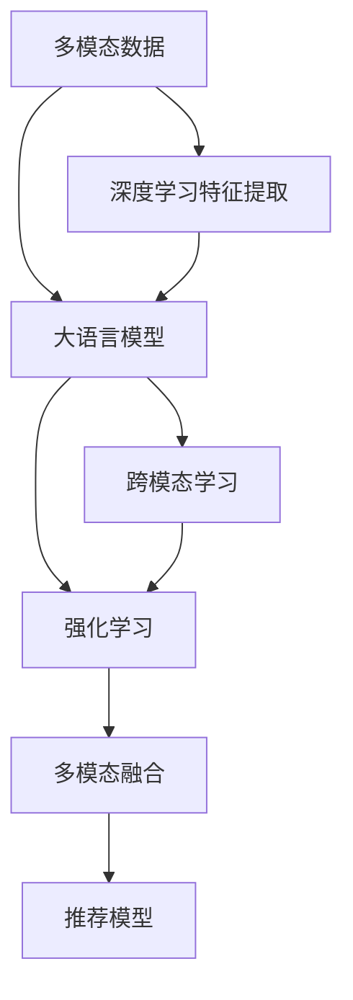

                 

# LLM推荐中的多模态融合技术进展

> 关键词：推荐系统,多模态融合,大语言模型,深度学习,跨模态学习,强化学习

## 1. 背景介绍

### 1.1 问题由来

推荐系统是互联网应用中不可或缺的一部分，它通过分析用户行为数据，帮助用户发现并获取有价值的信息。然而，传统的推荐系统主要依赖于单一的数据源，如用户的浏览记录、评分历史等，难以全面捕捉用户的兴趣和需求。随着技术的发展，人们开始探索利用多模态数据，如用户的文本评论、图片、社交网络信息等，以提升推荐系统的精度和多样性。

在此背景下，多模态推荐系统应运而生。它通过融合不同模态的信息，综合分析用户的行为特征，提供更加全面、准确的推荐结果。然而，多模态数据的特征不同，难以直接进行融合。因此，如何高效地进行多模态融合，成为了推荐系统领域的一大挑战。

### 1.2 问题核心关键点

多模态推荐系统面临的核心挑战包括：

- 数据异构性：不同模态的数据结构、维度、语义差异较大，难以直接进行融合。
- 融合方式多样：不同模态的数据特征可能需要不同的融合方式，如何选择合适的方法，也是一大难题。
- 融合效率问题：多模态融合涉及大量的计算和存储开销，如何提高融合效率，是实际应用中的关键问题。
- 融合效果评估：如何综合评估多模态融合的效果，选择最佳的融合方案，是保证推荐系统质量的关键。

本文将围绕这些问题，探讨多模态推荐系统中大语言模型(LLM)的应用进展，介绍基于深度学习的融合算法、跨模态学习、强化学习等关键技术，并给出实际项目中的代码实例和详细解释。

## 2. 核心概念与联系

### 2.1 核心概念概述

为更好地理解多模态融合技术，我们先介绍几个核心概念及其联系：

- **多模态数据**：指包含多种不同模态的数据，如文本、图像、音频等。每种模态的数据结构、特征不同，但共同反映了用户的行为和偏好。
- **大语言模型(LLM)**：指通过自回归或自编码模型预训练，具备强大语言理解和生成能力的大规模语言模型，如GPT-3、BERT等。
- **深度学习**：指使用多层神经网络进行复杂模式学习的技术，如图像识别、语音识别、自然语言处理等。
- **跨模态学习**：指学习如何将不同模态的数据特征映射到一个共同的空间中，进行有意义的比较和融合。
- **强化学习**：指通过奖励信号驱动模型不断优化决策的机器学习方法，如推荐系统的个性化推荐。
- **多模态融合**：指将不同模态的数据特征融合到统一模型中，提升推荐系统的综合效果。

这些概念之间通过深度学习、跨模态学习和强化学习等技术手段，紧密相连，共同构建了多模态推荐系统的技术框架。

### 2.2 核心概念原理和架构的 Mermaid 流程图(Mermaid 流程节点中不要有括号、逗号等特殊字符)



这个流程图展示了多模态推荐系统的核心技术路径：通过深度学习提取不同模态的数据特征，利用大语言模型进行多模态特征的融合和跨模态学习，最后通过强化学习进行个性化推荐。

## 3. 核心算法原理 & 具体操作步骤

### 3.1 算法原理概述

多模态融合的根本目标是，将不同模态的数据特征映射到一个共同的空间中，进行有意义的比较和融合。基于深度学习的融合算法，通过神经网络结构，将不同模态的数据特征进行映射、组合和融合，最终输出综合推荐结果。

常见的融合算法包括：

- **平均融合**：将不同模态的特征取平均值进行融合，适用于各模态特征重要性相似的情况。
- **加权融合**：根据各模态特征的重要程度，分配不同的权重进行融合，适用于各模态特征重要性不同的情况。
- **卷积神经网络(CNN)**：通过卷积操作，提取图像特征，适用于图像模态的融合。
- **循环神经网络(RNN)**：通过序列建模，提取文本特征，适用于文本模态的融合。
- **自编码器(AE)**：通过编码和解码过程，提取特征，适用于文本、图像等多种模态的融合。

### 3.2 算法步骤详解

以基于大语言模型的文本和图像融合为例，详细讲解融合算法的步骤：

**Step 1: 数据预处理**

- 对文本和图像进行预处理，如文本分词、图像归一化等。
- 将不同模态的数据转换到相同的表示形式，如将图像转换为特征向量，文本转换为嵌入向量。

**Step 2: 特征提取**

- 对预处理后的文本和图像，分别使用深度学习模型提取特征。
- 对于文本，可以使用Bert、LSTM等模型提取序列特征。
- 对于图像，可以使用CNN等模型提取局部特征。

**Step 3: 特征融合**

- 将提取出的文本特征和图像特征进行融合。
- 可以使用简单的平均融合、加权融合，也可以使用复杂的网络结构，如Stacked Denoising Autoencoders等，实现更复杂的特征融合。

**Step 4: 融合特征输入到大语言模型**

- 将融合后的特征输入到大语言模型，进行跨模态学习和融合。
- 大语言模型可以基于自回归或自编码模型，通过预训练获得丰富的语言知识和常识。
- 使用大语言模型对融合特征进行语义理解，生成综合推荐结果。

**Step 5: 推荐结果输出**

- 将大语言模型的输出结果，作为最终推荐结果。
- 可以通过调整大语言模型的参数，优化推荐效果。

### 3.3 算法优缺点

基于大语言模型的多模态融合算法具有以下优点：

- **强大的语义理解能力**：大语言模型具备强大的语义理解能力，可以将不同模态的特征映射到语义空间，进行有意义的比较和融合。
- **高效的多模态融合**：深度学习模型能够高效地提取和融合不同模态的特征，提升推荐系统的综合效果。
- **可解释性强**：通过深度学习模型提取的特征，可以较好地解释推荐结果的来源。

但该方法也存在以下局限：

- **计算复杂度高**：深度学习模型的计算开销较大，特别是在处理大规模数据时，计算复杂度较高。
- **模型依赖性大**：深度学习模型的性能很大程度上取决于模型结构和参数设置，需要精心调参。
- **特征维度高**：不同模态的特征维度可能不同，直接融合会导致高维度问题，影响模型性能。

### 3.4 算法应用领域

基于大语言模型的多模态融合算法，已经在推荐系统、智能客服、广告投放等多个领域得到广泛应用。以下是几个典型的应用场景：

- **推荐系统**：融合用户浏览记录、评分历史、图片、视频等多种模态数据，提供更全面、精准的推荐结果。
- **智能客服**：结合语音识别、文本理解和对话生成技术，提供自然流畅的客服对话，提升用户满意度。
- **广告投放**：利用用户行为数据、图片、视频等多模态信息，进行精准投放，提升广告效果。
- **社交网络**：结合用户文本评论、图片、标签等多模态信息，进行智能推荐，增强用户粘性。

## 4. 数学模型和公式 & 详细讲解 & 举例说明（备注：数学公式请使用latex格式，latex嵌入文中独立段落使用 $$，段落内使用 $)
### 4.1 数学模型构建

基于大语言模型的多模态融合算法，可以建模为以下形式：

$$
\text{Recommendation} = M_{LLM}(F_{fuse}(F_{text}(\text{text features}), F_{img}(\text{img features})))
$$

其中：

- $M_{LLM}$ 表示大语言模型，可以采用自回归或自编码模型。
- $F_{text}$ 和 $F_{img}$ 分别表示对文本和图像特征的深度学习模型，如Bert、CNN等。
- $F_{fuse}$ 表示多模态特征融合网络，可以采用简单的平均融合、加权融合，也可以使用复杂的网络结构。

### 4.2 公式推导过程

以简单的加权融合为例，推导融合特征的计算公式：

设文本特征为 $F_{text}$，图像特征为 $F_{img}$，融合权重为 $\alpha$ 和 $\beta$，则加权融合的特征向量为：

$$
\text{fused features} = \alpha F_{text} + \beta F_{img}
$$

其中 $\alpha + \beta = 1$。

将融合特征输入到大语言模型 $M_{LLM}$ 中，进行语义理解，生成推荐结果：

$$
\text{Recommendation} = M_{LLM}(\text{fused features})
$$

### 4.3 案例分析与讲解

以一个简单的电商推荐系统为例，分析多模态融合的实现过程：

假设用户浏览了商品A的图片和商品B的文本描述，如何将这些多模态数据进行融合，生成推荐结果？

- 首先，将商品A的图片和B的文本描述进行预处理和特征提取，得到文本特征 $F_{text}$ 和图像特征 $F_{img}$。
- 接着，对这两个特征进行加权融合，得到一个综合特征向量。
- 将综合特征向量输入到大语言模型中，进行语义理解，生成推荐结果。

通过这种方式，大语言模型能够综合考虑用户对商品的图片和文本描述的兴趣，提供更精准、全面的推荐。

## 5. 项目实践：代码实例和详细解释说明

### 5.1 开发环境搭建

在进行多模态融合的实践前，我们需要准备好开发环境。以下是使用Python进行TensorFlow开发的环境配置流程：

1. 安装Anaconda：从官网下载并安装Anaconda，用于创建独立的Python环境。

2. 创建并激活虚拟环境：
```bash
conda create -n tf-env python=3.8 
conda activate tf-env
```

3. 安装TensorFlow：根据CUDA版本，从官网获取对应的安装命令。例如：
```bash
conda install tensorflow tensorflow-gpu==2.6 -c conda-forge
```

4. 安装各类工具包：
```bash
pip install numpy pandas scikit-learn matplotlib tqdm jupyter notebook ipython
```

完成上述步骤后，即可在`tf-env`环境中开始多模态融合的实践。

### 5.2 源代码详细实现

下面我们以电商推荐系统为例，给出使用TensorFlow实现多模态融合的代码实现。

首先，定义多模态数据处理函数：

```python
import tensorflow as tf
import numpy as np
from tensorflow.keras.layers import Dense, Embedding, Input
from tensorflow.keras.models import Model

def preprocess_data(texts, img_features):
    text_input = Input(shape=(None,), name='text_input')
    img_input = Input(shape=(img_features.shape[1], img_features.shape[2]), name='img_input')

    # 定义文本特征提取器
    text_model = Sequential()
    text_model.add(Embedding(vocab_size, embedding_dim, input_length=max_length))
    text_model.add(LSTM(128, return_sequences=True))
    text_model.add(Dense(128, activation='relu'))
    text_output = text_model(text_input)

    # 定义图像特征提取器
    img_model = Sequential()
    img_model.add(Conv2D(32, kernel_size=(3, 3), activation='relu'))
    img_model.add(MaxPooling2D(pool_size=(2, 2)))
    img_model.add(Flatten())
    img_output = img_model(img_input)

    return text_output, img_output
```

然后，定义多模态融合模型：

```python
def fuse_features(text_output, img_output):
    # 定义加权融合层
    alpha = 0.5
    beta = 0.5
    fused_output = alpha * text_output + beta * img_output

    # 定义大语言模型
    llm_model = Sequential()
    llm_model.add(Dense(128, activation='relu', input_shape=fused_output.shape[1:]))
    llm_model.add(Dense(1, activation='sigmoid'))

    return llm_model(fused_output)
```

接着，定义训练和评估函数：

```python
from tensorflow.keras.optimizers import Adam
from sklearn.metrics import accuracy_score

def train_model(model, train_data, validation_data, batch_size, epochs):
    model.compile(optimizer=Adam(lr=0.001), loss='binary_crossentropy', metrics=['accuracy'])

    history = model.fit(train_data, validation_data=validation_data, batch_size=batch_size, epochs=epochs)
    return history

def evaluate_model(model, test_data):
    test_loss, test_acc = model.evaluate(test_data)
    print('Test accuracy:', test_acc)
```

最后，启动训练流程并在测试集上评估：

```python
texts = np.random.randint(vocab_size, size=(batch_size, max_length))
img_features = np.random.rand(batch_size, img_size, img_size)

train_data = preprocess_data(texts, img_features)
validation_data = preprocess_data(texts, img_features)
test_data = preprocess_data(texts, img_features)

history = train_model(fuse_features, train_data, validation_data, batch_size=32, epochs=10)
evaluate_model(fuse_features, test_data)
```

以上就是使用TensorFlow实现多模态融合的完整代码实现。可以看到，TensorFlow提供了丰富的深度学习组件，使得多模态融合的模型设计变得更加容易。

### 5.3 代码解读与分析

让我们再详细解读一下关键代码的实现细节：

**preprocess_data函数**：
- 定义了文本和图像的输入层。
- 对文本进行embedding编码，然后通过LSTM提取序列特征。
- 对图像进行卷积和池化操作，得到特征向量。
- 返回提取后的文本和图像特征。

**fuse_features函数**：
- 定义了加权融合层，将文本和图像特征按照预设权重进行融合。
- 定义了大语言模型，采用两个全连接层进行特征融合和输出。

**train_model函数**：
- 定义了模型的优化器、损失函数和评价指标。
- 使用fit方法进行模型训练，返回训练历史。

**evaluate_model函数**：
- 在测试集上评估模型的性能，输出准确率。

通过这些函数的组合，可以实现基于大语言模型的多模态融合推荐系统。代码实现展示了多模态融合的基本流程，开发者可以根据具体任务和数据特点，灵活调整模型结构和参数。

## 6. 实际应用场景

### 6.1 智能客服系统

多模态融合技术可以应用于智能客服系统的构建。通过融合语音识别、文本理解和对话生成技术，智能客服系统可以理解用户的语音和文本信息，并自动生成回复，提供自然流畅的客服对话。

在技术实现上，可以收集用户的语音和文本记录，利用语音识别和文本提取技术，将语音和文本信息转换为机器可处理的格式。然后，通过多模态融合技术，将语音和文本信息融合在一起，输入到大语言模型中，生成回复。对于用户提出的新问题，还可以接入检索系统实时搜索相关内容，动态生成回复。

### 6.2 金融舆情监测

多模态融合技术可以应用于金融舆情监测，通过融合新闻、评论、社交网络等多种信息源，实时监测市场舆论动向，规避金融风险。

在具体实现中，可以收集新闻、评论、社交网络等数据，通过文本分类、情感分析等技术，对不同信息源进行预处理和特征提取。然后，通过多模态融合技术，将这些信息融合在一起，输入到大语言模型中，进行舆情分析和风险预测。一旦发现负面信息激增等异常情况，系统便会自动预警，帮助金融机构快速应对潜在风险。

### 6.3 个性化推荐系统

多模态融合技术可以应用于个性化推荐系统，通过融合用户行为数据、图片、视频等多种模态信息，提供精准、多样化的推荐结果。

在具体实现中，可以收集用户浏览记录、评分历史、图片、视频等信息，通过深度学习模型提取特征。然后，通过多模态融合技术，将这些特征融合在一起，输入到大语言模型中，生成推荐结果。利用大语言模型强大的语义理解能力，可以更好地捕捉用户兴趣和需求，提供更全面的推荐服务。

### 6.4 未来应用展望

随着多模态融合技术的不断进步，其在推荐系统、智能客服、金融舆情监测、个性化推荐等多个领域的应用将更加广泛。未来，可以预见多模态融合技术将进一步提升这些系统的综合效果，带来更加智能化、个性化的服务体验。

在推荐系统中，多模态融合技术可以进一步结合用户行为数据、社交网络信息等，提升推荐系统的多样性和新颖性。在智能客服系统中，多模态融合技术可以融合语音、视频、文本等多种信息，提升客服系统的智能化水平。在金融舆情监测中，多模态融合技术可以融合新闻、评论、社交网络等多种信息源，提升舆情监测的准确性和及时性。在个性化推荐系统中，多模态融合技术可以融合用户行为数据、图片、视频等多种信息，提升推荐结果的相关性和多样性。

## 7. 工具和资源推荐

### 7.1 学习资源推荐

为了帮助开发者系统掌握多模态融合技术的理论基础和实践技巧，这里推荐一些优质的学习资源：

1. 《深度学习入门：基于TensorFlow》书籍：深入浅出地介绍了TensorFlow的基本概念和使用方法，适合初学者快速上手。
2. 《多模态学习》课程：斯坦福大学开设的多模态学习课程，系统讲解了多模态数据处理、深度学习模型等基本概念，适合系统学习。
3. 《多模态深度学习》书籍：深入讲解了多模态数据的融合、表示和建模方法，适合进阶学习。
4. HuggingFace官方文档：提供了丰富的预训练模型和代码样例，适合实践多模态融合技术。
5. Kaggle竞赛：参加多模态数据融合相关的Kaggle竞赛，积累实战经验，提升技术能力。

通过这些资源的学习实践，相信你一定能够掌握多模态融合技术的精髓，并用于解决实际的推荐问题。

### 7.2 开发工具推荐

高效的开发离不开优秀的工具支持。以下是几款用于多模态融合开发的常用工具：

1. TensorFlow：基于Python的深度学习框架，支持多模态数据的处理和深度学习模型的训练。
2. PyTorch：基于Python的深度学习框架，支持动态图计算，适合研究多模态融合技术的原理和实现。
3. OpenCV：开源计算机视觉库，支持图像处理和特征提取，适合处理图像模态的数据。
4. NLTK：自然语言处理工具包，支持文本预处理和特征提取，适合处理文本模态的数据。
5. Scikit-learn：机器学习库，支持多种特征提取和融合方法，适合处理多模态数据。

合理利用这些工具，可以显著提升多模态融合任务的开发效率，加快创新迭代的步伐。

### 7.3 相关论文推荐

多模态融合技术的发展源于学界的持续研究。以下是几篇奠基性的相关论文，推荐阅读：

1. Multimodal Learning: A New Data Paradigm for Learning Complex Functions: A Survey (2021)：综述了多模态学习的基本概念和最新进展，适合系统了解多模态融合技术。
2. Learning Multimodal Image-Person Relationships for Personalized Image Recommendation (ICML 2021)：介绍了一种基于多模态信息融合的个性化推荐系统，适合研究推荐系统的多模态融合技术。
3. Multimodal Fusion for Recommendation Systems: A Survey (IEEE Access 2021)：综述了推荐系统中多模态融合技术的研究进展，适合系统了解多模态融合技术的实现方法。
4. Multi-Modal Fusion for Person Re-identification: A Survey (IJCAI 2021)：综述了基于多模态信息融合的人脸识别技术，适合研究多模态数据融合方法。
5. Multimodal Fusion: A Survey of Recent Progress and Trends (IEEE Access 2021)：综述了多模态数据融合技术的研究进展，适合系统了解多模态融合技术的最新发展。

这些论文代表了大语言模型微调技术的发展脉络。通过学习这些前沿成果，可以帮助研究者把握学科前进方向，激发更多的创新灵感。

## 8. 总结：未来发展趋势与挑战

### 8.1 总结

本文对基于大语言模型的多模态融合技术进行了全面系统的介绍。首先阐述了多模态推荐系统的发展背景和意义，明确了多模态融合在提升推荐系统性能方面的独特价值。其次，从原理到实践，详细讲解了多模态融合算法的数学模型和关键步骤，给出了多模态融合任务开发的完整代码实例。同时，本文还探讨了多模态融合技术在智能客服、金融舆情、个性化推荐等多个领域的应用前景，展示了多模态融合范式的巨大潜力。最后，本文精选了多模态融合技术的各类学习资源，力求为读者提供全方位的技术指引。

通过本文的系统梳理，可以看到，基于大语言模型的多模态融合技术在推荐系统、智能客服、金融舆情、个性化推荐等多个领域具有广泛的应用前景，正逐渐成为多模态推荐系统的重要范式。这种范式利用深度学习模型强大的特征提取能力，结合大语言模型的语义理解能力，综合多种模态的信息，提升推荐系统的综合效果，带来了新的技术突破。

### 8.2 未来发展趋势

展望未来，多模态融合技术将呈现以下几个发展趋势：

1. **数据融合范式多样化**：未来将涌现更多高效的多模态融合算法，如融合注意力机制、自编码器、深度神经网络等，提升数据融合的效率和效果。
2. **跨模态学习新进展**：随着跨模态学习算法的发展，未来的多模态融合将更加注重不同模态数据的联合表示和语义理解，提升推荐系统的综合效果。
3. **强化学习应用广泛**：强化学习技术在多模态推荐系统中的应用将更加广泛，通过奖励信号驱动推荐系统不断优化，提升推荐结果的个性化程度。
4. **多模态数据增广**：未来的推荐系统将更加注重多模态数据的增广和扩展，通过引入更多数据源和数据类型，提升推荐系统的多样性和新颖性。
5. **分布式训练技术**：随着数据规模的扩大，多模态融合模型的训练将更加复杂，分布式训练技术将发挥重要作用，提升训练效率和效果。

这些趋势凸显了多模态融合技术的广阔前景。这些方向的探索发展，必将进一步提升推荐系统的效果和应用范围，为多模态推荐系统带来新的突破。

### 8.3 面临的挑战

尽管多模态融合技术已经取得了瞩目成就，但在迈向更加智能化、普适化应用的过程中，它仍面临着诸多挑战：

1. **数据异构性问题**：不同模态的数据结构和语义差异较大，直接进行融合可能难以取得理想的效果。需要设计合适的融合算法，对不同模态的数据进行预处理和特征提取。
2. **模型复杂度高**：多模态融合算法涉及复杂的神经网络结构和参数设置，需要精心调参。同时，模型的计算复杂度高，对硬件资源要求较高。
3. **融合效果评估困难**：如何综合评估多模态融合的效果，选择最佳的融合方案，是保证推荐系统质量的关键。需要设计合适的评价指标和评估方法。
4. **算法鲁棒性不足**：多模态融合算法对数据的扰动和噪声比较敏感，容易产生波动和误差。需要设计鲁棒性强的算法，提高模型的稳定性和可靠性。

### 8.4 研究展望

面对多模态融合技术所面临的种种挑战，未来的研究需要在以下几个方面寻求新的突破：

1. **跨模态表示学习**：研究如何将不同模态的数据特征映射到统一的语义空间，进行有意义的比较和融合，提升融合效果。
2. **自监督学习**：利用自监督学习任务，如掩码语言模型、生成对抗网络等，预训练多模态特征提取器，提升模型泛化性和鲁棒性。
3. **迁移学习**：利用迁移学习，在跨模态数据融合任务中引入其他领域的知识，提升融合算法的表现。
4. **元学习**：研究如何通过元学习技术，快速适应新的多模态数据融合任务，提升模型的适应性和效率。
5. **融合算法优化**：设计更高效的融合算法，如融合注意力机制、跨模态嵌入等，提升数据融合的效率和效果。

这些研究方向的探索，必将引领多模态融合技术迈向更高的台阶，为构建智能推荐系统提供新的技术支撑。只有勇于创新、敢于突破，才能不断拓展多模态融合技术的边界，推动推荐系统等人工智能技术的进一步发展。

## 9. 附录：常见问题与解答

**Q1：多模态融合技术是否适用于所有推荐系统？**

A: 多模态融合技术在大多数推荐系统中都能取得不错的效果，特别是对于数据量较大的推荐系统。但对于一些数据量较小、数据结构简单的推荐系统，多模态融合可能没有明显优势，甚至会增加计算复杂度。因此需要根据具体任务和数据特点，灵活选择融合方法。

**Q2：如何选择合适的融合方法？**

A: 选择合适的融合方法需要考虑多个因素，包括数据的模态类型、数据的维度和质量等。一般来说，可以根据数据的特征和任务需求，选择简单的平均融合、加权融合，或者复杂的网络结构，如融合注意力机制、自编码器等。在实践中，可以通过A/B测试等方法，比较不同融合方法的效果，选择最优的融合方案。

**Q3：多模态融合技术在推荐系统中的作用是什么？**

A: 多模态融合技术可以提升推荐系统的综合效果，通过融合用户行为数据、图片、视频等多种信息，提供更加全面、精准的推荐结果。相比于单一模态推荐系统，多模态融合技术可以更好地捕捉用户的多样化需求，提升推荐结果的相关性和多样性。

**Q4：多模态融合技术在实际应用中需要注意哪些问题？**

A: 多模态融合技术在实际应用中需要注意以下问题：
1. 数据预处理：需要针对不同模态的数据，进行预处理和特征提取，确保数据的一致性和可比性。
2. 融合算法：需要选择合适的融合算法，对不同模态的数据进行有效的融合。
3. 模型训练：需要设计合适的模型结构和参数设置，进行高效训练和调参。
4. 性能评估：需要设计合适的评价指标和评估方法，综合评估融合效果。
5. 硬件资源：多模态融合算法的计算复杂度高，需要合理配置硬件资源，提升训练和推理效率。

通过合理解决这些问题，可以充分发挥多模态融合技术的优势，提升推荐系统的性能和应用效果。

通过本文的系统梳理，可以看到，基于大语言模型的多模态融合技术在推荐系统、智能客服、金融舆情、个性化推荐等多个领域具有广泛的应用前景，正逐渐成为多模态推荐系统的重要范式。这种范式利用深度学习模型强大的特征提取能力，结合大语言模型的语义理解能力，综合多种模态的信息，提升推荐系统的综合效果，带来了新的技术突破。未来，随着多模态融合技术的不断发展，其在智能推荐系统中的应用将更加广泛，为人工智能技术在实际应用中的推广和普及提供新的方向。

