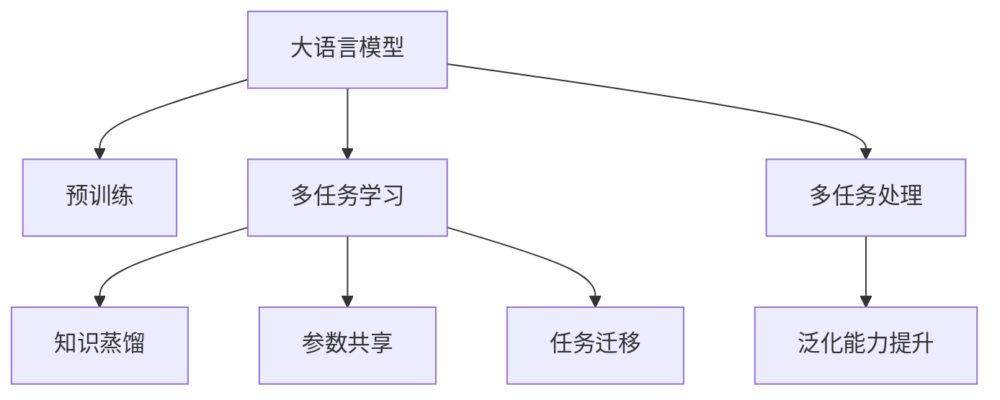

                 

# LLM的versatility：多任务处理能力探析

> 关键词：多任务学习,大语言模型,多任务处理,预训练,Transformer,BERT,知识蒸馏,参数共享,任务迁移

## 1. 背景介绍

### 1.1 问题由来

近年来，大语言模型(LLM, Large Language Models)在自然语言处理(NLP, Natural Language Processing)领域取得了突破性的进展。这些模型通常基于自回归模型(如GPT)或自编码模型(如BERT)，通过在大量无标签文本数据上进行预训练，学习到广泛的语义和语法知识。这种大规模的预训练使得模型能够应用于多种任务，如文本分类、命名实体识别、关系抽取、机器翻译等，表现出了极高的泛化能力和多任务处理能力。

然而，尽管大语言模型在多种任务上取得了显著的性能提升，其性能提升的幅度并不总是与任务复杂度成正比。有些任务的性能提升幅度较大，而有些任务则相对较小，这表明大语言模型的多任务处理能力存在差异。因此，深入研究大语言模型的多任务处理能力，如何优化模型以适应不同的任务，成为当前研究的热点问题。

### 1.2 问题核心关键点

本文旨在探讨大语言模型的多任务处理能力，从多个维度进行分析，包括其多任务处理能力的原理、不同算法步骤的详细说明、应用的优缺点及领域、数学模型和公式推导，以及实际应用场景和未来发展趋势等。本文将揭示大语言模型在多任务处理中的潜在问题，并探讨如何克服这些挑战，进一步提升模型的泛化能力。

## 2. 核心概念与联系

### 2.1 核心概念概述

为了更好地理解大语言模型的多任务处理能力，首先需了解几个关键概念：

- **大语言模型(LLM)**：以Transformer模型为代表，通过在大量无标签文本数据上进行预训练，学习到通用的语言表示，具备强大的语言理解和生成能力。
- **预训练(Pre-training)**：指在大量无标签文本数据上，通过自监督学习任务训练通用语言模型的过程。常见的预训练任务包括语言建模、掩码语言模型等。
- **多任务学习(MTL, Multi-task Learning)**：指同时训练多个任务，通过共享部分模型参数，提高模型在多个任务上的泛化性能。
- **知识蒸馏(Distillation)**：指将一个复杂的模型(教师模型)的知识迁移到另一个更简单的模型(学生模型)上，提高后者的泛化能力。
- **参数共享(Parameter Sharing)**：指在多个任务中，共享部分模型的参数，减少需要优化的参数数量，提高模型训练效率。
- **任务迁移(Task Transfer)**：指将预训练模型在特定任务上的知识迁移到另一个相关但不同的任务上，提升新任务的性能。

这些核心概念之间的逻辑关系可以通过以下Mermaid流程图来展示：



这个流程图展示了大语言模型的核心概念及其之间的关系：

1. 大语言模型通过预训练获得基础能力。
2. 多任务学习通过共享部分参数，提升模型在多个任务上的泛化能力。
3. 知识蒸馏通过复杂模型与简单模型的知识迁移，提高模型的泛化能力。
4. 参数共享减少需要优化的参数数量，提高模型训练效率。
5. 任务迁移将特定任务的知识迁移到相关但不同的任务上，提升新任务的性能。
6. 多任务处理是利用大语言模型在多个任务上的一致性，提升模型的泛化能力。

这些概念共同构成了大语言模型的学习框架，使其能够高效地在多个任务上表现优异。

## 3. 核心算法原理 & 具体操作步骤

### 3.1 算法原理概述

大语言模型的多任务处理能力主要通过多任务学习实现。多任务学习的基本思想是在同一个模型上训练多个任务，通过共享部分模型参数，提高模型在多个任务上的泛化性能。

形式化地，设大语言模型 $M_{\theta}$，其中 $\theta$ 为模型参数。给定多个任务 $T_1, T_2, \ldots, T_n$ 和其对应的训练数据集 $D_1, D_2, \ldots, D_n$，多任务学习的目标是最小化所有任务损失函数的加权和：

$$
\mathcal{L}(\theta) = \sum_{i=1}^n \alpha_i \mathcal{L}_i(M_{\theta}, D_i)
$$

其中 $\alpha_i$ 为任务权重，通常根据任务复杂度和数据规模进行设置，以保证模型能够均衡地处理所有任务。

### 3.2 算法步骤详解

基于多任务学习的大语言模型多任务处理一般包括以下关键步骤：

**Step 1: 准备预训练模型和数据集**
- 选择合适的预训练语言模型 $M_{\theta}$ 作为初始化参数，如 BERT、GPT 等。
- 准备多个任务 $T_1, T_2, \ldots, T_n$ 的标注数据集 $D_1, D_2, \ldots, D_n$，划分为训练集、验证集和测试集。一般要求标注数据与预训练数据的分布不要差异过大。

**Step 2: 设计任务适配层**
- 根据任务类型，在预训练模型顶层设计合适的输出层和损失函数。
- 对于分类任务，通常在顶层添加线性分类器和交叉熵损失函数。
- 对于生成任务，通常使用语言模型的解码器输出概率分布，并以负对数似然为损失函数。

**Step 3: 设置多任务超参数**
- 选择合适的优化算法及其参数，如 AdamW、SGD 等，设置学习率、批大小、迭代轮数等。
- 设置正则化技术及强度，包括权重衰减、Dropout、Early Stopping等。
- 确定共享预训练参数的策略，如共享所有层或仅共享顶层。

**Step 4: 执行梯度训练**
- 将训练集数据分批次输入模型，前向传播计算损失函数。
- 反向传播计算参数梯度，根据设定的优化算法和学习率更新模型参数。
- 周期性在验证集上评估模型性能，根据性能指标决定是否触发 Early Stopping。
- 重复上述步骤直到满足预设的迭代轮数或 Early Stopping 条件。

**Step 5: 测试和部署**
- 在测试集上评估多任务模型 $M_{\hat{\theta}}$ 的性能，对比微调前后的精度提升。
- 使用多任务模型对新样本进行推理预测，集成到实际的应用系统中。
- 持续收集新的数据，定期重新微调模型，以适应数据分布的变化。

以上是基于多任务学习的大语言模型多任务处理的一般流程。在实际应用中，还需要针对具体任务的特点，对多任务过程的各个环节进行优化设计，如改进训练目标函数，引入更多的正则化技术，搜索最优的超参数组合等，以进一步提升模型性能。

### 3.3 算法优缺点

多任务学习具有以下优点：
1. 提高泛化性能。通过共享部分模型参数，多任务学习能够提高模型在多个任务上的泛化性能。
2. 参数共享。减少需要优化的参数数量，提高模型训练效率。
3. 高效利用数据。利用多任务学习，可以同时训练多个任务，充分利用标注数据。
4. 任务迁移。通过共享预训练权重，多任务学习可以提升新任务的性能。

同时，该方法也存在一定的局限性：
1. 模型复杂度高。多任务学习需要设计多个任务适配层，增加了模型的复杂度。
2. 学习率不易调节。多任务学习中，不同任务的训练难度不同，学习率的调节需要谨慎。
3. 任务之间的干扰。某些任务可能会干扰其他任务的训练，导致性能下降。
4. 任务迁移难度。预训练模型的迁移能力有限，任务迁移时仍需适应新任务的特征。
5. 参数共享策略复杂。确定共享哪些层需要结合具体任务进行设计，策略较为复杂。

尽管存在这些局限性，但就目前而言，多任务学习仍是大语言模型应用的主流范式。未来相关研究的重点在于如何进一步降低任务间的干扰，提高模型的迁移能力，同时兼顾可解释性和伦理安全性等因素。

### 3.4 算法应用领域

基于大语言模型多任务学习的方法，已经在问答、对话、摘要、翻译、情感分析等诸多NLP任务上取得了优异的效果，成为NLP技术落地应用的重要手段。

- 文本分类：如情感分析、主题分类、意图识别等。通过多任务学习使模型学习文本-标签映射。
- 命名实体识别：识别文本中的人名、地名、机构名等特定实体。通过多任务学习使模型掌握实体边界和类型。
- 关系抽取：从文本中抽取实体之间的语义关系。通过多任务学习使模型学习实体-关系三元组。
- 问答系统：对自然语言问题给出答案。将问题-答案对作为多任务学习数据，训练模型学习匹配答案。
- 机器翻译：将源语言文本翻译成目标语言。通过多任务学习使模型学习语言-语言映射。
- 文本摘要：将长文本压缩成简短摘要。将文章-摘要对作为多任务学习数据，使模型学习抓取要点。
- 对话系统：使机器能够与人自然对话。将多轮对话历史作为上下文，多任务学习模型进行回复生成。

除了上述这些经典任务外，大语言模型多任务学习也被创新性地应用到更多场景中，如可控文本生成、常识推理、代码生成、数据增强等，为NLP技术带来了全新的突破。

## 4. 数学模型和公式 & 详细讲解

### 4.1 数学模型构建

本节将使用数学语言对基于多任务学习的大语言模型多任务处理过程进行更加严格的刻画。

记大语言模型为 $M_{\theta}$，其中 $\theta$ 为模型参数。假设多任务 $T_1, T_2, \ldots, T_n$ 的训练集为 $D_1, D_2, \ldots, D_n$，其中 $D_i=\{(x_{i,j},y_{i,j})\}_{j=1}^{N_i}$。

定义模型 $M_{\theta}$ 在数据样本 $(x,y)$ 上的损失函数为 $\ell(M_{\theta}(x),y)$，则在数据集 $D$ 上的经验风险为：

$$
\mathcal{L}(\theta) = \sum_{i=1}^n \alpha_i \frac{1}{N_i}\sum_{j=1}^{N_i} \ell(M_{\theta}(x_{i,j}),y_{i,j})
$$

其中 $\alpha_i$ 为任务权重，用于平衡不同任务的重要性。

多任务学习的优化目标是最小化经验风险，即找到最优参数：

$$
\theta^* = \mathop{\arg\min}_{\theta} \mathcal{L}(\theta)
$$

在实践中，我们通常使用基于梯度的优化算法（如SGD、Adam等）来近似求解上述最优化问题。设 $\eta$ 为学习率，$\lambda$ 为正则化系数，则参数的更新公式为：

$$
\theta \leftarrow \theta - \eta \nabla_{\theta}\mathcal{L}(\theta) - \eta\lambda\theta
$$

其中 $\nabla_{\theta}\mathcal{L}(\theta)$ 为损失函数对参数 $\theta$ 的梯度，可通过反向传播算法高效计算。

### 4.2 公式推导过程

以下我们以二分类任务为例，推导多任务学习的损失函数及其梯度的计算公式。

假设模型 $M_{\theta}$ 在输入 $x$ 上的输出为 $\hat{y}=M_{\theta}(x) \in [0,1]$，表示样本属于正类的概率。真实标签 $y \in \{0,1\}$。则二分类交叉熵损失函数定义为：

$$
\ell(M_{\theta}(x),y) = -[y\log \hat{y} + (1-y)\log (1-\hat{y})]
$$

将其代入经验风险公式，得：

$$
\mathcal{L}(\theta) = -\sum_{i=1}^n \alpha_i \frac{1}{N_i}\sum_{j=1}^{N_i} [y_{i,j}\log M_{\theta}(x_{i,j})+(1-y_{i,j})\log(1-M_{\theta}(x_{i,j}))
$$

根据链式法则，损失函数对参数 $\theta_k$ 的梯度为：

$$
\frac{\partial \mathcal{L}(\theta)}{\partial \theta_k} = -\sum_{i=1}^n \alpha_i \frac{1}{N_i}\sum_{j=1}^{N_i} (\frac{y_{i,j}}{M_{\theta}(x_{i,j})}-\frac{1-y_{i,j}}{1-M_{\theta}(x_{i,j})}) \frac{\partial M_{\theta}(x_{i,j})}{\partial \theta_k}
$$

其中 $\frac{\partial M_{\theta}(x_{i,j})}{\partial \theta_k}$ 可进一步递归展开，利用自动微分技术完成计算。

在得到损失函数的梯度后，即可带入参数更新公式，完成模型的迭代优化。重复上述过程直至收敛，最终得到适应多个任务的最优模型参数 $\theta^*$。

## 5. 项目实践：代码实例和详细解释说明

### 5.1 开发环境搭建

在进行多任务学习实践前，我们需要准备好开发环境。以下是使用Python进行PyTorch开发的环境配置流程：

1. 安装Anaconda：从官网下载并安装Anaconda，用于创建独立的Python环境。

2. 创建并激活虚拟环境：
```bash
conda create -n pytorch-env python=3.8 
conda activate pytorch-env
```

3. 安装PyTorch：根据CUDA版本，从官网获取对应的安装命令。例如：
```bash
conda install pytorch torchvision torchaudio cudatoolkit=11.1 -c pytorch -c conda-forge
```

4. 安装Transformers库：
```bash
pip install transformers
```

5. 安装各类工具包：
```bash
pip install numpy pandas scikit-learn matplotlib tqdm jupyter notebook ipython
```

完成上述步骤后，即可在`pytorch-env`环境中开始多任务学习实践。

### 5.2 源代码详细实现

这里我们以多任务学习在文本分类和命名实体识别任务中的应用为例，给出使用Transformers库进行多任务学习的PyTorch代码实现。

首先，定义多任务学习的数据处理函数：

```python
from transformers import BertTokenizer
from torch.utils.data import Dataset
import torch

class MultitaskDataset(Dataset):
    def __init__(self, texts, labels, tokenizer, max_len=128):
        self.texts = texts
        self.labels = labels
        self.tokenizer = tokenizer
        self.max_len = max_len
        
    def __len__(self):
        return len(self.texts)
    
    def __getitem__(self, item):
        text = self.texts[item]
        labels = self.labels[item]
        
        encoding = self.tokenizer(text, return_tensors='pt', max_length=self.max_len, padding='max_length', truncation=True)
        input_ids = encoding['input_ids'][0]
        attention_mask = encoding['attention_mask'][0]
        
        # 对token-wise的标签进行编码
        encoded_labels = [tag2id[tag] for tag in labels] 
        encoded_labels.extend([tag2id['O']] * (self.max_len - len(encoded_labels)))
        labels = torch.tensor(encoded_labels, dtype=torch.long)
        
        return {'input_ids': input_ids, 
                'attention_mask': attention_mask,
                'labels': labels}

# 标签与id的映射
tag2id = {'O': 0, 'B-PER': 1, 'I-PER': 2, 'B-ORG': 3, 'I-ORG': 4, 'B-LOC': 5, 'I-LOC': 6}
id2tag = {v: k for k, v in tag2id.items()}

# 创建dataset
tokenizer = BertTokenizer.from_pretrained('bert-base-cased')

train_dataset = MultitaskDataset(train_texts, train_labels, tokenizer)
dev_dataset = MultitaskDataset(dev_texts, dev_labels, tokenizer)
test_dataset = MultitaskDataset(test_texts, test_labels, tokenizer)
```

然后，定义模型和优化器：

```python
from transformers import BertForTokenClassification, AdamW

model = BertForTokenClassification.from_pretrained('bert-base-cased', num_labels=len(tag2id))

optimizer = AdamW(model.parameters(), lr=2e-5)
```

接着，定义训练和评估函数：

```python
from torch.utils.data import DataLoader
from tqdm import tqdm
from sklearn.metrics import classification_report

device = torch.device('cuda') if torch.cuda.is_available() else torch.device('cpu')
model.to(device)

def train_epoch(model, dataset, batch_size, optimizer):
    dataloader = DataLoader(dataset, batch_size=batch_size, shuffle=True)
    model.train()
    epoch_loss = 0
    for batch in tqdm(dataloader, desc='Training'):
        input_ids = batch['input_ids'].to(device)
        attention_mask = batch['attention_mask'].to(device)
        labels = batch['labels'].to(device)
        model.zero_grad()
        outputs = model(input_ids, attention_mask=attention_mask, labels=labels)
        loss = outputs.loss
        epoch_loss += loss.item()
        loss.backward()
        optimizer.step()
    return epoch_loss / len(dataloader)

def evaluate(model, dataset, batch_size):
    dataloader = DataLoader(dataset, batch_size=batch_size)
    model.eval()
    preds, labels = [], []
    with torch.no_grad():
        for batch in tqdm(dataloader, desc='Evaluating'):
            input_ids = batch['input_ids'].to(device)
            attention_mask = batch['attention_mask'].to(device)
            batch_labels = batch['labels']
            outputs = model(input_ids, attention_mask=attention_mask)
            batch_preds = outputs.logits.argmax(dim=2).to('cpu').tolist()
            batch_labels = batch_labels.to('cpu').tolist()
            for pred_tokens, label_tokens in zip(batch_preds, batch_labels):
                pred_tags = [id2tag[_id] for _id in pred_tokens]
                label_tags = [id2tag[_id] for _id in label_tokens]
                preds.append(pred_tags[:len(label_tags)])
                labels.append(label_tags)
                
    print(classification_report(labels, preds))
```

最后，启动训练流程并在测试集上评估：

```python
epochs = 5
batch_size = 16

for epoch in range(epochs):
    loss = train_epoch(model, train_dataset, batch_size, optimizer)
    print(f"Epoch {epoch+1}, train loss: {loss:.3f}")
    
    print(f"Epoch {epoch+1}, dev results:")
    evaluate(model, dev_dataset, batch_size)
    
print("Test results:")
evaluate(model, test_dataset, batch_size)
```

以上就是使用PyTorch对BERT进行文本分类和命名实体识别任务的多任务学习的完整代码实现。可以看到，得益于Transformers库的强大封装，我们可以用相对简洁的代码完成BERT模型的加载和微调。

### 5.3 代码解读与分析

让我们再详细解读一下关键代码的实现细节：

**MultitaskDataset类**：
- `__init__`方法：初始化文本、标签、分词器等关键组件。
- `__len__`方法：返回数据集的样本数量。
- `__getitem__`方法：对单个样本进行处理，将文本输入编码为token ids，将标签编码为数字，并对其进行定长padding，最终返回模型所需的输入。

**tag2id和id2tag字典**：
- 定义了标签与数字id之间的映射关系，用于将token-wise的预测结果解码回真实的标签。

**训练和评估函数**：
- 使用PyTorch的DataLoader对数据集进行批次化加载，供模型训练和推理使用。
- 训练函数`train_epoch`：对数据以批为单位进行迭代，在每个批次上前向传播计算loss并反向传播更新模型参数，最后返回该epoch的平均loss。
- 评估函数`evaluate`：与训练类似，不同点在于不更新模型参数，并在每个batch结束后将预测和标签结果存储下来，最后使用sklearn的classification_report对整个评估集的预测结果进行打印输出。

**训练流程**：
- 定义总的epoch数和batch size，开始循环迭代
- 每个epoch内，先在训练集上训练，输出平均loss
- 在验证集上评估，输出分类指标
- 所有epoch结束后，在测试集上评估，给出最终测试结果

可以看到，PyTorch配合Transformers库使得BERT的多任务学习代码实现变得简洁高效。开发者可以将更多精力放在数据处理、模型改进等高层逻辑上，而不必过多关注底层的实现细节。

当然，工业级的系统实现还需考虑更多因素，如模型的保存和部署、超参数的自动搜索、更灵活的任务适配层等。但核心的多任务学习范式基本与此类似。

## 6. 实际应用场景

### 6.1 智能客服系统

基于大语言模型的多任务学习，可以广泛应用于智能客服系统的构建。传统客服往往需要配备大量人力，高峰期响应缓慢，且一致性和专业性难以保证。而使用多任务学习的对话模型，可以7x24小时不间断服务，快速响应客户咨询，用自然流畅的语言解答各类常见问题。

在技术实现上，可以收集企业内部的历史客服对话记录，将问题和最佳答复构建成监督数据，在此基础上对预训练对话模型进行多任务学习。多任务学习的对话模型能够自动理解用户意图，匹配最合适的答案模板进行回复。对于客户提出的新问题，还可以接入检索系统实时搜索相关内容，动态组织生成回答。如此构建的智能客服系统，能大幅提升客户咨询体验和问题解决效率。

### 6.2 金融舆情监测

金融机构需要实时监测市场舆论动向，以便及时应对负面信息传播，规避金融风险。传统的人工监测方式成本高、效率低，难以应对网络时代海量信息爆发的挑战。基于大语言模型的多任务学习技术，为金融舆情监测提供了新的解决方案。

具体而言，可以收集金融领域相关的新闻、报道、评论等文本数据，并对其进行主题标注和情感标注。在此基础上对预训练语言模型进行多任务学习，使其能够自动判断文本属于何种主题，情感倾向是正面、中性还是负面。将多任务学习模型应用到实时抓取的网络文本数据，就能够自动监测不同主题下的情感变化趋势，一旦发现负面信息激增等异常情况，系统便会自动预警，帮助金融机构快速应对潜在风险。

### 6.3 个性化推荐系统

当前的推荐系统往往只依赖用户的历史行为数据进行物品推荐，无法深入理解用户的真实兴趣偏好。基于大语言模型的多任务学习技术，个性化推荐系统可以更好地挖掘用户行为背后的语义信息，从而提供更精准、多样的推荐内容。

在实践中，可以收集用户浏览、点击、评论、分享等行为数据，提取和用户交互的物品标题、描述、标签等文本内容。将文本内容作为模型输入，用户的后续行为（如是否点击、购买等）作为监督信号，在此基础上对预训练语言模型进行多任务学习。多任务学习的模型能够从文本内容中准确把握用户的兴趣点。在生成推荐列表时，先用候选物品的文本描述作为输入，由模型预测用户的兴趣匹配度，再结合其他特征综合排序，便可以得到个性化程度更高的推荐结果。

### 6.4 未来应用展望

随着大语言模型多任务学习技术的发展，其在更多领域得到应用，为传统行业带来变革性影响。

在智慧医疗领域，基于多任务学习的问答、病历分析、药物研发等应用将提升医疗服务的智能化水平，辅助医生诊疗，加速新药开发进程。

在智能教育领域，多任务学习可应用于作业批改、学情分析、知识推荐等方面，因材施教，促进教育公平，提高教学质量。

在智慧城市治理中，多任务学习技术可应用于城市事件监测、舆情分析、应急指挥等环节，提高城市管理的自动化和智能化水平，构建更安全、高效的未来城市。

此外，在企业生产、社会治理、文娱传媒等众多领域，基于大语言模型多任务学习的人工智能应用也将不断涌现，为经济社会发展注入新的动力。相信随着技术的日益成熟，多任务学习方法将成为人工智能落地应用的重要范式，推动人工智能技术在垂直行业的规模化落地。

## 7. 工具和资源推荐

### 7.1 学习资源推荐

为了帮助开发者系统掌握大语言模型多任务学习的理论基础和实践技巧，这里推荐一些优质的学习资源：

1. 《Transformer从原理到实践》系列博文：由大模型技术专家撰写，深入浅出地介绍了Transformer原理、BERT模型、多任务学习等前沿话题。

2. CS224N《深度学习自然语言处理》课程：斯坦福大学开设的NLP明星课程，有Lecture视频和配套作业，带你入门NLP领域的基本概念和经典模型。

3. 《Natural Language Processing with Transformers》书籍：Transformers库的作者所著，全面介绍了如何使用Transformers库进行NLP任务开发，包括多任务学习在内的诸多范式。

4. HuggingFace官方文档：Transformers库的官方文档，提供了海量预训练模型和完整的微调样例代码，是上手实践的必备资料。

5. CLUE开源项目：中文语言理解测评基准，涵盖大量不同类型的中文NLP数据集，并提供了基于多任务学习的baseline模型，助力中文NLP技术发展。

通过对这些资源的学习实践，相信你一定能够快速掌握大语言模型多任务学习的精髓，并用于解决实际的NLP问题。
###  7.2 开发工具推荐

高效的开发离不开优秀的工具支持。以下是几款用于大语言模型多任务学习开发的常用工具：

1. PyTorch：基于Python的开源深度学习框架，灵活动态的计算图，适合快速迭代研究。大部分预训练语言模型都有PyTorch版本的实现。

2. TensorFlow：由Google主导开发的开源深度学习框架，生产部署方便，适合大规模工程应用。同样有丰富的预训练语言模型资源。

3. Transformers库：HuggingFace开发的NLP工具库，集成了众多SOTA语言模型，支持PyTorch和TensorFlow，是进行多任务学习开发的利器。

4. Weights & Biases：模型训练的实验跟踪工具，可以记录和可视化模型训练过程中的各项指标，方便对比和调优。与主流深度学习框架无缝集成。

5. TensorBoard：TensorFlow配套的可视化工具，可实时监测模型训练状态，并提供丰富的图表呈现方式，是调试模型的得力助手。

6. Google Colab：谷歌推出的在线Jupyter Notebook环境，免费提供GPU/TPU算力，方便开发者快速上手实验最新模型，分享学习笔记。

合理利用这些工具，可以显著提升大语言模型多任务学习的开发效率，加快创新迭代的步伐。

### 7.3 相关论文推荐

大语言模型多任务学习的发展源于学界的持续研究。以下是几篇奠基性的相关论文，推荐阅读：

1. Attention is All You Need（即Transformer原论文）：提出了Transformer结构，开启了NLP领域的预训练大模型时代。

2. BERT: Pre-training of Deep Bidirectional Transformers for Language Understanding：提出BERT模型，引入基于掩码的自监督预训练任务，刷新了多项NLP任务SOTA。

3. Multi-task Learning with Task-Shared Layers：提出多任务学习，通过共享部分模型参数，提高模型在多个任务上的泛化性能。

4. Distillation：提出知识蒸馏，将复杂模型与简单模型的知识进行迁移，提高模型的泛化能力。

5. Multi-task Learning using Uncertainty to Weigh Losses：提出多任务学习，通过引入损失函数的不确定性，提升模型的泛化能力。

6. Learning Transferable Representations with Multi-task Learning：提出多任务学习，通过在预训练和微调过程中引入多任务损失函数，提高模型的泛化能力。

这些论文代表了大语言模型多任务学习的发展脉络。通过学习这些前沿成果，可以帮助研究者把握学科前进方向，激发更多的创新灵感。

## 8. 总结：未来发展趋势与挑战

### 8.1 总结

本文对基于多任务学习的大语言模型多任务处理能力进行了全面系统的介绍。首先阐述了大语言模型多任务处理能力的原理和实现步骤，揭示了其在多个NLP任务上的优势和挑战。接着，从数学模型、代码实现、实际应用等方面，给出了详细的技术解析和代码示例。最后，展望了大语言模型多任务学习的未来发展趋势和可能面临的挑战，为后续研究指明了方向。

通过本文的系统梳理，可以看到，基于多任务学习的大语言模型在多个任务上展示了卓越的泛化性能，成为NLP领域的重要范式。其通过共享部分参数，提升了模型在多个任务上的泛化能力，为复杂任务提供了更为鲁棒和高效的解决方案。未来，伴随技术的发展和应用的拓展，大语言模型多任务学习必将在更多领域发挥其独特的优势，推动NLP技术的进一步成熟和落地。

### 8.2 未来发展趋势

展望未来，大语言模型多任务学习技术将呈现以下几个发展趋势：

1. **多任务表示学习**：未来将进一步探索多任务学习在优化模型表示方面的潜力，通过多任务联合训练，学习更为通用的语言表示。

2. **参数高效多任务学习**：开发更加参数高效的微调方法，如知识蒸馏、Adapter等，在固定大部分预训练参数的情况下，只更新极少量的任务相关参数，以提高模型训练效率和泛化能力。

3. **多任务连续学习**：未来的多任务学习模型将具备持续学习新任务的能力，通过增量学习机制，不断更新模型表示，适应新任务的需求。

4. **跨模态多任务学习**：将多任务学习扩展到视觉、语音等多模态数据上，学习跨模态任务之间的相关性，提升模型的跨模态泛化能力。

5. **强化学习结合多任务学习**：结合强化学习，优化多任务学习模型，通过动态调整任务权重，提升模型在多变环境下的适应能力。

6. **自动化多任务学习**：开发自动化模型选择和任务调度算法，自动确定最优的多任务学习策略，适应复杂的现实应用场景。

以上趋势凸显了大语言模型多任务学习技术的广阔前景。这些方向的探索发展，必将进一步提升模型的泛化性能和应用范围，为构建更为智能和灵活的NLP系统奠定基础。

### 8.3 面临的挑战

尽管大语言模型多任务学习技术已经取得了显著的进展，但在迈向更加智能化、普适化应用的过程中，它仍面临着诸多挑战：

1. **数据瓶颈**：大语言模型多任务学习需要大量的标注数据，标注成本较高，且不同任务的标注数据分布可能不一致，数据准备难度大。

2. **模型复杂度**：多任务学习模型通常较为复杂，训练和推理效率较低，模型参数数量庞大，需要较强的计算资源支持。

3. **模型鲁棒性**：多任务学习模型在不同任务上的泛化性能可能存在差异，某些任务可能对模型性能产生较大影响，模型鲁棒性有待提高。

4. **迁移能力**：多任务学习模型的迁移能力有限，在新任务上仍需一定量的微调或重训练，无法完全避免迁移能力的瓶颈。

5. **计算成本**：多任务学习模型在训练和推理时需要占用更多的计算资源，计算成本较高，限制了其在实际应用中的部署。

6. **公平性问题**：多任务学习模型在不同任务上的表现差异可能导致对某些任务的偏见，影响模型的公平性。

这些挑战需要未来在数据、模型、算法和工程等多个层面进行深入研究，才能真正实现大语言模型多任务学习的广泛应用。

### 8.4 研究展望

面对大语言模型多任务学习所面临的挑战，未来的研究需要在以下几个方面寻求新的突破：

1. **高效数据生成**：开发高效的数据生成方法，利用无标注数据和已有任务数据，生成新的多任务学习数据，降低标注成本，提升数据多样性。

2. **可解释性提升**：研究多任务学习模型的可解释性，通过可视化、解释性特征提取等手段，增强模型的透明度和可解释性。

3. **自动化超参数优化**：开发自动化超参数搜索和优化算法，自动选择最优的任务权重和模型结构，提高多任务学习的效率和效果。

4. **多任务强化学习**：结合强化学习，动态调整多任务学习的策略，提升模型在不同环境下的适应能力。

5. **多任务表示学习**：研究多任务学习在优化模型表示方面的潜力，通过多任务联合训练，学习更为通用的语言表示。

6. **跨领域知识迁移**：将跨领域知识引入多任务学习，提升模型在不同领域之间的迁移能力，实现更为全面和通用的语言表示。

这些研究方向将推动大语言模型多任务学习技术向更高层次发展，为构建智能、可靠、高效的多任务NLP系统奠定基础。

## 9. 附录：常见问题与解答

**Q1：大语言模型多任务学习是否适用于所有NLP任务？**

A: 大语言模型多任务学习在大多数NLP任务上都能取得不错的效果，特别是对于数据量较小的任务。但对于一些特定领域的任务，如医学、法律等，仅仅依靠通用语料预训练的模型可能难以很好地适应。此时需要在特定领域语料上进一步预训练，再进行多任务学习，才能获得理想效果。此外，对于一些需要时效性、个性化很强的任务，如对话、推荐等，多任务学习方法也需要针对性的改进优化。

**Q2：多任务学习中的任务权重如何设置？**

A: 任务权重的设计需要结合具体任务进行评估和调整。一般建议根据任务复杂度和数据规模进行设置，以保证模型能够均衡地处理所有任务。常见的方法包括基于经验设置、数据量比例、任务贡献等。还可以通过多任务学习模型自动调整任务权重，以适应数据和任务的动态变化。

**Q3：多任务学习中的知识蒸馏如何实施？**

A: 知识蒸馏可以通过训练一个复杂的教师模型和多个简单的学生模型，将教师模型的知识迁移到学生模型上。具体实现步骤如下：
1. 选择合适的教师模型，如预训练语言模型BERT等。
2. 在教师模型上进行微调，使其在特定任务上表现优异。
3. 在学生模型上进行多任务学习，同时使用教师模型作为知识源，指导学生模型的训练。
4. 逐步降低教师模型的权重，最终只使用学生模型进行预测。

知识蒸馏能够有效利用教师模型的先验知识，提升学生模型的泛化能力和性能。

**Q4：多任务学习中的参数共享策略如何选择？**

A: 参数共享策略的选择需要结合具体任务和模型结构进行设计。一般来说，共享的部分参数越多，模型训练效率越高，但可能影响模型的泛化能力。常见的方法包括共享全部参数、共享顶层参数、共享部分参数等。还可以引入动态参数共享策略，根据任务和模型性能自动调整共享参数的数量。

**Q5：多任务学习中的多任务目标函数如何设置？**

A: 多任务目标函数的设置需要考虑任务的复杂度和数据规模。一般来说，对于多个任务，目标函数可以定义为任务损失函数的加权和。常见的方法包括基于任务重要性、数据量比例等设置权重。还可以通过多任务学习模型自动调整任务权重，以适应数据和任务的动态变化。

这些方法在实际应用中需要结合具体任务进行评估和调整，以获得最优的多任务学习效果。

---

作者：禅与计算机程序设计艺术 / Zen and the Art of Computer Programming

