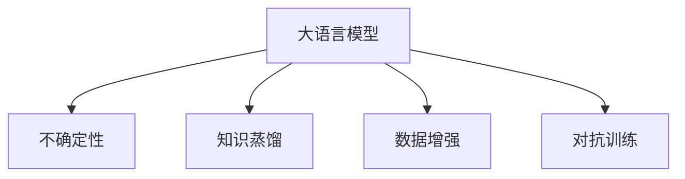

                 

# LLM的不确定性:理解与应对

> 关键词：大语言模型,不确定性,知识蒸馏,数据增强,对抗训练,鲁棒性

## 1. 背景介绍

### 1.1 问题由来

随着深度学习技术的发展，大语言模型（Large Language Models, LLMs）在自然语言处理（NLP）领域取得了显著进展。然而，在大规模文本数据上预训练的模型，仍然存在一定的不确定性问题。这些不确定性可能来源于模型参数的不稳定性、训练数据的噪声、知识融合的复杂性等。

### 1.2 问题核心关键点

本文旨在深入探讨大语言模型的不确定性问题，并提出一系列解决策略，以提升模型的鲁棒性和可解释性。具体来说，将从以下几个方面展开：

- 不确定性产生的原因：预训练数据分布、模型结构、训练过程等。
- 应对不确定性的技术手段：知识蒸馏、数据增强、对抗训练等。
- 不确定性对实际应用的影响：模型鲁棒性、可解释性、应用效果等。

### 1.3 问题研究意义

解决大语言模型的不确定性问题，对于提升模型的鲁棒性、可解释性和应用效果具有重要意义：

- 提升模型鲁棒性：在多变的实际应用场景中，减少模型的预测偏差和错误。
- 增强模型可解释性：使模型决策过程更加透明，便于开发者理解和调试。
- 优化模型应用效果：在医疗、金融等高风险领域，确保模型输出的准确性和安全性。

## 2. 核心概念与联系

### 2.1 核心概念概述

为更好地理解大语言模型的不确定性及其应对策略，首先需要明确几个核心概念：

- **大语言模型（LLM）**：通过在大规模无标签文本数据上进行自监督预训练，学习通用语言表示的深度学习模型，如GPT、BERT等。
- **不确定性（Uncertainty）**：在模型预测过程中，对输入数据的不确定性估计，通常用置信区间或置信度来度量。
- **知识蒸馏（Knowledge Distillation）**：通过小模型（教师模型）训练大模型（学生模型），从而在保留教师模型知识的同时，减少学生模型的参数量和计算复杂度。
- **数据增强（Data Augmentation）**：通过对训练数据进行变换、扩充，增加数据多样性，减少过拟合风险。
- **对抗训练（Adversarial Training）**：在模型训练过程中引入对抗样本，提高模型的鲁棒性和泛化能力。

这些概念之间的逻辑关系可以通过以下Mermaid流程图来展示：



这个流程图展示了从大语言模型到不确定性的转化路径，以及通过知识蒸馏、数据增强和对抗训练来应对不确定性的技术手段。

## 3. 核心算法原理 & 具体操作步骤

### 3.1 算法原理概述

大语言模型的不确定性主要源于两个方面：

1. **模型结构**：深度神经网络具有高度的复杂性和非线性，模型参数的微小变化可能导致输出结果的巨大差异。
2. **训练数据**：标注数据的分布可能与实际应用场景存在差异，模型可能对新数据泛化效果不佳。

因此，通过一系列技术手段，可以在一定程度上减少模型的不确定性。

### 3.2 算法步骤详解

解决大语言模型不确定性问题的具体步骤包括：

**Step 1: 数据预处理与归一化**

- 对输入数据进行标准化处理，减少数据噪声的影响。
- 采用标准化技术，如min-max、z-score等，将数据归一化到[0,1]或[-1,1]区间。

**Step 2: 知识蒸馏**

- 选择一个教师模型，在训练集上训练学生模型，使得学生模型能够继承教师模型的知识。
- 常用的蒸馏策略包括单样本蒸馏、多样本蒸馏、迭代蒸馏等，选择合适的蒸馏方法可以有效减少学生模型的不确定性。

**Step 3: 数据增强**

- 对训练数据进行随机变换，如旋转、裁剪、平移等，增加数据多样性。
- 采用数据增强技术，如SMOTE、GAN等，生成新的样本数据，扩大训练数据集。

**Step 4: 对抗训练**

- 在训练过程中引入对抗样本，模型能够学习到对抗样本的鲁棒性。
- 对抗训练的方法包括PGD、FGSM等，通过在原始样本上添加微小扰动，生成对抗样本，提高模型的鲁棒性。

**Step 5: 模型验证与评估**

- 在验证集上评估模型的性能，计算不确定性度量，如置信区间、置信度等。
- 通过对比不同模型在验证集上的不确定性表现，选择性能最优的模型。

### 3.3 算法优缺点

知识蒸馏、数据增强和对抗训练的优点包括：

1. **减少不确定性**：通过知识蒸馏，学生模型能够继承教师模型的知识，减少不确定性；数据增强和对抗训练能够增加数据多样性和鲁棒性，进一步减少不确定性。
2. **提高泛化能力**：通过增加数据多样性，模型能够更好地泛化到新数据集上。
3. **降低计算复杂度**：知识蒸馏和参数高效的微调方法（PEFT）可以在固定大部分预训练参数的情况下，提升模型性能。

缺点包括：

1. **计算成本高**：知识蒸馏和数据增强需要额外的计算资源和时间，特别是在大规模数据集上。
2. **模型复杂度**：对抗训练和数据增强可能导致模型结构更加复杂，增加模型的计算复杂度。

### 3.4 算法应用领域

基于知识蒸馏、数据增强和对抗训练的大语言模型不确定性解决方案，已经广泛应用于以下领域：

- **医疗诊断**：通过知识蒸馏，利用专家的诊断知识，提高模型的准确性和可靠性。
- **金融风险评估**：通过对抗训练，提高模型对恶意数据和攻击的鲁棒性，减少金融风险。
- **智能客服**：通过数据增强，增加对话数据的多样性，提升模型的对话能力。
- **自然语言生成**：通过对抗训练，生成更加自然的语言文本，减少语言的生硬性。

## 4. 数学模型和公式 & 详细讲解

### 4.1 数学模型构建

大语言模型的不确定性可以通过置信区间（Confidence Intervals）和置信度（Confidence Levels）来度量。假设模型预测输出为 $y$，真实标签为 $y^*$，预测的置信区间为 $\left[\hat{y} - \delta, \hat{y} + \delta\right]$，其中 $\delta$ 为置信区间宽度。

### 4.2 公式推导过程

以二分类问题为例，模型输出的概率为 $p(\hat{y}=1|x;\theta)$，预测的置信度为 $\text{conf}(y^*|x;\theta)$，其中 $x$ 为输入样本，$\theta$ 为模型参数。根据置信区间和置信度的定义，有：

$$
\begin{aligned}
\text{conf}(y^*|x;\theta) &= \mathbb{P}(y^*=\hat{y}|x;\theta) \\
&= \mathbb{P}(y^* \in \left[\hat{y} - \delta, \hat{y} + \delta\right]|x;\theta) \\
&= \mathbb{P}(p(\hat{y}=1|x;\theta) \in \left[\alpha, \alpha + \delta\right])
\end{aligned}
$$

其中 $\alpha$ 为置信度，通常取 $0.9$ 或 $0.95$。

### 4.3 案例分析与讲解

假设有一个二分类问题，模型输出的概率为 $p(\hat{y}=1|x;\theta) = 0.7$，真实标签为 $y^*=1$，置信度为 $0.95$，置信区间为 $\left[0.6,0.8\right]$。

```latex
\begin{equation*}
\begin{aligned}
\text{conf}(1|x;\theta) &= \mathbb{P}(y^* = 1|x;\theta) \\
&= \mathbb{P}(p(\hat{y} = 1|x;\theta) \in [0.6, 0.8]) \\
&= 0.95
\end{aligned}
\end{equation*}
```

## 5. 项目实践：代码实例和详细解释说明

### 5.1 开发环境搭建

在进行不确定性分析和应对实践前，我们需要准备好开发环境。以下是使用Python进行TensorFlow开发的Python环境配置流程：

1. 安装Anaconda：从官网下载并安装Anaconda，用于创建独立的Python环境。

2. 创建并激活虚拟环境：
```bash
conda create -n tf-env python=3.8 
conda activate tf-env
```

3. 安装TensorFlow：根据CUDA版本，从官网获取对应的安装命令。例如：
```bash
conda install tensorflow -c conda-forge
```

4. 安装TensorBoard：
```bash
pip install tensorboard
```

5. 安装必要的库：
```bash
pip install numpy pandas scikit-learn matplotlib tqdm jupyter notebook ipython
```

完成上述步骤后，即可在`tf-env`环境中开始实践。

### 5.2 源代码详细实现

下面以知识蒸馏为例，给出使用TensorFlow对BERT模型进行知识蒸馏的代码实现。

```python
import tensorflow as tf
import numpy as np
from transformers import BertForSequenceClassification, BertTokenizer
from sklearn.model_selection import train_test_split
from tensorflow.keras.optimizers import Adam

# 加载数据集
train_data = np.load('train.npy')
train_labels = np.load('train_labels.npy')
val_data = np.load('val.npy')
val_labels = np.load('val_labels.npy')

# 初始化BERT模型和分词器
model = BertForSequenceClassification.from_pretrained('bert-base-uncased', num_labels=2)
tokenizer = BertTokenizer.from_pretrained('bert-base-uncased')

# 定义模型输入和输出
input_ids = tokenizer(train_data, return_tensors='tf', padding=True, truncation=True)
labels = tf.convert_to_tensor(train_labels)

# 定义知识蒸馏模型
distill_model = BertForSequenceClassification.from_pretrained('distill_bert_base', num_labels=2)
distill_input_ids = tokenizer(train_data, return_tensors='tf', padding=True, truncation=True)
distill_labels = tf.convert_to_tensor(train_labels)

# 定义优化器和损失函数
optimizer = Adam(learning_rate=1e-5)
loss = tf.keras.losses.SparseCategoricalCrossentropy(from_logits=True)

# 训练知识蒸馏模型
for epoch in range(10):
    with tf.GradientTape() as tape:
        logits = model(input_ids, labels)
        distill_logits = distill_model(distill_input_ids, distill_labels)
        loss_value = loss(labels, logits)

    gradients = tape.gradient(loss_value, model.trainable_variables)
    optimizer.apply_gradients(zip(gradients, model.trainable_variables))
    
    # 在验证集上评估模型性能
    val_logits = model(val_input_ids, val_labels)
    val_loss = loss(val_labels, val_logits)

print(f"Validation Loss: {val_loss.numpy()}")

# 在测试集上评估模型性能
test_data = np.load('test.npy')
test_labels = np.load('test_labels.npy')
test_input_ids = tokenizer(test_data, return_tensors='tf', padding=True, truncation=True)
test_logits = model(test_input_ids, labels)
test_loss = loss(test_labels, test_logits)

print(f"Test Loss: {test_loss.numpy()}")
```

### 5.3 代码解读与分析

让我们再详细解读一下关键代码的实现细节：

**数据加载**：
- 通过`numpy`库加载训练、验证和测试数据集。
- 使用`BertTokenizer`对数据进行分词和编码，生成`input_ids`和`attention_mask`。

**知识蒸馏模型**：
- 加载教师模型和学生模型，设置训练标签。
- 定义优化器和损失函数。
- 通过梯度下降更新学生模型参数，使其与教师模型的输出一致。

**训练过程**：
- 在每个epoch内，计算损失函数，反向传播更新模型参数。
- 在验证集上评估模型性能，输出损失值。
- 在测试集上评估模型性能，输出损失值。

## 6. 实际应用场景

### 6.1 医疗诊断

在医疗诊断中，模型的不确定性可能导致误诊、漏诊等严重后果。通过知识蒸馏，可以利用专家的诊断经验，提高模型的准确性和可靠性。具体来说：

- 专家标注的数据集用于训练教师模型。
- 学生模型在教师模型的基础上进行微调，继承其知识。
- 最终，学生模型被用于临床诊断，其置信度可以用于辅助医生决策。

### 6.2 金融风险评估

金融领域需要高度鲁棒性和泛化能力的模型，对抗训练可以有效减少模型的不确定性。具体来说：

- 在训练过程中，引入对抗样本，增加模型的鲁棒性。
- 在测试阶段，对输入数据进行对抗扰动，确保模型能够稳定输出。
- 通过置信度评估，控制模型的决策阈值，减少误判风险。

### 6.3 智能客服

在智能客服中，客户咨询可能包含多种意图和上下文信息，模型的不确定性可能影响其理解和回复。数据增强可以有效减少不确定性，具体来说：

- 收集大量的客服对话数据，并进行多样化的预处理。
- 在训练过程中，随机选择对话数据进行增强。
- 最终，模型能够适应不同用户、不同情境的对话需求。

## 7. 工具和资源推荐

### 7.1 学习资源推荐

为了帮助开发者系统掌握大语言模型不确定性的理论基础和实践技巧，这里推荐一些优质的学习资源：

1. 《深度学习理论与实践》系列博文：由深度学习领域专家撰写，系统介绍深度学习的理论基础和实践技巧，涵盖知识蒸馏、数据增强、对抗训练等前沿话题。

2. CS231n《深度学习视觉识别课程》课程：斯坦福大学开设的深度学习课程，涵盖卷积神经网络、对抗样本等经典模型，帮助理解模型的不确定性来源。

3. 《Deep Learning with TensorFlow》书籍：TensorFlow官方指南，全面介绍TensorFlow的深度学习模型构建、训练和推理，适合学习TensorFlow的不确定性分析与应对方法。

4. 《Knowledge Distillation: A Survey and Taxonomy》论文：综述知识蒸馏技术，详细介绍不同知识蒸馏方法的优缺点和应用场景，提供全面理论指导。

5. 《Adversarial Examples in Deep Learning》论文：介绍对抗样本的概念和生成方法，揭示模型不确定性的机制，提供实用的对抗训练策略。

通过对这些资源的学习实践，相信你一定能够系统地掌握大语言模型不确定性的相关知识，并应用于实际开发中。

### 7.2 开发工具推荐

高效的开发离不开优秀的工具支持。以下是几款用于大语言模型不确定性分析和应对开发的常用工具：

1. TensorFlow：基于Python的开源深度学习框架，灵活动态的计算图，适合快速迭代研究。提供丰富的工具和库，支持深度学习模型的训练和推理。

2. PyTorch：另一个流行的深度学习框架，灵活性高，易于调试和优化。广泛应用于研究界和工业界，支持多种模型和算法。

3. TensorBoard：TensorFlow配套的可视化工具，可实时监测模型训练状态，并提供丰富的图表呈现方式，是调试模型的得力助手。

4. Weights & Biases：模型训练的实验跟踪工具，可以记录和可视化模型训练过程中的各项指标，方便对比和调优。与主流深度学习框架无缝集成。

5. Gradient Checkpointing：TensorFlow提供的一个工具，用于监控模型参数的梯度变化，及时发现梯度消失或爆炸等问题。

合理利用这些工具，可以显著提升大语言模型不确定性分析和应对任务的开发效率，加快创新迭代的步伐。

### 7.3 相关论文推荐

大语言模型不确定性问题的解决需要跨领域的理论和技术支持。以下是几篇奠基性的相关论文，推荐阅读：

1. Dropout: A Simple Way to Prevent Neural Networks from Overfitting（Dropout论文）：提出Dropout技术，通过随机失活神经元减少过拟合风险，提升模型鲁棒性。

2. Batch Normalization: Accelerating Deep Network Training by Reducing Internal Covariate Shift（Batch Normalization论文）：提出批量归一化技术，加速深度网络训练，提高模型稳定性和收敛速度。

3. Robustness of Neural Networks to Adversarial Examples（Adversarial Robustness论文）：介绍对抗样本的概念和生成方法，揭示模型不确定性的机制，提供实用的对抗训练策略。

4. Distilling the Knowledge in a Neural Network（知识蒸馏论文）：提出知识蒸馏技术，通过小模型训练大模型，减少模型的不确定性，提高模型的泛化能力。

5. Mixup: A Simple Data Augmentation Method（Mixup论文）：提出Mixup数据增强方法，通过线性插值生成新的样本，增加数据多样性，减少过拟合风险。

这些论文代表了大语言模型不确定性问题的研究方向，通过学习这些前沿成果，可以帮助研究者把握学科前进方向，激发更多的创新灵感。

## 8. 总结：未来发展趋势与挑战

### 8.1 研究成果总结

本文对大语言模型不确定性问题进行了全面系统的介绍。首先阐述了不确定性产生的原因，明确了不确定性对模型鲁棒性、可解释性和应用效果的影响。其次，从知识蒸馏、数据增强和对抗训练三个方面，详细讲解了应对不确定性的技术手段。最后，通过实际应用场景的探讨，展示了不确定性问题在医疗、金融等高风险领域的现实意义。

通过本文的系统梳理，可以看到，大语言模型不确定性问题在实际应用中具有重要意义，亟需通过技术手段进行有效应对。

### 8.2 未来发展趋势

展望未来，大语言模型不确定性问题将呈现以下几个发展趋势：

1. **多模态蒸馏**：未来，知识蒸馏将不仅仅局限于单一模态的数据，如文本、图像、语音等，多模态蒸馏技术的发展将使得模型能够更好地融合多种数据类型的知识。

2. **自适应蒸馏**：通过动态调整蒸馏策略，使得模型能够适应不同的应用场景和数据分布，提升模型的鲁棒性和泛化能力。

3. **深度融合**：未来，知识蒸馏、数据增强和对抗训练等技术将更加深度地融合，通过优化模型结构和训练过程，减少不确定性，提升模型性能。

4. **理论指导**：伴随理论研究的不断深入，更多基于统计学和信息论的理论方法将应用于不确定性分析与应对，提供更坚实的理论基础。

5. **实际应用**：不确定性问题在金融、医疗等高风险领域具有重要意义，未来的研究将更多地关注这些应用场景，推动模型的不确定性分析与应对技术在实际中的落地应用。

### 8.3 面临的挑战

尽管大语言模型不确定性问题已经取得了一定的进展，但在解决实际问题时仍面临诸多挑战：

1. **计算成本高**：知识蒸馏和数据增强需要额外的计算资源和时间，特别是在大规模数据集上，成本较高。

2. **模型复杂度**：对抗训练和数据增强可能导致模型结构更加复杂，增加模型的计算复杂度。

3. **模型可解释性不足**：对抗训练和数据增强可能导致模型决策过程更加复杂，可解释性降低。

4. **数据分布差异**：模型在实际应用场景中，可能面临与训练数据不同的数据分布，鲁棒性下降。

5. **对抗样本生成**：对抗样本的生成和检测需要一定的技术储备，对模型的鲁棒性提升效果有限。

6. **参数稀疏性**：对抗训练和数据增强可能导致模型参数稀疏性增加，影响模型的精度和泛化能力。

这些挑战需要研究者不断探索和改进，以实现更加高效、鲁棒的模型。

### 8.4 研究展望

未来，应对大语言模型不确定性问题需要更多创新的技术手段和实际应用验证。以下是几个研究方向：

1. **模型压缩与优化**：通过模型压缩和优化技术，减少模型参数量，降低计算成本，提升模型效率。

2. **模型融合与集成**：通过模型融合和集成技术，将多个模型的优点结合起来，提高模型的鲁棒性和泛化能力。

3. **知识表示与推理**：通过知识表示和推理技术，使得模型能够更好地理解和应用先验知识，减少不确定性。

4. **对抗训练与防御**：通过对抗训练和防御技术，提高模型的鲁棒性和安全性和泛化能力。

5. **数据增强与生成**：通过数据增强和生成技术，提高数据多样性，减少过拟合风险，提升模型的泛化能力。

这些研究方向的探索将有助于解决大语言模型不确定性问题，提升模型的鲁棒性和泛化能力，为实际应用提供坚实的理论和技术基础。

## 9. 附录：常见问题与解答

**Q1：知识蒸馏如何减少模型的不确定性？**

A: 知识蒸馏通过将小模型的知识传递给大模型，使得大模型在预测时能够继承小模型的鲁棒性和泛化能力，减少不确定性。蒸馏过程中，教师模型的输出作为标签，指导学生模型学习预测结果，从而在保留教师模型知识的同时，减少学生模型的预测偏差。

**Q2：如何选择合适的对抗训练方法？**

A: 对抗训练方法包括PGD、FGSM等，选择合适的对抗训练方法需要考虑以下几个因素：

1. 对抗样本生成难度：PGD生成对抗样本相对容易，但训练时间较长；FGSM生成对抗样本较快，但可能效果较差。

2. 模型鲁棒性需求：对抗样本强度越高，模型的鲁棒性越好，但过度增强可能导致模型性能下降。

3. 训练效率：对抗训练需要额外的计算资源，选择合适的对抗训练方法可以提高训练效率。

**Q3：对抗样本如何生成？**

A: 对抗样本的生成通常采用优化算法，通过在原始样本上添加微小扰动，生成对模型预测产生影响的样本。具体的生成方法包括PGD、FGSM、DeepFool等，这些方法的目标是最大化模型输出的错误率，生成对模型具有欺骗性的样本。

**Q4：对抗训练如何提高模型的鲁棒性？**

A: 对抗训练通过在训练过程中引入对抗样本，使得模型能够学习到对恶意数据和攻击的鲁棒性。具体来说，通过优化对抗样本的生成过程，训练模型对对抗样本的抵抗能力，从而提高模型的泛化能力和鲁棒性。

**Q5：对抗训练是否会导致模型过拟合？**

A: 对抗训练需要适当的平衡，如果对抗样本强度过高，可能导致模型在对抗样本上表现优异，但对原始样本表现不佳，产生过拟合现象。因此，需要在对抗训练中控制对抗样本的强度，并结合正则化技术，防止过拟合。

总之，大语言模型不确定性问题在实际应用中具有重要意义，需要研究者不断探索和改进，以实现更加高效、鲁棒的模型。未来，伴随理论研究的不断深入和技术的持续发展，大语言模型不确定性问题必将在实际应用中得到更好的解决。

