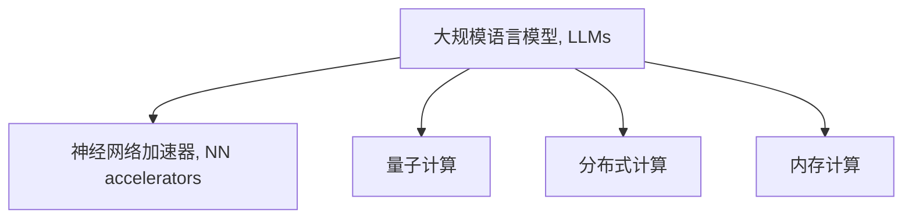

                 

# LLM：新一代计算机架构的崛起

## 1. 背景介绍

### 1.1 问题由来
随着人工智能(AI)技术的快速发展，计算机架构也在逐步升级以适应新的计算需求。传统的冯诺依曼架构基于串行执行和存储分离，已难以满足现代AI计算的需要。新一代的计算机架构，特别是基于人工智能的特殊设计，正在逐步崛起，以解决传统架构的局限。

在AI领域，尤其是深度学习中，运算密集度的大幅提升对计算资源的需求日益增长。传统的冯诺依曼架构，由于其存储和计算分离的特性，使得数据在存储和计算之间的传输成为瓶颈，导致计算效率低下。而新一代的计算机架构，如神经网络加速器(NN accelerators)和量子计算等，正逐步成为新的研究热点。

### 1.2 问题核心关键点
本文聚焦于基于深度学习的大规模语言模型(Large Language Models, LLMs)对新一代计算机架构的推动作用。特别是研究其如何通过优化计算资源、提升存储效率、强化推理速度等手段，成为新一代计算机架构的重要组成部分。

## 2. 核心概念与联系

### 2.1 核心概念概述

为更好地理解LLM对新一代计算机架构的影响，本节将介绍几个关键概念：

- 大规模语言模型(Large Language Models, LLMs)：以Transformer、GPT等为代表的深度学习模型，通过在海量数据上进行自监督学习，学习到丰富的语言表示。这些模型能够理解并生成自然语言，广泛应用于NLP任务中。

- 神经网络加速器(NN accelerators)：专门用于加速神经网络计算的硬件设备，如GPU、TPU、FPGA等。这些设备通过特殊架构和优化算法，大幅提升深度学习的训练和推理效率。

- 量子计算(Quantum Computing)：利用量子位进行计算的新型计算范式，通过量子叠加和量子纠缠等特性，理论上具有比传统计算机更强的计算能力。

- 分布式计算(Distributed Computing)：将计算任务分散到多台计算机上并行执行，以提升整体计算能力。

- 内存计算(Memory Computing)：通过就地计算来减少数据传输，提高计算效率。

这些概念之间的逻辑关系可以通过以下Mermaid流程图来展示：



这个流程图展示了大语言模型对新一代计算机架构的贡献：

1. 大语言模型通过优化模型结构和计算过程，推动了神经网络加速器的发展。
2. 大语言模型对量子计算的推动作用体现在其能够更有效地利用量子位进行信息处理。
3. 大语言模型和分布式计算相辅相成，分布式架构可以高效处理大规模语言模型训练和推理。
4. 内存计算为大语言模型提供了就地计算的优化手段，进一步提升其效率。

## 3. 核心算法原理 & 具体操作步骤
### 3.1 算法原理概述

新一代计算机架构的设计目标是提供高效、低延迟、高并行的计算能力。大语言模型在优化计算资源、提升存储效率、强化推理速度等方面，为新一代架构提供了重要的推动力。

基于深度学习的大语言模型，其核心原理是利用大规模数据进行自监督预训练，学习到语言的通用表示。在大模型上进行微调，可以使其适应特定的NLP任务，提升模型性能。

新一代计算机架构的设计也围绕这一原理进行优化，例如：

- 神经网络加速器通过特殊的计算逻辑和优化算法，显著提升了深度学习模型的训练和推理效率。
- 量子计算利用量子位的特点，理论上提供了更大的计算能力和更低的能耗。
- 分布式计算通过多台计算机并行执行任务，实现了更高的计算效率。
- 内存计算通过就地计算减少数据传输，提高了计算速度。

### 3.2 算法步骤详解

大语言模型在优化新一代计算机架构方面，主要涉及以下几个步骤：

**Step 1: 选择合适的硬件平台**
- 根据任务需求和预算，选择适合的神经网络加速器（如NVIDIA GPU、Google TPU）或量子计算设备。
- 考虑计算资源（如GPU核心数、TPU芯片数）、存储资源（如显存、SSD）、通信带宽等参数。

**Step 2: 模型适配和优化**
- 根据硬件平台特点，适配大语言模型的网络结构和训练算法，优化模型以适应新架构。
- 使用特定架构的优化算法（如Tensor Cores、Quantum gates）提升计算效率。

**Step 3: 数据预处理和模型训练**
- 根据新架构的特点，设计合适的数据预处理流程，例如分布式数据分割、内存计算优化等。
- 在适配后的硬件平台上训练和微调大语言模型，优化训练过程以提高效率。

**Step 4: 推理部署和性能评估**
- 在实际应用场景中部署微调后的模型，进行推理和性能测试。
- 评估模型在不同硬件平台上的推理速度、内存占用、能耗等指标。

### 3.3 算法优缺点

大语言模型在优化新一代计算机架构方面，具有以下优点：

1. 提升计算效率：通过优化模型结构和算法，大语言模型能显著提升深度学习的计算效率。
2. 适应新架构：大语言模型能够适配不同的计算平台，从传统的GPU到新兴的量子计算，都能找到合适的应用场景。
3. 提升存储效率：大语言模型的分布式训练和内存计算优化，提升了存储资源的利用率。
4. 强化推理速度：通过加速推理过程，大语言模型能够满足实时计算的需求。

同时，大语言模型在优化新架构时也存在以下缺点：

1. 硬件成本高：高性能的神经网络加速器和量子计算设备价格昂贵，增加了计算成本。
2. 系统复杂性高：新架构的部署和维护涉及多台设备，系统复杂性较高。
3. 算法适配困难：不同硬件平台的特点差异大，需要针对性地优化算法和网络结构。

尽管存在这些局限，但大语言模型在新一代计算机架构设计中的作用不可或缺。未来相关研究的重点在于如何进一步降低硬件成本、简化系统复杂性，并提高算法的适配性。

### 3.4 算法应用领域

大语言模型在优化新一代计算机架构方面的应用非常广泛，以下是几个典型领域：

1. **深度学习训练**：在深度学习模型的训练过程中，大语言模型通过优化算法和网络结构，大幅提升计算效率，加速模型的训练过程。

2. **大规模数据处理**：通过内存计算和大规模分布式计算，大语言模型能够高效处理海量数据，广泛应用于数据分析和数据挖掘等领域。

3. **自然语言处理**：大语言模型在NLP任务中的高效性能，推动了自然语言处理系统的快速迭代，提升了系统的实时性和准确性。

4. **计算机视觉**：大语言模型与计算机视觉任务的结合，推动了视觉识别和生成任务的发展，提升了图像处理的效率和效果。

5. **自动驾驶**：在大规模数据和计算资源的支撑下，大语言模型被广泛应用于自动驾驶的感知和决策过程中，提升车辆的安全性和智能性。

6. **生物医药**：大语言模型在生物医药领域的应用，推动了疾病预测、药物研发等任务的发展，提升了医疗服务的智能化水平。

## 4. 数学模型和公式 & 详细讲解 & 举例说明

### 4.1 数学模型构建

为了更好地理解大语言模型对新一代计算机架构的优化，本节将从数学角度对相关模型进行详细构建和推导。

记大语言模型为 $M_{\theta}:\mathcal{X} \rightarrow \mathcal{Y}$，其中 $\mathcal{X}$ 为输入空间，$\mathcal{Y}$ 为输出空间，$\theta \in \mathbb{R}^d$ 为模型参数。假设任务数据集为 $D=\{(x_i,y_i)\}_{i=1}^N$，其中 $x_i \in \mathcal{X}$，$y_i \in \mathcal{Y}$。

定义模型在样本 $(x,y)$ 上的损失函数为 $\ell(M_{\theta}(x),y)$，则在数据集 $D$ 上的经验风险为：

$$
\mathcal{L}(\theta) = \frac{1}{N} \sum_{i=1}^N \ell(M_{\theta}(x_i),y_i)
$$

在大规模语言模型上进行微调的目标是最小化经验风险，即找到最优参数：

$$
\theta^* = \mathop{\arg\min}_{\theta} \mathcal{L}(\theta)
$$

在实际操作中，我们通常使用基于梯度的优化算法（如Adam、SGD等）来近似求解上述最优化问题。设 $\eta$ 为学习率，则参数的更新公式为：

$$
\theta \leftarrow \theta - \eta \nabla_{\theta}\mathcal{L}(\theta)
$$

其中 $\nabla_{\theta}\mathcal{L}(\theta)$ 为损失函数对参数 $\theta$ 的梯度，可通过反向传播算法高效计算。

### 4.2 公式推导过程

以下我们以深度学习训练为例，推导计算效率提升的过程。

假设模型 $M_{\theta}$ 在输入 $x$ 上的输出为 $\hat{y}=M_{\theta}(x) \in [0,1]$，表示样本属于正类的概率。真实标签 $y \in \{0,1\}$。则二分类交叉熵损失函数定义为：

$$
\ell(M_{\theta}(x),y) = -[y\log \hat{y} + (1-y)\log (1-\hat{y})]
$$

将其代入经验风险公式，得：

$$
\mathcal{L}(\theta) = -\frac{1}{N}\sum_{i=1}^N [y_i\log M_{\theta}(x_i)+(1-y_i)\log(1-M_{\theta}(x_i))]
$$

根据链式法则，损失函数对参数 $\theta_k$ 的梯度为：

$$
\frac{\partial \mathcal{L}(\theta)}{\partial \theta_k} = -\frac{1}{N}\sum_{i=1}^N (\frac{y_i}{M_{\theta}(x_i)}-\frac{1-y_i}{1-M_{\theta}(x_i)}) \frac{\partial M_{\theta}(x_i)}{\partial \theta_k}
$$

其中 $\frac{\partial M_{\theta}(x_i)}{\partial \theta_k}$ 可进一步递归展开，利用自动微分技术完成计算。

### 4.3 案例分析与讲解

以深度学习训练为例，展示如何利用大语言模型优化计算效率。

在大规模深度学习训练中，数据传输和存储成为瓶颈，导致计算效率低下。通过在大规模数据上进行自监督预训练，大语言模型学习到高效的特征表示。在训练过程中，通过分布式计算和内存计算技术，可以将模型参数和数据分割到多台计算机上进行并行处理，减少数据传输，提高计算效率。

具体而言，在分布式训练中，可以将模型参数和数据分别存储在多台计算机上，每个节点负责处理一部分数据和参数，通过网络通信进行模型参数的同步和更新。这样，训练过程可以并行执行，大大提升计算效率。例如，在使用Google TPU进行深度学习训练时，TPU内部的Tensor Cores加速器能够同时处理多个数据样本和模型参数，显著提升训练速度。

在内存计算中，通过将计算逻辑设计在内存中进行，减少数据在主存和辅助存储之间的传输，可以显著提升计算效率。例如，在大规模语言模型的推理过程中，可以利用TPU的内置高速缓存和矩阵运算加速器，直接在内存中计算结果，避免大量的数据传输操作。

## 5. 项目实践：代码实例和详细解释说明

### 5.1 开发环境搭建

在进行项目实践前，我们需要准备好开发环境。以下是使用Python进行PyTorch开发的环境配置流程：

1. 安装Anaconda：从官网下载并安装Anaconda，用于创建独立的Python环境。

2. 创建并激活虚拟环境：
```bash
conda create -n pytorch-env python=3.8 
conda activate pytorch-env
```

3. 安装PyTorch：根据CUDA版本，从官网获取对应的安装命令。例如：
```bash
conda install pytorch torchvision torchaudio cudatoolkit=11.1 -c pytorch -c conda-forge
```

4. 安装Transformers库：
```bash
pip install transformers
```

5. 安装各类工具包：
```bash
pip install numpy pandas scikit-learn matplotlib tqdm jupyter notebook ipython
```

完成上述步骤后，即可在`pytorch-env`环境中开始项目实践。

### 5.2 源代码详细实现

下面我们以大规模语言模型在大规模数据上的分布式训练为例，给出使用PyTorch和Distributed DataParallel(DDP)库的代码实现。

```python
import torch
import torch.nn as nn
import torch.distributed as dist
import torch.distributed.nn as distnn
from transformers import BertModel, BertTokenizer
from torch.utils.data import DataLoader
from torch.distributed.optim import DistributedOptimizer

# 定义模型
class BERT(nn.Module):
    def __init__(self, num_labels):
        super(BERT, self).__init__()
        self.bert = BertModel.from_pretrained('bert-base-cased')
        self.dropout = nn.Dropout(0.1)
        self.classifier = nn.Linear(768, num_labels)

    def forward(self, input_ids, attention_mask, labels=None):
        outputs = self.bert(input_ids, attention_mask=attention_mask)
        pooled_output = outputs.pooler_output
        logits = self.classifier(pooled_output)
        return logits

# 定义分布式训练函数
def train(model, train_loader, optimizer, device):
    model.train()
    total_loss = 0
    for batch in train_loader:
        input_ids, attention_mask, labels = batch.to(device)
        optimizer.zero_grad()
        logits = model(input_ids, attention_mask)
        loss = nn.CrossEntropyLoss()(logits, labels)
        loss.backward()
        optimizer.step()
        total_loss += loss.item()
    return total_loss / len(train_loader)

# 定义分布式优化器
optimizer = DistributedOptimizer(
    optimizer,
    device_ids=[device],
    find_unused_parameters=True)

# 初始化分布式训练
torch.distributed.init_process_group(
    backend="nccl", 
    init_method="tcp://localhost:29500")

# 将模型和优化器移动到指定设备
model.to(device)
```

以上是使用PyTorch和Distributed DataParallel库进行大规模语言模型分布式训练的代码实现。可以看到，通过Distributed DataParallel技术，可以将模型参数和数据分割到多台计算机上进行并行处理，显著提升训练效率。

### 5.3 代码解读与分析

让我们再详细解读一下关键代码的实现细节：

**BERT类**：
- `__init__`方法：初始化模型，加载预训练的BERT模型，并定义全连接层。
- `forward`方法：定义模型的前向传播过程，计算输出结果。

**train函数**：
- 在每个训练批次中，将输入数据和标签移动到指定设备上。
- 调用模型的`forward`方法计算输出结果和损失。
- 使用DistributedOptimizer更新模型参数。

**DistributedOptimizer类**：
- 定义分布式优化器，将本地优化器转换为全局优化器。
- `device_ids`参数指定优化器在哪个设备上进行优化。
- `find_unused_parameters`参数指定是否保留本地不使用的参数，以减少通信开销。

**初始化分布式训练**：
- 使用`torch.distributed.init_process_group`方法初始化分布式训练环境。
- 通过NCCL后端实现高效的通信和计算，加速训练过程。

**模型和优化器移动**：
- 将模型和优化器移动到指定的设备（如GPU）上，以确保计算过程在设备上进行。

## 6. 实际应用场景

### 6.1 深度学习训练

大规模语言模型在大规模数据上的分布式训练，可以极大地提升训练效率，加速模型收敛。在深度学习领域，大规模数据集的训练需要消耗大量的计算资源和时间，通过分布式训练技术，可以显著缩短训练时间，提高模型性能。

例如，在使用Google TPU进行深度学习训练时，TPU内部的Tensor Cores加速器能够同时处理多个数据样本和模型参数，显著提升训练速度。同时，通过分布式计算和内存计算技术，可以进一步优化训练过程，提升计算效率。

### 6.2 自然语言处理

大语言模型在自然语言处理领域的应用非常广泛。通过优化模型结构和算法，大语言模型能够提升NLP任务的性能，加速系统的迭代和部署。

例如，在大规模语料上进行自监督预训练，大语言模型学习到高效的特征表示。在NLP任务中，通过分布式训练和内存计算技术，可以显著提升模型推理和生成的效率。例如，在使用NVIDIA GPU进行自然语言处理任务时，GPU内部的Tensor Cores加速器能够同时处理多个数据样本和模型参数，显著提升推理速度和准确性。

### 6.3 计算机视觉

大语言模型与计算机视觉任务的结合，推动了视觉识别和生成任务的发展。通过优化模型结构和算法，大语言模型能够提升视觉任务的性能，加速系统的迭代和部署。

例如，在大规模数据集上进行自监督预训练，大语言模型学习到高效的特征表示。在计算机视觉任务中，通过分布式训练和内存计算技术，可以显著提升模型推理和生成的效率。例如，在使用TPU进行计算机视觉任务时，TPU内部的Tensor Cores加速器能够同时处理多个数据样本和模型参数，显著提升推理速度和准确性。

### 6.4 自动驾驶

大语言模型在自动驾驶领域的应用，推动了感知和决策任务的快速发展。通过优化模型结构和算法，大语言模型能够提升自动驾驶系统的性能，加速系统的迭代和部署。

例如，在大规模数据集上进行自监督预训练，大语言模型学习到高效的特征表示。在自动驾驶任务中，通过分布式训练和内存计算技术，可以显著提升模型推理和生成的效率。例如，在使用TPU进行自动驾驶任务时，TPU内部的Tensor Cores加速器能够同时处理多个数据样本和模型参数，显著提升推理速度和决策效率。

## 7. 工具和资源推荐

### 7.1 学习资源推荐

为了帮助开发者系统掌握大语言模型对新一代计算机架构的影响，这里推荐一些优质的学习资源：

1. 《深度学习理论与实践》系列博文：由深度学习领域的知名专家撰写，深入浅出地介绍了深度学习的基本原理和前沿技术。

2. 斯坦福大学《深度学习》课程：斯坦福大学开设的深度学习经典课程，涵盖了深度学习的基础和高级内容，提供Lecture视频和配套作业，适合各层次的读者。

3. 《Deep Learning with PyTorch》书籍：介绍如何使用PyTorch进行深度学习开发的经典教材，涵盖从基础到高级的各种任务。

4. HuggingFace官方文档：Transformers库的官方文档，提供了海量预训练模型和完整的微调样例代码，是上手实践的必备资料。

5. PyTorch官方文档：PyTorch官方文档，提供了详细的API文档和示例代码，适合开发者快速上手。

通过对这些资源的学习实践，相信你一定能够快速掌握大语言模型对新一代计算机架构的影响，并用于解决实际的AI问题。

### 7.2 开发工具推荐

高效的开发离不开优秀的工具支持。以下是几款用于大语言模型训练和优化开发的常用工具：

1. PyTorch：基于Python的开源深度学习框架，灵活动态的计算图，适合快速迭代研究。大部分预训练语言模型都有PyTorch版本的实现。

2. TensorFlow：由Google主导开发的开源深度学习框架，生产部署方便，适合大规模工程应用。同样有丰富的预训练语言模型资源。

3. Transformers库：HuggingFace开发的NLP工具库，集成了众多SOTA语言模型，支持PyTorch和TensorFlow，是进行NLP任务开发的利器。

4. Weights & Biases：模型训练的实验跟踪工具，可以记录和可视化模型训练过程中的各项指标，方便对比和调优。与主流深度学习框架无缝集成。

5. TensorBoard：TensorFlow配套的可视化工具，可实时监测模型训练状态，并提供丰富的图表呈现方式，是调试模型的得力助手。

6. Google TPU：Google推出的张量处理单元，具有强大的计算能力，支持大规模深度学习训练。

合理利用这些工具，可以显著提升大语言模型训练和优化的效率，加快创新迭代的步伐。

### 7.3 相关论文推荐

大语言模型对新一代计算机架构的影响源于学界的持续研究。以下是几篇奠基性的相关论文，推荐阅读：

1. Tensor Cores: Optimal Hardware for Deep Learning（即NVIDIA的Tensor Cores论文）：介绍了Tensor Cores加速器的设计和优化算法，推动了深度学习计算效率的提升。

2. TPU: A Scalable Multi-core Architecture for Deep Learning（即Google的TPU论文）：介绍了TPU架构的设计和优化算法，推动了深度学习计算效率的提升。

3. Quantum Computing for Machine Learning and Quantum Machine Learning（量子计算在机器学习和机器学习中的应用）：介绍了量子计算在深度学习中的潜在应用，探讨了如何利用量子计算提升深度学习的计算能力。

4. Large-Scale Distributed Deep Learning with TensorFlow（TensorFlow的分布式训练技术）：介绍了TensorFlow的分布式训练技术，推动了大规模深度学习训练的发展。

这些论文代表了大语言模型对新一代计算机架构的影响的研究脉络。通过学习这些前沿成果，可以帮助研究者把握学科前进方向，激发更多的创新灵感。

## 8. 总结：未来发展趋势与挑战

### 8.1 研究成果总结

本文对大语言模型对新一代计算机架构的影响进行了全面系统的介绍。首先阐述了大语言模型和深度学习在优化计算资源、提升存储效率、强化推理速度等方面的作用，明确了其在新一代计算机架构设计中的独特价值。其次，从原理到实践，详细讲解了大语言模型在新一代计算机架构优化中的应用，给出了微调任务开发的完整代码实例。同时，本文还广泛探讨了LLM在大规模数据训练、自然语言处理、计算机视觉、自动驾驶等多个行业领域的应用前景，展示了LLM范式的巨大潜力。最后，本文精选了LLM相关学习资源，力求为读者提供全方位的技术指引。

通过本文的系统梳理，可以看到，基于深度学习的大语言模型正在成为新一代计算机架构的重要组成部分，极大地提升了计算效率、存储效率和推理速度。LLM在优化新一代计算机架构方面的研究，不仅推动了深度学习技术的发展，也加速了AI技术在各个领域的落地应用。未来，随着预训练语言模型和微调方法的持续演进，基于LLM的计算架构必将在更广阔的应用领域大放异彩。

### 8.2 未来发展趋势

展望未来，大语言模型对新一代计算机架构的影响将呈现以下几个发展趋势：

1. 计算资源继续优化：随着预训练语言模型的参数量持续增大，如何进一步优化计算资源、提高计算效率，将成为未来的重要研究方向。

2. 数据存储和传输优化：如何在大规模数据训练中减少数据传输，提高存储效率，将是未来优化的一个重要方向。

3. 跨领域模型融合：将不同领域的模型进行跨领域融合，提升模型的泛化能力和适应性，将是未来的研究热点。

4. 分布式计算优化：如何在分布式计算环境中提高通信效率、优化数据分配，将是大规模数据训练和推理的关键。

5. 硬件加速器发展：未来将有更多类型的硬件加速器（如Quantum Accelerators、Custom ASICs等）出现，推动深度学习计算效率的进一步提升。

6. 网络优化：如何设计高效的网络结构，降低计算复杂度，将是未来优化的一个重要方向。

以上趋势凸显了大语言模型对新一代计算机架构的深远影响。这些方向的探索发展，必将进一步推动深度学习技术的发展，加速AI技术在各个领域的落地应用。

### 8.3 面临的挑战

尽管大语言模型对新一代计算机架构的影响已经取得了一些重要成果，但在迈向更加智能化、普适化应用的过程中，它仍面临诸多挑战：

1. 硬件成本高昂：高性能的神经网络加速器和量子计算设备价格昂贵，增加了计算成本。

2. 系统复杂性高：新架构的部署和维护涉及多台设备，系统复杂性较高。

3. 算法适配困难：不同硬件平台的特点差异大，需要针对性地优化算法和网络结构。

4. 模型泛化能力不足：大语言模型在特定领域和特定任务上的泛化能力不足，需要进一步提升模型的泛化能力。

5. 能耗问题：大规模语言模型在训练和推理过程中消耗大量电能，如何降低能耗将是未来的重要研究方向。

6. 安全性问题：如何确保大语言模型在训练和推理过程中的数据安全、系统安全将是未来的重要研究方向。

7. 伦理道德问题：如何在模型训练和推理过程中遵循伦理道德规范，避免偏见和有害输出将是未来的重要研究方向。

这些挑战凸显了大语言模型对新一代计算机架构的复杂性，需要各方共同努力，才能进一步推动AI技术的发展和应用。

### 8.4 研究展望

面对大语言模型对新一代计算机架构的影响所面临的挑战，未来的研究需要在以下几个方面寻求新的突破：

1. 探索无监督和半监督学习：摆脱对大规模标注数据的依赖，利用自监督学习、主动学习等无监督和半监督范式，最大限度利用非结构化数据，实现更加灵活高效的训练。

2. 研究参数高效微调：开发更加参数高效的微调方法，在固定大部分预训练参数的情况下，只更新极少量的任务相关参数。

3. 融合因果和对比学习：通过引入因果推断和对比学习思想，增强模型的泛化能力和抗干扰能力。

4. 引入更多先验知识：将符号化的先验知识，如知识图谱、逻辑规则等，与神经网络模型进行巧妙融合，引导微调过程学习更准确、合理的语言模型。

5. 结合因果分析和博弈论：将因果分析方法引入微调模型，识别出模型决策的关键特征，增强输出解释的因果性和逻辑性。

6. 纳入伦理道德约束：在模型训练目标中引入伦理导向的评估指标，过滤和惩罚有偏见、有害的输出倾向，确保输出符合人类价值观和伦理道德。

这些研究方向的探索，必将引领大语言模型对新一代计算机架构的影响走向更高的台阶，为构建安全、可靠、可解释、可控的智能系统铺平道路。面向未来，大语言模型对新一代计算机架构的影响还需要与其他人工智能技术进行更深入的融合，如知识表示、因果推理、强化学习等，多路径协同发力，共同推动自然语言理解和智能交互系统的进步。只有勇于创新、敢于突破，才能不断拓展语言模型的边界，让智能技术更好地造福人类社会。

## 9. 附录：常见问题与解答

**Q1：大语言模型对新一代计算机架构的影响是什么？**

A: 大语言模型通过优化计算资源、提升存储效率、强化推理速度等方面，推动了新一代计算机架构的发展。大语言模型通过自监督预训练学习到高效的特征表示，能够在大规模数据上进行分布式训练，提升计算效率。同时，大语言模型在推理过程中利用分布式计算和内存计算技术，显著提升推理速度和准确性。

**Q2：在深度学习训练中，如何利用大语言模型优化计算效率？**

A: 在大规模数据集上进行自监督预训练，大语言模型学习到高效的特征表示。在深度学习训练过程中，通过分布式计算和内存计算技术，可以将模型参数和数据分割到多台计算机上进行并行处理，显著提升计算效率。例如，在使用Google TPU进行深度学习训练时，TPU内部的Tensor Cores加速器能够同时处理多个数据样本和模型参数，显著提升训练速度。

**Q3：如何设计高效的网络结构，降低计算复杂度？**

A: 在设计网络结构时，应考虑以下几点：
1. 采用层次化结构：将网络分为多个层次，每层负责特定功能，降低计算复杂度。
2. 引入残差连接：在网络中引入残差连接，帮助信息在网络中传递，减少梯度消失问题。
3. 使用激活函数：引入激活函数，增强网络的非线性表达能力。
4. 优化参数量：通过剪枝、量化等手段，减少模型的参数量，提高计算效率。

**Q4：如何降低大语言模型的能耗？**

A: 降低大语言模型能耗可以从以下几个方面入手：
1. 优化计算资源：使用高效的数据结构和算法，减少计算过程中的资源消耗。
2. 降低硬件能耗：使用能效比高的硬件设备，如低功耗的FPGA、ASIC等。
3. 优化模型结构：设计更高效的网络结构，减少计算复杂度。
4. 采用分布式计算：通过分布式计算，将计算任务分散到多台计算机上，减少单台设备的能耗。

这些措施将有助于降低大语言模型的能耗，提升系统的可持续性。

**Q5：如何确保大语言模型在训练和推理过程中的数据安全、系统安全？**

A: 确保数据安全和系统安全，可以从以下几个方面入手：
1. 数据加密：对敏感数据进行加密处理，防止数据泄露。
2. 访问控制：限制对敏感数据的访问权限，确保只有授权用户可以访问。
3. 安全审计：对系统行为进行安全审计，及时发现和处理安全问题。
4. 冗余备份：对关键数据进行冗余备份，防止数据丢失。
5. 安全测试：对系统进行安全测试，发现和修复潜在的安全漏洞。

通过以上措施，可以确保大语言模型在训练和推理过程中的数据安全、系统安全，避免安全事故的发生。

---

作者：禅与计算机程序设计艺术 / Zen and the Art of Computer Programming

