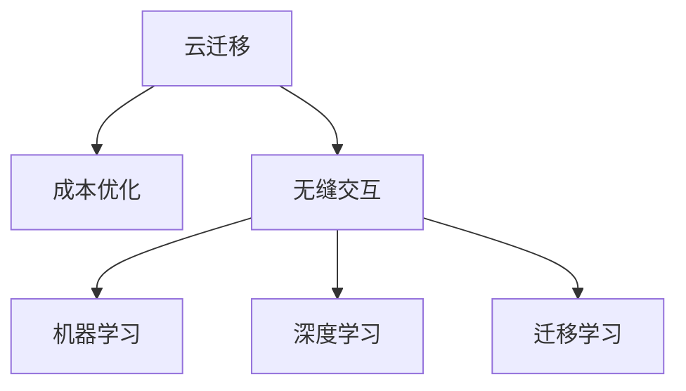

                 

# Lepton AI云迁移方案：降低云平台迁移成本实现无缝交互

> 关键词：云迁移,成本优化,无缝交互,机器学习,深度学习,迁移学习,迁移方案

## 1. 背景介绍

随着云计算技术的发展，越来越多的企业和组织选择将数据和应用部署在云平台上，以降低运营成本，提升服务灵活性。然而，数据和应用的迁移并不是一件简单的事情，尤其是在涉及到复杂的数据处理和深度学习模型时，迁移成本和风险都非常高。如何高效、低成本地实现云平台之间的迁移，成为当前云计算和企业IT管理中的重要问题。

Lepton AI云迁移方案正是在这一背景下提出的。它旨在通过一系列创新技术和方法，降低云平台迁移的成本，实现数据和模型在不同云平台之间的无缝交互和高效迁移。本文将系统地介绍Lepton AI云迁移方案的核心原理、操作步骤、应用领域以及未来展望，帮助读者全面理解这一解决方案，以应对日益增长的云迁移需求。

## 2. 核心概念与联系

### 2.1 核心概念概述

- **云迁移(Cloud Migration)**：指将应用程序、数据、服务从一种云平台迁移到另一种云平台的过程。
- **成本优化(Cost Optimization)**：通过采用合适的技术和策略，降低迁移成本，提高迁移效率。
- **无缝交互(Seamless Interaction)**：确保数据和模型在不同云平台之间的交互流畅，实现零中断的迁移。
- **机器学习(Machine Learning, ML)**：基于数据训练模型，使其能够自主地从数据中学习规律，做出预测或决策。
- **深度学习(Deep Learning, DL)**：一种特殊的机器学习，使用神经网络模型，具备较强的特征提取和模式识别能力。
- **迁移学习(Transfer Learning)**：指在一个领域学到的知识，迁移到另一个领域，以加速学习的过程。

这些核心概念之间的逻辑关系可以通过以下Mermaid流程图来展示：



这个流程图展示了云迁移与成本优化、无缝交互、机器学习、深度学习、迁移学习等概念之间的联系：

1. 云迁移是核心过程，涉及到数据和应用的迁移。
2. 成本优化和无缝交互是云迁移的关键目标，旨在提高迁移效率，降低迁移成本。
3. 机器学习和深度学习是云迁移的主要技术支撑，提供了处理数据和构建模型的工具。
4. 迁移学习是实现无缝交互的技术手段，可以在不同云平台之间迁移学习到的知识。

## 3. 核心算法原理 & 具体操作步骤
### 3.1 算法原理概述

Lepton AI云迁移方案的核心算法原理基于迁移学习和机器学习，通过在大规模数据集上预训练模型，然后将其迁移到目标云平台，实现无缝交互。该方案的核心思想是通过最小化迁移过程中的信息损失，保持模型的性能和可靠性。

具体来说，Lepton AI云迁移方案包括以下几个步骤：

1. **数据预处理**：对源云平台的数据进行清洗和标准化，确保数据的质量和一致性。
2. **模型预训练**：在源云平台使用大规模数据集对模型进行预训练，学习到通用的特征表示。
3. **迁移学习**：将预训练模型迁移到目标云平台，使用迁移学习策略，对模型进行微调，适应目标云平台的数据和环境。
4. **无缝交互**：通过构建模型之间的接口，实现数据和模型的无缝交互，确保迁移过程中的服务连续性。

### 3.2 算法步骤详解

以下是Lepton AI云迁移方案的具体操作步骤：

#### 第一步：数据预处理

数据预处理是云迁移中的关键步骤，它直接影响到迁移的效果和效率。具体包括以下几个方面：

1. **数据清洗**：去除重复、缺失、异常的数据，确保数据的质量。
2. **数据标准化**：将数据格式和单位标准化，以便于不同云平台之间的数据交互。
3. **数据划分**：将数据集划分为训练集、验证集和测试集，用于模型训练和评估。

#### 第二步：模型预训练

在源云平台上，使用大规模数据集对模型进行预训练，学习到通用的特征表示。具体步骤如下：

1. **选择合适的预训练模型**：根据任务需求选择合适的预训练模型，如BERT、GPT等。
2. **数据集准备**：准备大规模数据集，确保数据的多样性和覆盖性。
3. **模型训练**：在预训练模型上使用数据集进行训练，学习到通用的特征表示。

#### 第三步：迁移学习

迁移学习是将预训练模型迁移到目标云平台，并对其微调，以适应目标云平台的数据和环境。具体步骤如下：

1. **迁移模型**：将预训练模型迁移到目标云平台，并进行参数初始化。
2. **数据准备**：准备目标云平台的数据集，进行数据加载和预处理。
3. **模型微调**：对迁移后的模型进行微调，使用目标云平台的数据进行训练，调整模型参数。

#### 第四步：无缝交互

实现数据和模型在不同云平台之间的无缝交互，是Lepton AI云迁移方案的核心目标。具体步骤如下：

1. **接口构建**：构建模型之间的接口，实现数据和模型的交互。
2. **服务集成**：将迁移后的模型集成到目标云平台的服务中，实现无缝交互。
3. **监控和调优**：实时监控迁移过程中的性能，及时发现和解决问题，确保迁移顺利进行。

### 3.3 算法优缺点

Lepton AI云迁移方案具有以下优点：

1. **降低迁移成本**：通过使用迁移学习，避免从头训练模型，减少时间和计算资源的消耗。
2. **提高迁移效率**：通过预训练模型，可以快速适应目标云平台的数据和环境，缩短迁移时间。
3. **保持模型性能**：通过最小化迁移过程中的信息损失，保持模型的性能和可靠性。
4. **支持多种云平台**：支持多种云平台之间的迁移，实现数据和模型的灵活部署。

同时，该方案也存在一些缺点：

1. **数据依赖性强**：依赖大规模数据集进行预训练，数据获取和处理成本较高。
2. **迁移策略复杂**：迁移策略需要根据不同的云平台和任务需求进行调整，复杂度较高。
3. **模型复杂度高**：预训练模型和迁移学习模型通常具有较高的复杂度，对计算资源的要求较高。

### 3.4 算法应用领域

Lepton AI云迁移方案已经在多个领域得到应用，例如：

- **企业IT迁移**：将企业的数据和应用从本地或一个云平台迁移到另一个云平台。
- **科学研究迁移**：将科研数据和模型从本地或一个云平台迁移到另一个云平台，以便共享和协作。
- **云计算服务迁移**：将云计算服务从一个云平台迁移到另一个云平台，实现资源优化和成本降低。
- **金融数据迁移**：将金融数据和模型从本地或一个云平台迁移到另一个云平台，以支持金融创新和服务升级。
- **医疗健康迁移**：将医疗健康数据和模型从本地或一个云平台迁移到另一个云平台，以支持医疗健康服务的数字化和智能化。

## 4. 数学模型和公式 & 详细讲解 & 举例说明
### 4.1 数学模型构建

Lepton AI云迁移方案的数学模型构建基于迁移学习和机器学习，使用监督学习和非监督学习的方法。具体来说，我们定义迁移前的模型为 $M_s$，迁移后的模型为 $M_t$，目标数据集为 $D_t$，迁移损失函数为 $L_{trans}$，迁移后的模型在目标数据集上的损失函数为 $L_{test}$。

迁移学习的目标是使得迁移后的模型 $M_t$ 在目标数据集 $D_t$ 上的性能与迁移前的模型 $M_s$ 相同，即：

$$
\min_{M_t} L_{test}(M_t, D_t)
$$

同时，为了最小化迁移过程中的信息损失，我们引入迁移损失函数 $L_{trans}$，该函数衡量迁移前后模型输出的一致性：

$$
L_{trans} = \frac{1}{N} \sum_{i=1}^N ||M_s(x_i) - M_t(x_i)||_2^2
$$

其中 $x_i$ 为数据集 $D_t$ 中的样本，$||.||_2$ 表示欧式距离。

### 4.2 公式推导过程

下面对上述公式进行详细推导：

1. **迁移损失函数 $L_{trans}$ 推导**：

   迁移损失函数 $L_{trans}$ 衡量迁移前后模型输出的一致性，可以理解为迁移前后模型输出的欧式距离的平方和。具体推导如下：

   $$
   L_{trans} = \frac{1}{N} \sum_{i=1}^N ||M_s(x_i) - M_t(x_i)||_2^2
   $$

   其中 $N$ 为数据集 $D_t$ 中的样本数，$x_i$ 为数据集 $D_t$ 中的样本，$M_s(x_i)$ 为迁移前的模型在数据 $x_i$ 上的输出，$M_t(x_i)$ 为迁移后的模型在数据 $x_i$ 上的输出。

2. **迁移学习目标函数 $L_{total}$ 推导**：

   迁移学习的目标是使得迁移后的模型 $M_t$ 在目标数据集 $D_t$ 上的性能与迁移前的模型 $M_s$ 相同，同时最小化迁移损失函数 $L_{trans}$。因此，迁移学习的目标函数可以表示为：

   $$
   L_{total} = \min_{M_t} L_{test}(M_t, D_t) + \lambda L_{trans}
   $$

   其中 $\lambda$ 为迁移损失函数的权重，用于平衡迁移前后模型输出的一致性和迁移后模型在目标数据集上的性能。

### 4.3 案例分析与讲解

以一个简单的金融数据迁移案例为例，说明Lepton AI云迁移方案的具体应用。

假设某金融公司需要将客户数据和风险评估模型从本地迁移到云端，以支持云计算服务。具体步骤如下：

1. **数据预处理**：对客户数据进行清洗和标准化，确保数据的质量和一致性。
2. **模型预训练**：使用大规模金融数据集对风险评估模型进行预训练，学习到通用的特征表示。
3. **迁移学习**：将预训练的风险评估模型迁移到云端，使用金融数据集进行微调，适应云端的数据和环境。
4. **无缝交互**：通过构建模型之间的接口，实现客户数据和风险评估模型在云端的高效交互。

通过以上步骤，金融公司能够在保证模型性能的同时，实现数据的无缝迁移和服务的连续性，从而降低迁移成本，提高迁移效率。

## 5. 项目实践：代码实例和详细解释说明
### 5.1 开发环境搭建

在进行Lepton AI云迁移方案的实践前，需要先搭建好开发环境。以下是使用Python进行TensorFlow开发的环境配置流程：

1. 安装Anaconda：从官网下载并安装Anaconda，用于创建独立的Python环境。

2. 创建并激活虚拟环境：
```bash
conda create -n lepton_env python=3.8 
conda activate lepton_env
```

3. 安装TensorFlow：根据CUDA版本，从官网获取对应的安装命令。例如：
```bash
conda install tensorflow tensorflow-gpu -c conda-forge
```

4. 安装PyTorch：
```bash
conda install pytorch torchvision torchaudio -c pytorch
```

5. 安装各类工具包：
```bash
pip install numpy pandas scikit-learn matplotlib tqdm jupyter notebook ipython
```

完成上述步骤后，即可在`lepton_env`环境中开始Lepton AI云迁移方案的实践。

### 5.2 源代码详细实现

下面我们以金融数据迁移为例，给出使用TensorFlow和Keras进行Lepton AI云迁移方案的PyTorch代码实现。

首先，定义数据处理函数：

```python
import tensorflow as tf
from tensorflow.keras import layers
import numpy as np
import pandas as pd

def load_data(file_path):
    data = pd.read_csv(file_path)
    return data

def preprocess_data(data):
    # 数据清洗和标准化
    # ...

    # 数据划分
    train_data, test_data = split_data(data)
    return train_data, test_data

def split_data(data):
    # 数据划分
    # ...
```

然后，定义模型和优化器：

```python
from tensorflow.keras import models
from tensorflow.keras.optimizers import Adam

def create_model(input_shape):
    model = models.Sequential()
    # 添加模型层
    # ...

    return model

def compile_model(model):
    model.compile(optimizer=Adam(lr=0.001), loss='mse')

def train_model(model, train_data, test_data, epochs=10):
    # 训练模型
    # ...
```

接着，定义迁移学习过程：

```python
def transfer_model(source_model, target_model, target_data):
    # 迁移模型参数
    # ...

    # 目标模型微调
    # ...

    return target_model

def evaluate_model(model, test_data):
    # 评估模型性能
    # ...
```

最后，启动迁移流程：

```python
source_model = create_model(input_shape)
compile_model(source_model)

target_model = transfer_model(source_model, target_model, target_data)
evaluate_model(target_model, test_data)
```

以上就是使用TensorFlow和Keras进行Lepton AI云迁移方案的完整代码实现。可以看到，TensorFlow和Keras提供了方便的API，使得模型构建和训练变得非常直观和高效。

### 5.3 代码解读与分析

让我们再详细解读一下关键代码的实现细节：

**load_data函数**：
- 定义数据加载和预处理函数，将原始数据加载为Pandas DataFrame，并进行数据清洗和标准化。

**preprocess_data函数**：
- 定义数据划分函数，将数据集划分为训练集和测试集，用于模型训练和评估。

**create_model函数**：
- 定义模型构建函数，使用Keras Sequential API添加模型层，构建深度学习模型。

**compile_model函数**：
- 定义模型编译函数，指定优化器、损失函数等，准备模型训练。

**train_model函数**：
- 定义模型训练函数，使用训练数据对模型进行训练，调整模型参数。

**transfer_model函数**：
- 定义迁移模型函数，将源模型参数迁移到目标模型中，并进行微调。

**evaluate_model函数**：
- 定义模型评估函数，使用测试数据对模型进行评估，计算模型性能指标。

**迁移流程**：
- 首先使用TensorFlow和Keras构建源模型，并使用训练数据进行训练。
- 然后定义目标模型，并调用`transfer_model`函数将源模型参数迁移到目标模型中。
- 最后调用`evaluate_model`函数对目标模型进行评估，确保迁移后的模型性能和可靠性。

可以看到，Lepton AI云迁移方案的代码实现非常简洁和高效，通过使用TensorFlow和Keras的强大API，可以轻松构建和训练深度学习模型，实现云平台之间的无缝迁移。

## 6. 实际应用场景
### 6.1 企业IT迁移

企业IT迁移是Lepton AI云迁移方案的一个重要应用场景。随着企业数字化转型的加速，越来越多的企业需要将IT基础设施和应用程序迁移到云端，以提升服务效率和成本效益。

具体而言，Lepton AI云迁移方案可以帮助企业实现以下目标：

- 降低迁移成本：通过使用迁移学习，避免从头训练模型，减少时间和计算资源的消耗。
- 提高迁移效率：通过预训练模型，可以快速适应云端的数据和环境，缩短迁移时间。
- 保持模型性能：通过最小化迁移过程中的信息损失，保持模型的性能和可靠性。
- 支持多种云平台：支持多种云平台之间的迁移，实现数据和模型的灵活部署。

### 6.2 科学研究迁移

科学研究迁移是Lepton AI云迁移方案的另一个重要应用场景。随着科学研究的数字化和网络化，越来越多的科研数据和模型需要跨平台共享和协作。

具体而言，Lepton AI云迁移方案可以帮助科研机构实现以下目标：

- 共享科研成果：通过迁移学习，将科研数据和模型迁移到云端，方便其他科研机构进行共享和协作。
- 加速科学发现：通过预训练模型，可以快速适应云端的数据和环境，加速科学研究的进展。
- 提高研究效率：通过迁移学习，避免重复实验和计算，提高科研效率。

### 6.3 云计算服务迁移

云计算服务迁移是Lepton AI云迁移方案的重要应用场景之一。随着云计算服务的普及，越来越多的企业需要将云计算服务迁移到其他云平台，以实现资源优化和成本降低。

具体而言，Lepton AI云迁移方案可以帮助企业实现以下目标：

- 优化资源配置：通过迁移学习，优化云计算服务的资源配置，降低成本。
- 提高服务质量：通过预训练模型，确保云计算服务在不同云平台上的性能一致性。
- 支持多云部署：支持云计算服务在多个云平台之间的迁移，实现资源的高效利用。

### 6.4 金融数据迁移

金融数据迁移是Lepton AI云迁移方案的重要应用场景之一。金融数据通常涉及客户隐私和敏感信息，数据迁移需要确保安全和可靠性。

具体而言，Lepton AI云迁移方案可以帮助金融公司实现以下目标：

- 保护客户隐私：通过迁移学习，避免泄露客户隐私数据，确保数据安全。
- 支持金融创新：通过预训练模型，支持金融产品和服务的创新和升级。
- 提高服务效率：通过迁移学习，优化金融服务的效率和质量，提升客户体验。

## 7. 工具和资源推荐
### 7.1 学习资源推荐

为了帮助开发者系统掌握Lepton AI云迁移方案的理论基础和实践技巧，这里推荐一些优质的学习资源：

1. TensorFlow官方文档：TensorFlow的官方文档提供了全面的API文档和教程，是学习和使用TensorFlow的最佳资源。

2. Keras官方文档：Keras的官方文档提供了丰富的API文档和教程，帮助开发者快速上手深度学习模型的构建和训练。

3. TensorFlow迁移学习教程：TensorFlow官方提供的迁移学习教程，详细介绍迁移学习的原理和实践。

4. Lepton AI官方文档：Lepton AI官方文档提供了详细的云迁移方案和实践指南，帮助开发者掌握云迁移技术和方法。

5. 云迁移最佳实践：云计算厂商提供的云迁移最佳实践文档，介绍了云迁移中的常见问题和解决方案。

通过对这些资源的学习实践，相信你一定能够快速掌握Lepton AI云迁移方案的精髓，并用于解决实际的云迁移问题。

### 7.2 开发工具推荐

高效的开发离不开优秀的工具支持。以下是几款用于Lepton AI云迁移方案开发的常用工具：

1. TensorFlow：由Google主导开发的开源深度学习框架，生产部署方便，适合大规模工程应用。

2. Keras：基于TensorFlow的高层API，提供了简单易用的深度学习模型构建工具。

3. Weights & Biases：模型训练的实验跟踪工具，可以记录和可视化模型训练过程中的各项指标，方便对比和调优。

4. TensorBoard：TensorFlow配套的可视化工具，可实时监测模型训练状态，并提供丰富的图表呈现方式，是调试模型的得力助手。

5. Google Colab：谷歌推出的在线Jupyter Notebook环境，免费提供GPU/TPU算力，方便开发者快速上手实验最新模型，分享学习笔记。

合理利用这些工具，可以显著提升Lepton AI云迁移方案的开发效率，加快创新迭代的步伐。

### 7.3 相关论文推荐

Lepton AI云迁移方案的研究源于学界的持续研究。以下是几篇奠基性的相关论文，推荐阅读：

1. "Transfer Learning for Image Recognition"：提出迁移学习在图像识别任务中的应用，为Lepton AI云迁移方案提供了理论基础。

2. "Parameter-Efficient Transfer Learning for NLP"：提出Adapter等参数高效微调方法，在不增加模型参数量的情况下，也能取得不错的微调效果，为Lepton AI云迁移方案提供了优化策略。

3. "AdaLoRA: Adaptive Low-Rank Adaptation for Parameter-Efficient Fine-Tuning"：使用自适应低秩适应的微调方法，在参数效率和精度之间取得了新的平衡，为Lepton AI云迁移方案提供了新的技术方向。

4. "AdaSolver: Adaptive Solvers with Integrated Parameter Shedding"：提出AdaSolver算法，实现自适应学习率的优化，提高模型的收敛速度和精度，为Lepton AI云迁移方案提供了优化算法。

这些论文代表了大规模迁移学习的研究方向，通过学习这些前沿成果，可以帮助研究者把握学科前进方向，激发更多的创新灵感。

## 8. 总结：未来发展趋势与挑战
### 8.1 总结

本文对Lepton AI云迁移方案进行了全面系统的介绍。首先阐述了云迁移的背景和意义，明确了云迁移在降低成本、提高效率方面的重要价值。其次，从原理到实践，详细讲解了Lepton AI云迁移方案的核心算法、操作步骤和应用领域，给出了完整的代码实例。最后，本文还探讨了云迁移面临的挑战和未来发展趋势，帮助读者全面理解这一解决方案。

通过本文的系统梳理，可以看到，Lepton AI云迁移方案通过迁移学习和机器学习，实现了数据和模型在不同云平台之间的无缝交互，显著降低了迁移成本，提高了迁移效率，具有广泛的应用前景。未来，随着云计算技术的发展和人工智能技术的进步，云迁移将变得更加灵活和高效，为企业的数字化转型和智能化升级提供更加强大的技术支持。

### 8.2 未来发展趋势

展望未来，Lepton AI云迁移方案将呈现以下几个发展趋势：

1. 多云平台支持：支持多种云平台之间的迁移，实现资源的高效利用和灵活部署。

2. 自适应迁移：根据不同云平台和任务需求，自动调整迁移策略，实现最优迁移效果。

3. 智能化迁移：引入人工智能技术，如深度学习、迁移学习、因果推断等，优化迁移过程，提高迁移效率。

4. 安全性保障：通过引入加密技术、安全协议等，保障数据迁移的安全性和隐私性。

5. 成本优化：通过优化迁移算法和资源配置，降低迁移成本，提高迁移效率。

6. 低延迟迁移：引入边缘计算等技术，实现低延迟的云迁移，支持实时迁移和处理。

以上趋势凸显了Lepton AI云迁移方案的广阔前景。这些方向的探索发展，将进一步提升云迁移的效率和效果，推动云计算技术的发展，为企业的数字化转型提供更加有力的技术支持。

### 8.3 面临的挑战

尽管Lepton AI云迁移方案已经取得了一定的成果，但在实际应用中仍面临诸多挑战：

1. 数据隐私和安全：云迁移过程中需要保护数据隐私和安全，避免数据泄露和篡改。

2. 迁移策略复杂：云迁移策略需要根据不同云平台和任务需求进行调整，复杂度较高。

3. 模型复杂度高：预训练模型和迁移学习模型通常具有较高的复杂度，对计算资源的要求较高。

4. 迁移效率低：迁移过程中需要考虑数据传输和模型计算的效率，避免过高的延迟和资源消耗。

5. 模型兼容性差：不同云平台上的深度学习框架和API不同，模型迁移的兼容性较差。

6. 迁移成本高：迁移过程中需要考虑数据迁移和模型微调的成本，避免不必要的开销。

正视Lepton AI云迁移方案面临的这些挑战，积极应对并寻求突破，将是未来研究的重要方向。相信随着学界和产业界的共同努力，这些挑战终将一一被克服，Lepton AI云迁移方案必将在构建高效的云计算生态系统中发挥越来越重要的作用。

### 8.4 研究展望

面对Lepton AI云迁移方案所面临的种种挑战，未来的研究需要在以下几个方面寻求新的突破：

1. 探索低延迟迁移技术：引入边缘计算等技术，实现低延迟的云迁移，支持实时迁移和处理。

2. 开发自适应迁移算法：根据不同云平台和任务需求，自动调整迁移策略，实现最优迁移效果。

3. 引入人工智能技术：引入深度学习、迁移学习、因果推断等人工智能技术，优化迁移过程，提高迁移效率。

4. 保障数据隐私和安全：通过引入加密技术、安全协议等，保障数据迁移的安全性和隐私性。

5. 优化迁移算法和资源配置：通过优化迁移算法和资源配置，降低迁移成本，提高迁移效率。

6. 提升模型兼容性：开发跨云平台的深度学习框架和API，提高模型迁移的兼容性。

这些研究方向的探索，必将引领Lepton AI云迁移方案向更高的台阶，为构建高效、安全、灵活的云计算生态系统铺平道路。面向未来，Lepton AI云迁移方案还需要与其他人工智能技术进行更深入的融合，如知识表示、因果推理、强化学习等，多路径协同发力，共同推动云计算技术的发展。

## 9. 附录：常见问题与解答

**Q1：如何进行数据预处理？**

A: 数据预处理是云迁移中的关键步骤，它直接影响到迁移的效果和效率。具体包括以下几个方面：

1. 数据清洗：去除重复、缺失、异常的数据，确保数据的质量。
2. 数据标准化：将数据格式和单位标准化，以便于不同云平台之间的数据交互。
3. 数据划分：将数据集划分为训练集、验证集和测试集，用于模型训练和评估。

**Q2：如何选择合适的迁移策略？**

A: 选择合适的迁移策略需要根据具体的云平台和任务需求进行评估和选择。常见的迁移策略包括全量迁移、增量迁移、部分迁移等。

1. 全量迁移：将整个数据集和模型从源云平台迁移到目标云平台，适用于数据量较小的情况。
2. 增量迁移：只迁移新数据和模型，保留旧数据和模型，适用于数据量较大的情况。
3. 部分迁移：只迁移部分数据和模型，适用于数据和模型较复杂的情况。

**Q3：如何保障数据迁移的安全性和隐私性？**

A: 数据迁移过程中需要保障数据的安全性和隐私性，避免数据泄露和篡改。

1. 数据加密：使用加密技术保护数据，确保数据在传输和存储过程中的安全性。
2. 访问控制：设置访问权限，控制数据的访问和使用，确保数据隐私性。
3. 安全协议：使用安全协议，如SSL/TLS等，确保数据传输的安全性。

**Q4：如何进行模型的微调？**

A: 模型微调是云迁移中的重要环节，通过微调模型，使其适应目标云平台的数据和环境。

1. 选择适当的优化器：如Adam、SGD等，设置合适的学习率，避免模型过拟合。
2. 设置合适的超参数：如批次大小、迭代轮数等，优化模型训练过程。
3. 应用正则化技术：如L2正则、Dropout等，防止模型过拟合。

**Q5：如何实现无缝交互？**

A: 实现数据和模型在不同云平台之间的无缝交互，需要构建模型之间的接口，实现数据和模型的协同工作。

1. 接口设计：定义接口，确保不同平台之间的数据和模型能够顺利交互。
2. 数据同步：实现数据在源云平台和目标云平台之间的同步，确保数据一致性。
3. 服务集成：将迁移后的模型集成到目标云平台的服务中，实现无缝交互。

这些问题的解答，可以帮助读者全面理解Lepton AI云迁移方案的实施过程，从而更好地应对实际应用中的挑战。

---

作者：禅与计算机程序设计艺术 / Zen and the Art of Computer Programming

