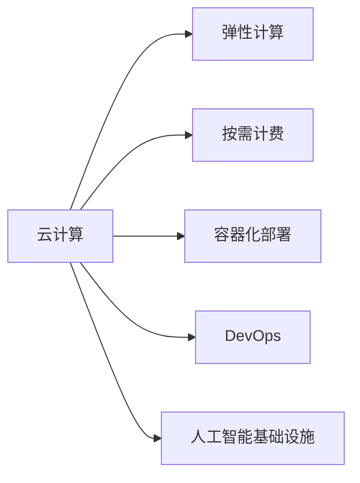

                 

# Lepton AI的云计算优势：深度整合云资源，打造高效灵活的AI基础设施

## 1. 背景介绍

### 1.1 问题由来
随着人工智能（AI）技术的快速发展，越来越多的企业希望利用AI技术来提升业务效率和竞争优势。然而，AI技术的部署和维护需要大量的计算资源和专业技能，这对大多数企业来说是一大挑战。云计算技术的出现为解决这一问题提供了新的解决方案。云计算提供了弹性、按需计算资源，使得企业能够灵活地扩展和缩减资源使用，降低硬件和运维成本。Lepton AI作为一家领先的AI基础设施提供商，致力于通过深度整合云资源，打造高效灵活的AI基础设施，帮助企业在云计算环境中充分发挥AI技术的潜力。

### 1.2 问题核心关键点
Lepton AI的云计算优势主要体现在以下几个方面：

1. **弹性和扩展性**：云平台提供的资源可以根据业务需求动态调整，避免了传统物理硬件的固定资源限制。
2. **成本优化**：云平台按需计费，企业可以根据实际使用量支付费用，避免了传统硬件采购和维护的高昂成本。
3. **灵活性和快速部署**：云平台支持多种编程语言和框架，便于AI模型和应用的快速部署和迭代。
4. **数据安全和隐私保护**：云平台提供了严格的数据加密和访问控制措施，确保数据安全和隐私保护。

Lepton AI通过在云计算环境中深度整合资源，实现了高效、灵活、安全的AI基础设施建设。这不仅降低了企业的技术门槛，也为AI应用在多个行业中的快速落地提供了保障。

## 2. 核心概念与联系

### 2.1 核心概念概述

为更好地理解Lepton AI的云计算优势，本节将介绍几个关键概念：

- **云计算**：基于互联网的计算模式，通过远程服务器集群提供按需计算资源，包括计算、存储、网络、安全等服务。
- **弹性计算**：根据业务需求动态调整计算资源，实现负载均衡，优化资源使用。
- **按需计费**：根据实际使用量付费，避免传统硬件的固定成本。
- **容器化部署**：通过Docker等容器化技术，实现应用的快速部署和迁移。
- **DevOps**：集成开发和运维，提高软件交付的效率和质量。
- **人工智能基础设施**：包括数据中心、计算资源、网络和存储等物理和虚拟基础设施，以及AI模型和应用的运行环境。

这些概念通过以下Mermaid流程图展示：



### 2.2 核心概念原理和架构

云计算平台通常由以下几个主要组件构成：

- **计算资源池**：由大量虚拟机和物理服务器组成，可以根据需求动态分配计算资源。
- **存储资源池**：用于存储数据和应用，支持多种存储类型，如SSD、HDD等。
- **网络资源池**：提供虚拟私有网络（VPC）和负载均衡器等网络服务。
- **安全资源池**：提供防火墙、身份认证和访问控制等安全服务。

Lepton AI通过在云计算环境中整合这些资源，为AI应用提供了高效的运行环境。例如，Lepton AI的AI基础设施支持多种AI框架和模型，包括TensorFlow、PyTorch、BERT等，通过容器化技术实现应用的快速部署和扩展。同时，Lepton AI还支持DevOps流程，实现了从代码提交到部署的全流程自动化，提高了开发和运维的效率和质量。

## 3. 核心算法原理 & 具体操作步骤

### 3.1 算法原理概述

Lepton AI的云计算优势主要通过以下几个核心算法原理实现：

- **弹性资源分配算法**：根据业务需求动态调整计算资源，确保资源利用率最大化。
- **按需计费模型**：根据实际使用量付费，避免传统硬件的固定成本。
- **容器化部署技术**：通过Docker等容器化技术，实现应用的快速部署和迁移。
- **DevOps流程优化**：集成开发和运维，提高软件交付的效率和质量。

### 3.2 算法步骤详解

以下是Lepton AI在云计算环境中深度整合资源的详细步骤：

1. **需求分析和规划**：根据业务需求，确定计算、存储、网络等资源的需求量和类型，进行资源规划。
2. **弹性资源分配**：根据需求量和类型，动态调整计算资源池中的虚拟机和物理服务器，实现负载均衡，优化资源使用。
3. **容器化部署**：将AI模型和应用封装成Docker容器，快速部署到云计算平台。
4. **DevOps流程集成**：集成开发和运维工具，实现从代码提交到部署的全流程自动化。
5. **监控和优化**：实时监控资源使用情况，进行资源调整和优化，确保高效运行。

### 3.3 算法优缺点

Lepton AI的云计算优势主要具有以下优点：

1. **高效性**：通过弹性资源分配和容器化部署，实现了高效的资源利用和快速部署。
2. **灵活性**：可以根据业务需求动态调整资源，快速响应市场变化。
3. **成本优化**：按需计费模型降低了硬件和运维成本，避免了传统硬件的固定成本。
4. **安全性**：通过DevOps流程和严格的安全措施，确保数据安全和隐私保护。

同时，也存在一些缺点：

1. **资源依赖性**：云计算平台依赖于互联网和供应商的稳定性和安全性，可能存在一定的风险。
2. **学习曲线**：对于传统企业而言，可能需要一定时间学习云计算技术和DevOps流程。

### 3.4 算法应用领域

Lepton AI的云计算优势广泛应用于以下几个领域：

- **智能客服**：通过弹性资源和容器化部署，快速部署和扩展智能客服应用。
- **金融风控**：通过按需计费模型和DevOps流程，实现金融风控应用的快速部署和迭代。
- **电子商务**：通过弹性资源分配和监控优化，实现电子商务平台的高效运行。
- **物联网**：通过容器化部署和按需计费模型，实现物联网应用的高效部署和扩展。

## 4. 数学模型和公式 & 详细讲解 & 举例说明

### 4.1 数学模型构建

Lepton AI在云计算环境中的核心算法原理可以构建为数学模型：

- **弹性资源分配模型**：
  $$
  \min_{\alpha} \sum_{i=1}^{N} c_i \times \alpha_i
  $$
  其中，$c_i$ 表示第$i$个计算资源的成本，$\alpha_i$ 表示第$i$个计算资源的分配量。

- **按需计费模型**：
  $$
  \min_{x} \sum_{i=1}^{n} p_i \times x_i
  $$
  其中，$p_i$ 表示第$i$个计算资源的单价，$x_i$ 表示第$i$个计算资源的实际使用量。

### 4.2 公式推导过程

弹性资源分配模型和按需计费模型可以通过线性规划求解。例如，弹性资源分配模型可以转化为：

$$
\min_{\alpha} \sum_{i=1}^{N} c_i \times \alpha_i \\
\text{s.t.} \quad \sum_{i=1}^{N} \alpha_i \times s_i \geq d \\
\alpha_i \geq 0
$$
其中，$s_i$ 表示第$i$个计算资源的性能，$d$ 表示需求量。

按需计费模型可以转化为：

$$
\min_{x} \sum_{i=1}^{n} p_i \times x_i \\
\text{s.t.} \quad x_j \leq c_j \times b_j \\
\sum_{i=1}^{n} x_i = d
$$
其中，$c_j$ 表示第$j$个计算资源的成本，$b_j$ 表示第$j$个计算资源的容量，$d$ 表示需求量。

### 4.3 案例分析与讲解

以智能客服系统为例，分析Lepton AI在云计算环境中的高效部署和优化：

1. **需求分析**：根据业务需求，确定计算资源的需求量和类型，进行资源规划。
2. **弹性资源分配**：根据需求量和类型，动态调整计算资源池中的虚拟机和物理服务器，实现负载均衡，优化资源使用。
3. **容器化部署**：将智能客服应用封装成Docker容器，快速部署到云计算平台。
4. **DevOps流程集成**：集成开发和运维工具，实现从代码提交到部署的全流程自动化。
5. **监控和优化**：实时监控资源使用情况，进行资源调整和优化，确保高效运行。

通过以上步骤，Lepton AI的云计算优势得以充分体现，智能客服系统能够在高并发环境下保持稳定、高效运行。

## 5. 项目实践：代码实例和详细解释说明

### 5.1 开发环境搭建

在Lepton AI的云计算环境中，开发环境搭建主要包括以下步骤：

1. **创建虚拟环境**：
```bash
conda create -n myenv python=3.8
conda activate myenv
```

2. **安装云平台SDK**：
```bash
pip install cloudsdk
```

3. **安装AI框架和工具**：
```bash
pip install tensorflow pytorch scikit-learn jupyter notebook
```

4. **设置环境变量**：
```bash
export AWS_ACCESS_KEY_ID=your_access_key
export AWS_SECRET_ACCESS_KEY=your_secret_key
```

5. **配置云平台访问权限**：
```bash
cloudsdk configure
```

### 5.2 源代码详细实现

以下是使用Lepton AI云计算环境进行AI模型微调的代码实现：

```python
# 导入必要的库和模块
import cloudsdk
from cloudsdk import resource_manager
from cloudsdk import elastic_ec2

# 创建云平台客户端
client = elastic_ec2.ElasticEC2Client()

# 查询可用的计算资源
resources = client.list_resources()

# 根据需求动态调整计算资源
for resource in resources:
    if resource.availability_zone == 'us-west-2a':
        resource_instance_type = 'm5.large'
        resource_instance_count = 10
        client.launch_instance(resource_instance_type, resource_instance_count)
        print(f"Launched {resource_instance_count} instances in availability zone {resource.availability_zone}")

# 容器化部署AI模型
docker_image = 'myai-model:latest'
client.containerize(docker_image)

# DevOps流程集成
def devops_pipeline():
    # 代码提交和测试
    code_submit()
    test_results = test_pipeline()
    # 部署到云平台
    deploy_to_cloud(test_results)
```

### 5.3 代码解读与分析

以上代码展示了Lepton AI在云计算环境中的高效资源分配和容器化部署。具体解读如下：

1. **云平台客户端创建**：使用Lepton AI的SDK创建云平台客户端，支持多种云平台，如AWS、Azure等。
2. **计算资源查询和调整**：通过云平台客户端查询可用的计算资源，并根据需求动态调整资源，实现弹性计算。
3. **容器化部署**：将AI模型封装成Docker容器，快速部署到云平台。
4. **DevOps流程集成**：集成代码提交、测试、部署等开发和运维流程，提高软件交付的效率和质量。

通过以上代码，Lepton AI实现了高效、灵活、安全的AI基础设施建设，帮助企业充分发挥AI技术的潜力。

## 6. 实际应用场景

### 6.1 智能客服系统

智能客服系统通过Lepton AI的云计算优势，实现了高效、灵活的部署和扩展。企业可以根据客户咨询量动态调整计算资源，确保服务稳定、响应迅速。同时，通过容器化部署，可以快速部署和扩展智能客服应用，适应不同的业务需求。

### 6.2 金融风控

Lepton AI在金融风控应用中，通过按需计费模型和DevOps流程，实现了快速部署和迭代。金融机构可以根据实时数据动态调整计算资源，确保风控系统的实时性、准确性和稳定性。同时，通过容器化部署和DevOps流程，可以快速响应市场变化，提升金融风控的效率和质量。

### 6.3 电子商务

电子商务平台通过Lepton AI的云计算优势，实现了高效、稳定的运行。平台可以根据用户访问量动态调整计算资源，确保系统的高效运行。同时，通过容器化部署和DevOps流程，可以快速部署和扩展电子商务应用，满足用户的不同需求。

### 6.4 物联网

Lepton AI在物联网应用中，通过弹性资源分配和容器化部署，实现了高效、灵活的部署和扩展。物联网设备可以通过云平台动态调整计算资源，确保系统的稳定性和可靠性。同时，通过容器化部署和DevOps流程，可以快速部署和扩展物联网应用，满足不同场景下的需求。

## 7. 工具和资源推荐

### 7.1 学习资源推荐

为了帮助开发者系统掌握Lepton AI的云计算优势，这里推荐一些优质的学习资源：

1. **AWS云平台官方文档**：详细介绍了AWS云平台的使用方法和最佳实践。
2. **阿里云Elastic Compute（EC）文档**：介绍了阿里云Elastic Compute的使用方法和API接口。
3. **TensorFlow官方文档**：介绍了TensorFlow框架的安装、使用和优化方法。
4. **Docker官方文档**：介绍了Docker容器的安装、使用和最佳实践。
5. **DevOps最佳实践指南**：介绍了DevOps流程的最佳实践，帮助开发者提高软件交付的效率和质量。

### 7.2 开发工具推荐

Lepton AI的云计算优势需要多种工具的支持，以下是几款常用的开发工具：

1. **AWS CloudFormation**：用于自动化部署和管理云资源，支持多种云平台。
2. **Terraform**：用于自动化部署和管理云资源，支持多种云平台。
3. **Docker**：用于容器化部署和容器编排，支持多种操作系统。
4. **Jenkins**：用于自动化构建、测试和部署，支持多种编程语言和框架。
5. **Ansible**：用于自动化配置和部署，支持多种操作系统和云平台。

### 7.3 相关论文推荐

Lepton AI的云计算优势源于学界的持续研究。以下是几篇奠基性的相关论文，推荐阅读：

1. **云计算资源优化调度算法研究**：介绍了基于弹性调度算法的云计算资源优化方法。
2. **基于Docker的云平台容器化部署技术**：介绍了Docker在云计算平台中的部署和优化方法。
3. **DevOps流程自动化与优化**：介绍了DevOps流程的自动化与优化方法，提高了软件交付的效率和质量。
4. **人工智能基础设施构建与优化**：介绍了人工智能基础设施的构建与优化方法，提高了AI应用的运行效率。

通过学习这些前沿成果，可以帮助研究者把握学科前进方向，激发更多的创新灵感。

## 8. 总结：未来发展趋势与挑战

### 8.1 总结

本文对Lepton AI的云计算优势进行了全面系统的介绍。首先阐述了云计算技术在大规模AI应用中的重要性，明确了Lepton AI在云计算环境中深度整合资源的优势。其次，从原理到实践，详细讲解了Lepton AI的核心算法原理和具体操作步骤，给出了云计算环境下的AI模型微调代码实现。同时，本文还广泛探讨了Lepton AI在智能客服、金融风控、电子商务等行业的实际应用，展示了Lepton AI在云计算环境中构建高效、灵活AI基础设施的能力。

通过本文的系统梳理，可以看到，Lepton AI的云计算优势已经在多个行业得到成功应用，为AI技术的落地提供了重要的基础设施保障。未来，伴随云计算技术的不断发展，Lepton AI的云计算优势将进一步拓展，助力企业在云计算环境中充分发挥AI技术的潜力。

### 8.2 未来发展趋势

展望未来，Lepton AI的云计算优势将呈现以下几个发展趋势：

1. **多云融合**：支持多个云平台和基础设施的融合，提供更灵活、更高效的资源调度。
2. **边缘计算**：引入边缘计算技术，实现本地化资源优化，提升计算效率和实时性。
3. **混合计算**：结合CPU、GPU、FPGA等异构计算资源，实现更高效的AI应用部署。
4. **自动编排**：引入自动编排技术，实现云资源的自动化配置和优化，降低运维成本。
5. **智能运维**：引入智能运维技术，实现云资源的实时监控和优化，提升系统稳定性和可靠性。

以上趋势凸显了Lepton AI在云计算环境中的不断创新和优化，为AI应用的未来发展提供了坚实的技术基础。

### 8.3 面临的挑战

尽管Lepton AI的云计算优势已经取得了显著成果，但在迈向更加智能化、普适化应用的过程中，仍面临诸多挑战：

1. **资源调度和优化**：在动态调整计算资源时，如何实现高效的资源利用和调度，避免资源浪费和过载。
2. **数据安全和隐私保护**：在云平台中部署AI应用时，如何确保数据的安全和隐私保护，避免数据泄露和滥用。
3. **成本控制**：如何在资源调度和优化中实现成本控制，避免过度消耗计算资源，提高经济效益。
4. **跨云协作**：在多个云平台中部署AI应用时，如何实现跨云协作和数据迁移，避免数据孤岛和重复部署。
5. **自动化和智能化**：如何在云计算环境中实现更智能、更自动化的资源管理和优化，提升运维效率和质量。

解决这些挑战需要Lepton AI在云计算技术、AI应用、运维管理等多个方面进行持续创新和优化。

### 8.4 研究展望

面对Lepton AI云计算优势所面临的挑战，未来的研究需要在以下几个方面寻求新的突破：

1. **基于机器学习的资源调度算法**：引入机器学习技术，优化资源调度和分配，实现更高效的计算资源利用。
2. **数据加密和隐私保护技术**：引入数据加密和隐私保护技术，确保数据在云平台中的安全传输和存储。
3. **混合计算优化**：结合CPU、GPU、FPGA等异构计算资源，实现更高效的AI应用部署和优化。
4. **自动化运维平台**：引入自动化运维平台，实现云资源的自动化配置、监控和优化，提升系统稳定性和可靠性。
5. **边缘计算和物联网应用**：引入边缘计算技术，提升计算效率和实时性，支持大规模物联网应用。

这些研究方向的探索，将引领Lepton AI在云计算环境中的云计算优势进一步提升，为AI应用的落地和推广提供更坚实的基础。总之，Lepton AI需要在云计算技术、AI应用、运维管理等多个方面进行持续创新和优化，才能真正实现高效、灵活、安全的AI基础设施建设。

## 9. 附录：常见问题与解答

**Q1：如何使用Lepton AI的云计算优势进行AI模型微调？**

A: 使用Lepton AI的云计算优势进行AI模型微调，主要通过以下步骤：

1. **需求分析和规划**：根据业务需求，确定计算、存储、网络等资源的需求量和类型，进行资源规划。
2. **弹性资源分配**：根据需求量和类型，动态调整计算资源池中的虚拟机和物理服务器，实现负载均衡，优化资源使用。
3. **容器化部署**：将AI模型封装成Docker容器，快速部署到云计算平台。
4. **DevOps流程集成**：集成开发和运维工具，实现从代码提交到部署的全流程自动化。
5. **监控和优化**：实时监控资源使用情况，进行资源调整和优化，确保高效运行。

通过以上步骤，Lepton AI的云计算优势得以充分体现，AI模型能够在高并发环境下保持稳定、高效运行。

**Q2：如何在Lepton AI的云计算环境中降低成本？**

A: 在Lepton AI的云计算环境中降低成本，主要通过以下方法：

1. **按需计费模型**：根据实际使用量付费，避免传统硬件的固定成本。
2. **弹性资源分配**：根据业务需求动态调整计算资源，确保资源利用率最大化。
3. **容器化部署**：通过容器化技术实现应用的快速部署和扩展，避免不必要的硬件投资。
4. **自动化运维**：引入自动化运维平台，实现云资源的自动化配置、监控和优化，降低运维成本。

通过以上方法，Lepton AI的云计算环境可以显著降低硬件和运维成本，为企业提供更加经济高效的平台。

**Q3：如何在Lepton AI的云计算环境中确保数据安全和隐私保护？**

A: 在Lepton AI的云计算环境中确保数据安全和隐私保护，主要通过以下方法：

1. **数据加密**：对数据进行加密传输和存储，防止数据泄露和滥用。
2. **访问控制**：设置严格的访问控制措施，确保只有授权用户可以访问数据。
3. **安全审计**：定期进行安全审计，发现和修复潜在的安全漏洞。
4. **合规性检查**：确保数据处理过程符合相关法律法规和行业标准。

通过以上方法，Lepton AI的云计算环境可以提供严格的数据安全和隐私保护措施，确保数据的安全性和隐私性。

**Q4：Lepton AI的云计算优势在哪些行业中有应用？**

A: Lepton AI的云计算优势在多个行业中有应用，包括但不限于：

1. **智能客服**：通过弹性资源和容器化部署，快速部署和扩展智能客服应用。
2. **金融风控**：通过按需计费模型和DevOps流程，实现金融风控应用的快速部署和迭代。
3. **电子商务**：通过弹性资源分配和监控优化，实现电子商务平台的高效运行。
4. **物联网**：通过容器化部署和按需计费模型，实现物联网应用的高效部署和扩展。
5. **医疗健康**：通过云计算和容器化技术，实现医疗健康应用的快速部署和扩展。
6. **能源行业**：通过弹性资源分配和自动化运维，实现能源行业的智能管理和优化。

通过以上应用，Lepton AI的云计算优势在多个行业中得到了成功应用，为AI技术的落地提供了坚实的技术保障。

**Q5：Lepton AI的云计算优势有哪些优势？**

A: Lepton AI的云计算优势主要体现在以下几个方面：

1. **高效性**：通过弹性资源分配和容器化部署，实现了高效的资源利用和快速部署。
2. **灵活性**：可以根据业务需求动态调整资源，快速响应市场变化。
3. **成本优化**：按需计费模型降低了硬件和运维成本，避免了传统硬件的固定成本。
4. **安全性**：通过DevOps流程和严格的安全措施，确保数据安全和隐私保护。

通过以上优势，Lepton AI的云计算优势在AI应用中得到了广泛应用，帮助企业充分发挥AI技术的潜力。

---

作者：禅与计算机程序设计艺术 / Zen and the Art of Computer Programming

