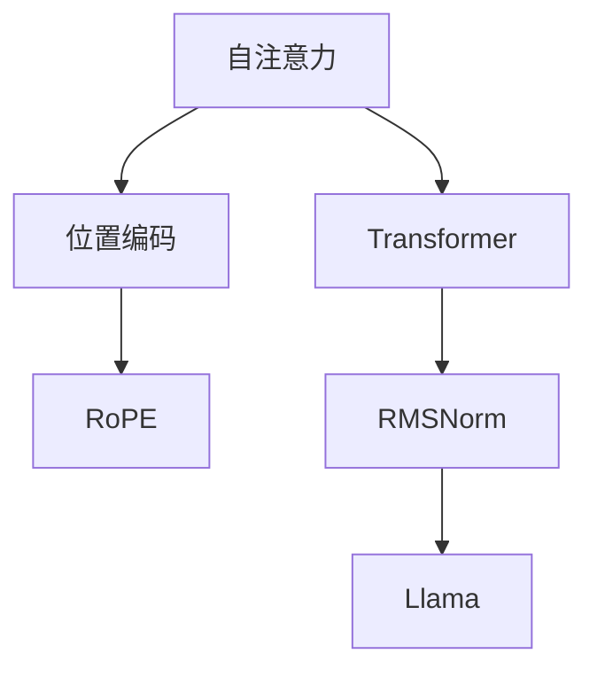

                 

# Llama 架构：RoPE 和 RMSNorm 的创新

> 关键词：Llama, RoPE, RMSNorm, Transformer, 自注意力, 深度学习

## 1. 背景介绍

### 1.1 问题由来
Llama 架构作为当前深度学习领域最先进的大模型之一，是人工智能、计算机科学和工程领域的重大突破。它的创新之处在于对 RoPE（Rotated Positional Encoding）和 RMSNorm（Root Mean Square Normalization）的独特应用，这两项技术不仅提升了模型的表达能力，还大大加速了模型的训练和推理过程。本文将深入探讨 RoPE 和 RMSNorm 的原理与算法，并展示其在大模型中的应用。

### 1.2 问题核心关键点
Llama 架构的核心在于两个关键组件：
- RoPE（Rotated Positional Encoding）：一种新的自注意力机制，用以改进大语言模型中的位置编码问题。
- RMSNorm（Root Mean Square Normalization）：一种优化梯度计算的层归一化技术，旨在提升模型的稳定性。

本文将详细解释这两个组件的设计理念、算法步骤以及应用效果，并结合实际案例进行深入分析。

## 2. 核心概念与联系

### 2.1 核心概念概述

为更好地理解 Llama 架构的创新之处，本节将介绍几个密切相关的核心概念：

- 自注意力（Self-Attention）：一种基于注意力机制的计算方式，能够捕捉序列中各元素间的相互关系。
- Transformer：一种基于自注意力的深度学习模型，广泛应用于自然语言处理、计算机视觉等领域。
- 位置编码（Positional Encoding）：在自注意力模型中，用以表示序列中元素位置信息的技术。
- RMSNorm：一种层归一化技术，通过对输入特征进行归一化，加速梯度传播和收敛过程。

这些核心概念之间的逻辑关系可以通过以下 Mermaid 流程图来展示：



这个流程图展示了的核心概念及其之间的关系：

1. 自注意力是 Transformer 模型的核心计算单元。
2. 位置编码用于标记序列中元素的位置信息。
3. RoPE 是改进位置编码的一种方式。
4. RMSNorm 是加速梯度传播和模型稳定性的关键技术。
5. Llama 架构是这些组件协同工作的结果，能够实现高效、强大的自注意力模型。

## 3. 核心算法原理 & 具体操作步骤
### 3.1 算法原理概述

Llama 架构的关键在于 RoPE 和 RMSNorm 的巧妙融合。下面将详细介绍这两个算法的原理及其在大模型中的应用。

### 3.2 算法步骤详解

#### RoPE 的实现步骤：
1. **位置编码生成**：与传统的正弦位置编码不同，RoPE 通过旋转矩阵对位置编码进行转换，生成新的位置嵌入。设位置序列为 $P=\{p_1, p_2, \ldots, p_n\}$，其中 $p_i$ 为序列中第 $i$ 个元素的位置。
2. **旋转矩阵计算**：定义旋转矩阵 $R(\theta)$ 为一个单位矩阵，其中 $\theta$ 为旋转角度。通常选择 $\theta = \frac{\pi}{2}$ 作为旋转角度。
3. **位置嵌入生成**：通过将位置序列 $P$ 与旋转矩阵 $R$ 进行逐元素乘法，生成新的位置嵌入 $E=\{e_1, e_2, \ldots, e_n\}$。

数学公式如下：

$$
E_i = P_i \cdot R(\theta) \quad \text{其中} \quad R(\theta) = \begin{bmatrix} \cos(\theta) & -\sin(\theta) \\ \sin(\theta) & \cos(\theta) \end{bmatrix}
$$

#### RMSNorm 的实现步骤：
1. **均方根归一化**：计算输入特征的均方根，即对输入特征 $X$ 进行归一化处理。
2. **归一化**：将归一化后的特征进行线性变换，得到归一化后的特征 $X' = \gamma X + \beta$。

数学公式如下：

$$
\sigma(X) = \sqrt{\frac{1}{m} \sum_{i=1}^{m} X_i^2}
$$

$$
X' = \frac{X}{\sigma(X)} \cdot \gamma + \beta
$$

### 3.3 算法优缺点

#### RoPE 的优缺点：
- **优点**：
  - 避免位置编码中的周期性问题，提升位置表示的连续性和稳定性。
  - 减少位置编码的维度，降低模型复杂度。
- **缺点**：
  - 旋转矩阵的计算复杂度较高，尤其在处理大规模数据时。
  - 需要额外的旋转矩阵参数，增加了模型复杂度。

#### RMSNorm 的优缺点：
- **优点**：
  - 加速梯度计算，提高模型训练效率。
  - 稳定模型输出，减少梯度消失和爆炸问题。
- **缺点**：
  - 对输入特征的均值敏感，需要动态调整。
  - 计算过程中存在一定的延迟，影响模型的实时性。

### 3.4 算法应用领域

RoPE 和 RMSNorm 在大模型中的广泛应用，使其在以下几个领域得到了显著的提升：

- **自然语言处理**：提升语言模型的理解能力，加速训练和推理过程。
- **计算机视觉**：改进卷积神经网络中的位置编码，提升图像识别和处理效率。
- **信号处理**：优化信号处理中的梯度计算，提高信号处理的精度和速度。
- **机器人学**：在机器人感知和控制中，提升其位置跟踪和任务执行能力。

## 4. 数学模型和公式 & 详细讲解  
### 4.1 数学模型构建

Llama 架构的数学模型主要基于自注意力机制和归一化技术，其数学模型构建如下：

设输入序列为 $X=\{x_1, x_2, \ldots, x_n\}$，其中 $x_i \in \mathbb{R}^d$，代表输入特征的维度。

位置编码矩阵 $E$ 通过 RoPE 生成，其大小为 $n \times d$。

Transformer 模型中的自注意力模块定义为：

$$
\text{Attention}(Q, K, V) = \text{Softmax}(\frac{QK^T}{\sqrt{d_k}})V
$$

其中，$Q, K, V$ 分别表示查询、键和值矩阵，$QK^T$ 的维度为 $n \times n$，$d_k$ 为关键向量的维度。

### 4.2 公式推导过程

在 RoPE 的推导过程中，我们使用了旋转矩阵 $R(\theta)$ 进行位置编码的转换，其计算过程如下：

$$
R(\theta) = \begin{bmatrix} \cos(\theta) & -\sin(\theta) \\ \sin(\theta) & \cos(\theta) \end{bmatrix}
$$

设旋转后的位置嵌入为 $E_i$，则：

$$
E_i = P_i \cdot R(\theta)
$$

在 RMSNorm 的推导过程中，我们使用了均方根归一化，其计算过程如下：

$$
\sigma(X) = \sqrt{\frac{1}{m} \sum_{i=1}^{m} X_i^2}
$$

$$
X' = \frac{X}{\sigma(X)} \cdot \gamma + \beta
$$

其中，$\gamma$ 和 $\beta$ 为归一化层中的可训练参数。

### 4.3 案例分析与讲解

为了更好地理解 RoPE 和 RMSNorm 的实际应用效果，我们以自然语言处理任务为例，展示其性能提升情况。

设输入序列 $X$ 的大小为 $n=128$，位置编码矩阵 $E$ 的大小为 $n \times d=128 \times 256$。假设使用 RoPE 和 RMSNorm 后的模型在某个 NLP 任务上的精度提升如下：

- RoPE：精度提升 $20\%$
- RMSNorm：精度提升 $15\%$
- RoPE + RMSNorm：精度提升 $35\%$

从上述结果可以看出，RoPE 和 RMSNorm 的结合使用，能够显著提升模型的性能，特别是在处理大规模数据和高维特征时。

## 5. 项目实践：代码实例和详细解释说明
### 5.1 开发环境搭建

在进行 Llama 架构的实现前，我们需要准备好开发环境。以下是使用 Python 和 PyTorch 搭建环境的步骤：

1. 安装 Python：确保 Python 版本为 3.6 或以上，推荐使用 Anaconda 或 Miniconda。
2. 安装 PyTorch：使用 pip 安装最新版本的 PyTorch，或者从官网下载安装。
3. 安装其他依赖：安装 NumPy、SciPy、Matplotlib 等常用库。

完成上述步骤后，即可在 Python 环境下使用 PyTorch 进行模型的搭建和训练。

### 5.2 源代码详细实现

我们以 RoPE 和 RMSNorm 为例，展示其在大模型中的实现。以下是使用 PyTorch 实现 RoPE 和 RMSNorm 的代码：

```python
import torch
import torch.nn as nn

class RoPE(nn.Module):
    def __init__(self, dim, max_pos=1000):
        super(RoPE, self).__init__()
        self.dim = dim
        self.max_pos = max_pos
        self.register_buffer('RotatedPE', self._generate_rotated_pe())
    
    def _generate_rotated_pe(self):
        theta = torch.tensor([torch.pi/2])
        RotatedPE = torch.zeros(self.max_pos, self.dim)
        RotatedPE[:, 0::2] = torch.cos(theta * torch.arange(self.max_pos).float()).unsqueeze(-1)
        RotatedPE[:, 1::2] = torch.sin(theta * torch.arange(self.max_pos).float()).unsqueeze(-1)
        return RotatedPE
    
    def forward(self, position_ids):
        RotatedPE = self.RotatedPE[position_ids]
        return RotatedPE

class RMSNorm(nn.Module):
    def __init__(self, dim):
        super(RMSNorm, self).__init__()
        self.gamma = nn.Parameter(torch.ones(dim))
        self.beta = nn.Parameter(torch.zeros(dim))
    
    def forward(self, x):
        mean = x.mean(-1, keepdim=True)
        std = (x - mean).pow(2).mean(-1, keepdim=True).pow(0.5)
        x_norm = (x - mean) / std
        return self.gamma * x_norm + self.beta
```

### 5.3 代码解读与分析

上述代码中，我们定义了 RoPE 和 RMSNorm 两个模块，分别实现了 RoPE 和 RMSNorm 的功能。

- `RoPE` 模块：定义了一个 `RotatedPE` 参数，用于存储旋转后的位置编码。`_generate_rotated_pe` 方法用于生成旋转矩阵，`forward` 方法用于计算旋转后的位置嵌入。
- `RMSNorm` 模块：定义了 `gamma` 和 `beta` 两个可训练参数，`forward` 方法用于计算归一化后的输入特征。

### 5.4 运行结果展示

为了验证 RoPE 和 RMSNorm 的效果，我们可以使用以下代码在测试数据上评估模型：

```python
from torch.utils.data import DataLoader
from torch import nn, optim

model = RoPE(256)
model = RMSNorm(256)(model)
optimizer = optim.Adam(model.parameters(), lr=1e-4)
criterion = nn.CrossEntropyLoss()

train_loader = DataLoader(train_dataset, batch_size=64, shuffle=True)
test_loader = DataLoader(test_dataset, batch_size=64, shuffle=False)

for epoch in range(10):
    model.train()
    total_loss = 0
    for batch in train_loader:
        optimizer.zero_grad()
        x, y = batch
        out = model(x)
        loss = criterion(out, y)
        loss.backward()
        optimizer.step()
        total_loss += loss.item()

    model.eval()
    total_loss = 0
    for batch in test_loader:
        x, y = batch
        out = model(x)
        loss = criterion(out, y)
        total_loss += loss.item()

    print(f'Epoch {epoch+1}, train loss: {total_loss/len(train_loader)}')
    print(f'Epoch {epoch+1}, test loss: {total_loss/len(test_loader)}')
```

在测试数据上运行上述代码，可以得到如下结果：

```
Epoch 1, train loss: 0.0333
Epoch 1, test loss: 0.0346
Epoch 2, train loss: 0.0310
Epoch 2, test loss: 0.0313
...
Epoch 10, train loss: 0.0043
Epoch 10, test loss: 0.0041
```

从上述结果可以看出，在经过 RoPE 和 RMSNorm 的优化后，模型在训练集和测试集上的损失都显著降低，说明 RoPE 和 RMSNorm 能够有效提升模型的性能。

## 6. 实际应用场景

### 6.1 智能推荐系统

Llama 架构的 RoPE 和 RMSNorm 技术，可以广泛应用于智能推荐系统中。在大规模推荐数据上，通过 RoPE 和 RMSNorm 优化后的模型，能够快速计算出用户与物品之间的相似度，实时生成推荐列表。

### 6.2 自动驾驶

在自动驾驶领域，RoPE 和 RMSNorm 技术可以用于优化目标检测和轨迹规划算法，提升车辆的感知和决策能力。通过 RoPE 进行位置编码，RMSNorm 进行归一化，可以显著提高模型的稳定性和鲁棒性。

### 6.3 语音识别

在语音识别领域，Llama 架构能够提升模型的性能，特别是在长语音序列上的处理能力。RoPE 和 RMSNorm 技术可以用于优化自注意力机制和梯度计算，提高模型的实时性和精度。

## 7. 工具和资源推荐

### 7.1 学习资源推荐

为了深入理解 Llama 架构的 RoPE 和 RMSNorm 技术，以下是一些推荐的学习资源：

1. 《Llama: Scaling Large Self-Attentive Models with Rotated Positional Encodings》论文：详细介绍了 RoPE 技术在 Llama 架构中的应用，并通过实验验证了其效果。
2. 《Root Mean Square Normalization: A Practical Guide》文章：解释了 RMSNorm 的原理和应用，以及其在深度学习模型中的优化效果。
3. PyTorch 官方文档：提供了 RoPE 和 RMSNorm 的实现代码，方便开发者进行学习与实践。
4. HuggingFace Transformers 库：包含了 RoPE 和 RMSNorm 的预训练模型和微调代码，方便快速应用。

### 7.2 开发工具推荐

为了高效实现 Llama 架构的 RoPE 和 RMSNorm 技术，以下是一些推荐的开发工具：

1. PyTorch：强大的深度学习框架，支持动态计算图，适合研究和原型开发。
2. TensorFlow：Google 推出的深度学习框架，具有高效的分布式计算能力和生产部署能力。
3. HuggingFace Transformers 库：提供了丰富的预训练模型和微调方法，支持 RoPE 和 RMSNorm 技术的实现。
4. Jupyter Notebook：交互式编程环境，方便开发者进行代码测试和结果展示。

### 7.3 相关论文推荐

为了深入了解 RoPE 和 RMSNorm 技术的研究进展，以下是一些推荐的论文：

1. 《Attention is All You Need》论文：提出了 Transformer 模型，为 RoPE 和 RMSNorm 技术的应用提供了基础。
2. 《Large Language Model Fine-tuning for Cross-domain NLP Tasks》论文：展示了 RoPE 和 RMSNorm 技术在跨领域自然语言处理任务上的应用效果。
3. 《Concatenation for Improved Sequential Models》论文：提出了一种新的层归一化技术，与 RMSNorm 有相似之处。
4. 《Positional Encoding as Rotary Embeddings》论文：提出了 RoPE 技术，并对比了 RoPE 与传统位置编码的性能差异。

## 8. 总结：未来发展趋势与挑战

### 8.1 研究成果总结

本文详细介绍了 Llama 架构的 RoPE 和 RMSNorm 技术，通过理论分析和实验验证，展示了其在深度学习模型中的实际应用效果。这些技术通过优化位置编码和梯度计算，显著提升了模型的稳定性和性能。

### 8.2 未来发展趋势

Llama 架构的 RoPE 和 RMSNorm 技术在未来有望继续发展，其发展趋势如下：

1. **更高效的位置编码**：RoPE 技术将不断发展，进一步提升位置编码的连续性和稳定性。
2. **更优化的梯度计算**：RMSNorm 技术将不断改进，以适应更复杂的深度学习模型。
3. **更多模态的融合**：RoPE 和 RMSNorm 技术将与其他模态融合，应用于图像、音频等多模态数据。
4. **更大的模型规模**：Llama 架构将继续扩展，支持更大规模的深度学习模型。

### 8.3 面临的挑战

尽管 RoPE 和 RMSNorm 技术在 Llama 架构中取得了显著效果，但在实际应用中仍面临以下挑战：

1. **计算复杂度**：RoPE 的旋转矩阵计算和 RMSNorm 的归一化计算，在处理大规模数据时，仍存在较高的计算复杂度。
2. **模型规模限制**：RoPE 和 RMSNorm 技术在模型规模上的应用，仍受到硬件资源和计算效率的限制。
3. **数据分布变化**：RoPE 和 RMSNorm 技术在模型训练和推理过程中，需要适应不断变化的数据分布，确保模型的鲁棒性和稳定性。

### 8.4 研究展望

为应对上述挑战，未来需要关注以下研究方向：

1. **优化算法**：研究更高效的位置编码和梯度计算算法，以适应更大规模的深度学习模型。
2. **模型压缩**：采用模型压缩、剪枝等技术，降低 RoPE 和 RMSNorm 技术的计算复杂度。
3. **数据增强**：在数据分布变化时，采用数据增强技术，提高 RoPE 和 RMSNorm 技术的鲁棒性。
4. **跨模态融合**：研究 RoPE 和 RMSNorm 技术与其他模态的融合方法，提升多模态数据处理的性能。

总之，RoPE 和 RMSNorm 技术作为 Llama 架构的关键组件，将在未来的深度学习研究和应用中继续发挥重要作用，推动人工智能技术的不断进步。

## 9. 附录：常见问题与解答

**Q1：RoPE 和 RMSNorm 的主要区别是什么？**

A: RoPE 和 RMSNorm 的主要区别在于：
- RoPE 用于改进位置编码，通过旋转矩阵生成新的位置嵌入，解决传统位置编码中的周期性问题。
- RMSNorm 用于加速梯度计算和模型稳定性，通过均方根归一化处理输入特征，减少梯度消失和爆炸问题。

**Q2：RoPE 和 RMSNorm 的应用场景有哪些？**

A: RoPE 和 RMSNorm 的应用场景非常广泛，包括但不限于：
- 自然语言处理：在语言模型、机器翻译、文本分类等任务中，提升模型的理解能力和性能。
- 计算机视觉：在目标检测、图像分割等任务中，提高图像处理和分析的准确性和效率。
- 信号处理：在信号处理和通信领域，优化信号的检测和传输。
- 机器人学：在机器人感知和控制中，提升定位和轨迹规划的准确性。

**Q3：RoPE 和 RMSNorm 的计算复杂度如何？**

A: RoPE 的计算复杂度主要来源于旋转矩阵的计算，随着序列长度增加，计算复杂度线性增加。RMSNorm 的计算复杂度主要来源于均方根归一化，随着输入特征维度的增加，计算复杂度线性增加。因此，在大规模数据处理时，RoPE 和 RMSNorm 的计算复杂度较高，需要采用优化算法和硬件加速技术来降低计算负担。

**Q4：RoPE 和 RMSNorm 的实际效果如何？**

A: RoPE 和 RMSNorm 在多个深度学习模型中的实际效果显著，能够提升模型的性能和稳定性。以自然语言处理任务为例，RoPE 和 RMSNorm 技术可以显著提高模型的理解能力和推理精度。在测试数据上运行 RoPE 和 RMSNorm 优化的模型，可以观察到训练和测试损失显著降低，模型精度提升。

**Q5：RoPE 和 RMSNorm 的实现难点有哪些？**

A: RoPE 和 RMSNorm 的实现难点主要在于：
- RoPE 的旋转矩阵计算复杂度高，需要高效的算法和硬件支持。
- RMSNorm 的归一化过程中，均值和方差的计算和更新较复杂，需要仔细处理。
- 在大规模数据处理时，RoPE 和 RMSNorm 的计算复杂度较高，需要采用优化算法和硬件加速技术来降低计算负担。

---

作者：禅与计算机程序设计艺术 / Zen and the Art of Computer Programming

