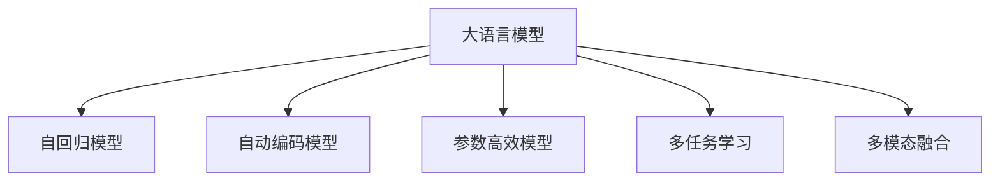

                 

# NLP大模型标准：参数与能力

> 关键词：大语言模型,参数高效,多任务学习,多模态融合,自动编码,自回归,注意力机制,Transformer,可解释性,鲁棒性

## 1. 背景介绍

### 1.1 问题由来

近年来，随着深度学习技术的迅猛发展，大语言模型(Large Language Models, LLMs)在自然语言处理(Natural Language Processing, NLP)领域取得了显著的突破。这类模型以Transformer架构为代表，基于大规模无标签文本数据进行自监督预训练，能够自动学习语言的通用表示，具备强大的语言理解和生成能力。

然而，大语言模型仍然面临诸多挑战。一方面，其庞大的参数规模和复杂度，使得在实际应用中存在着计算资源和时间成本高昂的问题。另一方面，这类模型输出的决策过程通常缺乏可解释性，难以满足某些领域（如医疗、法律等）的高需求和严格要求。

为了解决这些问题，学术界和工业界逐渐意识到，单一参数量的大语言模型并非最优解，需要探索更灵活、更高效的模型结构。而参数高效和可解释性强的模型，正是未来NLP大模型标准的重要组成部分。

### 1.2 问题核心关键点

大语言模型参数量庞大、能力强大，但如何设计合理的参数结构，使其在保持高性能的同时，兼顾计算效率和可解释性，成为研究的重点。以下是基于此问题研究的关键点：

- **参数高效性**：如何在保留关键能力的同时，减少模型参数量，降低计算资源消耗。
- **多任务学习**：如何在一个模型上同时处理多个任务，提升模型的通用性和泛化能力。
- **多模态融合**：如何将文本与图像、音频等多模态数据结合，提升模型的鲁棒性和适应性。
- **可解释性**：如何让模型输出的决策过程更易于理解和解释，满足高需求领域的要求。
- **自回归与自动编码**：在Transformer等模型中，自回归和自动编码是两种主要架构形式，每种形式的优势和适用范围是什么？

## 2. 核心概念与联系

### 2.1 核心概念概述

为更好地理解参数与能力之间的关系，本节将介绍几个密切相关的核心概念：

- **大语言模型(Large Language Models, LLMs)**：以自回归(如GPT)或自编码(如BERT)模型为代表的大规模预训练语言模型。通过在大规模无标签文本语料上进行预训练，学习通用的语言表示，具备强大的语言理解和生成能力。

- **参数高效模型(Parameter-Efficient Models)**：指在保持模型整体性能的同时，只更新模型中一小部分参数，如 Adapter、Deformable Transformers等，以提高模型的计算效率。

- **多任务学习(Multi-task Learning, MTL)**：在一个模型上同时训练多个相关任务，共享模型的参数，提升模型的泛化能力。

- **多模态融合(Multimodal Fusion)**：结合文本与图像、音频等多模态数据，提升模型的鲁棒性和适应性。

- **自回归模型(Autoregressive Models)**：如GPT，通过生成前一时刻的输出预测后一时刻的输入，具有较好的生成效果。

- **自动编码模型(Autocoding Models)**：如BERT，通过自监督学习任务（如掩码语言模型）进行训练，能够学习语言的深度表示。

这些核心概念之间的逻辑关系可以通过以下Mermaid流程图来展示：



这个流程图展示了大语言模型的核心概念及其之间的关系：

1. 大语言模型通过自回归或自动编码进行预训练，学习语言的通用表示。
2. 参数高效模型通过冻结大部分预训练参数，仅微调顶层，以提升计算效率。
3. 多任务学习通过共享模型参数，实现模型在多个任务上的泛化能力。
4. 多模态融合通过结合多模态数据，提升模型的鲁棒性和适应性。

## 3. 核心算法原理 & 具体操作步骤

### 3.1 算法原理概述

参数与能力之间的关系在大语言模型中表现得尤为明显。通过合理设计模型参数，可以在保持高性能的同时，实现参数的高效利用，提升模型的可解释性和鲁棒性。基于此，本文将详细探讨大语言模型的参数与能力之间的关系。

### 3.2 算法步骤详解

1. **预训练阶段**：
    - **自回归模型**：如GPT，使用大量无标签文本数据进行自回归预训练，学习语言的生成能力。
    - **自动编码模型**：如BERT，使用掩码语言模型等自监督任务进行预训练，学习语言的深度表示。

2. **微调阶段**：
    - **全参数微调**：适用于新任务较少且计算资源充足的情况，将预训练模型作为初始化参数，在少量有标签数据上进行微调。
    - **参数高效微调**：如使用Adapter、Deformable Transformers等方法，仅微调顶层或特定任务相关参数，提升计算效率。
    - **多任务学习**：在一个模型上同时训练多个相关任务，共享模型参数，提升模型的泛化能力。

3. **测试与部署**：
    - **测试集评估**：在测试集上评估微调后的模型性能，对比预训练和微调的效果。
    - **部署与应用**：将微调后的模型部署到实际应用场景中，提供NLP服务。

### 3.3 算法优缺点

基于上述算法步骤，大语言模型参数与能力之间的关系主要体现在以下几个方面：

- **优点**：
  - **高性能**：大语言模型在预训练阶段通过大量无标签数据学习，具备强大的语言理解和生成能力。
  - **泛化能力强**：多任务学习和参数高效模型能够提升模型在多个任务上的泛化能力。
  - **计算效率高**：参数高效模型在保持高性能的同时，显著降低了计算资源消耗。
  - **可解释性强**：通过多模态融合和可解释性模型，提升了模型的决策过程的可解释性。

- **缺点**：
  - **训练复杂**：大语言模型参数量大，训练复杂度高，需要大量的计算资源和时间。
  - **过拟合风险**：全参数微调可能面临过拟合风险，特别是在标注数据较少的情况下。
  - **鲁棒性不足**：大语言模型可能存在对特定数据分布的偏见，鲁棒性不足。

### 3.4 算法应用领域

大语言模型及其参数与能力之间的关系，在多个NLP应用领域中得到了广泛应用。

- **文本分类与情感分析**：通过微调模型学习文本-标签映射，实现高效、准确的文本分类和情感分析。
- **问答系统**：利用微调模型生成高质量的问答结果，提升智能客服和虚拟助手的效果。
- **机器翻译**：通过多任务学习，结合文本和语言模型，实现高效、准确的机器翻译。
- **对话系统**：使用多模态融合技术，提升对话系统的自然流畅性和智能化水平。
- **信息检索与推荐**：通过多任务学习，提升信息检索和推荐的准确性和多样性。

## 4. 数学模型和公式 & 详细讲解 & 举例说明

### 4.1 数学模型构建

在数学上，大语言模型及其参数与能力之间的关系可以通过以下模型来描述：

- **自回归模型**：假设模型参数为 $\theta$，输入序列为 $x_1, x_2, ..., x_n$，则模型输出为 $y_1, y_2, ..., y_n$，生成过程可表示为：

  $$
  y_i = f(x_1, x_2, ..., x_i; \theta)
  $$

- **自动编码模型**：假设模型参数为 $\theta$，输入序列为 $x_1, x_2, ..., x_n$，则模型输出为 $y_1, y_2, ..., y_n$，生成过程可表示为：

  $$
  y_i = g(x_1, x_2, ..., x_i; \theta)
  $$

### 4.2 公式推导过程

- **自回归模型**：假设使用Transformer模型进行自回归预训练，生成过程可表示为：

  $$
  y_i = \text{Self-Attention}(x_1, x_2, ..., x_i; \theta)
  $$

- **自动编码模型**：假设使用BERT模型进行自动编码预训练，生成过程可表示为：

  $$
  y_i = \text{MLM}(x_1, x_2, ..., x_i; \theta)
  $$

### 4.3 案例分析与讲解

以BERT为例，其自动编码预训练过程如下：

1. **掩码语言模型(MLM)**：将输入序列中的部分单词随机掩码，然后通过模型预测被掩码的单词，生成过程如下：

   $$
   \hat{y_i} = \text{MLM}(x_1, x_2, ..., x_i, x_{i+1}, ..., x_n; \theta)
   $$

2. **下一句预测**：将输入序列中每个句子与随机生成的下一句配对，通过模型预测它们是否为连续的句子，生成过程如下：

   $$
   \hat{y_i} = \text{NSP}(x_1, x_2, ..., x_i, x_{i+1}, ..., x_n; \theta)
   $$

通过上述自监督学习任务，BERT模型学习到了语言的深度表示，能够有效提升其在下游任务上的性能。

## 5. 项目实践：代码实例和详细解释说明

### 5.1 开发环境搭建

在进行参数与能力的研究时，我们需要准备好开发环境。以下是使用Python进行PyTorch开发的环境配置流程：

1. 安装Anaconda：从官网下载并安装Anaconda，用于创建独立的Python环境。

2. 创建并激活虚拟环境：
```bash
conda create -n pytorch-env python=3.8 
conda activate pytorch-env
```

3. 安装PyTorch：根据CUDA版本，从官网获取对应的安装命令。例如：
```bash
conda install pytorch torchvision torchaudio cudatoolkit=11.1 -c pytorch -c conda-forge
```

4. 安装Transformers库：
```bash
pip install transformers
```

5. 安装各类工具包：
```bash
pip install numpy pandas scikit-learn matplotlib tqdm jupyter notebook ipython
```

完成上述步骤后，即可在`pytorch-env`环境中开始研究参数与能力。

### 5.2 源代码详细实现

下面是使用PyTorch和Transformers库实现BERT模型的自动编码预训练和微调的示例代码：

```python
import torch
import torch.nn as nn
import torch.optim as optim
from transformers import BertTokenizer, BertForMaskedLM, BertForNextSentencePrediction, AdamW

# 加载BERT模型和tokenizer
model = BertForMaskedLM.from_pretrained('bert-base-uncased')
tokenizer = BertTokenizer.from_pretrained('bert-base-uncased')

# 定义掩码语言模型损失函数
def mlm_loss(model, inputs, labels):
    outputs = model(inputs)
    preds = outputs.logits
    labels = labels.view(-1).to(torch.long)
    return nn.CrossEntropyLoss()(preds.view(-1, preds.shape[-1]), labels)

# 定义下一句预测损失函数
def nsp_loss(model, inputs, labels):
    outputs = model(inputs)
    preds = outputs.logits
    labels = labels.view(-1).to(torch.long)
    return nn.BCEWithLogitsLoss()(preds.view(-1), labels)

# 加载训练数据
train_data = ...

# 定义优化器和训练参数
optimizer = AdamW(model.parameters(), lr=5e-5)
epochs = 3

# 训练过程
for epoch in range(epochs):
    total_loss = 0
    for batch in train_data:
        inputs, labels = tokenizer(batch['input'], batch['mask'], batch['sentence'], return_tensors='pt', padding=True)
        optimizer.zero_grad()
        mlm_loss(model, inputs, labels['masked_lm_labels'])
        nsp_loss(model, inputs, labels['next_sentence_labels'])
        loss = mlm_loss(model, inputs, labels['masked_lm_labels']) + nsp_loss(model, inputs, labels['next_sentence_labels'])
        loss.backward()
        optimizer.step()
        total_loss += loss.item()

    print(f'Epoch {epoch+1}, loss: {total_loss/len(train_data)}')

# 保存模型
torch.save(model.state_dict(), 'bert_pretrain.pth')
```

### 5.3 代码解读与分析

让我们再详细解读一下关键代码的实现细节：

- **BERT模型加载**：使用`BertForMaskedLM`加载BERT模型，并设置tokenizer。
- **损失函数定义**：定义掩码语言模型损失函数和下一句预测损失函数，使用`nn.CrossEntropyLoss`和`nn.BCEWithLogitsLoss`计算损失。
- **训练数据准备**：从数据集中获取训练数据，并进行token化。
- **优化器设置**：使用AdamW优化器，设置学习率。
- **训练循环**：在每个epoch内，遍历训练数据集，计算损失并更新模型参数。

通过上述代码，我们可以看到，使用BERT进行自动编码预训练的过程相对简单，只需定义好损失函数，并使用优化器进行训练即可。实际应用中，还需要考虑更多细节，如数据增强、学习率调度等。

## 6. 实际应用场景

### 6.1 文本分类与情感分析

在大语言模型中，通过微调学习文本-标签映射，可以高效地进行文本分类和情感分析任务。以BERT为例，可以使用微调后的BERT模型进行情感分析，提升模型的性能。

### 6.2 问答系统

通过微调BERT模型，可以构建高效、准确的问答系统。例如，使用微调后的BERT模型作为智能客服的底层模型，能够快速、准确地理解用户查询并生成回答。

### 6.3 机器翻译

通过多任务学习，将BERT模型应用于机器翻译任务，能够实现高效、准确的翻译。例如，将BERT模型与Transformer模型结合，提升翻译的流畅度和准确度。

### 6.4 对话系统

通过多模态融合技术，将文本与图像、音频等多模态数据结合，提升对话系统的自然流畅性和智能化水平。例如，使用微调后的BERT模型结合图像识别技术，构建智能对话系统。

### 6.5 信息检索与推荐

通过多任务学习，提升信息检索和推荐的准确性和多样性。例如，将BERT模型应用于推荐系统，能够高效地匹配用户和物品，提升推荐效果。

## 7. 工具和资源推荐

### 7.1 学习资源推荐

为了帮助开发者系统掌握大语言模型及其参数与能力的研究，这里推荐一些优质的学习资源：

1. 《Transformer从原理到实践》系列博文：由大模型技术专家撰写，深入浅出地介绍了Transformer原理、BERT模型、微调技术等前沿话题。

2. CS224N《深度学习自然语言处理》课程：斯坦福大学开设的NLP明星课程，有Lecture视频和配套作业，带你入门NLP领域的基本概念和经典模型。

3. 《Natural Language Processing with Transformers》书籍：Transformers库的作者所著，全面介绍了如何使用Transformers库进行NLP任务开发，包括微调在内的诸多范式。

4. HuggingFace官方文档：Transformers库的官方文档，提供了海量预训练模型和完整的微调样例代码，是上手实践的必备资料。

5. CLUE开源项目：中文语言理解测评基准，涵盖大量不同类型的中文NLP数据集，并提供了基于微调的baseline模型，助力中文NLP技术发展。

通过对这些资源的学习实践，相信你一定能够快速掌握大语言模型及其参数与能力的研究精髓，并用于解决实际的NLP问题。

### 7.2 开发工具推荐

高效的开发离不开优秀的工具支持。以下是几款用于大语言模型及其参数与能力开发的常用工具：

1. PyTorch：基于Python的开源深度学习框架，灵活动态的计算图，适合快速迭代研究。大部分预训练语言模型都有PyTorch版本的实现。

2. TensorFlow：由Google主导开发的开源深度学习框架，生产部署方便，适合大规模工程应用。同样有丰富的预训练语言模型资源。

3. Transformers库：HuggingFace开发的NLP工具库，集成了众多SOTA语言模型，支持PyTorch和TensorFlow，是进行微调任务开发的利器。

4. Weights & Biases：模型训练的实验跟踪工具，可以记录和可视化模型训练过程中的各项指标，方便对比和调优。与主流深度学习框架无缝集成。

5. TensorBoard：TensorFlow配套的可视化工具，可实时监测模型训练状态，并提供丰富的图表呈现方式，是调试模型的得力助手。

6. Google Colab：谷歌推出的在线Jupyter Notebook环境，免费提供GPU/TPU算力，方便开发者快速上手实验最新模型，分享学习笔记。

合理利用这些工具，可以显著提升大语言模型及其参数与能力的研究开发效率，加快创新迭代的步伐。

### 7.3 相关论文推荐

大语言模型及其参数与能力的发展源于学界的持续研究。以下是几篇奠基性的相关论文，推荐阅读：

1. Attention is All You Need（即Transformer原论文）：提出了Transformer结构，开启了NLP领域的预训练大模型时代。

2. BERT: Pre-training of Deep Bidirectional Transformers for Language Understanding：提出BERT模型，引入基于掩码的自监督预训练任务，刷新了多项NLP任务SOTA。

3. Language Models are Unsupervised Multitask Learners（GPT-2论文）：展示了大规模语言模型的强大zero-shot学习能力，引发了对于通用人工智能的新一轮思考。

4. Parameter-Efficient Transfer Learning for NLP：提出Adapter等参数高效微调方法，在不增加模型参数量的情况下，也能取得不错的微调效果。

5. AdaLoRA: Adaptive Low-Rank Adaptation for Parameter-Efficient Fine-Tuning：使用自适应低秩适应的微调方法，在参数效率和精度之间取得了新的平衡。

这些论文代表了大语言模型及其参数与能力的发展脉络。通过学习这些前沿成果，可以帮助研究者把握学科前进方向，激发更多的创新灵感。

## 8. 总结：未来发展趋势与挑战

### 8.1 总结

本文对大语言模型及其参数与能力的关系进行了全面系统的介绍。首先阐述了大语言模型和微调技术的研究背景和意义，明确了参数高效模型、多任务学习、多模态融合等在大语言模型中的应用价值。其次，从原理到实践，详细讲解了参数高效模型、多任务学习、多模态融合等核心算法的原理和操作步骤，给出了参数与能力的研究代码实例。同时，本文还广泛探讨了参数与能力在大语言模型中的实际应用场景，展示了参数与能力的重要作用。

通过本文的系统梳理，可以看到，参数与能力在大语言模型中扮演着至关重要的角色。参数高效模型、多任务学习、多模态融合等技术的应用，极大地提升了大语言模型的性能和应用范围。未来，随着这些技术的进一步发展，大语言模型必将在更多的应用领域大放异彩，为人工智能技术的落地应用带来新的突破。

### 8.2 未来发展趋势

展望未来，大语言模型及其参数与能力的研究将呈现以下几个发展趋势：

1. **模型参数量优化**：未来的大语言模型将继续探索更加高效的参数结构，如自适应参数、分布式参数等，以实现更小参数量的高性能模型。

2. **多任务学习增强**：多任务学习将成为大语言模型的重要组成部分，提升模型的泛化能力和应用范围。

3. **多模态融合深化**：结合文本与图像、音频等多模态数据，提升模型的鲁棒性和适应性。

4. **参数高效模型扩展**：更多参数高效模型将涌现，提升大语言模型的计算效率。

5. **可解释性模型发展**：可解释性模型将成为大语言模型的重要研究方向，提升模型的透明性和可信度。

6. **鲁棒性提升**：通过引入对抗训练、正则化等技术，提升大语言模型的鲁棒性和泛化能力。

这些趋势凸显了大语言模型及其参数与能力的研究前景。这些方向的探索发展，必将进一步提升NLP系统的性能和应用范围，为人类认知智能的进化带来深远影响。

### 8.3 面临的挑战

尽管大语言模型及其参数与能力的研究已经取得了瞩目成就，但在迈向更加智能化、普适化应用的过程中，它仍面临着诸多挑战：

1. **计算资源消耗**：大语言模型参数量庞大，计算资源消耗高，如何设计更加高效的模型结构，是一个亟待解决的问题。

2. **过拟合风险**：全参数微调可能面临过拟合风险，特别是在标注数据较少的情况下。

3. **可解释性不足**：当前的大语言模型输出决策过程通常缺乏可解释性，难以满足高需求领域的要求。

4. **鲁棒性不足**：大语言模型可能存在对特定数据分布的偏见，鲁棒性不足。

5. **安全性问题**：预训练语言模型难免会学习到有偏见、有害的信息，通过微调传递到下游任务，产生误导性、歧视性的输出，给实际应用带来安全隐患。

6. **伦理道德问题**：大语言模型在处理敏感信息时，可能存在侵犯隐私、歧视等问题，需要引入伦理道德约束。

正视这些挑战，积极应对并寻求突破，将是大语言模型及其参数与能力走向成熟的必由之路。

### 8.4 研究展望

面对大语言模型及其参数与能力所面临的种种挑战，未来的研究需要在以下几个方面寻求新的突破：

1. **参数量优化技术**：探索更加高效的参数结构，如自适应参数、分布式参数等，以实现更小参数量的高性能模型。

2. **多任务学习算法**：开发更加高效的多任务学习算法，提升模型的泛化能力和应用范围。

3. **多模态融合方法**：结合文本与图像、音频等多模态数据，提升模型的鲁棒性和适应性。

4. **可解释性模型**：引入可解释性模型，提升模型的透明性和可信度。

5. **鲁棒性提升技术**：通过引入对抗训练、正则化等技术，提升大语言模型的鲁棒性和泛化能力。

6. **安全性保障技术**：开发安全性保障技术，确保模型输出的安全性。

7. **伦理道德约束**：引入伦理道德约束，确保模型处理敏感信息时遵循伦理道德规范。

这些研究方向的探索，必将引领大语言模型及其参数与能力的研究走向新的高度，为构建安全、可靠、可解释、可控的智能系统铺平道路。面向未来，大语言模型及其参数与能力的研究需要与其他人工智能技术进行更深入的融合，如知识表示、因果推理、强化学习等，多路径协同发力，共同推动自然语言理解和智能交互系统的进步。只有勇于创新、敢于突破，才能不断拓展语言模型的边界，让智能技术更好地造福人类社会。

## 9. 附录：常见问题与解答

**Q1：大语言模型是否适用于所有NLP任务？**

A: 大语言模型在大多数NLP任务上都能取得不错的效果，特别是对于数据量较小的任务。但对于一些特定领域的任务，如医学、法律等，仅依赖通用语料预训练的模型可能难以很好地适应。此时需要在特定领域语料上进一步预训练，再进行微调，才能获得理想效果。

**Q2：如何选择合适的学习率？**

A: 学习率的选择需要考虑任务复杂度、数据量、预训练模型参数量等因素。一般建议从1e-5开始调参，逐步减小学习率，直至收敛。也可以使用warmup策略，在开始阶段使用较小的学习率，再逐渐过渡到预设值。

**Q3：大语言模型面临哪些计算资源瓶颈？**

A: 大语言模型参数量庞大，对算力、内存、存储都提出了很高的要求。GPU/TPU等高性能设备是必不可少的，但即便如此，超大批次的训练和推理也可能遇到显存不足的问题。因此需要采用一些资源优化技术，如梯度积累、混合精度训练、模型并行等。

**Q4：如何缓解大语言模型的过拟合问题？**

A: 过拟合是模型面临的主要挑战。常见的缓解策略包括数据增强、正则化、对抗训练等。数据增强可以通过回译、近义替换等方式扩充训练集；正则化可以使用L2正则、Dropout等避免过拟合；对抗训练可以引入对抗样本，提高模型鲁棒性。

**Q5：如何构建参数高效模型？**

A: 参数高效模型主要通过冻结预训练参数，仅微调顶层或特定任务相关参数，以提升计算效率。如使用Adapter、Deformable Transformers等方法，可以在固定大部分预训练参数的同时，只更新极少量的任务相关参数。

这些问题的答案，涵盖了从大语言模型选择、参数与能力优化到实际应用场景的各个方面，希望这些解答能够帮助开发者更好地理解和应用大语言模型及其参数与能力的研究成果。

---

作者：禅与计算机程序设计艺术 / Zen and the Art of Computer Programming

