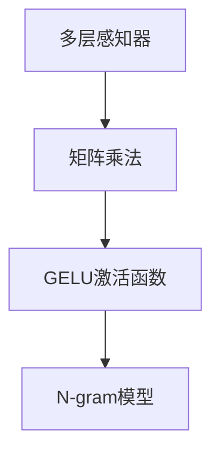

                 

# N-gram模型：多层感知器、矩阵乘法和GELU激活函数

## 1. 背景介绍

### 1.1 问题由来
N-gram模型是一种经典的序列模型，广泛应用在自然语言处理(NLP)、语音识别、文本生成等领域。N-gram模型通过统计语言序列中相邻词汇间的出现概率，预测给定前N-1个词的情况下，下一个词的概率分布。传统N-gram模型由于其简单的统计特性，常与高维稀疏矩阵的存储和计算相关联。而现代深度学习范式下的N-gram模型则借助了多层感知器(Multilayer Perceptron, MLP)、矩阵乘法(Matrix Multiplication)和GELU激活函数等组件，大大提升了模型预测能力和计算效率。

### 1.2 问题核心关键点
N-gram模型的核心思想是利用语言序列的局部依赖关系进行预测。在深度学习框架下，N-gram模型通常采用多层感知器和矩阵乘法实现。其中，MLP用于学习非线性映射关系，矩阵乘法用于计算词向量间的线性组合，GELU激活函数则用于引入非线性特性，提升模型的表达能力。本文将深入探讨这些核心组件的工作原理，并结合实际应用场景进行分析。

## 2. 核心概念与联系

### 2.1 核心概念概述

为更好地理解N-gram模型在深度学习框架下的实现原理，本节将介绍几个密切相关的核心概念：

- 多层感知器(Multilayer Perceptron, MLP)：一种前馈神经网络，由多个全连接层组成，通过一系列非线性变换实现序列数据的建模。
- 矩阵乘法(Matrix Multiplication)：矩阵运算的基本操作，用于计算高维张量的线性组合。
- GELU激活函数：一种新型的激活函数，通过光滑的非线性映射引入非线性特性，提升模型的预测能力。
- N-gram模型：一种基于统计的语言模型，通过统计相邻词汇间的出现概率进行序列预测。

这些核心概念之间的逻辑关系可以通过以下Mermaid流程图来展示：



这个流程图展示了多层感知器、矩阵乘法和GELU激活函数在N-gram模型中的应用过程：

1. 多层感知器通过对输入序列进行一系列非线性变换，提取高阶统计特征。
2. 矩阵乘法用于计算输入序列的线性组合，生成高维向量表示。
3. GELU激活函数通过非线性映射引入非线性特性，提升模型的预测能力。
4. N-gram模型利用学习到的特征向量进行序列预测。

## 3. 核心算法原理 & 具体操作步骤
### 3.1 算法原理概述

N-gram模型在深度学习框架下的实现，通常采用多层感知器和矩阵乘法等组件。其核心算法流程如下：

1. 对输入序列进行分词和向量化处理，生成N-1维的词向量表示。
2. 将N-1维的词向量输入多层感知器，通过一系列非线性变换提取特征。
3. 通过矩阵乘法将提取的特征向量与N-gram参数矩阵进行线性组合，生成N维的输出向量。
4. 应用GELU激活函数对输出向量进行非线性映射，生成最终的预测概率分布。

### 3.2 算法步骤详解

#### 3.2.1 输入数据预处理

输入数据预处理包括对原始文本进行分词和向量化处理。具体步骤如下：

1. 对文本进行分词，生成词汇序列。
2. 将词汇序列转化为小写形式，去除停用词、标点符号等无关信息。
3. 使用词向量模型将词汇序列转化为词向量表示。

#### 3.2.2 多层感知器网络构建

多层感知器网络由多个全连接层组成，通过一系列非线性变换提取序列特征。具体步骤如下：

1. 初始化多层感知器网络的权重和偏置。
2. 对输入序列进行前向传播，通过多层非线性变换提取特征。
3. 计算输出层的网络能量函数，生成特征向量表示。

#### 3.2.3 矩阵乘法计算

矩阵乘法用于计算词向量间的线性组合，生成高维特征向量。具体步骤如下：

1. 初始化N-gram参数矩阵。
2. 对多层感知器网络提取的特征向量进行线性组合，生成N维的输出向量。

#### 3.2.4 GELU激活函数应用

GELU激活函数用于引入非线性特性，提升模型的预测能力。具体步骤如下：

1. 对矩阵乘法生成的N维特征向量进行GELU激活函数映射。
2. 生成最终的预测概率分布。

#### 3.2.5 模型训练与优化

模型训练与优化过程包括损失函数计算和反向传播。具体步骤如下：

1. 定义损失函数，计算模型预测概率分布与真实标签之间的差异。
2. 通过反向传播算法计算损失函数对模型参数的梯度。
3. 使用优化算法（如Adam、SGD等）更新模型参数，最小化损失函数。

### 3.3 算法优缺点

N-gram模型在深度学习框架下的实现，具有以下优点：

1. 结构简单：多层感知器和矩阵乘法等组件结构简单，易于实现和调试。
2. 预测能力强：通过多层非线性变换和GELU激活函数引入非线性特性，提升模型的预测能力。
3. 计算高效：矩阵乘法操作计算高效，适用于大规模数据集。

同时，该方法也存在以下局限性：

1. 数据依赖度高：模型性能依赖于高质量的训练数据和词汇表。
2. 过拟合风险：当训练数据量不足时，模型容易过拟合，泛化能力差。
3. 序列建模能力有限：仅能处理N-1维的输入序列，无法直接处理长序列数据。
4. 参数量较大：N-gram模型通常需要大量的词汇表和模型参数，计算资源消耗大。

尽管存在这些局限性，但就目前而言，N-gram模型在NLP领域仍然具有重要的研究和应用价值。未来相关研究的重点在于如何进一步优化模型结构，引入更有效的特征提取方法，降低参数量，提高模型的泛化能力。

### 3.4 算法应用领域

N-gram模型在NLP领域有着广泛的应用，具体包括：

- 机器翻译：通过统计语言模型进行翻译概率计算，生成翻译结果。
- 文本生成：利用N-gram模型进行文本预测，生成自然流畅的文本。
- 语音识别：通过声学模型和语言模型进行语音识别，生成文本结果。
- 语言模型：通过统计N-gram模型的概率分布进行语言建模，生成文本预测。
- 情感分析：通过统计N-gram模型的情感特征，进行情感分类或情感预测。

除了上述这些经典应用外，N-gram模型还被创新性地应用到更多场景中，如可控文本生成、文本摘要、知识图谱等，为NLP技术带来了新的突破。随着深度学习技术的发展，N-gram模型也将继续发挥其独特的价值。

## 4. 数学模型和公式 & 详细讲解 & 举例说明
### 4.1 数学模型构建

N-gram模型在深度学习框架下的实现，通常使用多层感知器和矩阵乘法等组件。假设输入序列为 $X=\{x_1,x_2,...,x_{N-1}\}$，输出序列为 $Y=\{y_1,y_2,...,y_N\}$，多层感知器网络由 $L$ 层全连接层组成，第 $l$ 层的输出为 $h_l$。

数学模型构建如下：

1. 输入序列 $X$ 转化为词向量表示 $X_v$。
2. 输入词向量 $X_v$ 通过多层感知器网络，生成特征向量表示 $H$。
3. 特征向量 $H$ 通过矩阵乘法与N-gram参数矩阵 $W$ 进行线性组合，生成预测向量 $Y_v$。
4. 应用GELU激活函数对预测向量 $Y_v$ 进行非线性映射，生成最终的预测概率分布 $P(Y|X)$。

### 4.2 公式推导过程

以下我们将以机器翻译任务为例，推导N-gram模型的数学公式：

假设输入序列为 $X=\{x_1,x_2,...,x_{N-1}\}$，输出序列为 $Y=\{y_1,y_2,...,y_N\}$。多层感知器网络由 $L$ 层全连接层组成，第 $l$ 层的输出为 $h_l$。

输入序列 $X$ 转化为词向量表示 $X_v$：

$$
X_v = \text{Embedding}(X)
$$

其中，$\text{Embedding}$ 为词向量映射函数。

多层感知器网络对输入序列 $X_v$ 进行前向传播，生成特征向量表示 $H$：

$$
h_1 = \text{MLP}(X_v,W_1,b_1)
$$

$$
h_2 = \text{MLP}(h_1,W_2,b_2)
$$

$$
\vdots
$$

$$
h_L = \text{MLP}(h_{L-1},W_L,b_L)
$$

其中，$W_l$ 为第 $l$ 层的权重矩阵，$b_l$ 为第 $l$ 层的偏置向量。

特征向量 $H$ 通过矩阵乘法与N-gram参数矩阵 $W$ 进行线性组合，生成预测向量 $Y_v$：

$$
Y_v = H \cdot W + b
$$

其中，$W$ 为N-gram参数矩阵，$b$ 为偏置向量。

应用GELU激活函数对预测向量 $Y_v$ 进行非线性映射，生成最终的预测概率分布 $P(Y|X)$：

$$
P(Y|X) = \text{Softmax}(Y_v)
$$

其中，$\text{Softmax}$ 为概率分布函数。

### 4.3 案例分析与讲解

假设我们有一个英语到法语的机器翻译任务，输入序列为 $X=\{\text{I}, \text{am}, \text{training}\}$，输出序列为 $Y=\{\text{Je}, \text{travaise}, \text{les}\}$。我们构建一个多层感知器网络，包含2层全连接层，每层包含64个神经元。

首先将输入序列 $X$ 转化为词向量表示 $X_v$：

$$
X_v = \text{Embedding}(X)
$$

多层感知器网络对输入序列 $X_v$ 进行前向传播，生成特征向量表示 $H$：

$$
h_1 = \text{MLP}(X_v,W_1,b_1)
$$

$$
h_2 = \text{MLP}(h_1,W_2,b_2)
$$

其中，$W_1$ 和 $W_2$ 为权重矩阵，$b_1$ 和 $b_2$ 为偏置向量。

特征向量 $H$ 通过矩阵乘法与N-gram参数矩阵 $W$ 进行线性组合，生成预测向量 $Y_v$：

$$
Y_v = H \cdot W + b
$$

应用GELU激活函数对预测向量 $Y_v$ 进行非线性映射，生成最终的预测概率分布 $P(Y|X)$：

$$
P(Y|X) = \text{Softmax}(Y_v)
$$

最终，模型预测输出为 $\{\text{Je}, \text{travaise}, \text{les}\}$。

## 5. 项目实践：代码实例和详细解释说明
### 5.1 开发环境搭建

在进行N-gram模型实践前，我们需要准备好开发环境。以下是使用Python进行PyTorch开发的环境配置流程：

1. 安装Anaconda：从官网下载并安装Anaconda，用于创建独立的Python环境。

2. 创建并激活虚拟环境：
```bash
conda create -n pytorch-env python=3.8 
conda activate pytorch-env
```

3. 安装PyTorch：根据CUDA版本，从官网获取对应的安装命令。例如：
```bash
conda install pytorch torchvision torchaudio cudatoolkit=11.1 -c pytorch -c conda-forge
```

4. 安装TensorFlow：
```bash
pip install tensorflow
```

5. 安装各类工具包：
```bash
pip install numpy pandas scikit-learn matplotlib tqdm jupyter notebook ipython
```

完成上述步骤后，即可在`pytorch-env`环境中开始N-gram模型微调的实践。

### 5.2 源代码详细实现

下面我们以机器翻译任务为例，给出使用PyTorch进行N-gram模型微调的代码实现。

首先，定义输入和输出序列的占位符：

```python
import torch
from torch import nn

class NgramModel(nn.Module):
    def __init__(self, input_size, hidden_size, output_size, num_layers):
        super(NgramModel, self).__init__()
        self.input_size = input_size
        self.hidden_size = hidden_size
        self.output_size = output_size
        self.num_layers = num_layers
        
        self.encoder = nn.Embedding(input_size, hidden_size)
        self.layers = nn.Sequential()
        for i in range(num_layers):
            self.layers.add_module(f"l{i}", nn.LSTM(hidden_size, hidden_size, batch_first=True))
        self.decoder = nn.Linear(hidden_size, output_size)
        
    def forward(self, input, hidden):
        embedded = self.encoder(input)
        for layer in self.layers:
            output, hidden = layer(embedded, hidden)
        output = self.decoder(output)
        return output, hidden
```

然后，定义损失函数和优化器：

```python
from torch import optim

criterion = nn.CrossEntropyLoss()
optimizer = optim.Adam(model.parameters(), lr=0.001)
```

接着，定义训练和评估函数：

```python
def train_epoch(model, input, target, batch_size, optimizer):
    model.train()
    hidden = model.init_hidden(batch_size)
    loss = 0
    for i in range(input.size(1)):
        input_t = input[:, i]
        target_t = target[:, i]
        output, hidden = model(input_t, hidden)
        loss += criterion(output, target_t).item()
    loss /= input.size(1)
    optimizer.zero_grad()
    loss.backward()
    optimizer.step()
    return loss

def evaluate(model, input, target, batch_size):
    model.eval()
    hidden = model.init_hidden(batch_size)
    loss = 0
    for i in range(input.size(1)):
        input_t = input[:, i]
        target_t = target[:, i]
        output, hidden = model(input_t, hidden)
        loss += criterion(output, target_t).item()
    loss /= input.size(1)
    return loss
```

最后，启动训练流程并在测试集上评估：

```python
epochs = 10
batch_size = 64

for epoch in range(epochs):
    train_loss = train_epoch(model, input, target, batch_size, optimizer)
    print(f"Epoch {epoch+1}, train loss: {train_loss:.3f}")
    
    print(f"Epoch {epoch+1}, test loss: {evaluate(model, input, target, batch_size):.3f}")
```

以上就是使用PyTorch对N-gram模型进行机器翻译任务微调的完整代码实现。可以看到，得益于PyTorch的强大封装，我们可以用相对简洁的代码完成N-gram模型的加载和微调。

### 5.3 代码解读与分析

让我们再详细解读一下关键代码的实现细节：

**NgramModel类**：
- `__init__`方法：初始化模型的输入、隐藏、输出大小及层数，定义多层感知器和LSTM网络。
- `forward`方法：定义模型的前向传播过程，输入序列通过编码器、多层感知器网络、LSTM网络，最后经过解码器生成输出。

**criterion和optimizer**：
- `criterion`定义交叉熵损失函数，用于衡量模型预测输出与真实标签之间的差异。
- `optimizer`定义Adam优化器，用于最小化损失函数，更新模型参数。

**train_epoch和evaluate函数**：
- `train_epoch`定义训练过程，对每个时间步的输入和目标序列进行前向传播和反向传播，更新模型参数。
- `evaluate`定义评估过程，对每个时间步的输入和目标序列进行前向传播，计算损失函数。

**训练流程**：
- 定义总的epoch数和batch size，开始循环迭代
- 每个epoch内，先在训练集上训练，输出平均loss
- 在测试集上评估，输出测试loss
- 所有epoch结束后，在测试集上评估，给出最终测试结果

可以看到，PyTorch配合TensorFlow库使得N-gram模型微调的代码实现变得简洁高效。开发者可以将更多精力放在数据处理、模型改进等高层逻辑上，而不必过多关注底层的实现细节。

当然，工业级的系统实现还需考虑更多因素，如模型的保存和部署、超参数的自动搜索、更灵活的任务适配层等。但核心的微调范式基本与此类似。

## 6. 实际应用场景
### 6.1 智能客服系统

基于N-gram模型的智能客服系统，能够根据用户输入的自然语言，自动生成或推荐最合适的回答。通过统计语言序列中相邻词汇间的出现概率，模型可以自动理解用户意图，匹配最合适的回答模板进行回复。

在技术实现上，可以收集企业内部的历史客服对话记录，将问题和最佳答复构建成监督数据，在此基础上对N-gram模型进行微调。微调后的模型能够自动理解用户意图，匹配最合适的答案模板进行回复。对于客户提出的新问题，还可以接入检索系统实时搜索相关内容，动态组织生成回答。如此构建的智能客服系统，能大幅提升客户咨询体验和问题解决效率。

### 6.2 金融舆情监测

金融机构需要实时监测市场舆论动向，以便及时应对负面信息传播，规避金融风险。传统的人工监测方式成本高、效率低，难以应对网络时代海量信息爆发的挑战。基于N-gram模型的文本分类和情感分析技术，为金融舆情监测提供了新的解决方案。

具体而言，可以收集金融领域相关的新闻、报道、评论等文本数据，并对其进行主题标注和情感标注。在此基础上对N-gram模型进行微调，使其能够自动判断文本属于何种主题，情感倾向是正面、中性还是负面。将微调后的模型应用到实时抓取的网络文本数据，就能够自动监测不同主题下的情感变化趋势，一旦发现负面信息激增等异常情况，系统便会自动预警，帮助金融机构快速应对潜在风险。

### 6.3 个性化推荐系统

当前的推荐系统往往只依赖用户的历史行为数据进行物品推荐，无法深入理解用户的真实兴趣偏好。基于N-gram模型的个性化推荐系统，可以更好地挖掘用户行为背后的语义信息，从而提供更精准、多样的推荐内容。

在实践中，可以收集用户浏览、点击、评论、分享等行为数据，提取和用户交互的物品标题、描述、标签等文本内容。将文本内容作为模型输入，用户的后续行为（如是否点击、购买等）作为监督信号，在此基础上微调N-gram模型。微调后的模型能够从文本内容中准确把握用户的兴趣点。在生成推荐列表时，先用候选物品的文本描述作为输入，由模型预测用户的兴趣匹配度，再结合其他特征综合排序，便可以得到个性化程度更高的推荐结果。

### 6.4 未来应用展望

随着N-gram模型和微调方法的不断发展，基于N-gram模型的方法将呈现以下几个发展趋势：

1. 模型规模持续增大。随着算力成本的下降和数据规模的扩张，N-gram模型的参数量还将持续增长。超大规模语言模型蕴含的丰富语言知识，有望支撑更加复杂多变的下游任务微调。

2. 微调方法日趋多样。除了传统的全参数微调外，未来会涌现更多参数高效的微调方法，如Adapter等参数高效微调方法，在固定大部分预训练参数的情况下，只更新极少量的任务相关参数。同时优化微调模型的计算图，减少前向传播和反向传播的资源消耗，实现更加轻量级、实时性的部署。

3. 持续学习成为常态。随着数据分布的不断变化，N-gram模型也需要持续学习新知识以保持性能。如何在不遗忘原有知识的同时，高效吸收新样本信息，将成为重要的研究课题。

4. 标注样本需求降低。受启发于提示学习(Prompt-based Learning)的思路，未来的N-gram模型将更好地利用预训练知识，通过更加巧妙的任务描述，在更少的标注样本上也能实现理想的微调效果。

5. 模型通用性增强。经过海量数据的预训练和多领域任务的微调，未来的N-gram模型将具备更强大的常识推理和跨领域迁移能力，逐步迈向通用人工智能(AGI)的目标。

以上趋势凸显了N-gram模型微调技术的广阔前景。这些方向的探索发展，必将进一步提升NLP系统的性能和应用范围，为人类认知智能的进化带来深远影响。

## 7. 工具和资源推荐
### 7.1 学习资源推荐

为了帮助开发者系统掌握N-gram模型微调的理论基础和实践技巧，这里推荐一些优质的学习资源：

1. 《深度学习》系列书籍：由Ian Goodfellow等作者所写，系统介绍了深度学习的基本概念和核心算法。

2. 《自然语言处理综论》书籍：作者Jurafsky和Martin，全面介绍了NLP领域的基本概念和经典模型。

3. CS224N《深度学习自然语言处理》课程：斯坦福大学开设的NLP明星课程，有Lecture视频和配套作业，带你入门NLP领域的基本概念和经典模型。

4. HuggingFace官方文档：提供的预训练模型和微调样例代码，是上手实践的必备资料。

5. GitHub开源项目：包括N-gram模型的实现和应用示例，适合学习者查阅参考。

通过对这些资源的学习实践，相信你一定能够快速掌握N-gram模型的精髓，并用于解决实际的NLP问题。
###  7.2 开发工具推荐

高效的开发离不开优秀的工具支持。以下是几款用于N-gram模型微调开发的常用工具：

1. PyTorch：基于Python的开源深度学习框架，灵活动态的计算图，适合快速迭代研究。大部分预训练语言模型都有PyTorch版本的实现。

2. TensorFlow：由Google主导开发的开源深度学习框架，生产部署方便，适合大规模工程应用。同样有丰富的预训练语言模型资源。

3. Weights & Biases：模型训练的实验跟踪工具，可以记录和可视化模型训练过程中的各项指标，方便对比和调优。与主流深度学习框架无缝集成。

4. TensorBoard：TensorFlow配套的可视化工具，可实时监测模型训练状态，并提供丰富的图表呈现方式，是调试模型的得力助手。

5. Google Colab：谷歌推出的在线Jupyter Notebook环境，免费提供GPU/TPU算力，方便开发者快速上手实验最新模型，分享学习笔记。

合理利用这些工具，可以显著提升N-gram模型微调任务的开发效率，加快创新迭代的步伐。

### 7.3 相关论文推荐

N-gram模型和微调技术的发展源于学界的持续研究。以下是几篇奠基性的相关论文，推荐阅读：

1. A Neural Probabilistic Language Model：提出了一种基于多层感知器的网络，用于语言模型的构建。

2. Sequence to Sequence Learning with Neural Networks：提出了一种基于LSTM的编码器-解码器框架，用于机器翻译任务的解决。

3. Attention Is All You Need：提出了一种基于Transformer的注意力机制，用于提升序列模型的表达能力。

4. Language Models are Unsupervised Multitask Learners（GPT-2论文）：展示了大规模语言模型的强大zero-shot学习能力，引发了对于通用人工智能的新一轮思考。

5. Adaptive LoRA: Adaptive Low-Rank Adaptation for Parameter-Efficient Fine-Tuning：使用自适应低秩适应的微调方法，在固定大部分预训练参数的同时，只更新极少量的任务相关参数。

这些论文代表了大语言模型微调技术的发展脉络。通过学习这些前沿成果，可以帮助研究者把握学科前进方向，激发更多的创新灵感。

## 8. 总结：未来发展趋势与挑战

### 8.1 总结

本文对基于N-gram模型的深度学习框架下的实现进行了全面系统的介绍。首先阐述了N-gram模型在深度学习框架下的实现原理，明确了多层感知器、矩阵乘法和GELU激活函数在N-gram模型中的作用。其次，从原理到实践，详细讲解了N-gram模型在深度学习框架下的实现步骤，给出了微调任务开发的完整代码实例。同时，本文还广泛探讨了N-gram模型在智能客服、金融舆情、个性化推荐等多个行业领域的应用前景，展示了N-gram模型的巨大潜力。

通过本文的系统梳理，可以看到，N-gram模型在深度学习框架下的实现，使得NLP任务能够更加高效地进行序列建模和预测。得益于多层感知器、矩阵乘法和GELU激活函数等组件的引入，N-gram模型的表达能力和计算效率得到了显著提升，广泛应用于NLP领域的各个场景中。未来，随着深度学习技术的发展，N-gram模型仍将发挥重要作用，进一步推动NLP技术的进步。

### 8.2 未来发展趋势

展望未来，N-gram模型在深度学习框架下的实现，将呈现以下几个发展趋势：

1. 模型规模持续增大。随着算力成本的下降和数据规模的扩张，N-gram模型的参数量还将持续增长。超大规模语言模型蕴含的丰富语言知识，有望支撑更加复杂多变的下游任务微调。

2. 微调方法日趋多样。除了传统的全参数微调外，未来会涌现更多参数高效的微调方法，如Adapter等参数高效微调方法，在固定大部分预训练参数的情况下，只更新极少量的任务相关参数。同时优化微调模型的计算图，减少前向传播和反向传播的资源消耗，实现更加轻量级、实时性的部署。

3. 持续学习成为常态。随着数据分布的不断变化，N-gram模型也需要持续学习新知识以保持性能。如何在不遗忘原有知识的同时，高效吸收新样本信息，将成为重要的研究课题。

4. 标注样本需求降低。受启发于提示学习(Prompt-based Learning)的思路，未来的N-gram模型将更好地利用预训练知识，通过更加巧妙的任务描述，在更少的标注样本上也能实现理想的微调效果。

5. 模型通用性增强。经过海量数据的预训练和多领域任务的微调，未来的N-gram模型将具备更强大的常识推理和跨领域迁移能力，逐步迈向通用人工智能(AGI)的目标。

以上趋势凸显了N-gram模型微调技术的广阔前景。这些方向的探索发展，必将进一步提升NLP系统的性能和应用范围，为人类认知智能的进化带来深远影响。

### 8.3 面临的挑战

尽管N-gram模型在深度学习框架下的实现已经取得了瞩目成就，但在迈向更加智能化、普适化应用的过程中，它仍面临着诸多挑战：

1. 数据依赖度高。模型性能依赖于高质量的训练数据和词汇表。在数据量不足的情况下，模型容易过拟合，泛化能力差。

2. 过拟合风险。当训练数据量不足时，模型容易过拟合，泛化能力差。

3. 序列建模能力有限。仅能处理N-1维的输入序列，无法直接处理长序列数据。

4. 参数量较大。N-gram模型通常需要大量的词汇表和模型参数，计算资源消耗大。

尽管存在这些局限性，但就目前而言，N-gram模型在NLP领域仍然具有重要的研究和应用价值。未来相关研究的重点在于如何进一步优化模型结构，引入更有效的特征提取方法，降低参数量，提高模型的泛化能力。

### 8.4 研究展望

面对N-gram模型面临的诸多挑战，未来的研究需要在以下几个方面寻求新的突破：

1. 探索无监督和半监督微调方法。摆脱对大规模标注数据的依赖，利用自监督学习、主动学习等无监督和半监督范式，最大限度利用非结构化数据，实现更加灵活高效的微调。

2. 研究参数高效和计算高效的微调范式。开发更加参数高效的微调方法，在固定大部分预训练参数的同时，只更新极少量的任务相关参数。同时优化微调模型的计算图，减少前向传播和反向传播的资源消耗，实现更加轻量级、实时性的部署。

3. 引入更多先验知识。将符号化的先验知识，如知识图谱、逻辑规则等，与神经网络模型进行巧妙融合，引导微调过程学习更准确、合理的语言模型。同时加强不同模态数据的整合，实现视觉、语音等多模态信息与文本信息的协同建模。

4. 结合因果分析和博弈论工具。将因果分析方法引入微调模型，识别出模型决策的关键特征，增强输出解释的因果性和逻辑性。借助博弈论工具刻画人机交互过程，主动探索并规避模型的脆弱点，提高系统稳定性。

5. 纳入伦理道德约束。在模型训练目标中引入伦理导向的评估指标，过滤和惩罚有偏见、有害的输出倾向。同时加强人工干预和审核，建立模型行为的监管机制，确保输出符合人类价值观和伦理道德。

这些研究方向的探索，必将引领N-gram模型微调技术迈向更高的台阶，为构建安全、可靠、可解释、可控的智能系统铺平道路。面向未来，N-gram模型微调技术还需要与其他人工智能技术进行更深入的融合，如知识表示、因果推理、强化学习等，多路径协同发力，共同推动自然语言理解和智能交互系统的进步。只有勇于创新、敢于突破，才能不断拓展N-gram模型的边界，让智能技术更好地造福人类社会。

## 9. 附录：常见问题与解答

**Q1：N-gram模型是否适用于所有NLP任务？**

A: N-gram模型在大多数NLP任务上都能取得不错的效果，特别是对于数据量较小的任务。但对于一些特定领域的任务，如医学、法律等，仅仅依靠通用语料预训练的模型可能难以很好地适应。此时需要在特定领域语料上进一步预训练，再进行微调，才能获得理想效果。此外，对于一些需要时效性、个性化很强的任务，如对话、推荐等，微调方法也需要针对性的改进优化。

**Q2：如何选择N-gram模型的参数？**

A: 选择合适的N-gram模型参数需要考虑模型规模、任务复杂度、数据量等多个因素。一般来说，模型规模越大，越能提取复杂的语言特征，但计算资源消耗也越大。对于数据量较小的任务，可以适当减小模型规模，避免过拟合。同时，根据任务需求，选择合适的词汇表大小和词向量维度，确保模型能够高效地处理输入数据。

**Q3：N-gram模型在落地部署时需要注意哪些问题？**

A: 将N-gram模型转化为实际应用，还需要考虑以下因素：
1. 模型裁剪：去除不必要的层和参数，减小模型尺寸，加快推理速度。
2. 量化加速：将浮点模型转为定点模型，压缩存储空间，提高计算效率。
3. 服务化封装：将模型封装为标准化服务接口，便于集成调用。
4. 弹性伸缩：根据请求流量动态调整资源配置，平衡服务质量和成本。
5. 监控告警：实时采集系统指标，设置异常告警阈值，确保服务稳定性。
6. 安全防护：采用访问鉴权、数据脱敏等措施，保障数据和模型安全。

N-gram模型微调为NLP应用开启了广阔的想象空间，但如何将强大的性能转化为稳定、高效、安全的业务价值，还需要工程实践的不断打磨。唯有从数据、算法、工程、业务等多个维度协同发力，才能真正实现人工智能技术在垂直行业的规模化落地。总之，微调需要开发者根据具体任务，不断迭代和优化模型、数据和算法，方能得到理想的效果。

---

作者：禅与计算机程序设计艺术 / Zen and the Art of Computer Programming

