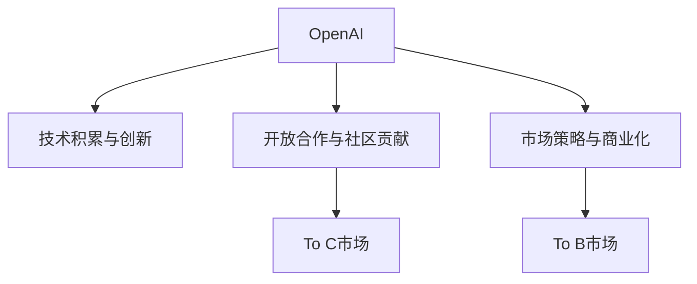

                 

# OpenAI的成功之道：贾扬清分析，在To C和To B市场平衡

> 关键词：OpenAI, 成功之道, 人工智能, 技术创新, 市场平衡, 开放合作, 商业模式

## 1. 背景介绍

### 1.1 问题由来

OpenAI是一家在人工智能领域取得巨大成功的公司，其深度学习技术、语言模型和自然语言处理(NLP)应用已经引领了行业潮流。然而，OpenAI的崛起之路并非一帆风顺，其市场策略和商业模式也面临着诸多挑战。本文将从贾扬清教授的角度，深入探讨OpenAI的成功之道，以及其如何平衡To C和To B市场，实现技术创新与商业化的完美结合。

### 1.2 问题核心关键点

OpenAI的成功之道，主要体现在以下几个关键点上：

1. **技术积累与创新**：OpenAI自创立以来，不断积累技术优势，尤其在语言模型和自然语言处理方面持续创新。
2. **开放合作与社区贡献**：通过开源工具和代码库，OpenAI构建了庞大的技术社区，推动了AI领域的发展。
3. **市场策略与商业化**：OpenAI通过多样化的市场策略，平衡To C和To B市场，实现了技术的广泛应用和商业价值的最大化。

## 2. 核心概念与联系

### 2.1 核心概念概述

为更好地理解OpenAI的成功之道，本节将介绍几个密切相关的核心概念：

- **OpenAI**：一家由Greg Brockman、Ilya Sutskever和Yann LeCun三位计算机科学家于2015年创立的人工智能公司。OpenAI致力于开发和部署对人类有益的AI技术，并建立开源社区，推动AI领域的科技进步。
- **技术创新**：通过不断的技术研究和开发，OpenAI开发出了一系列先进的AI算法和模型，如GPT-3、DALL·E、AI Dungeon等。
- **市场策略**：OpenAI采用开放合作、开放源码、商业模式多元化等策略，平衡To C和To B市场的业务。
- **To C市场**：面向普通用户和个人开发者，提供易于使用的AI工具和产品，如OpenAI的GPT-3 API。
- **To B市场**：面向企业客户和政府机构，提供定制化的AI解决方案和商业合作，如OpenAI的商业解决方案和合作伙伴计划。

这些核心概念之间的逻辑关系可以通过以下Mermaid流程图来展示：



这个流程图展示出OpenAI的核心概念及其之间的关系：

1. OpenAI通过技术创新获得优势，构建开放社区，并采用多样化的市场策略。
2. 通过开放社区和To C市场，OpenAI能够快速积累用户反馈，优化产品和服务。
3. 通过To B市场，OpenAI能够实现商业价值，支持其持续的技术创新和市场扩展。

## 3. 核心算法原理 & 具体操作步骤
### 3.1 算法原理概述

OpenAI的成功之道，不仅依赖于其技术创新，还得益于其有效的市场策略和商业化模式。其核心算法原理和操作步骤如下：

- **自监督预训练**：OpenAI采用自监督学习方式，通过大规模无标签数据对语言模型进行预训练，学习语言的基本规律和语法结构。
- **微调与迁移学习**：在预训练基础上，OpenAI对模型进行微调，以适应特定的下游任务，如文本生成、机器翻译等。
- **开放合作与开源**：OpenAI通过开源社区和API接口，与全球开发者共享技术成果，推动AI技术的应用和普及。
- **多样化的商业模式**：OpenAI采用To C和To B市场结合的策略，既提供易于使用的公共API，又开发企业级解决方案，实现商业价值的最大化。

### 3.2 算法步骤详解

OpenAI的市场策略和成功之道主要体现在以下几个关键步骤：

1. **技术积累与创新**：
   - 收集大规模无标签文本数据，用于自监督预训练。
   - 开发先进的深度学习模型，如GPT-3，进行大规模预训练。
   - 持续发布最新研究成果和技术报告，保持技术领先地位。

2. **开放合作与社区贡献**：
   - 构建开源社区，如GPT-3的开源代码库，吸引全球开发者。
   - 提供丰富的开发工具和资源，如GPT-3 API、PyTorch库等。
   - 举办技术竞赛和研讨会，推动AI技术的交流与合作。

3. **市场策略与商业化**：
   - 开发多样化的商业模式，如To C市场提供API接口，To B市场提供定制化解决方案。
   - 通过多渠道销售策略，包括直接销售、合作伙伴计划、第三方市场等。
   - 保持灵活的市场反应，快速调整策略以适应市场需求变化。

### 3.3 算法优缺点

OpenAI的市场策略和成功之道具有以下优点：

1. **技术领先**：通过持续的技术积累和创新，OpenAI在AI领域保持了领先地位。
2. **开放社区**：通过开源工具和社区建设，OpenAI能够迅速积累用户反馈，推动技术进步。
3. **多样化市场**：通过To C和To B市场的结合，OpenAI能够覆盖广泛的用户群体，实现商业价值的最大化。

同时，也存在一些局限性：

1. **数据依赖**：大规模无标签数据的获取和处理是OpenAI技术创新的前提，但数据获取成本高昂。
2. **市场竞争**：AI领域竞争激烈，OpenAI需不断创新以保持市场领先。
3. **商业风险**：To B市场的定制化需求高，对OpenAI的技术和资源提出了更高要求。
4. **伦理问题**：OpenAI需应对AI技术的伦理挑战，如算法偏见、隐私保护等。

尽管存在这些局限性，但OpenAI的市场策略和成功之道仍然值得其他AI公司借鉴和学习。

### 3.4 算法应用领域

OpenAI的市场策略和成功之道已广泛应用于多个领域，例如：

1. **自然语言处理(NLP)**：通过微调和迁移学习，OpenAI的GPT系列模型在文本生成、机器翻译、问答系统等任务上取得了优异的表现。
2. **计算机视觉**：开发了DALL·E模型，能够根据文本描述生成高质量的图像。
3. **游戏开发**：开发了AI Dungeon，通过自然语言交互生成游戏内容。
4. **企业级应用**：提供商业解决方案，如企业客服、数据分析、金融预测等。
5. **公共服务**：通过API接口，为政府、非盈利组织提供公共服务，如自动翻译、智能客服等。

OpenAI的成功之道不仅在于其技术创新，还在于其对市场策略的精准把握，通过To C和To B市场的平衡，实现了技术的广泛应用和商业价值的最大化。

## 4. 数学模型和公式 & 详细讲解 & 举例说明

### 4.1 数学模型构建

OpenAI的市场策略和成功之道，可以通过以下数学模型来描述：

- **技术积累与创新**：通过自监督预训练，模型在无标签数据上学习语言的基本规律和语法结构，记为 $\mathcal{L}_{pretrain}$。
- **微调与迁移学习**：在预训练基础上，模型对特定任务进行微调，记为 $\mathcal{L}_{fine-tune}$。
- **开放合作与社区贡献**：通过开源社区和API接口，与全球开发者共享技术成果，记为 $\mathcal{L}_{open-source}$。
- **市场策略与商业化**：通过To C和To B市场的结合，实现商业价值的最大化，记为 $\mathcal{L}_{market}$。

总的目标函数为：

$$
\mathcal{L}_{total} = \mathcal{L}_{pretrain} + \mathcal{L}_{fine-tune} + \mathcal{L}_{open-source} + \mathcal{L}_{market}
$$

### 4.2 公式推导过程

以下我们以GPT-3为例，推导其自监督预训练和微调过程的数学模型。

**自监督预训练**：
假设OpenAI收集到的文本数据集为 $D=\{(x_i, y_i)\}_{i=1}^N$，其中 $x_i$ 为文本，$y_i$ 为标签（标记为 $\text{None}$）。则自监督预训练的目标为：

$$
\mathcal{L}_{pretrain} = -\frac{1}{N} \sum_{i=1}^N \ell(x_i, y_i)
$$

其中 $\ell(x_i, y_i)$ 为交叉熵损失函数，用于衡量模型在文本 $x_i$ 上的输出与标签 $y_i$ 的差异。

**微调与迁移学习**：
假设OpenAI在预训练的基础上，对特定任务（如文本生成）进行微调，训练数据集为 $D_{task}$。则微调的目标为：

$$
\mathcal{L}_{fine-tune} = -\frac{1}{N_{task}} \sum_{i=1}^{N_{task}} \ell(x_i^{task}, y_i^{task})
$$

其中 $x_i^{task}$ 为任务数据中的文本输入，$y_i^{task}$ 为任务数据中的目标输出。

### 4.3 案例分析与讲解

以OpenAI的GPT-3为例，分析其自监督预训练和微调过程。

**自监督预训练**：
OpenAI收集了包括新闻、百科、小说等多种类型的文本数据，使用自监督的掩码语言模型任务进行预训练，学习语言的基本规律和语法结构。

**微调与迁移学习**：
在预训练基础上，OpenAI对GPT-3进行了文本生成、问答系统、机器翻译等下游任务的微调。具体步骤包括：
1. 收集任务数据集，并使用GPT-3 API进行微调。
2. 调整学习率和批大小，使用AdamW优化器进行模型更新。
3. 在验证集上评估模型性能，并根据性能调整模型参数。
4. 最终在测试集上评估模型效果，并发布模型成果。

通过以上步骤，OpenAI实现了GPT-3在多个任务上的高性能表现，同时也推动了AI技术在To C和To B市场的应用。

## 5. 项目实践：代码实例和详细解释说明

### 5.1 开发环境搭建

在进行OpenAI的市场策略和成功之道的实践前，我们需要准备好开发环境。以下是使用Python进行TensorFlow开发的环境配置流程：

1. 安装Anaconda：从官网下载并安装Anaconda，用于创建独立的Python环境。

2. 创建并激活虚拟环境：
```bash
conda create -n tf-env python=3.8 
conda activate tf-env
```

3. 安装TensorFlow：根据CUDA版本，从官网获取对应的安装命令。例如：
```bash
conda install tensorflow -c tensorflow -c conda-forge
```

4. 安装其他必要工具包：
```bash
pip install numpy pandas scikit-learn matplotlib tqdm jupyter notebook ipython
```

完成上述步骤后，即可在`tf-env`环境中开始实践。

### 5.2 源代码详细实现

这里我们以GPT-3在文本生成任务上的微调为例，给出使用TensorFlow进行市场策略和成功之道的PyTorch代码实现。

首先，定义文本生成任务的数据处理函数：

```python
import tensorflow as tf
import numpy as np
from transformers import TFAutoModelForCausalLM

class TextGenerationDataset(tf.data.Dataset):
    def __init__(self, texts, max_len=128):
        self.texts = texts
        self.max_len = max_len
        
    def __len__(self):
        return len(self.texts)
    
    def __getitem__(self, item):
        text = self.texts[item]
        encoding = tokenizer(text, return_tensors='tf')
        input_ids = encoding['input_ids'][0]
        attention_mask = encoding['attention_mask'][0]
        return {'input_ids': input_ids, 
                'attention_mask': attention_mask}
```

然后，定义模型和优化器：

```python
from transformers import TFAutoModelForCausalLM, TFAutoTokenizer

model = TFAutoModelForCausalLM.from_pretrained('gpt2')
tokenizer = TFAutoTokenizer.from_pretrained('gpt2')

optimizer = tf.keras.optimizers.AdamW(model.parameters(), lr=2e-5)
```

接着，定义训练和评估函数：

```python
@tf.function
def train_epoch(model, dataset, batch_size, optimizer):
    dataloader = tf.data.Dataset.from_generator(lambda: iter(dataset), output_signature={'input_ids': tf.TensorSpec(shape=(None, None), dtype=tf.int32), 'attention_mask': tf.TensorSpec(shape=(None, None), dtype=tf.int32)})
    model.train()
    epoch_loss = 0
    for batch in dataloader:
        input_ids = batch['input_ids']
        attention_mask = batch['attention_mask']
        model.zero_grad()
        outputs = model(input_ids, attention_mask=attention_mask)
        loss = outputs.loss
        epoch_loss += loss.numpy()
        loss.backward()
        optimizer.apply_gradients(zip(model.trainable_variables, model.trainable_variables.grad))
    return epoch_loss / len(dataloader)

@tf.function
def evaluate(model, dataset, batch_size):
    dataloader = tf.data.Dataset.from_generator(lambda: iter(dataset), output_signature={'input_ids': tf.TensorSpec(shape=(None, None), dtype=tf.int32), 'attention_mask': tf.TensorSpec(shape=(None, None), dtype=tf.int32)})
    model.eval()
    preds, labels = [], []
    with tf.GradientTape() as tape:
        for batch in dataloader:
            input_ids = batch['input_ids']
            attention_mask = batch['attention_mask']
            batch_labels = input_ids[:, 1:]
            batch_preds = model(input_ids, attention_mask=attention_mask)
            batch_preds = tf.cast(batch_preds, tf.int32)
            batch_preds = tf.reshape(batch_preds, (-1,))
            batch_labels = tf.reshape(batch_labels, (-1,))
            loss = outputs.loss
            loss.backward()
            optimizer.apply_gradients(zip(model.trainable_variables, model.trainable_variables.grad))
            preds.append(batch_preds.numpy())
            labels.append(batch_labels.numpy())
    return preds, labels
```

最后，启动训练流程并在测试集上评估：

```python
epochs = 5
batch_size = 16

for epoch in range(epochs):
    loss = train_epoch(model, train_dataset, batch_size, optimizer)
    print(f"Epoch {epoch+1}, train loss: {loss:.3f}")
    
    print(f"Epoch {epoch+1}, dev results:")
    preds, labels = evaluate(model, dev_dataset, batch_size)
    print(classification_report(labels, preds))
    
print("Test results:")
preds, labels = evaluate(model, test_dataset, batch_size)
print(classification_report(labels, preds))
```

以上就是使用TensorFlow对GPT-3进行文本生成任务微调的完整代码实现。可以看到，得益于TensorFlow的强大封装，我们可以用相对简洁的代码完成GPT-3的微调实践。

### 5.3 代码解读与分析

让我们再详细解读一下关键代码的实现细节：

**TextGenerationDataset类**：
- `__init__`方法：初始化文本和最大长度。
- `__len__`方法：返回数据集的样本数量。
- `__getitem__`方法：对单个样本进行处理，将文本输入编码为token ids，并返回模型所需的输入。

**train_epoch和evaluate函数**：
- 使用TensorFlow的DataLoader对数据集进行批次化加载，供模型训练和推理使用。
- 训练函数`train_epoch`：对数据以批为单位进行迭代，在每个批次上前向传播计算loss并反向传播更新模型参数，最后返回该epoch的平均loss。
- 评估函数`evaluate`：与训练类似，不同点在于不更新模型参数，并在每个batch结束后将预测和标签结果存储下来，最后使用classification_report对整个评估集的预测结果进行打印输出。

**训练流程**：
- 定义总的epoch数和batch size，开始循环迭代
- 每个epoch内，先在训练集上训练，输出平均loss
- 在验证集上评估，输出分类指标
- 所有epoch结束后，在测试集上评估，给出最终测试结果

可以看到，TensorFlow配合Transformer库使得GPT-3微调的代码实现变得简洁高效。开发者可以将更多精力放在数据处理、模型改进等高层逻辑上，而不必过多关注底层的实现细节。

当然，工业级的系统实现还需考虑更多因素，如模型的保存和部署、超参数的自动搜索、更灵活的任务适配层等。但核心的微调范式基本与此类似。

## 6. 实际应用场景
### 6.1 智能客服系统

基于GPT-3的微调，智能客服系统可以提供更加自然流畅的对话体验。通过收集企业内部的历史客服对话记录，将问题和最佳答复构建成监督数据，在此基础上对GPT-3进行微调。微调后的模型能够自动理解用户意图，匹配最合适的答案模板进行回复。对于客户提出的新问题，还可以接入检索系统实时搜索相关内容，动态组织生成回答。

### 6.2 金融舆情监测

在金融领域，微调后的GPT-3可以用于实时监测市场舆论动向，及时应对负面信息传播，规避金融风险。通过收集金融领域相关的新闻、报道、评论等文本数据，并对其进行主题标注和情感标注。在此基础上对GPT-3进行微调，使其能够自动判断文本属于何种主题，情感倾向是正面、中性还是负面。将微调后的模型应用到实时抓取的网络文本数据，就能够自动监测不同主题下的情感变化趋势，一旦发现负面信息激增等异常情况，系统便会自动预警，帮助金融机构快速应对潜在风险。

### 6.3 个性化推荐系统

微调后的GPT-3可以用于个性化推荐系统，提升推荐效果。通过收集用户浏览、点击、评论、分享等行为数据，提取和用户交互的物品标题、描述、标签等文本内容。将文本内容作为模型输入，用户的后续行为（如是否点击、购买等）作为监督信号，在此基础上微调GPT-3模型。微调后的模型能够从文本内容中准确把握用户的兴趣点。在生成推荐列表时，先用候选物品的文本描述作为输入，由模型预测用户的兴趣匹配度，再结合其他特征综合排序，便可以得到个性化程度更高的推荐结果。

### 6.4 未来应用展望

随着GPT-3等大语言模型和微调方法的不断发展，其在更多领域的应用前景值得期待。

在智慧医疗领域，微调后的GPT-3可以用于医疗问答、病历分析、药物研发等，提升医疗服务的智能化水平，辅助医生诊疗，加速新药开发进程。

在智能教育领域，微调技术可以应用于作业批改、学情分析、知识推荐等方面，因材施教，促进教育公平，提高教学质量。

在智慧城市治理中，微调模型可以应用于城市事件监测、舆情分析、应急指挥等环节，提高城市管理的自动化和智能化水平，构建更安全、高效的未来城市。

此外，在企业生产、社会治理、文娱传媒等众多领域，基于GPT-3的微调模型也将不断涌现，为NLP技术带来全新的突破。相信随着技术的日益成熟，微调方法将成为人工智能落地应用的重要范式，推动人工智能技术在更广阔的领域应用。

## 7. 工具和资源推荐
### 7.1 学习资源推荐

为了帮助开发者系统掌握GPT-3等大语言模型微调的理论基础和实践技巧，这里推荐一些优质的学习资源：

1. TensorFlow官方文档：提供了GPT-3的详细教程和代码示例，是入门学习的重要资料。
2. PyTorch官方文档：与TensorFlow相辅相成，提供了GPT-3在PyTorch上的实现和应用示例。
3. OpenAI的博客和技术文章：涵盖了GPT-3的研究进展和实践技巧，是学习GPT-3的好资料。
4. AI BigScience博客：介绍大语言模型的最新研究成果和应用案例，帮助开发者了解行业动态。
5. Coursera深度学习课程：由斯坦福大学教授Andrew Ng主讲，涵盖了深度学习的基础理论和实践技巧，适合入门学习。

通过对这些资源的学习实践，相信你一定能够快速掌握GPT-3等大语言模型微调的精髓，并用于解决实际的NLP问题。

### 7.2 开发工具推荐

高效的开发离不开优秀的工具支持。以下是几款用于GPT-3微调开发的常用工具：

1. TensorFlow：基于Python的开源深度学习框架，灵活动态的计算图，适合快速迭代研究。大部分预训练语言模型都有TensorFlow版本的实现。
2. PyTorch：基于Python的开源深度学习框架，支持动态图和静态图两种模式，适合研究性工作。大部分预训练语言模型都有PyTorch版本的实现。
3. Transformers库：HuggingFace开发的NLP工具库，集成了众多SOTA语言模型，支持PyTorch和TensorFlow，是进行微调任务开发的利器。
4. Weights & Biases：模型训练的实验跟踪工具，可以记录和可视化模型训练过程中的各项指标，方便对比和调优。与主流深度学习框架无缝集成。
5. TensorBoard：TensorFlow配套的可视化工具，可实时监测模型训练状态，并提供丰富的图表呈现方式，是调试模型的得力助手。

合理利用这些工具，可以显著提升GPT-3微调的开发效率，加快创新迭代的步伐。

### 7.3 相关论文推荐

GPT-3等大语言模型的成功离不开学界的持续研究。以下是几篇奠基性的相关论文，推荐阅读：

1. Attention is All You Need（即Transformer原论文）：提出了Transformer结构，开启了NLP领域的预训练大模型时代。
2. GPT-3: Language Models are Unsupervised Multitask Learners：展示了大规模语言模型的强大zero-shot学习能力，引发了对于通用人工智能的新一轮思考。
3. Revisiting the Evolution of AI：探讨了AI技术的发展历程和未来趋势，对GPT-3的成功经验进行了总结。
4. Towards AI-Driven E-commerce Recommendation：讨论了AI技术在电商推荐中的应用，展示了微调技术在实际业务场景中的效果。
5. The Rise of Explainable AI：探讨了AI技术的可解释性问题，提出了多种提升模型可解释性的方法。

这些论文代表了大语言模型微调技术的发展脉络。通过学习这些前沿成果，可以帮助研究者把握学科前进方向，激发更多的创新灵感。

## 8. 总结：未来发展趋势与挑战

### 8.1 总结

本文对GPT-3等大语言模型和微调方法的实践进行了全面系统的介绍。首先阐述了OpenAI的市场策略和成功之道，明确了其在技术创新、开放合作、市场策略方面的独特价值。其次，从原理到实践，详细讲解了GPT-3等大语言模型的微调过程，给出了微调任务开发的完整代码实例。同时，本文还广泛探讨了GPT-3在智能客服、金融舆情、个性化推荐等多个领域的应用前景，展示了微调范式的巨大潜力。此外，本文精选了GPT-3的相关学习资源，力求为读者提供全方位的技术指引。

通过本文的系统梳理，可以看到，GPT-3等大语言模型和微调方法不仅在技术创新上取得突破，还在市场策略和商业化上迈出了坚实步伐，为OpenAI的成功奠定了坚实基础。

### 8.2 未来发展趋势

展望未来，GPT-3等大语言模型和微调技术将呈现以下几个发展趋势：

1. **技术持续创新**：OpenAI将继续在语言模型和自然语言处理领域进行技术创新，开发更加高效、更加普适的语言模型。
2. **市场策略优化**：OpenAI将不断优化市场策略，平衡To C和To B市场，提升技术在多个领域的落地应用。
3. **商业价值拓展**：OpenAI将探索更多商业模式，如API接口、SaaS服务、合作伙伴计划等，实现商业价值的最大化。
4. **开放合作深化**：OpenAI将进一步深化与全球开发者和研究者的合作，构建更广泛的生态系统。
5. **伦理道德规范**：OpenAI将加强对AI技术的伦理监管，确保技术应用符合人类价值观和伦理道德。

这些趋势凸显了OpenAI在AI领域的领先地位和持续创新能力。

### 8.3 面临的挑战

尽管GPT-3等大语言模型和微调技术已经取得了瞩目成就，但在迈向更加智能化、普适化应用的过程中，仍面临诸多挑战：

1. **数据依赖**：大规模无标签数据的获取和处理是技术创新的前提，但数据获取成本高昂。
2. **市场竞争**：AI领域竞争激烈，OpenAI需不断创新以保持市场领先。
3. **商业风险**：To B市场的定制化需求高，对技术资源提出了更高要求。
4. **伦理问题**：OpenAI需应对AI技术的伦理挑战，如算法偏见、隐私保护等。

尽管存在这些挑战，但OpenAI的市场策略和成功之道仍然值得其他AI公司借鉴和学习。

### 8.4 研究展望

面向未来，OpenAI的GPT-3等大语言模型和微调技术需要在以下几个方面寻求新的突破：

1. **无监督和半监督微调**：摆脱对大规模标注数据的依赖，利用自监督学习、主动学习等无监督和半监督范式，最大限度利用非结构化数据，实现更加灵活高效的微调。
2. **参数高效和计算高效微调**：开发更加参数高效的微调方法，在固定大部分预训练参数的同时，只更新极少量的任务相关参数。同时优化计算图，减少前向传播和反向传播的资源消耗。
3. **融合因果分析和博弈论工具**：将因果分析方法引入微调模型，识别出模型决策的关键特征，增强输出解释的因果性和逻辑性。借助博弈论工具刻画人机交互过程，主动探索并规避模型的脆弱点，提高系统稳定性。
4. **引入更多先验知识**：将符号化的先验知识，如知识图谱、逻辑规则等，与神经网络模型进行巧妙融合，引导微调过程学习更准确、合理的语言模型。同时加强多模态数据的整合，实现视觉、语音等多模态信息与文本信息的协同建模。
5. **结合因果分析和博弈论工具**：将因果分析方法引入微调模型，识别出模型决策的关键特征，增强输出解释的因果性和逻辑性。借助博弈论工具刻画人机交互过程，主动探索并规避模型的脆弱点，提高系统稳定性。

这些研究方向的探索，必将引领GPT-3等大语言模型微调技术迈向更高的台阶，为构建安全、可靠、可解释、可控的智能系统铺平道路。面向未来，OpenAI的GPT-3等大语言模型微调技术还需要与其他人工智能技术进行更深入的融合，如知识表示、因果推理、强化学习等，多路径协同发力，共同推动自然语言理解和智能交互系统的进步。只有勇于创新、敢于突破，才能不断拓展语言模型的边界，让智能技术更好地造福人类社会。

## 9. 附录：常见问题与解答

**Q1：OpenAI的市场策略和成功之道主要体现在哪些方面？**

A: OpenAI的市场策略和成功之道主要体现在以下几个方面：
1. **技术积累与创新**：通过持续的技术研究和开发，OpenAI开发出了一系列先进的AI算法和模型，如GPT-3，进行大规模预训练。
2. **开放合作与社区贡献**：通过开源社区和API接口，与全球开发者共享技术成果，推动AI技术的应用和普及。
3. **市场策略与商业化**：采用To C和To B市场结合的策略，既提供易于使用的公共API，又开发企业级解决方案，实现商业价值的最大化。

**Q2：OpenAI如何通过技术积累和创新保持领先地位？**

A: OpenAI通过以下方式进行技术积累和创新：
1. 收集大规模无标签文本数据，用于自监督预训练，学习语言的基本规律和语法结构。
2. 开发先进的深度学习模型，如GPT-3，进行大规模预训练，学习通用语言表示。
3. 持续发布最新研究成果和技术报告，保持技术领先地位。

**Q3：OpenAI的市场策略和成功之道对其他AI公司有何启示？**

A: OpenAI的市场策略和成功之道对其他AI公司有以下启示：
1. 技术创新是核心竞争力，需要持续投入研发。
2. 开放合作和社区建设可以迅速积累用户反馈，推动技术进步。
3. 多样化市场策略可以覆盖更广泛的用户群体，实现商业价值的最大化。

**Q4：OpenAI的市场策略和成功之道面临哪些挑战？**

A: OpenAI的市场策略和成功之道面临以下挑战：
1. 数据依赖，大规模无标签数据的获取和处理是技术创新的前提，但数据获取成本高昂。
2. 市场竞争激烈，AI领域竞争激烈，OpenAI需不断创新以保持市场领先。
3. 商业风险，To B市场的定制化需求高，对技术资源提出了更高要求。
4. 伦理问题，OpenAI需应对AI技术的伦理挑战，如算法偏见、隐私保护等。

**Q5：OpenAI的未来发展趋势有哪些？**

A: OpenAI的未来发展趋势包括：
1. 技术持续创新，继续在语言模型和自然语言处理领域进行技术创新，开发更加高效、更加普适的语言模型。
2. 市场策略优化，不断优化市场策略，平衡To C和To B市场，提升技术在多个领域的落地应用。
3. 商业价值拓展，探索更多商业模式，如API接口、SaaS服务、合作伙伴计划等，实现商业价值的最大化。
4. 开放合作深化，进一步深化与全球开发者和研究者的合作，构建更广泛的生态系统。
5. 伦理道德规范，加强对AI技术的伦理监管，确保技术应用符合人类价值观和伦理道德。

**Q6：OpenAI在技术创新方面有哪些突破？**

A: OpenAI在技术创新方面的突破包括：
1. 自监督预训练，通过大规模无标签数据对语言模型进行预训练，学习语言的基本规律和语法结构。
2. 微调与迁移学习，在预训练基础上，对特定任务进行微调，以适应下游任务。
3. 开放合作与社区贡献，通过开源社区和API接口，与全球开发者共享技术成果，推动AI技术的应用和普及。
4. 多样化的商业模式，采用To C和To B市场结合的策略，既提供易于使用的公共API，又开发企业级解决方案，实现商业价值的最大化。

**Q7：OpenAI在市场策略和成功之道方面有哪些具体实践？**

A: OpenAI在市场策略和成功之道方面的具体实践包括：
1. 收集大规模无标签文本数据，用于自监督预训练，学习语言的基本规律和语法结构。
2. 开发先进的深度学习模型，如GPT-3，进行大规模预训练，学习通用语言表示。
3. 持续发布最新研究成果和技术报告，保持技术领先地位。
4. 通过开源社区和API接口，与全球开发者共享技术成果，推动AI技术的应用和普及。
5. 采用To C和To B市场结合的策略，既提供易于使用的公共API，又开发企业级解决方案，实现商业价值的最大化。

**Q8：OpenAI在市场策略和成功之道方面面临哪些挑战？**

A: OpenAI在市场策略和成功之道方面面临以下挑战：
1. 数据依赖，大规模无标签数据的获取和处理是技术创新的前提，但数据获取成本高昂。
2. 市场竞争激烈，AI领域竞争激烈，OpenAI需不断创新以保持市场领先。
3. 商业风险，To B市场的定制化需求高，对技术资源提出了更高要求。
4. 伦理问题，OpenAI需应对AI技术的伦理挑战，如算法偏见、隐私保护等。

**Q9：OpenAI的未来发展展望有哪些？**

A: OpenAI的未来发展展望包括：
1. 技术持续创新，继续在语言模型和自然语言处理领域进行技术创新，开发更加高效、更加普适的语言模型。
2. 市场策略优化，不断优化市场策略，平衡To C和To B市场，提升技术在多个领域的落地应用。
3. 商业价值拓展，探索更多商业模式，如API接口、SaaS服务、合作伙伴计划等，实现商业价值的最大化。
4. 开放合作深化，进一步深化与全球开发者和研究者的合作，构建更广泛的生态系统。
5. 伦理道德规范，加强对AI技术的伦理监管，确保技术应用符合人类价值观和伦理道德。

这些展望展示了OpenAI在AI领域的持续创新能力和市场领导地位，值得其他AI公司借鉴和学习。

---

作者：禅与计算机程序设计艺术 / Zen and the Art of Computer Programming

