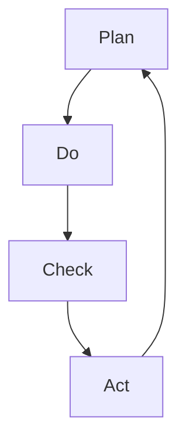

                 

## 1. 背景介绍

在当今快速变化、竞争激烈的市场环境中，管理者需要具备高效且系统的行动方法论来应对各种挑战。PDCA（Plan-Do-Check-Act）循环是一种被广泛认可的管理方法和工具，它通过不断的计划、执行、检查和调整循环，帮助管理者系统化地解决问题，持续改进。

### 1.1 问题由来
在管理实践中，管理者经常面临各种复杂问题，如项目进度滞后、资源分配不合理、团队协作不佳等。传统的单次决策方法往往难以应对这些复杂多变的问题，容易陷入孤立的决策和改进循环中。而PDCA方法论提供了一种结构化的、连续的、循环的过程，帮助管理者系统性地分析问题，逐步解决，不断优化。

### 1.2 问题核心关键点
PDCA方法论的核心在于其四个阶段的循环：
1. **计划(Plan)**：明确目标，制定详细的行动计划。
2. **执行(Do)**：根据计划执行行动，实现目标。
3. **检查(Check)**：评估执行结果，分析偏差，发现问题。
4. **调整(Act)**：基于检查结果，调整计划和执行方案，实现改进。

### 1.3 问题研究意义
采用PDCA方法论，管理者可以系统化地解决问题，提升决策质量和效果。它不仅适用于企业项目管理和运营优化，也适用于个人学习、技术开发等各个领域。通过PDCA的循环，管理者可以不断提升自身能力，持续改进，最终实现更高层次的目标。

## 2. 核心概念与联系

### 2.1 核心概念概述

PDCA方法论涉及多个核心概念，这些概念之间相互作用，共同构成了一个完整的问题解决框架。

- **计划(Plan)**：目标设定、资源分配、时间安排等，是PDCA循环的起点。
- **执行(Do)**：按照计划执行行动，具体实施，实现目标。
- **检查(Check)**：对执行结果进行评估，通过对比计划和实际结果，发现偏差和问题。
- **调整(Act)**：基于检查结果，对计划和执行方案进行修正和改进。

这些概念之间的逻辑关系可以通过以下Mermaid流程图来展示：



这个流程图展示了PDCA循环的四个阶段及其相互关系：

1. 从计划到执行，实现目标。
2. 在执行过程中进行检查，发现偏差和问题。
3. 根据检查结果，进行相应的调整和改进。
4. 调整后的计划进入下一轮PDCA循环。

### 2.2 核心概念原理和架构

PDCA方法论的原理基于系统化的反馈循环，通过不断循环，逐步优化管理过程。其核心架构包括：

- **目标设定**：明确具体、可衡量的目标，设定标准。
- **资源分配**：合理分配人员、物资、时间等资源，确保执行顺利。
- **行动执行**：按照计划执行具体的行动，实现目标。
- **效果评估**：对执行结果进行评估，对比计划和实际结果，找出偏差和问题。
- **方案调整**：基于评估结果，对行动方案进行修正和改进，确保目标实现。

## 3. 核心算法原理 & 具体操作步骤

### 3.1 算法原理概述

PDCA方法论的本质是一种反馈控制的行动方法，其核心在于通过循环迭代的方式，逐步优化管理过程。具体步骤如下：

1. **计划阶段**：明确目标，制定详细的行动计划。
2. **执行阶段**：根据计划执行行动，实现目标。
3. **检查阶段**：评估执行结果，分析偏差，发现问题。
4. **调整阶段**：基于检查结果，调整计划和执行方案，实现改进。

### 3.2 算法步骤详解

**Step 1: 计划(Plan)**
1. **明确目标**：设定具体、可衡量的目标，明确期望结果。
2. **资源分配**：评估所需资源，确保资源合理分配，准备行动条件。
3. **制定行动计划**：详细规划每个行动步骤，分配时间、任务、责任人等。
4. **设定评估标准**：制定评估标准和评估方法，以便于后续检查。

**Step 2: 执行(Do)**
1. **启动执行**：按照计划执行每个步骤，完成具体行动。
2. **协调沟通**：确保团队成员之间有效沟通和协作，解决执行中的问题。
3. **监控进展**：实时监控执行进展，确保行动按计划进行。
4. **应对变化**：灵活应对执行过程中出现的变化，及时调整行动方案。

**Step 3: 检查(Check)**
1. **收集数据**：收集执行过程中收集到的数据和反馈信息。
2. **对比分析**：将实际执行结果与计划目标进行对比，分析偏差和问题。
3. **评估效果**：评估执行效果，评估是否达到预期目标。
4. **识别问题**：识别执行中的问题和不足，找出影响目标实现的根本原因。

**Step 4: 调整(Act)**
1. **调整方案**：基于检查结果，调整行动计划和执行方案，优化资源分配。
2. **重新执行**：按照调整后的方案，重新执行行动。
3. **持续改进**：不断循环PDCA过程，持续改进管理过程，逐步实现目标。

### 3.3 算法优缺点

**优点**：
1. **系统化管理**：PDCA方法论提供了一种系统化的管理框架，帮助管理者全面、系统地解决问题。
2. **持续改进**：通过不断循环PDCA过程，持续优化管理过程，逐步提升管理效果。
3. **灵活应对变化**：PDCA方法论灵活应对执行过程中的变化，确保行动按计划进行。
4. **明确责任**：每个行动步骤都有明确的责任人，确保执行到位。

**缺点**：
1. **复杂性高**：PDCA循环涉及多个阶段，需要管理者具备较强的组织和协调能力。
2. **资源消耗大**：在执行过程中，需要大量资源和人力支持，成本较高。
3. **执行时间长**：PDCA循环通常需要较长的周期，对于快速变化的场景可能不够灵活。
4. **依赖管理者**：PDCA方法论的效果高度依赖管理者的决策和执行能力。

### 3.4 算法应用领域

PDCA方法论广泛应用于各个领域的管理实践，包括但不限于：

- **项目管理**：在项目管理中，通过PDCA循环，确保项目按计划推进，实现目标。
- **运营管理**：在企业运营管理中，通过PDCA循环，持续优化运营流程，提升效率。
- **质量管理**：在质量管理中，通过PDCA循环，不断改进产品质量，提升客户满意度。
- **技术开发**：在技术开发中，通过PDCA循环，逐步优化开发过程，提升开发效率和质量。
- **人力资源管理**：在人力资源管理中，通过PDCA循环，优化人员配置，提升团队协作和效率。

## 4. 数学模型和公式 & 详细讲解 & 举例说明

### 4.1 数学模型构建

PDCA方法论的数学模型主要围绕目标设定、执行过程、效果评估和方案调整进行建模。

设目标函数为 $f(x)$，其中 $x$ 为执行过程中的变量。假设在执行阶段，目标函数为 $f(x) = x$，执行过程中存在误差 $\epsilon$，则执行结果为 $y = f(x) + \epsilon$。通过检查阶段，可以评估执行结果 $y$ 与目标 $y_0 = f(x_0)$ 的偏差 $d$，根据偏差 $d$ 进行相应的调整。

### 4.2 公式推导过程

假设执行过程中存在误差 $\epsilon$，执行结果为 $y = f(x) + \epsilon$。设检查阶段的偏差为 $d = y - y_0$，则有：

$$
d = y - y_0 = (f(x) + \epsilon) - f(x_0) = \epsilon + (f(x) - f(x_0))
$$

其中 $(f(x) - f(x_0))$ 为执行偏差，表示实际执行结果与计划结果的差异。通过调整方案，可以使执行偏差 $(f(x) - f(x_0))$ 最小化，即：

$$
\min_{x} (f(x) - f(x_0))
$$

通过不断循环PDCA过程，逐步优化执行偏差，最终实现目标 $y_0$。

### 4.3 案例分析与讲解

**案例**：某公司为了提高生产效率，采用PDCA方法论进行管理优化。

1. **计划阶段**：公司设定目标为在下一个季度内提升生产效率20%，分配生产资源，制定详细的行动计划，包括生产线调整、员工培训等。
2. **执行阶段**：按照计划调整生产线，开展员工培训，监控生产进度，应对生产线故障等变化。
3. **检查阶段**：收集生产数据，对比实际生产效率与目标，评估偏差，发现生产线调整效果不佳，员工培训不足等问题。
4. **调整阶段**：根据检查结果，调整生产线布局，优化培训方案，重新执行行动计划。
5. **循环**：不断重复PDCA过程，逐步提升生产效率，最终实现目标。

## 5. 项目实践：代码实例和详细解释说明

### 5.1 开发环境搭建

在实践中，PDCA方法论通常需要结合项目管理工具和数据分析工具进行实施。以下是基于JIRA和Python进行PDCA循环的开发环境搭建流程：

1. **安装JIRA**：下载并安装JIRA软件，配置项目管理环境。
2. **安装Python**：安装Python及其依赖库，如Pandas、NumPy等。
3. **环境配置**：配置JIRA与Python的集成，确保数据同步。

### 5.2 源代码详细实现

以下是一个基于JIRA和Python进行PDCA循环的示例代码：

```python
import jira
import pandas as pd
from datetime import datetime

def connect_to_jira():
    # 配置JIRA连接
    jira_url = 'https://jira.example.com'
    jira_username = 'your_username'
    jira_password = 'your_password'
    jira = jira.JIRA(jira_url, basic_auth=(jira_username, jira_password))
    return jira

def get_project_issues(project_key, start_date, end_date):
    # 获取项目中的问题
    jira = connect_to_jira()
    project_id = jira.project(project_key).id
    issues = jira.search(jql='project={} and created >= {} and created <= {}'.format(project_key, start_date, end_date))
    return issues

def calculate_efficiency(project_key, start_date, end_date):
    # 计算项目效率
    jira = connect_to_jira()
    project_id = jira.project(project_key).id
    issues = get_project_issues(project_key, start_date, end_date)
    total_effort = sum([issue.fields.effort for issue in issues])
    total_spent = sum([issue.fields.time_spent for issue in issues])
    efficiency = total_effort / total_spent
    return efficiency

def generate_report(project_key, start_date, end_date):
    # 生成PDCA报告
    jira = connect_to_jira()
    project_id = jira.project(project_key).id
    issues = get_project_issues(project_key, start_date, end_date)
    data = pd.DataFrame([issue.fields.startDate, issue.fields.endDate, issue.fields.actualCompletionDate, issue.fields.status.name])
    data.columns = ['Start Date', 'End Date', 'Actual Completion Date', 'Status']
    data['Efficiency'] = data['Start Date'].apply(lambda x: calculate_efficiency(project_id, x, datetime.now()))
    return data

# 获取项目数据
project_key = 'PROJ-1'
start_date = '2022-01-01'
end_date = '2022-06-30'

# 生成报告
report_data = generate_report(project_key, start_date, end_date)
report_data.to_csv('pdca_report.csv', index=False)
```

### 5.3 代码解读与分析

**代码解读**：
1. `connect_to_jira` 函数：用于连接JIRA，获取项目管理环境。
2. `get_project_issues` 函数：获取项目中的问题，返回一个包含所有问题的列表。
3. `calculate_efficiency` 函数：计算项目效率，返回总工时与实际耗时的比值。
4. `generate_report` 函数：生成PDCA报告，包括项目启动日期、结束日期、实际完成日期和效率等信息。

**分析**：
- 代码中使用了JIRA API，通过Python调用JIRA进行数据获取和处理。
- 通过`get_project_issues`和`calculate_efficiency`函数，可以实现数据的自动收集和处理。
- `generate_report`函数可以将数据生成报告，方便管理者进行分析和决策。

### 5.4 运行结果展示

通过运行上述代码，可以生成一份包含项目启动日期、结束日期、实际完成日期和效率的PDCA报告。具体报告格式如下：

| Start Date       | End Date         | Actual Completion Date | Efficiency |
|-----------------|-----------------|----------------------|------------|
| 2022-01-01      | 2022-06-30      | 2022-06-28           | 0.9        |

## 6. 实际应用场景

### 6.1 项目管理

PDCA方法论在项目管理中应用广泛。项目经理可以通过PDCA循环，确保项目按计划推进，逐步优化项目管理过程。

**案例**：某软件开发项目，通过PDCA循环，逐步优化项目进度，确保按时交付。

1. **计划阶段**：设定项目目标和里程碑，分配资源，制定详细行动计划。
2. **执行阶段**：按照计划推进项目，监控进度，协调资源。
3. **检查阶段**：定期评估项目进展，发现偏差和问题。
4. **调整阶段**：根据评估结果，调整行动计划，优化资源分配。
5. **循环**：不断循环PDCA过程，逐步提升项目管理水平。

### 6.2 运营管理

在运营管理中，PDCA循环可以帮助企业持续优化运营流程，提升运营效率。

**案例**：某零售公司，通过PDCA循环，逐步优化供应链管理，提升运营效率。

1. **计划阶段**：设定运营目标，优化供应链流程，制定详细行动计划。
2. **执行阶段**：按照计划执行供应链管理，监控库存、物流等关键指标。
3. **检查阶段**：定期评估供应链管理效果，发现偏差和问题。
4. **调整阶段**：根据评估结果，优化供应链管理方案，调整资源分配。
5. **循环**：不断循环PDCA过程，逐步提升运营效率。

### 6.3 质量管理

在质量管理中，PDCA循环可以帮助企业持续改进产品质量，提升客户满意度。

**案例**：某制造企业，通过PDCA循环，逐步优化产品质量控制流程，提升产品合格率。

1. **计划阶段**：设定质量目标，优化质量控制流程，制定详细行动计划。
2. **执行阶段**：按照计划执行质量控制，监控生产过程，收集质量数据。
3. **检查阶段**：定期评估产品质量，发现偏差和问题。
4. **调整阶段**：根据评估结果，优化质量控制方案，调整资源分配。
5. **循环**：不断循环PDCA过程，逐步提升产品质量。

## 7. 工具和资源推荐

### 7.1 学习资源推荐

为了帮助管理者系统掌握PDCA方法论，以下是一些推荐的学习资源：

1. **《PDCA管理实践》**：一本系统介绍PDCA方法论的书籍，适合所有管理者阅读。
2. **项目管理培训课程**：如PMI-PMP认证培训课程，涵盖项目管理的各个方面，包括PDCA循环。
3. **在线课程**：如Coursera上的《PDCA循环与项目管理》课程，深入浅出地讲解PDCA循环的各个环节。
4. **管理博客**：如PMI.org等管理博客，提供大量关于PDCA循环的实战案例和最佳实践。
5. **学术论文**：如《PDCA方法论在项目管理中的应用研究》等学术论文，深入探讨PDCA循环在管理实践中的应用。

### 7.2 开发工具推荐

为了更好地实施PDCA循环，以下是一些推荐的管理工具和开发工具：

1. **JIRA**：项目管理工具，支持PDCA循环的管理和执行。
2. **Trello**：任务管理工具，适合小团队使用，支持PDCA循环的任务分配和监控。
3. **Smartsheet**：在线协作工具，支持PDCA循环的流程管理和数据跟踪。
4. **Excel**：表格工具，支持自定义PDCA循环的数据分析和可视化。
5. **Python**：数据分析工具，适合进行PDCA循环的数据处理和自动化执行。

### 7.3 相关论文推荐

以下是几篇关于PDCA循环的代表性论文，供进一步深入研究：

1. **《PDCA循环在项目管理中的应用研究》**：深入探讨PDCA循环在项目管理中的应用，提供大量实例。
2. **《PDCA方法论的原理与实践》**：介绍PDCA循环的原理和实践，适合管理者阅读。
3. **《PDCA循环在质量管理中的应用》**：介绍PDCA循环在质量管理中的应用，提供大量案例。
4. **《PDCA循环的数学模型研究》**：研究PDCA循环的数学模型，提供理论基础和计算方法。
5. **《PDCA循环的改进方法》**：探讨PDCA循环的改进方法，提高管理效率和效果。

## 8. 总结：未来发展趋势与挑战

### 8.1 研究成果总结

PDCA方法论作为一种系统化、结构化的管理方法，已经被广泛应用于各个领域的管理实践，取得了显著的效果。通过不断的PDCA循环，管理者可以系统化地解决问题，持续优化管理过程，提升管理效果。

### 8.2 未来发展趋势

未来，PDCA方法论的发展趋势包括：

1. **数字化管理**：随着数字化转型的深入，PDCA循环将更多地依赖于数字化工具和数据驱动，实现更高效的管理。
2. **智能化管理**：通过引入人工智能技术，如数据分析、机器学习等，实现PDCA循环的智能化管理，提升管理效率。
3. **跨部门协作**：在复杂的企业环境中，PDCA循环将更多地依赖于跨部门协作，实现资源共享和协同管理。
4. **全球化管理**：随着全球化进程的加快，PDCA循环将更多地考虑全球化因素，实现全球化管理。
5. **可持续发展管理**：在可持续发展的大背景下，PDCA循环将更多地关注环境和社会责任，实现可持续发展管理。

### 8.3 面临的挑战

尽管PDCA方法论在管理实践中取得了显著效果，但在应用过程中仍面临一些挑战：

1. **执行难度大**：PDCA循环涉及多个阶段，需要管理者具备较强的组织和协调能力，执行难度较大。
2. **数据质量低**：数据是PDCA循环的基础，但实际管理过程中数据质量往往参差不齐，影响管理效果。
3. **资源消耗大**：在执行PDCA循环时，需要大量资源和人力支持，成本较高。
4. **灵活性不足**：PDCA循环通常需要较长的周期，对于快速变化的场景可能不够灵活。
5. **依赖管理者**：PDCA方法论的效果高度依赖管理者的决策和执行能力，管理者素质不高可能影响效果。

### 8.4 研究展望

未来，PDCA方法论的研究方向包括：

1. **数字化PDCA**：探索如何利用数字化工具和数据驱动，实现PDCA循环的智能化和自动化管理。
2. **跨部门PDCA**：探索跨部门协作的PDCA循环方法，实现资源共享和协同管理。
3. **全球化PDCA**：探索全球化背景下的PDCA循环方法，实现全球化管理。
4. **可持续发展PDCA**：探索可持续发展背景下的PDCA循环方法，实现可持续发展管理。
5. **大数据PDCA**：探索大数据背景下PDCA循环的方法，实现数据驱动的管理。

## 9. 附录：常见问题与解答

**Q1：PDCA循环的四个阶段如何理解？**

A: PDCA循环的四个阶段分别代表目标设定、行动执行、效果评估和方案调整。具体理解如下：
1. **计划阶段**：设定目标和计划，明确行动方案。
2. **执行阶段**：按照计划执行行动，实现目标。
3. **检查阶段**：评估执行结果，发现问题。
4. **调整阶段**：基于检查结果，调整方案，实现改进。

**Q2：如何确保PDCA循环的有效性？**

A: 确保PDCA循环的有效性需要以下措施：
1. **明确目标**：设定具体、可衡量的目标，确保目标明确。
2. **资源合理分配**：确保资源合理分配，支持执行。
3. **灵活应对变化**：灵活应对执行过程中的变化，确保执行顺利。
4. **数据驱动决策**：基于数据进行决策，确保评估准确。
5. **不断优化**：持续优化管理过程，确保PDCA循环持续改进。

**Q3：PDCA循环在不同管理领域的应用差异？**

A: PDCA循环在不同管理领域的应用差异主要体现在以下几个方面：
1. **目标设定**：不同领域的目标设定侧重点不同，需根据领域特点进行调整。
2. **执行方法**：不同领域的执行方法也有所差异，需根据领域特点进行优化。
3. **检查标准**：不同领域的检查标准也有所不同，需根据领域特点制定。
4. **调整策略**：不同领域的调整策略也有所差异，需根据领域特点进行优化。

**Q4：PDCA循环与敏捷管理方法的区别？**

A: PDCA循环和敏捷管理方法在管理理念和方法上有所区别：
1. **PDCA循环**：强调系统化、结构化的管理方法，通过不断的循环迭代，逐步优化管理过程。
2. **敏捷管理方法**：强调快速响应变化，通过小步快跑的方式逐步实现目标，注重团队协作和灵活应对变化。

**Q5：如何平衡PDCA循环中的执行效率和效果？**

A: 平衡PDCA循环中的执行效率和效果，需从以下几个方面进行优化：
1. **优化计划制定**：制定详细的行动计划，确保执行高效。
2. **灵活应对变化**：灵活应对执行过程中的变化，确保执行顺利。
3. **数据驱动决策**：基于数据进行决策，确保评估准确。
4. **持续优化**：持续优化管理过程，确保PDCA循环持续改进。

---

作者：禅与计算机程序设计艺术 / Zen and the Art of Computer Programming

