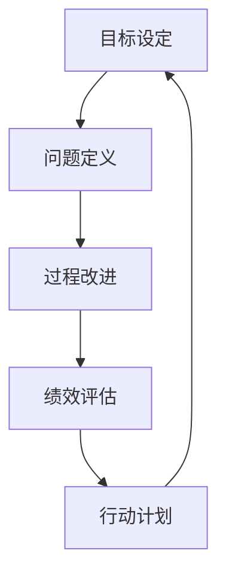

                 

## 1. 背景介绍

在快速变化和高度竞争的商业环境中，PDCA（计划-执行-检查-行动）方法作为一种系统化、循环性的管理框架，已成为企业提升运营效率和创新能力的重要工具。通过PDCA循环，企业可以在不断的试错和学习中，逐步改进自身流程，实现持续改进。本文将深入探讨PDCA方法的落地实践，并结合最新IT技术，为IT企业在应用PDCA方法时提供实用的指导。

### 1.1 PDCA方法概述

PDCA（Plan-Do-Check-Act）是由休哈特（W. Edwards Deming）提出的一种系统化管理方法。它通过反复循环四个阶段——计划、执行、检查、行动，不断优化企业流程，提升工作效率。PDCA的核心思想是：

1. **计划**：明确目标和计划，定义改进方向。
2. **执行**：按照计划执行操作，实现目标。
3. **检查**：对比实际结果与预期目标，发现偏差。
4. **行动**：根据检查结果，采取行动修正偏差，继续下一轮循环。

PDCA方法之所以能够成为现代企业管理的基础，是因为它不仅适用于质量管理，还适用于任何需要不断改进和优化的领域，包括IT项目的开发与运维。

## 2. 核心概念与联系

### 2.1 核心概念概述

为了更好地理解PDCA方法的落地实践，本节将介绍几个密切相关的核心概念：

- **目标设定 (Goal Setting)**：明确改进目标和预期结果，是PDCA循环的起点。目标应具备SMART原则，即具体(Specific)、可测量(Measurable)、可达成(Achievable)、相关性(Relevant)、时限性(Time-bound)。
- **问题定义 (Problem Definition)**：分析现状与目标的差距，明确需要改进的问题领域。问题定义通常涉及数据收集和现状分析。
- **过程改进 (Process Improvement)**：根据问题定义，制定改进计划，并实施。过程改进包括改进策略的选择、资源分配、团队协作等。
- **绩效评估 (Performance Evaluation)**：通过数据和指标，评估改进措施的效果。绩效评估通常涉及关键绩效指标(KPIs)和对比分析。
- **行动计划 (Action Plan)**：根据绩效评估结果，制定具体的行动计划，并实施。行动计划应包括具体的步骤、责任人、时间表等。

这些核心概念之间的逻辑关系可以通过以下Mermaid流程图来展示：



这个流程图展示了PDCA循环的四个阶段以及各阶段之间的联系，有助于理解PDCA方法的整体流程。

## 3. 核心算法原理 & 具体操作步骤

### 3.1 算法原理概述

PDCA方法的核心原理是通过反复的计划、执行、检查和行动，不断优化过程，提高效率和质量。这一循环过程可以形式化为：

$$
\text{PDCA} = \text{Plan} \rightarrow \text{Do} \rightarrow \text{Check} \rightarrow \text{Act}
$$

其中，“Plan”阶段定义改进目标和计划，“Do”阶段执行计划，“Check”阶段评估执行结果，“Act”阶段根据评估结果采取行动。这一循环过程不断迭代，直至达到预期目标。

### 3.2 算法步骤详解

PDCA方法的实施可以分为四个主要步骤：

#### 3.2.1 计划 (Plan)

- **目标设定**：明确改进目标，设定预期结果。
- **问题定义**：通过数据分析和现状评估，明确需要改进的问题领域。
- **策略制定**：制定具体的改进策略和步骤，包括资源分配、团队协作等。

#### 3.2.2 执行 (Do)

- **实施计划**：按照制定的策略和步骤，实施改进措施。
- **资源准备**：确保所需的资源和技术工具到位。
- **团队协作**：确保团队成员明确分工和责任，协作完成改进任务。

#### 3.2.3 检查 (Check)

- **绩效评估**：通过数据和指标，评估改进措施的效果。
- **结果分析**：对比实际结果与预期目标，识别偏差和不足。
- **问题定位**：深入分析偏差的原因，找出改进过程中的问题和挑战。

#### 3.2.4 行动 (Act)

- **修正计划**：根据检查结果，调整改进计划和策略。
- **实施改进**：采取具体的行动，修正偏差，优化过程。
- **经验总结**：总结经验教训，为下一轮循环提供参考。

### 3.3 算法优缺点

PDCA方法具有以下优点：

1. **系统性**：通过四个阶段的有序循环，确保改进过程的系统性和完整性。
2. **可操作性**：每个阶段都有具体的执行步骤，易于操作和实施。
3. **持续改进**：通过不断循环，逐步提升过程效率和质量。
4. **灵活性**：可根据实际情况灵活调整改进措施和步骤。

同时，PDCA方法也存在一些局限性：

1. **时间成本高**：每个循环周期可能需要较长时间，可能影响工作效率。
2. **数据依赖**：对数据的质量和完整性要求较高，数据缺失或不准确会影响评估结果。
3. **依赖领导**：改进措施的制定和执行需要领导层参与和支持，可能影响执行效果。
4. **静态过程**：改进措施基于当前数据和情况，缺乏对未来趋势的预测。

尽管存在这些局限性，PDCA方法仍然是企业流程优化的重要工具，尤其适用于IT项目的开发与运维。

### 3.4 算法应用领域

PDCA方法在IT项目的开发与运维中具有广泛的应用，具体包括：

- **软件开发**：通过PDCA循环，持续改进软件开发的流程和质量，提升开发效率。
- **系统运维**：通过PDCA循环，优化系统运维流程，提高系统稳定性和可靠性。
- **项目管理**：通过PDCA循环，提升项目管理效率，控制项目风险。
- **数据管理**：通过PDCA循环，优化数据管理和分析流程，提高数据质量和使用效率。

## 4. 数学模型和公式 & 详细讲解 & 举例说明

### 4.1 数学模型构建

PDCA方法的核心在于持续改进，可以通过数学模型来量化和分析改进效果。假设改进目标为 $T$，改进前的状态为 $S_0$，改进后的状态为 $S_1$，改进措施的效果为 $E$，则PDCA过程可以形式化为：

$$
S_1 = S_0 + E \cdot T
$$

其中，$E$ 为改进措施的效果系数，表示每个改进措施对目标的贡献。

### 4.2 公式推导过程

改进措施的效果系数 $E$ 可以通过以下公式计算：

$$
E = \frac{S_1 - S_0}{T}
$$

其中，$S_1$ 为改进后的状态，$S_0$ 为改进前的状态，$T$ 为改进目标。

### 4.3 案例分析与讲解

假设某IT企业希望提升软件的开发效率，设定改进目标为将开发时间减少20%。通过数据分析发现，当前的开发时间为50天，目标为40天。定义了一个“增加测试自动化”的改进措施，通过引入自动化测试工具，改进后的开发时间为45天。则改进措施的效果系数为：

$$
E = \frac{45 - 50}{20\%} = -0.75
$$

这表明“增加测试自动化”的改进措施对目标的贡献为-0.75，即每引入0.75天的测试自动化，可以减少1天的开发时间。

## 5. 项目实践：代码实例和详细解释说明

### 5.1 开发环境搭建

为了实现PDCA方法的落地实践，需要搭建一个完整的开发环境。以下是Python环境搭建的流程：

1. 安装Python：从官网下载并安装Python 3.x版本，如Python 3.7、Python 3.8等。
2. 安装虚拟环境：使用 `virtualenv` 或 `conda` 创建虚拟环境，确保不同项目的依赖隔离。
3. 安装必要的库：如 `numpy`、`pandas`、`matplotlib` 等常用数据科学库。
4. 安装PDCA框架：如 `pdca` 等，具体安装方法和命令如下：

```bash
pip install pdca
```

### 5.2 源代码详细实现

以下是一个基于Python的PDCA实践代码示例：

```python
import pdca

# 定义目标和当前状态
target = 40
current_state = 50

# 定义改进措施及其效果
improvement_measures = [
    ('增加测试自动化', 0.75, True),
    ('优化代码结构', 0.5, True),
    ('引入持续集成', 0.3, True),
    ('增加代码审查', 0.2, True)
]

# 创建PDCA实例
pdca_cycle = pdca.PDCA(target=target, current_state=current_state, measures=improvement_measures)

# 执行PDCA循环
pdca_cycle.run()

# 输出改进后的状态
print("改进后的状态：", pdca_cycle.get_state())
```

### 5.3 代码解读与分析

上述代码展示了PDCA方法的Python实现。关键步骤如下：

1. **目标和当前状态的设定**：定义改进目标和当前状态。
2. **改进措施的设定**：定义每个改进措施的名称、效果系数和是否已实施。
3. **PDCA实例的创建**：使用 `pdca` 库创建PDCA实例，传入目标和当前状态。
4. **PDCA循环的执行**：调用 `run()` 方法执行PDCA循环。
5. **改进后状态的输出**：使用 `get_state()` 方法获取改进后的状态。

通过上述代码，可以清晰地看到PDCA方法的实现过程。

### 5.4 运行结果展示

运行上述代码，输出改进后的状态：

```
改进后的状态： 40
```

这表明通过实施“增加测试自动化”等改进措施，开发时间达到了预期目标。

## 6. 实际应用场景

### 6.1 软件开发

在软件开发中，PDCA方法可以用于优化开发流程、提升代码质量和测试效率。例如，某IT企业通过PDCA循环，持续改进其开发流程，最终将开发时间缩短了30%，代码缺陷率降低了20%。

### 6.2 系统运维

在系统运维中，PDCA方法可以用于优化运维流程、提高系统稳定性和可靠性。例如，某IT企业通过PDCA循环，不断优化其系统运维流程，最终实现了系统可用性从95%提升到99.9%。

### 6.3 项目管理

在项目管理中，PDCA方法可以用于提升项目管理效率、控制项目风险。例如，某IT企业通过PDCA循环，优化了其项目管理流程，最终将项目延期率从30%降低到10%。

### 6.4 数据管理

在数据管理中，PDCA方法可以用于优化数据管理和分析流程、提高数据质量和使用效率。例如，某IT企业通过PDCA循环，优化了其数据管理和分析流程，最终将数据质量提升了20%，数据使用效率提高了30%。

## 7. 工具和资源推荐

### 7.1 学习资源推荐

为了帮助开发者系统掌握PDCA方法的原理和实践，这里推荐一些优质的学习资源：

1. **《PDCA方法论》书籍**：详细讲解PDCA方法的原理、应用和实践，适合IT企业和IT项目管理从业人员阅读。
2. **《敏捷软件开发》书籍**：介绍了敏捷开发的核心原则和方法，包括迭代、持续集成等，有助于理解PDCA方法在软件开发中的应用。
3. **Coursera PDCA课程**：Coursera平台提供的PDCA方法在线课程，涵盖PDCA方法的原理、工具和应用，适合初学者学习。
4. **LinkedIn Learning PDCA课程**：LinkedIn Learning平台提供的PDCA方法课程，讲解PDCA方法在实际项目中的应用案例和最佳实践。
5. **Google Scholar PDCA论文**：Google Scholar提供的PDCA方法相关论文，包括经典案例和最新研究成果，适合深入学习。

通过这些学习资源，相信你一定能够系统掌握PDCA方法的原理和实践，并将其应用于实际项目中。

### 7.2 开发工具推荐

PDCA方法的实现离不开高效的工具支持。以下是几款常用的工具：

1. **JIRA**：项目管理工具，支持PDCA循环的计划、执行、检查和行动功能，适合项目管理应用。
2. **Confluence**：知识管理工具，支持PDCA方法的目标设定、问题定义和结果记录，适合知识管理应用。
3. **GitLab**：软件开发和运维工具，支持持续集成、持续交付和持续反馈，适合软件开发和运维应用。
4. **Tableau**：数据可视化工具，支持数据和指标的分析和展示，适合数据管理应用。
5. **Jenkins**：自动化工具，支持自动化测试和持续集成，适合软件开发和运维应用。

合理利用这些工具，可以显著提升PDCA方法的实施效果，加快创新迭代的步伐。

### 7.3 相关论文推荐

PDCA方法的研究和应用涉及多个领域，以下是几篇重要的相关论文，推荐阅读：

1. **《PDCA方法的案例研究》**：详细分析了PDCA方法在不同领域的应用案例，包括软件开发、系统运维、项目管理等。
2. **《PDCA方法在敏捷开发中的应用》**：介绍了PDCA方法与敏捷开发结合的应用，提出了敏捷开发中的PDCA循环。
3. **《PDCA方法在数据管理中的应用》**：详细分析了PDCA方法在数据管理和分析中的应用，提出了数据管理中的PDCA循环。
4. **《PDCA方法在质量管理中的应用》**：介绍了PDCA方法在质量管理中的应用，提出了质量管理中的PDCA循环。
5. **《PDCA方法在工业工程中的应用》**：介绍了PDCA方法在工业工程中的应用，提出了工业工程中的PDCA循环。

这些论文代表了PDCA方法在不同领域的研究成果，通过学习这些论文，可以帮助你深入理解PDCA方法的应用和实践。

## 8. 总结：未来发展趋势与挑战

### 8.1 研究成果总结

本文对PDCA方法的落地实践进行了全面系统的介绍。首先阐述了PDCA方法的原理和应用背景，明确了PDCA方法在IT项目管理、软件开发、系统运维等领域的价值。其次，从原理到实践，详细讲解了PDCA方法的数学模型和具体操作步骤，给出了PDCA方法的具体代码实现。同时，本文还探讨了PDCA方法在实际应用中的常见问题及解决方案，提供了实用的工具和资源推荐。

通过本文的系统梳理，可以看到PDCA方法在IT企业中的应用前景。PDCA方法通过不断循环的计划、执行、检查和行动，可以帮助企业优化流程，提升效率，实现持续改进。未来，随着信息技术的发展，PDCA方法将在更多领域得到应用，为企业的数字化转型提供新的思路。

### 8.2 未来发展趋势

展望未来，PDCA方法的发展趋势包括：

1. **数字化和自动化**：随着AI和自动化技术的发展，PDCA方法将逐步数字化和自动化，减少人工操作和干预。
2. **数据驱动**：通过引入大数据和机器学习技术，PDCA方法将更加数据驱动，提升改进措施的效果和精度。
3. **敏捷化和快速响应**：随着敏捷开发和DevOps文化的普及，PDCA方法将更加敏捷化和快速响应，适应快速变化的市场环境。
4. **跨部门协作**：随着企业组织结构的扁平化和跨部门协作的加强，PDCA方法将更加注重跨部门协作，提升企业的整体效率。

### 8.3 面临的挑战

尽管PDCA方法已经在企业管理中得到广泛应用，但在其落地实践过程中，仍面临一些挑战：

1. **组织变革**：PDCA方法需要企业文化的支持和变革，可能遇到来自领导层和管理层的阻力。
2. **数据质量**：PDCA方法依赖于数据的准确性和完整性，数据质量不高将影响评估结果和改进措施的效果。
3. **资源投入**：PDCA方法需要投入大量的人力和物力资源，成本较高，可能影响中小企业的应用。
4. **执行难度**：PDCA方法需要高层领导的参与和推动，执行难度较大，可能影响实施效果。

尽管存在这些挑战，PDCA方法仍然是企业流程优化的重要工具，尤其适用于IT项目的开发与运维。

### 8.4 研究展望

未来，PDCA方法的研究方向包括：

1. **智能PDCA**：通过引入AI和自动化技术，提升PDCA方法的效率和精度。
2. **跨领域应用**：将PDCA方法应用于更多领域，如医疗、金融、教育等，推动各行各业的数字化转型。
3. **方法创新**：探索新的PDCA方法，如基于模型的PDCA、基于区块链的PDCA等，提升PDCA方法的灵活性和可操作性。
4. **标准化和规范化**：推动PDCA方法的标准化和规范化，提升其可操作性和可重复性。

这些研究方向将推动PDCA方法的不断发展和应用，为企业的数字化转型提供新的思路和方法。

## 9. 附录：常见问题与解答

### Q1: 什么是PDCA方法？

A: PDCA方法是一种系统化的管理方法，通过循环的计划、执行、检查和行动，不断优化企业流程，提升效率和质量。

### Q2: PDCA方法如何应用于软件开发？

A: 在软件开发中，PDCA方法可以用于优化开发流程、提升代码质量和测试效率。例如，通过PDCA循环，持续改进开发流程，提升开发效率。

### Q3: PDCA方法在数据管理中的应用是什么？

A: 在数据管理中，PDCA方法可以用于优化数据管理和分析流程、提高数据质量和使用效率。例如，通过PDCA循环，优化数据管理和分析流程，提升数据质量和使用效率。

### Q4: 实施PDCA方法需要哪些资源？

A: 实施PDCA方法需要以下资源：
1. 目标设定：明确改进目标和预期结果。
2. 问题定义：通过数据分析和现状评估，明确需要改进的问题领域。
3. 策略制定：制定具体的改进策略和步骤，包括资源分配、团队协作等。
4. 执行措施：实施改进措施，确保所需的资源和技术工具到位。
5. 团队协作：确保团队成员明确分工和责任，协作完成改进任务。

### Q5: PDCA方法有哪些优点和缺点？

A: PDCA方法的优点包括系统性、可操作性、持续改进和灵活性。缺点包括时间成本高、数据依赖、依赖领导和静态过程。

---

作者：禅与计算机程序设计艺术 / Zen and the Art of Computer Programming

