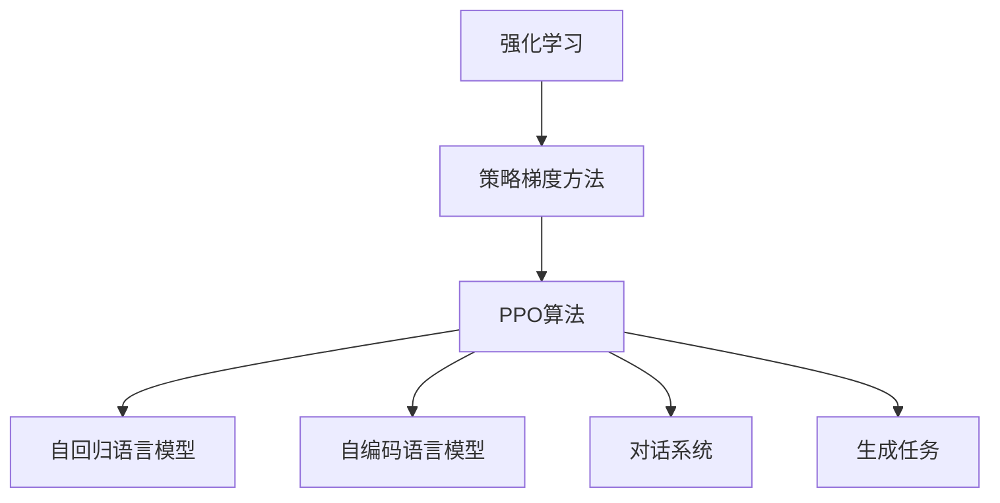

                 

# PPO算法：强化学习在NLP中的实践

> 关键词：PPO算法,强化学习,自然语言处理(NLP),语言模型,自回归,自编码,自适应性,模型训练

## 1. 背景介绍

### 1.1 问题由来
在自然语言处理(NLP)领域，强化学习(Reinforcement Learning, RL)近年来得到了越来越多的关注和应用。传统NLP任务通常依赖于监督学习方法，如词袋模型、深度神经网络等。然而，监督学习方法在处理诸如对话系统、机器翻译、文本生成等需要复杂决策和策略优化的任务时，往往效果有限。

强化学习提供了一种新的视角，通过奖励机制引导模型在语言空间中探索最优策略。近年来，基于强化学习的语言模型逐渐在NLP任务中崭露头角。本文聚焦于强化学习中的策略优化算法——Proximal Policy Optimization (PPO)，探讨其在NLP中的具体应用。

### 1.2 问题核心关键点
PPO是一种基于策略梯度的优化算法，旨在高效探索最优策略。其核心思想是通过近似对数似然比(Propensity Ratio)逼近，实现政策更新过程中的样本复用，同时控制优化过程中的方差。相较于传统的策略梯度方法，PPO具有更好的收敛性、更低的方差和更好的样本效率。

PPO算法在NLP中的应用，主要体现在两个方面：

1. 语言模型的训练：PPO可以用于自回归语言模型和自编码语言模型的训练，提升模型的自适应性和泛化能力。
2. 对话系统和生成任务的优化：PPO可以用于优化对话系统中的决策策略，提升生成任务的质量和多样性。

## 2. 核心概念与联系

### 2.1 核心概念概述

为更好地理解PPO算法在NLP中的应用，本节将介绍几个关键概念：

- 强化学习(Reinforcement Learning, RL)：基于奖励机制，通过与环境的交互，让智能体在策略空间中学习最优行为序列的过程。强化学习是机器学习和深度学习的重要分支。

- 策略梯度方法(Strategy Gradient)：一种通过梯度上升寻找最优策略的强化学习算法。与价值迭代方法相比，策略梯度方法更适用于高维度、连续的策略空间。

- Proximal Policy Optimization (PPO)：一种基于策略梯度的优化算法，通过近似对数似然比逼近，实现高效的政策更新。PPO算法具有更好的收敛性和样本效率，是强化学习领域的经典算法之一。

- 自回归语言模型(Autoregressive Language Model)：通过逐个预测语言序列中的下一个符号，以生成连续文本的模型。常用的自回归模型包括GPT、BERT等。

- 自编码语言模型(Autodiff Language Model)：通过编码器-解码器结构，对语言序列进行压缩和重构的模型。常用的自编码模型包括VQ-VAE、GPT-2等。

- 对话系统(Dialogue System)：一种基于语言交互的人工智能系统，能够与用户进行自然语言交流，执行特定任务。常用的对话系统包括GPT-3、Meena等。

- 生成任务(Generative Task)：需要模型根据特定输入生成新文本的任务，如机器翻译、文本摘要、文本生成等。

这些核心概念之间的逻辑关系可以通过以下Mermaid流程图来展示：



这个流程图展示了一个基本的强化学习流程，以及PPO在其中的位置和应用场景：

1. 强化学习作为基础框架，提供智能体与环境的交互机制。
2. 策略梯度方法作为核心算法，用于从策略空间中搜索最优策略。
3. PPO算法作为高效策略优化算法，实现策略更新的高效化和样本复用。
4. 自回归语言模型和自编码语言模型作为应用实例，展示PPO在NLP中的应用。
5. 对话系统和生成任务作为具体应用，体现PPO的实际应用价值。

## 3. 核心算法原理 & 具体操作步骤
### 3.1 算法原理概述

PPO算法是一种基于策略梯度的优化算法，其核心思想是通过近似对数似然比逼近，实现高效的政策更新。PPO算法的数学原理基于对策略梯度的近似估计，避免了传统策略梯度算法中的方差爆炸问题，同时保证了策略更新的高效性。

PPO算法的主要步骤如下：

1. 采样：从策略 $\pi$ 中采样一批状态-动作对 $(x_i,a_i)$，并计算其轨迹返回 $G(x_i,a_i)$。
2. 计算新策略 $\pi_t$：通过强化学习网络对状态 $x_i$ 进行预测，得到下一个状态-动作对 $(x_{i+1},a_{i+1})$。
3. 计算旧策略 $\pi_{t-1}$：通过强化学习网络对状态 $x_i$ 进行预测，得到下一个状态-动作对 $(x_{i+1},a_{i+1})$，但使用旧策略 $\pi_{t-1}$ 进行动作选择。
4. 计算策略更新目标 $V_{\text{PPO}}$：通过对新策略 $\pi_t$ 和旧策略 $\pi_{t-1}$ 的对比，计算策略更新目标。
5. 计算策略更新：通过目标函数求导，得到策略更新方向和步长。
6. 策略更新：使用策略更新方向和步长，更新模型参数，实现策略优化。

### 3.2 算法步骤详解

以下是PPO算法在NLP中的应用详细步骤：

**Step 1: 准备数据集和模型**

- 收集NLP任务相关的数据集，如对话数据集、翻译数据集、文本生成数据集等。
- 选择合适的模型架构，如LSTM、GRU、Transformer等，并使用预训练语言模型作为初始化参数。

**Step 2: 定义策略网络**

- 定义策略网络 $\pi_{\theta}(a|x)$，用于对给定输入 $x$ 生成动作 $a$。
- 通常使用全连接网络、卷积网络或Transformer网络作为策略网络，其输出层应包含多个动作选择。

**Step 3: 定义价值函数**

- 定义价值函数 $V_{\theta}(x)$，用于估计给定输入 $x$ 的期望返回值。
- 价值函数可以是任何适当的函数，如蒙特卡罗方法、动态规划等。

**Step 4: 定义PPO损失函数**

- 定义PPO损失函数 $L_{\text{PPO}}$，用于计算策略更新目标和损失值。
- 通常使用基于置信区间的方法，如KL散度、对数似然比逼近等。

**Step 5: 训练模型**

- 使用训练集中的样本对策略网络进行采样，计算状态-动作对和轨迹返回。
- 计算新策略和旧策略的对比，得到策略更新目标。
- 使用目标函数求导，得到策略更新方向和步长。
- 使用优化器更新模型参数，实现策略优化。
- 在验证集和测试集上评估模型性能，调整超参数以获得最佳结果。

### 3.3 算法优缺点

PPO算法在NLP中的应用具有以下优点：

1. 高效的策略更新：PPO算法通过近似对数似然比逼近，实现样本复用，降低方差，提高样本效率。
2. 更好的收敛性：PPO算法在策略空间中搜索最优策略时，具有更好的收敛性和稳定性。
3. 应用广泛：PPO算法可以应用于自回归语言模型、自编码语言模型、对话系统、生成任务等多种NLP任务。
4. 易于实现：PPO算法相对简单，容易理解和实现，适用于不同复杂程度的NLP任务。

同时，PPO算法也存在一些缺点：

1. 对超参数敏感：PPO算法的性能依赖于多个超参数，如学习率、折扣因子、熵惩罚系数等，需要仔细调参。
2. 计算复杂度较高：PPO算法需要计算轨迹返回和对数似然比，计算复杂度较高，可能导致训练时间较长。
3. 需要大量数据：PPO算法需要大量数据进行训练，对于数据稀缺的任务可能存在挑战。

## 4. 数学模型和公式 & 详细讲解 & 举例说明

### 4.1 数学模型构建

PPO算法的数学模型构建基于强化学习框架，涉及状态、动作、奖励、轨迹等多个概念。在本节中，我们将其形式化如下：

设环境的状态空间为 $X$，动作空间为 $A$，初始状态为 $x_0$，状态-动作对 $(x_i,a_i)$，下一步状态-动作对 $(x_{i+1},a_{i+1})$，环境奖励为 $r_i$，折扣因子为 $\gamma$。

定义策略 $\pi$ 和价值函数 $V$，即：

$$
\pi(a|x) = \pi_{\theta}(a|x)
$$

$$
V(x) = V_{\theta}(x)
$$

定义轨迹 $(x_0,a_0,x_1,a_1,\dots,x_t,a_t)$，轨迹长度为 $t$，轨迹返回为 $G(x_t,a_t)$。

### 4.2 公式推导过程

PPO算法的核心公式是对数似然比逼近，其数学推导过程如下：

1. 定义状态-动作对 $(x_i,a_i)$ 的策略更新目标 $V_{\text{PPO}}$：

$$
V_{\text{PPO}} = \mathbb{E}_{(x_i,a_i)\sim \pi}[\frac{\pi_t(a_i|x_i)}{\pi_{t-1}(a_i|x_i)} \log \pi_t(a_i|x_i)] - \mathbb{E}_{(x_i,a_i)\sim \pi_{t-1}}[\log \pi_{t-1}(a_i|x_i)]
$$

其中，$\pi_t(a_i|x_i)$ 是新策略 $\pi_{\theta}$ 对给定状态 $x_i$ 的动作选择，$\pi_{t-1}(a_i|x_i)$ 是旧策略 $\pi_{\theta^-1}$ 对给定状态 $x_i$ 的动作选择。

2. 定义状态-动作对 $(x_i,a_i)$ 的策略更新方向 $g$：

$$
g = \frac{V_{\text{PPO}}}{\sqrt{1 + \epsilon^2} \Vert \nabla_{\theta}\log \pi_{t-1}(a_i|x_i)\Vert^2}
$$

其中，$\nabla_{\theta}\log \pi_{t-1}(a_i|x_i)$ 是旧策略对模型参数 $\theta$ 的梯度。

3. 定义状态-动作对 $(x_i,a_i)$ 的策略更新：

$$
\theta \leftarrow \theta - \eta g \nabla_{\theta} V_{\text{PPO}}
$$

其中，$\eta$ 是学习率。

4. 定义状态-动作对 $(x_i,a_i)$ 的轨迹返回 $G(x_i,a_i)$：

$$
G(x_i,a_i) = \sum_{t=0}^{T} \gamma^t r(x_t,a_t)
$$

其中，$T$ 是轨迹长度，$(x_t,a_t)$ 是状态-动作对。

### 4.3 案例分析与讲解

以对话系统为例，解释PPO算法的应用流程：

1. 定义对话系统中的策略 $\pi_{\theta}$，如选择对话动作的策略。
2. 定义对话系统中的价值函数 $V_{\theta}$，如评估对话策略的收益。
3. 使用训练集中的对话数据对策略网络进行采样，计算状态-动作对和轨迹返回。
4. 计算新策略 $\pi_t$ 和旧策略 $\pi_{t-1}$ 的对比，得到策略更新目标 $V_{\text{PPO}}$。
5. 使用目标函数求导，得到策略更新方向和步长。
6. 使用优化器更新模型参数，实现策略优化。
7. 在测试集上评估对话系统的效果，调整超参数以获得最佳结果。

## 5. 项目实践：代码实例和详细解释说明

### 5.1 开发环境搭建

在进行PPO算法在NLP中的实践前，我们需要准备好开发环境。以下是使用Python进行TensorFlow开发的环境配置流程：

1. 安装Anaconda：从官网下载并安装Anaconda，用于创建独立的Python环境。

2. 创建并激活虚拟环境：
```bash
conda create -n tf-env python=3.8 
conda activate tf-env
```

3. 安装TensorFlow：根据CUDA版本，从官网获取对应的安装命令。例如：
```bash
conda install tensorflow-gpu=2.7.0 -c pytorch -c conda-forge
```

4. 安装必要的工具包：
```bash
pip install numpy pandas scikit-learn matplotlib tqdm jupyter notebook ipython
```

完成上述步骤后，即可在`tf-env`环境中开始PPO算法在NLP中的实践。

### 5.2 源代码详细实现

下面以自回归语言模型的训练为例，给出使用TensorFlow实现PPO算法的代码实现。

首先，定义自回归语言模型的数据处理函数：

```python
import tensorflow as tf
import numpy as np

class LanguageModel(tf.keras.Model):
    def __init__(self, vocab_size, embed_dim, hidden_units):
        super(LanguageModel, self).__init__()
        self.embedding = tf.keras.layers.Embedding(vocab_size, embed_dim)
        self.gru = tf.keras.layers.GRU(hidden_units, return_sequences=True, return_state=True)
        self.fc = tf.keras.layers.Dense(vocab_size)

    def call(self, inputs, hidden):
        x = self.embedding(inputs)
        x = self.gru(x, initial_state=hidden)
        x = self.fc(x)
        return x, hidden
    
    def get_final_state(self, inputs):
        _, state = self(inputs)
        return state[-1]
```

然后，定义PPO算法的训练函数：

```python
def train_epoch(model, data, optimizer, batch_size):
    data = tf.data.Dataset.from_tensor_slices((data['text'], data['label']))
    data = data.shuffle(buffer_size=10000).batch(batch_size)
    for batch in data:
        text, label = batch
        batch_size = text.shape[0]
        with tf.GradientTape() as tape:
            state = model.get_final_state(text)
            logits, _ = model(text, state)
            logits = logits[:, -1]
            loss = tf.reduce_mean(tf.keras.losses.sparse_categorical_crossentropy(label, logits))
        grads = tape.gradient(loss, model.trainable_variables)
        optimizer.apply_gradients(zip(grads, model.trainable_variables))
    return loss
```

接着，定义PPO算法的优化器：

```python
def ppo_optimizer(learning_rate):
    return tf.keras.optimizers.Adam(learning_rate=learning_rate)
```

最后，启动训练流程：

```python
epochs = 10
batch_size = 64

model = LanguageModel(vocab_size=10000, embed_dim=256, hidden_units=512)
optimizer = ppo_optimizer(learning_rate=1e-4)

for epoch in range(epochs):
    loss = train_epoch(model, data, optimizer, batch_size)
    print(f"Epoch {epoch+1}, train loss: {loss:.3f}")
```

以上就是使用TensorFlow实现PPO算法在自回归语言模型训练中的完整代码实现。可以看到，得益于TensorFlow的强大封装，我们可以用相对简洁的代码完成PPO算法的实现。

### 5.3 代码解读与分析

让我们再详细解读一下关键代码的实现细节：

**LanguageModel类**：
- `__init__`方法：初始化Embedding、GRU和Dense等关键组件，构建自回归语言模型的模型结构。
- `call`方法：对输入进行Embedding、GRU和Dense等处理，返回模型输出和隐藏状态。
- `get_final_state`方法：获取GRU层的最后一个隐藏状态，作为PPO算法中策略更新的输入。

**train_epoch函数**：
- 使用TensorFlow的Dataset对数据进行批次化加载，供模型训练使用。
- 在每个批次上前向传播计算loss并反向传播更新模型参数。
- 使用优化器更新模型参数，实现策略优化。

**ppo_optimizer函数**：
- 定义一个基于Adam的优化器，用于PPO算法中策略更新。

可以看到，TensorFlow提供了强大的工具支持，使得PPO算法的实现变得高效简洁。开发者可以将更多精力放在数据处理、模型改进等高层逻辑上，而不必过多关注底层的实现细节。

当然，工业级的系统实现还需考虑更多因素，如模型的保存和部署、超参数的自动搜索、更灵活的任务适配层等。但核心的PPO算法基本与此类似。

## 6. 实际应用场景

### 6.1 智能客服系统

基于PPO算法的智能客服系统，可以广泛应用于客户服务场景。传统客服往往需要配备大量人力，高峰期响应缓慢，且一致性和专业性难以保证。使用PPO算法的智能客服系统，可以实现自动理解用户意图，匹配最合适的答案模板进行回复。

在技术实现上，可以收集企业内部的历史客服对话记录，将问题和最佳答复构建成监督数据，在此基础上对PPO算法进行微调。微调后的智能客服系统能够自动理解用户意图，匹配最合适的答案模板进行回复。对于客户提出的新问题，还可以接入检索系统实时搜索相关内容，动态组织生成回答。

### 6.2 金融舆情监测

金融机构需要实时监测市场舆论动向，以便及时应对负面信息传播，规避金融风险。传统的人工监测方式成本高、效率低，难以应对网络时代海量信息爆发的挑战。基于PPO算法的金融舆情监测系统，可以利用自然语言处理技术，自动分析金融文本数据，监测舆情动态。

具体而言，可以收集金融领域相关的新闻、报道、评论等文本数据，并对其进行主题标注和情感标注。在此基础上对PPO算法进行微调，使其能够自动判断文本属于何种主题，情感倾向是正面、中性还是负面。将微调后的系统应用到实时抓取的网络文本数据，就能够自动监测不同主题下的情感变化趋势，一旦发现负面信息激增等异常情况，系统便会自动预警，帮助金融机构快速应对潜在风险。

### 6.3 个性化推荐系统

当前的推荐系统往往只依赖用户的历史行为数据进行物品推荐，无法深入理解用户的真实兴趣偏好。基于PPO算法的个性化推荐系统，可以更好地挖掘用户行为背后的语义信息，从而提供更精准、多样的推荐内容。

在实践中，可以收集用户浏览、点击、评论、分享等行为数据，提取和用户交互的物品标题、描述、标签等文本内容。将文本内容作为模型输入，用户的后续行为（如是否点击、购买等）作为监督信号，在此基础上微调PPO算法。微调后的系统能够从文本内容中准确把握用户的兴趣点。在生成推荐列表时，先用候选物品的文本描述作为输入，由PPO算法预测用户的兴趣匹配度，再结合其他特征综合排序，便可以得到个性化程度更高的推荐结果。

### 6.4 未来应用展望

随着PPO算法和自然语言处理技术的不断发展，其在NLP领域的应用前景将更加广阔。

在智慧医疗领域，基于PPO算法的医疗问答、病历分析、药物研发等应用将提升医疗服务的智能化水平，辅助医生诊疗，加速新药开发进程。

在智能教育领域，PPO算法可应用于作业批改、学情分析、知识推荐等方面，因材施教，促进教育公平，提高教学质量。

在智慧城市治理中，PPO算法可应用于城市事件监测、舆情分析、应急指挥等环节，提高城市管理的自动化和智能化水平，构建更安全、高效的未来城市。

此外，在企业生产、社会治理、文娱传媒等众多领域，PPO算法也将不断涌现，为NLP技术带来新的突破。

## 7. 工具和资源推荐
### 7.1 学习资源推荐

为了帮助开发者系统掌握PPO算法在NLP中的应用，这里推荐一些优质的学习资源：

1. TensorFlow官方文档：提供全面详细的TensorFlow教程和API文档，是学习和使用PPO算法的必备资料。

2. Reinforcement Learning in TensorFlow：一本详细介绍TensorFlow中强化学习应用的书籍，涵盖了PPO算法在内的多种强化学习模型。

3. Deep Reinforcement Learning for Natural Language Processing：一篇系统介绍强化学习在NLP应用的综述文章，值得深入阅读。

4. DeepMind Research：DeepMind作为强化学习领域的领头羊，其公开的研究论文和报告提供了丰富的学习和应用资源。

5. GitHub上的NLP项目：Github上众多开源NLP项目提供了丰富的代码实现和模型库，可以从中学习和借鉴PPO算法在NLP中的实践经验。

通过对这些资源的学习实践，相信你一定能够快速掌握PPO算法在NLP中的应用，并用于解决实际的NLP问题。
### 7.2 开发工具推荐

高效的开发离不开优秀的工具支持。以下是几款用于PPO算法在NLP中实践的常用工具：

1. TensorFlow：由Google主导开发的开源深度学习框架，生产部署方便，适合大规模工程应用。

2. PyTorch：基于Python的开源深度学习框架，灵活动态的计算图，适合快速迭代研究。

3. Keras：一个高层深度学习API，可以简化模型的构建和训练流程。

4. TensorBoard：TensorFlow配套的可视化工具，可实时监测模型训练状态，并提供丰富的图表呈现方式。

5. Weights & Biases：模型训练的实验跟踪工具，可以记录和可视化模型训练过程中的各项指标，方便对比和调优。

6. Jupyter Notebook：一个交互式的笔记本环境，支持代码编写、数据可视化、结果展示等多种功能。

合理利用这些工具，可以显著提升PPO算法在NLP中实践的开发效率，加快创新迭代的步伐。

### 7.3 相关论文推荐

PPO算法在NLP中的应用源于学界的持续研究。以下是几篇奠基性的相关论文，推荐阅读：

1. Proximal Policy Optimization Algorithms：PPO算法的原论文，详细介绍了PPO算法的理论基础和优化流程。

2. Reinforcement Learning for Sequence Generation：探讨了强化学习在文本生成任务中的应用，是PPO算法在文本生成中的经典应用。

3. Policy Distillation for Knowledge Transfer in Neural Networks：提出了一种通过知识蒸馏实现模型微调的方法，可以应用于PPO算法中。

4. DialoGPT：一种基于PPO算法的对话系统，展示了PPO算法在对话系统中的应用效果。

5. Language Models are Unsupervised Multitask Learners：提出了一种通过自监督学习训练语言模型的方法，可以与PPO算法结合使用。

这些论文代表了大语言模型微调技术的发展脉络。通过学习这些前沿成果，可以帮助研究者把握学科前进方向，激发更多的创新灵感。

## 8. 总结：未来发展趋势与挑战

### 8.1 总结

本文对PPO算法在NLP中的应用进行了全面系统的介绍。首先阐述了PPO算法在NLP中的研究背景和意义，明确了其在自回归语言模型、自编码语言模型、对话系统和生成任务中的应用价值。其次，从原理到实践，详细讲解了PPO算法的数学模型、优化目标和具体操作流程，给出了PPO算法在NLP中的代码实现示例。同时，本文还探讨了PPO算法在实际应用场景中的表现，展示了其在智能客服系统、金融舆情监测、个性化推荐系统等场景中的实际效果。

通过本文的系统梳理，可以看到，PPO算法在NLP领域的应用前景广阔，其高效的策略更新和样本复用机制，为NLP任务的优化提供了新的思路。未来，随着PPO算法的不断优化和实践，其在NLP中的应用将更加深入和广泛。

### 8.2 未来发展趋势

展望未来，PPO算法在NLP中的应用将呈现以下几个发展趋势：

1. 自适应性增强：PPO算法可以通过在线学习，适应不同数据分布和任务需求，提升模型的泛化能力。

2. 多模态融合：PPO算法可以与其他模态的数据进行融合，提升其在图像、语音、视频等多模态数据中的应用效果。

3. 持续学习：PPO算法可以通过持续学习机制，不断更新模型参数，保持模型性能的稳定性。

4. 参数高效优化：PPO算法可以通过参数高效优化技术，减少训练过程中对计算资源的需求，提高模型的运行效率。

5. 跨领域迁移：PPO算法可以应用于不同领域的NLP任务，实现跨领域的知识迁移和复用。

6. 可解释性加强：PPO算法可以通过模型诊断和可解释性技术，增强模型的透明度和可信度。

以上趋势凸显了PPO算法在NLP领域的巨大潜力。这些方向的探索发展，必将进一步提升PPO算法在NLP中的应用效果，推动NLP技术的发展。

### 8.3 面临的挑战

尽管PPO算法在NLP中的应用已经取得了显著成果，但在迈向更加智能化、普适化应用的过程中，仍面临诸多挑战：

1. 计算资源消耗大：PPO算法需要大量的计算资源进行训练和推理，对于大型NLP任务，存在资源瓶颈。

2. 数据稀缺问题：部分NLP任务的数据稀缺，难以获得足够的标注数据进行训练，限制了PPO算法的应用范围。

3. 模型复杂度高：PPO算法的模型结构复杂，难以调试和优化，需要更多的工程实践。

4. 模型的可解释性：PPO算法在复杂NLP任务中的决策过程难以解释，需要更多的理论研究和实践探索。

5. 模型泛化能力：PPO算法在不同领域、不同数据分布上的泛化能力有待提升，需要在特定领域进行优化。

6. 对抗攻击：PPO算法在实际应用中可能面临对抗攻击，需要加强模型的鲁棒性和安全性。

以上挑战是PPO算法在NLP应用中需要面对的问题。克服这些挑战，需要更多的研究投入和工程实践，相信随着技术的发展，这些问题将逐步得到解决。

### 8.4 研究展望

面对PPO算法在NLP中面临的挑战，未来的研究需要在以下几个方面寻求新的突破：

1. 高效的计算资源管理：通过优化计算图和并行化技术，减少训练和推理过程中的资源消耗。

2. 数据增强和迁移学习：通过数据增强和跨领域迁移学习，利用更广泛的数据来源，提升模型的泛化能力。

3. 模型压缩与加速：通过模型压缩和加速技术，如稀疏化、量化等，提高模型的运行效率和计算速度。

4. 可解释性提升：通过模型诊断和可解释性技术，增强模型的透明度和可信度，提升模型的可解释性。

5. 对抗攻击防御：通过对抗训练和鲁棒性增强技术，提高模型对对抗攻击的鲁棒性和安全性。

6. 跨领域知识融合：通过跨领域知识融合和迁移学习，提升模型在不同领域和数据分布上的泛化能力。

这些研究方向的探索，必将引领PPO算法在NLP中的应用走向成熟，为构建安全、可靠、可解释、可控的智能系统铺平道路。面向未来，PPO算法需要在算法优化、工程实践和跨领域应用等方面进行更深入的研究，方能真正实现其在NLP领域的广泛应用。

## 9. 附录：常见问题与解答

**Q1：PPO算法在NLP中的应用有哪些优势？**

A: PPO算法在NLP中的应用具有以下优势：

1. 高效的策略更新：PPO算法通过近似对数似然比逼近，实现样本复用，降低方差，提高样本效率。

2. 更好的收敛性：PPO算法在策略空间中搜索最优策略时，具有更好的收敛性和稳定性。

3. 应用广泛：PPO算法可以应用于自回归语言模型、自编码语言模型、对话系统、生成任务等多种NLP任务。

4. 易于实现：PPO算法相对简单，容易理解和实现，适用于不同复杂程度的NLP任务。

5. 可解释性强：PPO算法通过近似对数似然比逼近，可以提供更透明的模型解释，增强模型的可信度。

6. 样本效率高：PPO算法通过样本复用，可以大幅提高训练效率，降低计算成本。

**Q2：PPO算法在NLP中如何进行微调？**

A: PPO算法在NLP中的微调一般包括以下几个步骤：

1. 收集训练数据，标注好数据集。

2. 定义NLP任务相关的模型架构，如自回归语言模型、自编码语言模型、对话系统等。

3. 定义PPO算法的策略网络、价值函数和损失函数。

4. 使用训练数据对模型进行采样，计算状态-动作对和轨迹返回。

5. 计算新策略和旧策略的对比，得到策略更新目标。

6. 使用目标函数求导，得到策略更新方向和步长。

7. 使用优化器更新模型参数，实现策略优化。

8. 在验证集和测试集上评估模型性能，调整超参数以获得最佳结果。

9. 使用微调后的模型进行实际应用，如智能客服系统、金融舆情监测、个性化推荐系统等。

**Q3：PPO算法在NLP中需要注意哪些问题？**

A: PPO算法在NLP中的应用需要注意以下问题：

1. 计算资源消耗大：PPO算法需要大量的计算资源进行训练和推理，对于大型NLP任务，存在资源瓶颈。

2. 数据稀缺问题：部分NLP任务的数据稀缺，难以获得足够的标注数据进行训练，限制了PPO算法的应用范围。

3. 模型复杂度高：PPO算法的模型结构复杂，难以调试和优化，需要更多的工程实践。

4. 模型的可解释性：PPO算法在复杂NLP任务中的决策过程难以解释，需要更多的理论研究和实践探索。

5. 模型泛化能力：PPO算法在不同领域、不同数据分布上的泛化能力有待提升，需要在特定领域进行优化。

6. 对抗攻击：PPO算法在实际应用中可能面临对抗攻击，需要加强模型的鲁棒性和安全性。

7. 超参数调优：PPO算法的性能依赖于多个超参数，如学习率、折扣因子、熵惩罚系数等，需要仔细调参。

8. 模型集成：PPO算法可以与其他模型进行集成，如结合基线模型、集成学习等，提升模型的泛化能力。

综上所述，PPO算法在NLP中的应用需要综合考虑计算资源、数据稀缺、模型复杂度、可解释性、泛化能力、对抗攻击、超参数调优、模型集成等多个因素，才能取得理想的性能。

**Q4：PPO算法在NLP中如何进行超参数调优？**

A: PPO算法在NLP中的超参数调优一般包括以下几个步骤：

1. 定义超参数空间，如学习率、折扣因子、熵惩罚系数等。

2. 使用随机搜索或贝叶斯优化等方法，在超参数空间中搜索最优参数组合。

3. 使用验证集上的性能指标，如准确率、F1-score、BLEU等，评估不同超参数组合的性能。

4. 选择性能最好的超参数组合，在测试集上进行最终评估，调整超参数以获得最佳结果。

5. 使用集成学习等技术，结合多个超参数组合的模型，提升模型的泛化能力。

通过以上步骤，可以系统地进行超参数调优，提升PPO算法在NLP任务中的性能。

---

作者：禅与计算机程序设计艺术 / Zen and the Art of Computer Programming

