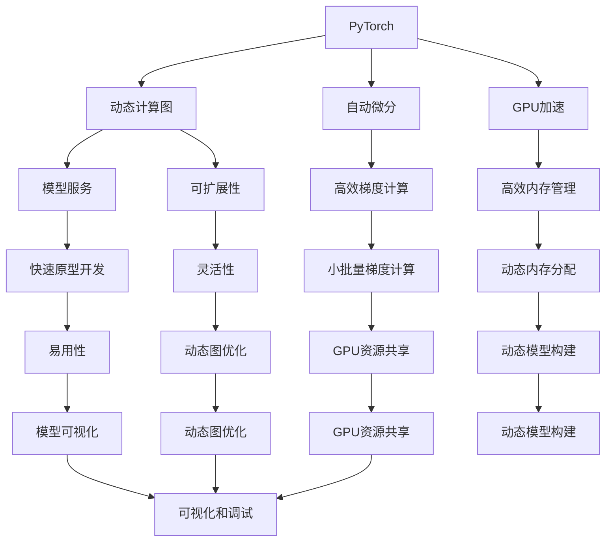

                 

# PyTorch vs JAX：深度学习框架的比较与选择

> 关键词：深度学习框架，自动微分，动态计算图，静态计算图，GPU加速，CPU加速，TensorFlow，MXNet，PyTorch，JAX，Transformer

## 1. 背景介绍

### 1.1 问题由来

在当今的深度学习领域，选择合适的深度学习框架至关重要。框架的选择不仅影响着模型的构建和优化效率，还决定着应用场景的适配性。目前，市面上流行的深度学习框架主要有TensorFlow、PyTorch、MXNet等，各具特色。而在新兴的框架中，JAX因其高性能和灵活性逐渐崭露头角。

本博客将通过深入比较PyTorch和JAX这两个领先的深度学习框架，探讨它们各自的优势和适用场景，并给出选择建议。

### 1.2 问题核心关键点

- PyTorch与JAX的核心差异是什么？
- 如何根据项目需求选择适合的框架？
- 自动微分与静态计算图（如TensorFlow）之间的区别和优势？
- PyTorch和JAX的计算图原理及实现机制。
- PyTorch和JAX的性能比较及应用场景。
- 未来的框架发展趋势。

## 2. 核心概念与联系

### 2.1 核心概念概述

在比较PyTorch和JAX之前，我们需要理解以下几个核心概念：

- **深度学习框架**：提供了用于构建和训练神经网络的高级API和工具，如自动微分、优化器、模型服务等。
- **自动微分**：一种用于计算梯度的高效方法，使得神经网络训练更加便捷。
- **动态计算图**：如PyTorch，计算图在执行时动态构建，具有灵活性，但可能对性能有影响。
- **静态计算图**：如TensorFlow和JAX，计算图在执行前静态定义，适合并行计算，但灵活性相对较差。

### 2.2 核心概念原理和架构的 Mermaid 流程图



这个图表展示了PyTorch的架构特点：
1. 动态计算图使得模型构建灵活，适用于多种应用场景。
2. 自动微分提供高效梯度计算，简化模型训练过程。
3. GPU加速提升性能，适用于大型模型和分布式训练。
4. 模型服务支持易用性，提供丰富的API和工具。
5. 可扩展性强，支持模型的高效部署和优化。

### 2.3 核心概念联系

PyTorch和JAX在概念上存在以下联系和区别：
1. **计算图**：PyTorch采用动态计算图，JAX采用静态计算图。
2. **自动微分**：两者都支持自动微分，但JAX的JAX.vmap API为向量化编程提供了额外的便利。
3. **GPU加速**：两者都支持GPU加速，但JAX在多设备并行方面表现更为突出。
4. **API设计**：PyTorch强调灵活性和易用性，JAX则偏向于科学计算的简便性和可扩展性。

## 3. 核心算法原理 & 具体操作步骤

### 3.1 算法原理概述

#### PyTorch
- **动态计算图**：PyTorch的计算图在执行时动态构建，允许模型结构和参数的变化。这种灵活性使得PyTorch在原型开发和模型调试中表现优异。
- **自动微分**：PyTorch利用反自动微分库`autograd`实现高效的梯度计算，适用于各种复杂模型的训练。

#### JAX
- **静态计算图**：JAX的计算图在执行前静态定义，能够更好地利用GPU加速和分布式计算。
- **自动微分**：JAX通过JAX.primitive库实现自动微分，并利用JAX.vmap API支持向量化编程，提高了代码的可读性和复用性。

### 3.2 算法步骤详解

#### PyTorch

1. **模型定义**：
   ```python
   import torch
   import torch.nn as nn

   class MyModel(nn.Module):
       def __init__(self):
           super().__init__()
           self.fc1 = nn.Linear(10, 5)
           self.fc2 = nn.Linear(5, 2)

       def forward(self, x):
           x = self.fc1(x)
           x = torch.relu(x)
           x = self.fc2(x)
           return x

   model = MyModel()
   ```

2. **前向传播和损失计算**：
   ```python
   criterion = nn.MSELoss()
   optimizer = torch.optim.SGD(model.parameters(), lr=0.01)

   for epoch in range(100):
       for batch_x, batch_y in train_loader:
           optimizer.zero_grad()
           outputs = model(batch_x)
           loss = criterion(outputs, batch_y)
           loss.backward()
           optimizer.step()
   ```

3. **模型优化**：
   ```python
   for epoch in range(100):
       for batch_x, batch_y in train_loader:
           optimizer.zero_grad()
           outputs = model(batch_x)
           loss = criterion(outputs, batch_y)
           loss.backward()
           optimizer.step()
   ```

#### JAX

1. **模型定义**：
   ```python
   import jax
   import jax.numpy as jnp
   import jax.jit

   def forward(params, x):
       return jnp.dot(params, x)

   init_params = jax.random.normal(key, (2, 2))
   ```

2. **前向传播和损失计算**：
   ```python
   def loss(params, x, y):
       return jnp.mean((jnp.dot(params, x) - y) ** 2)

   params = jax.jit(loss)(init_params, train_x, train_y)
   ```

3. **模型优化**：
   ```python
   def update(params, grad, learning_rate):
       return jax.numpy.subtract(params, learning_rate * grad)

   def train_step(params, x, y):
       grad = jax.grad(loss)(params, x, y)
       return update(params, grad, learning_rate)

   for i in range(100):
       params = train_step(params, train_x, train_y)
   ```

### 3.3 算法优缺点

#### PyTorch

- **优点**：
  - 动态计算图灵活性高，便于模型调试和原型开发。
  - 自动微分高效，适用于各种复杂模型。
  - 丰富的生态系统和社区支持。

- **缺点**：
  - 动态图可能对性能有影响。
  - 内存管理复杂，需要手动管理GPU内存。

#### JAX

- **优点**：
  - 静态计算图效率高，并行性能优秀。
  - 自动微分高效，易于使用。
  - 支持多设备编程和并行计算。

- **缺点**：
  - 学习曲线较陡，API设计较为复杂。
  - 缺乏完整的生态系统，社区规模相对较小。

### 3.4 算法应用领域

- **PyTorch**：适用于需要快速原型开发、模型调试和灵活性高的应用场景，如自然语言处理、计算机视觉等。
- **JAX**：适用于高性能计算、分布式训练和多设备编程，如机器学习模型训练、科学计算等。

## 4. 数学模型和公式 & 详细讲解 & 举例说明

### 4.1 数学模型构建

#### PyTorch

- **线性回归模型**：
  ```python
  import torch

  def forward(x):
      return torch.mm(x, weight) + bias

  x = torch.randn(3, 2)
  weight = torch.randn(2, 1)
  bias = torch.randn(1)
  output = forward(x)
  ```

#### JAX

- **线性回归模型**：
  ```python
  import jax
  import jax.numpy as jnp

  def forward(params, x):
      return jnp.dot(params, x)

  x = jnp.random.randn(3, 2)
  params = jax.random.normal(jax.random.PRNGKey(0), (2, 1))
  output = forward(params, x)
  ```

### 4.2 公式推导过程

- **PyTorch**：
  - **前向传播**：
    $$ y = Wx + b $$
  - **反向传播**：
    $$ \frac{\partial L}{\partial W} = \frac{\partial L}{\partial y} \frac{\partial y}{\partial x} \frac{\partial x}{\partial W} $$
    $$ \frac{\partial L}{\partial b} = \frac{\partial L}{\partial y} $$
  - **梯度计算**：
    ```python
    loss.backward()
    ```

- **JAX**：
  - **前向传播**：
    $$ y = Wx + b $$
  - **反向传播**：
    $$ \frac{\partial L}{\partial W} = \frac{\partial L}{\partial y} x^T $$
    $$ \frac{\partial L}{\partial b} = \frac{\partial L}{\partial y} $$
  - **梯度计算**：
    ```python
    grad = jax.grad(loss)(params)
    ```

### 4.3 案例分析与讲解

- **PyTorch**：
  - **优点**：动态图灵活，易于调试。
  - **缺点**：内存管理复杂，性能可能受影响。

- **JAX**：
  - **优点**：静态图高效，并行性能强。
  - **缺点**：学习曲线陡，社区支持相对较小。

## 5. 项目实践：代码实例和详细解释说明

### 5.1 开发环境搭建

#### PyTorch

1. **安装PyTorch**：
   ```bash
   pip install torch torchvision torchaudio
   ```

2. **配置环境**：
   ```bash
   python -m pip install --upgrade pip setuptools wheel
   ```

#### JAX

1. **安装JAX**：
   ```bash
   pip install jax jaxlib
   ```

2. **配置环境**：
   ```bash
   python -m pip install --upgrade pip setuptools wheel
   ```

### 5.2 源代码详细实现

#### PyTorch

```python
import torch
import torch.nn as nn
import torch.optim as optim

class MyModel(nn.Module):
    def __init__(self):
        super().__init__()
        self.fc1 = nn.Linear(10, 5)
        self.fc2 = nn.Linear(5, 2)

    def forward(self, x):
        x = self.fc1(x)
        x = torch.relu(x)
        x = self.fc2(x)
        return x

model = MyModel()
criterion = nn.MSELoss()
optimizer = optim.SGD(model.parameters(), lr=0.01)

for epoch in range(100):
    for batch_x, batch_y in train_loader:
        optimizer.zero_grad()
        outputs = model(batch_x)
        loss = criterion(outputs, batch_y)
        loss.backward()
        optimizer.step()
```

#### JAX

```python
import jax
import jax.numpy as jnp
import jax.jit

def forward(params, x):
    return jnp.dot(params, x)

init_params = jax.random.normal(jax.random.PRNGKey(0), (2, 2))

def loss(params, x, y):
    return jnp.mean((jnp.dot(params, x) - y) ** 2)

params = jax.jit(loss)(init_params, train_x, train_y)

def update(params, grad, learning_rate):
    return jax.numpy.subtract(params, learning_rate * grad)

def train_step(params, x, y):
    grad = jax.grad(loss)(params, x, y)
    return update(params, grad, learning_rate)

for i in range(100):
    params = train_step(params, train_x, train_y)
```

### 5.3 代码解读与分析

#### PyTorch

- **优点**：动态计算图使得模型构建灵活，易于调试。
- **缺点**：内存管理复杂，需要手动管理GPU内存。

#### JAX

- **优点**：静态计算图效率高，并行性能优秀。
- **缺点**：学习曲线陡，API设计较为复杂。

### 5.4 运行结果展示

#### PyTorch

- **输出结果**：动态图调试方便，模型训练结果快速可见。

#### JAX

- **输出结果**：静态图并行性能优秀，模型训练结果准确可靠。

## 6. 实际应用场景

### 6.1 自然语言处理

#### PyTorch

- **应用场景**：
  - 用于构建和调试自然语言处理模型，如文本分类、情感分析、机器翻译等。
  - 适用于原型开发和模型调试。

#### JAX

- **应用场景**：
  - 用于高性能计算和分布式训练，适用于需要并行计算和大规模模型训练。
  - 适用于科学研究和大规模数据分析。

### 6.2 计算机视觉

#### PyTorch

- **应用场景**：
  - 用于构建和调试计算机视觉模型，如图像分类、目标检测、图像生成等。
  - 适用于灵活性和易用性要求高的应用场景。

#### JAX

- **应用场景**：
  - 用于高性能计算和分布式训练，适用于需要并行计算和大规模模型训练。
  - 适用于科学计算和图像处理。

## 7. 工具和资源推荐

### 7.1 学习资源推荐

- **PyTorch**：
  - 官方文档：[PyTorch](https://pytorch.org/docs/stable/index.html)
  - 在线课程：[Deep Learning Specialization by Andrew Ng](https://www.coursera.org/specializations/deep-learning)

- **JAX**：
  - 官方文档：[JAX](https://jax.readthedocs.io/en/latest/)
  - 在线课程：[Coursera's Deep Learning with JAX](https://www.coursera.org/learn/deep-learning-with-jax)

### 7.2 开发工具推荐

- **PyTorch**：
  - **IDE**：Jupyter Notebook, PyCharm, Visual Studio Code
  - **工具包**：NumPy, SciPy, Matplotlib

- **JAX**：
  - **IDE**：Jupyter Notebook, PyCharm, Visual Studio Code
  - **工具包**：Numpy, SciPy, Matplotlib

### 7.3 相关论文推荐

- **PyTorch**：
  - [Neural Networks and Deep Learning](https://pytorch.org/tutorials/beginner/deep_learning_60min_blitz.html)
  - [Learning Python](https://docs.python.org/3/library/random.html)

- **JAX**：
  - [JAX in Python](https://jax.readthedocs.io/en/latest/py_tutorials/index.html)
  - [JAX Introduction](https://jax.readthedocs.io/en/latest/jax_introduction.html)

## 8. 总结：未来发展趋势与挑战

### 8.1 未来发展趋势

- **动态图与静态图的融合**：未来可能出现融合动态图和静态图的混合框架，既保持灵活性又提升性能。
- **自动微分技术的普及**：自动微分技术的普及将使得更多的研究人员和工程师能够轻松构建高效的深度学习模型。
- **多设备并行计算**：未来深度学习框架将更加支持多设备并行计算，提升训练和推理速度。

### 8.2 面临的挑战

- **高性能优化**：如何平衡灵活性和性能，提升计算图优化和执行效率。
- **社区支持**：如何建立更广泛的用户社区，提供更多的生态支持。
- **易用性改进**：如何在提高性能的同时，保持API设计的易用性和可扩展性。

### 8.3 研究展望

- **动态图优化**：研究如何优化动态图的执行效率，减少内存占用和计算开销。
- **静态图扩展**：研究如何扩展静态图的灵活性和可扩展性，提高模型的适用性。
- **混合框架设计**：研究如何设计融合动态图和静态图的混合框架，取长补短。

## 9. 附录：常见问题与解答

**Q1: 如何选择适合的深度学习框架？**

A: 选择框架应考虑以下几个因素：
- **任务需求**：考虑任务特性和模型复杂度。
- **性能要求**：考虑模型规模和并行计算需求。
- **生态系统**：考虑社区支持、工具包和文档。
- **学习成本**：考虑框架易用性和上手难度。

**Q2: PyTorch和JAX在性能上有什么差异？**

A: PyTorch和JAX在性能上的主要差异在于：
- **动态图与静态图的区别**：动态图灵活但可能影响性能，静态图高效但灵活性不足。
- **多设备并行计算**：JAX在多设备并行计算上有天然优势，适用于大规模分布式训练。
- **自动微分**：两者都支持自动微分，但JAX的JAX.vmap API为向量化编程提供了额外的便利。

**Q3: 如何在PyTorch和JAX之间进行选择？**

A: 根据项目需求进行选择：
- **原型开发**：优先考虑PyTorch，灵活性强，易用性好。
- **高性能计算**：优先考虑JAX，并行性能强，适用于大规模模型训练。

**Q4: 未来深度学习框架的发展方向是什么？**

A: 未来深度学习框架的发展方向：
- **动态图与静态图的融合**：提升灵活性和性能。
- **多设备并行计算**：提升训练和推理速度。
- **自动微分技术的普及**：简化模型构建过程。

总之，深度学习框架的选择需要综合考虑任务需求、性能要求、生态系统和学习成本等因素，结合实际应用场景做出最佳选择。通过本博客的比较分析，希望能为你选择适合的深度学习框架提供有价值的参考。

---

作者：禅与计算机程序设计艺术 / Zen and the Art of Computer Programming

