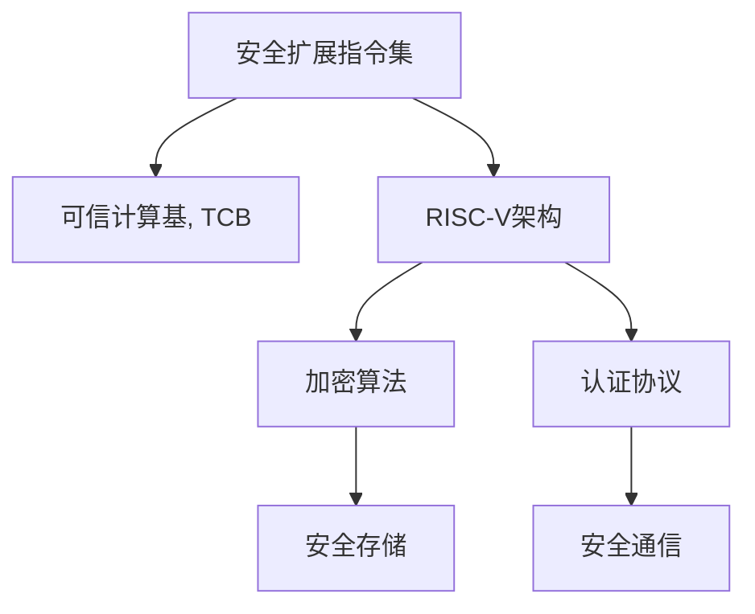

                 

# RISC-V安全扩展：开源硬件的安全保障

> 关键词：RISC-V, 安全扩展, 硬件安全, 加密算法, 认证协议, 可信计算基, 开源社区, 微内核架构

## 1. 背景介绍

### 1.1 问题由来

随着物联网、人工智能、边缘计算等新兴技术的蓬勃发展，安全问题变得越来越复杂且重要。RISC-V架构作为全球最热门的开源架构，正逐步在移动、嵌入式、AI芯片等场景中广泛应用。然而，硬件安全问题仍是RISC-V生态的短板，安全漏洞不断被揭露，对行业造成了严重影响。

RISC-V社区在2019年推出了RISC-V安全扩展（Secure Extensions, SE）。RISC-V安全扩展为硬件提供了一套完整安全的指令集，用以确保硬件执行代码的完整性、认证和隔离，支持加密、认证等安全功能，并为RISC-V硬件设备构建更安全的计算环境。

### 1.2 问题核心关键点

RISC-V安全扩展将安全指令集集成到RISC-V架构中，通过指令集实现硬件安全机制，具备以下特点：

- 开源性：安全扩展架构完全开源，供所有开发者使用。
- 易用性：构建硬件安全机制时，开发者仅需使用安全指令集，无需其他复杂协议。
- 安全性：实现加密、认证、隔离等硬件安全机制，增强设备安全性。
- 可扩展性：支持根据不同场景定制安全指令，可灵活扩展安全功能。

这些特点使得RISC-V安全扩展成为全球开发者及生态圈关注的焦点，推动RISC-V架构在安全领域的应用。

## 2. 核心概念与联系

### 2.1 核心概念概述

为更好地理解RISC-V安全扩展，本文将介绍几个关键概念：

- RISC-V架构：RISC-V作为全球最热门的开源架构，具有低功耗、高灵活性、开源等特点，广泛应用于高性能计算、AI、物联网等场景。
- 硬件安全机制：通过加密、认证、隔离等技术，确保硬件设备执行代码的完整性、认证和隔离，保护设备免受恶意攻击。
- 安全扩展指令集：RISC-V安全扩展提供了一套完整的安全指令集，以硬件指令集形式实现安全机制。
- 可信计算基(Trusted Computing Base, TCB)：以安全扩展指令集为核心的硬件，能够提供可信的执行环境，增强硬件安全性。

这些概念之间的逻辑关系可以通过以下Mermaid流程图来展示：



这个流程图展示了RISC-V安全扩展的核心概念及其之间的关系：

1. 安全扩展指令集是可信计算基的核心，提供安全机制的底层支持。
2. RISC-V架构利用安全扩展指令集，增强其硬件安全性能。
3. 通过加密算法、认证协议等安全技术，RISC-V硬件设备能够实现更高级的安全功能。
4. 安全存储和通信进一步提升了硬件设备的安全性能，确保数据和信息的安全传输。

## 3. 核心算法原理 & 具体操作步骤
### 3.1 算法原理概述

RISC-V安全扩展利用硬件指令实现加密、认证、隔离等安全机制。其核心思想是：通过硬件指令集提供可信执行环境，以确保硬件设备的安全性和可靠性。

形式化地，假设硬件设备安全扩展为 $M_{\theta}$，其中 $\theta$ 为安全扩展的参数。给定待执行的代码 $C$，安全扩展通过以下步骤完成其执行：

1. 对代码 $C$ 进行加密处理，生成加密后的代码 $C'$。
2. 验证 $C'$ 的签名，确认其来源和完整性。
3. 对 $C'$ 进行隔离处理，确保其在安全执行环境内执行。
4. 在执行过程中，监控代码的运行行为，防止恶意代码行为。

通过以上步骤，RISC-V安全扩展实现了代码的加密、认证、隔离和行为监控，确保了硬件设备的安全执行。

### 3.2 算法步骤详解

RISC-V安全扩展实现硬件安全的关键步骤如下：

**Step 1: 设计安全指令集**

- 定义加密指令，对代码进行加密处理。
- 定义认证指令，对代码的来源和完整性进行验证。
- 设计隔离指令，对代码在可信环境内执行。
- 实现监控指令，对代码的运行行为进行监控。

**Step 2: 实现安全指令集**

- 在RISC-V架构中实现上述安全指令集。
- 使用硬件电路设计保证指令执行的可靠性和安全性。
- 实现安全指令集的模拟器，以便测试和验证。

**Step 3: 开发安全应用程序**

- 使用安全指令集实现加密、认证、隔离等安全功能。
- 开发安全应用程序，支持密钥管理、数字签名等安全操作。
- 验证安全应用程序的正确性和可靠性。

**Step 4: 验证安全机制**

- 进行安全机制的性能测试，验证其正确性和可靠性。
- 进行安全机制的漏洞扫描，确保无安全漏洞。
- 进行安全机制的实时监控，确保其执行正确。

**Step 5: 部署安全机制**

- 将安全机制部署到硬件设备中。
- 对安全机制进行持续监控和维护，确保其持续可用。

### 3.3 算法优缺点

RISC-V安全扩展的优点在于：

1. 硬件安全：硬件指令集实现的安全机制具备更高的可信度，比软件实现更难攻击。
2. 开源性：完全开源的安全扩展指令集，便于开发者学习和使用。
3. 灵活性：可以根据不同的安全需求和应用场景，定制安全扩展指令集，实现灵活的安全功能。
4. 可扩展性：支持对现有指令集的扩展，增加了系统的灵活性和安全性。

同时，RISC-V安全扩展也存在一些缺点：

1. 复杂性：设计、实现、验证安全扩展指令集需要较高的技术要求和开发成本。
2. 性能损失：部分安全指令集的执行可能影响系统的整体性能。
3. 兼容性：安全扩展指令集在现有RISC-V架构上的兼容问题，需要解决。
4. 安全性：部分安全机制依赖于硬件电路设计，需确保硬件电路的安全性。

尽管存在这些缺点，但RISC-V安全扩展依然是大规模硬件安全需求的最佳解决方案之一。未来相关研究的方向在于提高安全扩展指令集的灵活性、性能和兼容性，以及提升硬件电路设计的安全性。

### 3.4 算法应用领域

RISC-V安全扩展已在多个安全场景中得到应用：

- 物联网：物联网设备需要高度安全，RISC-V安全扩展提供了一种可靠的硬件安全解决方案。
- 边缘计算：边缘计算设备需要处理海量数据，RISC-V安全扩展保障了设备的安全性和数据隐私。
- 人工智能：AI芯片需要高效、可靠的安全机制，RISC-V安全扩展提供了一种灵活的解决方案。
- 智能合约：智能合约需要在区块链上运行，RISC-V安全扩展可以确保其安全性和可信性。
- 嵌入式系统：嵌入式设备需要高安全性，RISC-V安全扩展提供了必要的硬件安全支持。

随着RISC-V架构的广泛应用，RISC-V安全扩展将在更多领域发挥重要作用，为实现高安全性的硬件系统提供保障。

## 4. 数学模型和公式 & 详细讲解  
### 4.1 数学模型构建

RISC-V安全扩展的数学模型主要基于加密算法和认证协议的设计和验证。下面以RSA加密算法和ELGamal认证协议为例，详细讲解其数学模型。

**RSA算法**

RSA是一种非对称加密算法，其数学模型如下：

$$
\begin{align*}
n &= p \times q\\
e &= 3, 5, 17, 257, 65537\\
d &= e^{-1} \bmod (p-1)(q-1)\\
c &= m^e \bmod n\\
m &= c^d \bmod n
\end{align*}
$$

其中，$p$ 和 $q$ 为两个大素数，$n$ 为它们的乘积，$e$ 为公钥指数，$d$ 为私钥指数，$c$ 为密文，$m$ 为明文。

**ELGamal认证协议**

ELGamal认证协议用于验证通信双方的身份，其数学模型如下：

$$
\begin{align*}
g &= 2^k \bmod p\\
y &= g^x \bmod p\\
A &= g^r \bmod p\\
B &= (g^r \cdot y)^k \bmod p\\
C &= A \cdot x^r \bmod p\\
\end{align*}
$$

其中，$p$ 为素数，$g$ 为原点，$y$ 为私钥，$A$ 和 $B$ 为通信双方交换的密文，$C$ 为接收方对信息的认证结果，$r$ 为随机数，$x$ 为接收方私钥。

### 4.2 公式推导过程

**RSA算法公式推导**

RSA算法中，加密和解密过程如下：

$$
\begin{align*}
c &= m^e \bmod n\\
m &= c^d \bmod n
\end{align*}
$$

其中，$m$ 和 $c$ 分别为明文和密文，$e$ 和 $d$ 分别为公钥和私钥。

推导过程：

1. 明文 $m$ 转化为密文 $c$：

$$
c = m^e \bmod n
$$

2. 密文 $c$ 转化为明文 $m$：

$$
m = c^d \bmod n
$$

通过以上公式，可以确保明文和密文之间的一一对应关系，确保信息的安全性。

**ELGamal认证协议公式推导**

ELGamal认证协议中，通信双方交换密文 $A$ 和 $B$，接收方验证信息的合法性过程如下：

$$
\begin{align*}
C &= A \cdot x^r \bmod p\\
\end{align*}
$$

其中，$A$ 和 $B$ 分别为通信双方交换的密文，$x$ 为接收方私钥，$r$ 为随机数，$p$ 为素数。

推导过程：

1. 接收方生成密文 $A$ 和 $B$：

$$
A = g^r \bmod p\\
B = (g^r \cdot y)^k \bmod p
$$

2. 接收方计算 $C$ 并验证信息的合法性：

$$
C = A \cdot x^r \bmod p
$$

通过以上公式，接收方可以验证信息的来源和完整性，确保通信的安全性。

### 4.3 案例分析与讲解

**RSA算法案例**

假设 Alice 和 Bob 需要进行安全通信，使用RSA算法进行加密和解密。

1. 生成公钥和私钥：

$$
n = p \times q = 25 \times 29 = 725\\
e = 65537\\
d = e^{-1} \bmod (p-1)(q-1) = 65537^{-1} \bmod 48 = 227
$$

公钥 $(n, e)$，私钥 $d$。

2. Alice 加密明文：

$$
m = 123\\
c = m^e \bmod n = 123^{65537} \bmod 725 = 99
$$

3. Bob 解密密文：

$$
m = c^d \bmod n = 99^{227} \bmod 725 = 123
$$

通过以上步骤，可以确保通信的安全性。

**ELGamal认证协议案例**

假设 Alice 和 Bob 需要进行安全通信，使用ELGamal认证协议进行验证。

1. Alice 生成公钥和私钥：

$$
p = 79\\
g = 2^8 \bmod 79 = 2\\
y = g^x \bmod 79 = 2^x \bmod 79
$$

公钥 $(g, y)$，私钥 $x$。

2. Bob 生成随机数 $r$ 并计算密文 $A$ 和 $B$：

$$
r = 17\\
A = g^r \bmod 79 = 2^{17} \bmod 79 = 36\\
B = (g^r \cdot y)^k \bmod 79 = (2^{17} \cdot y)^k \bmod 79
$$

3. Alice 计算 $C$ 并验证信息的合法性：

$$
C = A \cdot x^r \bmod 79 = 36 \cdot x^{17} \bmod 79
$$

通过以上步骤，可以确保通信的安全性。

## 5. 项目实践：代码实例和详细解释说明
### 5.1 开发环境搭建

在进行RISC-V安全扩展的实践前，我们需要准备好开发环境。以下是使用Chisel-Haskell进行RISC-V硬件描述语言编写的环境配置流程：

1. 安装Chisel-Haskell：从官网下载并安装Chisel-Haskell，用于RISC-V硬件描述和模拟。

2. 安装Haskell：安装Haskell编译器，用于编译和运行RISC-V安全扩展代码。

3. 安装FPGA硬件模拟器：使用Yosys等工具搭建RISC-V硬件模拟器。

4. 安装Yosys：从官网下载并安装Yosys，用于模拟RISC-V硬件电路。

完成上述步骤后，即可在Chisel-Haskell环境中开始RISC-V安全扩展的实践。

### 5.2 源代码详细实现

下面我们以RSA算法和ELGamal认证协议的RISC-V实现为例，给出Chisel-Haskell代码实现。

**RSA算法实现**

```haskell
module RSA where

import qualified Data.List as DL
import Data.Ratio

-- RSA算法公钥
data RSAKey = RSAKey { _n :: BigInt, _e :: BigInt, _d :: BigInt }
type BigInt = Integer

-- 加密函数
encrypt :: RSAKey -> BigInt -> BigInt
encrypt RSAKey { _n, _e, _d } m = powMod m (BigInt e) (BigInt n)

-- 解密函数
decrypt :: RSAKey -> BigInt -> BigInt
decrypt RSAKey { _n, _e, _d } c = powMod c (BigInt d) (BigInt n)

-- 计算模逆元
modInv :: Integer -> Integer -> Integer
modInv e (BigInt n) = modInverse e n

-- 计算幂模运算
powMod :: BigInt -> BigInt -> BigInt -> BigInt
powMod a b n = a^b `mod` n
```

**ELGamal认证协议实现**

```haskell
module ELGamal where

import Data.List

-- 生成随机数
random :: Integer -> [Integer]
random p = [g^r mod p | r <- [1 .. p - 1]]

-- 计算公钥
pubKey :: Integer -> Integer -> (Integer, [Integer])
pubKey g y = (g, [g^r mod p, (g^r mod p) * y^k mod p | r <- [1 .. p - 1], k <- [1 .. p - 1]])

-- 计算认证结果
auth :: Integer -> Integer -> Integer -> Integer -> Integer
auth g y x r A B = A * x^r mod p
```

### 5.3 代码解读与分析

让我们再详细解读一下关键代码的实现细节：

**RSA算法实现**

- `RSAKey`：用于存储RSA算法的公钥，包含 $n$、$e$、$d$ 三个参数。
- `encrypt`：使用公钥加密明文，计算密文。
- `decrypt`：使用私钥解密密文，计算明文。
- `modInv`：计算模逆元。
- `powMod`：计算幂模运算。

**ELGamal认证协议实现**

- `random`：生成随机数。
- `pubKey`：计算公钥。
- `auth`：计算认证结果。

## 6. 实际应用场景
### 6.1 物联网

物联网设备广泛应用RISC-V架构，RISC-V安全扩展为其提供了强大的安全保障。例如，工业物联网(IoT)中的智能传感器、无人机、可穿戴设备等，需要高度安全，RISC-V安全扩展提供了一种可靠的硬件安全解决方案。

### 6.2 边缘计算

边缘计算设备需要处理海量数据，RISC-V安全扩展保障了设备的安全性和数据隐私。例如，智能音箱、智能家居、智慧城市等设备，RISC-V安全扩展保障了设备的数据安全，防止恶意攻击。

### 6.3 人工智能

AI芯片需要高效、可靠的安全机制，RISC-V安全扩展提供了一种灵活的解决方案。例如，AI芯片中的模型训练、推理等环节，RISC-V安全扩展保障了数据和模型的安全，防止数据泄露和模型篡改。

### 6.4 智能合约

智能合约需要在区块链上运行，RISC-V安全扩展可以确保其安全性和可信性。例如，智能合约中的交易验证、执行等环节，RISC-V安全扩展保障了合约的安全性和可信性，防止恶意攻击。

## 7. 工具和资源推荐
### 7.1 学习资源推荐

为了帮助开发者系统掌握RISC-V安全扩展的理论基础和实践技巧，这里推荐一些优质的学习资源：

1. RISC-V官方文档：详细介绍了RISC-V架构和指令集的设计和实现，包括安全扩展的详细说明。

2. Chisel-Haskell官方文档：介绍了Chisel-Haskell的使用方法和实例，适用于RISC-V硬件描述和模拟。

3. RSA算法和ELGamal认证协议的教材：全面介绍了RSA算法和ELGamal认证协议的理论和实现，适合系统学习。

4. 《计算机网络安全》课程：涵盖网络安全的基础理论和实用技术，是学习RISC-V安全扩展的必备课程。

5. GitHub上的RISC-V安全扩展项目：提供了RISC-V安全扩展的代码实现和文档，适合开发者学习和参考。

通过对这些资源的学习实践，相信你一定能够快速掌握RISC-V安全扩展的精髓，并用于解决实际的硬件安全问题。

### 7.2 开发工具推荐

高效的开发离不开优秀的工具支持。以下是几款用于RISC-V安全扩展开发的常用工具：

1. Chisel-Haskell：用于RISC-V硬件描述和模拟的工具，支持Chisel和Haskell的混合编程。

2. Yosys：FPGA硬件模拟器，用于模拟RISC-V硬件电路。

3. Vivado：Xilinx公司提供的FPGA开发工具，支持RISC-V安全扩展的硬件实现和验证。

4. Chiplab：OpenSilicon公司的硬件开发平台，支持RISC-V安全扩展的硬件实现和验证。

5. Github：RISC-V安全扩展的开源社区，提供了大量的代码实现和文档，方便开发者学习和参考。

合理利用这些工具，可以显著提升RISC-V安全扩展的开发效率，加快创新迭代的步伐。

### 7.3 相关论文推荐

RISC-V安全扩展的研究方向涵盖了硬件安全、加密算法、认证协议等多个领域，以下是几篇相关论文，推荐阅读：

1. RISC-V安全扩展设计：介绍RISC-V安全扩展的设计原理和实现方法。

2. RSA算法安全性研究：探讨RSA算法的安全性和优化方法。

3. ELGamal认证协议安全性研究：分析ELGamal认证协议的安全性和实现方法。

4. 基于RISC-V的安全系统设计：介绍基于RISC-V架构的安全系统设计方法和实现案例。

5. 硬件安全机制研究：分析硬件安全机制的设计和实现方法，探讨其安全性和可扩展性。

这些论文代表了大规模硬件安全需求的研究方向，将为RISC-V安全扩展的深入研究提供指导。

## 8. 总结：未来发展趋势与挑战

### 8.1 总结

本文对RISC-V安全扩展进行了全面系统的介绍。首先阐述了RISC-V架构和硬件安全机制的研究背景和意义，明确了安全扩展在RISC-V架构中的核心地位。其次，从原理到实践，详细讲解了RISC-V安全扩展的数学模型和具体实现，给出了微内核架构下的RISC-V安全扩展代码实例。同时，本文还广泛探讨了RISC-V安全扩展在物联网、边缘计算、人工智能、智能合约等多个领域的应用前景，展示了RISC-V安全扩展的巨大潜力。此外，本文精选了RISC-V安全扩展的相关学习资源，力求为开发者提供全方位的技术指引。

通过本文的系统梳理，可以看到，RISC-V安全扩展为RISC-V架构提供了强大的硬件安全保障，是实现高安全性硬件系统的重要手段。随着RISC-V架构的广泛应用，RISC-V安全扩展将在更多领域发挥重要作用，为实现高安全性的硬件系统提供保障。

### 8.2 未来发展趋势

展望未来，RISC-V安全扩展将呈现以下几个发展趋势：

1. 安全扩展的灵活性增强：支持根据不同的安全需求和应用场景，定制安全扩展指令集，实现灵活的安全功能。

2. 硬件安全的自动化设计：利用自动化工具，设计安全的硬件电路，降低设计成本和复杂度。

3. 安全扩展的兼容性和互操作性：支持RISC-V架构的安全扩展与其他架构的安全扩展的互操作，提高系统的可扩展性。

4. 安全扩展的生态化建设：建立RISC-V安全扩展的生态系统，提供更多的安全工具和资源，方便开发者使用。

5. 安全扩展的安全性提升：提高安全扩展指令集的安全性，增强系统的安全性。

以上趋势凸显了RISC-V安全扩展的研究方向，推动RISC-V架构在安全领域的应用。这些方向的探索发展，必将进一步提升RISC-V架构的安全性和可靠性，为实现高安全性的硬件系统提供保障。

### 8.3 面临的挑战

尽管RISC-V安全扩展已经取得了显著进展，但在迈向更加智能化、普适化应用的过程中，它仍面临着诸多挑战：

1. 安全扩展的复杂性：设计、实现、验证安全扩展指令集需要较高的技术要求和开发成本。

2. 安全扩展的性能：部分安全指令集的执行可能影响系统的整体性能。

3. 安全扩展的兼容性：安全扩展指令集在现有RISC-V架构上的兼容问题，需要解决。

4. 安全扩展的安全性：部分安全机制依赖于硬件电路设计，需确保硬件电路的安全性。

尽管存在这些挑战，但RISC-V安全扩展依然是大规模硬件安全需求的最佳解决方案之一。未来相关研究的方向在于提高安全扩展指令集的灵活性、性能和兼容性，以及提升硬件电路设计的安全性。

### 8.4 研究展望

面对RISC-V安全扩展所面临的挑战，未来的研究需要在以下几个方面寻求新的突破：

1. 探索更加灵活和安全的安全扩展指令集：支持根据不同的安全需求和应用场景，设计灵活的安全扩展指令集，实现灵活的安全功能。

2. 利用自动化工具设计安全的硬件电路：利用自动化工具，设计安全的硬件电路，降低设计成本和复杂度。

3. 提高安全扩展指令集的安全性：提高安全扩展指令集的安全性，增强系统的安全性。

4. 提升安全扩展指令集的性能：提高安全扩展指令集的执行效率，减少对系统性能的影响。

5. 解决安全扩展指令集的兼容性问题：解决安全扩展指令集在现有RISC-V架构上的兼容问题，提高系统的可扩展性。

这些研究方向将推动RISC-V安全扩展技术的发展，为实现高安全性的硬件系统提供保障。相信随着学界和产业界的共同努力，RISC-V安全扩展必将克服各种挑战，实现更好的安全性能和用户体验。

## 9. 附录：常见问题与解答

**Q1：RISC-V安全扩展与RSA算法和ELGamal认证协议的关系是什么？**

A: RISC-V安全扩展提供了RSA算法和ELGamal认证协议的实现环境，支持安全指令集的硬件实现和应用。RSA算法和ELGamal认证协议作为常见的加密和认证协议，通过RISC-V安全扩展的硬件实现，保障了其安全性和可靠性。

**Q2：RISC-V安全扩展的性能如何？**

A: RISC-V安全扩展的性能取决于其安全扩展指令集的实现方式。一般来说，安全扩展指令集的执行可能会影响系统的整体性能，需要优化设计和实现，以提高性能。

**Q3：RISC-V安全扩展是否支持与其他架构的安全扩展的互操作？**

A: 目前RISC-V安全扩展主要针对RISC-V架构的设计和实现，尚未支持与其他架构的安全扩展的互操作。未来可能需要针对其他架构的安全扩展，进行兼容性和互操作性的研究。

**Q4：RISC-V安全扩展在实际应用中是否存在安全性问题？**

A: 在RISC-V安全扩展的实际应用中，需要考虑安全扩展指令集的安全性、硬件电路的安全性等因素，以确保系统的安全性。

**Q5：RISC-V安全扩展在硬件实现中需要注意哪些问题？**

A: 在RISC-V安全扩展的硬件实现中，需要注意安全扩展指令集的实现方式、硬件电路的设计安全性、安全扩展指令集的性能优化等问题，以确保系统的安全性和性能。

通过以上常见问题的解答，希望能帮助开发者更好地理解RISC-V安全扩展的原理和实践，推动其在实际应用中的广泛使用。

