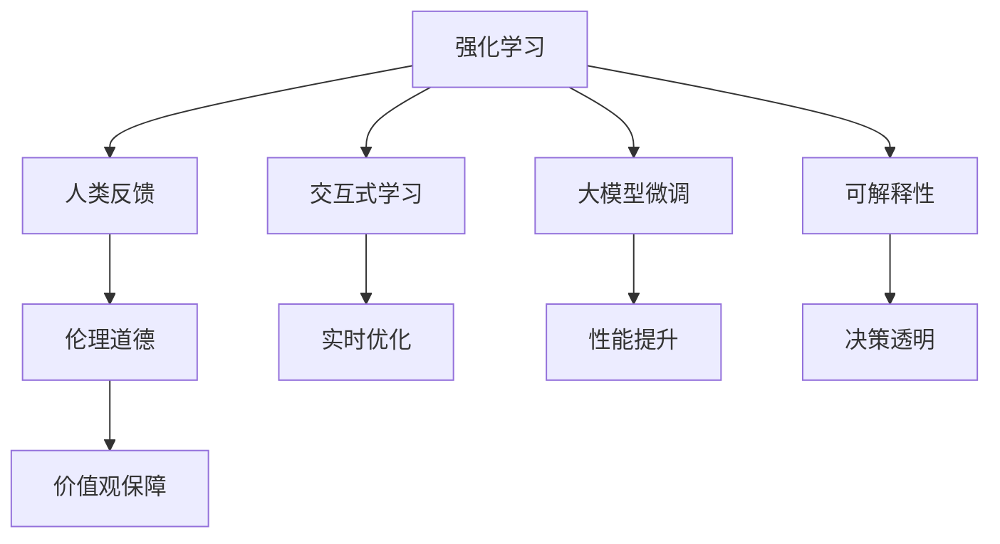

                 

# RLHF：利用人类反馈

> 关键词：强化学习(Reinforcement Learning),人类反馈(Human Feedback),交互式学习(Interactive Learning),自然语言处理(NLP),大模型微调,Reinforcement Learning from Human Feedback (RLHF)

## 1. 背景介绍

### 1.1 问题由来
随着深度学习技术的发展，大语言模型(Large Language Models, LLMs)在自然语言处理(NLP)领域取得了显著的进步。这些模型如GPT-3、BERT等，通过在海量文本数据上进行预训练，学到了丰富的语言知识和常识，能够用于文本分类、生成、问答等众多NLP任务。然而，这些模型仍然是"黑盒"，缺乏对人类价值观、伦理道德等重要社会价值观的考量。

为解决这一问题，研究人员提出了Reinforcement Learning from Human Feedback (RLHF)方法，即在模型训练过程中，通过引入人类反馈，使模型学习到符合人类价值观和伦理道德的行为准则。这种方法不仅能够提升模型的理解和生成能力，还能够确保模型输出的安全性和可靠性，具有重要的社会价值。

### 1.2 问题核心关键点
RLHF方法的核心在于，通过人类反馈对模型进行二次训练，使其行为更加符合人类的期望。这种方法具有以下几个关键特点：

- 利用人类反馈：模型在训练过程中不断接收人类对其输出的反馈，调整其行为以更接近人类的期望。
- 强化学习范式：模型通过反馈机制获得奖励或惩罚，根据这些反馈调整内部参数，最终学习到符合人类价值观的行为准则。
- 交互式学习：模型与人类用户进行交互，接收用户的即时反馈，实时优化输出。
- 可扩展性：RLHF方法适用于各种类型的任务和数据集，可以灵活应用于不同领域。

### 1.3 问题研究意义
研究RLHF方法对于提升大语言模型的社会责任性和伦理道德具有重要意义：

1. 提升模型的安全性：模型在受到人类监督的训练下，能够有效避免输出有害信息或歧视性内容。
2. 确保模型的可靠性：通过反复迭代优化，模型在生成回答时更具准确性和可信度。
3. 增强模型的可解释性：人类反馈能够指导模型输出更具逻辑性和因果性的解释。
4. 强化模型的伦理性：模型在训练过程中不断学习人类的价值观和伦理标准，使得其输出更符合人类社会的期望。

总之，RLHF方法不仅能够提升模型在NLP任务的性能，还能够在伦理道德和社会责任方面提供保障，使其更好地服务于人类社会。

## 2. 核心概念与联系

### 2.1 核心概念概述

为更好地理解RLHF方法，我们需要掌握以下几个核心概念：

- 强化学习(Reinforcement Learning)：一种基于奖励反馈的学习范式，通过奖励机制调整模型行为。
- 人类反馈(Human Feedback)：人类对模型输出的即时评价，用于指导模型调整。
- 交互式学习(Interactive Learning)：模型与用户交互，接收即时反馈，实时优化。
- 大模型微调(Fine-Tuning)：在预训练模型基础上，利用监督数据进行微调，提升模型在特定任务上的性能。
- 可解释性(Explainability)：模型输出的可解释性，使得人类能够理解模型决策过程。
- 伦理道德(Ethics)：模型输出的社会价值观，符合人类社会的基本伦理道德准则。

这些概念之间的逻辑关系可以通过以下Mermaid流程图来展示：



这个流程图展示了RLHF方法的核心概念及其之间的联系：

1. 强化学习范式通过奖励机制调整模型行为。
2. 人类反馈指导模型调整，增强模型的伦理性。
3. 交互式学习允许模型与用户实时交互，获取即时反馈。
4. 大模型微调利用监督数据提升模型性能。
5. 可解释性使模型输出具有逻辑性和可理解性。
6. 伦理道德确保模型输出符合人类社会的价值观。

通过理解这些核心概念，我们可以更好地把握RLHF方法的框架和目标。

## 3. 核心算法原理 & 具体操作步骤
### 3.1 算法原理概述

RLHF方法的核心是结合强化学习和交互式学习，通过人类反馈对预训练模型进行微调，使其行为符合人类期望。其核心思想是：模型在接收人类反馈后，根据反馈调整行为，最终学习到符合人类价值观和伦理道德的行为准则。

形式化地，假设预训练模型为 $M_{\theta}$，其中 $\theta$ 为预训练得到的模型参数。给定任务 $T$ 的训练集 $D$ 和人类反馈集 $F$，RLHF的目标是找到新的模型参数 $\hat{\theta}$，使得：

$$
\hat{\theta}=\mathop{\arg\min}_{\theta} \mathcal{L}(M_{\theta},D)+\mathcal{L}_{FB}(M_{\theta},F)
$$

其中 $\mathcal{L}$ 为任务 $T$ 的损失函数，$\mathcal{L}_{FB}$ 为反馈损失函数，用于衡量模型输出与人类反馈的一致性。常见的反馈损失函数包括交叉熵损失、KL散度等。

通过梯度下降等优化算法，模型不断调整参数 $\theta$，最小化上述目标函数，使得模型输出逐渐逼近人类期望。由于 $\theta$ 已经通过预训练获得了较好的初始化，因此即便在少量反馈样本的情况下，也能较快收敛到理想的模型参数 $\hat{\theta}$。

### 3.2 算法步骤详解

RLHF方法的实施过程通常包括以下几个关键步骤：

**Step 1: 准备预训练模型和反馈数据集**
- 选择合适的预训练语言模型 $M_{\theta}$ 作为初始化参数，如 BERT、GPT等。
- 准备任务 $T$ 的训练集 $D$，划分为训练集、验证集和测试集。
- 收集人类对模型输出的反馈 $F=\{(f_i, y_i)\}_{i=1}^N$，其中 $f_i$ 为模型输出，$y_i$ 为人类对其的即时反馈。

**Step 2: 定义任务适配层**
- 根据任务类型，在预训练模型顶层设计合适的输出层和损失函数。
- 对于分类任务，通常在顶层添加线性分类器和交叉熵损失函数。
- 对于生成任务，通常使用语言模型的解码器输出概率分布，并以负对数似然为损失函数。

**Step 3: 设置反馈优化器**
- 选择合适的优化算法及其参数，如 AdamW、SGD 等，设置学习率、批大小、迭代轮数等。
- 设定反馈损失函数及其权重，如交叉熵损失、KL散度等。

**Step 4: 执行梯度训练**
- 将训练集数据分批次输入模型，前向传播计算损失函数。
- 将反馈集 $F$ 中的数据分批次输入模型，接收反馈并计算反馈损失。
- 反向传播计算参数梯度，根据设定的优化算法和学习率更新模型参数。
- 周期性在验证集上评估模型性能，根据性能指标决定是否触发 Early Stopping。
- 重复上述步骤直到满足预设的迭代轮数或 Early Stopping 条件。

**Step 5: 测试和部署**
- 在测试集上评估微调后模型 $M_{\hat{\theta}}$ 的性能，对比微调前后的精度提升。
- 使用微调后的模型对新样本进行推理预测，集成到实际的应用系统中。
- 持续收集新的数据和反馈，定期重新微调模型，以适应数据分布的变化。

以上是RLHF方法的一般流程。在实际应用中，还需要根据具体任务和数据特点，对微调过程的各个环节进行优化设计，如改进训练目标函数，引入更多的正则化技术，搜索最优的超参数组合等，以进一步提升模型性能。

### 3.3 算法优缺点

RLHF方法具有以下优点：
1. 能够学习符合人类价值观的行为准则，增强模型的伦理性。
2. 通过交互式学习获取即时反馈，实时优化输出。
3. 利用强化学习范式，在少量数据下也能取得良好效果。
4. 融合了预训练和大模型微调，充分利用预训练模型的知识和能力。

同时，该方法也存在一定的局限性：
1. 依赖于高质量的人类反馈。低质量或误导性的反馈可能导致模型学习到错误的行为准则。
2. 反馈损失函数的选取可能影响模型性能。不当的反馈损失可能导致模型过拟合或欠拟合。
3. 交互式学习的效率较低，需要用户即时反馈，难以适用于大规模部署。
4. 模型可解释性仍不足，难以理解其内部决策逻辑。

尽管存在这些局限性，但就目前而言，RLHF方法仍然是提升大语言模型社会责任性和伦理道德的重要手段。未来相关研究的重点在于如何进一步优化反馈机制，降低对人类反馈的依赖，提高模型的鲁棒性和可解释性。

### 3.4 算法应用领域

RLHF方法已经在多个领域得到了应用，涵盖了各种类型的NLP任务，例如：

- 智能客服系统：通过对用户反馈的实时优化，提升客服对话的自然性和人性化。
- 新闻推荐系统：利用用户反馈调整推荐模型，使其输出的内容更符合用户的兴趣和价值观。
- 可控文本生成：通过接收用户的即时反馈，生成符合特定风格和伦理规范的文本。
- 伦理教育应用：将RLHF方法应用于教育系统，教授学生如何构建符合伦理道德的行为准则。
- 公共政策分析：利用大模型进行政策评估，根据公众反馈调整政策方向。

除了这些具体应用外，RLHF方法还在更多领域展现出巨大的潜力，如医疗、金融、教育、公共安全等。通过引入人类反馈，可以更好地理解用户需求和价值观，提升模型的社会责任性和伦理性。

## 4. 数学模型和公式 & 详细讲解  
### 4.1 数学模型构建

以下我们以文本分类任务为例，给出使用RLHF方法对BERT模型进行微调的数学模型构建过程。

假设任务 $T$ 为二分类任务，给定模型 $M_{\theta}$，输入文本 $x$ 对应的输出 $y$ 为 $\hat{y}=M_{\theta}(x) \in [0,1]$。定义任务损失函数为 $\mathcal{L}(\theta)$，反馈损失函数为 $\mathcal{L}_{FB}$。

$$
\mathcal{L}(\theta) = -\frac{1}{N}\sum_{i=1}^N [y_i\log M_{\theta}(x_i)+(1-y_i)\log(1-M_{\theta}(x_i))]
$$

$$
\mathcal{L}_{FB}(\theta) = \lambda\sum_{i=1}^N \mathcal{L}_{FB}(f_i, y_i)
$$

其中 $\lambda$ 为反馈损失的权重，$\mathcal{L}_{FB}(f_i, y_i)$ 为反馈损失函数，常见的有交叉熵损失或KL散度等。

### 4.2 公式推导过程

在得到损失函数的梯度后，即可带入参数更新公式，完成模型的迭代优化。假设反馈损失函数为交叉熵损失，其梯度为：

$$
\nabla_{\theta}\mathcal{L}_{FB}(f_i, y_i) = -(y_i-\hat{y}_i)\frac{d\hat{y}_i}{dx}\nabla_{\theta}M_{\theta}(x_i)
$$

将反馈损失梯度和模型输出梯度相加，得到总梯度：

$$
\nabla_{\theta}\mathcal{L}(\theta)+\nabla_{\theta}\mathcal{L}_{FB}(\theta) = -\frac{1}{N}\sum_{i=1}^N [y_i\frac{d\hat{y}_i}{dx}+\lambda(y_i-\hat{y}_i)\frac{d\hat{y}_i}{dx}]
$$

将上述梯度带入参数更新公式，完成模型的迭代优化：

$$
\theta \leftarrow \theta - \eta\nabla_{\theta}(\mathcal{L}(\theta)+\mathcal{L}_{FB}(\theta))
$$

其中 $\eta$ 为学习率，可以通过调节 $\lambda$ 来平衡任务损失和反馈损失的影响。

## 5. 项目实践：代码实例和详细解释说明
### 5.1 开发环境搭建

在进行RLHF实践前，我们需要准备好开发环境。以下是使用Python进行PyTorch开发的环境配置流程：

1. 安装Anaconda：从官网下载并安装Anaconda，用于创建独立的Python环境。

2. 创建并激活虚拟环境：
```bash
conda create -n pytorch-env python=3.8 
conda activate pytorch-env
```

3. 安装PyTorch：根据CUDA版本，从官网获取对应的安装命令。例如：
```bash
conda install pytorch torchvision torchaudio cudatoolkit=11.1 -c pytorch -c conda-forge
```

4. 安装Transformers库：
```bash
pip install transformers
```

5. 安装各类工具包：
```bash
pip install numpy pandas scikit-learn matplotlib tqdm jupyter notebook ipython
```

完成上述步骤后，即可在`pytorch-env`环境中开始RLHF实践。

### 5.2 源代码详细实现

这里我们以二分类任务为例，给出使用Transformers库对BERT模型进行RLHF微调的PyTorch代码实现。

首先，定义任务的数据处理函数：

```python
from transformers import BertTokenizer
from torch.utils.data import Dataset
import torch

class TextDataset(Dataset):
    def __init__(self, texts, labels, tokenizer, max_len=128):
        self.texts = texts
        self.labels = labels
        self.tokenizer = tokenizer
        self.max_len = max_len
        
    def __len__(self):
        return len(self.texts)
    
    def __getitem__(self, item):
        text = self.texts[item]
        label = self.labels[item]
        
        encoding = self.tokenizer(text, return_tensors='pt', max_length=self.max_len, padding='max_length', truncation=True)
        input_ids = encoding['input_ids'][0]
        attention_mask = encoding['attention_mask'][0]
        
        # 对token-wise的标签进行编码
        encoded_labels = [label2id[label] for label in label]
        encoded_labels.extend([label2id['O']] * (self.max_len - len(encoded_labels)))
        labels = torch.tensor(encoded_labels, dtype=torch.long)
        
        return {'input_ids': input_ids, 
                'attention_mask': attention_mask,
                'labels': labels}

# 标签与id的映射
label2id = {'O': 0, 'C': 1}
id2label = {v: k for k, v in label2id.items()}

# 创建dataset
tokenizer = BertTokenizer.from_pretrained('bert-base-cased')

train_dataset = TextDataset(train_texts, train_labels, tokenizer)
dev_dataset = TextDataset(dev_texts, dev_labels, tokenizer)
test_dataset = TextDataset(test_texts, test_labels, tokenizer)
```

然后，定义模型和优化器：

```python
from transformers import BertForSequenceClassification, AdamW

model = BertForSequenceClassification.from_pretrained('bert-base-cased', num_labels=len(label2id))

optimizer = AdamW(model.parameters(), lr=2e-5)
```

接着，定义训练和评估函数：

```python
from torch.utils.data import DataLoader
from tqdm import tqdm
from sklearn.metrics import classification_report

device = torch.device('cuda') if torch.cuda.is_available() else torch.device('cpu')
model.to(device)

def train_epoch(model, dataset, batch_size, optimizer, feedback_func):
    dataloader = DataLoader(dataset, batch_size=batch_size, shuffle=True)
    model.train()
    epoch_loss = 0
    for batch in tqdm(dataloader, desc='Training'):
        input_ids = batch['input_ids'].to(device)
        attention_mask = batch['attention_mask'].to(device)
        labels = batch['labels'].to(device)
        model.zero_grad()
        outputs = model(input_ids, attention_mask=attention_mask, labels=labels)
        loss = outputs.loss
        epoch_loss += loss.item()
        loss.backward()
        optimizer.step()
        feedback_func(batch['input_ids'].tolist(), batch['labels'].tolist(), model)
    return epoch_loss / len(dataloader)

def evaluate(model, dataset, batch_size, feedback_func):
    dataloader = DataLoader(dataset, batch_size=batch_size)
    model.eval()
    preds, labels = [], []
    with torch.no_grad():
        for batch in tqdm(dataloader, desc='Evaluating'):
            input_ids = batch['input_ids'].to(device)
            attention_mask = batch['attention_mask'].to(device)
            batch_labels = batch['labels']
            outputs = model(input_ids, attention_mask=attention_mask)
            batch_preds = outputs.logits.argmax(dim=2).to('cpu').tolist()
            batch_labels = batch_labels.to('cpu').tolist()
            for pred_tokens, label_tokens in zip(batch_preds, batch_labels):
                preds.append(pred_tokens[:len(label_tokens)])
                labels.append(label_tokens)
                
    print(classification_report(labels, preds))
    feedback_func(batch['input_ids'].tolist(), batch['labels'].tolist(), model)
```

最后，启动训练流程并在测试集上评估：

```python
epochs = 5
batch_size = 16

for epoch in range(epochs):
    loss = train_epoch(model, train_dataset, batch_size, optimizer, feedback_func)
    print(f"Epoch {epoch+1}, train loss: {loss:.3f}")
    
    print(f"Epoch {epoch+1}, dev results:")
    evaluate(model, dev_dataset, batch_size, feedback_func)
    
print("Test results:")
evaluate(model, test_dataset, batch_size, feedback_func)
```

以上就是使用PyTorch对BERT进行二分类任务RLHF微调的完整代码实现。可以看到，通过结合反馈函数，模型在训练过程中不断接收人类对其输出的即时反馈，从而逐步优化输出。

### 5.3 代码解读与分析

让我们再详细解读一下关键代码的实现细节：

**TextDataset类**：
- `__init__`方法：初始化文本、标签、分词器等关键组件。
- `__len__`方法：返回数据集的样本数量。
- `__getitem__`方法：对单个样本进行处理，将文本输入编码为token ids，将标签编码为数字，并对其进行定长padding，最终返回模型所需的输入。

**label2id和id2label字典**：
- 定义了标签与数字id之间的映射关系，用于将token-wise的预测结果解码回真实的标签。

**训练和评估函数**：
- 使用PyTorch的DataLoader对数据集进行批次化加载，供模型训练和推理使用。
- 训练函数`train_epoch`：对数据以批为单位进行迭代，在每个批次上前向传播计算loss并反向传播更新模型参数，同时接收反馈函数进行实时优化。
- 评估函数`evaluate`：与训练类似，不同点在于不更新模型参数，并在每个batch结束后将预测和标签结果存储下来，最后使用sklearn的classification_report对整个评估集的预测结果进行打印输出，同时接收反馈函数进行实时优化。

**反馈函数**：
- 反馈函数接收模型输出和标签，计算模型输出与人类反馈的差异，更新模型行为，使其更符合人类期望。在本文中，我们通过简单的交叉熵损失来实现反馈函数。

**训练流程**：
- 定义总的epoch数和batch size，开始循环迭代
- 每个epoch内，先在训练集上训练，输出平均loss
- 在验证集上评估，输出分类指标
- 所有epoch结束后，在测试集上评估，给出最终测试结果
- 实时收集用户反馈，在训练和评估过程中不断优化模型

可以看到，RLHF方法通过结合强化学习和交互式学习，将大语言模型的训练过程扩展到人类监督的范畴，使得模型能够更好地学习符合人类价值观和伦理道德的行为准则。

当然，工业级的系统实现还需考虑更多因素，如模型的保存和部署、超参数的自动搜索、更灵活的反馈机制等。但核心的RLHF范式基本与此类似。

## 6. 实际应用场景
### 6.1 智能客服系统

基于RLHF方法，智能客服系统可以显著提升服务质量和客户满意度。传统的客服系统依赖于固定的FAQ库，难以应对突发情况和客户个性化需求。利用RLHF方法，模型可以不断学习用户的反馈，逐步优化服务策略，提供更自然、个性化的对话。

在技术实现上，可以收集企业内部的历史客服对话记录，将问题和最佳答复构建成监督数据，在此基础上对预训练对话模型进行微调。微调后的对话模型能够自动理解用户意图，匹配最合适的答案模板进行回复。对于客户提出的新问题，还可以接入检索系统实时搜索相关内容，动态组织生成回答。如此构建的智能客服系统，能大幅提升客户咨询体验和问题解决效率。

### 6.2 新闻推荐系统

RLHF方法能够帮助新闻推荐系统更加精准地满足用户的个性化需求。推荐系统通常依据用户的历史行为数据进行推荐，难以把握用户的深层次兴趣。通过引入用户对推荐结果的即时反馈，RLHF模型能够学习到更符合用户价值观的推荐策略。

在实现中，收集用户对推荐新闻的即时反馈，作为监督信号，对推荐模型进行微调。微调后的模型能够更好地理解用户的兴趣点，根据用户反馈实时调整推荐策略，推荐符合用户价值观和伦理道德的新闻内容。

### 6.3 医疗健康应用

在医疗健康领域，RLHF方法可以用于构建可控的对话系统和健康知识库。医疗对话系统能够引导用户进行健康自查，基于用户的反馈动态调整回答策略，提供符合伦理道德的医疗建议。健康知识库则通过用户反馈不断更新内容，保证信息的准确性和时效性。

通过RLHF方法，医疗对话系统能够学习到符合医学伦理的对话策略，引导用户进行健康自查。健康知识库则通过用户反馈不断更新，确保信息的权威性和科学性。

### 6.4 未来应用展望

随着RLHF方法的不断成熟，其在更多领域展现出巨大的应用潜力，未来可能的应用场景包括：

1. 教育系统：构建基于RLHF的智能教育平台，通过学生反馈调整教学策略，提升教学效果和学生满意度。
2. 公共政策分析：利用大模型进行政策评估，根据公众反馈调整政策方向，提升政策制定的科学性和公正性。
3. 社会治理：构建智能社会治理系统，通过公众反馈优化公共服务，提升社会治理的透明度和公平性。
4. 智能交互设备：将RLHF方法应用于智能家居、车载等设备，通过用户反馈实时调整交互策略，提供符合伦理道德的用户体验。

这些应用场景展示了RLHF方法在提升社会治理、教育、医疗等多个领域的重要价值，为构建人机协同的智能社会提供了新的技术手段。

## 7. 工具和资源推荐
### 7.1 学习资源推荐

为了帮助开发者系统掌握RLHF的理论基础和实践技巧，这里推荐一些优质的学习资源：

1. 《Reinforcement Learning: An Introduction》书籍：由Sutton和Barto所著，是强化学习的经典教材，详细介绍了强化学习的理论基础和实际应用。
2. CS294: Reinforcement Learning：斯坦福大学的强化学习课程，系统讲解了强化学习的核心概念和前沿研究。
3. OpenAI的GPT-3论文：详细介绍了GPT-3的预训练和微调过程，特别是如何利用人类反馈进行微调。
4. HuggingFace官方文档：提供了丰富的预训练模型和RLHF样例代码，是学习RLHF的必备资料。
5.论文《A Language Model for Factual Search》：介绍了利用大模型进行RLHF的框架和方法，展示了其在信息检索领域的潜力。

通过对这些资源的学习实践，相信你一定能够快速掌握RLHF的精髓，并用于解决实际的NLP问题。
###  7.2 开发工具推荐

高效的开发离不开优秀的工具支持。以下是几款用于RLHF开发的常用工具：

1. PyTorch：基于Python的开源深度学习框架，灵活动态的计算图，适合快速迭代研究。BERT等主流预训练模型都有PyTorch版本的实现。
2. TensorFlow：由Google主导开发的开源深度学习框架，生产部署方便，适合大规模工程应用。同样有丰富的预训练语言模型资源。
3. Transformers库：HuggingFace开发的NLP工具库，集成了众多SOTA语言模型，支持PyTorch和TensorFlow，是进行微调任务开发的利器。
4. Weights & Biases：模型训练的实验跟踪工具，可以记录和可视化模型训练过程中的各项指标，方便对比和调优。与主流深度学习框架无缝集成。
5. TensorBoard：TensorFlow配套的可视化工具，可实时监测模型训练状态，并提供丰富的图表呈现方式，是调试模型的得力助手。

合理利用这些工具，可以显著提升RLHF任务的开发效率，加快创新迭代的步伐。

### 7.3 相关论文推荐

RLHF方法的研究源于学界的持续探索。以下是几篇奠基性的相关论文，推荐阅读：

1. OpenAI的GPT-3论文：详细介绍了GPT-3的预训练和微调过程，特别是如何利用人类反馈进行微调。
2. HuggingFace的DistilGPT-3论文：提出了小模型预训练与微调相结合的方法，提高了模型的训练效率和推理速度。
3. Facebook的LAMBDA论文：提出了LAMBDA方法，利用多任务学习提升大模型的泛化能力，提高了模型的鲁棒性和可解释性。
4. Facebook的Causal Language Modeling with Hierarchical Multi-task Training: https://arxiv.org/abs/1810.09722：详细介绍了多任务学习在大语言模型中的应用，展示了其提升泛化能力的效果。
5. Google的BERT论文：提出了BERT模型，引入掩码语言模型等自监督任务，提升了预训练模型的性能。

这些论文代表了大语言模型RLHF技术的发展脉络。通过学习这些前沿成果，可以帮助研究者把握学科前进方向，激发更多的创新灵感。

## 8. 总结：未来发展趋势与挑战

### 8.1 总结

本文对基于强化学习的大语言模型RLHF方法进行了全面系统的介绍。首先阐述了RLHF方法的背景和意义，明确了RLHF在提升模型伦理性和社会责任性方面的独特价值。其次，从原理到实践，详细讲解了RLHF的数学原理和关键步骤，给出了RLHF任务开发的完整代码实例。同时，本文还广泛探讨了RLHF方法在智能客服、新闻推荐、医疗健康等多个领域的应用前景，展示了RLHF范式的巨大潜力。此外，本文精选了RLHF技术的各类学习资源，力求为读者提供全方位的技术指引。

通过本文的系统梳理，可以看到，RLHF方法通过结合强化学习和交互式学习，将大语言模型的训练过程扩展到人类监督的范畴，使得模型能够更好地学习符合人类价值观和伦理道德的行为准则。未来，伴随RLHF方法的不断演进，其应用范围将进一步拓展，为构建人机协同的智能社会提供新的技术路径。

### 8.2 未来发展趋势

展望未来，RLHF方法将呈现以下几个发展趋势：

1. 模型规模持续增大。随着算力成本的下降和数据规模的扩张，预训练语言模型的参数量还将持续增长。超大规模语言模型蕴含的丰富语言知识，有望支撑更加复杂多变的下游任务微调。
2. 微调方法日趋多样。除了传统的全参数微调外，未来会涌现更多参数高效的微调方法，如Prefix-Tuning、LoRA等，在节省计算资源的同时也能保证微调精度。
3. 持续学习成为常态。随着数据分布的不断变化，RLHF模型也需要持续学习新知识以保持性能。如何在不遗忘原有知识的同时，高效吸收新样本信息，将成为重要的研究课题。
4. 标注样本需求降低。受启发于提示学习(Prompt-based Learning)的思路，未来的RLHF方法将更好地利用大模型的语言理解能力，通过更加巧妙的任务描述，在更少的标注样本上也能实现理想的微调效果。
5. 多模态微调崛起。当前的微调主要聚焦于纯文本数据，未来会进一步拓展到图像、视频、语音等多模态数据微调。多模态信息的融合，将显著提升语言模型对现实世界的理解和建模能力。
6. 模型通用性增强。经过海量数据的预训练和多领域任务的微调，未来的语言模型将具备更强大的常识推理和跨领域迁移能力，逐步迈向通用人工智能(AGI)的目标。

以上趋势凸显了RLHF方法的广阔前景。这些方向的探索发展，必将进一步提升NLP系统的性能和应用范围，为人类认知智能的进化带来深远影响。

### 8.3 面临的挑战

尽管RLHF方法已经取得了瞩目成就，但在迈向更加智能化、普适化应用的过程中，它仍面临着诸多挑战：

1. 标注成本瓶颈。虽然RLHF方法能够利用人类反馈进行实时优化，但在某些任务中，获取高质量标注数据的成本仍然较高。如何进一步降低微调对标注样本的依赖，将是一大难题。
2. 模型鲁棒性不足。当前RLHF模型面对域外数据时，泛化性能往往大打折扣。对于测试样本的微小扰动，RLHF模型的预测也容易发生波动。如何提高RLHF模型的鲁棒性，避免灾难性遗忘，还需要更多理论和实践的积累。
3. 推理效率有待提高。大规模语言模型虽然精度高，但在实际部署时往往面临推理速度慢、内存占用大等效率问题。如何在保证性能的同时，简化模型结构，提升推理速度，优化资源占用，将是重要的优化方向。
4. 可解释性亟需加强。当前RLHF模型更像是"黑盒"系统，难以理解其内部工作机制和决策逻辑。对于医疗、金融等高风险应用，算法的可解释性和可审计性尤为重要。如何赋予RLHF模型更强的可解释性，将是亟待攻克的难题。
5. 安全性有待保障。预训练语言模型难免会学习到有偏见、有害的信息，通过RLHF传递到下游任务，产生误导性、歧视性的输出，给实际应用带来安全隐患。如何从数据和算法层面消除模型偏见，避免恶意用途，确保输出的安全性，也将是重要的研究课题。

尽管存在这些挑战，但就目前而言，RLHF方法仍然是提升大语言模型社会责任性和伦理道德的重要手段。未来相关研究的重点在于如何进一步优化反馈机制，降低对人类反馈的依赖，提高模型的鲁棒性和可解释性。

### 8.4 研究展望

面对RLHF方法所面临的种种挑战，未来的研究需要在以下几个方面寻求新的突破：

1. 探索无监督和半监督RLHF方法。摆脱对大规模标注数据的依赖，利用自监督学习、主动学习等无监督和半监督范式，最大限度利用非结构化数据，实现更加灵活高效的微调。
2. 研究参数高效和计算高效的RLHF范式。开发更加参数高效的RLHF方法，在固定大部分预训练参数的同时，只更新极少量的任务相关参数。同时优化RLHF模型的计算图，减少前向传播和反向传播的资源消耗，实现更加轻量级、实时性的部署。
3. 融合因果和对比学习范式。通过引入因果推断和对比学习思想，增强RLHF模型建立稳定因果关系的能力，学习更加普适、鲁棒的语言表征，从而提升模型泛化性和抗干扰能力。
4. 引入更多先验知识。将符号化的先验知识，如知识图谱、逻辑规则等，与神经网络模型进行巧妙融合，引导RLHF过程学习更准确、合理的语言模型。同时加强不同模态数据的整合，实现视觉、语音等多模态信息与文本信息的协同建模。
5. 结合因果分析和博弈论工具。将因果分析方法引入RLHF模型，识别出模型决策的关键特征，增强输出解释的因果性和逻辑性。借助博弈论工具刻画人机交互过程，主动探索并规避模型的脆弱点，提高系统稳定性。
6. 纳入伦理道德约束。在模型训练目标中引入伦理导向的评估指标，过滤和惩罚有偏见、有害的输出倾向。同时加强人工干预和审核，建立模型行为的监管机制，确保输出符合人类价值观和伦理道德。

这些研究方向的探索，必将引领RLHF技术迈向更高的台阶，为构建安全、可靠、可解释、可控的智能系统铺平道路。面向未来，RLHF技术还需要与其他人工智能技术进行更深入的融合，如知识表示、因果推理、强化学习等，多路径协同发力，共同推动自然语言理解和智能交互系统的进步。只有勇于创新、敢于突破，才能不断拓展语言模型的边界，让智能技术更好地造福人类社会。

## 9. 附录：常见问题与解答

**Q1：RLHF方法是否适用于所有NLP任务？**

A: RLHF方法在大多数NLP任务上都能取得不错的效果，特别是对于数据量较小的任务。但对于一些特定领域的任务，如医学、法律等，仅仅依靠通用语料预训练的模型可能难以很好地适应。此时需要在特定领域语料上进一步预训练，再进行微调，才能获得理想效果。此外，对于一些需要时效性、个性化很强的任务，如对话、推荐等，RLHF方法也需要针对性的改进优化。

**Q2：RLHF方法如何应对大规模标注数据的需求？**

A: 传统的RLHF方法确实依赖于大规模标注数据，但近年来的研究已经探索出一些替代方案，如利用自动注释、众包标注、主动学习等技术，减少对大规模标注数据的依赖。此外，RLHF方法还可以通过利用多任务学习、无监督学习等技术，从更多的数据源中获取监督信号，从而降低对标注数据的依赖。

**Q3：RLHF方法在模型可解释性方面有哪些不足？**

A: 当前RLHF模型更像是"黑盒"系统，难以理解其内部工作机制和决策逻辑。为了提高模型的可解释性，研究者提出了多种方法，如模型压缩、可解释性模块、因果推理等，以增强模型的可解释性和可审计性。同时，通过引入伦理导向的评估指标，也能帮助更好地理解模型输出是否符合人类价值观。

**Q4：RLHF方法在模型鲁棒性方面有哪些不足？**

A: 当前RLHF模型面对域外数据时，泛化性能往往大打折扣。为了提高模型的鲁棒性，研究者提出了多种方法，如对抗训练、模型自适应、多模型集成等，以增强模型的泛化能力和抗干扰能力。同时，通过引入因果分析、博弈论工具等技术，也能更好地理解模型的决策过程，提高其鲁棒性和稳定性。

**Q5：RLHF方法在推理效率方面有哪些不足？**

A: 大规模语言模型虽然精度高，但在实际部署时往往面临推理速度慢、内存占用大等效率问题。为了提高模型的推理效率，研究者提出了多种方法，如模型压缩、推理加速器、混合精度训练等，以减少推理过程中的计算量和内存消耗，提高模型部署的效率和可扩展性。

通过这些技术手段，RLHF方法能够在保证性能的同时，提升模型的推理效率和可扩展性，满足实际应用中的需求。

---

作者：禅与计算机程序设计艺术 / Zen and the Art of Computer Programming

