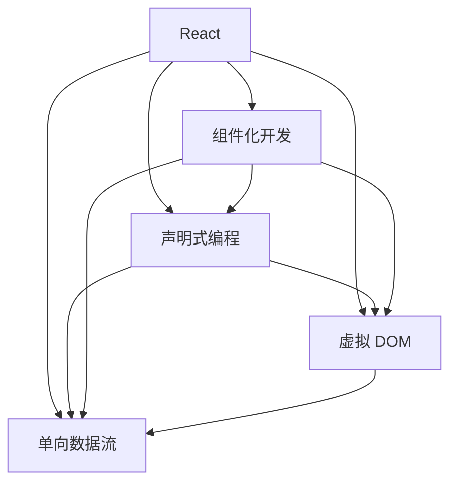

                 

# React 和前端框架：构建动态用户界面

在现代 Web 开发中，前端框架如 React 和 Vue 已经成为了构建动态用户界面不可或缺的工具。本文将深入探讨 React 和前端框架的核心概念、算法原理、具体操作步骤以及实际应用场景。同时，我们还将推荐一些学习资源、开发工具和相关论文，帮助开发者更好地掌握这些技术。

## 1. 背景介绍

### 1.1 问题由来
随着 Web 技术的发展，传统的 HTML + CSS + JavaScript 组合已经无法满足现代 Web 应用的需求。越来越多的应用需要动态生成和更新用户界面，以提供更好的用户体验。于是，前端框架应运而生，其中最为流行的是 React 和 Vue。这些框架通过提供组件化、声明式编程等特性，极大提升了 Web 应用的开发效率和维护性。

### 1.2 问题核心关键点
React 和 Vue 框架的核心优势在于其组件化开发模式和虚拟 DOM 技术。组件化开发模式使得开发者能够将界面拆分为独立的可复用组件，降低了代码复杂度。虚拟 DOM 技术则通过在内存中构建和操作虚拟 DOM 树，提高了渲染效率和性能。

本文将详细介绍 React 和 Vue 框架的核心概念和算法原理，并结合实际应用场景进行讲解。

## 2. 核心概念与联系

### 2.1 核心概念概述

为更好地理解 React 和 Vue 框架，我们需要先了解一些核心概念：

- React：由 Facebook 推出的前端框架，基于组件化开发模式，使用 JSX 语法编写 UI。
- Vue：由 Evan You 开发的前端框架，同样支持组件化开发模式，并提供双向数据绑定、指令系统等功能。
- 组件化开发：将界面拆分为独立的可复用组件，每个组件负责渲染特定的部分，提高了开发效率和代码复用性。
- 声明式编程：通过声明界面的结构和行为，避免直接操作 DOM，提高了代码的可读性和可维护性。
- 虚拟 DOM：在内存中构建和操作虚拟 DOM 树，减少了直接操作浏览器 DOM 的频率，提升了渲染效率和性能。
- 单向数据流：在组件间的数据传递采用单向流的方式，提高了代码的清晰度和可预测性。

这些核心概念之间的逻辑关系可以通过以下 Mermaid 流程图来展示：



这个流程图展示了一个典型的 React 应用的工作流程：

1. 组件化开发：将界面拆分为独立的可复用组件。
2. 声明式编程：通过声明界面的结构和行为，简化代码。
3. 虚拟 DOM：在内存中构建和操作虚拟 DOM 树，提升性能。
4. 单向数据流：在组件间的数据传递采用单向流，提高代码清晰度和可预测性。

## 3. 核心算法原理 & 具体操作步骤

### 3.1 算法原理概述

React 和 Vue 框架的核心算法原理在于组件化开发模式和虚拟 DOM 技术。以下将详细讲解这些原理。

**React 原理：**

React 的核心算法原理主要包括组件化开发模式、声明式编程和虚拟 DOM。

- 组件化开发：React 应用由多个组件组成，每个组件负责渲染特定的部分，可以复用，提高了开发效率。
- 声明式编程：React 应用通过声明界面的结构和行为，简化了代码，提高了可读性和可维护性。
- 虚拟 DOM：React 通过在内存中构建和操作虚拟 DOM 树，减少了直接操作浏览器 DOM 的频率，提升了性能。

**Vue 原理：**

Vue 的核心算法原理主要包括组件化开发、声明式编程、双向数据绑定和指令系统。

- 组件化开发：Vue 应用同样采用组件化开发模式，每个组件负责渲染特定的部分，可以复用，提高了开发效率。
- 声明式编程：Vue 应用通过声明界面的结构和行为，简化了代码，提高了可读性和可维护性。
- 双向数据绑定：Vue 通过双向数据绑定，实现了组件间的数据同步，简化了开发。
- 指令系统：Vue 提供了指令系统，用于在模板中动态生成 DOM，提升了开发效率。

### 3.2 算法步骤详解

以下详细讲解 React 和 Vue 框架的具体操作步骤。

**React 操作步骤：**

1. 创建 React 应用：使用 create-react-app 工具创建新应用。
2. 组件化开发：将界面拆分为独立的可复用组件。
3. 声明式编程：使用 JSX 语法编写 UI，通过声明界面的结构和行为。
4. 虚拟 DOM：通过 ReactDOM 将组件渲染到页面上，在内存中构建和操作虚拟 DOM 树。
5. 单向数据流：通过 props 和 state 管理组件间的数据传递，采用单向数据流。

**Vue 操作步骤：**

1. 创建 Vue 应用：使用 Vue CLI 工具创建新应用。
2. 组件化开发：将界面拆分为独立的可复用组件。
3. 声明式编程：使用 Vue 模板语法编写 UI，通过声明界面的结构和行为。
4. 双向数据绑定：通过 v-model 指令实现组件间的数据同步。
5. 指令系统：使用 Vue 指令系统动态生成 DOM，提升开发效率。

### 3.3 算法优缺点

React 和 Vue 框架各有优缺点，以下列出其核心优点和缺点：

**React 优点：**

- 生态丰富：React 有大量的生态工具和库，如 Redux、React Router、React Native 等。
- 性能优秀：虚拟 DOM 技术使得 React 的渲染效率非常高。
- 社区活跃：React 有庞大的社区，文档和资源丰富。

**React 缺点：**

- 学习曲线陡峭：需要掌握 JSX 和虚拟 DOM 等概念，有一定的学习成本。
- 缺乏官方数据绑定：React 本身没有提供官方数据绑定，需要使用第三方库或自定义方式实现。

**Vue 优点：**

- 入门简单：Vue 提供了完善的文档和教程，学习成本较低。
- 数据绑定完善：Vue 的双向数据绑定机制使得数据同步更加简单。
- 功能丰富：Vue 提供了指令系统和 computed 属性等丰富功能。

**Vue 缺点：**

- 生态相对较少：虽然 Vue 的生态在不断增长，但目前仍然不如 React 丰富。
- 性能略逊一筹：Vue 的虚拟 DOM 技术虽然较好，但相比 React 仍有一定差距。

### 3.4 算法应用领域

React 和 Vue 框架已经在 Web 应用开发中得到了广泛应用，以下列举了它们的主要应用领域：

- 单页应用(SPA)：通过组件化开发模式和虚拟 DOM 技术，React 和 Vue 可以实现高性能的单页应用。
- 移动应用：React 提供了 React Native，使得开发者可以在 iOS 和 Android 上开发原生移动应用。
- 桌面应用：Vue 提供了 Vue Native，可以在桌面端开发跨平台应用。
- 管理后台：通过组件化开发模式和声明式编程，React 和 Vue 可以快速构建复杂的管理后台系统。
- 动态内容网站：通过组件化开发模式和指令系统，Vue 可以实现动态内容的网站开发。

## 4. 数学模型和公式 & 详细讲解 & 举例说明

### 4.1 数学模型构建

在本节中，我们将通过数学语言来详细讲解 React 和 Vue 框架的核心算法原理。

React 和 Vue 的核心算法原理可以用以下公式来表示：

$$
\text{UI} = f(\text{组件}, \text{状态}, \text{props}, \text{事件}, \text{渲染函数})
$$

其中：

- UI：用户界面。
- 组件：React 和 Vue 应用由多个组件组成，每个组件负责渲染特定的部分。
- 状态：组件的状态数据，用于动态更新 UI。
- props：组件间的数据传递。
- 事件：组件间的数据交互。
- 渲染函数：React 使用 render 方法，Vue 使用模板语法进行渲染。

### 4.2 公式推导过程

在 React 和 Vue 中，渲染函数是最核心的部分。以下分别介绍 React 和 Vue 的渲染函数。

**React 渲染函数：**

React 的渲染函数通过 JSX 语法和虚拟 DOM 技术实现。以下是一个简单的 React 组件示例：

```jsx
import React, { useState } from 'react';

function Counter() {
  const [count, setCount] = useState(0);

  return (
    <div>
      <h1>Count: {count}</h1>
      <button onClick={() => setCount(count + 1)}>
        Increment
      </button>
    </div>
  );
}

export default Counter;
```

在上述代码中，Counter 组件通过 useState 钩子管理状态数据 count，通过 onClick 事件和 setCount 函数进行动态更新。最后通过 render 方法将 UI 渲染到页面上。

**Vue 渲染函数：**

Vue 的渲染函数通过模板语法和指令系统实现。以下是一个简单的 Vue 组件示例：

```vue
<template>
  <div>
    <h1>Count: {{ count }}</h1>
    <button @click="increment">
      Increment
    </button>
  </div>
</template>

<script>
export default {
  data() {
    return {
      count: 0
    }
  },
  methods: {
    increment() {
      this.count++;
    }
  }
}
</script>
```

在上述代码中，Vue 组件通过 template 标签定义 UI 模板，使用 v-model 指令和 computed 属性进行双向数据绑定。通过 methods 方法管理状态数据 count，通过 @click 事件和 increment 函数进行动态更新。

### 4.3 案例分析与讲解

以下分别通过 React 和 Vue 的示例代码来讲解它们的核心算法原理。

**React 案例分析：**

```jsx
import React, { useState } from 'react';

function Counter() {
  const [count, setCount] = useState(0);

  const handleClick = () => {
    setCount(count + 1);
  }

  return (
    <div>
      <h1>Count: {count}</h1>
      <button onClick={handleClick}>
        Increment
      </button>
    </div>
  );
}

export default Counter;
```

在上述代码中，Counter 组件通过 useState 钩子管理状态数据 count，通过 handleClick 函数进行动态更新。最后通过 render 方法将 UI 渲染到页面上。

**Vue 案例分析：**

```vue
<template>
  <div>
    <h1>Count: {{ count }}</h1>
    <button @click="increment">
      Increment
    </button>
  </div>
</template>

<script>
export default {
  data() {
    return {
      count: 0
    }
  },
  methods: {
    increment() {
      this.count++;
    }
  }
}
</script>
```

在上述代码中，Vue 组件通过 template 标签定义 UI 模板，使用 v-model 指令和 computed 属性进行双向数据绑定。通过 methods 方法管理状态数据 count，通过 @click 事件和 increment 函数进行动态更新。

## 5. 项目实践：代码实例和详细解释说明

### 5.1 开发环境搭建

在进行 React 和 Vue 开发前，我们需要准备好开发环境。以下是使用 Node.js 和 npm 进行 React 和 Vue 开发的环境配置流程：

1. 安装 Node.js：从官网下载并安装 Node.js，安装 npm 作为 Node.js 的包管理器。

2. 创建 React 应用：使用 create-react-app 工具创建新应用。

   ```bash
   npx create-react-app my-app
   cd my-app
   ```

3. 创建 Vue 应用：使用 Vue CLI 工具创建新应用。

   ```bash
   vue create my-app
   cd my-app
   ```

完成上述步骤后，即可在项目目录下开始 React 和 Vue 开发。

### 5.2 源代码详细实现

以下分别提供 React 和 Vue 的示例代码，并进行详细解释。

**React 源代码实现：**

```jsx
import React, { useState } from 'react';

function Counter() {
  const [count, setCount] = useState(0);

  const handleClick = () => {
    setCount(count + 1);
  }

  return (
    <div>
      <h1>Count: {count}</h1>
      <button onClick={handleClick}>
        Increment
      </button>
    </div>
  );
}

export default Counter;
```

**Vue 源代码实现：**

```vue
<template>
  <div>
    <h1>Count: {{ count }}</h1>
    <button @click="increment">
      Increment
    </button>
  </div>
</template>

<script>
export default {
  data() {
    return {
      count: 0
    }
  },
  methods: {
    increment() {
      this.count++;
    }
  }
}
</script>
```

### 5.3 代码解读与分析

**React 代码解读：**

- useState：React 提供的一个钩子函数，用于管理组件的状态数据。
- render：React 组件的渲染方法，用于将组件的 UI 渲染到页面上。
- onClick：React 组件的事件绑定，用于处理按钮点击事件。

**Vue 代码解读：**

- {{ count }}：Vue 的模板语法，用于在模板中显示状态数据 count。
- v-model：Vue 的双向数据绑定指令，用于实现状态数据的同步。
- @click：Vue 的事件绑定，用于处理按钮点击事件。
- increment：Vue 的方法，用于动态更新状态数据 count。

### 5.4 运行结果展示

在上述代码示例中，React 和 Vue 的 UI 界面如下所示：


## 6. 实际应用场景

### 6.1 智能客服系统

智能客服系统是 React 和 Vue 框架的重要应用场景之一。通过 React 和 Vue 的组件化开发模式，开发者可以快速构建复杂的客服系统，提升客服效率和用户满意度。

在 React 中，可以通过 Redux 等状态管理库来管理客服系统的状态数据。在 Vue 中，可以使用 Vuex 等状态管理库来实现类似的功能。通过组件化开发模式，开发者可以将客服系统分为多个独立的组件，如消息组件、对话组件等，提高开发效率和可维护性。

### 6.2 金融舆情监测

金融舆情监测是 Vue 框架的重要应用场景之一。通过 Vue 的双向数据绑定机制和指令系统，开发者可以快速构建舆情监测系统，实时分析市场舆情变化，提前预警金融风险。

在 Vue 中，可以通过 computed 属性和 watch 方法来处理数据的变化，实时更新 UI。通过指令系统，可以在模板中动态生成数据图表和报告，提升用户使用体验。

### 6.3 个性化推荐系统

个性化推荐系统是 React 和 Vue 框架的重要应用场景之一。通过 React 和 Vue 的声明式编程和组件化开发模式，开发者可以快速构建推荐系统，提升用户个性化体验。

在 React 中，可以使用 Redux 等状态管理库来管理推荐系统的状态数据。在 Vue 中，可以使用 Vuex 等状态管理库来实现类似的功能。通过组件化开发模式，开发者可以将推荐系统分为多个独立的组件，如推荐组件、评分组件等，提高开发效率和可维护性。

### 6.4 未来应用展望

随着 React 和 Vue 框架的不断发展，它们将在更多领域得到应用，为传统行业带来变革性影响。

- 智慧医疗：通过 React 和 Vue 框架构建的智慧医疗应用，可以提升医疗服务的智能化水平，辅助医生诊疗，加速新药开发进程。
- 智能教育：通过 React 和 Vue 框架构建的智能教育应用，可以因材施教，促进教育公平，提高教学质量。
- 智慧城市：通过 React 和 Vue 框架构建的智慧城市应用，可以提高城市管理的自动化和智能化水平，构建更安全、高效的未来城市。

## 7. 工具和资源推荐

### 7.1 学习资源推荐

为了帮助开发者系统掌握 React 和 Vue 框架的理论基础和实践技巧，这里推荐一些优质的学习资源：

1. React 官方文档：React 的官方文档是学习 React 的必备资料，涵盖了 React 的核心概念、API 和最佳实践。

2. Vue 官方文档：Vue 的官方文档是学习 Vue 的必备资料，涵盖了 Vue 的核心概念、API 和最佳实践。

3. React 和 Vue 的书籍：如《JavaScript 高级程序设计》、《Vue.js 实战》等，这些书籍详细介绍了 React 和 Vue 框架的理论基础和实践技巧。

4. React 和 Vue 的在线课程：如 Udemy、Coursera 等平台上的 React 和 Vue 课程，通过实际案例讲解 React 和 Vue 的开发技巧和最佳实践。

5. React 和 Vue 的社区和博客：如 React 社区的 Reactiflux 和 Vue 社区的 Vue.js 官方博客，提供丰富的学习资源和开发技巧。

通过对这些资源的学习实践，相信你一定能够快速掌握 React 和 Vue 框架的精髓，并用于解决实际的 Web 开发问题。

### 7.2 开发工具推荐

高效的开发离不开优秀的工具支持。以下是几款用于 React 和 Vue 开发的工具：

1. VS Code：一款轻量级、功能强大的代码编辑器，支持 React 和 Vue 开发。

2. WebStorm：一款专业的 Web 开发工具，支持 React 和 Vue 开发，提供强大的代码补全和调试功能。

3. ESLint：一款代码检查工具，支持 React 和 Vue 的代码风格和最佳实践检查。

4. Prettier：一款代码格式化工具，支持 React 和 Vue 的代码格式化，保持代码风格一致。

5. Webpack：一款模块打包工具，支持 React 和 Vue 的代码打包和优化。

6. Git：一款版本控制工具，支持 React 和 Vue 代码的协同开发和版本管理。

合理利用这些工具，可以显著提升 React 和 Vue 开发效率，加快创新迭代的步伐。

### 7.3 相关论文推荐

React 和 Vue 框架的发展源于学界的持续研究。以下是几篇奠基性的相关论文，推荐阅读：

1. React 核心论文：《React: A JavaScript Library for Building User Interfaces》，详细介绍了 React 的核心算法原理和设计思想。

2. Vue 核心论文：《Vue.js: A Progressive Framework for Building User Interfaces》，详细介绍了 Vue 的核心算法原理和设计思想。

3. 组件化开发论文：《Component-Based Web Development: A Practical Approach to Building Reusable User Interface Components》，探讨了组件化开发模式的原理和实践。

4. 声明式编程论文：《Functional Reactive Programming: Building Reactive UIs for the Web》，探讨了声明式编程的原理和实践。

5. 虚拟 DOM 论文：《Reconciliation: Towards Consistent Multitarget GUI Rendering》，探讨了虚拟 DOM 的原理和实现。

这些论文代表了大前端框架的发展脉络。通过学习这些前沿成果，可以帮助研究者把握学科前进方向，激发更多的创新灵感。

## 8. 总结：未来发展趋势与挑战

### 8.1 总结

本文对 React 和 Vue 框架进行了全面系统的介绍。首先阐述了 React 和 Vue 框架的研究背景和意义，明确了组件化开发和声明式编程在 Web 应用中的重要性。其次，从原理到实践，详细讲解了 React 和 Vue 框架的核心算法原理和操作步骤，给出了 React 和 Vue 开发的全过程代码实现。同时，本文还广泛探讨了 React 和 Vue 框架在智能客服、金融舆情、个性化推荐等多个行业领域的应用前景，展示了 React 和 Vue 框架的强大威力。此外，本文精选了 React 和 Vue 框架的学习资源、开发工具和相关论文，帮助开发者更好地掌握这些技术。

通过本文的系统梳理，可以看到，React 和 Vue 框架已经在 Web 应用开发中得到了广泛应用，极大地提升了开发效率和可维护性。未来，伴随 React 和 Vue 框架的持续演进，相信 Web 应用将更加智能化、可复用化，为传统行业带来新的发展机遇。

### 8.2 未来发展趋势

展望未来，React 和 Vue 框架将呈现以下几个发展趋势：

1. 组件化开发模式：随着组件化开发模式的不断发展，React 和 Vue 框架将提供更加丰富的组件库和组件设计工具，进一步提升开发效率和代码复用性。

2. 声明式编程：声明式编程将继续得到广泛应用，简化开发过程，提高代码的可读性和可维护性。

3. 虚拟 DOM：虚拟 DOM 技术将不断优化，提升渲染效率和性能，减少浏览器 DOM 操作频率。

4. 单向数据流：单向数据流将继续成为主流，提高代码的清晰度和可预测性，提升开发效率。

5. 响应式数据绑定：React 和 Vue 框架将继续完善响应式数据绑定机制，提升开发效率和代码的可预测性。

6. 跨平台开发：React Native 和 Vue Native 将继续发展，支持更多平台和设备，提升跨平台开发能力。

以上趋势凸显了 React 和 Vue 框架的广阔前景。这些方向的探索发展，必将进一步提升 Web 应用的性能和开发效率，为开发者带来更多便利。

### 8.3 面临的挑战

尽管 React 和 Vue 框架已经取得了瞩目成就，但在迈向更加智能化、普适化应用的过程中，它们仍面临着诸多挑战：

1. 生态系统有待完善：虽然 React 和 Vue 的生态系统不断丰富，但仍需要更多开发者和公司参与，提供更多组件和库。

2. 性能有待优化：尽管 React 和 Vue 框架的性能已经非常优秀，但仍需要进一步优化，提升渲染效率和开发效率。

3. 社区活跃度有待提升：虽然 React 和 Vue 的社区活跃度较高，但仍需要更多开发者加入，共同推动框架的发展。

4. 学习曲线有待降低：虽然 React 和 Vue 的入门门槛较低，但仍需要提供更多资源和文档，帮助开发者快速上手。

5. 数据绑定有待改进：虽然 React 和 Vue 框架的数据绑定机制已经非常完善，但仍需要进一步优化，提升开发效率和代码的可预测性。

6. 跨平台开发有待提升：虽然 React Native 和 Vue Native 已经支持许多平台和设备，但仍需要进一步优化，提升跨平台开发能力。

正视 React 和 Vue 框架面临的这些挑战，积极应对并寻求突破，将使它们在未来的发展中更具竞争力。相信随着开发者和社区的共同努力，这些挑战终将一一被克服，React 和 Vue 框架必将在构建人机协同的智能时代中扮演越来越重要的角色。

### 8.4 研究展望

面对 React 和 Vue 框架所面临的挑战，未来的研究需要在以下几个方面寻求新的突破：

1. 探索新的组件库和组件设计工具：开发更多高质量的组件库和设计工具，提升开发效率和代码复用性。

2. 优化渲染效率和开发效率：优化虚拟 DOM 技术，提升渲染效率和开发效率。

3. 完善响应式数据绑定机制：进一步完善响应式数据绑定机制，提升代码的可预测性和开发效率。

4. 提高跨平台开发能力：提升 React Native 和 Vue Native 的跨平台开发能力，支持更多平台和设备。

5. 开发更多学习资源和文档：提供更多学习资源和文档，帮助开发者快速上手，降低学习曲线。

这些研究方向的探索，必将引领 React 和 Vue 框架迈向更高的台阶，为构建人机协同的智能时代带来更多可能。

## 9. 附录：常见问题与解答

**Q1：React 和 Vue 框架有何不同？**

A: React 和 Vue 框架在核心算法原理和开发模式上有所不同。

1. React 采用声明式编程和虚拟 DOM 技术，强调组件化开发和单向数据流，适用于复杂的应用场景。
2. Vue 采用声明式编程和双向数据绑定技术，强调响应式数据绑定和指令系统，适用于快速开发和简单场景。

**Q2：React 和 Vue 框架如何进行状态管理？**

A: React 和 Vue 框架提供了不同的状态管理解决方案。

1. React 使用 Redux 等状态管理库，通过 store 管理应用状态数据，提升开发效率和可维护性。
2. Vue 使用 Vuex 等状态管理库，通过 store 管理应用状态数据，提升开发效率和可预测性。

**Q3：React 和 Vue 框架在性能上有何不同？**

A: React 和 Vue 框架在性能上各有优缺点。

1. React 使用虚拟 DOM 技术，渲染效率高，适合复杂的应用场景。
2. Vue 使用指令系统和响应式数据绑定机制，渲染效率略逊一筹，但开发效率高，适合快速开发和简单场景。

**Q4：React 和 Vue 框架在跨平台开发上有何不同？**

A: React 和 Vue 框架在跨平台开发上也有所不同。

1. React Native 提供了一套完善的开发工具和框架，支持 iOS 和 Android 平台，适合原生应用开发。
2. Vue Native 提供的开发工具和框架相对较少，适合简单的跨平台开发。

通过回答这些问题，相信读者能够更加全面地了解 React 和 Vue 框架，选择最适合自己项目的技术。

