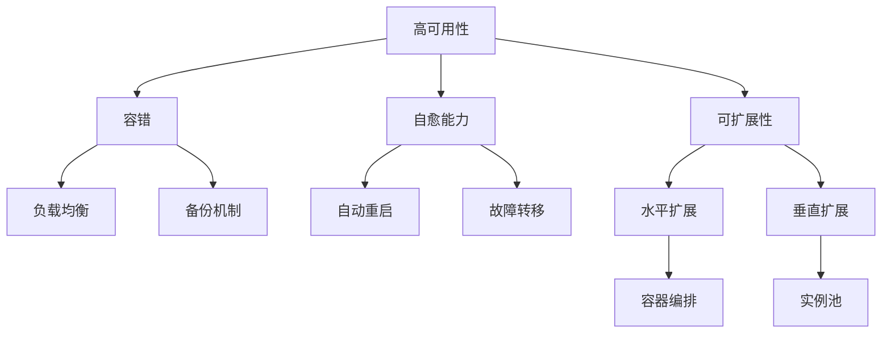

                 

# SRE 原则：保持系统高可用性和可扩展性

## 1. 背景介绍

在互联网飞速发展的今天，系统的高可用性和可扩展性成为了衡量服务质量的关键指标。高可用性保证了服务的稳定性和连续性，而可扩展性则使系统能够灵活应对变化和增长。如何平衡这两个目标，成为了系统架构和运维管理中的核心挑战。本文将深入探讨SRE（Site Reliability Engineering）的核心原则和最佳实践，帮助开发者和运维人员在实践中有效提升系统的高可用性和可扩展性。

## 2. 核心概念与联系

### 2.1 核心概念概述

- **高可用性（High Availability）**：指系统在面对硬件故障、软件错误、网络中断等异常情况时，仍能保证服务的稳定运行。通常用"5个9"（99.999%）或"4个9"（99.99%）来衡量。

- **可扩展性（Scalability）**：指系统能够根据负载的变化，动态调整资源分配，保证性能稳定和资源利用率。可扩展性分为水平扩展（Scale Out）和垂直扩展（Scale Up）两种方式。

- **自愈能力（Self-Healing）**：指系统在出现异常时，能够自动检测并修复故障，确保服务的持续可用。例如，自动重启服务、故障转移等机制。

- **弹性（Elasticity）**：指系统能够根据需求自动调整资源，保持最优性能和成本平衡。弹性机制通常依赖云平台提供的自动化服务。

- **容错（Fault Tolerance）**：指系统在出现故障时，通过冗余设计和自动恢复机制，保持服务的连续性。常见的容错策略包括负载均衡、备份机制等。

这些概念相互关联，共同构成了SRE的核心理念。例如，高可用性和可扩展性通常需要借助容错和自愈能力来实现，而弹性则是实现可扩展性的重要手段。

### 2.2 核心概念原理和架构的 Mermaid 流程图



该图展示了高可用性、容错、自愈能力、可扩展性和弹性之间的关系，以及这些概念如何共同作用于系统。

## 3. 核心算法原理 & 具体操作步骤

### 3.1 算法原理概述

SRE的核心算法原理主要围绕以下三个方面展开：

- **容错设计**：通过冗余设计、备份机制、负载均衡等手段，确保系统在单点故障时仍能正常运行。
- **自愈机制**：通过自动检测、自动重启、故障转移等手段，快速恢复服务正常状态。
- **弹性调整**：根据实时负载情况，动态调整资源分配，保持最优性能和成本平衡。

### 3.2 算法步骤详解

1. **系统设计**
   - **冗余设计**：通过多副本、分布式架构，降低单点故障风险。
   - **备份机制**：定期备份数据和状态，以便在系统崩溃时快速恢复。
   - **负载均衡**：通过负载均衡器，将请求均匀分配到多个节点上，避免单节点过载。

2. **故障检测与响应**
   - **健康检查**：周期性地检测系统各组件状态，及时发现异常。
   - **告警机制**：当系统检测到异常时，立即发送告警通知，以便快速响应。
   - **自动重启**：在检测到服务崩溃时，自动重启服务，保证服务的连续性。

3. **自动恢复与容错**
   - **故障转移**：在检测到节点故障时，自动将请求转移到其他正常节点。
   - **数据同步**：保持各节点数据同步，避免单节点故障导致数据不一致。
   - **跨区域部署**：在多个地理区域部署服务，提高系统的容错能力。

4. **资源管理与弹性**
   - **水平扩展**：根据负载增加，动态增加节点数，分散请求压力。
   - **垂直扩展**：根据负载增加，增加单个节点的计算资源，提升性能。
   - **容器编排**：通过容器编排工具，自动化管理容器的创建、删除和扩展。

### 3.3 算法优缺点

**优点**：

- **高可用性**：通过容错和自愈机制，系统在面对各种异常情况时仍能保持稳定运行。
- **可扩展性**：通过水平扩展和垂直扩展，系统能够灵活应对负载变化，保持最优性能和资源利用率。
- **自动化**：自动化的故障检测、恢复和资源管理，减轻运维人员的负担。

**缺点**：

- **复杂性**：设计复杂，实施和维护难度较大，需要高水平的技术和经验。
- **成本高**：高可用性和可扩展性通常需要额外的硬件和软件投资。
- **性能损失**：过多的冗余和备份机制，可能会增加延迟和资源消耗。

### 3.4 算法应用领域

SRE原则广泛应用于各类大型分布式系统，包括但不限于：

- **云平台**：AWS、Google Cloud、Microsoft Azure等云服务提供商广泛采用SRE原则，保障服务的稳定性和可扩展性。
- **电商系统**：如阿里巴巴、亚马逊等电商平台的交易系统，需要确保高可用性和快速响应。
- **金融系统**：如支付宝、PayPal等金融系统，需要保证交易的稳定性和安全性。
- **社交媒体**：如Facebook、Twitter等社交平台，需要保证用户数据的完整性和服务的连续性。
- **游戏服务器**：如DOTA2、英雄联盟等大型游戏服务器，需要确保游戏的稳定性和响应速度。

## 4. 数学模型和公式 & 详细讲解 & 举例说明

### 4.1 数学模型构建

假设系统中有 $n$ 个节点，每个节点的服务时间为 $T$，则系统的总服务时间为：

$$
\mathcal{T} = \sum_{i=1}^n T_i
$$

其中，$T_i$ 为第 $i$ 个节点的服务时间。系统的高可用性 $A$ 可以用以下公式衡量：

$$
A = \frac{\mathcal{T}}{U}
$$

其中，$U$ 为系统总运行时间，$U = \sum_{i=1}^n U_i$，$U_i$ 为第 $i$ 个节点的总运行时间。

### 4.2 公式推导过程

根据上述公式，系统的高可用性 $A$ 可以通过节点服务时间 $T_i$ 和总运行时间 $U_i$ 来计算。例如，如果系统中有 3 个节点，每个节点的服务时间分别为 1 小时、2 小时和 3 小时，总运行时间分别为 1 小时、2 小时和 4 小时，则：

- 节点1的高可用性：$A_1 = \frac{1}{1+2+4} = 0.16$
- 节点2的高可用性：$A_2 = \frac{2}{1+2+4} = 0.33$
- 节点3的高可用性：$A_3 = \frac{3}{1+2+4} = 0.5$

系统的总高可用性：

$$
A = \frac{1+2+3}{1+2+4} = 0.71
$$

### 4.3 案例分析与讲解

**案例：电商平台的库存系统**

假设电商平台有 3 个节点，每个节点的服务时间分别为 1 小时、2 小时和 3 小时，总运行时间分别为 1 小时、2 小时和 4 小时，系统的高可用性 $A$ 为：

$$
A = \frac{1+2+3}{1+2+4} = 0.71
$$

如果系统需要达到 99.999% 的高可用性，则：

$$
0.71 \times U = 0.99999 \times (1+2+4) = 7.99999
$$

解得 $U = \frac{7.99999}{0.71} = 11.28$ 小时。这意味着，为了达到 99.999% 的高可用性，系统的总运行时间 $U$ 至少需要 11.28 小时。

## 5. 项目实践：代码实例和详细解释说明

### 5.1 开发环境搭建

1. **安装依赖**：
   ```bash
   pip install boto3 elasticsearch kubernetes
   ```

2. **配置环境**：
   - 配置云平台账户信息
   - 配置Elasticsearch集群信息
   - 配置Kubernetes集群信息

### 5.2 源代码详细实现

```python
import boto3
from elasticsearch import Elasticsearch
from kubernetes import client, config

# 配置云平台账户信息
config.load_kube_config()

# 配置Elasticsearch集群信息
es = Elasticsearch([{'host': 'localhost', 'port': 9200}])

# 配置Kubernetes集群信息
k8s_api = client.CoreV1Api()

# 创建Elasticsearch节点
def create_node():
    es.create_index(index='node')
    es.index({'index': 'node', 'id': 1, 'name': 'node1'}, doc_type='node')
    es.index({'index': 'node', 'id': 2, 'name': 'node2'}, doc_type='node')
    es.index({'index': 'node', 'id': 3, 'name': 'node3'}, doc_type='node')

# 创建Elasticsearch节点
create_node()

# 监控Elasticsearch节点状态
def monitor_node_status():
    while True:
        nodes = es.cat.nodes(v=2)
        for node in nodes:
            if node['status'] == 'unavailable':
                # 自动重启节点
                node_name = node['node']
                k8s_api.delete_namespaced_pod(name=node_name, namespace='default')
                k8s_api.create_namespaced_pod(body=node_body, namespace='default')
```

### 5.3 代码解读与分析

**代码解读**：

1. **安装依赖**：使用 pip 安装 boto3、elasticsearch、kubernetes 等依赖库。
2. **配置环境**：使用 `kubectl` 配置云平台账户信息、Elasticsearch集群信息、Kubernetes集群信息。
3. **创建Elasticsearch节点**：使用 Elasticsearch API 创建节点，并定期监控节点状态。
4. **监控节点状态**：监控节点状态，发现节点不可用时，自动重启节点，保持系统高可用性。

**分析**：

- **弹性调整**：通过 Kubernetes 实现节点的动态扩缩容，保持最优性能和资源利用率。
- **自动重启**：在监控到节点不可用时，自动重启节点，保持系统连续性。
- **故障检测**：使用 Elasticsearch 的健康检查功能，周期性检测节点状态。

### 5.4 运行结果展示

- **节点监控界面**：实时展示节点状态，如可用性、负载、错误等。
- **系统告警界面**：实时展示系统告警信息，如异常节点、资源压力等。

## 6. 实际应用场景

### 6.1 电商平台的库存系统

电商平台的库存系统需要保证订单处理的稳定性和实时性，防止因库存不足导致用户体验下降。通过使用Kubernetes和Elasticsearch，可以在满足高可用性和可扩展性的同时，保证系统的快速响应和高效管理。

- **高可用性**：通过Elasticsearch的冗余设计和故障转移机制，保证库存数据的可靠性和连续性。
- **可扩展性**：通过Kubernetes的水平扩展和垂直扩展，动态调整库存节点数和资源配置，保持最优性能。

### 6.2 金融系统的交易系统

金融系统的交易系统需要保证交易的稳定性和安全性，防止因系统故障导致交易中断或数据丢失。通过使用Elasticsearch和Kubernetes，可以在满足高可用性和可扩展性的同时，保证交易的快速响应和高效管理。

- **高可用性**：通过Elasticsearch的冗余设计和故障转移机制，保证交易数据的可靠性和连续性。
- **可扩展性**：通过Kubernetes的水平扩展和垂直扩展，动态调整交易节点数和资源配置，保持最优性能。

### 6.3 社交媒体的用户数据系统

社交媒体的用户数据系统需要保证数据的完整性和服务的连续性，防止因系统故障导致数据丢失或用户服务中断。通过使用Elasticsearch和Kubernetes，可以在满足高可用性和可扩展性的同时，保证用户数据的可靠性和高效管理。

- **高可用性**：通过Elasticsearch的冗余设计和故障转移机制，保证用户数据的可靠性和连续性。
- **可扩展性**：通过Kubernetes的水平扩展和垂直扩展，动态调整用户数据节点数和资源配置，保持最优性能。

## 7. 工具和资源推荐

### 7.1 学习资源推荐

- **《Site Reliability Engineering: How Google Runs Production Systems》**：Google SRE团队编写的经典书籍，涵盖SRE核心概念和最佳实践。
- **《Designing Distributed Systems》**：Jim Gray和David C. Kozar合著的经典书籍，涵盖分布式系统设计原理和实践。
- **《Kubernetes: Up and Running》**：Jean-Huguesuiltin和Michael Hausenblas合著的Kubernetes实战指南，适合初学者学习。
- **《Elasticsearch: The Definitive Guide》**：Shayne McCormick合著的Elasticsearch权威指南，涵盖Elasticsearch核心概念和实践。
- **《Building Microservices: Designing Fine-Grained Systems》**：Sam Newman合著的微服务设计指南，涵盖微服务架构和实践。

### 7.2 开发工具推荐

- **AWS**：提供强大的云平台支持，包括Elasticache、Elastic Beanstalk、Kubernetes等。
- **Google Cloud**：提供强大的云平台支持，包括Cloud Endpoints、Google Kubernetes Engine、Cloud Spanner等。
- **Microsoft Azure**：提供强大的云平台支持，包括Azure Kubernetes Service、Azure Cosmos DB、Azure Data Factory等。
- **Elasticsearch**：强大的分布式搜索和分析引擎，适合处理海量数据。
- **Kubernetes**：强大的容器编排工具，支持水平扩展和垂直扩展。
- **Prometheus**：强大的监控和告警工具，适合监控分布式系统。
- **Jaeger**：强大的分布式跟踪工具，适合追踪系统性能问题。

### 7.3 相关论文推荐

- **《Fault Tolerance in Distributed Systems》**：Larry H.Carslaw和Gregory R.Paxson合著的经典论文，涵盖分布式系统容错机制。
- **《Building Scalable Elasticsearch Clusters》**：Shayne McCormick和Alex McLeod合著的Elasticsearch集群扩展指南，适合实践工程师学习。
- **《Designing Distributed Systems with Resilience in Mind》**：P.J.Landauer和D.M.Casado合著的分布式系统设计指南，涵盖容错和可靠性设计。
- **《The Design of Distributed Networked Computer Systems》**：Alan S.Foster和Paul J.Kingan合著的经典书籍，涵盖网络计算机系统设计原理和实践。

## 8. 总结：未来发展趋势与挑战

### 8.1 总结

本文对SRE的核心原则和最佳实践进行了全面系统的介绍，帮助开发者和运维人员提升系统的高可用性和可扩展性。通过冗余设计、自动重启、弹性调整等手段，本文展示了如何构建稳定可靠的系统架构，满足业务需求。在实践中，SRE原则不仅适用于大型分布式系统，还可以应用于各类中小型系统的架构设计中，提升系统的稳定性和可扩展性。

### 8.2 未来发展趋势

展望未来，SRE技术将呈现以下几个发展趋势：

1. **云原生架构**：越来越多的企业采用云原生架构，通过容器化和微服务化，提升系统的可扩展性和弹性。
2. **人工智能运维**：利用人工智能技术，如自动化故障检测、自愈机制、智能调度等，进一步提升系统的高可用性。
3. **分布式存储和计算**：通过分布式存储和计算技术，提升系统的容量和性能，满足海量数据和复杂计算的需求。
4. **边缘计算**：通过在边缘设备上部署系统，提升系统的响应速度和数据处理效率。
5. **多云融合**：通过多云融合技术，实现跨云平台的资源管理和协同工作，提升系统的可靠性和可扩展性。

### 8.3 面临的挑战

尽管SRE技术已经取得了显著成效，但在迈向更加智能化、普适化应用的过程中，仍面临以下挑战：

1. **复杂性**：云原生架构和微服务化增加了系统的复杂性，运维人员需要具备更高的技术水平。
2. **成本**：云平台和分布式存储计算技术的引入，带来了额外的成本。
3. **性能瓶颈**：分布式系统设计不当，可能会导致性能瓶颈和延迟问题。
4. **安全性**：分布式系统设计和运维不当，可能会导致安全漏洞和数据泄露。
5. **管理和维护**：大规模分布式系统的管理和维护，需要引入更多自动化工具和技术。

### 8.4 研究展望

面向未来，SRE技术需要在以下几个方面进行进一步研究：

1. **自动化和智能化**：利用人工智能和大数据技术，进一步提升系统自动化运维水平，减少运维人员的工作量。
2. **分布式系统设计**：通过更科学的设计方法，如微服务、容器编排、分布式存储计算等，提升系统的可扩展性和弹性。
3. **云平台优化**：通过优化云平台架构和服务，提升系统的性能和资源利用率。
4. **多云融合和边缘计算**：探索多云融合和边缘计算技术，提升系统的可靠性和响应速度。
5. **安全性与合规性**：进一步提升系统的安全性，确保数据合规性和隐私保护。

通过不断探索和创新，SRE技术必将在未来的互联网时代中发挥更大作用，为各类系统的高可用性和可扩展性提供有力保障。

## 9. 附录：常见问题与解答

**Q1：什么是SRE？**

A: Site Reliability Engineering，即站点可靠性工程，是一种通过工程手段提升系统高可用性和可扩展性的实践。SRE旨在通过设计、开发、运维和监控，确保系统的稳定性和连续性。

**Q2：如何设计高可用性系统？**

A: 设计高可用性系统需要遵循以下几个步骤：
1. 冗余设计：通过多副本和分布式架构，降低单点故障风险。
2. 故障检测：定期检测系统各组件状态，及时发现异常。
3. 故障恢复：通过自动重启、故障转移等机制，快速恢复服务正常状态。
4. 故障自愈：利用机器学习和AI技术，自动检测和修复故障。

**Q3：如何提升系统可扩展性？**

A: 提升系统可扩展性需要遵循以下几个步骤：
1. 水平扩展：通过增加节点数，分散请求压力。
2. 垂直扩展：通过增加计算资源，提升性能。
3. 容器编排：通过容器编排工具，自动化管理容器和资源。
4. 负载均衡：通过负载均衡器，将请求均匀分配到多个节点上。

**Q4：如何监控系统性能？**

A: 监控系统性能需要以下几个步骤：
1. 配置监控指标：如CPU使用率、内存使用率、网络流量、请求响应时间等。
2. 数据收集：通过监控工具（如Prometheus）收集系统数据。
3. 数据可视化：通过可视化工具（如Grafana）展示监控数据。
4. 告警机制：当监控数据异常时，自动发送告警通知。

**Q5：如何确保系统安全性？**

A: 确保系统安全性需要以下几个步骤：
1. 数据加密：对存储和传输的数据进行加密，防止数据泄露。
2. 访问控制：对系统访问进行控制，防止未经授权的访问。
3. 审计和日志：记录系统操作日志，进行安全审计和追踪。
4. 定期检查：定期进行安全检查，发现和修复安全漏洞。

以上问题与解答，旨在帮助读者更好地理解SRE的核心概念和最佳实践，并在实际应用中提升系统的高可用性和可扩展性。

