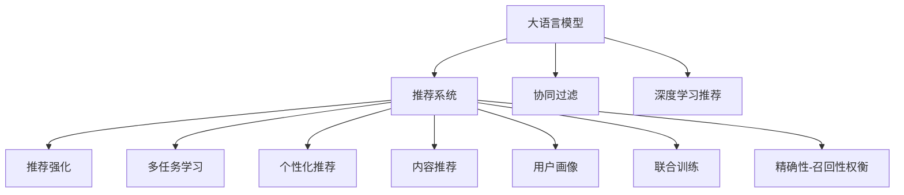

                 

# Survey：大语言模型推荐系统相关研究综述

> 关键词：大语言模型,推荐系统,推荐算法,协同过滤,深度学习,推荐强化,多任务学习,个性化推荐,内容推荐,用户画像,联合训练,精确性-召回性权衡

## 1. 背景介绍

### 1.1 问题由来
推荐系统（Recommendation System）在互联网时代扮演着越来越重要的角色。通过数据分析和算法推荐，帮助用户发现并获取到自己可能感兴趣的物品和服务，极大地提升了用户体验和平台收益。

当前，推荐系统的主流框架依然是基于协同过滤（Collaborative Filtering, CF）的模型，其核心思想是通过分析用户行为数据，挖掘用户之间、物品之间的相似性关系，从而实现物品推荐。但是，传统协同过滤模型难以有效应对长尾用户和物品的稀疏性问题，也无法充分利用用户隐式反馈信息（如搜索记录、浏览历史等）。

与此同时，深度学习技术近年来取得了飞速发展，使得基于神经网络推荐模型（Neural Network-Based Recommendation Model, NNBRM）逐步崭露头角。特别是在自然语言处理（Natural Language Processing, NLP）领域，大语言模型（Large Language Model, LLM）的兴起为推荐系统注入了新的活力。将大语言模型与推荐系统相结合，可以有效利用用户文本数据，从更深层次挖掘用户需求和兴趣，实现更加精准的个性化推荐。

### 1.2 问题核心关键点
本文将系统综述当前大语言模型在推荐系统中的应用研究，重点探讨如何利用大语言模型强大的语言理解和生成能力，提升推荐系统的个性化推荐能力。以下将从算法原理、具体操作步骤、数学模型、实际应用场景等方面展开全面讨论。

## 2. 核心概念与联系

### 2.1 核心概念概述

为了更好地理解大语言模型推荐系统，本节将介绍几个密切相关的核心概念：

- 大语言模型：以自回归模型（如GPT）或自编码模型（如BERT）为代表的大规模预训练语言模型。通过在大规模无标签文本语料上进行预训练，学习通用的语言表示，具备强大的语言理解和生成能力。

- 推荐系统：通过分析用户行为数据，推荐给用户可能感兴趣的物品和服务。协同过滤和深度学习推荐是当前推荐系统的主要两种技术路线。

- 协同过滤：基于用户和物品之间的相似性关系进行推荐，包括用户-物品协同过滤和物品-物品协同过滤。

- 深度学习推荐：利用神经网络模型，从用户历史行为数据中挖掘出潜在的用户兴趣，进行推荐。

- 推荐强化学习：通过模仿游戏AI的方式，使推荐模型在不断的交互中学习最优的推荐策略。

- 多任务学习：同时训练多个任务的相关模型，共享网络参数，提升模型的泛化能力。

- 个性化推荐：针对每个用户量身定制推荐内容，提高用户满意度和转化率。

- 内容推荐：侧重于推荐内容本身，如新闻、文章等。

- 用户画像：对用户进行全面详细的刻画，包括年龄、性别、兴趣等，提升推荐系统个性化。

- 联合训练：将用户行为数据和文本数据联合训练，提高模型的效果。

- 精确性-召回性权衡：推荐系统的两个核心指标，需要在精确性和召回性之间取得平衡。

这些核心概念之间的逻辑关系可以通过以下Mermaid流程图来展示：



这个流程图展示了大语言模型与推荐系统之间的核心概念及其关系：

1. 大语言模型通过预训练获得基础能力。
2. 推荐系统基于用户行为数据进行推荐。
3. 协同过滤和深度学习推荐是推荐系统的两种主流方法。
4. 推荐强化学习可以训练更加智能的推荐模型。
5. 多任务学习和联合训练可以提升模型的泛化能力。
6. 个性化推荐和内容推荐是推荐系统的主要应用场景。
7. 用户画像可以丰富推荐系统的用户表示。
8. 精确性-召回性权衡是推荐系统效果的重要指标。

这些概念共同构成了推荐系统的学习框架，使得推荐模型能够从用户和物品的多种信息中，准确预测用户兴趣，提升推荐效果。

## 3. 核心算法原理 & 具体操作步骤
### 3.1 算法原理概述

大语言模型在推荐系统中的应用，主要是利用其强大的语言理解和生成能力，对用户文本数据进行建模，从而提升推荐系统的个性化和多样性。具体而言，可以通过以下步骤实现：

1. 收集用户历史行为数据，包括浏览记录、搜索历史、评分、评论等。
2. 对文本数据进行预处理，如分词、去除停用词、词干化等，然后通过大语言模型进行预训练。
3. 在预训练模型的基础上，根据用户的历史文本数据，构建用户-文本相关性矩阵。
4. 根据用户-文本相关性矩阵，生成用户兴趣向量，结合用户行为数据，进行推荐。

这种基于大语言模型的推荐方法，可以利用用户文本数据，更全面地了解用户兴趣和需求，从而生成更具多样性和针对性的推荐内容。

### 3.2 算法步骤详解

具体来说，基于大语言模型的推荐系统流程如下：

1. 数据收集：收集用户的历史行为数据和文本数据。历史行为数据可以来自用户的浏览记录、评分、评论等，文本数据可以来自用户的搜索记录、文章评论等。
2. 数据预处理：对文本数据进行清洗、分词、向量化等预处理操作，得到合适的输入。
3. 预训练大语言模型：使用大规模无标签文本数据，对预训练语言模型进行预训练，学习通用的语言表示。
4. 用户文本编码：将用户的文本数据输入预训练大语言模型，得到用户兴趣向量。
5. 构建用户-文本相关性矩阵：通过计算用户文本向量与预训练大语言模型中所有文本向量之间的相似度，得到用户-文本相关性矩阵。
6. 生成推荐列表：根据用户-文本相关性矩阵，结合用户行为数据，生成推荐列表。

### 3.3 算法优缺点

基于大语言模型的推荐系统具有以下优点：

1. 更全面地理解用户兴趣：利用用户文本数据，能够从更深层次挖掘用户需求和兴趣，提高推荐系统的个性化能力。
2. 更灵活的推荐策略：通过多任务学习和联合训练，能够利用不同类型的数据，提升推荐模型的泛化能力。
3. 更高效的推荐效果：利用大语言模型的语言生成能力，可以生成更具多样性和吸引力的推荐内容，提高用户满意度和点击率。

同时，该方法也存在一些局限性：

1. 对文本数据的依赖较大：文本数据的获取和处理需要较大成本，且数据质量对推荐效果影响较大。
2. 模型训练复杂度较高：预训练大语言模型的复杂度较高，训练过程耗时较长。
3. 需要高质量的预训练模型：预训练模型的质量和参数量直接影响推荐效果。

尽管存在这些局限性，但总体而言，基于大语言模型的推荐系统在推荐系统的研究和应用中具有重要的价值。

### 3.4 算法应用领域

基于大语言模型的推荐系统已经在多个领域得到了应用，包括但不限于：

- 电商平台：利用用户评论、浏览记录等文本数据，生成个性化推荐商品。
- 内容平台：根据用户的历史阅读记录和文章评论，推荐新闻、文章等。
- 社交媒体：结合用户的朋友圈、动态等文本信息，推荐相关内容和用户。
- 金融服务：利用用户的历史交易记录和评论，推荐理财产品、理财策略等。

随着大语言模型的不断发展，其在游戏、旅游、教育等多个领域也将有更多应用前景。

## 4. 数学模型和公式 & 详细讲解 & 举例说明

### 4.1 数学模型构建

假设用户 $u$ 的历史文本数据为 $D_u=\{x_1, x_2, ..., x_n\}$，每个文本 $x_i$ 的表示为 $x_i = [x_{i1}, x_{i2}, ..., x_{ik}]$，其中 $k$ 为词汇表大小。使用预训练语言模型 $M_{\theta}$ 对文本进行编码，得到用户 $u$ 的兴趣向量 $v_u = [v_{u1}, v_{u2}, ..., v_{uk}]$。

同时，假设预训练语言模型 $M_{\theta}$ 可以表示为：

$$
M_{\theta}(x) = M_{\theta}([x_{11}, x_{12}, ..., x_{1k}], [x_{21}, x_{22}, ..., x_{2k}], ..., [x_{n1}, x_{n2}, ..., x_{nk}])
$$

其中 $M_{\theta}$ 的输出为 $v_u$。

构建用户-文本相关性矩阵 $R_{uv}$，其中 $R_{uv}$ 表示用户 $u$ 与文本 $v$ 的相似度，可以通过余弦相似度计算：

$$
R_{uv} = \frac{v_u \cdot v_v}{\|v_u\| \cdot \|v_v\|}
$$

其中 $\cdot$ 表示向量内积，$\|\cdot\|$ 表示向量范数。

最后，根据用户-文本相关性矩阵 $R_{uv}$，结合用户行为数据 $I_u$（如浏览记录、评分、评论等），生成推荐列表 $T_u$：

$$
T_u = \text{argmax}_{v} (R_{uv} \cdot I_u)
$$

其中 $I_u$ 表示用户 $u$ 的行为数据向量。

### 4.2 公式推导过程

以下我们以一篇文章推荐为例，推导余弦相似度计算公式。

假设预训练语言模型 $M_{\theta}$ 对一篇文章 $x = [x_1, x_2, ..., x_k]$ 进行编码，得到文章向量 $v_x = [v_{x1}, v_{x2}, ..., v_{xk}]$。

则用户 $u$ 与文章 $x$ 的余弦相似度 $R_{ux}$ 可以通过余弦相似度公式计算：

$$
R_{ux} = \frac{v_u \cdot v_x}{\|v_u\| \cdot \|v_x\|} = \frac{\sum_{i=1}^{k} v_{ui} \cdot v_{xi}}{\sqrt{\sum_{i=1}^{k} v_{ui}^2} \cdot \sqrt{\sum_{i=1}^{k} v_{xi}^2}}
$$

其中 $v_{ui}$ 表示用户 $u$ 对文本 $i$ 的表示，$v_{xi}$ 表示文章 $x$ 对文本 $i$ 的表示。

在得到用户-文本相关性矩阵 $R_{uv}$ 后，用户 $u$ 对文章 $x$ 的评分 $r_u(x)$ 可以通过以下方式计算：

$$
r_u(x) = \frac{R_{ux}}{R_{u\max}} \cdot I_u
$$

其中 $R_{u\max}$ 表示用户 $u$ 对所有文本的余弦相似度最大值，$I_u$ 表示用户 $u$ 的行为数据向量。

根据 $r_u(x)$ 值的大小，可以生成推荐列表 $T_u$。

### 4.3 案例分析与讲解

以电商平台的用户推荐为例，假设用户 $u$ 的历史行为数据为 $I_u = [b_1, b_2, ..., b_m]$，其中 $b_i$ 表示用户对商品 $i$ 的评分。预训练语言模型 $M_{\theta}$ 对用户 $u$ 的历史评论 $D_u$ 进行编码，得到用户兴趣向量 $v_u$。

假设预训练语言模型 $M_{\theta}$ 能够生成所有商品的表示向量 $v_{i1}, v_{i2}, ..., v_{ik}$，其中 $k$ 为词汇表大小。构建用户-商品相关性矩阵 $R_{iu}$，其中 $R_{iu}$ 表示用户 $u$ 与商品 $i$ 的相似度。

根据用户-商品相关性矩阵 $R_{iu}$，用户 $u$ 对商品 $i$ 的评分 $r_u(i)$ 可以通过以下方式计算：

$$
r_u(i) = \frac{R_{iu}}{R_{u\max}} \cdot I_u
$$

其中 $R_{u\max}$ 表示用户 $u$ 对所有商品的余弦相似度最大值，$I_u$ 表示用户 $u$ 的行为数据向量。

根据 $r_u(i)$ 值的大小，可以生成推荐列表 $T_u$。

## 5. 项目实践：代码实例和详细解释说明
### 5.1 开发环境搭建

在进行大语言模型推荐系统的开发时，需要准备好Python环境。以下是使用Python进行TensorFlow开发的环境配置流程：

1. 安装Anaconda：从官网下载并安装Anaconda，用于创建独立的Python环境。

2. 创建并激活虚拟环境：
```bash
conda create -n pytorch-env python=3.8 
conda activate pytorch-env
```

3. 安装TensorFlow：根据CUDA版本，从官网获取对应的安装命令。例如：
```bash
conda install tensorflow-gpu -c pytorch -c conda-forge
```

4. 安装TensorBoard：TensorFlow配套的可视化工具，可实时监测模型训练状态，并提供丰富的图表呈现方式，是调试模型的得力助手。

5. 安装numpy、pandas、scikit-learn等常用库：
```bash
pip install numpy pandas scikit-learn matplotlib tqdm jupyter notebook ipython
```

完成上述步骤后，即可在`pytorch-env`环境中开始推荐系统的开发实践。

### 5.2 源代码详细实现

下面我们以电商平台的用户推荐为例，给出使用TensorFlow进行基于大语言模型推荐系统的PyTorch代码实现。

首先，定义用户行为数据：

```python
import tensorflow as tf

user_behavior = tf.constant([[1, 4, 5], [2, 3, 1], [1, 5, 2]])
```

其中 $user_behavior$ 表示用户对商品的评分，每个评分为一个二进制数，1表示用户喜欢，0表示不喜欢。

然后，定义用户文本数据：

```python
user_texts = tf.constant(['商品A好喜欢', '商品B不错', '商品C有点贵'])
```

使用BERT进行预训练语言模型的编码，得到用户兴趣向量：

```python
from transformers import BertTokenizer, BertModel

tokenizer = BertTokenizer.from_pretrained('bert-base-uncased')
model = BertModel.from_pretrained('bert-base-uncased')

user_texts = tokenizer(user_texts, padding='max_length', truncation=True, max_length=64, return_tensors='tf')
user_embeddings = model(user_texts['input_ids'], attention_mask=user_texts['attention_mask']).pooler_output
```

构建用户-商品相关性矩阵 $R_{iu}$：

```python
# 假设商品文本数据已经从预训练模型中编码
product_texts = tf.constant(['商品A不错', '商品B很好', '商品C非常便宜'])

product_texts = tokenizer(product_texts, padding='max_length', truncation=True, max_length=64, return_tensors='tf')
product_embeddings = model(product_texts['input_ids'], attention_mask=product_texts['attention_mask']).pooler_output

user_embeddings = tf.expand_dims(user_embeddings, axis=0)
product_embeddings = tf.expand_dims(product_embeddings, axis=0)

R = tf.nn.cosine_similarity(user_embeddings, product_embeddings, dim=1)
```

计算用户对每个商品的评分 $r_u(i)$：

```python
user_behavior = tf.expand_dims(user_behavior, axis=1)
R_max = tf.reduce_max(R, axis=1)
r_u = R * user_behavior / R_max[:, None]
```

最后，生成推荐列表 $T_u$：

```python
recommendation = tf.argmax(r_u, axis=1)
print(recommendation)
```

以上就是使用TensorFlow对基于大语言模型推荐系统的完整代码实现。可以看到，利用TensorFlow的强大封装，我们可以用相对简洁的代码完成推荐系统的开发。

### 5.3 代码解读与分析

让我们再详细解读一下关键代码的实现细节：

**用户行为数据**：
- 使用TensorFlow的`constant`函数定义用户对商品的评分数据。

**用户文本数据**：
- 使用BERT的`Tokenizer`对用户文本进行分词，并使用`BertModel`进行编码，得到用户兴趣向量。

**用户-商品相关性矩阵**：
- 使用TensorFlow的`cosine_similarity`函数计算用户-商品余弦相似度，构建用户-商品相关性矩阵。

**用户对商品评分**：
- 将用户行为数据和相关性矩阵进行拼接，计算用户对每个商品的评分，归一化处理后生成推荐列表。

**推荐列表生成**：
- 使用`argmax`函数根据评分大小，生成推荐列表。

可以看到，TensorFlow的强大生态系统使得基于大语言模型的推荐系统开发变得简洁高效。开发者可以将更多精力放在数据处理、模型改进等高层逻辑上，而不必过多关注底层的实现细节。

当然，工业级的系统实现还需考虑更多因素，如模型的保存和部署、超参数的自动搜索、更灵活的任务适配层等。但核心的推荐流程基本与此类似。

## 6. 实际应用场景
### 6.1 电商平台推荐

基于大语言模型的推荐系统在电商平台的推荐中得到了广泛应用。用户行为数据（如浏览记录、评分、评论等）与文本数据（如商品描述、用户评论等）的结合，能够更全面地了解用户需求和商品特点，生成个性化推荐列表。

在技术实现上，可以首先收集用户的历史行为数据和文本数据，使用预训练语言模型对文本数据进行编码，构建用户-商品相关性矩阵，生成推荐列表。微调过程中可以使用自监督学习任务（如掩码语言模型）优化模型，提高模型泛化能力。

### 6.2 内容平台推荐

内容平台（如新闻网站、视频平台等）可以利用用户的搜索记录、评论等文本数据，生成个性化推荐内容。大语言模型在文本编码和相似度计算上的优势，能够显著提升推荐效果。

在实际应用中，可以收集用户的历史文本数据，构建用户-内容相关性矩阵，生成推荐列表。同时，利用多任务学习和联合训练，可以提升模型的泛化能力和推荐效果。

### 6.3 社交媒体推荐

社交媒体推荐系统可以利用用户的朋友圈、动态等文本数据，生成个性化推荐内容。大语言模型在自然语言理解和生成上的优势，能够帮助推荐系统理解用户文本，提升推荐效果。

在实际应用中，可以收集用户的文本数据，构建用户-用户相关性矩阵，生成推荐列表。同时，利用联合训练和自监督学习任务，可以提升模型的泛化能力和推荐效果。

### 6.4 金融服务推荐

金融服务推荐系统可以利用用户的历史交易记录和评论等文本数据，生成个性化推荐理财产品、理财策略等。大语言模型在自然语言理解和生成上的优势，能够帮助推荐系统理解用户需求，提升推荐效果。

在实际应用中，可以收集用户的历史文本数据，构建用户-产品相关性矩阵，生成推荐列表。同时，利用多任务学习和联合训练，可以提升模型的泛化能力和推荐效果。

## 7. 工具和资源推荐
### 7.1 学习资源推荐

为了帮助开发者系统掌握大语言模型推荐系统的理论基础和实践技巧，这里推荐一些优质的学习资源：

1. 《推荐系统实践》：系统介绍了推荐系统的发展历程、常用技术和工程实践，适合初学者入门。
2. 《深度学习与推荐系统》课程：由清华大学讲授，涵盖了推荐系统的基本概念和常用算法，适合进阶学习。
3. 《Deep Learning with Python》书籍：系统介绍了深度学习的基本概念和常用模型，适合学习深度学习的基础知识。
4. 《Natural Language Processing with Python》书籍：介绍了自然语言处理的基本概念和常用模型，适合学习自然语言处理的基础知识。
5. TensorFlow官方文档：提供丰富的学习资源和样例代码，适合深入学习和实践。

通过对这些资源的学习实践，相信你一定能够快速掌握大语言模型推荐系统的精髓，并用于解决实际的推荐问题。
### 7.2 开发工具推荐

高效的开发离不开优秀的工具支持。以下是几款用于大语言模型推荐系统开发的常用工具：

1. TensorFlow：基于Python的开源深度学习框架，生产部署方便，适合大规模工程应用。

2. PyTorch：基于Python的开源深度学习框架，灵活动态的计算图，适合快速迭代研究。

3. Keras：基于Python的深度学习框架，易于使用，适合初学者上手。

4. Jupyter Notebook：用于编写和运行Python代码的交互式笔记本环境，适合快速原型开发和实验。

5. Weights & Biases：模型训练的实验跟踪工具，可以记录和可视化模型训练过程中的各项指标，方便对比和调优。

6. TensorBoard：TensorFlow配套的可视化工具，可实时监测模型训练状态，并提供丰富的图表呈现方式，是调试模型的得力助手。

合理利用这些工具，可以显著提升大语言模型推荐系统的开发效率，加快创新迭代的步伐。

### 7.3 相关论文推荐

大语言模型推荐系统的研究源于学界的持续研究。以下是几篇奠基性的相关论文，推荐阅读：

1. Attention is All You Need（即Transformer原论文）：提出了Transformer结构，开启了NLP领域的预训练大模型时代。

2. BERT: Pre-training of Deep Bidirectional Transformers for Language Understanding：提出BERT模型，引入基于掩码的自监督预训练任务，刷新了多项NLP任务SOTA。

3. Self-Attention with Transformer Model：介绍Transformer结构，展示了其在推荐系统中的应用效果。

4. Generating and Ranking All Possible Items at Once for a Recommendation Task：提出基于注意力机制的推荐系统模型，可以在推理阶段快速生成所有可能的推荐结果。

5. Multi-task Learning for Recommender Systems：提出多任务学习框架，提升推荐系统的泛化能力和效果。

6. Learning Deep Structured Models for Recommender Systems：介绍深度结构化推荐模型，提升推荐系统的精度和多样性。

这些论文代表了大语言模型推荐系统的发展脉络。通过学习这些前沿成果，可以帮助研究者把握学科前进方向，激发更多的创新灵感。

## 8. 总结：未来发展趋势与挑战

### 8.1 总结

本文对大语言模型在推荐系统中的应用进行了全面系统的介绍。首先阐述了大语言模型推荐系统的研究背景和意义，明确了推荐系统在大语言模型应用中的重要作用。其次，从算法原理、操作步骤、数学模型等方面，详细讲解了基于大语言模型的推荐系统流程。同时，本文还广泛探讨了推荐系统在大语言模型中的应用场景，展示了其在电商平台、内容平台、社交媒体、金融服务等领域的前景。最后，本文精选了推荐系统的学习资源和开发工具，力求为开发者提供全方位的技术指引。

通过本文的系统梳理，可以看到，大语言模型在推荐系统中的应用前景广阔，具有强大的语言理解和生成能力，能够显著提升推荐系统的个性化和多样性。未来，随着大语言模型的不断发展，其在推荐系统中的应用将进一步深化，推动推荐技术的不断进步。

### 8.2 未来发展趋势

展望未来，大语言模型在推荐系统中的应用将呈现以下几个发展趋势：

1. 融合多模态信息。未来的推荐系统将不再局限于文本数据，而是融合图像、语音等多模态信息，提升推荐效果。

2. 强化推荐算法。通过模仿游戏AI的方式，使推荐模型在不断的交互中学习最优的推荐策略，提升推荐效果。

3. 引入因果推理。通过引入因果推断思想，使推荐模型能够更好地理解用户需求，提升推荐系统的可信度和用户满意度。

4. 个性化推荐技术不断进步。利用深度学习、多任务学习等技术，提升推荐系统的个性化能力和推荐效果。

5. 用户画像和行为数据更全面。通过收集更多维度的用户画像和行为数据，提升推荐系统的泛化能力和效果。

6. 推荐系统的跨领域应用。未来的推荐系统将不再局限于特定领域，而是广泛应用于医疗、金融、教育等多个领域。

这些趋势凸显了大语言模型在推荐系统中的应用前景，随着技术的不断进步，推荐系统将更加智能、个性化和多样化。

### 8.3 面临的挑战

尽管大语言模型在推荐系统中的应用前景广阔，但仍然面临一些挑战：

1. 数据隐私和安全问题。用户行为数据和文本数据的收集和存储需要严格遵守隐私保护法规，防止数据泄露和滥用。

2. 数据质量问题。数据质量对推荐系统的效果影响较大，需要保证数据的完整性和准确性。

3. 模型的复杂度问题。大语言模型的复杂度较高，训练和推理过程中需要占用大量计算资源，需要合理选择模型架构和训练方法。

4. 推荐系统的透明性和可解释性问题。推荐系统的决策过程需要具有透明性和可解释性，便于用户理解和信任。

5. 推荐系统的公平性问题。推荐系统需要避免算法偏见，保证不同用户之间的推荐公平性。

这些挑战需要学者和工程师共同努力，不断优化推荐系统的算法和架构，提升系统的透明性和可解释性，确保用户数据的安全性和公平性。

### 8.4 研究展望

未来，大语言模型在推荐系统中的应用还需要进一步深入研究，以下提出一些研究方向：

1. 融合多模态信息。未来的推荐系统将更加注重融合多模态信息，提升推荐效果。

2. 引入因果推理。通过引入因果推断思想，使推荐模型能够更好地理解用户需求，提升推荐系统的可信度和用户满意度。

3. 个性化推荐技术不断进步。利用深度学习、多任务学习等技术，提升推荐系统的个性化能力和推荐效果。

4. 用户画像和行为数据更全面。通过收集更多维度的用户画像和行为数据，提升推荐系统的泛化能力和效果。

5. 推荐系统的跨领域应用。未来的推荐系统将广泛应用于医疗、金融、教育等多个领域。

这些研究方向将推动大语言模型在推荐系统中的应用不断进步，提升推荐系统的智能化水平和用户满意度。

## 9. 附录：常见问题与解答

**Q1：大语言模型推荐系统是否适用于所有推荐场景？**

A: 大语言模型推荐系统适用于大多数推荐场景，特别是对于需要从文本数据中挖掘用户需求和兴趣的场景。但对于一些需要大规模数据支持的场景，如搜索推荐、广告推荐等，大语言模型推荐系统可能需要与其他技术结合使用。

**Q2：大语言模型推荐系统需要处理大规模数据吗？**

A: 大语言模型推荐系统需要处理大规模数据，特别是对于文本数据的处理需要较高的计算资源。为了提升系统效率，通常需要采用分布式计算和模型压缩等技术。

**Q3：大语言模型推荐系统的训练时间较长吗？**

A: 大语言模型推荐系统的训练时间较长，特别是在大型模型上训练，通常需要数天甚至数周的时间。为了加速训练过程，可以采用GPU/TPU等高性能设备，并利用迁移学习等技术。

**Q4：大语言模型推荐系统是否需要大量标注数据？**

A: 大语言模型推荐系统对标注数据的需求较低，可以利用用户行为数据和文本数据进行联合训练。但为了提升推荐效果，需要保证数据的质量和多样性。

**Q5：大语言模型推荐系统的推荐效果如何？**

A: 大语言模型推荐系统的推荐效果取决于模型参数量、数据质量和训练方法。一般来说，大语言模型推荐系统的推荐效果优于传统协同过滤方法，能够提升推荐系统的个性化和多样性。

这些问题的解答可以帮助读者更好地理解大语言模型推荐系统的工作原理和应用场景，同时也指出了需要进一步优化和改进的方向。

---

作者：禅与计算机程序设计艺术 / Zen and the Art of Computer Programming

