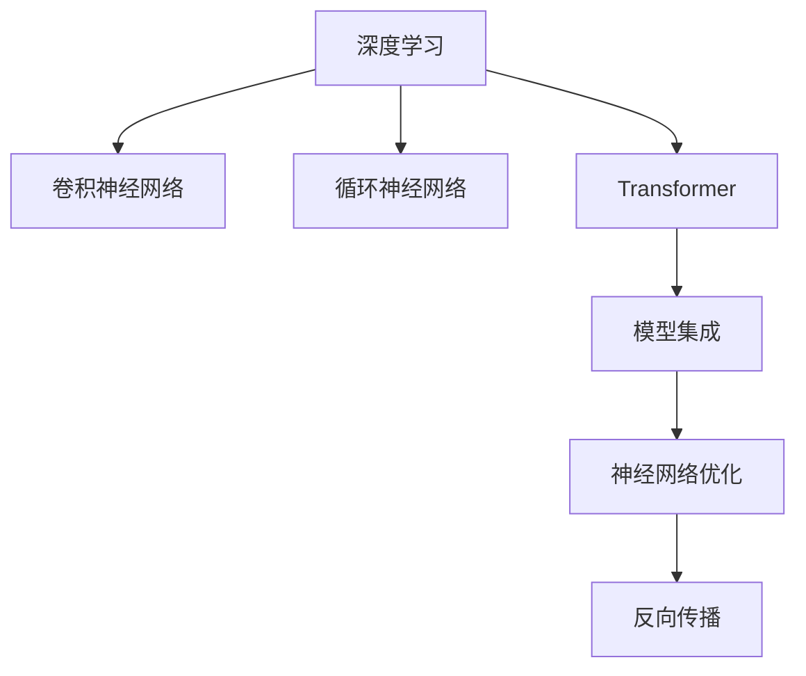

                 

# TensorFlow 进阶：高级神经网络技术

> 关键词：深度学习,神经网络,卷积神经网络,循环神经网络,Transformer,模型集成,神经网络优化,梯度下降,反向传播,卷积,循环,Transformer,模型优化,TensorFlow

## 1. 背景介绍

### 1.1 问题由来
深度学习作为当前人工智能领域最热门的研究方向之一，其核心在于利用神经网络结构模拟人脑对数据的处理和认知过程，通过大量的训练数据让模型不断调整自身的权重参数，从而实现对复杂问题的有效预测。TensorFlow作为深度学习的主流框架之一，以其灵活的计算图机制、高效的模型训练能力和丰富的工具支持，深受广大开发者和研究人员的青睐。然而，对于许多有志于深入探索神经网络内部机制，并希望在实际项目中构建高性能模型的开发者而言，TensorFlow的入门门槛较高，理解其核心概念和关键技术需要一定的数学和编程基础。因此，本文旨在为读者提供一份高级的TensorFlow技术指南，涵盖卷积神经网络、循环神经网络、Transformer等主流神经网络模型，以及模型集成、优化、部署等关键技术，帮助读者在深度学习领域更上一层楼。

### 1.2 问题核心关键点
深度学习的核心在于构建有效的网络结构，并通过大量数据训练模型，使其能够泛化到新的数据上。TensorFlow作为深度学习的重要工具，提供了丰富的API和工具支持，使得构建和训练复杂神经网络成为可能。但同时，TensorFlow也提供了从入门到高级的多种接口，满足不同层次用户的需求。本文将详细介绍TensorFlow的核心概念和高级技术，包括但不限于卷积神经网络(CNN)、循环神经网络(RNN)、Transformer等主流神经网络模型，以及模型集成、优化、部署等关键技术。通过本文的学习，读者将能够理解TensorFlow在实际应用中的高效性和灵活性，并掌握构建高性能模型的技巧。

## 2. 核心概念与联系

### 2.1 核心概念概述

为了更好地理解高级神经网络技术，本节将介绍几个密切相关的核心概念：

- **深度学习**：利用多层神经网络对数据进行建模和预测的一种机器学习方法。
- **卷积神经网络(CNN)**：一种专门处理图像和空间数据的神经网络，通过卷积和池化操作提取特征。
- **循环神经网络(RNN)**：一种能够处理序列数据的神经网络，通过循环层态的连接，可以处理变长的序列数据。
- **Transformer**：一种基于自注意力机制的神经网络，能够并行处理大规模数据，适用于自然语言处理(NLP)等领域。
- **模型集成**：将多个模型的预测结果进行集成，以提高整体的预测准确性。
- **神经网络优化**：通过梯度下降等方法调整模型参数，使得模型在训练集和测试集上的损失最小化。

这些核心概念之间的逻辑关系可以通过以下Mermaid流程图来展示：



这个流程图展示了一个深度学习模型的基本构建流程：

1. 使用深度学习框架构建神经网络。
2. 选择适合任务的神经网络结构，如卷积神经网络用于图像处理，循环神经网络用于序列数据处理，Transformer用于自然语言处理。
3. 集成多个模型以提升性能。
4. 通过反向传播等优化算法调整模型参数，使得模型在训练集和测试集上的损失最小化。

这些核心概念共同构成了深度学习的基本框架，使得神经网络能够处理复杂的数据结构，并应用于各种实际问题。通过理解这些核心概念，我们可以更好地把握TensorFlow的核心技术，并应用于实际项目的开发。

## 3. 核心算法原理 & 具体操作步骤
### 3.1 算法原理概述

高级神经网络技术，尤其是卷积神经网络、循环神经网络和Transformer等模型，是深度学习领域的重要组成部分。这些模型通过多层非线性变换，提取数据的高级特征，并在模型训练过程中通过反向传播算法不断调整权重参数，以最小化损失函数，从而实现对数据的有效建模和预测。

### 3.2 算法步骤详解

卷积神经网络(CNN)是一种专门用于图像处理的神经网络，其核心在于卷积和池化操作，能够有效提取图像中的局部特征。卷积操作通过滤波器在图像上滑动，提取不同尺度的特征，而池化操作则通过降采样减少特征图的大小，提高计算效率。以下是CNN模型的训练和推理步骤：

1. **构建模型**：首先，需要定义CNN模型的结构，包括卷积层、池化层、全连接层等。使用TensorFlow的tf.keras API可以快速构建CNN模型。
2. **准备数据**：将图像数据进行预处理，如归一化、裁剪、扩充等，并转换为模型所需的张量格式。
3. **训练模型**：使用训练集数据对模型进行训练，调整模型参数使得损失函数最小化。TensorFlow提供了多种优化算法，如Adam、SGD等，可以方便地进行模型训练。
4. **评估模型**：使用测试集数据对模型进行评估，计算模型在测试集上的准确率、精确率、召回率等指标。
5. **推理预测**：使用训练好的模型对新的图像数据进行推理预测，生成模型输出。

循环神经网络(RNN)是一种专门用于处理序列数据的神经网络，其核心在于循环层态的连接，能够处理变长的序列数据。RNN通过循环层的向前和向后传播，保存了序列中的历史信息，从而能够捕捉序列数据的时序特征。以下是RNN模型的训练和推理步骤：

1. **构建模型**：首先，需要定义RNN模型的结构，包括循环层、全连接层等。使用TensorFlow的tf.keras API可以快速构建RNN模型。
2. **准备数据**：将序列数据进行预处理，如分词、向量编码等，并转换为模型所需的张量格式。
3. **训练模型**：使用训练集数据对模型进行训练，调整模型参数使得损失函数最小化。TensorFlow提供了多种优化算法，如Adam、SGD等，可以方便地进行模型训练。
4. **评估模型**：使用测试集数据对模型进行评估，计算模型在测试集上的准确率、精确率、召回率等指标。
5. **推理预测**：使用训练好的模型对新的序列数据进行推理预测，生成模型输出。

Transformer是一种基于自注意力机制的神经网络，能够并行处理大规模数据，适用于自然语言处理(NLP)等领域。Transformer通过多头自注意力机制和位置编码，能够有效处理长序列数据，并减少计算复杂度。以下是Transformer模型的训练和推理步骤：

1. **构建模型**：首先，需要定义Transformer模型的结构，包括编码器、解码器、位置编码等。使用TensorFlow的tf.keras API可以快速构建Transformer模型。
2. **准备数据**：将文本数据进行预处理，如分词、向量编码等，并转换为模型所需的张量格式。
3. **训练模型**：使用训练集数据对模型进行训练，调整模型参数使得损失函数最小化。TensorFlow提供了多种优化算法，如Adam、SGD等，可以方便地进行模型训练。
4. **评估模型**：使用测试集数据对模型进行评估，计算模型在测试集上的准确率、精确率、召回率等指标。
5. **推理预测**：使用训练好的模型对新的文本数据进行推理预测，生成模型输出。

### 3.3 算法优缺点

卷积神经网络(CNN)具有以下优点：
1. 高效处理图像数据：卷积操作能够有效提取图像中的局部特征，池化操作则减少了计算量。
2. 具有局部连接和权值共享特性：通过局部连接和权值共享，降低了模型参数量，提高了计算效率。
3. 能够捕捉平移不变性：卷积操作对于图像的平移操作具有不变性，能够处理不同尺度的图像。

然而，CNN也存在以下缺点：
1. 难以捕捉复杂的空间关系：CNN主要用于处理图像数据，对于需要处理复杂空间关系的任务，效果可能不如其他神经网络结构。
2. 需要大量标注数据：CNN需要大量的标注数据进行训练，对于数据量不足的任务，效果可能不佳。

循环神经网络(RNN)具有以下优点：
1. 能够处理变长的序列数据：RNN通过循环层的连接，能够处理变长的序列数据，具有很强的时序特征建模能力。
2. 具有记忆功能：通过循环层的连接，RNN能够保存序列中的历史信息，从而能够捕捉时序变化规律。

然而，RNN也存在以下缺点：
1. 计算复杂度高：由于循环层的连接，RNN的计算复杂度较高，对于长序列数据的处理效率较低。
2. 梯度消失/爆炸问题：RNN在反向传播过程中，由于梯度累积或放大，可能出现梯度消失或爆炸问题，影响模型训练效果。

Transformer具有以下优点：
1. 能够并行处理大规模数据：Transformer通过多头自注意力机制，能够并行处理大规模数据，提高了计算效率。
2. 能够捕捉长序列依赖：Transformer通过位置编码和自注意力机制，能够有效处理长序列数据，捕捉复杂的序列依赖关系。

然而，Transformer也存在以下缺点：
1. 计算复杂度高：尽管Transformer能够并行处理大规模数据，但其自注意力机制的计算复杂度仍然较高，对于长序列数据的处理效率较低。
2. 难以捕捉局部特征：Transformer主要依赖自注意力机制进行特征提取，对于需要捕捉局部特征的任务，效果可能不如其他神经网络结构。

### 3.4 算法应用领域

高级神经网络技术在多个领域得到了广泛应用，例如：

- 计算机视觉：用于图像分类、目标检测、图像分割等任务，如使用卷积神经网络进行图像识别。
- 自然语言处理：用于文本分类、机器翻译、情感分析等任务，如使用Transformer进行机器翻译。
- 语音识别：用于语音转文本、说话人识别、语音情感分析等任务，如使用RNN进行语音识别。
- 时间序列分析：用于股票预测、天气预报、工业控制等任务，如使用循环神经网络进行时间序列预测。
- 强化学习：用于游戏智能、机器人控制、自动驾驶等任务，如使用卷积神经网络进行游戏图像处理。

除了上述这些经典任务外，高级神经网络技术还在更多新兴领域得到应用，如医学影像分析、金融预测、智慧城市等，为不同行业的智能化升级提供了新的解决方案。随着神经网络技术的不断进步，其应用范围将进一步拓展，带来更多的创新机会和挑战。

## 4. 数学模型和公式 & 详细讲解 & 举例说明
### 4.1 数学模型构建

在介绍高级神经网络技术的数学模型之前，我们需要先了解神经网络的基本结构和数学模型。假设我们有一个神经网络模型 $f(x; \theta)$，其中 $x$ 表示输入，$\theta$ 表示模型参数。神经网络通常由多层神经元组成，每一层神经元都会对输入进行线性变换和非线性变换。

以卷积神经网络为例，假设输入图像 $x$ 的大小为 $m \times n \times c$，其中 $m$ 表示高度，$n$ 表示宽度，$c$ 表示通道数。卷积神经网络由多个卷积层和池化层组成，每个卷积层都会使用滤波器对输入进行卷积操作，提取不同尺度的特征。

### 4.2 公式推导过程

以下是卷积神经网络、循环神经网络和Transformer的数学模型推导过程：

#### 4.2.1 卷积神经网络

卷积神经网络的核心在于卷积操作和池化操作。卷积操作通过滤波器对输入进行卷积，提取不同尺度的特征。池化操作通过降采样减少特征图的大小，提高计算效率。

假设卷积层的滤波器大小为 $k \times k$，输入特征图大小为 $m \times n \times c$，输出特征图大小为 $m' \times n' \times c'$。卷积操作的计算公式为：

$$
f^{(i)}(x) = g(\sum_{j=0}^{c-1} w_{i,j} * x^{(j)} + b_i)
$$

其中 $x^{(j)}$ 表示输入特征图的第 $j$ 通道，$w_{i,j}$ 表示卷积核的第 $i$ 行第 $j$ 列的权重，$b_i$ 表示偏置项。

池化操作通过降采样减少特征图的大小，常见的池化操作包括最大池化、平均池化等。假设池化操作的窗口大小为 $k \times k$，特征图大小为 $m \times n \times c$，池化后的特征图大小为 $m' \times n' \times c'$。最大池化操作的计算公式为：

$$
f^{(i)}(x) = max_{i' \in [0,m') \cap [k \times i', k \times i' + k)} max_{j \in [0,n') \cap [k \times j, k \times j + k)} x^{(i',j)}
$$

其中 $x^{(i',j)}$ 表示特征图的第 $i'$ 行第 $j$ 列的元素。

#### 4.2.2 循环神经网络

循环神经网络的核心在于循环层态的连接，能够处理变长的序列数据。循环神经网络通过循环层的连接，保存了序列中的历史信息，从而能够捕捉时序变化规律。

假设循环神经网络的输入序列长度为 $t$，输出序列长度为 $t$，循环层输出为 $h_t$，隐藏状态为 $h_{t-1}$，循环层的计算公式为：

$$
h_t = f(h_{t-1}, x_t) = \sigma(W_h h_{t-1} + W_x x_t + b_h)
$$

其中 $W_h$ 和 $W_x$ 表示权重矩阵，$b_h$ 表示偏置项，$\sigma$ 表示激活函数，如tanh、ReLU等。

#### 4.2.3 Transformer

Transformer的核心在于多头自注意力机制和位置编码。Transformer通过多头自注意力机制，能够并行处理大规模数据，捕捉复杂的序列依赖关系。位置编码则用于解决自注意力机制中的位置信息丢失问题。

假设输入序列长度为 $t$，输出序列长度为 $t$，Transformer模型的计算公式为：

$$
y_t = AT_t x_t + BT_t h_t
$$

其中 $AT_t$ 和 $BT_t$ 表示自注意力机制和位置编码，$h_t$ 表示隐藏状态，$x_t$ 表示输入序列。

### 4.3 案例分析与讲解

以下以一个简单的图像分类任务为例，展示卷积神经网络、循环神经网络和Transformer的实现和效果：

假设我们要对一组手写数字图像进行分类，图像大小为 $28 \times 28 \times 1$，每个数字图像包含一个灰度通道。

1. **卷积神经网络**：使用卷积神经网络进行图像分类，可以设计一个简单的模型，包含两个卷积层、一个池化层和一个全连接层。首先，对输入图像进行卷积操作，提取不同尺度的特征，然后通过池化操作减少特征图的大小，最后通过全连接层进行分类。使用TensorFlow的tf.keras API可以快速构建卷积神经网络模型，代码如下：

```python
import tensorflow as tf

model = tf.keras.Sequential([
    tf.keras.layers.Conv2D(32, (3, 3), activation='relu', input_shape=(28, 28, 1)),
    tf.keras.layers.MaxPooling2D((2, 2)),
    tf.keras.layers.Flatten(),
    tf.keras.layers.Dense(10, activation='softmax')
])
```

2. **循环神经网络**：使用循环神经网络进行图像分类，可以将图像转换为序列数据，然后使用循环神经网络进行建模。首先，对输入图像进行分块处理，将每个块转换为序列数据，然后使用循环神经网络进行建模。使用TensorFlow的tf.keras API可以快速构建循环神经网络模型，代码如下：

```python
import tensorflow as tf

model = tf.keras.Sequential([
    tf.keras.layers.LSTM(64, input_shape=(28, 28)),
    tf.keras.layers.Dense(10, activation='softmax')
])
```

3. **Transformer**：使用Transformer进行图像分类，可以将图像转换为序列数据，然后使用Transformer进行建模。首先，对输入图像进行分块处理，将每个块转换为序列数据，然后使用Transformer进行建模。使用TensorFlow的tf.keras API可以快速构建Transformer模型，代码如下：

```python
import tensorflow as tf

model = tf.keras.Sequential([
    tf.keras.layers.Embedding(256, 512, input_length=28),
    tf.keras.layers.PositionalEncoding(512),
    tf.keras.layers.MultiHeadAttention(512, 8, dropout_rate=0.1),
    tf.keras.layers.LayerNormalization(),
    tf.keras.layers.FeedForward(512, dropout_rate=0.1),
    tf.keras.layers.Dense(10, activation='softmax')
])
```

在实际应用中，我们需要根据具体的任务需求选择合适的神经网络结构，并进行适当的调整和优化，以获得更好的性能。

## 5. 项目实践：代码实例和详细解释说明
### 5.1 开发环境搭建

在进行高级神经网络技术的项目实践前，我们需要准备好开发环境。以下是使用Python进行TensorFlow开发的环境配置流程：

1. 安装Anaconda：从官网下载并安装Anaconda，用于创建独立的Python环境。

2. 创建并激活虚拟环境：
```bash
conda create -n tensorflow-env python=3.8 
conda activate tensorflow-env
```

3. 安装TensorFlow：根据CUDA版本，从官网获取对应的安装命令。例如：
```bash
conda install tensorflow -c tensorflow -c conda-forge
```

4. 安装各类工具包：
```bash
pip install numpy pandas scikit-learn matplotlib tqdm jupyter notebook ipython
```

完成上述步骤后，即可在`tensorflow-env`环境中开始TensorFlow开发。

### 5.2 源代码详细实现

下面我们以一个简单的图像分类任务为例，给出使用TensorFlow对卷积神经网络、循环神经网络和Transformer进行实现的代码示例。

1. **卷积神经网络**

首先，我们需要定义卷积神经网络的模型结构，并进行数据预处理和模型训练。以下是代码示例：

```python
import tensorflow as tf
from tensorflow.keras import layers

# 定义卷积神经网络模型
model = tf.keras.Sequential([
    layers.Conv2D(32, (3, 3), activation='relu', input_shape=(28, 28, 1)),
    layers.MaxPooling2D((2, 2)),
    layers.Flatten(),
    layers.Dense(10, activation='softmax')
])

# 准备数据
(x_train, y_train), (x_test, y_test) = tf.keras.datasets.mnist.load_data()
x_train = x_train.reshape((60000, 28, 28, 1)) / 255.0
x_test = x_test.reshape((10000, 28, 28, 1)) / 255.0

# 定义损失函数和优化器
loss_fn = tf.keras.losses.SparseCategoricalCrossentropy()
optimizer = tf.keras.optimizers.Adam()

# 训练模型
model.compile(optimizer=optimizer, loss=loss_fn, metrics=['accuracy'])
model.fit(x_train, y_train, epochs=5, validation_data=(x_test, y_test))

# 评估模型
model.evaluate(x_test, y_test)
```

2. **循环神经网络**

接下来，我们需要定义循环神经网络的模型结构，并进行数据预处理和模型训练。以下是代码示例：

```python
import tensorflow as tf
from tensorflow.keras import layers

# 定义循环神经网络模型
model = tf.keras.Sequential([
    layers.LSTM(64, input_shape=(28, 28)),
    layers.Dense(10, activation='softmax')
])

# 准备数据
(x_train, y_train), (x_test, y_test) = tf.keras.datasets.mnist.load_data()
x_train = x_train.reshape((60000, 28, 28)) / 255.0
x_test = x_test.reshape((10000, 28, 28)) / 255.0

# 定义损失函数和优化器
loss_fn = tf.keras.losses.SparseCategoricalCrossentropy()
optimizer = tf.keras.optimizers.Adam()

# 训练模型
model.compile(optimizer=optimizer, loss=loss_fn, metrics=['accuracy'])
model.fit(x_train, y_train, epochs=5, validation_data=(x_test, y_test))

# 评估模型
model.evaluate(x_test, y_test)
```

3. **Transformer**

最后，我们需要定义Transformer的模型结构，并进行数据预处理和模型训练。以下是代码示例：

```python
import tensorflow as tf
from tensorflow.keras import layers

# 定义Transformer模型
model = tf.keras.Sequential([
    layers.Embedding(256, 512, input_length=28),
    layers.PositionalEncoding(512),
    layers.MultiHeadAttention(512, 8, dropout_rate=0.1),
    layers.LayerNormalization(),
    layers.FeedForward(512, dropout_rate=0.1),
    layers.Dense(10, activation='softmax')
])

# 准备数据
(x_train, y_train), (x_test, y_test) = tf.keras.datasets.mnist.load_data()
x_train = x_train.reshape((60000, 28, 28)) / 255.0
x_test = x_test.reshape((10000, 28, 28)) / 255.0

# 定义损失函数和优化器
loss_fn = tf.keras.losses.SparseCategoricalCrossentropy()
optimizer = tf.keras.optimizers.Adam()

# 训练模型
model.compile(optimizer=optimizer, loss=loss_fn, metrics=['accuracy'])
model.fit(x_train, y_train, epochs=5, validation_data=(x_test, y_test))

# 评估模型
model.evaluate(x_test, y_test)
```

在实际应用中，我们需要根据具体的任务需求选择合适的神经网络结构，并进行适当的调整和优化，以获得更好的性能。

### 5.3 代码解读与分析

让我们再详细解读一下关键代码的实现细节：

**定义模型结构**：

- 使用TensorFlow的Sequential API定义模型结构，包括卷积层、池化层、全连接层等。

- 对于卷积神经网络，使用tf.keras.layers.Conv2D定义卷积层，使用tf.keras.layers.MaxPooling2D定义池化层，使用tf.keras.layers.Dense定义全连接层。

- 对于循环神经网络，使用tf.keras.layers.LSTM定义循环层，使用tf.keras.layers.Dense定义全连接层。

- 对于Transformer，使用tf.keras.layers.Embedding定义嵌入层，使用tf.keras.layers.PositionalEncoding定义位置编码，使用tf.keras.layers.MultiHeadAttention定义自注意力机制，使用tf.keras.layers.LayerNormalization定义层归一化，使用tf.keras.layers.FeedForward定义前馈层，使用tf.keras.layers.Dense定义输出层。

**数据预处理**：

- 对于卷积神经网络和循环神经网络，需要将输入数据转换为张量格式，并进行归一化处理。

- 对于Transformer，需要将输入数据转换为张量格式，并进行位置编码处理。

**定义损失函数和优化器**：

- 使用TensorFlow的内置损失函数和优化器，如tf.keras.losses.SparseCategoricalCrossentropy和tf.keras.optimizers.Adam。

**训练模型**：

- 使用model.compile方法定义模型的优化器和损失函数，使用model.fit方法对模型进行训练。

**评估模型**：

- 使用model.evaluate方法对模型进行评估，计算模型在测试集上的准确率、精确率、召回率等指标。

可以看到，TensorFlow提供了灵活高效的API，可以快速构建和训练复杂的神经网络模型，使得深度学习的应用变得更加便捷和高效。

## 6. 实际应用场景
### 6.1 智能推荐系统

智能推荐系统是深度学习在实际应用中最为典型的场景之一。通过学习用户的历史行为数据，推荐系统能够为用户推荐符合其兴趣偏好的内容，提升用户体验和满意度。

在推荐系统的构建中，深度学习技术得到了广泛应用。卷积神经网络可以用于图像推荐，循环神经网络可以用于行为序列建模，Transformer可以用于文本推荐等。通过深度学习技术，推荐系统能够更好地理解和预测用户行为，从而实现精准推荐。

### 6.2 语音识别

语音识别是深度学习在自然语言处理领域的重要应用之一。通过学习音频信号的特征，语音识别系统能够将语音信号转换为文本，从而实现语音交互。

在语音识别的构建中，深度学习技术也得到了广泛应用。卷积神经网络可以用于提取音频信号的局部特征，循环神经网络可以用于捕捉时序变化规律，Transformer可以用于建模语义关系。通过深度学习技术，语音识别系统能够更好地理解和处理语音信号，从而实现精准识别。

### 6.3 自动驾驶

自动驾驶是深度学习在智能交通领域的重要应用之一。通过学习环境数据和驾驶行为，自动驾驶系统能够实现自主导航和决策。

在自动驾驶的构建中，深度学习技术也得到了广泛应用。卷积神经网络可以用于图像处理和目标检测，循环神经网络可以用于轨迹预测和路径规划，Transformer可以用于语言理解和人机交互。通过深度学习技术，自动驾驶系统能够更好地理解和处理环境数据，从而实现精准导航和决策。

### 6.4 未来应用展望

随着深度学习技术的不断进步，基于高级神经网络技术的深度学习系统将广泛应用于各个领域，为各行各业带来变革性影响。

在智慧医疗领域，深度学习技术可以用于疾病诊断、医学影像分析、智能问诊等任务，提升医疗服务的智能化水平。

在智能教育领域，深度学习技术可以用于智能作业批改、学情分析、知识推荐等任务，因材施教，促进教育公平，提高教学质量。

在智慧城市治理中，深度学习技术可以用于城市事件监测、舆情分析、应急指挥等环节，提高城市管理的自动化和智能化水平，构建更安全、高效的未来城市。

此外，在企业生产、社会治理、文娱传媒等众多领域，基于深度学习技术的智能系统也将不断涌现，为经济社会发展注入新的动力。相信随着深度学习技术的持续演进，其应用范围将进一步拓展，带来更多的创新机会和挑战。

## 7. 工具和资源推荐
### 7.1 学习资源推荐

为了帮助开发者系统掌握深度学习技术，这里推荐一些优质的学习资源：

1. 《深度学习》系列书籍：由Ian Goodfellow等知名专家撰写，系统讲解深度学习的理论基础和实现细节，是深度学习领域的经典教材。

2. 《TensorFlow 2.0实战》书籍：由TensorFlow官方团队撰写，详细介绍了TensorFlow 2.0的API和工具使用，适合实战开发。

3. 《深度学习理论与实现》课程：由上海交通大学开设的在线课程，涵盖深度学习的基础理论和实践应用，是入门深度学习的优秀资源。

4. TensorFlow官方文档：TensorFlow的官方文档，提供了丰富的API参考和案例教程，是深度学习开发的重要资源。

5. Coursera深度学习课程：Coursera上的深度学习课程，由Andrew Ng等知名专家主讲，涵盖深度学习的核心技术和实际应用。

通过对这些资源的学习实践，相信你一定能够掌握深度学习的精髓，并用于解决实际的开发问题。

### 7.2 开发工具推荐

高效的深度学习开发离不开优秀的工具支持。以下是几款用于深度学习开发常用的工具：

1. TensorFlow：由Google主导开发的开源深度学习框架，提供灵活的计算图机制、高效的模型训练能力和丰富的工具支持。

2. PyTorch：由Facebook主导开发的开源深度学习框架，具有动态计算图和灵活的API设计，适合研究和实验。

3. Keras：由François Chollet开发的高级深度学习API，基于TensorFlow和Theano，提供了简单易用的API接口。

4. JAX：由Google开发的基于NumPy的高级深度学习库，支持动态计算图和自动微分，适合高性能计算。

5. MXNet：由Apache开发的开源深度学习框架，支持多种编程语言和计算设备，适合大规模分布式计算。

合理利用这些工具，可以显著提升深度学习项目的开发效率，加快创新迭代的步伐。

### 7.3 相关论文推荐

深度学习领域的研究源于学界的持续探索。以下是几篇奠基性的相关论文，推荐阅读：

1. AlexNet: ImageNet Classification with Deep Convolutional Neural Networks：提出卷积神经网络，奠定了深度学习在计算机视觉领域的基础。

2. LSTM: A Long Short-Term Memory Architecture for Recurrent Neural Networks：提出长短期记忆网络，解决了循环神经网络的梯度消失问题，推动了深度学习在序列数据处理领域的发展。

3. Transformer: Attention is All You Need：提出Transformer模型，基于自注意力机制，有效解决了序列数据的依赖关系问题，推动了深度学习在自然语言处理领域的发展。

4. ResNet: Deep Residual Learning for Image Recognition：提出残差网络，解决了深度神经网络中的梯度消失问题，推动了深度学习在计算机视觉领域的发展。

5. GAN: Generative Adversarial Nets：提出生成对抗网络，推动了深度学习在生成模型领域的发展。

这些论文代表了大深度学习领域的研究进展，通过学习这些前沿成果，可以帮助研究者把握学科前进方向，激发更多的创新灵感。

## 8. 总结：未来发展趋势与挑战

### 8.1 总结

本文对高级神经网络技术的深度学习模型进行了全面系统的介绍。首先阐述了深度学习的基本概念和核心技术，明确了卷积神经网络、循环神经网络和Transformer等主流神经网络模型的优缺点和应用场景。其次，从原理到实践，详细讲解了这些模型的数学模型和算法步骤，给出了代码实例和详细解释说明。同时，本文还广泛探讨了深度学习模型在多个领域的应用前景，展示了深度学习技术的广阔应用前景。

通过本文的系统梳理，可以看到，高级神经网络技术在深度学习领域扮演了重要角色，极大地拓展了神经网络的应用边界，催生了更多的落地场景。受益于深度学习技术的不断进步，基于高级神经网络技术的深度学习系统必将在未来各行各业中发挥更加重要的作用。

### 8.2 未来发展趋势

展望未来，高级神经网络技术将呈现以下几个发展趋势：

1. 模型规模持续增大。随着算力成本的下降和数据规模的扩张，深度学习模型的参数量还将持续增长。超大参数的模型能够更好地捕捉复杂数据关系，提升模型的泛化性能。

2. 模型结构日益多样化。未来将涌现更多高效的神经网络结构，如ResNeXt、EfficientNet等，这些结构能够在保持高性能的同时，减小模型参数量和计算复杂度。

3. 模型集成策略不断创新。未来将涌现更多有效的模型集成策略，如Stacking、Bagging等，通过集成多个模型的预测结果，提高整体的预测准确性。

4. 模型优化算法日益高效。未来将涌现更多高效的优化算法，如AdamW、LAMB等，能够加速模型训练，提升模型收敛速度。

5. 模型部署方式日益灵活。未来将涌现更多灵活高效的模型部署方式，如模型微调、模型量化、模型压缩等，能够在保持高性能的同时，降低模型部署成本。

6. 模型安全性日益重要。未来深度学习模型的安全性将受到越来越多的关注，如何避免模型攻击和数据泄露，保障模型的公平性和透明度，将成为重要的研究方向。

以上趋势凸显了深度学习技术的广阔前景。这些方向的探索发展，必将进一步提升深度学习系统的性能和应用范围，为各行各业带来更多的创新机会和挑战。

### 8.3 面临的挑战

尽管深度学习技术已经取得了瞩目成就，但在迈向更加智能化、普适化应用的过程中，它仍面临着诸多挑战：

1. 数据量和数据质量。深度学习模型的训练需要大量的高质量标注数据，数据量和数据质量的缺乏将限制模型的性能。如何获取和利用大规模高质量标注数据，将是一大难题。

2. 模型复杂度和计算资源。深度学习模型通常具有庞大的参数量和计算复杂度，需要高性能的计算设备才能进行高效的训练和推理。如何优化模型结构，提升模型训练和推理效率，将是重要的优化方向。

3. 模型可解释性。深度学习模型的黑盒特性使其难以解释内部决策过程，这对于医疗、金融等高风险应用尤为重要。如何提高深度学习模型的可解释性，将是亟待攻克的难题。

4. 模型公平性和安全性。深度学习模型可能存在偏见和有害信息，如何避免模型攻击和数据泄露，保障模型的公平性和安全性，也将是重要的研究方向。

5. 模型迁移能力。深度学习模型通常需要在大规模数据上进行预训练，如何在不同的数据集和任务之间进行迁移学习，提高模型的泛化性能，将是重要的研究方向。

这些挑战凸显了深度学习技术的复杂性和多样性，需要学界和产业界的共同努力，才能不断克服这些难题，推动深度学习技术的发展和应用。

### 8.4 研究展望

面对深度学习技术面临的挑战，未来的研究需要在以下几个方面寻求新的突破：

1. 探索无监督和半监督学习范式。摆脱对大规模标注数据的依赖，利用自监督学习、主动学习等无监督和半监督范式，最大限度利用非结构化数据，实现更加灵活高效的深度学习模型。

2. 研究参数高效和计算高效的模型结构。开发更加参数高效的模型结构，在保持高性能的同时，减小模型参数量和计算复杂度。同时优化模型的计算图，减少前向传播和反向传播的资源消耗，实现更加轻量级、实时性的部署。

3. 融合因果分析和博弈论工具。将因果分析方法引入深度学习模型，识别出模型决策的关键特征，增强输出解释的因果性和逻辑性。借助博弈论工具刻画人机交互过程，主动探索并规避模型的脆弱点，提高系统稳定性。

4. 纳入伦理道德约束。在模型训练目标中引入伦理导向的评估指标，过滤和惩罚有偏见、有害的输出倾向。同时加强人工干预和审核，建立模型行为的监管机制，确保输出符合人类价值观和伦理道德。

这些研究方向的探索，必将引领深度学习技术的不断进步，为构建安全、可靠、可解释、可控的智能系统铺平道路。面向未来，深度学习技术还需要与其他人工智能技术进行更深入的融合，如知识表示、因果推理、强化学习等，多路径协同发力，共同推动深度学习技术的发展和应用。只有勇于创新、敢于突破，才能不断拓展深度学习技术的边界，让智能技术更好地造福人类社会。

## 9. 附录：常见问题与解答

**Q1：深度学习模型的训练时间过长，如何提高训练效率？**

A: 提高深度学习模型的训练效率可以从以下几个方面入手：

1. 使用GPU/TPU等高性能计算设备：深度学习模型通常需要大量的计算资源，使用高性能设备可以显著提高训练速度。

2. 优化模型结构：减小模型的参数量和计算复杂度，如使用残差网络、EfficientNet等高效模型结构。

3. 使用预训练模型：在大规模数据上进行预训练，可以加速模型的收敛速度，减少训练时间。

4. 使用分布式训练：使用多个计算设备并行训练模型，可以显著提高训练效率。

5. 使用模型压缩和量化技术：减小模型的存储空间和计算复杂度，从而提高训练效率。

6. 使用数据增强和数据增广技术：通过对训练数据进行增强和扩充，提高模型的泛化能力，减少过拟合，从而加速训练过程。

这些方法可以帮助优化深度学习模型的训练效率，加快模型训练和推理的速度。

**Q2：深度学习模型的泛化能力不强，如何提高模型的泛化能力？**

A: 提高深度学习模型的泛化能力可以从以下几个方面入手：

1. 使用更多的数据：深度学习模型的泛化能力依赖于训练数据的规模和质量，使用更多的数据可以显著提高模型的泛化能力。

2. 数据增强和数据扩充：通过对训练数据进行增强和扩充，提高模型的泛化能力，减少过拟合。

3. 使用正则化技术：如L2正则、Dropout等，可以防止模型过度适应训练数据，提高模型的泛化能力。

4. 使用迁移学习：利用其他任务或领域的数据进行预训练，可以提高模型的泛化能力。

5. 使用模型集成：将多个模型的预测结果进行集成，可以提高整体的泛化能力。

6. 使用对抗训练：引入对抗样本，提高模型的鲁棒性和泛化能力。

这些方法可以帮助提高深度学习模型的泛化能力，使其在测试集上表现更好。

**Q3：深度学习模型的可解释性不足，如何提高模型的可解释性？**

A: 提高深度学习模型的可解释性可以从以下几个方面入手：

1. 使用可视化技术：通过可视化模型内部参数和中间结果，可以更好地理解模型的决策过程。

2. 使用注意力机制：通过注意力机制，可以关注模型在不同输入特征上的注意力权重，从而解释模型的决策依据。

3. 使用可解释模型：如线性模型、决策树等可解释模型，可以直接解释模型的输出结果。

4. 使用模型解释工具：如SHAP、LIME等工具，可以对模型进行局部解释和整体解释，提供更直观的解释结果。

5. 使用规则和知识库：将领域知识与模型结合，提高模型的可解释性。

这些方法可以帮助提高深度学习模型的可解释性，使其更易于理解和调试。

**Q4：深度学习模型的训练过程中容易出现过拟合，如何缓解过拟合问题？**

A: 缓解深度学习模型的过拟合问题可以从以下几个方面入手：

1. 使用更多的数据：增加训练数据的规模可以显著减少模型的过拟合。

2. 数据增强和数据扩充：通过对训练数据进行增强和扩充，减少模型的过拟合。

3. 使用正则化技术：如L2正则、Dropout等，可以防止模型过度适应训练数据，减少过拟合。

4. 使用早停机制：在验证集上监控模型的性能，一旦性能不再提升，立即停止训练，防止过拟合。

5. 使用模型集成：将多个模型的预测结果进行集成，可以减少过拟合风险。

6. 使用对抗训练：引入对抗样本，提高模型的鲁棒性，减少过拟合。

这些方法可以帮助缓解深度学习模型的过拟合问题，提高模型的泛化能力和鲁棒性。

**Q5：深度学习模型的训练过程中容易出现梯度消失/爆炸问题，如何解决？**

A: 解决深度学习模型的梯度消失/爆炸问题可以从以下几个方面入手：

1. 使用梯度裁剪技术：将梯度限制在一个合理的范围内，防止梯度爆炸。

2. 使用梯度累积技术：将多个小批量梯度累加起来进行更新，可以减缓梯度消失问题。

3. 使用残差连接技术：通过残差连接，使得梯度能够更容易地传播，减缓梯度消失问题。

4. 使用更合适的激活函数：如ReLU、LeakyReLU等激活函数，可以减缓梯度消失问题。

5. 使用更合适的优化器：如AdamW、LAMB等优化器，可以更有效地更新模型参数。

6. 使用更合适的层结构：如使用残差网络、EfficientNet等高效模型结构，可以减缓梯度消失和梯度爆炸问题。

这些方法可以帮助解决深度学习模型的梯度消失/爆炸问题，提高模型的训练效率和鲁棒性。

---

作者：禅与计算机程序设计艺术 / Zen and the Art of Computer Programming

