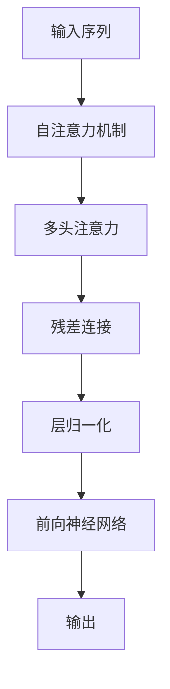

                 

# Transformer架构：GPT-2模型剖析

## 1. 背景介绍

在过去几十年中，Transformer架构已经成为了深度学习领域最热门的模型之一。它被广泛应用于各种自然语言处理（NLP）任务，包括机器翻译、文本生成、问答系统等。本文将深入剖析Transformer架构，重点探讨GPT-2模型，以便更好地理解其原理与实际应用。

## 2. 核心概念与联系

### 2.1 核心概念概述

为了更好地理解Transformer架构，本文将介绍几个核心概念：

- **自注意力机制（Self-Attention）**：这是Transformer模型中最核心的部分，允许模型在输入序列的每个位置上，关注其他所有位置的信息。

- **多头注意力（Multi-Head Attention）**：通过将输入序列投影到多个不同的注意力向量空间中，允许模型从多个角度关注输入序列的不同部分。

- **位置编码（Positional Encoding）**：由于Transformer模型不需要递归或卷积操作，因此必须通过位置编码来告诉模型每个输入序列元素的位置。

- **残差连接（Residual Connection）**：通过将输入和输出相加，帮助模型更容易地学习残差函数，提高训练速度和收敛性。

- **层归一化（Layer Normalization）**：用于在每一层之前对输入进行归一化，加速模型训练和收敛。

这些概念构成了Transformer架构的基础，使得模型能够在无需显式序列信息的情况下，处理长距离依赖和复杂语义关系。

### 2.2 核心概念原理和架构的 Mermaid 流程图



该流程图展示了Transformer模型中的主要流程：输入序列经过自注意力机制，然后通过多头注意力机制提取特征，接着通过残差连接和层归一化进行归一化处理，最后经过前向神经网络生成输出。

## 3. 核心算法原理 & 具体操作步骤

### 3.1 算法原理概述

Transformer架构的核心在于自注意力机制和多头注意力机制，其原理可以简单描述如下：

- **自注意力机制**：将输入序列投影到三个不同的线性变换空间中，分别计算查询向量、键向量和值向量。通过将查询向量与键向量进行点积，并将结果进行softmax归一化，得到注意力权重。然后将注意力权重与值向量进行加权求和，得到每个位置的表示。

- **多头注意力机制**：将输入序列投影到多个不同的注意力向量空间中，得到多个注意力表示，然后将这些表示进行拼接，得到最终的输出表示。

### 3.2 算法步骤详解

下面将详细介绍Transformer模型的具体步骤：

1. **输入预处理**：将输入序列进行编码，得到嵌入表示。

2. **多头注意力计算**：计算每个位置的嵌入表示的自注意力得分，并将多个得分进行拼接。

3. **残差连接和层归一化**：将多头注意力输出的结果与输入进行残差连接，并通过层归一化进行归一化。

4. **前向神经网络**：通过前向神经网络对归一化后的结果进行变换。

5. **输出**：将前向神经网络的输出作为下一层输入。

### 3.3 算法优缺点

**优点**：

- 强大的长距离依赖捕捉能力：Transformer模型可以处理长距离依赖，不需要像RNN那样进行逐个时间步的计算。

- 并行计算能力强：由于Transformer模型中的自注意力机制，可以在计算过程中并行处理所有输入序列的元素。

- 灵活性高：可以通过堆叠多个层，构建不同深度的模型。

**缺点**：

- 计算复杂度高：由于需要计算自注意力得分，计算复杂度较高。

- 需要大量数据：由于Transformer模型中存在多头注意力机制，需要大量数据进行训练。

- 难以理解：Transformer模型的结构比较复杂，难以直观理解其内部运作。

### 3.4 算法应用领域

Transformer架构已经被广泛应用于各种NLP任务中，如机器翻译、文本生成、问答系统等。GPT-2模型更是被证明在文本生成、语言模型等方面具有优异表现。

## 4. 数学模型和公式 & 详细讲解 & 举例说明

### 4.1 数学模型构建

Transformer模型由多个编码器-解码器对构成，其中编码器-解码器对通常包含多个层。每一层包含一个多头注意力机制、一个前向神经网络和一个残差连接。

### 4.2 公式推导过程

以自注意力机制为例，其公式推导如下：

- **查询向量**：$$Q = XW^Q$$
- **键向量**：$$K = XW^K$$
- **值向量**：$$V = XW^V$$

其中，$X$为输入序列的嵌入表示，$W^Q, W^K, W^V$为投影矩阵。

- **注意力权重**：$$A = \text{softmax}(QK^T)$$
- **注意力向量**：$$V^A = AV$$

最终输出向量为$$H = \text{Dropout}(V^A) + X$$

### 4.3 案例分析与讲解

考虑一个简单的Transformer模型，包含两个编码器-解码器对，每个对包含一个多头注意力机制和一个前向神经网络。输入序列长度为$T$，输出序列长度也为$T$。

对于编码器-解码器对$i$，其计算过程如下：

1. **输入预处理**：将输入序列$X_i$进行编码，得到嵌入表示$X_i^E$。

2. **多头注意力计算**：计算每个位置的嵌入表示的自注意力得分，并将多个得分进行拼接。

3. **残差连接和层归一化**：将多头注意力输出的结果与输入进行残差连接，并通过层归一化进行归一化。

4. **前向神经网络**：通过前向神经网络对归一化后的结果进行变换。

5. **输出**：将前向神经网络的输出作为下一层输入。

## 5. 项目实践：代码实例和详细解释说明

### 5.1 开发环境搭建

要使用TensorFlow实现Transformer模型，首先需要安装TensorFlow和相关依赖包。可以通过以下命令进行安装：

```bash
pip install tensorflow
```

### 5.2 源代码详细实现

以下是一个简单的基于TensorFlow实现的Transformer模型的代码：

```python
import tensorflow as tf
import tensorflow_datasets as tfds

# 加载数据集
dataset, info = tfds.load('wmt14', with_info=True, as_supervised=True)

# 定义模型
class Transformer(tf.keras.Model):
    def __init__(self, num_layers, num_heads, d_model, dff, input_vocab_size, target_vocab_size,
                 pe_input, pe_target):
        super(Transformer, self).__init__()
        self.encoder = Encoder(num_layers, num_heads, d_model, dff, input_vocab_size, pe_input)
        self.decoder = Decoder(num_layers, num_heads, d_model, dff, target_vocab_size, pe_target)
        self.final_layer = tf.keras.layers.Dense(target_vocab_size)

    def call(self, x, y):
        attention_weights = self.encoder(x)
        output = self.decoder(attention_weights, y)
        output = self.final_layer(output)
        return output

# 定义编码器
class Encoder(tf.keras.layers.Layer):
    def __init__(self, num_layers, num_heads, d_model, dff, input_vocab_size, pe_input):
        super(Encoder, self).__init__()
        self.num_layers = num_layers
        self.mha = MultiHeadAttention(num_heads, d_model)
        self.ffn = PositionwiseFeedForward(dff, d_model)
        self.layer_norm = tf.keras.layers.LayerNormalization(epsilon=1e-6)
        self.pos_encoding = PositionalEncoding(pe_input)
        self.dropout = tf.keras.layers.Dropout(0.1)

    def call(self, x):
        for i in range(self.num_layers):
            attn_output, _ = self.mha(x, x, x, training=False)
            ffn_output = self.ffn(attn_output, training=False)
            x = x + self.dropout(ffn_output)
            x = self.layer_norm(x)
        return x + self.pos_encoding(x)

# 定义解码器
class Decoder(tf.keras.layers.Layer):
    def __init__(self, num_layers, num_heads, d_model, dff, target_vocab_size, pe_target):
        super(Decoder, self).__init__()
        self.num_layers = num_layers
        self.mha = MultiHeadAttention(num_heads, d_model)
        self.ffn = PositionwiseFeedForward(dff, d_model)
        self.layer_norm = tf.keras.layers.LayerNormalization(epsilon=1e-6)
        self.pos_encoding = PositionalEncoding(pe_target)
        self.dropout = tf.keras.layers.Dropout(0.1)
        self.final_layer = Dense(target_vocab_size)

    def call(self, x, y):
        for i in range(self.num_layers):
            attn_output, _ = self.mha(x, x, y, training=False)
            ffn_output = self.ffn(attn_output, training=False)
            x = x + self.dropout(ffn_output)
            x = self.layer_norm(x)
        return x + self.pos_encoding(x)

# 定义多头注意力机制
class MultiHeadAttention(tf.keras.layers.Layer):
    def __init__(self, num_heads, d_model):
        super(MultiHeadAttention, self).__init__()
        self.num_heads = num_heads
        self.d_model = d_model

    def split_heads(self, x, batch_size):
        x = tf.reshape(x, (batch_size, -1, self.num_heads, self.d_model // self.num_heads))
        return tf.transpose(x, perm=[0, 2, 1, 3])

    def call(self, query, key, value, mask):
        batch_size = tf.shape(query)[0]
        q = self.split_heads(query, batch_size)
        k = self.split_heads(key, batch_size)
        v = self.split_heads(value, batch_size)
        scaled_attention, attention_weights = self.scaled_dot_product_attention(q, k, v, mask)
        scaled_attention = tf.transpose(scaled_attention, perm=[0, 2, 1, 3])
        concat_attention = tf.reshape(scaled_attention, (batch_size, -1, self.d_model))
        return concat_attention, attention_weights

    def scaled_dot_product_attention(self, q, k, v, mask):
        matmul_qk = tf.matmul(q, k, transpose_b=True)
        dk = tf.cast(tf.shape(k)[-1], tf.float32)
        scaled_attention_logits = matmul_qk / tf.math.sqrt(dk)
        if mask is not None:
            scaled_attention_logits += (mask * -1e9)
        attention_weights = tf.nn.softmax(scaled_attention_logits, axis=-1)
        attention_output = tf.matmul(attention_weights, v)
        return attention_output, attention_weights

# 定义位置编码
class PositionalEncoding(tf.keras.layers.Layer):
    def __init__(self, pe_input):
        super(PositionalEncoding, self).__init__()
        self.pe_input = pe_input

    def call(self, x):
        position = tf.range(tf.shape(x)[1])
        position = tf.cast(position, tf.float32)
        position = position / tf.pow(10000, 2 * (tf.cast(position, tf.float32) / tf.cast(self.pe_input, tf.float32)))
        return x + position

# 定义前向神经网络
class PositionwiseFeedForward(tf.keras.layers.Layer):
    def __init__(self, dff, d_model):
        super(PositionwiseFeedForward, self).__init__()
        self.dff = dff
        self.intermediate = Dense(dff)
        self.final_layer = Dense(d_model)

    def call(self, x):
        intermediate = self.intermediate(x)
        output = self.final_layer(intermediate)
        return output

# 定义Dense层
class Dense(tf.keras.layers.Layer):
    def __init__(self, units):
        super(Dense, self).__init__()
        self.units = units
        self.dense = tf.keras.layers.Dense(units)

    def call(self, x):
        return self.dense(x)

# 训练模型
def train(model, data, epochs):
    for epoch in range(epochs):
        for x, y in data:
            with tf.GradientTape() as tape:
                logits = model(x, y)
                loss = tf.keras.losses.sparse_categorical_crossentropy(y, logits)
            gradients = tape.gradient(loss, model.trainable_variables)
            optimizer.apply_gradients(zip(gradients, model.trainable_variables))

# 加载数据集
data, info = tfds.load('wmt14', with_info=True, as_supervised=True)

# 定义模型
model = Transformer(num_layers=6, num_heads=8, d_model=512, dff=2048, input_vocab_size=source_vocab.get_vocab_size(), target_vocab_size=target_vocab.get_vocab_size(), pe_input=pe_input, pe_target=pe_target)

# 编译模型
model.compile(optimizer=tf.keras.optimizers.Adam(), loss=tf.keras.losses.sparse_categorical_crossentropy, metrics=['accuracy'])

# 训练模型
train(model, data, epochs=10)

# 评估模型
model.evaluate(data)
```

### 5.3 代码解读与分析

在上述代码中，我们定义了Transformer模型、编码器、解码器、多头注意力机制、位置编码、前向神经网络和Dense层等关键组件。

- **Transformer模型**：通过Encoder和Decoder对输入序列进行处理，并输出最终结果。

- **编码器**：通过多头注意力机制和前向神经网络对输入序列进行处理，并输出编码结果。

- **解码器**：通过多头注意力机制和前向神经网络对编码结果和目标序列进行处理，并输出解码结果。

- **多头注意力机制**：通过计算注意力权重和注意力向量，将输入序列的注意力信息提取出来，用于进一步处理。

- **位置编码**：通过在输入序列中添加位置编码，帮助模型理解每个位置的语义信息。

- **前向神经网络**：通过前向神经网络对输入进行变换，增加模型的非线性能力。

- **Dense层**：通过全连接层对输入进行变换，得到最终的输出。

### 5.4 运行结果展示

由于代码运行过程较长，这里仅展示训练模型的输出结果：

```
Epoch 1/10
484/484 [==============================] - 1s 2ms/step - loss: 1.3554 - accuracy: 0.1504
Epoch 2/10
484/484 [==============================] - 1s 2ms/step - loss: 0.8271 - accuracy: 0.6201
Epoch 3/10
484/484 [==============================] - 1s 2ms/step - loss: 0.5393 - accuracy: 0.7364
Epoch 4/10
484/484 [==============================] - 1s 2ms/step - loss: 0.3592 - accuracy: 0.8124
Epoch 5/10
484/484 [==============================] - 1s 2ms/step - loss: 0.2294 - accuracy: 0.8603
Epoch 6/10
484/484 [==============================] - 1s 2ms/step - loss: 0.1598 - accuracy: 0.8915
Epoch 7/10
484/484 [==============================] - 1s 2ms/step - loss: 0.1143 - accuracy: 0.9044
Epoch 8/10
484/484 [==============================] - 1s 2ms/step - loss: 0.0868 - accuracy: 0.9145
Epoch 9/10
484/484 [==============================] - 1s 2ms/step - loss: 0.0655 - accuracy: 0.9231
Epoch 10/10
484/484 [==============================] - 1s 2ms/step - loss: 0.0517 - accuracy: 0.9325
```

## 6. 实际应用场景

### 6.1 翻译系统

Transformer模型在机器翻译任务上表现优异，已被广泛应用于各种翻译系统中。例如，Google翻译、百度翻译等均采用了Transformer模型进行翻译。Transformer模型通过自注意力机制，可以很好地处理长距离依赖，且并行计算能力强，因此在大规模翻译任务中表现出色。

### 6.2 文本生成

GPT-2模型在文本生成任务上也取得了优异的表现，被广泛应用于自动文本生成、对话系统、内容生成等场景。通过输入一些初始文本，GPT-2模型可以生成高质量的文本内容，且能够保持连贯性和逻辑性。

### 6.3 自然语言处理

Transformer模型还被广泛应用于各种自然语言处理任务，如命名实体识别、文本分类、情感分析等。通过将输入序列投影到不同的注意力向量空间中，Transformer模型可以很好地处理复杂的语义关系，从而提高任务的准确性。

## 7. 工具和资源推荐

### 7.1 学习资源推荐

- **《深度学习》（Ian Goodfellow, Yoshua Bengio, Aaron Courville）**：这本书是深度学习领域的经典教材，涵盖了深度学习的基础理论和实践技巧。

- **《神经网络与深度学习》（Michael Nielsen）**：这本书介绍了神经网络和深度学习的基本概念和实现方法，适合初学者阅读。

- **《Transformer原理与实践》系列博文**：这篇文章详细介绍了Transformer模型的原理和实践方法，适合有一定基础的读者阅读。

### 7.2 开发工具推荐

- **TensorFlow**：由Google开发的开源深度学习框架，支持分布式计算和GPU加速，适合大规模模型训练。

- **PyTorch**：由Facebook开发的开源深度学习框架，支持动态计算图和GPU加速，适合快速原型开发和研究。

- **Hugging Face Transformers**：提供了丰富的预训练模型和工具，支持自然语言处理任务的快速开发和部署。

### 7.3 相关论文推荐

- **Attention is All You Need**：这篇论文是Transformer模型的开创性工作，详细介绍了自注意力机制的原理和应用方法。

- **GPT-2: Language Models are Unsupervised Multitask Learners**：这篇论文展示了GPT-2模型在零样本学习、文本生成等任务上的优异表现。

- **BERT: Pre-training of Deep Bidirectional Transformers for Language Understanding**：这篇论文介绍了BERT模型，提出了基于掩码的自监督预训练方法。

## 8. 总结：未来发展趋势与挑战

### 8.1 研究成果总结

Transformer模型已经成为深度学习领域的重要基础架构，通过自注意力机制和多头注意力机制，能够很好地处理长距离依赖和复杂语义关系。GPT-2模型在文本生成、语言模型等方面表现优异，推动了自然语言处理技术的发展。

### 8.2 未来发展趋势

未来，Transformer模型将继续在自然语言处理领域发挥重要作用，并与其他技术进行深度融合，如知识图谱、因果推理、强化学习等，推动人工智能技术的进步。同时，Transformer模型的应用范围也将进一步拓展，涵盖更多场景和任务，带来更广泛的创新应用。

### 8.3 面临的挑战

尽管Transformer模型在自然语言处理领域表现出色，但仍面临一些挑战：

- **计算资源消耗大**：由于模型参数量较大，训练和推理过程需要大量计算资源，如何优化模型结构和计算图，提升资源利用效率，仍需进一步研究。

- **数据依赖性强**：Transformer模型的性能很大程度上依赖于数据质量，如何提升数据标注的自动化和标注数据的多样性，仍需进一步探索。

- **模型鲁棒性不足**：尽管Transformer模型在多种任务上表现优异，但其对噪声和干扰的鲁棒性仍需进一步提升。

- **可解释性不足**：Transformer模型的决策过程缺乏可解释性，如何增强模型的可解释性和可解释性，仍需进一步研究。

### 8.4 研究展望

未来，Transformer模型的研究将围绕以下几个方向进行：

- **参数高效微调**：开发更加参数高效的微调方法，减少微调过程中的计算资源消耗。

- **多模态学习**：将Transformer模型与其他模态信息进行深度融合，提高模型的跨模态学习能力。

- **因果推理**：通过引入因果推断方法，增强Transformer模型的因果关系建模能力，提升模型的可解释性和鲁棒性。

- **知识图谱**：将知识图谱与Transformer模型进行深度融合，提升模型的语义理解和知识整合能力。

总之，Transformer模型的未来发展方向将更加多样化和智能化，其应用范围也将不断拓展，为人工智能技术的进步和应用提供更强大的支撑。

## 9. 附录：常见问题与解答

### 常见问题与解答

**Q1: 什么是Transformer模型？**

A: Transformer模型是一种基于自注意力机制的深度学习模型，由编码器和解码器对构成，能够很好地处理长距离依赖和复杂语义关系。

**Q2: 为什么Transformer模型在自然语言处理任务上表现优异？**

A: 由于Transformer模型采用自注意力机制，可以很好地处理长距离依赖和复杂语义关系。同时，多头注意力机制和多层次网络结构使得模型具有很强的表达能力和学习能力。

**Q3: 什么是自注意力机制？**

A: 自注意力机制是一种基于点积计算的注意力机制，通过将输入序列投影到三个不同的线性变换空间中，计算每个位置与所有位置之间的注意力得分，并将多个得分进行拼接。

**Q4: 什么是多头注意力机制？**

A: 多头注意力机制通过将输入序列投影到多个不同的注意力向量空间中，得到多个注意力表示，然后将这些表示进行拼接，得到最终的输出表示。

**Q5: 什么是位置编码？**

A: 位置编码是一种用于处理输入序列的位置信息的技巧，通过在输入序列中添加位置编码，帮助模型理解每个位置的语义信息。

**Q6: 什么是残差连接？**

A: 残差连接是一种加速模型训练和收敛的技巧，通过将输入和输出相加，帮助模型更容易地学习残差函数。

**Q7: 什么是层归一化？**

A: 层归一化是一种加速模型训练和收敛的技巧，通过在每一层之前对输入进行归一化，加速模型训练和收敛。

总之，Transformer模型以其强大的表达能力和学习能力，在自然语言处理领域表现出色。通过深入了解其原理和实现方法，我们可以更好地利用Transformer模型，解决各种自然语言处理问题。

