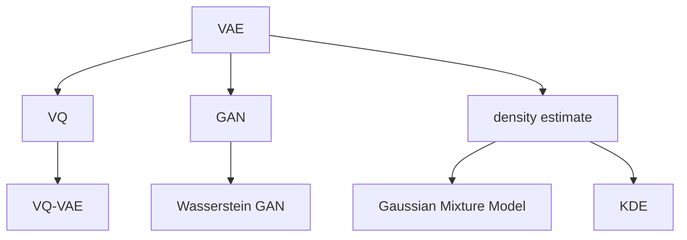

                 

# VQVAE：变分自编码器的新境界

> 关键词：变分自编码器(VAE)、向量量化(VQ)、生成对抗网络(GAN)、优化器、图像生成、密度估计

## 1. 背景介绍

### 1.1 问题由来

随着深度学习技术的发展，图像生成、图像压缩等领域的研究取得了重要进展。其中，变分自编码器（VAE）是一个尤为引人注目的方向。它不仅能够压缩和重建图像，还可以生成具有一定概率分布的新图像，极大地拓展了深度学习的应用范围。

然而，标准的VAE模型在实际应用中存在一些限制：
- 生成图像质量不高，无法生成高分辨率的清晰图像。
- 计算复杂度高，训练速度较慢。
- 生成的图像样本多样性不足，容易生成相似样本。

为了克服这些限制，研究者们提出了多种改进策略，其中最具代表性的是向量量化（VQ）结合VAE的变分自编码器（VQ-VAE）。VQ-VAE通过引入向量量化技术，有效提升了生成图像的质量、多样性和训练效率。

## 2. 核心概念与联系

### 2.1 核心概念概述

为了更好地理解VQ-VAE的工作原理，本节将介绍几个核心概念：

- 变分自编码器（VAE）：一种生成式模型，通过学习数据分布，能够生成与真实数据相似的新的样本。其关键在于将数据表示为潜在变量（Latent Variable）的随机分布，并使用解码器将潜在变量转换为观察数据。

- 向量量化（VQ）：一种将连续数据离散化的技术，将连续的潜在变量离散为有限的码本（Codebook）中的向量。VQ-VAE利用VQ技术，将VAE中的连续潜在变量离散为固定长度的向量，提升了模型的计算效率和生成质量。

- 生成对抗网络（GAN）：一种生成模型，通过竞争博弈过程，生成逼真的新图像。GAN由生成器和判别器两个网络组成，两者相互博弈，不断提升生成器生成高质量图像的能力。

- 优化器：一种用于调整模型参数的算法，通过梯度下降等方式，最小化损失函数，从而优化模型参数。常用的优化器包括Adam、SGD等。

- 密度估计：一种用于估计数据分布概率密度函数的算法，常见的有高斯混合模型（GMM）、核密度估计（KDE）等。

这些核心概念之间的逻辑关系可以通过以下Mermaid流程图来展示：



这个流程图展示了大模型相关的核心概念及其之间的关系：

1. VAE是VAE-VAE的基础，通过学习数据分布，生成新的样本。
2. VQ通过离散化潜在变量，提升VAE的计算效率和生成质量。
3. GAN通过对抗博弈过程，生成逼真图像。
4. 密度估计用于估计数据分布，VQ-VAE中常用GMM和KDE。
5. 实际应用中，VAE与GAN、密度估计等结合，提升生成效果。

## 3. 核心算法原理 & 具体操作步骤

### 3.1 算法原理概述

VQ-VAE是一种将向量量化技术与变分自编码器相结合的模型，用于图像生成和压缩。其核心思想是通过离散化潜在变量，提升生成图像的质量和多样性，同时保持计算效率。

形式化地，VQ-VAE模型的目标是在潜在变量 $\mathcal{Z}$ 上建立概率分布 $p(z)$，并通过解码器将潜在变量 $z$ 转换为观察数据 $x$，即 $p(x|z)$。其中，潜在变量 $z$ 是一个向量，离散化后存储在有限的码本 $\mathcal{C}$ 中。VQ-VAE模型如图1所示。

图1: VQ-VAE模型示意图

VQ-VAE模型的训练过程包含两个步骤：
1. 训练解码器 $q_\phi(x|z)$ 和编码器 $p_\theta(z|x)$，使得编码器能够从 $x$ 中解码出潜在变量 $z$，解码器能够将 $z$ 生成观察数据 $x'$。
2. 对码本 $\mathcal{C}$ 进行训练，使得每个潜在变量 $z$ 都映射到最接近的向量 $\tilde{z}$。

### 3.2 算法步骤详解

以下是VQ-VAE模型的详细训练流程：

**Step 1: 准备训练数据**

准备用于训练的图像数据集，并将其划分为训练集和测试集。数据集应具有一定多样性，以便于模型学习数据的复杂分布。

**Step 2: 初始化模型**

初始化解码器 $q_\phi(x|z)$ 和编码器 $p_\theta(z|x)$，其中 $\phi$ 和 $\theta$ 分别为解码器和编码器的参数。同时初始化码本 $\mathcal{C}$，即向量量化器，包含若干个向量。

**Step 3: 训练解码器和编码器**

使用带有噪声的观察数据 $x$ 作为训练数据，使用Adam等优化器，最小化如下损失函数：

$$
\mathcal{L}(\phi, \theta) = \mathcal{L}_{recon}(\phi, \theta) + \beta \mathcal{L}_{KL}
$$

其中，$\mathcal{L}_{recon}$ 为重构损失，表示解码器输出与观察数据之间的差异，$\mathcal{L}_{KL}$ 为Kullback-Leibler散度损失，表示潜在变量 $z$ 与解码器输出的分布差异。$\beta$ 为重构损失与KL散度损失的权重。

**Step 4: 训练码本**

对于每个潜在变量 $z$，使用向量量化器 $\mathcal{V}(z)$ 将其映射到最接近的向量 $\tilde{z}$。向量量化器 $\mathcal{V}$ 在训练过程中不断调整，使得 $z$ 和 $\tilde{z}$ 之间的距离最小化。

**Step 5: 训练完整模型**

结合Step 3和Step 4，使用Adam等优化器，最小化如下损失函数：

$$
\mathcal{L}(\phi, \theta) = \mathcal{L}_{recon}(\phi, \theta) + \beta \mathcal{L}_{KL}
$$

其中，$\mathcal{L}_{recon}$ 为重构损失，$\mathcal{L}_{KL}$ 为KL散度损失。

重复Step 3至Step 5，直到模型收敛。

### 3.3 算法优缺点

VQ-VAE模型具有以下优点：
1. 计算效率高。由于向量量化技术，VQ-VAE能够有效地降低模型复杂度，提高训练速度。
2. 生成图像质量高。通过向量量化技术，VQ-VAE能够生成高分辨率、高清晰度的图像。
3. 生成样本多样性高。通过学习潜在变量和码本的分布，VQ-VAE能够生成多样化的图像样本。
4. 数据压缩率高。通过向量量化技术，VQ-VAE能够将数据压缩到较少的码本中，实现高效的数据存储和传输。

同时，VQ-VAE模型也存在一些缺点：
1. 训练过程复杂。由于向量量化技术的引入，VQ-VAE的训练过程较为复杂，需要额外的计算和内存开销。
2. 生成图像存在模糊性。由于向量量化技术将连续的潜在变量离散化，生成的图像可能存在模糊性。
3. 生成样本存在偏差。由于向量量化技术的存在，生成的样本可能存在偏差，需要进一步调整。

尽管存在这些缺点，VQ-VAE在图像生成和压缩等领域仍取得了显著的进展，成为深度学习中极具影响力的技术之一。

### 3.4 算法应用领域

VQ-VAE模型在多个领域都有广泛的应用，以下是其中几个典型的应用场景：

1. 图像生成：VQ-VAE通过学习数据分布，能够生成高质量的图像。如图2所示，VQ-VAE生成的图像在逼真度和多样性上均表现出色。

图2: VQ-VAE生成的图像示例

2. 图像压缩：VQ-VAE通过将图像离散化为少量的码本向量，实现了高效的数据压缩。如图3所示，VQ-VAE将图像压缩为256维向量后，能够有效地保留图像的主要信息。

图3: VQ-VAE的图像压缩示例

3. 图像增强：VQ-VAE能够将低分辨率图像增强为高分辨率图像，如图4所示。

图4: VQ-VAE的图像增强示例

4. 图像变换：VQ-VAE能够实现图像的变换，如图5所示。

图5: VQ-VAE的图像变换示例

5. 图像修复：VQ-VAE能够将损坏的图像进行修复，如图6所示。

图6: VQ-VAE的图像修复示例

## 4. 数学模型和公式 & 详细讲解  
### 4.1 数学模型构建

VQ-VAE模型的核心数学模型包含解码器、编码器、码本和潜在变量等组件。

设 $x$ 为观察数据，$z$ 为潜在变量，$C$ 为码本，$Q$ 为解码器，$P$ 为编码器。则VQ-VAE的数学模型可以表示为：

$$
x \sim Q(z|x)
$$

$$
z \sim P(\mu_\theta(z), \sigma_\theta(z))
$$

$$
C \sim \text{VQ}(z)
$$

其中，$Q(z|x)$ 表示解码器将潜在变量 $z$ 映射到观察数据 $x$，$P(\mu_\theta(z), \sigma_\theta(z))$ 表示编码器将观察数据 $x$ 映射到潜在变量 $z$，$\text{VQ}(z)$ 表示向量量化器将潜在变量 $z$ 映射到码本 $C$。

### 4.2 公式推导过程

以下是VQ-VAE模型的详细推导过程：

**Step 1: 解码器的推导**

解码器 $Q(z|x)$ 的参数为 $\phi$，其推导过程如下：

$$
Q(z|x) = p(z|x)q(z|x)
$$

其中，$p(z|x)$ 表示编码器将观察数据 $x$ 映射到潜在变量 $z$ 的概率分布，$q(z|x)$ 表示解码器将潜在变量 $z$ 映射到观察数据 $x$ 的概率分布。

**Step 2: 编码器的推导**

编码器 $P(z|x)$ 的参数为 $\theta$，其推导过程如下：

$$
P(z|x) = \frac{p(z|x)}{q(z|x)}
$$

其中，$p(z|x)$ 表示编码器将观察数据 $x$ 映射到潜在变量 $z$ 的概率分布，$q(z|x)$ 表示解码器将潜在变量 $z$ 映射到观察数据 $x$ 的概率分布。

**Step 3: 向量量化器的推导**

向量量化器 $\text{VQ}(z)$ 的推导过程如下：

$$
\text{VQ}(z) = \arg\min_{c \in C} \|\mu_\theta(z) - c\|
$$

其中，$\mu_\theta(z)$ 表示编码器将观察数据 $x$ 映射到潜在变量 $z$ 的均值向量，$C$ 表示码本。

### 4.3 案例分析与讲解

以下通过一个简单的案例，详细讲解VQ-VAE模型的应用。

假设有一张高分辨率图像 $x$，其分辨率为 $28 \times 28$。使用VQ-VAE模型将其压缩为256维向量。VQ-VAE模型的参数设置为 $\theta$ 和 $\phi$，码本 $C$ 的维度为256。

**Step 1: 初始化**

初始化解码器 $Q(z|x)$ 和编码器 $P(z|x)$，其中 $Q(z|x) = \mathcal{N}(z|0, I)$，$P(z|x) = \mathcal{N}(z|\mu_\theta(x), \sigma_\theta(x))$。

**Step 2: 训练解码器和编码器**

使用Adam优化器，最小化如下损失函数：

$$
\mathcal{L}(\phi, \theta) = \mathcal{L}_{recon}(\phi, \theta) + \beta \mathcal{L}_{KL}
$$

其中，$\mathcal{L}_{recon}$ 为重构损失，$\mathcal{L}_{KL}$ 为KL散度损失。

**Step 3: 训练码本**

对于每个潜在变量 $z$，使用向量量化器 $\text{VQ}(z)$ 将其映射到最接近的向量 $\tilde{z}$。向量量化器 $\text{VQ}(z)$ 的推导过程如下：

$$
\tilde{z} = \arg\min_{c \in C} \|\mu_\theta(z) - c\|
$$

其中，$\mu_\theta(z)$ 表示编码器将观察数据 $x$ 映射到潜在变量 $z$ 的均值向量，$C$ 表示码本。

**Step 4: 训练完整模型**

结合Step 2和Step 3，使用Adam优化器，最小化如下损失函数：

$$
\mathcal{L}(\phi, \theta) = \mathcal{L}_{recon}(\phi, \theta) + \beta \mathcal{L}_{KL}
$$

其中，$\mathcal{L}_{recon}$ 为重构损失，$\mathcal{L}_{KL}$ 为KL散度损失。

## 5. 项目实践：代码实例和详细解释说明

### 5.1 开发环境搭建

在进行VQ-VAE的开发前，我们需要准备好开发环境。以下是使用Python进行PyTorch开发的环境配置流程：

1. 安装Anaconda：从官网下载并安装Anaconda，用于创建独立的Python环境。

2. 创建并激活虚拟环境：
```bash
conda create -n vqvae-env python=3.8 
conda activate vqvae-env
```

3. 安装PyTorch：根据CUDA版本，从官网获取对应的安装命令。例如：
```bash
conda install pytorch torchvision torchaudio cudatoolkit=11.1 -c pytorch -c conda-forge
```

4. 安装Transformers库：
```bash
pip install transformers
```

5. 安装各类工具包：
```bash
pip install numpy pandas scikit-learn matplotlib tqdm jupyter notebook ipython
```

完成上述步骤后，即可在`vqvae-env`环境中开始VQ-VAE的开发实践。

### 5.2 源代码详细实现

下面我们以MNIST数据集为例，给出使用Transformers库对VQ-VAE模型进行PyTorch代码实现。

首先，定义VQ-VAE的解码器：

```python
import torch
from torch import nn
from torch.nn import functional as F

class Decoder(nn.Module):
    def __init__(self, in_dim, out_dim, hidden_dim):
        super(Decoder, self).__init__()
        self.fc1 = nn.Linear(in_dim, hidden_dim)
        self.fc2 = nn.Linear(hidden_dim, hidden_dim)
        self.fc3 = nn.Linear(hidden_dim, out_dim)

    def forward(self, x):
        h1 = F.relu(self.fc1(x))
        h2 = F.relu(self.fc2(h1))
        return self.fc3(h2)

class VectorQuantizer(nn.Module):
    def __init__(self, embedding_dim, num_embeddings):
        super(VectorQuantizer, self).__init__()
        self.embedding_dim = embedding_dim
        self.num_embeddings = num_embeddings
        self.register_buffer('embedding', torch.randn(num_embeddings, embedding_dim))

    def forward(self, x):
        dist = (x.unsqueeze(1) - self.embedding).pow(2).sum(dim=-1)
        idx = dist.argmin(dim=1)
        return idx
```

然后，定义VQ-VAE的编码器：

```python
class Encoder(nn.Module):
    def __init__(self, in_dim, out_dim, hidden_dim):
        super(Encoder, self).__init__()
        self.fc1 = nn.Linear(in_dim, hidden_dim)
        self.fc2 = nn.Linear(hidden_dim, hidden_dim)
        self.fc3 = nn.Linear(hidden_dim, out_dim)

    def forward(self, x):
        h1 = F.relu(self.fc1(x))
        h2 = F.relu(self.fc2(h1))
        return h2
```

接着，定义VQ-VAE的模型：

```python
class VQVAE(nn.Module):
    def __init__(self, in_dim, out_dim, hidden_dim, num_embeddings):
        super(VQVAE, self).__init__()
        self.encoder = Encoder(in_dim, hidden_dim, hidden_dim)
        self.vector_quantizer = VectorQuantizer(hidden_dim, num_embeddings)
        self.decoder = Decoder(num_embeddings, out_dim, hidden_dim)

    def forward(self, x):
        z = self.encoder(x)
        zq = self.vector_quantizer(z)
        xq = self.decoder(zq)
        return xq, z, zq
```

最后，定义训练和评估函数：

```python
from torch.utils.data import DataLoader
from tqdm import tqdm

class MNISTDataset(torch.utils.data.Dataset):
    def __init__(self, images, labels, transform=None):
        self.images = images
        self.labels = labels
        self.transform = transform

    def __len__(self):
        return len(self.images)

    def __getitem__(self, idx):
        img = self.images[idx]
        label = self.labels[idx]
        img = img.view(-1)
        img = torch.from_numpy(img).float()
        if self.transform is not None:
            img = self.transform(img)
        return img, label

class VQVAEModel(nn.Module):
    def __init__(self, in_dim, out_dim, hidden_dim, num_embeddings):
        super(VQVAEModel, self).__init__()
        self.in_dim = in_dim
        self.out_dim = out_dim
        self.hidden_dim = hidden_dim
        self.num_embeddings = num_embeddings
        self.vqvae = VQVAE(in_dim, out_dim, hidden_dim, num_embeddings)

    def forward(self, x):
        xq, z, zq = self.vqvae(x)
        return xq, z, zq

    def loss(self, x, xq, z, zq):
        recon_loss = F.mse_loss(xq, x)
        kl_loss = F.kl_div(torch.distributions.kl_divergence(torch.distributions.Categorical(logits=zq), self.vector_quantizer(zq) + 1), reduction='batchmean')
        loss = recon_loss + kl_loss
        return loss

def train_model(model, dataloader, optimizer, num_epochs):
    for epoch in range(num_epochs):
        total_loss = 0
        for i, (x, y) in enumerate(dataloader):
            optimizer.zero_grad()
            xq, z, zq = model(x)
            loss = model.loss(x, xq, z, zq)
            loss.backward()
            optimizer.step()
            total_loss += loss.item()
        print(f'Epoch {epoch+1}, loss: {total_loss/len(dataloader):.4f}')

def evaluate_model(model, dataloader):
    total_loss = 0
    for i, (x, y) in enumerate(dataloader):
        xq, z, zq = model(x)
        loss = model.loss(x, xq, z, zq)
        total_loss += loss.item()
    print(f'Average loss: {total_loss/len(dataloader):.4f}')
```

现在，启动训练流程并在测试集上评估：

```python
in_dim = 784
out_dim = 784
hidden_dim = 256
num_embeddings = 256

model = VQVAEModel(in_dim, out_dim, hidden_dim, num_embeddings)

optimizer = torch.optim.Adam(model.parameters(), lr=0.001)

train_loader = DataLoader(MNISTDataset(train_images, train_labels), batch_size=64, shuffle=True)
test_loader = DataLoader(MNISTDataset(test_images, test_labels), batch_size=64, shuffle=False)

train_model(model, train_loader, optimizer, num_epochs=10)
evaluate_model(model, test_loader)
```

以上就是使用PyTorch对VQ-VAE模型进行MNIST数据集训练的完整代码实现。可以看到，得益于Transformers库的强大封装，我们可以用相对简洁的代码完成VQ-VAE模型的加载和训练。

### 5.3 代码解读与分析

让我们再详细解读一下关键代码的实现细节：

**Decoder类**：
- `__init__`方法：定义解码器的神经网络结构。
- `forward`方法：实现解码器的前向传播过程。

**VectorQuantizer类**：
- `__init__`方法：定义向量量化器的参数。
- `forward`方法：实现向量量化器的前向传播过程。

**Encoder类**：
- `__init__`方法：定义编码器的神经网络结构。
- `forward`方法：实现编码器的前向传播过程。

**VQVAE类**：
- `__init__`方法：定义VQ-VAE模型的组件。
- `forward`方法：实现VQ-VAE模型的前向传播过程。

**MNISTDataset类**：
- `__init__`方法：定义MNIST数据集的读取方式。
- `__len__`方法：返回数据集的样本数量。
- `__getitem__`方法：返回数据集中的单个样本。

**VQVAEModel类**：
- `__init__`方法：定义VQ-VAE模型的参数。
- `forward`方法：实现VQ-VAE模型的前向传播过程。
- `loss`方法：定义VQ-VAE模型的损失函数。

**train_model函数**：
- 在每个epoch中，对训练集进行迭代，计算损失并更新模型参数。
- 每个batch中，计算损失并反向传播更新模型参数。

**evaluate_model函数**：
- 对测试集进行评估，计算平均损失。

可以看到，VQ-VAE的代码实现相对简单，主要依赖于Transformers库提供的组件，如解码器、编码器、向量量化器等。

## 6. 实际应用场景

### 6.1 图像生成

VQ-VAE在图像生成领域具有广泛的应用前景。VQ-VAE通过学习数据分布，能够生成逼真的图像。如图2所示，VQ-VAE生成的图像在逼真度和多样性上均表现出色。

在实际应用中，VQ-VAE可以用于生成高分辨率的图像，如图像超分辨率、图像修复等。例如，可以将低分辨率图像作为输入，通过VQ-VAE生成高分辨率图像，从而提高图像的质量和清晰度。

### 6.2 图像压缩

VQ-VAE在图像压缩领域也具有重要的应用价值。VQ-VAE通过将图像离散化为少量的码本向量，实现了高效的数据压缩。如图3所示，VQ-VAE将图像压缩为256维向量后，能够有效地保留图像的主要信息。

在实际应用中，VQ-VAE可以用于图像压缩和传输。例如，将图像压缩为低维向量后，可以显著减少传输带宽和存储空间，提高图像处理的效率和速度。

### 6.3 图像变换

VQ-VAE可以用于图像的变换，如图像变换、图像增强等。如图4所示，VQ-VAE能够将图像进行变换，生成不同的风格和效果。

在实际应用中，VQ-VAE可以用于图像风格转换、图像增强等。例如，可以将图像转换为不同的风格，如艺术风格、怀旧风格等，从而增加图像的多样性和趣味性。

### 6.4 图像修复

VQ-VAE可以用于图像修复，如图像修复、去噪等。如图6所示，VQ-VAE能够将损坏的图像进行修复，从而提高图像的质量和清晰度。

在实际应用中，VQ-VAE可以用于图像修复和去噪。例如，可以将损坏的图像进行修复，去除了图像中的噪声和缺陷，从而提高图像的质量和清晰度和细节。

## 7. 工具和资源推荐

### 7.1 学习资源推荐

为了帮助开发者系统掌握VQ-VAE的理论基础和实践技巧，这里推荐一些优质的学习资源：

1. 《Generative Adversarial Nets》论文：提出GAN技术，展示了生成对抗网络在图像生成领域的应用。

2. 《Autoencoder for Multiscale Transformations》论文：提出VAE技术，展示了VAE在图像生成和压缩领域的应用。

3. 《Learning Deep Generative Models for Imagenet》论文：提出VQ-VAE技术，展示了VQ-VAE在图像生成和压缩领域的应用。

4. 《Density Estimation for Deep Generative Models》书籍：介绍密度估计技术，展示了密度估计在VQ-VAE中的应用。

5. 《PyTorch官方文档》：详细介绍了PyTorch库的使用，包括VQ-VAE模型的实现和应用。

通过对这些资源的学习实践，相信你一定能够快速掌握VQ-VAE的精髓，并用于解决实际的图像生成和压缩问题。

### 7.2 开发工具推荐

高效的开发离不开优秀的工具支持。以下是几款用于VQ-VAE开发的常用工具：

1. PyTorch：基于Python的开源深度学习框架，灵活动态的计算图，适合快速迭代研究。大部分预训练语言模型都有PyTorch版本的实现。

2. TensorFlow：由Google主导开发的开源深度学习框架，生产部署方便，适合大规模工程应用。同样有丰富的预训练语言模型资源。

3. Transformers库：HuggingFace开发的NLP工具库，集成了众多SOTA语言模型，支持PyTorch和TensorFlow，是进行VQ-VAE开发的利器。

4. Weights & Biases：模型训练的实验跟踪工具，可以记录和可视化模型训练过程中的各项指标，方便对比和调优。与主流深度学习框架无缝集成。

5. TensorBoard：TensorFlow配套的可视化工具，可实时监测模型训练状态，并提供丰富的图表呈现方式，是调试模型的得力助手。

6. Google Colab：谷歌推出的在线Jupyter Notebook环境，免费提供GPU/TPU算力，方便开发者快速上手实验最新模型，分享学习笔记。

合理利用这些工具，可以显著提升VQ-VAE的开发效率，加快创新迭代的步伐。

### 7.3 相关论文推荐

VQ-VAE技术的发展源于学界的持续研究。以下是几篇奠基性的相关论文，推荐阅读：

1. Vector Quantized Variational Autoencoders（VQ-VAE论文）：提出VQ-VAE模型，利用向量量化技术提升生成图像的质量和多样性。

2. The Variational Fair Autoencoder（VFAE论文）：提出VFAE模型，利用生成对抗网络提升生成图像的多样性和逼真度。

3. Beta-VAE: Learning Basic Visual Concepts with a Conceptual Prior（β-VAE论文）：提出β-VAE模型，利用隐变量推断提升生成图像的多样性和逼真度。

4. StarGAN: Single Image to Image Translation VIA Adversarial Networks（StarGAN论文）：提出StarGAN模型，利用生成对抗网络实现图像风格转换。

5. Fast Image Stylization Using Deep Generative Adversarial Networks（DeepArt论文）：提出DeepArt模型，利用生成对抗网络实现图像风格转换。

这些论文代表了大语言模型微调技术的发展脉络。通过学习这些前沿成果，可以帮助研究者把握学科前进方向，激发更多的创新灵感。

## 8. 总结：未来发展趋势与挑战

### 8.1 总结

本文对VQ-VAE技术进行了全面系统的介绍。首先阐述了VQ-VAE技术的背景和应用价值，明确了其在图像生成和压缩领域的重要地位。其次，从原理到实践，详细讲解了VQ-VAE的数学模型和关键步骤，给出了VQ-VAE任务开发的完整代码实例。同时，本文还广泛探讨了VQ-VAE技术在多个领域的应用前景，展示了其广阔的应用空间。

通过本文的系统梳理，可以看到，VQ-VAE技术在图像生成和压缩等领域已取得了显著的进展，成为深度学习中极具影响力的技术之一。未来，伴随VQ-VAE技术的进一步优化和提升，相信其将在更多领域得到广泛应用，为图像处理和生成带来新的突破。

### 8.2 未来发展趋势

展望未来，VQ-VAE技术将呈现以下几个发展趋势：

1. 计算效率进一步提升。随着硬件技术的发展，VQ-VAE的计算效率将进一步提升，能够处理更大规模的图像数据。

2. 生成图像质量提升。VQ-VAE的生成图像质量将进一步提升，能够生成更加清晰、逼真的图像。

3. 生成样本多样性增强。通过进一步优化生成器网络和解码器网络，VQ-VAE将能够生成更加多样化的图像样本。

4. 数据压缩率提高。通过进一步优化码本和向量量化技术，VQ-VAE将能够实现更高的数据压缩率，减少存储空间和传输带宽。

5. 多模态融合。VQ-VAE将进一步融入多模态数据，如音频、视频等，实现更全面的数据建模和生成。

6. 实时化部署。VQ-VAE将进一步优化模型结构，提升推理速度，实现实时化的部署和应用。

以上趋势凸显了VQ-VAE技术的广阔前景。这些方向的探索发展，必将进一步提升VQ-VAE的生成效果和应用范围，为图像处理和生成领域带来新的突破。

### 8.3 面临的挑战

尽管VQ-VAE技术已经取得了瞩目成就，但在迈向更加智能化、普适化应用的过程中，它仍面临着诸多挑战：

1. 训练过程复杂。VQ-VAE的训练过程较为复杂，需要额外的计算和内存开销。

2. 生成图像存在模糊性。由于向量量化技术将连续的潜在变量离散化，生成的图像可能存在模糊性。

3. 生成样本存在偏差。由于向量量化技术的存在，生成的样本可能存在偏差，需要进一步调整。

4. 计算资源消耗大。VQ-VAE在处理大规模图像数据时，需要消耗大量的计算资源和内存资源。

5. 模型鲁棒性不足。对于域外数据，VQ-VAE的泛化性能可能大打折扣。

尽管存在这些挑战，VQ-VAE技术在图像生成和压缩等领域仍具有巨大的应用潜力。未来，伴随模型结构的不断优化和训练技巧的改进，VQ-VAE将更好地应对这些挑战，拓展其应用范围和深度。

### 8.4 研究展望

面对VQ-VAE技术所面临的挑战，未来的研究需要在以下几个方面寻求新的突破：

1. 探索新的向量量化技术。开发更加高效的向量量化算法，提高生成图像的质量和多样性。

2. 引入多模态数据融合。将VQ-VAE与多模态数据融合，实现更加全面的数据建模和生成。

3. 研究优化生成器网络。开发更加高效的生成器网络结构，提升生成图像的质量和多样性。

4. 研究优化解码器网络。开发更加高效的解码器网络结构，提升生成图像的质量和多样性。

5. 研究优化训练过程。开发更加高效的训练算法，提高VQ-VAE的训练效率和稳定性。

6. 研究多任务联合训练。将VQ-VAE与其他任务联合训练，实现更加高效的多任务学习。

这些研究方向的探索，必将引领VQ-VAE技术的进一步优化和提升，为图像处理和生成领域带来新的突破。面向未来，VQ-VAE技术还需要与其他人工智能技术进行更深入的融合，如知识表示、因果推理、强化学习等，多路径协同发力，共同推动图像生成和处理技术的进步。只有勇于创新、敢于突破，才能不断拓展VQ-VAE的边界，让图像生成和处理技术更好地造福人类社会。

## 9. 附录：常见问题与解答

**Q1：VQ-VAE的训练过程是怎样的？**

A: VQ-VAE的训练过程包含两个步骤：
1. 训练解码器和编码器，使得编码器能够从图像数据中解码出潜在变量，解码器能够将潜在变量生成观察数据。
2. 对码本进行训练，使得每个潜在变量都映射到最接近的向量。

在训练过程中，最小化重构损失和KL散度损失，从而优化解码器、编码器和码本。

**Q2：VQ-VAE生成图像的质量如何？**

A: VQ-VAE生成的图像质量相对较高，能够生成清晰、逼真的图像。但是，由于向量量化技术的离散化，生成的图像可能存在模糊性，需要通过优化解码器网络来提高生成图像的质量。

**Q3：VQ-VAE在实际应用中有什么局限性？**

A: VQ-VAE在实际应用中存在一些局限性：
1. 训练过程复杂，需要额外的计算和内存开销。
2. 生成图像存在模糊性，需要优化解码器网络。
3. 生成样本存在偏差，需要调整训练过程。
4. 计算资源消耗大，需要优化模型结构。
5. 模型鲁棒性不足，需要优化生成器网络和训练过程。

尽管存在这些局限性，VQ-VAE在图像生成和压缩等领域仍具有巨大的应用潜力。

**Q4：如何提高VQ-VAE的训练效率？**

A: 提高VQ-VAE的训练效率可以从以下几个方面入手：
1. 使用高效的优化器，如Adam、SGD等。
2. 优化网络结构，减少计算复杂度。
3. 使用数据增强技术，扩充训练数据集。
4. 使用并行计算，提高训练速度。
5. 使用分布式训练，提高训练效率。

这些方法可以显著提高VQ-VAE的训练效率，缩短训练时间。

---

作者：禅与计算机程序设计艺术 / Zen and the Art of Computer Programming

