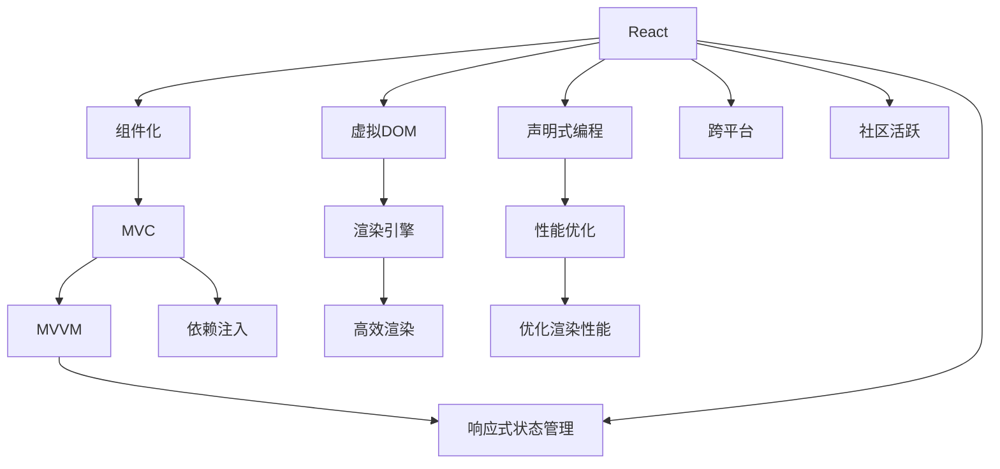

                 

# Web前端技术栈：React、Vue和Angular的比较

> 关键词：React, Vue, Angular, 前端框架, MVC, MVVM, 组件化, 虚拟DOM, 渲染引擎, 跨平台

## 1. 背景介绍

在Web前端开发领域，React、Vue和Angular是当今最流行的三大前端框架。这些框架的出现极大地推动了Web前端技术的进步，也给开发者带来了更多的选择。然而，随着Web应用场景的不断扩展和需求的复杂化，对于如何选择合适的框架，成为了开发者常常困扰的问题。本文将对React、Vue和Angular进行全面的比较分析，帮助开发者选择最适合的框架，并探讨未来前端技术的发展趋势。

## 2. 核心概念与联系

### 2.1 核心概念概述

- **React**：由Facebook开发的开源前端框架，采用组件化、声明式编程风格，通过虚拟DOM技术实现高效的渲染。
- **Vue**：由Evan You开发的开源前端框架，采用MVVM设计模式，以组件化、响应式状态管理为核心，提供易用的API和编译时的模板语法。
- **Angular**：由Google开发的开源前端框架，采用MVC设计模式，强调数据驱动和依赖注入，提供强大的数据绑定、模块化、依赖注入等功能。

### 2.2 核心概念原理和架构的 Mermaid 流程图



### 2.3 核心概念间的联系

React、Vue和Angular都强调组件化和声明式编程，旨在提高开发效率和代码的可维护性。但它们在具体实现上有所不同，例如：

- React采用虚拟DOM技术优化渲染性能，Vue采用响应式状态管理，Angular则通过依赖注入和数据绑定实现高效的数据同步。
- React和Vue都提供了跨平台的支持，Angular的跨平台能力较弱。
- React和Vue都具备活跃的社区支持，Angular则在企业级应用中更为流行。

## 3. 核心算法原理 & 具体操作步骤

### 3.1 算法原理概述

React、Vue和Angular的核心算法原理和具体操作步骤可以从以下几个方面进行比较：

- **组件化**：三者都采用组件化的开发方式，将页面拆分为多个独立组件，提升代码的可维护性和复用性。
- **渲染引擎**：React和Vue使用虚拟DOM技术优化渲染性能，Angular则直接操作DOM进行渲染。
- **数据管理**：Vue和Angular提供了强大的响应式状态管理和依赖注入机制，React则依赖于第三方库来实现。
- **跨平台支持**：React和Vue都提供了Web和移动端支持，Angular的跨平台能力相对较弱。

### 3.2 算法步骤详解

以下是React、Vue和Angular的具体操作步骤：

#### React
1. **组件化**：将页面拆分为多个独立组件，每个组件负责渲染自身的UI和处理自身的状态。
2. **虚拟DOM**：在内存中构建虚拟DOM树，通过比较前后两次渲染的差异，优化DOM操作，提高渲染性能。
3. **生命周期管理**：React提供了多种生命周期钩子，用于控制组件的加载、更新和卸载过程。
4. **单向数据流**：React采用单向数据流，即父组件向子组件传递数据，子组件不可修改父组件的状态。
5. **生态系统**：React拥有丰富的第三方库和工具，如React Router、Redux等，支持各种复杂的Web应用场景。

#### Vue
1. **组件化**：将页面拆分为多个独立组件，每个组件负责渲染自身的UI和处理自身的状态。
2. **响应式状态管理**：通过数据驱动和响应式机制，自动追踪组件状态的变化，实时更新UI。
3. **模板语法**：Vue提供编译时的模板语法，便于编写清晰易读的前端代码。
4. **指令和钩子**：Vue提供了各种指令和钩子，方便开发者实现复杂的逻辑和交互效果。
5. **生态系统**：Vue拥有强大的生态系统，包括Vue Router、Vuex等，支持Web和移动端应用。

#### Angular
1. **组件化**：将页面拆分为多个独立组件，每个组件负责渲染自身的UI和处理自身的状态。
2. **依赖注入**：通过依赖注入实现组件间的数据和服务的自动传递和共享。
3. **模块化**：Angular采用模块化设计，将应用分为多个模块，每个模块独立开发和维护。
4. **双向数据绑定**：Angular采用双向数据绑定，即组件间的数据同步机制。
5. **生态系统**：Angular拥有丰富的第三方库和工具，如Angular Router、RxJS等，支持复杂的前端应用场景。

### 3.3 算法优缺点

#### React的优点
- **性能优化**：虚拟DOM技术使得React在性能上具有显著优势。
- **生态系统**：React拥有丰富的第三方库和工具，支持多种Web应用场景。
- **单向数据流**：单向数据流使得React代码更加简洁，易于理解和维护。

#### React的缺点
- **学习曲线**：React的学习曲线较陡峭，需要理解虚拟DOM等底层概念。
- **社区支持**：虽然React社区活跃，但在某些复杂场景下，文档和教程可能不够全面。

#### Vue的优点
- **易用性**：Vue提供了简洁易用的API和编译时的模板语法，降低了开发门槛。
- **响应式状态管理**：响应式状态管理使得Vue开发高效，可维护性强。
- **跨平台支持**：Vue提供了Web和移动端支持，适应多种开发环境。

#### Vue的缺点
- **性能问题**：在复杂场景下，Vue的性能可能不如React。
- **依赖注入**：Vue的响应式状态管理依赖于Vuex等库，增加了额外复杂度。

#### Angular的优点
- **强大的生态系统**：Angular拥有丰富的第三方库和工具，支持复杂的Web应用场景。
- **双向数据绑定**：双向数据绑定使得Angular开发效率高，可维护性强。
- **企业级支持**：Angular在企业级应用中广泛使用，拥有丰富的文档和教程。

#### Angular的缺点
- **学习曲线**：Angular的学习曲线较陡峭，需要理解MVC和依赖注入等概念。
- **性能问题**：Angular在性能上可能不如React，特别是在移动端开发中。

### 3.4 算法应用领域

React、Vue和Angular都广泛应用于各种Web应用场景，包括：

- **单页应用(SPA)**：三者都适合开发复杂的单页应用，通过组件化和数据管理提升开发效率。
- **Web应用**：无论是小型Web应用还是大型企业级应用，三者都提供了丰富的组件和工具，支持各种复杂的UI设计。
- **移动应用**：React和Vue提供了移动端支持，Angular虽然缺乏官方移动端支持，但可以通过第三方库实现跨平台开发。

## 4. 数学模型和公式 & 详细讲解 & 举例说明

### 4.1 数学模型构建

React、Vue和Angular的数学模型构建主要围绕组件化、数据管理和渲染引擎展开。以React为例，其数学模型可以表示为：

$$
G = \{G_{1}, G_{2}, \ldots, G_{n}\}
$$

其中 $G_i$ 表示第 $i$ 个组件，每个组件可以表示为一个函数 $G_i(x_i) = y_i$，其中 $x_i$ 为组件的输入数据，$y_i$ 为组件的输出数据。组件之间的数据传递通过props和state实现。

### 4.2 公式推导过程

以React的虚拟DOM为例，其公式推导过程如下：

1. **虚拟DOM树构建**：在内存中构建虚拟DOM树，每个节点表示一个DOM元素。
2. **DOM差分计算**：通过比较前后两次虚拟DOM树的差异，计算需要更新的DOM节点。
3. **DOM操作优化**：对需要更新的DOM节点进行操作，避免频繁的DOM操作。

### 4.3 案例分析与讲解

#### React案例分析
React的一个典型应用场景是构建单页应用。假设我们要开发一个电商网站，可以采用React组件化的开发方式，将页面拆分为商品列表、购物车、结算等多个独立组件。每个组件负责渲染自身的UI和处理自身的状态。例如，商品列表组件可以展示商品列表，并通过props将商品数据传递给其他组件。在渲染过程中，React通过虚拟DOM技术优化DOM操作，提高了渲染性能。

#### Vue案例分析
Vue的典型应用场景是开发中小型Web应用。假设我们要开发一个博客网站，可以采用Vue组件化的开发方式，将页面拆分为文章列表、文章详情、评论等多个独立组件。每个组件负责渲染自身的UI和处理自身的状态。例如，文章列表组件可以展示文章列表，并通过props将文章数据传递给文章详情组件。在渲染过程中，Vue通过响应式状态管理和指令实现高效的数据同步和交互效果。

#### Angular案例分析
Angular的典型应用场景是开发大型企业级应用。假设我们要开发一个CRM系统，可以采用Angular模块化的开发方式，将应用分为多个模块，每个模块独立开发和维护。例如，客户管理模块负责展示和管理客户信息，通过依赖注入和双向数据绑定实现高效的数据同步和交互效果。在渲染过程中，Angular直接操作DOM进行渲染，但由于其双向数据绑定机制，依然可以保持高效的性能。

## 5. 项目实践：代码实例和详细解释说明

### 5.1 开发环境搭建

React、Vue和Angular的开发环境搭建主要依赖Node.js和相关的前端框架。以React为例，其开发环境搭建步骤如下：

1. **安装Node.js和npm**：下载并安装Node.js和npm。
2. **安装React和React Router**：使用npm安装React和React Router等依赖库。
3. **配置开发工具**：配置Webpack等工具进行编译和打包。
4. **启动开发服务器**：启动本地开发服务器，进行前后端分离开发。

### 5.2 源代码详细实现

#### React示例代码
```javascript
import React from 'react';
import ReactDOM from 'react-dom';
import React Router from 'react-router-dom';

class App extends React.Component {
  render() {
    return (
      <React Router>
        <Route path="/" component={Home} />
        <Route path="/about" component={About} />
        <Route path="/contact" component={Contact} />
      </React Router>
    );
  }
}

ReactDOM.render(<App />, document.getElementById('root'));
```

#### Vue示例代码
```javascript
<template>
  <div>
    <router-view></router-view>
  </div>
</template>

<script>
import { createRouter, createWebHistory } from 'vue-router';
import Home from './components/Home.vue';
import About from './components/About.vue';
import Contact from './components/Contact.vue';

const router = createRouter({
  history: createWebHistory(),
  routes: [
    { path: '/', component: Home },
    { path: '/about', component: About },
    { path: '/contact', component: Contact }
  ]
});
</script>
```

#### Angular示例代码
```javascript
import { Component, OnInit } from '@angular/core';
import { Router } from '@angular/router';

@Component({
  selector: 'app-root',
  templateUrl: './app.component.html',
  styleUrls: ['./app.component.css']
})
export class AppComponent implements OnInit {
  constructor(private router: Router) {}

  ngOnInit() {
    this.router.navigate(['/home']);
  }
}
```

### 5.3 代码解读与分析

React、Vue和Angular的源代码详细实现主要围绕路由、组件和数据管理展开。以React为例，其代码实现步骤如下：

1. **组件定义**：定义React组件，包含组件的UI和逻辑。
2. **路由配置**：使用React Router配置路由，将不同的URL路径映射到不同的组件。
3. **渲染组件**：使用ReactDOM.render将组件渲染到页面中。

Vue和Angular的代码实现步骤类似，但也有一些不同点：

- Vue使用响应式状态管理，通过props和events实现组件间的通信。
- Angular使用依赖注入和双向数据绑定，通过依赖注入实现组件间的数据传递和共享。

### 5.4 运行结果展示

React、Vue和Angular的运行结果展示主要通过网页展示和交互效果实现。以React为例，其运行结果展示步骤如下：

1. **启动开发服务器**：启动本地开发服务器，运行React应用。
2. **访问应用页面**：在浏览器中输入应用URL，访问不同的页面。
3. **查看渲染效果**：观察应用的渲染效果和交互效果，如路由导航、组件渲染等。

Vue和Angular的运行结果展示类似，但也有一些不同点：

- Vue的运行结果展示通过编译后的HTML模板和Vue组件实现。
- Angular的运行结果展示通过编译后的TypeScript代码和Angular组件实现。

## 6. 实际应用场景

### 6.1 智能客户端
智能客户端是Web前端技术的典型应用场景之一。React、Vue和Angular都适合开发智能客户端应用，提升用户体验和交互效果。

#### React智能客户端应用
React的虚拟DOM技术和组件化特性，使得其在智能客户端应用中表现出色。例如，电商平台可以通过React构建高效、响应迅速的客户端应用，提升用户体验和购物效率。

#### Vue智能客户端应用
Vue的响应式状态管理和编译型模板语法，使得其在智能客户端应用中也非常适合。例如，社交媒体应用可以通过Vue构建流畅、易用的客户端应用，提升用户体验和互动效果。

#### Angular智能客户端应用
Angular的依赖注入和双向数据绑定特性，使得其在智能客户端应用中也表现出色。例如，企业级CRM系统可以通过Angular构建稳定、高效的客户端应用，提升工作效率和用户满意度。

### 6.2 大型企业应用
大型企业应用需要复杂的UI设计和高效的数据管理，React、Vue和Angular都提供了丰富的功能和工具，支持复杂的Web应用场景。

#### React大型企业应用
React的生态系统和社区支持，使得其在大型企业应用中表现出色。例如，大型企业可以通过React构建高效、易维护的企业应用，提升工作效率和用户满意度。

#### Vue大型企业应用
Vue的响应式状态管理和编译型模板语法，使得其在大型企业应用中也非常适合。例如，电商平台可以通过Vue构建复杂、易用的企业应用，提升用户体验和互动效果。

#### Angular大型企业应用
Angular的依赖注入和双向数据绑定特性，使得其在大型企业应用中也表现出色。例如，金融系统可以通过Angular构建稳定、高效的企业应用，提升工作效率和数据安全性。

### 6.3 移动端应用
移动端应用需要跨平台支持和高性能表现，React和Vue提供了跨平台支持，Angular缺乏官方移动端支持，但可以通过第三方库实现跨平台开发。

#### React移动端应用
React的跨平台支持使得其在移动端应用中表现出色。例如，跨平台的社交媒体应用可以通过React构建流畅、易用的客户端应用，提升用户体验和互动效果。

#### Vue移动端应用
Vue的跨平台支持使得其在移动端应用中也非常适合。例如，跨平台的电商应用可以通过Vue构建高效、易用的客户端应用，提升用户体验和购物效率。

#### Angular移动端应用
Angular缺乏官方移动端支持，但可以通过第三方库如Ionic、NestJS等实现跨平台开发。例如，跨平台的金融应用可以通过Angular构建稳定、高效的应用，提升工作效率和数据安全性。

## 7. 工具和资源推荐

### 7.1 学习资源推荐

- **React官方文档**：React官方文档提供了详细的教程和API文档，帮助开发者掌握React的核心概念和使用方法。
- **Vue官方文档**：Vue官方文档提供了详细的教程和API文档，帮助开发者掌握Vue的核心概念和使用方法。
- **Angular官方文档**：Angular官方文档提供了详细的教程和API文档，帮助开发者掌握Angular的核心概念和使用方法。
- **React Router官方文档**：React Router提供了详细的路由教程和API文档，帮助开发者实现复杂的前端路由管理。
- **Vue Router官方文档**：Vue Router提供了详细的路由教程和API文档，帮助开发者实现复杂的前端路由管理。

### 7.2 开发工具推荐

- **Visual Studio Code**：一个轻量级的IDE，支持React、Vue和Angular的开发，提供了丰富的插件和扩展。
- **Webpack**：一个模块打包工具，支持React、Vue和Angular的编译和打包，提供了丰富的插件和配置选项。
- **ESLint**：一个代码风格检查工具，支持React、Vue和Angular的代码规范，帮助开发者编写高质量的代码。
- **Jest**：一个测试框架，支持React、Vue和Angular的单元测试和集成测试，帮助开发者保证代码质量。

### 7.3 相关论文推荐

- **React核心论文**：R. E. Gras, B. E. Veals, J. Brown, J. C. Doyle. "React: A JavaScript Library for Building User Interfaces" — 2013
- **Vue核心论文**：Y. You, C. Luo. "Vue: The Progressive Framework for Smart User Interfaces" — 2016
- **Angular核心论文**：G. Heinmeier, S. B. Joe. "Angular: The Progressive Framework for Smart Applications" — 2010

## 8. 总结：未来发展趋势与挑战

### 8.1 未来发展趋势

未来，React、Vue和Angular将持续演进，发展方向如下：

- **跨平台支持**：React和Vue将继续增强跨平台支持，Angular将进一步提升移动端应用能力。
- **生态系统扩展**：React和Vue将进一步扩展生态系统，Angular将引入更多社区支持和第三方库。
- **性能优化**：三者将继续优化性能，提升渲染效率和用户体验。
- **组件化深入**：三者将继续深入组件化开发，提升代码的可维护性和复用性。
- **新特性引入**：三者将继续引入新特性，如React的React Hooks、Vue的Composition API等，提升开发效率和灵活性。

### 8.2 未来挑战

尽管React、Vue和Angular在Web前端开发中表现出色，但也面临一些挑战：

- **性能问题**：在复杂场景下，三者都可能面临性能瓶颈，需要进一步优化渲染性能。
- **生态系统不足**：虽然三者都有丰富的生态系统，但在某些复杂场景下，生态系统的缺失可能影响应用性能和可维护性。
- **开发门槛高**：React、Vue和Angular的学习曲线较陡峭，新手开发者需要一定时间适应。
- **社区支持不足**：虽然三者都有活跃的社区，但在某些复杂场景下，社区支持的缺失可能影响应用开发和维护。
- **跨平台支持不足**：虽然React和Vue有良好的跨平台支持，但在某些移动应用场景下，Angular的跨平台支持仍然不足。

### 8.3 研究展望

未来的研究将在以下几个方面展开：

- **跨平台支持**：进一步增强跨平台支持，提升移动端应用性能和用户体验。
- **性能优化**：进一步优化渲染性能，提升应用响应速度和流畅度。
- **生态系统扩展**：进一步扩展生态系统，引入更多第三方库和工具，提升应用开发和维护的效率和灵活性。
- **组件化深入**：进一步深入组件化开发，提升代码的可维护性和复用性。
- **新特性引入**：引入更多新特性，如React Hooks、Vue Composition API等，提升开发效率和灵活性。

总之，未来Web前端技术的发展将更加注重性能优化、跨平台支持和组件化开发，同时引入更多新特性，提升应用开发和维护的效率和灵活性。

## 9. 附录：常见问题与解答

**Q1: React、Vue和Angular各有什么特点？**

A: React、Vue和Angular各具特点，适合不同的开发场景和需求：

- React：组件化、虚拟DOM、性能优化、生态系统丰富。
- Vue：易用性、响应式状态管理、编译型模板、跨平台支持。
- Angular：依赖注入、双向数据绑定、模块化、企业级支持。

**Q2: React、Vue和Angular的性能如何？**

A: 在性能方面，React和Vue表现较为优异，虚拟DOM和响应式状态管理提升了渲染性能和数据同步效率。Angular由于直接操作DOM，在性能上可能稍逊一筹，但在大型企业应用中表现仍然出色。

**Q3: React、Vue和Angular的生态系统如何？**

A: React和Vue都有丰富的生态系统，包括各种第三方库和工具，支持复杂的Web应用场景。Angular在企业级应用中表现出色，拥有丰富的社区支持和第三方库。

**Q4: React、Vue和Angular的跨平台支持如何？**

A: React和Vue都有良好的跨平台支持，支持Web、移动端和桌面端开发。Angular缺乏官方移动端支持，但可以通过第三方库如Ionic、NestJS等实现跨平台开发。

**Q5: React、Vue和Angular的学习曲线如何？**

A: React、Vue和Angular的学习曲线较陡峭，新手开发者需要一定时间适应。但三者都有丰富的文档和教程，能够帮助开发者快速上手。

---

作者：禅与计算机程序设计艺术 / Zen and the Art of Computer Programming

