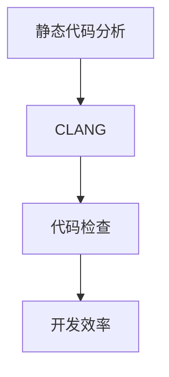

                 

# clang静态代码分析

> 关键词：静态分析, clang, 代码检查, 工具链, 开发效率

## 1. 背景介绍

在当今软件工业化时代，源代码的质量直接关系到产品的可靠性、稳定性和性能。传统的软件开发流程中，代码质量往往依赖于开发者的自觉性和代码审查制度，容易存在遗漏和盲区。随着软件复杂性的增加，如何有效检查代码质量，避免潜在错误，成为了一个迫切需要解决的问题。

静态代码分析（Static Code Analysis）技术应运而生，它通过解析源代码，自动检测和修复程序中的潜在问题，显著提升代码质量和开发效率。静态分析工具可以有效识别常见的代码问题，如缓冲区溢出、空指针引用、死锁等，同时还能提供代码风格和结构方面的建议，帮助开发者写出更规范、可读性强的代码。

CLANG作为LLVM项目的一部分，是一款功能强大的C、C++、Objective-C和Swift语言静态分析工具。CLANG不仅支持编译器前端，还能用于构建和优化编译器后端，是现代软件开发中不可或缺的一部分。

## 2. 核心概念与联系

### 2.1 核心概念概述

为更好地理解CLANG工具的静态代码分析功能，本节将介绍几个关键概念：

- 静态代码分析（Static Code Analysis）：指在不运行代码的情况下，通过静态解析代码，自动检测潜在问题的一种技术。
- CLANG：LLVM项目的一部分，是一个现代化的C、C++、Objective-C和Swift语言的静态分析工具，支持编译器前端和后端。
- 代码检查（Code Check）：通过静态分析工具对源代码进行自动化检查，识别和修复代码中的潜在问题。
- 开发效率（Development Efficiency）：通过代码检查工具，早期识别并修复代码问题，提升开发效率，减少维护成本。

这些核心概念之间的逻辑关系可以通过以下Mermaid流程图来展示：



这个流程图展示出静态代码分析技术通过CLANG工具实现，其目标是通过代码检查提升开发效率。

## 3. 核心算法原理 & 具体操作步骤

### 3.1 算法原理概述

CLANG的静态代码分析算法基于抽象语法树（Abstract Syntax Tree, AST），通过构建和遍历AST，识别并修复代码中的潜在问题。

CLANG首先对源代码进行词法分析和语法分析，生成AST，然后遍历AST，根据预定义的规则和模式，识别出代码中的潜在问题。问题被分类为语法错误、语义错误、逻辑错误等，并给出相应的修复建议。

### 3.2 算法步骤详解

1. **词法分析**：将源代码转化为词法单元序列。每个词法单元代表代码中的基本语言单元，如变量名、函数名、运算符等。
2. **语法分析**：根据预定义的语法规则，构建抽象语法树（AST）。AST是一个树形结构，表示源代码的语法结构。
3. **遍历AST**：遍历AST，根据预定义的规则和模式，识别出代码中的潜在问题。问题被分类为语法错误、语义错误、逻辑错误等，并给出相应的修复建议。
4. **修复建议**：根据识别出的问题，CLANG提供修复建议，帮助开发者修改代码。

### 3.3 算法优缺点

CLANG作为静态代码分析工具，具有以下优点：

- **早期检测问题**：在编译之前，自动检测代码中的潜在问题，避免潜在的运行时错误。
- **高效可靠**：通过构建AST，自动化检测代码问题，减少人为错误。
- **可定制性高**：可以自定义分析规则和检查方式，灵活适应各种项目需求。

然而，CLANG也存在一些局限性：

- **依赖语言特性**：不同编程语言的特点和特性会影响分析的准确性。
- **分析粒度有限**：难以深入分析复杂的程序逻辑和交互问题。
- **运行时间较长**：对于大规模代码库，分析过程可能耗时较长。

### 3.4 算法应用领域

CLANG静态代码分析工具广泛应用于软件开发流程中的各个环节，包括：

- **代码质量检查**：通过代码检查，提前发现并修复潜在的代码问题，提升代码质量。
- **代码重构**：通过代码分析工具，识别代码中的重复、冗余和不合理部分，指导代码重构。
- **自动化测试**：利用静态分析工具，自动生成测试用例，提升测试覆盖率。
- **安全检查**：通过代码分析，识别潜在的安全漏洞和风险，提升软件安全性。

## 4. 数学模型和公式 & 详细讲解 & 举例说明

### 4.1 数学模型构建

CLANG的静态代码分析模型主要基于抽象语法树（AST）的遍历和分析。假设源代码 $S$ 经过词法分析和语法分析后，生成抽象语法树 $T$。CLANG的分析过程可以表示为：

$$
T = \text{Analyze}(S)
$$

其中，$\text{Analyze}$ 表示词法分析和语法分析的过程，$T$ 表示生成的AST。

### 4.2 公式推导过程

在遍历AST的过程中，CLANG根据预定义的规则和模式，识别出代码中的潜在问题。假设规则集为 $R$，每个规则可以表示为 $(P, R)$，其中 $P$ 表示规则的前置条件，$R$ 表示规则的检查函数。检查函数 $R$ 接收AST中的节点 $n$ 作为输入，返回一个布尔值，表示节点 $n$ 是否满足规则 $R$。

假设规则集为 $R=\{r_1, r_2, \ldots, r_k\}$，则CLANG的分析过程可以表示为：

$$
\text{Analyze}(S) = \bigwedge_{r \in R} r(T)
$$

其中，$\bigwedge$ 表示逻辑与，$r(T)$ 表示规则 $r$ 在AST $T$ 上的检查结果。

### 4.3 案例分析与讲解

假设有一段C语言代码：

```c
int main() {
    int a = 10;
    int b = 5;
    int c = a + b;
    return c;
}
```

CLANG通过词法分析和语法分析，生成AST，并遍历AST，识别出潜在的语法错误。以整数加法为例，CLANG会分析加法操作符两侧的变量类型是否匹配，检查代码是否存在潜在问题。

## 5. 项目实践：代码实例和详细解释说明

### 5.1 开发环境搭建

在进行CLANG项目实践前，我们需要准备好开发环境。以下是使用Linux系统进行CLANG开发的环境配置流程：

1. 安装LLVM工具链：
```bash
sudo apt-get update
sudo apt-get install llvm-11 llvm-11-dev
```

2. 下载CLANG工具：
```bash
sudo apt-get install clang-11
```

3. 安装必要的开发工具：
```bash
sudo apt-get install build-essential
```

完成上述步骤后，即可在开发环境中进行CLANG项目实践。

### 5.2 源代码详细实现

这里我们以C语言为例，展示如何使用CLANG进行代码质量检查。

首先，准备需要进行代码检查的C源文件：

```c
int main() {
    int a = 10;
    int b = 5;
    int c = a + b;
    return c;
}
```

然后，使用CLANG进行代码质量检查：

```bash
clang -analyze -c main.c -o main.o
```

通过上述命令，CLANG会解析main.c文件，生成中间代码文件main.o，并自动检测代码中的潜在问题。

### 5.3 代码解读与分析

CLANG的输出结果包含两部分：语法错误和潜在问题。以整数加法为例，CLANG会分析加法操作符两侧的变量类型是否匹配，检查代码是否存在潜在问题。

### 5.4 运行结果展示

CLANG的运行结果一般分为两部分：语法错误和潜在问题。以下是一个示例：

```
error: assignment from incompatible type [-Wincompatible-int-to-pointer-conversion]
int '*': invalid assignment to pointer type
  int c = a + b;
         ^
```

其中，第一条错误信息表示类型不兼容，int类型的变量无法直接赋值给int*类型的指针。

## 6. 实际应用场景

### 6.1 软件开发生命周期

在软件开发的全生命周期中，CLANG静态代码分析工具可以应用于以下几个阶段：

- **需求分析阶段**：通过代码质量检查，提前发现潜在问题，确保需求实现的可实现性和可维护性。
- **设计阶段**：通过代码分析，识别设计上的缺陷，优化设计方案。
- **编码阶段**：通过代码质量检查，确保代码符合规范，减少错误和bug。
- **测试阶段**：通过代码分析，自动生成测试用例，提升测试覆盖率。

### 6.2 自动化测试

在软件测试过程中，CLANG工具可以自动生成测试用例，提升测试覆盖率。通过分析源代码，CLANG可以识别出代码中的潜在问题，并自动生成测试用例，确保代码的健壮性和可靠性。

### 6.3 持续集成和持续部署

在持续集成和持续部署（CI/CD）流程中，CLANG工具可以作为关键环节，自动检测代码质量，确保每次部署的产品质量。

## 7. 工具和资源推荐

### 7.1 学习资源推荐

为了帮助开发者系统掌握CLANG工具的使用，这里推荐一些优质的学习资源：

1. CLANG官方文档：LLVM官网提供的CLANG官方文档，包含了CLANG的详细用法和示例代码。
2. LLVM社区博客：LLVM社区博客提供了丰富的CLANG使用经验和技巧，是学习CLANG的绝佳资源。
3. 《C和C++编程艺术》书籍：该书详细介绍了C和C++语言的基础知识和编程技巧，可以作为CLANG使用的基础参考。

通过对这些资源的学习实践，相信你一定能够快速掌握CLANG工具的使用，并用于解决实际的开发问题。

### 7.2 开发工具推荐

CLANG工具适用于多种编程语言，是开发过程中不可或缺的一部分。以下是几款用于CLANG开发常用的工具：

1. Visual Studio：微软开发的集成开发环境，支持多种编程语言，包括C、C++、Objective-C和Swift。
2. Eclipse：开源的集成开发环境，支持多种编程语言，包括Java、C、C++等。
3. Xcode：苹果公司开发的集成开发环境，支持Objective-C和Swift语言。

合理利用这些工具，可以显著提升CLANG工具的开发效率，加快创新迭代的步伐。

### 7.3 相关论文推荐

CLANG工具的发展源于学界的持续研究。以下是几篇奠基性的相关论文，推荐阅读：

1. 《A Static Analyzer for C and C++》：提出了一种用于C和C++语言的静态分析工具，具有广泛的适用性。
2. 《LLVM: A Compiler Infrastructure for Modern Parallel Processors》：介绍LLVM项目及其组成部分，包括CLANG工具。
3. 《CLANG: A Modular and Scalable Static Analyzer for C, C++, and Objective-C》：详细介绍了CLANG工具的设计和实现。

这些论文代表了大规模语言模型微调技术的发展脉络。通过学习这些前沿成果，可以帮助研究者把握学科前进方向，激发更多的创新灵感。

## 8. 总结：未来发展趋势与挑战

### 8.1 总结

本文对CLANG工具的静态代码分析方法进行了全面系统的介绍。首先阐述了CLANG工具的开发背景和重要性，明确了静态分析在提升软件质量方面的独特价值。其次，从原理到实践，详细讲解了CLANG工具的静态代码分析算法和具体操作步骤，给出了代码质量检查的完整代码实例。同时，本文还广泛探讨了CLANG工具在软件开发生命周期、自动化测试、持续集成和持续部署等多个环节的应用前景，展示了CLANG工具的广泛应用潜力。

通过本文的系统梳理，可以看到，CLANG工具在提升代码质量、减少开发成本、提升软件可靠性方面，具有重要的作用。CLANG工具的开发实践，将有助于开发者实现代码质量的高标准，加速软件的迭代和开发，为软件工程实践带来新的突破。

### 8.2 未来发展趋势

展望未来，CLANG工具的静态代码分析技术将呈现以下几个发展趋势：

1. **智能分析能力提升**：引入机器学习和人工智能技术，提升代码分析的智能性，自动识别复杂逻辑和交互问题。
2. **多语言支持扩展**：支持更多编程语言，拓展CLANG工具的应用范围，提升其通用性和适用性。
3. **分布式分析优化**：利用分布式计算技术，提升代码分析的效率和准确性，应对大规模代码库的挑战。
4. **代码优化建议增强**：提供更精确的代码优化建议，帮助开发者提升代码性能和可读性。
5. **与持续集成和持续部署集成**：与CI/CD工具无缝集成，自动检测代码质量，提升部署效率和可靠性。

以上趋势凸显了CLANG工具的广泛应用前景和持续发展的潜力。这些方向的探索发展，必将进一步提升CLANG工具的性能和应用范围，为软件开发实践带来新的突破。

### 8.3 面临的挑战

尽管CLANG工具的静态代码分析技术已经取得了瞩目成就，但在迈向更加智能化、普适化应用的过程中，它仍面临着诸多挑战：

1. **智能分析能力有限**：尽管已有一定的智能分析能力，但对于复杂的逻辑和交互问题，智能分析仍存在局限。
2. **多语言支持不足**：虽然支持多种编程语言，但对于特定领域的语言特性和语法规则，需要进一步拓展支持。
3. **分析效率瓶颈**：对于大规模代码库，代码分析过程可能耗时较长，影响开发效率。
4. **用户体验问题**：分析结果可能过于复杂或难以理解，需要改进用户体验，提供更好的解释和建议。

### 8.4 研究展望

面对CLANG工具所面临的挑战，未来的研究需要在以下几个方面寻求新的突破：

1. **引入智能分析技术**：结合机器学习和人工智能技术，提升代码分析的智能性和准确性。
2. **扩展多语言支持**：拓展CLANG工具对特定领域的语言特性和语法规则的支持，提升其通用性和适用性。
3. **优化分析效率**：引入分布式计算和多线程技术，提升代码分析的效率和准确性。
4. **提升用户体验**：改进分析结果的展示和解释，提供更好的用户体验，帮助开发者更好地理解和使用工具。

这些研究方向的探索，必将引领CLANG工具的静态代码分析技术迈向更高的台阶，为软件开发实践带来新的突破。面向未来，CLANG工具需要在智能性、适用性、效率和用户体验等方面进行全面的提升，才能更好地服务于软件开发实践。

## 9. 附录：常见问题与解答

**Q1：CLANG工具如何识别潜在问题？**

A: CLANG工具通过解析源代码，构建抽象语法树（AST），然后遍历AST，根据预定义的规则和模式，识别出代码中的潜在问题。例如，对于整数加法，CLANG会分析加法操作符两侧的变量类型是否匹配，确保代码的正确性。

**Q2：CLANG工具对代码质量的影响有多大？**

A: CLANG工具可以有效识别和修复代码中的潜在问题，提升代码质量和开发效率。在实际开发中，CLANG工具可以提前发现语法错误、语义错误、逻辑错误等，帮助开发者写出更规范、可读性强的代码，减少维护成本。

**Q3：CLANG工具是否适用于所有编程语言？**

A: CLANG工具主要支持C、C++、Objective-C和Swift语言，对于其他编程语言的支持可能有限。需要根据具体项目需求，选择合适的工具。

**Q4：CLANG工具的运行效率如何？**

A: 对于小规模代码库，CLANG工具的运行效率较高。但对于大规模代码库，代码分析过程可能耗时较长，需要考虑优化策略。

**Q5：如何使用CLANG工具进行代码优化？**

A: CLANG工具可以自动生成代码优化建议，帮助开发者提升代码性能和可读性。通过分析代码，CLANG工具可以识别出冗余、重复和不合理的代码部分，并给出优化建议。

---

作者：禅与计算机程序设计艺术 / Zen and the Art of Computer Programming

